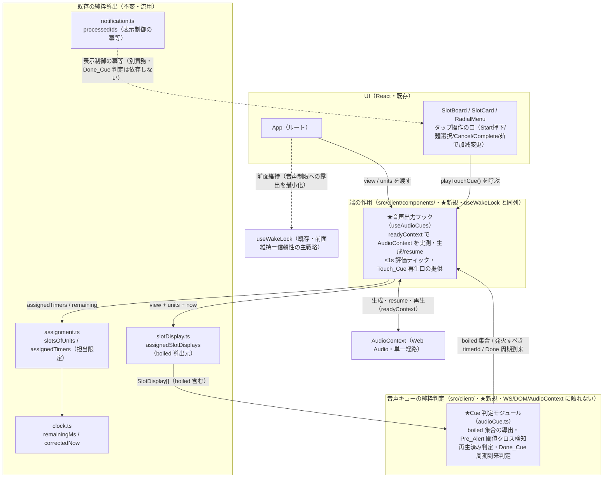
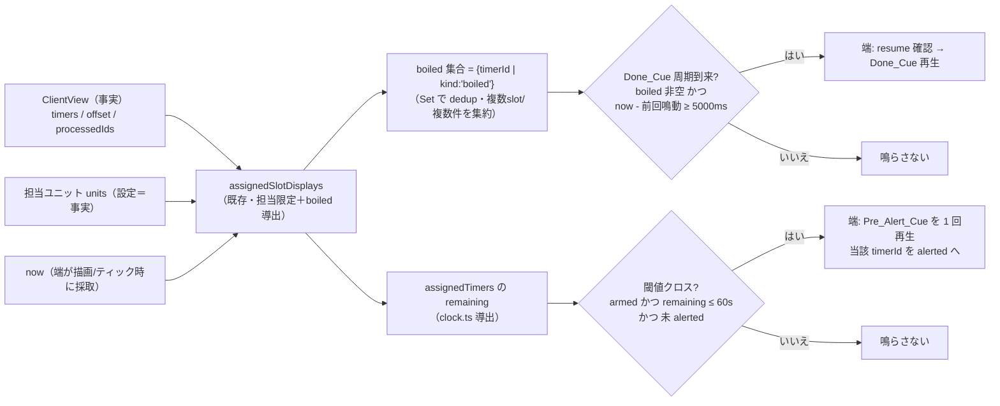
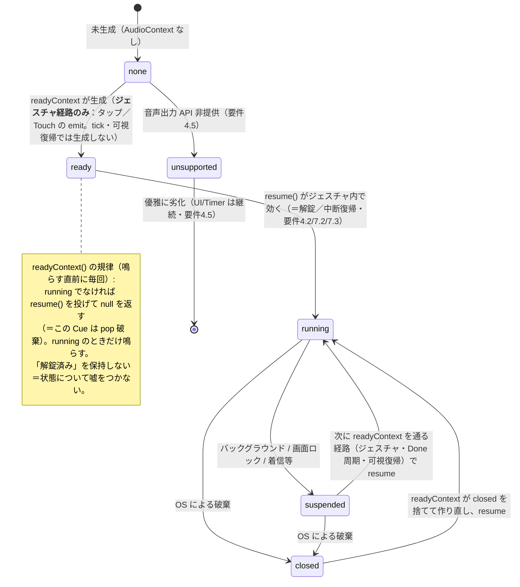
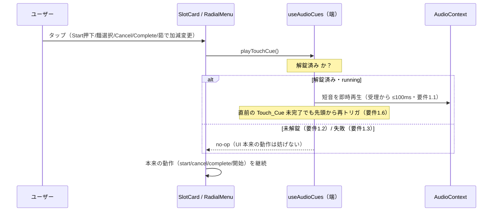

# 技術設計書 — 音声キュー（audio-cues）

## この設計が拠って立つもの

本設計は `requirements.md`（全7要件・EARS 記法・確定事項済み）と、ステアリング四点（`design-philosophy.md` / `naming.md` / `timer-model.md` / `tooling.md`）を前提とする。設計判断はすべてこの二つから演繹される。本 spec は既存パイロット `yude-men-timer` の **iPad_Client（React フロント）** に「画面を見続けなくても音で進行を把握できる」3 種の音（Touch_Cue / Pre_Alert_Cue / Done_Cue）を加える。狙いは「厨房スタッフへの善」——とりわけ**茹で上がりの上げ忘れを音で取りこぼさない**ことにある。

哲学を本機能の構造へ翻訳した骨格は次の 8 点である。本設計の全節はこの骨格の展開にすぎない。

1. **音声経路は AudioContext（Web Audio）の単一経路に一本化する** — 解錠・鳴動・自己回復をすべて同一の AudioContext（Audio_Session）で扱う。HTML `<audio>` 要素経路は導入しない（ユーザー確定）。経路を一本に絞ることで、解錠状態・suspended/interrupted の回復を一箇所で完結させ、二つの音声経路がズレる余地を構造的に消す（重複の根絶）。

2. **計算と作用を分離し、クライアントへ徹底する** — 「鳴らすか否か」の判定（boiled 集合の導出・Pre_Alert 閾値クロスの検知・再生済みの判定・Done_Cue の周期到来判定）は **WS も DOM も時計も AudioContext も持たない決定的な純粋関数**に寄せる（`src/client/` 配下の純粋モジュール）。実際の音声出力（AudioContext の生成・resume・再生）は**端の作用**として React フックへ隔離する（`src/client/components/`・既存 `useWakeLock` と同列）。

3. **導出値を状態に昇格させない** — remaining は `endTime`（事実）と補正後現在時刻からの導出に保ち（既存 `clock.ts` をそのまま使う）、状態として持たない。boiled 集合も毎評価で `slotDisplay.ts` の表示導出から関数的に求め、独立した状態にしない。Done_Cue を鳴らすか否かは「現在の boiled 集合」の関数であって、done 通知の受信回数ではない（要件3.2 / 3.7）。

4. **SSOT を侵さない — client 端の作用に閉じる** — 本機能はサーバ状態（SSOT）・状態遷移（`decide`）・ワイヤ表現（`TimerFact` / メッセージ型）に一切触れない。`src/engine/` / `src/domain/` / `src/shell/` を一文字も変更しない。音声の鳴動可否・Audio_Session の状態・「鳴らした事実」を `ClientView` や永続ブロブへ書き戻さない（要件3.9 / 4.7 / 5.4 / 7.7）。

5. **担当スロット限定は既存の純粋導出に委ねる** — Pre_Alert_Cue・Done_Cue の対象は `assignment.ts`（`slotsOfUnits` / `assignedTimers`・any-overlap 射影）と `slotDisplay.ts`（`kind: "boiled"`）が導く担当範囲に限る。新たな担当判定を発明せず、表示が出るのと同じ集合に音を載せる（要件2.2 / 3.5）。

6. **既存資産の延長・二重定義の根絶** — 残り導出（`clock.ts`）・担当射影（`assignment.ts`）・表示導出（`slotDisplay.ts`）・通知の冪等（`notification.ts` の `processedIds` / `shouldHandleDone` / `markProcessed`）の思想をそのまま延長する。とりわけ **表示制御の冪等は引き続き `notification.ts` が担い、Done_Cue の鳴動可否はそれに依存せず boiled 導出で判定する**——という役割分担を構造で明示する（要件3.10）。作用フックは `useWakeLock` の規律（可視時のみ・前面復帰のたびに取り直す・優雅な劣化）を手本にする。

7. **音声信頼性の主戦略は前面維持（Wake_Lock）** — バックグラウンド再生と戦うのではなく、既存 `useWakeLock` による前面・画面点灯維持で OS の音声制限（suspended 化・interrupted 化）への露出そのものを最小化する。本 spec は Wake_Lock を**再実装せず依存するのみ**で、音声信頼性が前面維持を前提に成り立つという依存関係を述べる（要件5.8 / 5.9）。

8. **best-effort と視覚正本** — 音は環境が許す範囲で鳴らす強化であって、正しさを音声に依存させない。Silent_Switch のようなハードウェア制約は受容する。音が鳴らない環境でも boiled の**視覚表示**（`slotDisplay.ts` の boiled）とカウントダウンが信頼できる正本として継続する（要件7.8 / 7.9）。

> **非目標（要件で確定済み）:** 主アラーム（Done_Cue）の信頼性を Web Push / Service Worker の背景通知に依存させない。音声ガイド（speechSynthesis による読み上げ・発話）はスコープ外。本 spec が扱うのは「音（トーン）」のみ。

---

## Overview

### 目的

iPad_Client に、サーバ状態へ一切触れない **client 端の音声キュー機構**を加える。3 種の音を、いずれも導出値とローカルな表示制御情報のみに基づいて鳴らす。

| 音 | 契機 | 性質 | 対象 |
| --- | --- | --- | --- |
| **Touch_Cue** | 指定された UI 操作（タップ）の受理 | ワンショット（100ms 以内に開始） | UI 操作そのもの |
| **Pre_Alert_Cue** | 担当 Timer の remaining が 60 秒超 → 60 秒以下へ**初めて**遷移 | 各 timerId につき高々 1 回 | Assigned_Slots の Timer |
| **Done_Cue** | Assigned_Slots に boiled な Timer が 1 つ以上ある | **持続アラーム**（boiled が残る限り 5 秒間隔で繰り返し） | Assigned_Slots の Timer |

### スコープ

- 上記 3 種の音の鳴動判定（純粋）と音声出力（端の作用）。
- iOS PWA における解錠（ジェスチャ内 `resume()`。warm-up は持たない）。
- Audio_Session の自己回復（emit／ジェスチャ／可視復帰のたびの `resume()`。closed は readyContext が作り直す）。Done の 5 秒周期を回復の機会として内包する。

### スコープ外（要件で確定済み）

- **サーバ core（`src/engine/`）・ドメイン契約（`src/domain/`）・shell（`src/shell/`）の変更** — 一切行わない。
- **Web Push / Service Worker 背景通知への信頼性依存** — 用いない。
- **音声ガイド（読み上げ・発話）** — `speechSynthesis` を使わない。
- **Wake_Lock の再実装** — 既存 `useWakeLock` に依存するのみ。
- **HTML `<audio>` 要素経路** — 導入しない。音声経路は AudioContext 単一。

### 対象実行環境と正直な限界

対象は **iOS 上の PWA（standalone）**。iOS の制約を前提に設計する。

- **自動再生制限** — 最初のユーザージェスチャ内で `resume()` が効くまで、Pre_Alert / Done は鳴らない（要件4.3）。
- **suspended / interrupted への遷移** — バックグラウンド・画面ロック・着信・他アプリ音声で Audio_Session が止まり、前面復帰しても自動では running へ戻らない。明示的 resume を要する（要件7.2 / 7.3）。
- **resume が効かない / closed** — 一部 iOS で resume の Promise がハングする。解錠フラグを持たず毎回 state を実測する設計ゆえ、次に readyContext を通る経路（タップ・Done 周期・可視復帰）で再試行され、closed は作り直す（要件7.4）。
- **Silent_Switch（ハードウェアミュート）** — Web 側から回避できない。受容し、視覚正本で劣化する（要件7.9）。

---

## Architecture

### クライアント二層構成（純粋判定を端の作用から隔離する）

要件は「鳴らすか否かの判定（計算）」と「音声出力（作用）」の分離を求める（design-philosophy「計算と作用の分離」）。これを次の二層として構造化する。`★` が本 spec で新規に書くもの。



- **Cue 判定モジュール（純粋）** — 「鳴らすか否か」だけを決める決定的関数群。入力は `ClientView` / 担当ユニット / 現在時刻 / ローカルな表示制御情報（Pre_Alert の観測位相・前回 Done 鳴動時刻）であり、出力は「発火すべき timerId 群」「Done 周期が到来したか」などのデータ。AudioContext を一切知らない。boiled 集合は `slotDisplay.ts` の `assignedSlotDisplays` から導出して二重定義しない。
- **音声出力フック（端の作用）** — AudioContext のライフサイクルを所有し、純粋判定の出力を受けて実際に音を鳴らす。鳴らせるかは保持せず、`readyContext()` が鳴らす直前に `state` を実測する（running なら鳴らす・違えば resume を投げて pop 破棄）。生成・resume・closed の作り直し・≤1s 評価ティック・Done の 5 秒周期・Touch_Cue の再生口を担う。`useWakeLock` の規律（可視時のみ・前面復帰のたびに取り直す・優雅な劣化）を手本にする。

> **なぜ音声出力フックが「端の唯一の所有者」か:** AudioContext は in-memory の生きた実行資源であり、解錠状態・suspended/interrupted・closed という可変な実行状態を抱える。これを複数箇所で生成・resume すると、二つの音声経路が解錠状態でズレ、回復ロジックが分裂する。所有を一点に絞ることで、判定（純粋）はデータだけを返し、作用（端）は AudioContext を一望して回復させられる（計算と作用の分離）。

### 鳴動判定のデータフロー（view + units + now → boiled 集合 → 鳴動可否）



鳴動主体は「現在の boiled 集合」であって done 通知の回数ではない。boiled 集合は `Set<timerId>` ゆえ、同一 timerId の done 重複・複数スロット駆動・複数件同時 boiled のいずれも集約され、Done_Cue は周期ごとに 1 回へ畳まれる（要件3.6 / 3.7）。

### Audio_Session の状態（解錠状態は保持せず、鳴らす直前に readyContext が実測する）

「解錠済み」という状態を**持たない**。それは `AudioContext.state` の導出値にすぎず、別に保持すると二つの真実が生まれて同期が要る（過去にこの実装で iOS の解錠がデッドロックした）。代わりに、鳴らす直前に `readyContext()` が AudioContext の今を読み、`running` のときだけ鳴らす。`running` でなければ `resume()` を投げて今回は **pop 破棄**（鳴らないノードを撃たない＝滞留もしない）。`resume()` はジェスチャ内で叩かれて初めて iOS を解錠するため、解錠も中断からの回復も「専用ループ」を持たず emit に内包される。



- **none** — AudioContext 未生成。生成は **ユーザージェスチャ経路でのみ**行う（`readyContext(allowCreate=true)`：汎用タップリスナと Touch の emit）。tick（setInterval）・可視復帰は `allowCreate=false` で、既存 ctx が無ければ何もしない。**iOS は「ジェスチャ内で生成した AudioContext」しか running へ上げられず、非ジェスチャ（tick 等）で先に生成すると後続のジェスチャ resume が効かず suspended のまま固まる**ため、生成タイミングをジェスチャに縛るのは必須条件（実機で確認した回帰の根因）。
- **ready→running** — `resume()` は**ジェスチャ内**で叩かれて初めて iOS を `running` へ移す。Touch は指定操作（ジェスチャ）から emit されるため最初の Start タップが解錠点になり、汎用ジェスチャリスナ（capture）も任意のタップで resume を叩く。
- **suspended** — バックグラウンド・画面ロック・着信等で停止。次に `readyContext()` を通る経路（タップ・5 秒ごとの Done・可視復帰）で `resume()` され回復する。回復は emit に内包され、専用の監視ループを持たない。
- **closed** — OS が破棄した状態。`readyContext()` が `closed` を検知したら参照を捨てて新規生成し直す。
- **unsupported** — `AudioContext` / `webkitAudioContext` を提供しない環境。リスナも張らず何もせず劣化する（要件4.5）。`ctx.sampleRate` には干渉しない（正常値はデバイス任せで、特定値で弾くと無音化するため）。

> **解錠と自己回復を「別管理」しない理由（emit への内包）:** 以前は解錠確定（onended / resume 成功の確認）と Done 周期での resume を個別に管理していたが、iOS で resume の Promise がハングし、確定経路が 1 本きりだったため永久未解錠に陥った。教訓は「回復経路を慎重さのために 1 本へ絞ると、それが詰まると詰む」。新設計は逆に、全 Cue が `readyContext()` を通り、そこで毎回 `running` を実測し・必要なら `resume()` を叩く。Done は boiled が在る間 5 秒ごとに必ず emit を通る＝**回復の機会が周期そのものに内包**される（要件7.5/7.6 を専用コードなしで満たす）。Touch・可視復帰も同じ口を通るので、回復経路は常に複数開いている。

> **解錠は「実測」で扱う（warm-up / onended に頼らない）:** 当初は iOS の定石どおり無音バッファを warm-up し、その `onended` 発火で解錠成立とみなす実装だった。しかし iOS では `resume()` の Promise がハングし、解錠の確定経路が `onended`（これも不発しうる）に偏っていたため、`touchstart` で `warming` フラグが立ったまま後続の `touchend`/`click` がブロックされ、永久未解錠に陥った（実機で確認）。教訓は「`unlocked` という状態は `AudioContext.state` の写しにすぎず、保持して同期しようとすると詰まる」。
>
> 新設計は warm-up も解錠フラグも持たない。鳴らす直前に `readyContext()` が `state` を実測し、`running` でなければ `resume()` を投げて pop 破棄するだけ。解錠リスナ（`touchstart`/`touchend`/`click`/`keydown` を capture フェーズ）は「resume を叩く」だけの軽い口で、`running` 時は素通りするため張りっぱなしでよく、解除の儀式も要らない。これは設計哲学「導出値を状態に昇格させない」「真＝状態について嘘をつかない（保持した解錠フラグで嘘をつかず、毎回 state を読む）」の直接の帰結であり、外部ライブラリにも依存しない。

---

## Components and Interfaces

> 本節は型シグネチャで責務境界を定める。**ここに現れる公開シンボル名（純粋判定関数名・フック名・型名・設定フィールド名・localStorage キー・概念名）は、命名規律 `naming.md` に従いユーザー確認を経て確定済みである**（末尾「公開シンボル命名（確定・ユーザー承認済み）」節に一覧する）。`Manager` / `Service` / `Handler` / `Util` 等の汎用語は用いない。

### ディレクトリ配置（core/domain/shell 不変・client 限定）

| 置き場所 | 内容 | 純度 | 理由 |
| --- | --- | --- | --- |
| `src/client/audioCue.ts`（★新規） | boiled 集合導出・Pre_Alert 閾値クロス判定・Done_Cue 周期到来判定の純粋関数群 | 純粋 | 「鳴らすか否か」を WS/DOM/AudioContext から隔離。property で機械検証する核。 |
| `src/client/components/useAudioCues.ts`（★新規） | Audio_Session の生成/解錠/resume/再生成・≤1s 評価ティック・Done_Cue 5 秒周期・Pre_Alert 発火・Touch_Cue 再生口 | 端（I/O） | 音声出力という作用を一点に隔離。`useWakeLock` と同列・同規律。 |
| `src/client/components/slotDisplay.ts`（既存・不変） | `assignedSlotDisplays`（boiled 導出元） | 純粋 | boiled 集合は既存の表示導出から取り、二重定義しない。 |
| `src/client/assignment.ts`（既存・不変） | `slotsOfUnits` / `assignedTimers` | 純粋 | 担当限定は既存導出をそのまま使う。 |
| `src/client/clock.ts`（既存・不変） | `remainingMs` / `correctedNow` | 純粋 | remaining 導出はこの既存純粋関数をそのまま使う。 |
| `src/client/notification.ts`（既存・不変） | `processedIds` / `shouldHandleDone` / `markProcessed` | 純粋 | 表示制御の冪等を引き続き担う（Done_Cue 判定は依存しない）。 |
| `src/client/components/useWakeLock.ts`（既存・不変） | 前面・画面点灯維持 | 端 | 音声信頼性の前提。依存するのみ・再実装しない。 |
| `tests/client/`（追加） | 上記純粋層の property / example、端の統合・smoke | — | 既存 `tests/client` 規約に従う。 |

### Cue 判定モジュール（純粋・本機能の鳴動判定の核）

「鳴らすか否か」だけを決める決定的関数群。AudioContext を一切知らず、時刻・観測位相は引数で受け取る。

```ts
// src/client/audioCue.ts — 純粋。WS/DOM/AudioContext/時計に触れない（時刻は引数）。
// ※ 関数名・型名・定数名はすべて公開シンボルであり、命名確認を経て確定済み（naming.md）。

import type { SlotDisplay } from "./components/slotDisplay";
import type { TimerFact } from "../domain/timer";

/** Pre_Alert のしきい（残り 60 秒）。要件記述の Pre_Alert_Threshold。 */
const PRE_ALERT_THRESHOLD_MS = 60_000;
/** Done_Cue のリピート間隔（5 秒）。要件記述の Done_Cue_Interval。 */
const DONE_CUE_INTERVAL_MS = 5_000;

/**
 * boiled 集合の導出 — Done_Cue の鳴動主体。
 *
 * 既存の表示導出 SlotDisplay[] から kind:"boiled" の timerId を Set で集める。
 * Set ゆえ複数スロット駆動・複数件同時 boiled は dedup され、Done_Cue 周期ごと 1 回へ集約される。
 * 担当外スロットは assignedSlotDisplays の射影で構造的に現れない（要件3.5 / 3.6 を導出で担保）。
 */
function boiledTimerIds(displays: readonly SlotDisplay[]): ReadonlySet<string>;

/**
 * Done_Cue の周期到来判定 — 「鳴らすか否か」は現在の boiled 集合の関数（要件3.2 / 3.7）。
 *
 * boiled が非空、かつ「前回鳴動から interval 経過（前回が無ければ即時可）」のとき true。
 * done 通知の受信回数には一切依存しない。boiled が空なら常に false（停止・要件3.4）。
 * lastRingAt は端が抱える「最後に Done_Cue を鳴らした時刻」（SSOT ではない作用ローカルな計時情報）。
 */
function dueDoneCue(
  boiled: ReadonlySet<string>,
  now: number,
  lastRingAt: number | null,
  intervalMs?: number,           // 既定 DONE_CUE_INTERVAL_MS
): boolean;

/**
 * Pre_Alert の観測位相 — timerId 基準の表示制御用ローカル情報（SSOT のコピーではない・要件2.7）。
 *
 *   - armed   : remaining > 閾値 で観測済み（閾値クロスを発火できる待機状態）。
 *   - alerted : Pre_Alert 発火済み、または「出現時に既に ≤ 閾値」で失格（once-only を担う）。
 * どちらにも無い timerId は「未観測」。notification.ts の processedIds と同じローカル冪等の構図。
 */
interface PreAlertWatch {
  readonly armed: ReadonlySet<string>;
  readonly alerted: ReadonlySet<string>;
}

/** 空の観測位相（初期値）。 */
const EMPTY_PRE_ALERT_WATCH: PreAlertWatch;

/**
 * Pre_Alert 閾値クロスの検知 — (前回位相, 担当 Timer 群, now) → (発火 timerId 群, 次位相)。
 *
 * 各担当 Timer の remaining（endTime と offset と now から導出）を見て:
 *   - 未観測 かつ remaining > 閾値        → armed へ（発火しない）
 *   - armed かつ remaining ≤ 閾値         → 発火し alerted へ（要件2.1）
 *   - 未観測 かつ remaining ≤ 閾値（≤0含む）→ alerted へ直行（出現時既に閾値以下＝失格・要件2.5）
 *   - alerted                              → 何もしない（once-only・要件2.4）
 * 入力 assigned に居ない timerId は armed/alerted から落とす（done/cancel で記録破棄・要件2.10）。
 * 担当外 Timer は呼び出し側が assignedTimers で除外済み（要件2.2）。純粋・決定的。
 */
function advancePreAlert(
  prev: PreAlertWatch,
  assigned: readonly TimerFact[],
  offset: number,
  now: number,
  thresholdMs?: number,          // 既定 PRE_ALERT_THRESHOLD_MS
): { readonly fire: readonly string[]; readonly next: PreAlertWatch };
```

各関数の責務境界:

| 関数 | 入力 | 出力 | 担保する要件 |
| --- | --- | --- | --- |
| `boiledTimerIds` | `SlotDisplay[]`（担当限定済み） | boiled な timerId 集合（dedup 済み） | 3.5, 3.6（集約） |
| `dueDoneCue` | boiled 集合 / now / 前回鳴動時刻 | 周期到来の真偽 | 3.1, 3.2, 3.4, 3.7（done 回数非依存） |
| `advancePreAlert` | 前回位相 / 担当 Timer / now | 発火 timerId 群 / 次位相 | 2.1, 2.4, 2.5, 2.10 |

> **なぜ Pre_Alert に「armed」位相を要するか（出現時既に閾値以下を弾く）:** 要件2.1 は「60 秒超から 60 秒以下へ**初めて遷移**」を発火条件にし、要件2.5 は「出現時点で既に ≤ 閾値なら鳴らさない」と命じる。両者を満たすには「その Timer を一度でも閾値超で観測したか」を知る必要がある。`armed` は「閾値超で観測済み＝クロスを発火する資格がある」を表す最小の事実であり、これを持たずに `remaining ≤ 閾値` だけで発火すると、残り 50 秒で開始した Timer が出現直後に誤って鳴る。`alerted` は once-only と失格の両方を 1 つの「もう発火しない」集合へ畳む（重複の根絶）。

> **なぜ boiled 判定に notification.ts の `processedIds` を使わないか（役割分担の明示）:** `processedIds` は done / cancelled の**表示制御**（カウントダウン停止・通知の二重提示防止）のためのワンショット記録であり、Alarm の at-least-once な done 重複を弾く。一方 Done_Cue は「現在 boiled が残っているか」という**持続状態**で鳴る。両者の判定基盤を分けることで、(a) done が二度届いても boiled 集合は冪等（Set）ゆえ鳴動周期は二重化せず（要件3.7）、(b) `markProcessed` 済みでも boiled が残る限り Done_Cue は鳴り続ける（要件3.10）。`processedIds` は引き続き `notification.ts` / `connection.ts` の既存責務のまま不変で、本機能はそこに相乗りしない。

### 音声出力フック（端の作用・Audio_Session の唯一の所有者）

Audio_Session（AudioContext）のライフサイクルを所有し、純粋判定の出力を受けて音を鳴らす。`useWakeLock` と同じ「可視時のみ・前面復帰のたびに取り直す・優雅な劣化」の規律に従う。

```ts
// src/client/components/useAudioCues.ts — 端。AudioContext の生成/解錠/resume/再生成・評価ティック・再生。
// 純粋判定（audioCue.ts）にデータを問い、自身は世界（音）を変えるだけ。
// ※ フック名・返り値の口の名・オプション名は公開シンボルであり、命名確認を経て確定済み（naming.md）。

import type { ClientView } from "../connection";

interface AudioCues {                            // 返り値の口
  /** 指定された UI 操作（タップ）から呼ぶ Touch_Cue の再生口。未解錠・無効・失敗時は no-op（要件1）。 */
  readonly playTouchCue: () => void;
}

interface AudioCuesOptions {
  /** 現在時刻の採取。既定 Date.now（remaining 導出・周期判定・受信時刻に用いる・テストで差し替え）。 */
  readonly now?: () => number;
  /** 評価ティック間隔（ミリ秒）。既定 1000（≤1000 を保つ・Pre_Alert を 1 秒以内に判定・要件2.9 / 3.3）。 */
  readonly tickMs?: number;
}

/**
 * 音声キュー機構をマウント中だけ動かす端のフック。
 *
 * 担うのは作用の配線だけ（判定は audioCue.ts に委ねる）。鳴らせるかは保持せず、鳴らす直前に readyContext() が
 * AudioContext の今を実測する（解錠フラグを持たない）:
 *   - readyContext — AudioContext を用意し（無ければ生成・closed なら作り直す）、running なら返す。running でなければ
 *     resume() を投げて null を返す（＝この Cue は pop 破棄・鳴らないノードを撃たない）。非対応環境は null（要件4.5）。
 *   - 解錠 — resume() はジェスチャ内で叩かれて初めて iOS を running にする。汎用ジェスチャリスナ（capture）と
 *     Touch（指定操作）の emit が readyContext を通すため、最初のタップが解錠点になる（要件4.1/4.2）。解錠フラグは
 *     持たず、リスナ解除の儀式もない（running 時は readyContext を素通り）。
 *   - 評価ティック — tickMs ごとに now を採取し、assignedSlotDisplays → boiledTimerIds で boiled 集合、
 *     assignedTimers + advancePreAlert で Pre_Alert 発火群を導出する（純粋）。
 *   - Pre_Alert（イベント型）— fire の各 timerId につき emit（running なら鳴る・撃ち捨て・要件2.1/2.8）。
 *   - Done（状態型）— boiled が在る間、lastRingAt で 5 秒ペースを刻んで emit。ペースは撃とうとした時刻で進める
 *     （鳴否に依存しない＝撃ちっぱなし）。boiled 空で lastRingAt 解除、次の非空化で 1 秒以内に最初の一発（要件3.1/3.3/3.4）。
 *   - 可視復帰 — visibilitychange→visible で readyContext（resume を試みる）→即時再評価（要件5.2/5.3）。
 *   - 自己回復 — 専用ループを持たない。resume は emit／ジェスチャ／可視復帰が readyContext を通すたびに叩かれ、
 *     Done は 5 秒ごとに必ず readyContext を通るため、中断からの回復が周期に内包される（要件7.5/7.6）。closed は
 *     readyContext が作り直す（要件7.4）。ctx.sampleRate には干渉しない（特定値で弾くと無音化するため）。
 *
 * これらはすべてサーバ状態・状態遷移・ワイヤ表現を変えない（要件1.4/7.10）。失敗は握り潰す（best-effort・要件1.3/3.11）。
 */
function useAudioCues(view: ClientView, units: readonly number[], options?: AudioCuesOptions): AudioCues;
```

> **なぜフックが view と units を引数に取るか（導出値を状態に昇格させない）:** フックは boiled 集合・remaining・発火対象を**自前の状態として持たない**。毎ティックで `view`（事実）と `units`（設定）と `now` から純粋導出し直す。フックが抱える可変は AudioContext という実行資源と、`lastRingAt`（最後に鳴らした時刻）・`PreAlertWatch`（観測位相）という**作用ローカルな計時/位相情報**だけであり、いずれも SSOT（`ClientView` / サーバ / 永続ブロブ）へ書き戻さない（要件3.9 / 4.7 / 5.4 / 7.7）。

### Touch_Cue の配線（指定された UI 操作のみ）

`useAudioCues` は `playTouchCue()` を返す。これを**再生対象として指定された操作**——Start ボタン押下（ラジアルを開く）/ 麺種選択確定（RadialMenu）/ Cancel / Complete / 茹で加減変更（FirmnessCornerControl の選択）——のハンドラからのみ呼ぶ。指定外の操作（設定ポップオーバーの開閉・茹で加減メニューの開閉のみなど）からは呼ばない（要件1.5）。Start の「押下（開く）」と「麺選択確定」は別々のタップであり、各タップに 1 回ずつ Touch_Cue が乗る（タップごとの即時フィードバック）。



App から `playTouchCue` を SlotBoard 経由で各操作ハンドラへ渡す（既存の props 伝播に乗せる）。Touch_Cue は best-effort ゆえ、未解錠・再生失敗のいずれでも UI 操作本体を妨げない（要件1.2 / 1.3）。なお初回ジェスチャは Audio_Unlock の契機でもあるため、最初のタップでは「解錠 → （解錠成立後の同一ジェスチャ内で）Touch_Cue」の順に処理しうる。

### 既存コードへの配線（最小の追加）

| ファイル | 変更 | 理由 |
| --- | --- | --- |
| `src/client/App.tsx` | `useAudioCues(view, units)` を呼び、`playTouchCue` を SlotBoard へ渡す | 接続ビューと担当 units を既に保持する唯一の場所。`useWakeLock()` の隣に同列で並べる |
| `src/client/components/SlotBoard.tsx` | `playTouchCue` を受け取り、`onStart`（押下）/麺選択確定（RadialMenu `onSelect`）/`onCancel`/`onComplete`/`onAdjust`（茹で加減変更）の配線に相乗りさせて呼ぶ | タップ操作の配線が集まる場所。指定操作だけに付ける |
| `src/client/components/SlotCard.tsx` | 既存の操作ハンドラはそのまま（呼び出しは SlotBoard 側で合成） | カードは表示と操作の口に徹し、音は知らないままにできる |

> App は `view` を購読していない（現状 `totalUnits` のみ追従）。`useAudioCues` に view を渡すため、`useSyncExternalStore(connection.subscribe, connection.getView)` で view を購読する小さな追加を行う（SlotBoard と同じ購読パターン）。これは表示の二重購読ではなく、音声評価のための view 参照であり、残り秒の状態化は伴わない。

---

## Data Models

本機能はサーバ状態・ワイヤ表現・永続ブロブの形を一切変えない。導入するのは **client 端の作用ローカルな情報**と**純粋判定の入出力**だけである。

### 鳴動判定が依拠する既存の事実（不変）

| 値 | 出所 | 性質 |
| --- | --- | --- |
| `view.timers`（`ClientTimer[]`・`endTime` 含む） | `connection.ts`（既存） | 事実。boiled / remaining の導出元 |
| `view.offset` | `connection.ts`（既存） | 事実。補正後現在時刻の導出に用いる |
| `units`（担当ユニット） | `App.tsx`（既存・ユーザー操作で変わる設定） | 事実。担当限定の導出元 |
| `now` | 端が描画/ティック時に `Date.now()` で採取 | 引数として純粋層へ渡す（関数内に時計を持ち込まない） |

remaining・boiled 集合・発火対象は上記からの**導出値**であり、状態として保持しない（要件2.3 / 3.9）。

### 作用ローカルな計時/位相情報（SSOT へ書き戻さない）

音声出力フックが `useRef` 等で抱える、AudioContext 以外の可変。いずれも `ClientView`・サーバ・永続ブロブには載せない。

| 情報 | 型 | 意味 | 要件 |
| --- | --- | --- | --- |
| `PreAlertWatch` | `{ armed: Set<string>; alerted: Set<string> }` | Pre_Alert の観測位相（timerId 基準・表示制御用ローカル） | 2.4, 2.7, 2.10 |
| `lastRingAt` | `number \| null` | 最後に Done_Cue を鳴らした補正後時刻。boiled 空で null へ | 3.1, 3.3, 3.4 |
| Audio_Session | `AudioContext \| null` ＋ 解錠フラグ | 音声出力の実行資源と解錠状態（セッション内ローカル・永続しない） | 4.7, 7.1 |

> `PreAlertWatch` と `lastRingAt` は「鳴らした事実」を表すが、これらは**端が鳴動を冪等・周期的に保つための計時/位相**であって、サーバ状態の写しではない。要件3.9 / 7.7 が禁じるのは「boiled 集合・残り時間・鳴らした事実を SSOT（サーバ状態）へ昇格させる」ことであり、端の作用が自分のリトライ制御のために抱える計時情報はこれに当たらない（`useWakeLock` が sentinel を抱えるのと同じ）。

### Touch_Cue / Pre_Alert_Cue / Done_Cue の音そのもの（合成トーン）

3 種の音は、外部音源ファイルを持たず **AudioContext 上の合成トーン**（`OscillatorNode` + `GainNode` のエンベロープ）として鳴らす。これにより音声経路は AudioContext 単一に保たれ（`<audio>` 要素もアセット読み込みも持たない）、解錠（resume）と同じ単一 context 上で全 Cue が鳴る。各 Cue は短いトーン（Touch：極短クリック、Pre_Alert：単発の予告音、Done：注意を引く反復しやすい音）として区別する。具体的な周波数・長さは実装フェーズの調整事項とし、設計上の不変点は「単一 AudioContext・合成トーン・best-effort」のみ。

### 再生終了ノードの後始末（finished ノードを抱え込まない）

Done_Cue は boiled が残る限り 5 秒ごとに `OscillatorNode` を生成し続けるため、再生終了したノードの破棄規律を設ける。各 Cue のノード（Oscillator / Gain）は**再生終了（`onended`）ごとに `disconnect` し、参照を解放する**。finished なノードへ再 `start` を試みない（`OscillatorNode` は一度きりで、再 start は `InvalidStateError` になる）。これにより、生きた実行資源を client 端に抱え込まず、メモリリークと finished ノードへの再 start 例外を構造的に防ぐ。

これは [Howler.js](https://github.com/goldfire/howler.js)（MIT ライセンス）の `_cleanBuffer` の発想——iOS で finished な BufferSource の buffer を scratch buffer へ差し替え、`disconnect` し、`onended` を null にして参照を切る——を、本設計の Oscillator/Gain ノードへ**手法として当てはめた**ものであり、**コードの逐語コピーではない**（ライセンス配慮）。設計哲学「善＝運用者への善（資源を浪費しない）」「待つなら寝かせる、抱えると漏れる（client 端でも生きた資源を抱え込まない）」に沿う。ライブラリ依存ではなく広く知られた定石を最小実装で借りる位置づけであり、steering（YAGNI・構造の主権）に沿う。`tooling.md` の確定スタックに新規依存（howler 等）を加えるものではない。

---

## Correctness Properties

*プロパティとは、システムのあらゆる正当な実行において成り立つべき特性・振る舞いであり、システムが何をすべきかについての形式的な言明である。プロパティは、人間が読む仕様と、機械が検証できる正しさの保証との橋渡しをする。*

本機能は Property-Based Testing（PBT）が**強く適合**する。理由は明確である——鳴動判定の核（`boiledTimerIds` / `dueDoneCue` / `advancePreAlert`）は、いずれも **WS も DOM も時計も AudioContext も持たない決定的な純粋関数**だからである。時刻・観測位相はすべて引数で渡るため、生成器が吐く大量の `ClientView`・担当ユニット・時刻・イベント列に対して、以下の不変条件を**実 AudioContext も実時間も介さず**検証できる。

逆に、AudioContext の生成・解錠・resume・closed の作り直し（要件4 / 7）、実時間ティックと 100ms / 1 秒以内のレイテンシ（要件1.1 / 2.9 / 3.3）、visibilitychange 起点の可視復帰（要件5）、Silent_Switch（要件7.9）は、入力で振る舞いが変わらない／外部依存／実時間依存の**端**であり PBT に不適。これらは Integration / Example / Smoke で確認する（Testing Strategy 参照）。

> 各プロパティは骨格の帰結である。「計算と作用の分離をクライアントへ徹底」が P1〜P5 の純粋性に、「導出値を状態に昇格させない」が P4（boiled 導出）・P5（remaining 導出）に、「SSOT を侵さない」が P1（書き戻し禁止）に、「既存資産の延長」が P3（担当限定）・P5（slotDisplay 由来の boiled）に、そのまま写されている。

### 生成器の前提（すべてのプロパティが共有する入力空間）

- **`genClientTimer`** — `id`（一意）・`slotIds`（非空・担当内/担当外をまたぐスロット）・`noodleType`・`firmness`・`startTime`・`endTime`（過去・現在・未来を広く分布）・`origin`（server/local 両方）を持つ `ClientTimer`。同一スロットの衝突、同一 `endTime` の衝突、複数スロット駆動を意図的に含む。
- **`genClientView`** — 0〜100 件の `ClientTimer`・`offset`（負・0・正）・`processedIds`（空／一部一致／無関係）・`unitCount`・`noodlePresets` を持つ `ClientView`。空ビュー・boiled のみ・running のみ・混在を境界に含む。
- **`genUnits`** — 担当ユニット集合（空・単一・複数・総数超の窓）。担当内外の Timer が両方現れるよう view と組で生成する。
- **`genNow` / `genOffset`** — ビュー中の `endTime` 群に対し、すべて過去／すべて未来／一部が境界前後の三領域をまたぐ。`endTime == correctedNow`（remaining = 0）境界、`remaining == 閾値`（60s）境界を必ず含む。
- **`genTickStream`** — 同一 view を時間発展させた `now` の単調増加列（Timer の開始・閾値クロス・boiled 化・除去＝done/cancel を含む）。Pre_Alert の位相遷移と Done 周期を列として踏む。`PreAlertWatch` をこの列で畳み込む。
- 非 ASCII・空文字・極端に長い timerId、複数スロットにまたがる boiled、同一 timerId の重複出現（複数 boiled スロット）も織り込み、エッジ（要件3.6 / 3.7 / 2.5）を構造的に踏む。

### Property 1: 純粋判定は入力 view を変更せず、データのみを決定的に返す（SSOT 非書き戻し）

*任意の* `ClientView`・担当ユニット・時刻・観測位相について、`boiledTimerIds` / `dueDoneCue` / `advancePreAlert` のいずれを評価しても、入力 `ClientView`（`timers` / `offset` / `processedIds` を含む）は一切変更されず、関数は二度評価しても完全に等しい出力を返す。これらの関数は `Date.now()` / AudioContext / WS / DOM を参照せず、出力に `ClientView` やサーバ状態への書き戻しを含まない。boiled 集合・remaining・「鳴らした事実」・Audio_Session 状態・解錠状態は SSOT へ昇格しない。

**Validates: Requirements 1.4, 2.3, 2.7, 3.9, 4.7, 5.4, 7.7, 7.10**

### Property 2: Pre_Alert は閾値クロスで各 timerId につきちょうど 1 回だけ発火する（once-only と資格）

*任意の* 担当 Timer 群と *任意の* 単調増加な `now` の列について、`advancePreAlert` を畳み込んだとき、各 timerId は「remaining > 閾値 で少なくとも一度観測され、その後 remaining ≤ 閾値 へ達した」ときに限り `fire` にちょうど 1 回現れる。出現時に既に remaining ≤ 閾値（remaining ≤ 0＝既に boiled を含む）であった timerId は一度も `fire` に現れず、既に `fire` した timerId は以後の畳み込みで二度と `fire` に現れない。複数 Timer が同一ティックで同時にクロスした場合、`fire` はそれら全 timerId を過不足なく含む。

**Validates: Requirements 2.1, 2.4, 2.5, 2.8, 5.7**

### Property 3: Pre_Alert の発火と記録は担当 Timer に限られ、消えた Timer の記録は破棄される

*任意の* 担当内外が混在する Timer 群（呼び出し側が `assignedTimers` で担当限定した入力）について、`advancePreAlert` の `fire` は入力 `assigned` に含まれる timerId のみを含み、担当外の timerId を決して含まない。さらに、ある畳み込みステップの入力 `assigned` に存在しない timerId は、結果の次位相（`armed` / `alerted`）に残らない（done / cancel で view から消えた Timer の Pre_Alert 記録は破棄され、記録は有界に保たれる）。

**Validates: Requirements 2.2, 2.10**

### Property 4: Done_Cue の鳴動可否は boiled 集合の非空性と周期経過のみで決まる（件数・重複・done 回数・processedIds 非依存）

*任意の* 担当限定済み `SlotDisplay[]`・時刻・前回鳴動時刻について、`dueDoneCue(boiledTimerIds(displays), now, lastRingAt)` は次を満たす——(a) boiled 集合が空ならば、`now` と `lastRingAt` の値によらず常に `false`（停止）。(b) boiled 集合が非空かつ `lastRingAt` が `null` ならば `true`（未存在→存在への遷移で即時）。(c) boiled 集合が非空ならば、`now - lastRingAt ≥ interval` のとき、かつそのときに限り `true`。この真偽は boiled 集合の**濃度**（boiled な Timer の件数）に依存せず、同一 timerId が `displays` に重複して現れても `boiledTimerIds` が dedup するため変わらず、`dueDoneCue` の引数に done 通知の受信回数も `processedIds` も含まれないため、それらにも依存しない。

**Validates: Requirements 3.1, 3.2, 3.3, 3.4, 3.6, 3.7, 5.3, 5.6**

### Property 5: boiled 集合は担当かつ remaining ≤ 0 の Timer のみを含む（視覚正本との一致）

*任意の* `ClientView`・担当ユニット・時刻について、`boiledTimerIds(assignedSlotDisplays(view, units, now))` が返す各 timerId は、(a) その Timer が担当範囲（`assignedTimers(view.timers, units)`）に属し、かつ (b) その Timer の remaining（`remainingMs(endTime, view.offset, now)`）が 0 である（remaining > 0 の走行中 Timer・担当外 Timer・view から除去された cancelled / completed Timer は決して含まれない）。boiled 集合はユーザーが見る boiled 視覚表示と同一の導出に由来し、Audio_Session の状態を入力に取らない（音は視覚正本に依存しない強化である）。

**Validates: Requirements 3.5, 3.8, 7.8**

> **Property Reflection の記録:** prework の全テスト可能基準を上記 5 本へ統合した。SSOT 非書き戻し系（1.4 / 2.7 / 3.9 / 4.7 / 5.4 / 7.7 / 7.10）は P1 に、Pre_Alert の発火規律（2.1 / 2.4 / 2.5 / 2.8 / 5.7）は P2 に、Pre_Alert の集合規律（2.2 / 2.10）は P3 に、Done_Cue の周期・集約・非依存（3.1〜3.7 / 5.3 / 5.6）は P4 に、boiled 導出と音声/視覚独立（3.5 / 3.8 / 7.8）は P5 に畳んだ。Pre_Alert を 1 本に畳むことも検討したが、「発火の once-only 規律（P2）」と「集合の担当限定・記録破棄（P3）」は別種の不変ゆえ 2 本に保つ（各々が固有の検証価値を持つ）。端の作用（AudioContext・解錠・resume・実時間）は PBT に不適のため properties に含めず、Testing Strategy の Integration / Example / Smoke で確認する。

---

## Error Handling

本機能は best-effort であり、いかなる音声失敗もユーザー操作・Timer 進行・視覚正本を妨げない（要件1.3 / 3.11 / 7.8 / 7.9）。失敗は握り潰さず、回復経路へ繰り越す。

| 失敗 | 検知 | 振る舞い | 要件 |
| --- | --- | --- | --- |
| 音声出力 API 非提供（`AudioContext` 不在） | フック初期化時 | 何もしない（unsupported）。UI / Timer は継続。Touch/Pre_Alert/Done はすべて no-op | 4.5 |
| 解錠が成立しない（resume が効かない/ハング） | — | エラー表示せず、解錠フラグも持たない。次に readyContext を通る経路（タップ・Done 周期・可視復帰）で resume を再試行。running を実測できたときだけ鳴る | 4.6 |
| Touch_Cue 再生失敗 | `playTouchCue` の try/catch | 例外を握り潰し no-op。UI 操作本体は継続 | 1.3 |
| Pre_Alert / Done_Cue 再生失敗 | 各再生の try/catch | 失敗を握り潰す。boiled が残れば次の Done 周期で再試行し、boiled 表示は継続 | 3.11 |
| closed / resume が効かない | readyContext が毎回 state を実測 | closed は参照を捨てて新規生成。suspended のままなら `resume()` を投げて今回は pop 破棄し、次に readyContext を通る経路で再試行（専用ループを持たない） | 7.4 |
| AudioContext の sampleRate | — | 干渉しない。正常な sampleRate は OS / 出力デバイス任せでデバイスごとに異なる（macOS は 48000・古い iOS は 44100 など）。特定値を「正常」と決め打ちして弾くとその値でないデバイスを恒久的に無音化するため、レートには手を出さない。稀な Mobile Safari のレート変動による歪みは best-effort として受容する | 7.4 |
| 再生終了ノードの滞留（Oscillator/Gain の蓄積） | 各 Cue ノードの `onended` | `disconnect` し参照を解放。finished ノードへ再 start しない（`InvalidStateError` とメモリリークを防ぐ）。Done_Cue は周期ごとに新ノードを生成し旧ノードは都度後始末する | 3.11 |
| 非可視中の再生条件成立で環境が再生を許さない | 再生の例外 / state | 例外送出せず、可視復帰時に boiled 集合を再評価して再開できる形で劣化 | 5.1 |
| Silent_Switch によるミュート | Web からは検知不能 | 既知制約として受容。例外を出さず、boiled 表示とカウントダウンを継続 | 7.9 |
| Wake_Lock 非対応 / 取得失敗 | 既存 `useWakeLock` 内（本 spec は依存のみ） | 例外を出さず、可視復帰時の boiled 再評価による Done_Cue 再開に依拠して劣化 | 5.9 |

> **失敗を握り潰さない（真）と best-effort（善）の両立:** 「握り潰さない」とは、失敗を無視して状態を偽らないことであって、ユーザーへエラーを突きつけることではない。音声失敗は**次の鳴動周期というリトライ機会へ繰り越す**ことで誠実に扱われ、同時に視覚正本（boiled 表示・カウントダウン）が常に真実を語り続ける。Done_Cue の 5 秒周期はこの「繰り越し」の器そのものである（要件7.6）。

> **sampleRate には干渉しない（YAGNI・実機観測してから対処）:** 当初は Mobile Safari の sampleRate 変動バグ対策として「44100 以外なら再生成」を置いたが、正常な sampleRate は OS / 出力デバイス任せでデバイスごとに異なる（macOS Safari は 48000）。特定値を「正常」と決め打ちすると、その値でないデバイス（macOS など）を恒久的に無音化してしまい、守りたかった歪み（軽微・稀）より大きな害（完全無音）を生む。音は best-effort で正しさの担保は視覚正本（boiled 表示・カウントダウン）ゆえ、レートには干渉せず、稀な変動による歪みは受容する。実機で歪みを観測したら、そのとき「初回観測レートからの変動検知」を最小実装で足す（重複・複雑性は実在してから入れる・design-philosophy）。

---

## Testing Strategy

**二本立て**——純粋判定は property、端の作用は example / integration / smoke。`tooling.md` 確定スタック（**Vitest v4** ＋ **fast-check v4**）に従い、PBT は自前実装しない。テストは `tests/client/` 配下に置く（既存規約）。`pnpm test`（= `vitest --run`・単発実行）で走らせる。

### Property tests（純粋判定の核・最小 100 イテレーション）

`src/client/audioCue.ts` の純粋関数群に対し、Correctness Properties P1〜P5 を各 **1 つの property test** で実装する。fast-check の `fc.assert(fc.property(...), { numRuns: 100 })` を最低 100 回反復で設定する。各テストは設計のプロパティ番号をコメントで参照する。

タグ形式（各 property test の先頭コメント）:

```
// Feature: audio-cues, Property 1: 純粋判定は入力 view を変更せずデータのみを決定的に返す（SSOT 非書き戻し）
// Feature: audio-cues, Property 2: Pre_Alert は閾値クロスで各 timerId につきちょうど 1 回だけ発火する
// Feature: audio-cues, Property 3: Pre_Alert の発火と記録は担当 Timer に限られ消えた Timer の記録は破棄される
// Feature: audio-cues, Property 4: Done_Cue の鳴動可否は boiled 集合の非空性と周期経過のみで決まる
// Feature: audio-cues, Property 5: boiled 集合は担当かつ remaining ≤ 0 の Timer のみを含む
```

`assignedSlotDisplays` / `assignedTimers` / `remainingMs` は既存の純粋関数をそのまま組み合わせて検証に用いる（二重定義しない）。

### Unit tests（example・edge case・特定の振る舞い）

property に畳めない端の判定・配線・既定値を、少数の代表例で確認する（property が広い入力を覆うため、過剰な unit test は書かない）。

- **解錠ゲート（要件1.2 / 4.3 / 4.4）** — 未解錠フックで Pre_Alert / Done が再生されず、解錠後に再生可能になることを mock AudioContext で確認。
- **指定外操作（要件1.5）** — 設定ポップオーバー開閉など指定外ハンドラが `playTouchCue` を呼ばない配線を確認。
- **非対応環境（要件4.5）** — `AudioContext` 不在でフックが throw せず no-op で動く。

### Integration tests（AudioContext・実時間・可視復帰／mock AudioContext で 1〜3 例）

入力で振る舞いが変わらない端の作用は、代表例 1〜3 で確認する（100 反復しない）。mock の `AudioContext`（`state` / `resume` / `close` / `createOscillator` を差し替え）と擬似 `visibilitychange` を用いる。

- **解錠（要件4.1 / 4.2 / 4.6）** — ジェスチャ（`touchstart`/`touchend`/`click`/`keydown` を capture で待受）で `readyContext()` が AudioContext を生成し `resume()` を叩くこと、suspended の間は Cue が鳴らず（pop 破棄）、state を `running` にすると鳴ることを確認。解錠フラグを持たないので、running になれば後続のタップ・ティックで鳴る。
- **Touch_Cue 再トリガ（要件1.1 / 1.6）** — running な mock で `playTouchCue` が即時に再生を呼び、連続呼び出しで都度新しいノードが生成される。未 running では no-op。
- **再生終了ノードの後始末（要件3.11）** — 各 Cue ノードの `onended` で `disconnect` され参照が解放されることを mock ノードのスパイで確認。suspended では `readyContext()` が null を返しノードを撃たない＝滞留しないことも確認。
- **Done 周期＋自己回復（要件3.1 / 7.5 / 7.6）** — running な mock で boiled 非空なら 5 秒ペースで再生。suspended にすると pop 破棄しつつ `resume()` が叩かれ、running 復帰後の周期で再生が戻ることを確認（専用ループなし）。
- **closed → 作り直し（要件7.4）** — mock を `closed` にすると `readyContext()` が参照を捨てて新規生成すること、`sampleRate` には干渉せず 48000 等でも鳴ることを確認。
- **可視復帰（要件5.1 / 5.2 / 5.3 / 5.9）** — `visibilitychange`（→visible）で `readyContext()`（resume）→即時再評価。boiled 残存なら Done 再開、空なら鳴らさない。Wake_Lock 不在でも再評価が動く。
- **評価ティック間隔（要件2.9 / 3.3 / 5.5）** — `tickMs` が ≤1000ms で、ティックごとに `advancePreAlert` / boiled 評価が呼ばれる。

### Smoke / 手動確認（実機・1 回限り）

- **前面維持の依存（要件5.8）** — `App` で `useWakeLock()` がマウントされていることを確認（既存・本 spec で再実装しない）。
- **Silent_Switch（要件7.9）** — iPad 実機でマナースイッチ ON のとき音が鳴らず、boiled 表示・カウントダウンが継続することを手動確認（Web から検知不能ゆえ自動化不可）。
- **iOS PWA 解錠（要件4.x）** — standalone 起動の実機で初回タップ後に Pre_Alert / Done が鳴ることを手動確認。

---

## 公開シンボル命名（確定・ユーザー承認済み）

`naming.md` に従い、次の公開シンボルは概念境界の表明であり実装前にユーザー確認を要した。**以下はユーザー承認済みの確定名である**。いずれも汎用語（`Manager` / `Service` / `Handler` / `Util`）を避け、ドメイン語彙（Cue / boiled / Pre_Alert / Touch / Done / Slot / Timer）に寄せている。実装はこの一覧をそのまま用いる。

| 種別 | 確定名 | 表明する概念境界 | ドメイン語彙との対応 |
| --- | --- | --- | --- |
| 純粋モジュール（ファイル） | `src/client/audioCue.ts` | 「鳴らすか否か」の純粋判定の在処（音声出力＝作用は含まない） | Audio_Cue_System の判定面 |
| 純粋関数 | `boiledTimerIds(displays)` | boiled な timerId 集合の導出（Done_Cue の鳴動主体） | boiled（`slotDisplay` の `kind:"boiled"`） |
| 純粋関数 | `dueDoneCue(boiled, now, lastRingAt)` | Done_Cue 周期が到来したかの判定 | Done_Cue / Done_Cue_Interval |
| 純粋関数 | `advancePreAlert(prev, assigned, offset, now)` | Pre_Alert 閾値クロスの検知と観測位相の前進 | Pre_Alert_Cue / Pre_Alert_Threshold |
| 型 | `PreAlertWatch`（`{ armed; alerted }`） | Pre_Alert の観測位相（timerId 基準の表示制御用ローカル） | Pre_Alert / processedIds と同型の冪等記録 |
| 定数 | `PRE_ALERT_THRESHOLD_MS` = 60_000 | プレアラート閾値 | Pre_Alert_Threshold |
| 定数 | `DONE_CUE_INTERVAL_MS` = 5_000 | 茹で上がり音リピート間隔 | Done_Cue_Interval |
| フック（端） | `useAudioCues(view, units, options)` | 音声出力の作用の端（Audio_Session の唯一の所有者） | Audio_Cue_System の作用面 |
| 返り値の口 | `AudioCues`（`{ playTouchCue }`） | UI が呼ぶ Touch_Cue 再生口 | Touch_Cue |
| オプション型 | `AudioCuesOptions` | フックの注入点（now / tickMs） | — |

> なお Audio_Session の状態名（running / suspended / interrupted / closed）はプラットフォーム由来（`AudioContext.state` 系）の語であり、要件記述どおりそのまま用いる（命名確認の対象外）。
