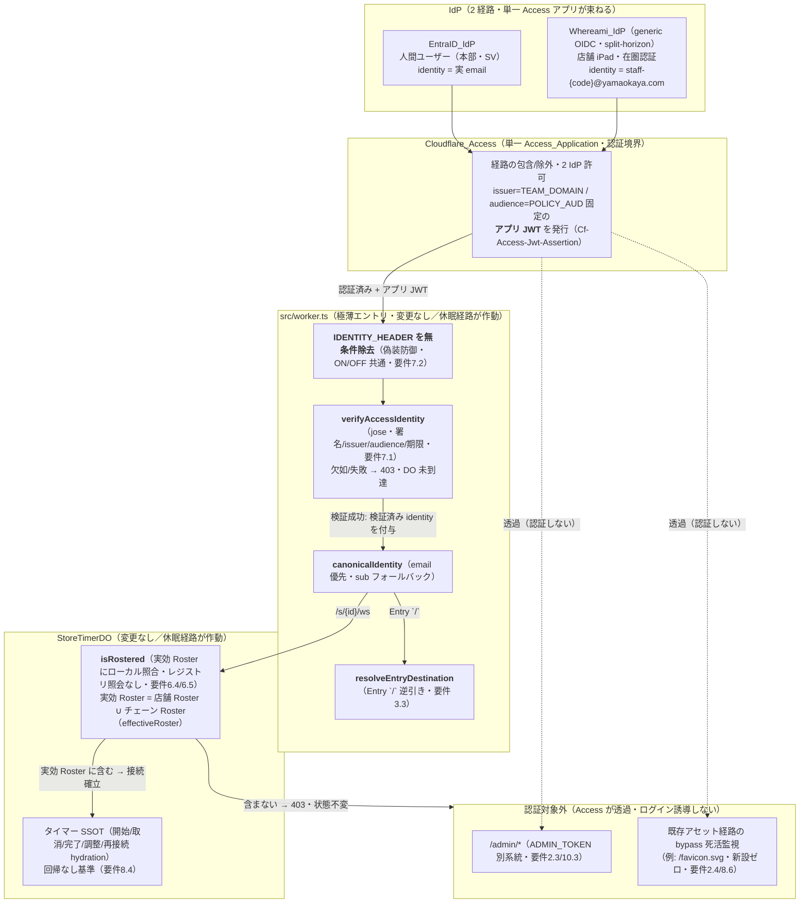
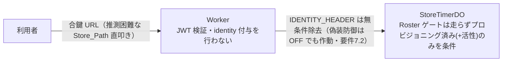
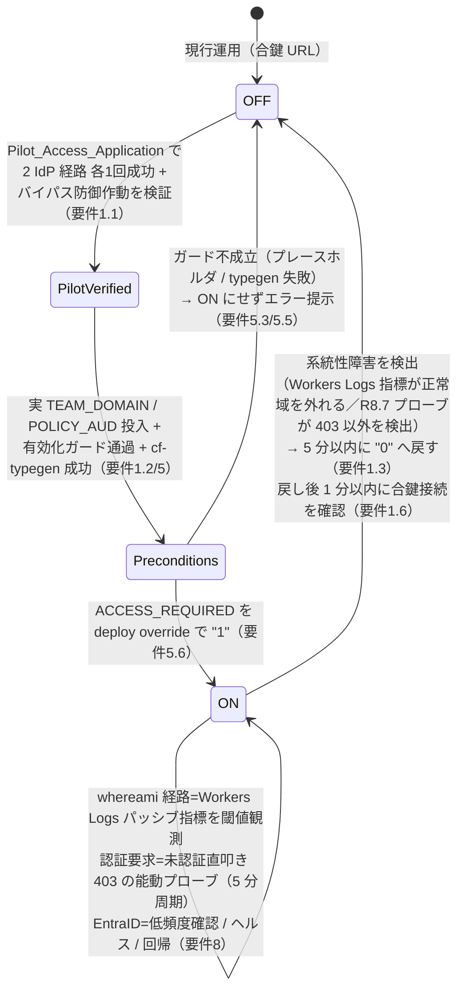
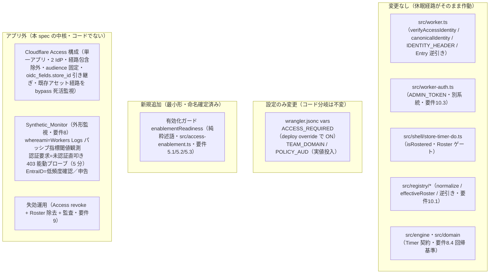

# 技術設計書 — Cloudflare Access の本番有効化（cloudflare-access-enablement）

## この設計が拠って立つもの

本設計は `requirements.md`（全10要件・EARS 記法・確定済み）を正本とし、ステアリング（`design-philosophy.md` / `naming.md` / `tooling.md` / `timer-model.md`）と既存の中核設計（`.kiro/specs/per-store-provisioning/design.md` / `yude-men-timer/design.md`）を前提とする。設計判断はすべてこの三者から演繹される。

本機能は**ゼロからの認証実装ではない**。JWT 検証（`src/worker.ts` の `verifyAccessIdentity` / `canonicalIdentity`）・内部ヘッダ偽装防御（`IDENTITY_HEADER` の無条件除去/検証済み付与）・Entry `/` の逆引き解決（`resolveEntryDestination`）・店舗 DO の Roster 認可（`src/shell/store-timer-do.ts` の `isRostered`・`effectiveRoster`）はすべて **per-store-provisioning で実装・検証済みで、`ACCESS_REQUIRED === "1"` の経路に入るのを待って休眠している**。本設計の中核は、これらを本番で立ち上げるための **Cloudflare Access の構成・2 IdP の据え付け・実設定値の投入・段階的切替・切替後の検証と失効運用**にある。

> **設計哲学の直接の帰結（足し算より引き算）**：本 spec は「既に彫られた素材を本番の光に当てる」作業である。休眠機構の内部挙動を新規要件として重複定義せず、再実装もしない。アプリコードへの追加は**原則ゼロ**。新規に足す純粋ロジックは**有効化ガードただ一点**であり、追加の代償に見合う実在の必要（要件が明示的に課す安全機構）に支えられる最小形に留める。その公開シンボル名・配置は確定済み（ユーザー確認済み・後述「命名の確認事項」2）。ヘルスチェックは専用経路を新設せず、既存の静的アセット経路（例: `/favicon.svg`）を Access の bypass 対象とすることで**新設コードゼロ**で閉じる（Q-health 確定・要件2.4/8.6）。

---

## Cloudflare Access 前提（調査済み・whereami IdP からの申し送りを含む）

本設計が依拠する Cloudflare Access の挙動を、確認済みの事実として記録する（実装時に変えない前提）。

1. **アプリ JWT の発行と検証境界。** Cloudflare Access は認証を通過したリクエストに、Access が発行する**アプリ JWT** を `Cf-Access-Jwt-Assertion` ヘッダ（または `CF_Authorization` Cookie）で付与する。後段アプリ（本アプリ）が検証・参照するのはこのアプリ JWT であり、**whereami の id_token を直接受け取ることはない**。既存 `worker.ts` はヘッダを読む（Access が前段でヘッダ注入するため妥当）。
2. **署名検証はチームドメインの certs エンドポイント。** JWT 署名検証は Cloudflare Access のチームドメイン `https://<team>.cloudflareaccess.com/cdn-cgi/access/certs`（= `TEAM_DOMAIN` + `/cdn-cgi/access/certs`）で行う。**whereami の `/jwks` は使わない**。既存 `verifyAccessIdentity` は既にこの通り（`TEAM_DOMAIN` + `ACCESS_CERTS_PATH`）で、`issuer: TEAM_DOMAIN` / `audience: POLICY_AUD` を照合する。整合済み。
3. **単一アプリで 2 IdP を束ねる。** Access はひとつの Access_Application に複数のログイン方式（IdP）を許可できる。iPad は Whereami_IdP 経由、人間ユーザーは EntraID_IdP 経由で認証し、いずれの経路でも Access は **issuer=TEAM_DOMAIN・audience=POLICY_AUD に固定した単一形の JWT** を発行する。ゆえに Worker の `aud` 検証は両経路で同一値に照合できる（要件2.6）。
4. **カスタムクレームの引き継ぎ。** `store_id` は OIDC 標準外のカスタムクレームゆえ、Access 側で「IdP のカスタム OIDC クレームをアプリ JWT に引き継ぐ」設定（Access アプリの OIDC claims 設定に `store_id` を追加）を**推奨する（必須ではない）**。Cloudflare Access の IdP カスタムクレームの標準挙動により、`store_id`（および `auth_method`）はアプリ JWT の**トップレベルではなく `oidc_fields` の下にネストして**引き継がれる（すなわち `oidc_fields.store_id`）。値は**数値または文字列のいずれの形でも到着しうる**が、本アプリは監査・診断の一貫性のため**受領時に文字列へ正規化して扱う**（数値到着も文字列到着もつねに文字列として保全）。実際に つくば中央店（店舗コード 1263）で観測した実トークンは `oidc_fields.store_id: 1263`（数値）であることを確認済み。本アプリの認可単位は email（`canonicalIdentity` は email 優先）であり、`store_id` は認可に使わず監査・診断のみ（要件4.3）。Store_Id_Claim の引き継ぎ不成立は認証・認可・接続の成立を妨げない（診断性のみ低下する）。ゆえに本番切替の前提条件（要件1.1・1.2）には含めない。
5. **セッションは Access が管理。** 認証セッションの継続と失効は Cloudflare Access が担う（最大 1 ヶ月）。アプリはステートレスを保ち、セッションストアや失効ロジックを新設しない（要件9・10.4）。端末紛失時は Access 上で当該合成 email のセッションを revoke する運用（whereami 側 `docs/device-loss-revocation-runbook.md`）。
6. **split-horizon（whereami generic OIDC）。** Whereami_IdP は Access の唯一の generic OIDC クライアント。Authorization エンドポイントは**内部名ホストの** `/authorize`、Token・Certs（JWKS）エンドポイントは**外部名ホストの** `/token`・`/jwks` を個別に指定し、Authorization ホストと Token/Certs ホストが互いに異なる（要件4.1）。この配線は whereami 側で発行される OIDC メタデータに対応する Access 側の generic OIDC 接続設定であり、whereami の内部実装は本 spec のスコープ外（要件10.2）。
7. **テストは本番と分離した Pilot アプリ・検証は環境分離で二分する。** 検証は本番と別の Pilot_Access_Application（AUD・certs が本番と別）を介す。ウォーキングスケルトンのスモークテスト資産を流用できる（要件1.1）。開発時の認証経路検証は**迂回をコードで作らず、開発環境のデータで作る**という環境分離の原則に立ち、対象を二つに割る（要件1.8）——(a) **アプリ側経路**（JWT 検証 → Roster 照合 → Entry 逆引き → WS 確立）は、Worker が単一アプリ・単一 issuer/aud のためどの IdP 経由で JWT が生まれたかを観測しない。ゆえに Pilot_Access_Application に許可した OTP_Login（Cloudflare Access 標準の One-Time PIN・開発検証用）で、店舗にも whereami にも依存せず**オフィス完結**に検証できる（開発者 email で OTP ログイン → 当該 email をテスト店舗 Roster に登録 → アプリ側経路を検証）。(b) **whereami 固有部分**（合成 email 形式・Store_Id_Claim 引き継ぎ・split-horizon）は Whereami_Dev_Stage（whereami 開発ステージ）で、その IP→店舗の対応表に「テスト店舗＝開発拠点のネットワーク」をデータ登録し、本番と同一コード・同一ロジックのまま検証する。**本番の Access_Application には OTP_Login を追加せず、本番 whereami の対応表・コードにテストデータ・分岐を入れない**（要件10.7 / 10.8）。Whereami_Dev_Stage のデータ登録は whereami 側 spec への依頼事項（本 spec 外・外部依存）。

（参照: developers.cloudflare.com/cloudflare-one/identity/authorization-cookie/validating-json / applications/configure-apps、changelog 2025-10-03-one-click-access-for-workers。内容は本設計向けに要約。）

---

## Overview

### 何が変わるか（要点）

本機能の変更は **3 つの空間**に分かれる。中核はアプリの外（Cloudflare Access の構成と運用手続き）にあり、アプリコードの変更は最小である。

| 空間 | 変更の主体 | 変更内容 | アプリコード |
| --- | --- | --- | --- |
| **Access 構成** | Cloudflare ダッシュボード / API | 単一 Access_Application・2 IdP フェデレーション・経路の包含/除外・audience 固定・カスタムクレーム引き継ぎ | なし |
| **Deployment_Config** | `wrangler.jsonc` vars + deploy override | `TEAM_DOMAIN` / `POLICY_AUD` の実値投入・`ACCESS_REQUIRED` のデプロイ時 ON・`pnpm cf-typegen` | vars 値のみ（コード分岐は不変） |
| **運用手続き** | 運用者 + Synthetic_Monitor | 段階的切替・可逆な切戻し・監視（whereami 経路の Workers Logs パッシブ観測＋認証要求の能動プローブ＋EntraID 経路の低頻度確認）・Roster 整合登録・失効運用 | なし |

**アプリコードに新規追加するのは次の 1 点のみ**（「追加の代償に見合う実在の必要」に支えられ、公開シンボル名・配置は確定済み）：

1. **有効化ガード（要件5.1 / 5.2 / 5.3 / 5.5）** — プレースホルダのまま ON にする事故を防ぐ、デプロイ前検査の純粋述語。**新規に足す唯一の純粋ロジック**であり、Correctness Properties の対象（後述）。

**ヘルスチェック経路（要件2.4 / 8.6）は新設しない**（Q-health 確定）。専用 `/healthz` を作らず、既存の静的アセット経路（例: `/favicon.svg`）を Access の bypass 対象として死活監視する。アセット応答も Worker（`env.ASSETS.fetch`）経由ゆえ Worker の死活を証明でき、**新設コードがゼロ**のため要件10.1 の差分制限と衝突しない。実質的な変更は Access 構成側（bypass 設定）で閉じ、有効化ガードのみが実質的な新規追加として残る（後述「ヘルスチェック経路の設計判断」）。専用経路が将来必要になれば後続 spec で扱う。

### 変えないもの（不変点・要件10）

- 休眠機構の内部実装（`verifyAccessIdentity` / `canonicalIdentity` / `IDENTITY_HEADER` 除去・付与 / Entry 逆引き / 店舗 DO の Roster 照合）を**再実装しない**。`ACCESS_REQUIRED === "1"` 経路の有効化と本番構成での作動確認に限る（要件10.1）。
- Whereami_IdP の内部実装（OIDC 発行ロジック・ECS Fargate 運用・split-horizon の内部配線）に触れない。Access 側の generic OIDC 接続設定と identity クレームの Roster 整合にのみ関与する（要件10.2）。
- `src/worker-auth.ts` の `ADMIN_TOKEN` 定数時間照合を変えない。Provisioning_API（`/admin/*`）は Access と独立した別系統（要件10.3 / 10.6）。
- セッション状態の永続キー・失効ロジックのモジュールを新設しない。セッションの継続と失効は Access に委ねる（要件10.4）。
- 店舗別 Access ポリシー数は 0。認可（店舗ごとの可否）は店舗 DO の投影 Roster が担う（要件10.5・per-store-provisioning 継承）。
- `wrangler.jsonc` に記録する `ACCESS_REQUIRED` の既定値は `"0"`（OFF）を保つ。本番のみデプロイ時オーバーライドで ON にする（要件5.6）。
- 本番の Access_Application へ OTP_Login を**追加しない**。OTP_Login は Pilot_Access_Application に限定し、開発時のアプリ側経路検証にのみ用いる（迂回を本番構成に持ち込まない・要件10.7）。
- 本番 Whereami_IdP の対応表・コードへテストデータ・分岐を**入れない**。whereami 固有部分の事前検証は Whereami_Dev_Stage のデータ登録（whereami 側 spec の責務・本 spec 外）に委ねる（要件10.8）。
- `src/engine` / `src/domain` の Timer 契約・タイマー機能の観測結果（要件8.4 の回帰なし基準）。

### 中心的判断（各判断は後続節で詳述）

1. **有効化は「経路の目覚め」であって「経路の新設」ではない。** `ACCESS_REQUIRED` の 3 分岐（Worker の WS JWT 検証・Entry 逆引き / 店舗 DO の Roster 判定）はいずれも実行時に env を読む休眠経路であり、ON は env 値の切替のみで作動する（要件1.4 / 8.7・コード変更なし）。
2. **Pilot 先行 → 前提条件充足 → 本番 ON → 5 分以内切戻しの可逆手順。** テスト用 Access アプリで 2 IdP 経路とバイパス防御の作動を先に確かめ、構成次元を本番と一致させてから切り替える（要件1）。開発時の認証経路検証は**環境分離**で行う——迂回はコードで作らず開発環境のデータで作る（要件1.8）。アプリ側経路は Pilot_Access_Application の OTP_Login でオフィス完結に、whereami 固有部分は Whereami_Dev_Stage で本番同一コードのまま検証し、実店舗ネットワーク上の最終疎通はパイロット 1 号店の立ち上げと兼ねる **1 回のみ**で足りる（要件1.9）。本番構成へ OTP・テストデータ・分岐を持ち込まない（要件10.7 / 10.8）。
3. **有効化ガードで「プレースホルダのまま ON」を構造で防ぐ。** `TEAM_DOMAIN` 形式・`POLICY_AUD` 非プレースホルダを純粋述語で判定し、不成立なら ON を阻止する（要件5）。
4. **identity ↔ Roster の一致は `normalize` の正準形で担保する。** EntraID 実 email・whereami 合成 email をともに `normalize` を通した正準形で Roster へ登録し、Access が JWT に載せる email クレームの正準形と完全一致させる（要件6）。
5. **失効は Access セッション revoke ＋ Roster 除去の二段で恒久化する。** Roster 除去後の既存 WS は次回再接続時に Roster ゲートで拒否される（現接続は維持・即時切断はスコープ外＝per-store-provisioning の deactivated のみが担う・再接続頻度により実効窓は小さい）。次回以降も Roster ゲートで拒否させ、監査記録を残す（要件9）。
6. **監視の主軸は Workers Logs のパッシブ観測に置く（合成試行を主としない）。** 監視は三層で確定する（要件8）——(a) whereami 経路は合成試行を行わず、`observability.enabled = true`（`wrangler.jsonc` で有効化済み）の Workers Logs 指標で `/s/*/ws` の 403 レート急騰・WebSocket アップグレード成功数の崩落を閾値観測する（24h 常時接続の実機群が実トラフィックで全経路を検証するため合成試行を要さない・要件8.2）。(b)「認証が要求されること」（静かな認証 OFF への退行）は R8.7 の能動プローブ（未認証直叩き＝403 の周期確認・IdP 非依存・外部実行可・既定 5 分周期）で検知する。(c) EntraID 経路は切替時検証（Pilot・要件1.1）＋低頻度（日次以下）確認または申告ベースとし、短周期ヘッドレス自動化は行わない。店内端末のヘルスビーコンは採用しない。切戻し（要件1.3）の検知入力は (a) の Workers Logs 指標と (b) の R8.7 プローブである。

---

## Architecture

### 認証境界の全体像（Access → Worker → 店舗 DO）

有効化後（`ACCESS_REQUIRED === "1"`）の認証・認可の流れ。**太字の判定点はすべて実装済み・休眠中**で、本 spec は env 値と Access 構成でこれらを作動させる。



### OFF 期（`ACCESS_REQUIRED === "0"`・現行運用・切替まで維持）



OFF 期の挙動は既存の休眠挙動そのもの（要件1.4）。本 spec は OFF↔ON を env のみで往復させ、切戻し（ON→OFF）後 1 分以内に合鍵 URL 接続が JWT 検証を経ずに成立することを確認する（要件1.6）。

### 段階的ロールアウトの状態機械（可逆・要件1）



### 触る層と触らない層



---

## Components and Interfaces

本 spec の「コンポーネント」は大半がアプリコードの外にある。ここでは (A) Access 構成、(B) Deployment_Config、(C) 追加候補のアプリ資産、(D) 運用手続き、の 4 群のインターフェイスを定義する。

### A. Cloudflare Access 構成（アプリコードでない・要件2/3/4）

#### A-1. 単一 Access_Application（要件2）

| 構成項目 | 値 / 方針 | 要件 |
| --- | --- | --- |
| 認証を課すアプリ定義 | 1（アプリ全体を覆う）。店舗別アプリ・ポリシーは 0 | 2.1 / 10.5 |
| 認証対象外経路の bypass 用アプリ定義 | 店舗数に依存しない定数個（`/admin/*`・既存アセット経路 例: `/favicon.svg` 用の別アプリ定義＋全員 Bypass ポリシー）。総数はちょうど 1 にならないが店舗数非依存 | 2.1 |
| 認証対象に**含める**経路 | Entry `/`・Store_Path `/s/{storeId}/`・`/s/{storeId}/ws` | 2.2 |
| 認証対象から**除外**する経路 | `/admin/*`（ADMIN_TOKEN 別系統）・既存の静的アセット経路（死活監視。例: `/favicon.svg`・新設ゼロ） | 2.3 / 2.4 |
| 許可するログイン方式（IdP） | EntraID_IdP と Whereami_IdP の 2 つ | 2.5 |
| 発行 JWT の issuer | `TEAM_DOMAIN` に固定（両 IdP 経路で同一） | 2.6 |
| 発行 JWT の audience | `POLICY_AUD` に固定（両 IdP 経路で同一） | 2.6 |
| セッション寿命 | Cloudflare_Access 上で明示的に設定する（具体値は Q-session 未決）。紛失 iPad の実効失効の時間上限を決める | 9.5 |

> **除外経路と Worker ルーティングの整合**：`/admin/*` は Worker が `isAdminAuthorized` で認可する既存経路（Access を二重に被せない・要件2.3）。死活監視は専用経路を新設せず既存の静的アセット（例: `/favicon.svg`）を用いる。当該アセットは Worker のいずれのパターン（`/s/`・`/admin/`・`/entry/stores`・`/`）にも一致せず `env.ASSETS.fetch` が応答するため、Access 側で bypass 対象に加えるだけでよい（後述 C-1）。

#### A-2. EntraID フェデレーション（要件3）

- EntraID_IdP を **OIDC または SAML のいずれか一方**で Access に IdP としてフェデレーションし、Access_Application のログイン方式に加える（要件3.1）。
- 発行 JWT の `email` クレームにユーザーの**検証済み実 email** を欠落・空文字なく載せる（要件3.2）。`canonicalIdentity` が email を正準として抽出し、`normalize` の正準形で Roster 照合の単位に一致する。
- 観測点：テストユーザーが認証を完了し、`POLICY_AUD` を aud とする JWT を発行できること。認証後 Entry `/` へ到達すると Worker が実 email で逆引きし、per-store-provisioning 要件7 の解決（1 店舗→その店舗 / 複数→既定店 / 0→接続先なし）が作動する（要件3.3・`resolveEntryDestination`）。

#### A-3. whereami generic OIDC（split-horizon・要件4）

| エンドポイント | ホスト種別 | パス | 要件 |
| --- | --- | --- | --- |
| Authorization | **内部名**ホスト | `/authorize` | 4.1 |
| Token | **外部名**ホスト | `/token` | 4.1 |
| Certs（JWKS） | **外部名**ホスト | `/jwks` | 4.1 |

- Authorization に用いる内部名ホストと、Token・Certs に用いる外部名ホストは**互いに異なるホスト名**（split-horizon の制約・要件4.1）。
- Whereami_IdP を**唯一の** generic OIDC クライアントとする（他 IdP を generic OIDC として追加しない・EntraID は専用フェデレーション・要件4.4）。
- 発行 JWT の `email` クレームは合成 email `staff-{店舗コード}@yamaokaya.com`（ローカル部が `staff-`+店舗コード、ドメイン部が `yamaokaya.com` に厳密一致・要件4.2）。
- `store_id` カスタムクレームを改変せず JWT に引き渡す設定（Access アプリの OIDC claims に `store_id` を追加）を**推奨する（必須ではない）**。Cloudflare Access の標準挙動により、この引き継ぎ値はアプリ JWT の**トップレベルではなく `oidc_fields` 配下にネスト**され（`oidc_fields.store_id`）、**数値または文字列のいずれの形でも到着しうる**。本アプリは受領時に**文字列へ正規化**し、認可には使わず監査・診断のためにのみ保全する（要件4.3）。`shopCode` / `storeCode` と**同一の値**だが表現（数値/文字列）は異なりうる。逆引きは email 由来の文字列（`canonicalIdentity`）で行い、この数値の `store_id` は用いない。Store_Id_Claim の引き継ぎ不成立は認証・認可・接続の成立を妨げない（診断性のみ低下する）。ゆえに本番切替の前提条件（要件1.1・1.2）には含めない。
- 合成 email 形式を抽出できない JWT は、Worker が検証済み identity として扱わず店舗接続を確立しない（要件4.2 の根拠・R6.5 の Roster ゲート）。**この挙動は既存の Roster ゲートで構造的に満たされる**：`canonicalIdentity` が抽出した email が Roster の正準形に一致しなければ `isRostered` が false を返し 403 になる（新たな形式バリデーションを足さない・引き算）。壊れた email はどの Roster にも一致せず既存ゲートが拒否するというこの帰結は R4.2 の rationale と R6.5 の Roster ゲートに属する。なお whereami 固有部分（split-horizon・合成 email 形式・Store_Id_Claim 引き継ぎ）の事前検証は Whereami_Dev_Stage で行う（要件4.5・後述 D-2）。

### B. Deployment_Config（`wrangler.jsonc` vars + deploy override・要件5）

現状の vars（プレースホルダ）：

```jsonc
"vars": {
  "OBSERVE_DEBUG": "0",
  "ACCESS_REQUIRED": "0",                                  // 既定 OFF を保つ（要件5.6）
  "TEAM_DOMAIN": "https://<team>.cloudflareaccess.com",    // プレースホルダ（要件5.1）
  "POLICY_AUD": "<access-app-aud>"                         // プレースホルダ（要件5.2）
}
```

| 変数 | 有効化時の扱い | 制約 | 要件 |
| --- | --- | --- | --- |
| `ACCESS_REQUIRED` | リポジトリ既定は `"0"` を保ち、**本番のみデプロイ時オーバーライド**で `"1"` | 切替は env のみ・コード変更なし | 5.6 / 1.4 |
| `TEAM_DOMAIN` | 実チームドメインを投入（プレースホルダを残さない） | `https://` で始まり `.cloudflareaccess.com` で終わり、サブドメイン部が 1〜63 文字 | 5.1 |
| `POLICY_AUD` | 実 audience 識別子を投入 | 空でなく、既定プレースホルダ `<access-app-aud>` と不一致の 1 文字以上 | 5.2 |

- **secret 管理**：`TEAM_DOMAIN` / `POLICY_AUD` は秘匿性の高い値ではないが、本番実値の投入は**デプロイ時オーバーライド**で行い、リポジトリの `wrangler.jsonc` にはプレースホルダ（`ACCESS_REQUIRED="0"`）を残す（要件5.6）。`ADMIN_TOKEN` は従来どおり `wrangler secret put`（本 spec で変えない・要件10.3）。
- **既定反転の終着点とローカル開発の手当て**：本番が安定運用に達したら、リポジトリ既定の `ACCESS_REQUIRED` を `"1"` へ反転し、オーバーライドなしの素のデプロイでも認証が ON を保つ状態を終着点とする（デプロイ時オーバーライドへの依存を解消し「静かな認証 OFF」への退行余地を構造から取り除く・要件5.7）。反転する際は同時に `.dev.vars` へ `ACCESS_REQUIRED="0"` を明示し、ローカル開発環境（`pnpm dev`）は OFF を維持する（本番のみ ON・ローカルは合鍵 URL 相当で開発を継続する）。
- **型再生成**：`wrangler.jsonc` の vars を変更したら必ず `pnpm cf-typegen`（= `wrangler types`）で `Env` 型を再生成する（設定の単一の正本と型の同期・tooling 規律・要件5.4）。再生成が失敗したら ON にせずエラーを提示する（要件5.5）。
- **有効化ガード**：`ACCESS_REQUIRED` を `"1"` へ切り替える前に、`TEAM_DOMAIN` / `POLICY_AUD` が「空 / 未設定 / プレースホルダ一致」のいずれでもないことを検査し、いずれかに該当すれば ON を阻止してエラーを提示する（要件5.3・後述 C-2）。

### C. 追加するアプリ資産（最小形・命名確定済み）

#### C-1. ヘルスチェック経路の設計判断（要件2.4 / 8.6・Q-health 確定）

**問題**：ON 期は Entry `/` が Access 対象となるため、認証情報なしで到達できる死活監視経路がない。Synthetic_Monitor は認証なしで 5 秒以内に正常応答を受領できる単一の定義済み経路を要する（要件8.6）。

**選択肢と引き算の評価**：

| 案 | 追加物 | Worker コード分岐 | 評価 |
| --- | --- | --- | --- |
| **(0) 既存アセット経路を bypass 監視**（例: `/favicon.svg`。専用経路を新設せず、既に `public/` にある静的アセットを Access の bypass 対象に加える） | **なし**（Access 除外設定のみ） | **ゼロ**（既存フォールバックがそのまま応答） | ★確定・第一候補。**新設コードゼロ**で要件10.1 と一切衝突しない。アセット応答も Worker（`env.ASSETS.fetch`）経由ゆえ Worker の死活を証明できる |
| (1) 静的アセット新設（`public/` に死活監視専用の極小ファイルを置く） | 静的ファイル 1 つ + Access 除外設定 | ゼロ | 不要。既存アセットで死活の意味は足りるため専用ファイルを足さない（引き算） |
| (2) Worker の極薄経路（`if (url.pathname === "/healthz") return new Response("ok")`） | Worker に分岐 1 つ | +1 分岐 | 足し算。既存アセットで足りるため不要 |

**確定：案 (0)（既存アセット経路を bypass 監視）**。理由——(a) Worker は既に未一致パスを `env.ASSETS.fetch` へフォールバックさせており、既存の静的アセット（例: `/favicon.svg`）は認証なしで 200 応答が成立する（コード分岐ゼロ・新設ファイルもゼロ）。(b) Access 側でその経路を認証対象から除外（bypass）すれば、認証なしで到達できる（要件2.4）。(c) アセット応答も Worker（`env.ASSETS.fetch`）経由ゆえ Worker の死活を証明でき、死活監視の目的（「Worker が生きて応答すること」）に足りる。(d) 新設コードがゼロのため要件10.1 の差分制限と衝突しない（善——足し算より引き算）。**専用 `/healthz` 等が必要になれば後続 spec で扱う**（現時点では新設不要）。

> **⚠ 命名（naming.md）**：案 (0) は既存アセット経路（例: `/favicon.svg`）を用いるため、**新規の公開シンボル・経路名を導入しない**。判断対象は「どの既存アセットを bypass 監視に用いるか」の運用選択に留まる（下記「命名の確認事項」1 参照）。将来専用経路を新設する場合の候補名のみ保留する。

#### C-2. 有効化ガード（純粋述語・要件5.1 / 5.2 / 5.3）

「プレースホルダのまま ON」を防ぐデプロイ前検査。**新規に足す唯一の純粋ロジック**であり、`src/worker-auth.ts` / `worker-entry.ts` と同型に「プラットフォーム非依存の純粋関数を端へ寄せる」（構造の主権）。

- **入力**：`TEAM_DOMAIN`・`POLICY_AUD` の文字列値（`wrangler.jsonc` vars または deploy override の値）。
- **判定**：`TEAM_DOMAIN` が形式（`https://` + サブドメイン 1〜63 文字 + `.cloudflareaccess.com`・かつ既定プレースホルダと不一致）を満たし、かつ `POLICY_AUD` が非空・既定プレースホルダ `<access-app-aud>` と不一致であること。
- **出力**：有効化可否（真偽）と、不成立時にどの変数がプレースホルダ／不正かを示す診断（要件5.3 のエラー提示に用いる）。
- **作用の所在**：述語は純粋。これを呼ぶ**デプロイ前検査**（CI ステップまたは `package.json` script）が、不成立なら ON を伴うデプロイを中止しエラーを提示する（作用は端・要件5.3）。runtime の Worker に恒久ガードを足さない（要件が課すのは切替手続きの前提条件・足し算回避）。

> **命名（naming.md・確定済み）**：この純粋モジュール／関数の**公開シンボル**（関数 `enablementReadiness`・型 `EnablementReadiness`）名と配置（`src/access-enablement.ts`・CLI は `tools/check-access-enablement.ts`）はユーザー確認済みで確定している（下記「命名の確認事項」2）。

### D. 運用手続きのインターフェイス（コードでない・要件1/6/8/9）

#### D-1. identity ↔ Roster 整合登録（要件6）

| identity 種別 | 登録先 Roster | 登録経路 | 正準形 |
| --- | --- | --- | --- |
| EntraID 実 email（本部・SV 等） | 権限範囲に応じ**チェーン Roster**（所属チェーン全店へ有効）または**店舗 Roster**（当該店舗のみ） | Provisioning_API（`/admin/*`・ADMIN_TOKEN） | `normalize`（trim・小文字化）後の正準形で登録 |
| whereami 合成 email `staff-{code}@yamaokaya.com` | 当該店舗の**店舗 Roster** | Provisioning_API | 同上 |

- Roster へ登録する identity 文字列と Access が JWT に載せる email クレームの**双方に同一の `normalize`** を適用し、両者の正準形が完全一致するよう登録値を定める（要件6.3）。
- 接続時、店舗 DO は検証済み identity の正準形を**実効 Roster**（当該店舗の店舗 Roster ∪ 所属チェーンのチェーン Roster・`effectiveRoster` の和集合）に照合する（要件6.4）。含まれれば WS 接続を確立し、含まなければ 403 で店舗状態を一切変更しない（要件6.5）。**この判定は既存の `isRostered` + 投影 Roster がそのまま担う。**

#### D-2. 段階的切替・可逆手順（要件1）

1. **Pilot 検証（環境分離・オフィス完結）**（要件1.1 / 1.8）：検証は「迂回をコードで作らず開発環境のデータで作る」原則に立ち、対象を二つに割る。
   - **アプリ側経路**（JWT 検証 → Roster 照合 → Entry 逆引き → WS 確立）：Pilot_Access_Application の **OTP_Login** で検証する（開発者 email で OTP ログイン → 当該 email をテスト店舗 Roster に登録 → アプリ側経路を検証）。Worker は単一アプリ・単一 issuer/aud でどの IdP 経由かを観測しないため、店舗にも whereami にも依存せず**オフィス完結**で成立する（要件3.3 のアプリ側逆引き挙動も同経路で検証）。有効な JWT を伴わない直叩きの拒否（要件7 のバイパス防御作動）もここで確認する。**複数のテスト店舗を切り替えて検証するとき**は、開発者 email をテスト用チェーンの**チェーン Roster** へ登録し、Entry の複数店舗解決（per-store-provisioning 要件7.4 の SV フロー＝既定店へ解決し切替リストを渡す）で店舗を選択する。whereami・Access 側に店舗選択機構を**新設せず**、既存の Entry 逆引き・チェーン Roster・切替リストで足りる（要件1.8）。
   - **whereami 固有部分**（合成 email 形式・Store_Id_Claim 引き継ぎ・split-horizon）：**Whereami_Dev_Stage** で、対応表に「テスト店舗＝開発拠点のネットワーク」をデータ登録し、本番と同一コード・同一ロジックのまま検証する（要件4.5）。データ登録は whereami 側 spec への依頼事項（本 spec 外）。
   - **本番構成へ OTP・テストデータ・分岐を持ち込まない**（要件10.7 / 10.8）。すべて成功が本番切替の前提。
2. **前提条件**（要件1.2 / 1.5）：実 `TEAM_DOMAIN` / `POLICY_AUD` 投入済み（有効化ガード通過）、`cf-typegen` 成功、Pilot と本番の構成次元（許可 IdP 集合・包含/除外経路・**audience が単一値に固定されているという構成**）が一致。ここで揃えるのは「aud が単一値に固定されている」という構成次元であって aud 値そのものではない——Pilot と本番は別の Access アプリゆえ aud 値は各アプリ固有であり異なってよい（値の一致ではなく「単一固定という構成」の一致）。
3. **本番 ON**（要件5.6）：`ACCESS_REQUIRED` をデプロイ時オーバーライドで `"1"`。
4. **実店舗最終疎通（1 回・兼用）**（要件1.9）：実店舗ネットワーク上での本番構成の最終疎通確認は **1 回に限り**実施し、パイロット 1 号店の立ち上げと兼ねる（本検証のための専用の店舗訪問を要さない）。ステップ 1 のオフィス検証が済んでいるため、ここで残るのは実ネットワーク前提の whereami 在圏認証の疎通のみ。
5. **切戻し**（要件1.3 / 1.6）：系統性障害を検出したら、検出から **5 分以内**に `"0"` へ戻す（env のみ・可逆）。切戻しの検知入力は二つ——(a) whereami 経路の Workers Logs パッシブ指標（`/s/*/ws` の 403 レート急騰・WebSocket アップグレード成功数の崩落）が正常域を外れること（要件8.2）、(b) 未認証直叩きが 403 で拒否される作動（認証が要求されること）が R8.7 の能動プローブで崩れること（静かな認証 OFF への退行・要件8.7）。戻し完了から **1 分以内**に合鍵 URL 接続が JWT 検証を経ず成立することを確認。

#### D-3. Synthetic_Monitor（外形監視・要件8）

監視モデルは確定済みで、**Workers Logs のパッシブ観測を主軸**とし、合成試行は主としない（Synthetic_Monitor の名称は合成監視に由来するが、実態はパッシブ観測を主とする）。`observability.enabled = true` は `wrangler.jsonc` で有効化済みであり、これを監視の土台に用いる。監視は次の層で構成する。

| 監視対象 | 手段 | 周期 | 判定 / 成功条件 | 要件 |
| --- | --- | --- | --- | --- |
| whereami 経路（系統性障害） | Workers Logs パッシブ指標（`/s/*/ws` の 403 レート・WebSocket アップグレード成功数）の閾値観測。合成試行なし | 常時（実トラフィック） | 403 レート急騰または WS アップグレード成功数の崩落が正常域を外れたら系統性障害の候補として記録 | 8.2 |
| 認証要求（静かな認証 OFF への退行） | 未認証直叩き `/s/{storeId}/ws` の能動プローブ（IdP 非依存・外部実行可） | 既定 5 分周期 | HTTP 403 で拒否され店舗 DO に到達しないこと。403 以外（特に認証を経ない接続成立）を検出したら通知 | 8.7 |
| EntraID 経路（認証→店舗接続） | 切替時検証（Pilot・要件1.1）＋低頻度確認または運用者の申告。対話型ログインゆえ短周期ヘッドレス自動化を行わない | 日次以下 / 申告 | 認証から店舗接続まで到達 | 8.1 |
| 既存アセット経路（認証なし bypass。例: `/favicon.svg`） | 死活監視の到達確認 | — | 5 秒以内に正常応答 | 8.6 |
| タイマー機能の回帰 | 本番切替後の観測結果比較 | 本番切替後 | 認証無効時と同一の観測結果 → 回帰なし | 8.4 |

- whereami 経路のパッシブ指標（403 レート・WebSocket アップグレード成功数）が正常域の異常閾値を超えたとき、または R8.7 の能動プローブが 403 以外を検出したとき、運用者へ通知する（要件8.3）。タイマー機能の観測結果が認証無効時と異なれば回帰ありと判定し通知（要件8.5）。
- 店内端末のヘルスビーコンは採用しない（whereami 経路は店舗ネットワーク内でのみ認証が成立し外部からの合成試行は原理的に通れないため、24h 常時接続の実機群のパッシブ観測で検知する・要件8.2）。

#### D-4. 失効運用（要件9）

1. iPad 紛失・担当者離任が判明したら、Cloudflare_Access 上で当該 identity のセッションを失効させる。失効後は Access が再認証を要求し Entry `/`・WS への到達を遮断する（要件9.1・セッションは Access 管理）。
2. 恒久的に断つときは Provisioning_API 経由で当該 identity を該当 Roster から除去し、かつ 9.1 のセッション失効を併せて行う（Roster 除去後、既存 WS は次回再接続時に Roster ゲートで拒否される。現接続は維持され、生存中の既存 WS の即時切断は本 spec のスコープ外＝per-store-provisioning の deactivated のみが担う確定挙動であり、厨房 WS の再接続頻度により実効窓は小さい・要件9.2）。
3. Roster 除去が失敗したら、除去前の Roster 状態を保持し、失効未完了を運用者へ通知し、失効完了を主張しない（要件9.3）。
4. 失効実施時は対象 identity・対象端末・実施日時・失効理由・実施措置を運用記録として残す（監査可能性・要件9.4）。
5. セッション寿命は Cloudflare_Access 上で明示設定する（具体値 Q-session 未決）。紛失 iPad の実効失効は「whereami 再認証が店舗ネットワーク内でのみ成立すること」＋「セッション寿命」で上限が決まる（要件9.5）。

---

## Data Models

本 spec は新しい**永続データモデルを導入しない**（セッションストア・失効ロジックの永続キーを新設しない・要件10.4）。関与するのは既存の型と、Deployment_Config の値、および運用記録である。

### 既存型（参照のみ・変更しない）

| 型 / 値 | 定義場所 | 本 spec での役割 |
| --- | --- | --- |
| `Identity`（= `string`） | `src/registry/ideal.ts` | Access JWT の正準クレーム。Roster の要素 |
| `Roster`（= `readonly Identity[]`） | `src/registry/ideal.ts` | 接続許可 identity の集合。ワイヤに出さない |
| `StoreProjection`（`config` / `roster` / `active` / `version`） | `src/registry/projection.ts` | 店舗 DO が保持する投影。`roster` が実効 Roster |
| `IDENTITY_HEADER`（= `"X-Yudemen-Identity"`） | `src/shell/store-timer-do.ts` | Worker→店舗 DO の内部 identity ヘッダ（偽装防御対象） |
| `Env`（`ACCESS_REQUIRED` / `TEAM_DOMAIN` / `POLICY_AUD` / `ADMIN_TOKEN` …） | `worker-configuration.d.ts`（`cf-typegen` 生成） | Deployment_Config の型。vars 変更後に再生成 |

### Deployment_Config の値モデル（`wrangler.jsonc` vars）

```
ACCESS_REQUIRED : "0" | "1"     // リポジトリ既定 "0"。本番のみ deploy override で "1"
TEAM_DOMAIN     : string        // "https://" + <subdomain 1..63> + ".cloudflareaccess.com"
POLICY_AUD      : string        // 非空・非プレースホルダの audience 識別子
```

プレースホルダの正本（有効化ガードが照合する既定値）：

```
TEAM_DOMAIN のプレースホルダ : "https://<team>.cloudflareaccess.com"
POLICY_AUD のプレースホルダ  : "<access-app-aud>"
```

### Access が発行するアプリ JWT のクレーム（whereami 申し送り・参照）

Worker が受け取り検証・参照するクレーム（whereami 経路の例。EntraID は `email` が実 email・`oidc_fields.store_id` なし）。`email` はトップレベルで認可の単位、`store_id` / `auth_method` は `oidc_fields` 配下にネストされ診断のみ：

| クレーム | 型 / 例 | アプリでの用途 |
| --- | --- | --- |
| `email` | string / `staff-9920@yamaokaya.com`（whereami）・実 email（EntraID） | `canonicalIdentity` の正準 identity。Roster 照合単位 |
| `sub` | string / `store:9920` | email 欠如時のフォールバック（`canonicalIdentity`） |
| `oidc_fields.store_id`（`oidc_fields` の下にネスト） | number\|string（アプリは文字列として正規化して扱う） / `1263`（数値。文字列到着も可） | **認可に使わない**。Store_Id_Claim として文字列に正規化して監査・診断のためにのみ保全（`/whereami` の `shopCode` と同一の値だが表現は数値/文字列いずれもありうる・要件4.3） |
| `iss` | string / `TEAM_DOMAIN` | `jwtVerify` の issuer 照合 |
| `aud` | string / `POLICY_AUD` | `jwtVerify` の audience 照合 |
| `iat` / `exp` | number | 期限検証（`jose`） |
| `oidc_fields.auth_method`（`oidc_fields` の下にネスト） | string / `"store"` | **認可に使わない**。`store_id` 同様 `oidc_fields` 配下にネストされ、Access の OIDC claims 引き継ぎ設定がなければアプリ JWT に現れない（カスタムクレーム）。監査・診断のためにのみ保全 |
| `nonce` | string | Access/IdP 管理 |

### 失効の運用記録モデル（要件9.4・実装機構は設計時確定）

監査可能性のため、失効実施ごとに次を運用記録として残す。**アプリ内に永続キーを新設せず**（要件10.4）、運用側の記録媒体（運用ランブック台帳・チケット・監査ログ）に残す。

```
失効記録 = {
  対象 identity : string        // 正準 email
  対象端末      : string        // iPad 識別・店舗コード等
  実施日時      : timestamp
  失効理由      : string        // 紛失 / 離任 等
  実施措置      : string        // Access セッション revoke / Roster 除去 の別
}
```

---

## Correctness Properties

> *プロパティとは、システムのすべての妥当な実行にわたって成り立つべき特性・振る舞いであり、システムが何をすべきかについての形式的な言明である。プロパティは、人が読む仕様と機械が検証できる正しさ保証との橋渡しをする。*

### この spec における PBT の適用範囲（引き算の帰結）

本 spec の中核は Cloudflare Access 構成・Deployment_Config 投入・段階的切替・synthetic 監視・失効運用であり、その大半は外部設定・運用手続き・外形 end-to-end 検証で、property-based testing の対象にならない（→ Testing Strategy で integration / smoke / 手順検証に振り分ける）。開発時検証の手段である **OTP_Login**（Pilot への外部設定）と **Whereami_Dev_Stage**（外部依存の開発ステージへのデータ登録）も同様に外部設定・運用手続きであり、PBT の対象ではない（integration / 手順検証に振り分ける）。有効化ガードの PBT はこれらの影響を受けず、純粋述語の判定のみを検証対象とする。

休眠機構の純粋ロジック（`normalize`・`effectiveRoster`・`resolveEntryDestination`・`verifyAccessIdentity`・`isRostered`・`isAdminAuthorized`）は **per-store-provisioning で実装・PBT 検証済み**であり、本 spec で property を新設すると重複になる（要件10.1・「二度書かれた概念は二つの真実になりかけている」）。ゆえにこれらは**参照に留め、再検証しない**。

本 spec で新規に足す純粋ロジックは**有効化ガード**（プレースホルダのまま ON にする事故を防ぐデプロイ前検査の純粋述語・要件5.1/5.2/5.3・Component C-2）ただ一点であり、これが Correctness Properties の対象である。prework の Property Reflection に従い、5.1（TEAM_DOMAIN 形式）を単独 property とし、5.2・5.3 を有効化ガードの合成 property に集約して、次の 2 つに整理する。

### Property 1: TEAM_DOMAIN 形式適合の判定

*For any* 文字列 `s`、有効化ガードの TEAM_DOMAIN 形式判定は、`s` が「`https://` で始まり、その後にサブドメイン部が DNS ラベルの文字集合 `[a-z0-9-]`（英小文字・数字・ハイフンに限り、先頭・末尾のハイフン不可等の妥当な DNS ラベル規則を満たす）に収まる 1〜63 文字（実チーム名）、末尾が `.cloudflareaccess.com` で終わり、かつ既定プレースホルダ `https://<team>.cloudflareaccess.com` と不一致」であるとき、**かつそのときに限り**適合と判定する。サブドメイン部を文字集合で縛るのは、タイポ版プレースホルダ `https://<myteam>.cloudflareaccess.com` の `<myteam>`（`<` `>` を含む）が「1〜63 文字」の長さ判定だけでは通過しうるため、文字集合検査で弾く必要があるからである。

**Validates: Requirements 5.1**

### Property 2: 有効化ガードの合成判定と不正変数の診断

*For any* 2 文字列 `(teamDomain, policyAud)`、有効化ガードは「`teamDomain` が Property 1 の形式に適合し、**かつ** `policyAud` が非空・既定プレースホルダ `<access-app-aud>` と不一致」であるとき、**かつそのときに限り**「有効化可」を返し、それ以外のときは「有効化不可」を返す。さらに、有効化不可のとき、返す診断は不正（空・未設定・プレースホルダ一致・形式不適合）である変数を過不足なく含む。

**Validates: Requirements 5.2, 5.3**

> **なぜ 2 つに絞るか**：Property 2 は「両変数が有効なときのみ有効化可」という合成述語で、Property 1 を AND の一項として包含する。5.2 を独立させず 2 に統合するのは、`policyAud` の非空・非プレースホルダ判定が単独では自明で、合成判定の中で検証する方が「有効化可否」という実際の使用単位に一致するため（冗長性の排除）。既存ロジック由来の基準（3.3・6.3〜6.5・7.x・10.6）は既存 PBT を参照し、ここでは property を立てない。

---

## Error Handling

本 spec のエラーは (A) 有効化前のガード、(B) 有効化後の実行時（既存経路）、(C) 運用手続き、の 3 層で扱う。

### A. 有効化前のガード（デプロイ前検査・要件5）

| 事象 | 検知 | 応答 | 要件 |
| --- | --- | --- | --- |
| `TEAM_DOMAIN` が空/未設定/プレースホルダ/形式不適合 | 有効化ガード（Property 1/2） | `ACCESS_REQUIRED="1"` を伴うデプロイを中止し、`ACCESS_REQUIRED="0"` を維持。不正変数を示すエラーを提示 | 5.1 / 5.3 |
| `POLICY_AUD` が空/未設定/プレースホルダ | 有効化ガード（Property 2） | 同上（不正変数=POLICY_AUD を診断に含める） | 5.2 / 5.3 |
| `pnpm cf-typegen`（Env 型再生成）が失敗 | デプロイ前検査 | `ACCESS_REQUIRED="1"` へ切り替えず、型再生成失敗を示すエラーを提示 | 5.5 |
| Pilot 検証で 2 IdP 経路またはバイパス拒否のいずれかが失敗 | Pilot end-to-end（要件1.1） | 本番切替の前提条件を満たさずとして切替を中止 | 1.1 |

**設計方針（真・善）**：ガードは「安全側の既定」を守る——判定が付かない・前提が満たせないときは常に `"0"`（OFF）に留まる。エラーは握り潰さず、どの変数が・なぜ不正かを運用者へ明示する（回復経路を持つ）。

### B. 有効化後の実行時エラー（既存経路・作動確認のみ・要件7）

これらはすべて **per-store-provisioning で実装済み**の休眠経路であり、本 spec は本番構成での作動を確認するのみ（再実装しない・要件10.1）。

| 事象 | 既存の応答 | 要件 |
| --- | --- | --- |
| JWT 欠如／署名・issuer・audience・期限の検証失敗（ON 時） | Worker が WS 昇格せず DO を呼ばず HTTP 403（`verifyAccessIdentity` が null → 403） | 7.1 |
| クライアント由来の `IDENTITY_HEADER` 偽装（ON/OFF いずれも） | Worker が転送前に無条件除去（大小文字問わず・`Headers.delete`） | 7.2 |
| 検証済み identity が実効 Roster に不在（ON 時） | 店舗 DO が 403・店舗状態を一切変更しない（`isRostered` false・書き込みゼロ） | 6.5 |
| 合成 email 形式でない identity（ON 時） | Roster 正準形に不一致 → 403（既存 Roster ゲートの帰結・新規検証を足さない） | 4.2 / 6.5 |

### C. 有効化後の運用エラー（切戻し・失効・要件1/8/9）

| 事象 | 応答 | 要件 |
| --- | --- | --- |
| whereami 経路の Workers Logs パッシブ指標が正常域を外れる、または R8.7 の能動プローブが 403 以外を検出（系統性障害） | 検出から **5 分以内**に `ACCESS_REQUIRED="0"` へ戻す（env のみ・可逆）。戻し後 1 分以内に合鍵接続成立を確認 | 1.3 / 1.6 |
| whereami 経路のパッシブ指標（403 レート・WS アップグレード成功数）が異常閾値を超過、または R8.7 プローブが 403 以外を検出 | 運用者へ通知 | 8.3 |
| タイマー機能の観測結果が認証無効時と異なる（回帰あり） | 回帰ありと判定し運用者へ通知 | 8.5 |
| 失効時の Roster 除去が失敗 | 除去前の Roster 状態を保持し、失効未完了を通知し、**失効完了を主張しない** | 9.3 |

---

## Testing Strategy

本 spec はテスト戦略の**大半が property-based test ではない**。理由は Correctness Properties 冒頭に述べたとおり——中核が外部設定・運用手続き・外形 end-to-end であり、既存の純粋ロジックは per-store-provisioning で PBT 済みだからである。テストは次の 4 種に振り分ける。

### 1. Property-Based Test（新規・有効化ガードのみ）

- **対象**：Component C-2 の有効化ガード（純粋述語）。Correctness Properties の Property 1・Property 2。
- **ライブラリ**：**fast-check**（v4 系・tooling 確定採用）。自前実装しない。
- **実行 pool**：既定 pool（node）。有効化ガードは `cloudflare:workers` に依存しない純粋モジュールとして端に置く（`worker-auth.ts` / `worker-entry.ts` と同型・構造の主権）ため、DO ランタイムを起こさず検証できる。
- **反復**：各 property 最低 **100 回**（`fc.assert` の `numRuns: 100` 以上）。
- **generator 方針**：TEAM_DOMAIN は「正しい形式」「空」「プレースホルダ一致」「サブドメイン長 0/1/63/64」「スキーム欠如（`http://`・スキームなし）」「末尾ドメイン不一致」に加え、「`<` `>` を含む擬似プレースホルダ（例: `https://<myteam>.cloudflareaccess.com`）」「DNS ラベルの文字集合外の不正文字（大文字・記号・先頭/末尾ハイフン等）」を織り込む。POLICY_AUD は「空」「プレースホルダ一致」「任意の非空文字列」を織り込む。エッジ（空文字・境界長・プレースホルダ・文字集合外）を generator が確実に生成するよう構成する。
- **タグ**：各 property test に設計プロパティ参照コメントを付す。
  - `Feature: cloudflare-access-enablement, Property 1: TEAM_DOMAIN 形式適合の判定`
  - `Feature: cloudflare-access-enablement, Property 2: 有効化ガードの合成判定と不正変数の診断`
- 各 Correctness Property は **単一の property-based test** で実装する。

### 2. Example / Unit Test（作動確認・既存経路の参照）

既存の休眠経路は再実装しないため新規 unit を厚く書かない。次の**例ベースの作動確認**に限る（既存ロジックの PBT は per-store-provisioning を参照）。

- 合成 email 形式でない email を載せた JWT で接続が 403 になる（要件4.2 の根拠・R6.5・既存 Roster ゲートの帰結）。
- 各種大小文字表記のクライアント由来 `IDENTITY_HEADER` が DO 受信ヘッダに現れない（要件7.2・既存無条件除去の作動）。
- `ACCESS_REQUIRED` が `"0"`/`"1"` の両構成で `/admin/*` の認可判定（401／透過）が同一（要件10.6・`isAdminAuthorized` の ACCESS_REQUIRED 非依存の作動確認。ロジックは既存 PBT を参照）。

### 3. Integration Test / End-to-End 検証（切替の前提・完了条件）

外部の Cloudflare Access・2 IdP・店舗接続を跨ぐ検証。**Pilot_Access_Application**（本番と分離・AUD/certs 別）を介し、ウォーキングスケルトンのスモーク資産を流用する（要件1.1）。開発時の認証経路検証は**環境分離**で行い（迂回をコードで作らず開発環境のデータで作る・要件1.8）、対象を「アプリ側経路（OTP_Login でオフィス完結）」と「whereami 固有部分（Whereami_Dev_Stage）」に二分する。実店舗ネットワーク上の最終疎通はパイロット 1 号店立ち上げと兼ねる **1 回のみ**（要件1.9）。この開発時検証は、本番稼働の Synthetic_Monitor による外形監視（Q-monitor）とは別物であり、混同しない。

| 検証 | 位置づけ | 要件 |
| --- | --- | --- |
| **アプリ側経路：OTP_Login（Pilot）で認証→Roster 照合→Entry 逆引き→WS 確立をオフィス完結検証** | 本番切替の前提（環境分離・店舗/whereami 非依存） | 1.1 / 1.8 / 3.3 / 6.4 / 6.5 |
| **複数テスト店舗の切替検証：開発者 email をテスト用チェーンのチェーン Roster に登録し、Entry の複数店舗解決（既定店＋切替リスト）で店舗選択（店舗選択機構は新設せず既存機構で充足）** | 本番切替の前提（環境分離・既存の Entry 逆引き/チェーン Roster/切替リストで足りる） | 1.8 / per-store-provisioning 7.4 |
| **whereami 固有部分：Whereami_Dev_Stage で合成 email 形式・Store_Id_Claim 引き継ぎ・split-horizon を本番同一コードで事前検証** | 本番切替の前提（環境分離・データ登録は whereami 側 spec） | 1.8 / 4.5 / 4.1〜4.3 |
| EntraID 経路：フェデレーション成立（POLICY_AUD を aud とする JWT 発行） | 本番切替の前提（3.1 の観測点） | 1.1 / 3.1 / 3.2 / 6.1 |
| **実店舗ネットワーク上の本番構成 最終疎通（1 回・パイロット 1 号店立ち上げと兼用。実ネットワーク前提の whereami 在圏認証疎通を含む）** | 本番切替の完了条件 | 1.9 / 4.1〜4.3 / 6.2 |
| JWT なし直叩きが 403・DO 未到達 | 本番切替の前提 + 完了条件 | 1.1 / 7.1 / 7.4(a) |
| 偽装 `IDENTITY_HEADER` が DO 受信に現れない | 本番切替の完了条件 | 7.4(b) |
| 各 IdP 経路の JWT の iss/aud が固定値に一致 | Pilot 検証 | 2.6 |
| Roster 登録済み identity で接続確立・未登録で 403 かつ状態不変 | 有効化後確認 | 6.4 / 6.5 |
| タイマー機能（開始/取消/完了/調整/再接続 hydration）が ON/OFF で同一観測結果 | 回帰なし判定 | 8.4 / 8.5 |
| Synthetic_Monitor（whereami=Workers Logs パッシブ指標の閾値観測・認証要求プローブ=未認証 403 の 5 分周期・EntraID=低頻度確認/申告・異常で通知） | 継続監視 | 8.1〜8.3 / 8.7 |
| 失効：セッション revoke + Roster 除去後に既存 WS が残らず次回も拒否 | 失効運用 | 9.1〜9.3 |
| 切戻し：`"0"` へ戻し後 1 分以内に合鍵接続が JWT 検証を経ず成立 | 可逆性リハーサル | 1.3 / 1.6 |

### 4. Smoke Test / 構成・手順検証（一度きりの設定・状態確認）

入力バリエーションのない一度きりの設定・状態の確認。

| 確認 | 要件 |
| --- | --- |
| 認証を課すアプリ=1・店舗別ポリシー=0・bypass 用アプリ定義は店舗数非依存の定数個 | 2.1 / 10.5 |
| 経路包含（Entry・Store_Path）／除外（`/admin/*`・既存アセット経路 例: `/favicon.svg`） | 2.2 / 2.3 / 2.4 |
| 許可 IdP が EntraID・whereami の 2 つ | 2.5 |
| whereami generic OIDC の split-horizon（Auth ホスト≠Token/Certs ホスト）・唯一の generic OIDC | 4.1 / 4.4 |
| 既存アセット経路（例: `/favicon.svg`）へ認証なしで到達し 200（5 秒以内） | 2.4 / 8.6 |
| `wrangler.jsonc` 既定 `ACCESS_REQUIRED="0"` の維持 | 5.6 |
| `pnpm cf-typegen` 実行と Env 型同期 | 5.4 |
| Pilot と本番の構成次元一致（IdP 集合・包含除外経路・audience が単一値に固定されている構成。aud 値そのものは各アプリ固有ゆえ異なってよい） | 1.5 |
| 失効記録（identity・端末・日時・理由・措置）が運用記録に残る | 9.4 |
| Access_Application のセッション寿命が明示設定されている（具体値は Q-session 確定後） | 9.5 |
| 変更差分レビュー：休眠機構再実装なし／whereami 内部なし／`worker-auth.ts` 不変／セッション永続キー・失効モジュールなし | 10.1〜10.4 |
| 変更差分レビュー：本番 Access_Application に OTP_Login なし・本番 Whereami_IdP 対応表/コードにテストデータ/分岐なし（OTP は Pilot 限定・whereami 検証は Dev_Stage 限定） | 10.7 / 10.8 |

### 検証の実行

- 単体・PBT・作動確認は **Vitest**（v4 系・`@cloudflare/vitest-pool-workers`）。有効化ガードの PBT は既定 pool、既存経路の作動確認（DO 到達）は Workers pool。実行は `pnpm test`（`vitest --run`・watch は使わない）。
- 静的検査は `pnpm typecheck`（`tsc --noEmit`）・`pnpm lint`（oxlint）。
- integration / smoke の多くは Cloudflare Access ダッシュボード/API と外形監視ツールでの手続き検証であり、切替前チェックリスト・切替完了条件・継続監視として運用に組み込む。

---

## 命名の確認事項（naming.md・実装前にユーザー判断を仰ぐ）

本設計で新規に導入しうる**公開シンボル**と**公開的識別子**を、概念境界とともに挙げる。`naming.md` に従い、これらは実装（tasks 化）前にユーザー確認を要する。有効化ガードに関する公開シンボル名・配置（節2）は**すべて確定済み（ユーザー確認済み）**である。ヘルスチェック経路（節1）は Q-health 確定により当面新設不要で、将来専用経路が必要になった場合の候補名のみ保留する。

### 1. ヘルスチェック経路名（URL パス・要件2.4 / 8.6）

Q-health の確定により**当面新設不要**。死活監視は既存の静的アセット経路（例: `/favicon.svg`）を Access の bypass 対象として用いるため、新規の公開シンボル・経路名を導入しない（新設コードゼロ）。

- 現状：既存アセット経路（例: `/favicon.svg`）を bypass 監視に用い、新規の命名判断を要さない。判断は「どの既存アセットを死活監視に用いるか」の運用選択に留まる。
- 将来：専用の死活監視経路が必要になった場合の候補として `/healthz`（k8s 慣用）を保留する。その新設は後続 spec で扱い、実装前にユーザー確認を要する（概念境界：「認証を要さない、アプリの死活を返す単一経路」。Store_Path・Entry・`/admin/*` のいずれとも異なる第 4 の対象外経路）。

### 2. 有効化ガードの純粋モジュール／関数（要件5.1 / 5.2 / 5.3）

「プレースホルダのまま ON にする事故を防ぐデプロイ前検査の純粋述語」。`src/` に置く新規の公開関数・型。**有効化ガードに関する公開シンボル名・配置はすべて確定済み（ユーザー確認済み）**であり、以下のとおり実装する。

- 概念境界：Deployment_Config（`TEAM_DOMAIN` / `POLICY_AUD`）が「本番有効化に足る実値か」を判定し、不足なら不正変数を診断する。認可（`isAdminAuthorized`）でも Entry 解決（`resolveEntryDestination`）でもない、**有効化の前提充足**という別概念。
- **確定（関数）：`enablementReadiness`**。診断付きの判別可能型を返すため**名詞形**を採る。`is〜`（例: `isEnablementReady`）は真偽のみを示唆し、診断を伴う判別可能型を返す実態に対して名前が嘘をつくため**不採用**とする（真 — 名は実態を語る）。`naming.md` の禁止汎用語 `validate`/`check`/`Config` も避け、「有効化の前提充足＝readiness」を表すドメイン寄りの名とする。
- **確定（結果型）：`EnablementReadiness`**（`{ ready: true } | { ready: false; invalid: (...)[] }` の判別可能型で「不正変数を過不足なく含む」を型で表明）。関数 `enablementReadiness` と同語基で概念が一致し、値（関数）と型は別名前空間ゆえ同名基語で共存可。
- **確定（モジュール配置）：`src/access-enablement.ts`**。純粋・プラットフォーム非依存の関数を端へ寄せる方針＝`worker-auth.ts`・`worker-entry.ts` と同型に置く。`src/registry/` には**置かない**（`registry` は Roster・投影・逆引きという別概念の領域であり、有効化の前提充足はそこに属さない）。
- **確定（デプロイ前検査 CLI の配置）：`tools/check-access-enablement.ts`**。有効化ガード（純粋述語）を呼ぶデプロイ前検査 CLI は `tools/` 配下に置く。純粋述語＝`src/`、それを呼ぶ CLI＝`tools/` という分離を保つ（作用は端・構造の主権）。

> これら以外に新規の公開シンボル（型・公開関数・Effect 種別・状態フィールド・メッセージ種別）は導入しない。既存シンボル（`verifyAccessIdentity` / `canonicalIdentity` / `IDENTITY_HEADER` / `isRostered` / `effectiveRoster` / `resolveEntryDestination` / `normalize` / `isAdminAuthorized`）は名称・意味とも変更しない（要件10）。

---

## 要件トレーサビリティ

全受入基準（AC）と、本設計の対応節・コンポーネント・テストを一覧化する。脱落・矛盾を機械的に検出できるようにするための対応表であり、各 AC が設計のどこで満たされ、どのテスト種別（PBT / Unit / Integration / Smoke / 手順検証）で確認されるかを示す。テスト種別の凡例——**PBT**: Property-Based Test、**Unit**: 例ベース作動確認、**Integ**: Integration/End-to-End、**Smoke**: 一度きりの構成・状態確認、**手順**: 運用手続き・切替チェックリスト。

### Requirement 1: 段階的ロールアウトと可逆な切替

| AC | 対応節 / コンポーネント | テスト種別 |
| --- | --- | --- |
| 1.1 | D-2 手順1・2（Pilot 検証・前提条件）／状態機械／Integration 表（各 IdP 経路・JWT なし 403） | Integ / 手順 |
| 1.2 | D-2 手順2／B（Deployment_Config・有効化ガード）／状態機械 Preconditions | Smoke / 手順 |
| 1.3 | 状態機械 ON→OFF／D-2 手順5／Error Handling C（5 分以内切戻し） | 手順 / Integ |
| 1.4 | OFF 期図／中心的判断1／B（`ACCESS_REQUIRED` 既定 `"0"`） | Unit / Smoke |
| 1.5 | D-2 手順2（構成次元一致）／Smoke 表（Pilot と本番の構成次元） | Smoke |
| 1.6 | D-2 手順5／Error Handling C（戻し後 1 分以内に合鍵接続） | Integ / 手順 |
| 1.7 | D-1（Roster 整合）／D-2（局所登録ミスは全体 OFF の根拠としない・Provisioning_API 修正） | 手順 |
| 1.8 | D-2 手順1（環境分離・OTP_Login・Whereami_Dev_Stage・チェーン Roster 切替）／中心的判断2／Integration 表（アプリ側経路・複数店舗切替・whereami 固有部分） | Integ / 手順 |
| 1.9 | D-2 手順4／Integration 表（実店舗最終疎通 1 回・パイロット兼用） | Integ / 手順 |

### Requirement 2: 単一 Access アプリの構成と経路の包含・除外

| AC | 対応節 / コンポーネント | テスト種別 |
| --- | --- | --- |
| 2.1 | A-1 表（認証を課すアプリ定義=1／bypass 用アプリ定義=店舗数非依存の定数個）／Smoke 表 | Smoke |
| 2.2 | A-1 表（含める経路：Entry・Store_Path）／Architecture／Smoke 表 | Smoke |
| 2.3 | A-1 表（除外：`/admin/*`）／Architecture（透過）／Smoke 表 | Smoke |
| 2.4 | A-1 表（除外：既存アセット経路）／C-1（ヘルスチェック設計判断）／Smoke 表 | Smoke |
| 2.5 | A-1 表（許可 IdP=EntraID・whereami）／Smoke 表 | Smoke |
| 2.6 | A-1 表（issuer=TEAM_DOMAIN・audience=POLICY_AUD 固定）／Access 前提3／Integration 表（iss/aud 一致） | Integ / Smoke |

### Requirement 3: EntraID フェデレーション設定

| AC | 対応節 / コンポーネント | テスト種別 |
| --- | --- | --- |
| 3.1 | A-2（OIDC/SAML いずれか一方でフェデレーション）／Integration 表（EntraID 経路・POLICY_AUD を aud とする JWT 発行） | Integ |
| 3.2 | A-2（email クレームに検証済み実 email を欠落なく） | Integ |
| 3.3 | A-2／D-2 手順1（OTP_Login でアプリ側逆引き検証）／Integration 表（アプリ側経路・`resolveEntryDestination`） | Integ |

### Requirement 4: whereami generic OIDC 設定（split-horizon）

| AC | 対応節 / コンポーネント | テスト種別 |
| --- | --- | --- |
| 4.1 | A-3 表（Auth=内部名／Token・Certs=外部名・split-horizon）／Smoke 表 | Smoke / Integ |
| 4.2 | A-3（合成 email 厳密一致・壊れた email は Roster ゲートで拒否）／Error Handling B／Unit（合成 email 形式でない JWT で 403） | Unit / Integ |
| 4.3 | A-3（`store_id` 引き継ぎ推奨・認可に使わない）／Access 前提4／Data Models JWT クレーム表 | Integ |
| 4.4 | A-3（唯一の generic OIDC）／Smoke 表 | Smoke |
| 4.5 | A-3／D-2 手順1（Whereami_Dev_Stage で本番同一コード事前検証）／Integration 表（whereami 固有部分） | Integ / 手順 |

### Requirement 5: 実設定値の投入と secret 管理

| AC | 対応節 / コンポーネント | テスト種別 |
| --- | --- | --- |
| 5.1 | C-2（有効化ガード）／Property 1（TEAM_DOMAIN 形式適合・文字集合検査）／B 表／Error Handling A | PBT / Smoke |
| 5.2 | C-2（有効化ガード）／Property 2（合成判定）／B 表／Error Handling A | PBT / Smoke |
| 5.3 | C-2（有効化ガード）／Property 2（不正変数の診断）／Error Handling A | PBT |
| 5.4 | B（`pnpm cf-typegen` で Env 型再生成）／Smoke 表 | Smoke / 手順 |
| 5.5 | B／Error Handling A（型再生成失敗時は ON にせずエラー提示） | 手順 |
| 5.6 | B（既定 `"0"`・本番のみ deploy override で ON）／中心的判断2／Smoke 表 | Smoke / 手順 |
| 5.7 | B（既定反転の終着点・`.dev.vars` で ローカル OFF 維持） | 手順 |

### Requirement 6: identity と Roster の整合

| AC | 対応節 / コンポーネント | テスト種別 |
| --- | --- | --- |
| 6.1 | D-1 表（EntraID 実 email→チェーン/店舗 Roster） | 手順 / Integ |
| 6.2 | D-1 表（合成 email→店舗 Roster・`storeCode`→`storeId` 逆引き自動化） | 手順 / Integ |
| 6.3 | D-1（登録値と email クレーム双方に同一 `normalize`・正準形完全一致） | Integ（既存 PBT 参照） |
| 6.4 | D-1／Architecture ROSTER（実効 Roster に含めば接続確立・`isRostered`）／Integration 表 | Integ |
| 6.5 | D-1／Error Handling B（不在なら 403・状態不変）／Integration 表 | Integ |

### Requirement 7: Access バイパス防御の作動確認

| AC | 対応節 / コンポーネント | テスト種別 |
| --- | --- | --- |
| 7.1 | Architecture VERIFY（JWT 検証失敗→403・DO 未到達）／Error Handling B／Integration 表 | Integ |
| 7.2 | Architecture HDR（`IDENTITY_HEADER` 無条件除去・大小文字問わず）／Error Handling B／Unit | Unit / Integ |
| 7.3 | Architecture（検証成功時に導出 identity のみ設定して転送）／Error Handling B | Unit / Integ |
| 7.4 | Integration 表（(a) JWT なし直叩き 403・DO 未到達／(b) 偽装 `IDENTITY_HEADER` が DO 受信に現れない） | Integ |

### Requirement 8: 有効化後の検証と外形監視

| AC | 対応節 / コンポーネント | テスト種別 |
| --- | --- | --- |
| 8.1 | D-3 表（EntraID 経路・低頻度確認/申告） | 手順 |
| 8.2 | D-3 表（whereami 経路・Workers Logs パッシブ指標の閾値観測）／中心的判断6 | 手順 |
| 8.3 | D-3（異常閾値超過/プローブ 403 以外で通知）／Error Handling C | 手順 |
| 8.4 | D-3 表（タイマー機能 ON/OFF 同一観測結果=回帰なし）／Integration 表 | Integ |
| 8.5 | D-3／Error Handling C（観測結果差異で回帰ありと判定し通知） | Integ |
| 8.6 | C-1／D-3 表（既存アセット経路へ認証なし到達・5 秒以内正常応答）／Smoke 表 | Smoke / Integ |
| 8.7 | D-3 表（未認証直叩き 403 の能動プローブ・5 分周期）／Integration 表／状態機械 | Integ / 手順 |

### Requirement 9: 失効運用

| AC | 対応節 / コンポーネント | テスト種別 |
| --- | --- | --- |
| 9.1 | D-4 手順1（Access セッション revoke で再認証要求）／Error Handling C | 手順 |
| 9.2 | D-4 手順2（Roster 除去後は次回再接続時に拒否・現接続維持・即時切断はスコープ外）／Integration 表 | 手順 / Integ |
| 9.3 | D-4 手順3（除去失敗時は状態保持・失効未完了を通知）／Error Handling C | 手順 |
| 9.4 | D-4 手順4／Data Models 失効記録モデル／Smoke 表 | Smoke / 手順 |
| 9.5 | A-1 表（セッション寿命行）／D-4 手順5／Smoke 表 | Smoke / 手順 |

### Requirement 10: スコープ境界と既存資産の扱い

| AC | 対応節 / コンポーネント | テスト種別 |
| --- | --- | --- |
| 10.1 | 変えないもの／Correctness Properties 冒頭（PBT 適用範囲・休眠機構を再検証しない）／Smoke 表 | Smoke |
| 10.2 | 変えないもの（whereami 内部に触れない）／Smoke 表 | Smoke |
| 10.3 | 変えないもの（`worker-auth.ts` の `ADMIN_TOKEN` 不変）／Unit／Smoke 表 | Unit / Smoke |
| 10.4 | Data Models（永続キー・失効モジュール新設なし）／変えないもの／Smoke 表 | Smoke |
| 10.5 | A-1 表（店舗別ポリシー=0）／変えないもの／Smoke 表 | Smoke |
| 10.6 | Unit（`ACCESS_REQUIRED` `"0"`/`"1"` で `/admin/*` 認可判定同一）／Error Handling B | Unit |
| 10.7 | 変えないもの（本番へ OTP_Login 追加なし・Pilot 限定）／D-2 手順1／Smoke 表 | Smoke / 手順 |
| 10.8 | 変えないもの（本番 whereami にテストデータ/分岐なし・Dev_Stage 限定）／D-2 手順1／Smoke 表 | Smoke / 手順 |
