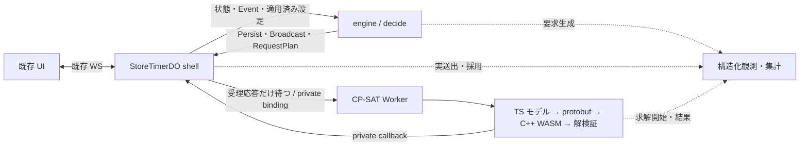

# Design Document

**状態：2026-09-12 に全店舗で CP-SAT を有効化し、運転中である。** 2.5 の判定は不合格のまま（配送遅延 p95）で、ユーザー判断による有効化である。第 12 節の有効化条件（7.4）・R1 の対象限定・7 の再検証は満たしていない。経緯と復帰の一手は[有効化の記録](./verification/cpsat-enablement-20260912.md)にある。**残項目の先頭は task 7 の提案品質の評価**——第 12 節がこれを有効化の前に求めていた項目であり、良し悪しが分からないまま運転している期間を短くする。

## Overview

**状態：設計承認済み（2026-09-09・F-1〜F-4 および G-1 反映）。** [requirements.md](./requirements.md) の A〜E 反映版は同日ユーザー承認済み。F-1 の Effect 列の例外は引き続き要件の追加差分として再確認対象であり、設計承認をその再確認に読み替えない。[tasks.md](./tasks.md) に第12.1節の依存順序と F-1 の再確認ゲートを引き継ぐ。本書の判断・初期値・公開名の設計承認は、作業ツリーの実装の追認や実測による成立確認を意味しない。今回の tasks 作成では実装の続行・デプロイを行わない。

CP-SAT を実際の厨房で評価するため、既存 TS 計画器と CP-SAT の切り替えを、要求・採用・推奨への投影という既存の seam に置く。UI、WS メッセージ、注文と Timer の既存フィールド、Boil_Sync は維持する。旧 TS の点数やハード制約を CP-SAT の採用条件へ混ぜない。

### 中心的な判断

| ID | 設計判断 | 根拠・代償 |
| --- | --- | --- |
| D1 | 選択は Worker env、方針・範囲・予算規則は同梱の版付き TS profile | StoreProjection・管理 UI・config ワイヤへ CP-SAT 設定を追加しない。係数変更にもデプロイが要る |
| D2 | **計画対象は engine と同じ全件（`PLAN_TARGET_LIMIT` 64）。天井を超える局面は部分計画を送らず失敗させる**（2026-09-13 改訂） | 一片は卓の対象を全件置く（`isStale`）ので、部分集合では構造上採用されない。**現状の実装が全数解けるのは 24 件までで、閂は対の項（E4・E7・E8 と `equal`）の 2 乗である**（§7.4） |
| D3 | engine が要求要否を決め、shell は非永続の輸送管理だけを持つ | no-op でも要求できる。再起動をまたぐ exactly-once や全店舗の同時求解数は保証しない |
| D4 | 採用済み CP-SAT 計画は省略可能な専用永続フィールドに保存する | 旧 `acceptedSlices.tableKey` の意味を変えない。旧版は追加フィールドを読み捨てられる必要がある |
| D5 | CP-SAT のクラスタと開始の事実から群・錨を投影する | `tableId` の一致で所属を推測しない。既存 UI の群表示規則は変えない |
| D6 | 単一スレッド C++ WASM、オンライン TS モデル・protobuf codec、非同期の別 Worker | Python は参照検証のみ。別 Worker にしただけで CPU 分離や即時202を証明したとはしない |
| D7 | 未着手の茹で時間はレシピどおり、調理中は実効終了時刻を固定入力にする | 実験の可変茹で時間モデルとは異なる。過去の係数の妥当性を自動的に引き継がない |
| D8 | 観測の3つの計数点を、輸送と求解の実装に先行して用意する | engine の要求生成、shell の送出、WASM の求解開始を分け、休止復帰をまたいで照合する |

### 調査済みの現状

- [settle](../../../src/engine/settle.ts) は、指紋判定より前の `isSameConfirmedResult` で Effect を空にする。CP-SAT の no-op 回復要求にはそのまま使えない。
- [StoreTimerDO](../../../src/shell/store-timer-do.ts) の constructor は `blockConcurrencyWhile` 内でロード・投影読出し・Reconcile・Effect 実行まで行う。ここに CP-SAT の送出を加えると、外部 await を初期化の排他区間へ持ち込む。初期化時の計画要求と、次の入口の計画要求を分ける。
- 同じファイルの `applyProjection` は `decide` を呼ばない。env を選んでも、レシピ・配置・`arms`・`toleranceRatio` 等の投影変更を扱う接続は必要である。
- 設計時の作業ツリーにあった [cpsatSchedule（保存資料）](./verification/archive/cpsat-plan.ts.txt) は、錨を `timer.orderItem?.tableId === item.tableId`、一片を `tableKeyOf` で導いている。この経路は採用しない。J-3対応で正規engineから切り離し、原文を実行対象外へ保存した（設計判断の変更ではない）。
- [planCpsat](../../../src/cpsat/plan.ts) は実験コードを直接 import し、[protobuf codec](../../../src/cpsat/protobuf.ts) と [解検証](../../../src/cpsat/validate.ts) も未検証の組み込み途中である。現時点でオンラインモデルの同値性が確認済みとは扱わない。
- [migrate](../../../src/engine/migrate.ts) は未知の上位スキーマ版を拒否し、既知フィールドを列挙して復元する。省略可能フィールドの追加は v13 のまま行い、実際の復帰先コードとの読書き試験を必須にする。

## 1. 設定層と適用の単位

### 1.1 選択・方針・事実を分ける

| 情報 | 正本／渡し方 | 変更契機 |
| --- | --- | --- |
| 計画器の選択 | アプリ Worker の `PLANNER_BACKEND`：未指定／`ts` は TS、`cpsat` は CP-SAT | デプロイ後、その店舗の次の入口 |
| CP-SAT の有効化世代 | env の `CPSAT_ACTIVATION_ID`。有効化ごとに新しい不透明値 | TS → CP-SAT の再有効化でも必ず更新 |
| 方針・範囲・探索予算 | 同梱 `CpsatProfile`。値と版・内容ハッシュをビルド成果物に固定 | profile を含むデプロイ |
| レシピ・配置・arms・許容幅・上げ窓 | 既存 StoreProjection。投影に保存成功した値を `settleParams` から注入 | `applyProjection` の正常適用後 |
| 注文・Timer・前回提案 | 既存 snapshot の確定値 | 既存の注文・Timer 操作、計画採用 |

切り替え単位は、確認した dev アプリ Worker 全体とする。**2026-09-13、ユーザー判断により段階投入へ改訂した**——`CPSAT_STORE_IDS`（env の許可リスト）に挙げた店舗だけが CP-SAT で解かれ、合成も CP-SAT の規則になる。残りは従来どおりで、求解を通さず画面も費用も変わらない。**店舗別の設定編集でもレジストリのスキーマ変更でもない**——判定は env と自分の storeId だけで閉じ、投影にも永続にも何も足さない。許可リストは 2 つの枝を持つ：(1) 官能評価の店舗（人が操作し画面で提案を見る）、(2) 観測の標本 20 店舗（資源と失敗の分布を測る。誰も操作していないので提案を見る枝ではない）。空文字は「絞らない＝全店舗」。同じ Worker に対象外の経路・店舗が混在すると判明した場合、この単位のまま有効化せず R7.1 の対象確認へ戻る。店舗別設定編集やレジストリのスキーマ変更は今回加えない。

不明な backend 値を TS に黙って読み替えない。配備前検査で拒否し、稼働時に不正な CP-SAT profile が見つかった場合も、注文・Timer 操作を止めず CP-SAT 要求を停止して `configuration-invalid` を記録する。TS 復帰は明示的な設定操作で行う。

`CpsatProfile` は次の3区分を持つ。将来の自然言語変換が触れる interface は `preferences` だけとする。

- `model`：モデル版、codec 版、WASM のハッシュ、時刻離散化、対応範囲。業務の必須条件を表す。
- `preferences`：E1〜E9 の係数とクラスタ間隔仮説。名前の不明な項目・非有限値・負値を拒否する。
- `budget`：事前特徴量からの探索予算規則と資源上限。係数の入力から変更できない。

アプリと solver のビルド manifest は同じ profile 内容を指す。solver は要求の profile・モデル・WASM・activation を検査し、互換でない組を処理しない。段階配備中の混在は識別可能な失敗であり、別係数による黙った成功にしない。CP-SAT を再有効化する際は、同じコード・係数でも activation を更新し、切り替え前の応答が再び有効になる ABA を防ぐ。旧 CP-SAT 版へ activation ごと巻き戻す手順は復帰方法にしない。

### 1.2 既存店舗設定の変更

`applyProjection` は既存の単調版ガード、projection の put、在メモリへの反映、config 配信／非活性化の閉鎖を維持する。その後、CP-SAT が選択され店舗が active の場合に、適用済み入力で engine の再評価へ進む。shell は適用前後の設定と投影適用という契機を明示入力として渡し、計画に関係する値が変わったかは engine が判断する。roster だけの更新から求解を増やさず、shell に計画設定の差分判定を重複実装しない。

再評価には内部 Event `Replan` を追加する設計とし、F-1 の再確認後に実装する。接続・設定変更・保留した要求契機の再開を表し、Timer を発火・同期・操作する Event ではない。engine が現在の対象・保持計画・設定から要求要否を計算する。env を選択したため CP-SAT 専用の設定変更 Event は不要だが、既存投影や接続を扱うこの共通の入口は必要になる。

- projection の put が失敗した場合、新しい設定で `Replan` を呼ばない。
- 無視した旧版の投影は契機にしない。同じ版・同じ内容の再適用も新しい設定変更に数えない。
- projection の put は既存設定の保存であり、要求記録の Persist ではない。TimerState が変わらなければ追加の snapshot put・Broadcast は出さない。
- 設定変更で採用済み計画の配置が物理的に無効になり、採用済みの内容を削る場合は実際の計画状態の変更として Persist → Broadcast を行える。単なる送出番号更新とは区別する。
- 非活性店舗・未プロビジョニング店舗からは計画要求を出さない。既存の認証・認可・接続拒否を迂回しない。

## 2. Architecture と module の interface



図の engine の観測矢印は I/O ではない。engine の戻り値を shell が観測する。

| Module | 呼び手が知る interface | 内部に隠す implementation |
| --- | --- | --- |
| engine の計画分岐 | 既存 `decide`／snapshot 射影。適用済みの mode・profile を明示入力にする | TS と CP-SAT の対象選択・要求要否・採用・保持・群投影の差 |
| shell の CP-SAT 輸送 | engine が記述した要求の送出、応答受領、一時記録の解放 | private binding、request ID、同時送出制限、重複の抑制、受理失敗 |
| CP-SAT 計画器 | 検証済み局面＋profile → 成功した候補または識別可能な失敗 | モデルの補助変数、protobuf、WASM 初期化、メモリ解放、解の復号 |
| 観測の集計 | 版付きの観測行 → 件数・対応関係・欠測のあるレポート | 起動をまたぐ相関、重複排除、頻度、測定区間ごとの集計 |

汎用の solver registry や戦略クラス階層は作らない。実在する TS／CP-SAT の2つの adapter を、既存の要求・採用・投影の seam で分ける。DO の計画判断は `decide` 内、Cloudflare の I/O は shell と Worker の端に置く。試験もこの interface を通し、solver の内部関数を都合よく mock して採用の検証を飛ばさない。

## 3. 対象・局面・入力の同一性

### 3.1 初期の対象選択

CP-SAT の対象選択は一つの純粋関数に集約し、要求・新着応答の検証・保持のいずれも同じ規則を使う。

1. 既存 `pendingOrders`／期限判定で、期限内かつ未着手の品目を得る。到着受理や保存件数の上限とは別である。
2. 既存の到着順と同値時の決定的な順序に従う。
3. レシピから茹で時間を取得できない品目、初版の物理対応範囲外の品目を理由付きで除外する。`arms + 2` では除外しない。
4. **残り全件を対象にする**（engine と同じ `PLAN_TARGET_LIMIT` 64・2026-09-13 改訂）。部分集合を渡さない——一片はその Table_Group の計画対象を 1 つ残らず置いていなければ `isStale` で落ちるので（`src/engine/schedule.ts`）、**部分集合の計画は構造上採用されない**。本番実測でもこれが採用 0 件の本体だった。

**ただし現状の実装が全数を解けるのは 24 件までである。** 32 件以上はモデル規模の防壁（変数 8192）に当たり、**閂は対の項（E4 距離・E7 逆転・E8 分断と `equal`）が組の数＝杯数の 2 乗で膨らむこと**である（§7.4）。到達していないこの事実と閂の所在は、上限を上げる判断と同じ場所に置く。

**天井を超える局面の振る舞い（R6.4「対象超過」）。** 卓の対象が実装の天井を超えるときは、**部分計画を送らず、理由つきの失敗を返す**。engine は自分の計画を保ち、画面の推奨は途切れない。被覆の規則は崩さず、CP-SAT は「解けるときだけ全件」で入る。ピークが天井に収まる店舗では、これで実用に届きうる——**ピークの実測は、操作されている店舗の局面が取れてからである**（コーパスの `running` は空で、ピークを代表しない）。

solver は渡された対象をさらに `.slice` しない。処理不能なら全対象の失敗として返す。未対応の品目（茹で時間を引けない・占有が範囲外）は注文の正本と既存の待ち行列に残し、対象入りするまで推奨を持たない。**全件を渡すので「上限外の表示差」（R2.3）は生じない。**

初期対応は `slotSpan` 1／2、既存の1〜4ユニット（6〜24スロット）とする。正常な、スロットを重複使用しない Timer 集合が最大24件なのは、[UNIT_COUNT_MAX(4) × SLOTS_PER_UNIT(6)](../../../src/domain/store.ts) の帰結であり、別の設備上限を追加する判断ではない。設備の対応範囲は有効化前に実設定の unitCount で確認する。これは [MAX_TIMERS=100](../../../src/engine/types.ts) という既存の登録上限とは別である。

ただし [アドホック Start](../../../src/engine/start.ts) はスロットの範囲・重複を拒否せず Timer を追加するため、コード上すべての入力で「25件以上は到達不能」とは主張しない。CP-SAT 入力の件数上限24とスロットの整合検査は残し、超過・不整合なら注文・Timer を削らず計画の失敗とする。既存の開始操作の拒否条件は今回変更しない。対応範囲を拡大するときは profile を変えて再検証する。

### 3.2 局面の内容と単位

- 未着手：品目鍵、注文識別子、`arrivalTime`、レシピから解決した茹でミリ秒、占有数。実購入時刻は復元しない。
- 調理中：Timer ID、品目参照があればその鍵、開始時刻、実効 `endTime`、スロット、`boiledAt`。レシピの変更から既存 Timer の茹で時間を引き直さない。
- 現在の占有集合：確定した Timer 全件（running／boiled）から engine が `occupiedSlotsOf` で導き、モデルへ明示入力として渡す。Timer が正本であり、この集合を別に永続しない。釜番号を重複のない順序へ正規化し、solver の入力検証でも同乗した Timer からの導出と一致することを確認する。欠落を空集合に読み替えない。
- 店舗：物理スロットと座標、`arms`、`toleranceRatio`、既存の上げ窓。CP-SAT に使わない旧 TS の重みは方針へ混ぜない。
- 前回提案：対象品目のスロット集合。E9 に必要な範囲を使い、配列の順序だけの変更を費用にしない。
- 直近の事実：現存する Timer の `boiledAt` から得られる発火履歴。Complete で消えた Timer の発火履歴はオンライン正本からは得られないため、初版は追加の履歴台帳を作らず `partial`／`unknown` を記録する。未取得を「直前の負荷0」と実証した入力と混同しない。

申告卓番号は既存データに維持するが、solver の同一注文・クラスタ・錨の識別には使わない。匿名化する場合も注文の同一性と品目鍵の一意性を保存する。実データは申告値1のみ、他の申告値は合成 fixture で検証する。

### 3.3 2つの同一性

`inputKey` は業務的に同じ問いを識別し、`requestId` は実際の1回の送出を識別する。重複要求を失うのではなく、同じ inputKey に複数の requestId が対応し得る。

inputKey の正準入力には、選択した対象の属性、全 Timer の必要事実とそこから導く現在の占有集合、物理設定・レシピ・許容幅、利用可能な直近履歴と完全性、比較対象の前回スロット、profile の内容、モデル・codec・WASM の版、activation、対象上限、予算規則と算出済みの予算値を含める。順序が意味を持つ対象の到着順は残し、集合であるスロットなどだけを正規化する。solver と engine で同じ純粋な正規化を使う。

現在時刻そのものは inputKey に入れない。時刻により変わる期限内対象や占有分類は含める。各実行の `asOf` と後述の整数時刻原点は要求に別に載せ、再現 manifest に保存する。時刻経過だけで永久に指紋が変わる仕組みにしない。

採用の最終照合は正準化した入力の完全一致とする。短い32-bit digest やログ用 hash だけを安全性の根拠にしない。生の正準入力は private 往復内だけで扱い、ログには出さない。採用済み計画に残す由来のキーは有界な内容ハッシュであり、これだけで現在との整合確認を省略しない。

## 4. 要求の契機・no-op・輸送の状態遷移

### 4.1 初期化と入口を分離する

CP-SAT モードの constructor は、従来どおりロード・投影反映・期限到来 Timer の Reconcile・必要な Persist／Alarm／Broadcast を行うが、計画要求は生成しない。初期化の `blockConcurrencyWhile` 内で solver を呼ばない。TS モードの従来経路は維持する。

初期化完了後、実際の入口が次の契機を渡す。再起動は「constructor で何でも要求する」のではなく、起動を生じさせた入口とセットで扱う。

| 入口 | CP-SAT の要求契機 | 注意 |
| --- | --- | --- |
| 認可済み WS 接続・再接続 | `Replan` | config と初期 snapshot の既存送信を維持する |
| 注文受理・開始・中断・完了・調整 | 既存 Event の確定後の判断 | no-op でも未充足なら要求判定へ進める |
| Alarm | 既存の発火・同期後の判断 | 計画用 Alarm は追加しない |
| 投影の関連設定変更 | 正常適用後の `Replan` | projection の put 失敗／無視した旧版からは要求しない |
| solver の成功・失敗 callback | それ自体は新規の契機にしない | callback で起動しても constructor から再要求しない |
| 保留済みの別契機の再開 | 元の契機に対応する `Replan` | callback を根拠に新しい無限ループを作らない |
| 自動心拍、拒否された接続、観測収集 | 要求しない | 計装で wake や要求を生まない |

### 4.2 engine の判断

CP-SAT の settle 相当部分は次の順序に分ける。Timer の操作・同期そのものは既存関数へ委ねる。

1. Event の業務遷移を計算し、保持可能な CP-SAT 配置を導く。
2. `isSameConfirmedResult` の比較対象に永続する `cpsatPlan` を含める。含めなければ、採用済み計画だけを変える遷移が no-op とされ、保存されない。比較結果が不一致の場合だけ Persist → Alarm 更新 → Broadcast を組み、前回提案の更新はその Persist に同乗する。表示時の時刻補正という導出値や shell の一時記録は比較対象に足さない。
3. 業務結果の no-op とは独立に要求要否を判定する。対象なし、対象全件が現在の方針に対して充足済み、または callback 自体なら要求しない。有効計画なし・未充足・方針や版変更なら RequestPlan を記述する。
4. RequestPlan は確定変更の作用列の後ろ、または確定済み状態に対する単独 Effect とする。CP-SAT では `requestedDigest` を読んで抑制せず、送出のためにも更新しない。

Effect 列の interface は R5.8 の追加差分に従う。状態変更列は Persist を先頭にちょうど1件持ち、RequestPlan があれば末尾に最大1件。状態不変なら、要求ありは `[RequestPlan]`、要求なしは `[]` とする。`Replan` もこの分類に従い、要求単独列に Alarm 更新・Broadcast を混ぜない。TS モードの従来契約を全体として緩める変更ではない。

[runEffects](../../../src/shell/store-timer-do.ts) の逐次実行ループは既に要求単独列・空列を実行でき、どちらも `persisted: true` を返す。この目的で本体や戻り値の形を変更する必要はない。Persist のある列で put が失敗すれば `false` を返して後続を中断する現行処理を維持する。`RunResult`／`persisted` の doc は「返却時、列内の Persist はすべて成功、または Persist 自体がないなら true。put 失敗による中断は false」と実態に合わせ、ループ内の「Persist 成功の後でのみ到達する」というコメントも、状態変更列と要求単独列を区別する記述へ直す。`true` は put の実施や求解成功の証拠ではない。

輸送の受理・抑制・失敗は第10節の別の観測として扱い、既に確定した注文や Timer 操作を未確定と報告しない。Operation History の `tryWriteCommittedOperation` は既に `effects.some(e => e.type === "Persist")` と結果の両方で守られているため、要求単独列を記録しないための改修は不要である。変更対象の既存 property と生成器は第11節に明記する。

### 4.3 shell の一時情報

shell の各 instance に置くのは、次の有界な輸送情報だけである。TimerState、snapshot、WS attachment には置かない。

- 受理済みで終端未観測の attempt：最大1件。requestId・inputKey・送出時刻・受理状態を保持する。
- 輸送枠が埋まっている間の保留契機：最新1件。複数の別入力の要求は最新の契機へ集約し、モデルや解をキューとして保持しない。
- 各入口での送出は最大1回。同じ失敗をその入口内で自動再試行しない。

同じ inputKey が送出中なら重複として抑制する。異なる inputKey が来た場合は保留契機を置き換える。完了・明示的な失敗で枠が空いたら、保留契機があるときだけ、それを消費して `Replan` を呼び、現在の確定状態から再評価する。shell 自身が対象や計画内容を再計算しない。再評価が不要なら新しい要求は出ない。この再開は過去の注文・設定等の契機の続きであり、結果受領を無条件に次の求解へつなぐ規則ではない。

送出前、最初の await より前に attempt を登録する。送出失敗・非202・callback の終端で、該当 requestId の記録だけを解放する。古い callback が新しい attempt を解放してはならない。202は受理であって求解成功ではない。

callback が失われた場合に備え、初期案として45秒の受動的な失効期限を持つ。次の許可された入口でだけ時計を読み、期限切れの attempt を `outcome-unknown` として解放する。タイマー・Alarm・常駐 Promise でその時刻まで待たない。これは輸送の回復期限であり、CP-SAT の探索打ち切りや solver の強制キャンセルではない。

記録は再起動で失われるため、旧 instance の求解が残っている間に再送され得る。上限1件はその instance が追跡する論理的な枠の上限であり、再起動や期限切れをまたぐ実際の総並列数の保証ではない。R6.7 の代償を R8.10 の起動・頻度の観測で把握する。無活動・callback 消失後の自律的な再試行は保証せず、接続・操作・設定変更など次の許可された契機で回復する。

## 5. 採用済み計画・鮮度・ロールバック互換

### 5.1 永続するもの

`TimerState` と v13 の `StoreSnapshot` に、省略可能な `cpsatPlan` を追加する設計とする。これは送出記録ではなく、採用した出力の事実である。

**2026-09-13 の実態：この追加は行われていない。** 2026-09-12 に全店舗を CP-SAT へ切り替えて運転しているが、保存状態に CP-SAT 専用のフィールドは 1 つも増えていない。復路の封筒（`planner`・`inputKey`・`requestId`）は `toCookSchedule` が `{ slices }` だけを組み直すため**入口で落ちており**、採用された計画は TS のものと同じ `acceptedSlices` として保存される。

その帰結として、**この節が前提にしていた R7.5 の互換条項（旧版が追加フィールドを読み捨てられること）は、現行実装では空振りしている**——読み捨てるべきフィールドが存在しない。実測で確かめた（[TS 復帰の確認](./verification/ts-restore-checklist-20260913.md) A-1）。

良い方向の事実だが、**`cpsatPlan` を後から足すなら互換条項は再び効く**。足す判断をするときに、この節を実装に合わせて書き直す。下の表は「足す場合の設計」として残す。

| 内容 | 上限・意味 |
| --- | --- |
| 形式版・profile・activation・採用元の識別情報 | 固定サイズ。最後に採用した要求の requestId・asOf を含む。要求中／失敗回数は保存しない |
| 採用した配置 | 最大6杯。品目鍵、スロット、開始・serveAt、採用時のクラスタ所属、時刻補正の不変な基準 |
| 関連する開始済み Timer の所属 | 最大24件。Timer ID とクラスタへの対応。実際の開始と同じ Persist で確定する |

既存 `acceptedSlices` は TS の卓単位の一片という意味のままにし、CP-SAT の架空の卓鍵を書かない。CP-SAT モードはそれを通常提案の供給元にしない。`shownPlan` は従来どおり配信対象として確定した提案であり、CP-SAT の投影からも同じフィールドの意味で作る。

最後の採用元は、残存配置が0件になっても固定サイズのまま残す。これは採用済み出力の由来であり、送出済み要求の履歴ではない。旧応答を棄却するために使い、計画がないときの新しい要求を抑制する根拠にはしない。

旧版は `cpsatPlan` を無視して起動し、書き戻し時に失ってよい。新版も欠落・未知の内部形式版・不正な追加フィールドだけなら「CP-SAT 計画なし」とし、健全な注文・Timer の復元は維持する。既存フィールドの破損まで追加フィールドの不正として握り潰さない。v13 より大きい schema version は書かない。

### 5.2 private の往復契約

往路は `protocol`、storeId、requestId、activation、profile、asOf、inputKey と正準入力を持つ。solver が指定する任意 URL を callback 先に使わず、既存 DO namespace の storeId から宛先を決める。

復路は `{ protocol: "cpsat/v1", requestId, activation, inputKey, request: ..., result: ... }` という envelope にし、既存 `deliverPlan` の受け口で TS／CP-SAT を識別する案とする。`request` には往路の storeId・asOf・profile の識別情報と正準入力を改変せず同乗させ、再起動で一時記録が消えても完全照合できるようにする。この同乗分も復路のサイズ上限に含める。**CP-SAT 応答のトップレベルに `slices` を置かない。** 旧 TS 版の `toCookSchedule` が未知の CP-SAT envelope を通常の外部計画として読めない構造にする。これにより旧版への復帰中の遅着も、旧改善ゲートへ迷い込まず棄却される。実コードの旧版 fixture で確認する。

成功 result は対象全件の配置、モデルに含めた固定 Timer とクラスタの対応、求解 status、消費探索量、モデル規模、独立検証・費用の結果を含む。失敗 result は理由を持ち、成功の空計画へ変換しない。CPU・メモリ・waitUntil 終了では callback 自体が来ないことがあるため、観測上の終端不明も表現する。

### 5.3 新着応答のゲート

次の順で検証する。どの段階でも旧 TS の目的値を使わない。

1. envelope の版・サイズ・型、店舗、backend、activation、profile・モデル・WASM の一致。
2. 現在の確定状態から生成した正準入力との一致。同じ activation で最後に採用した要求より古い asOf は棄却する。同時刻の別 requestId は後着を採用せず、同じ requestId は重複として no-op にする。UUID の大小を新しさと解釈しない。未着手対象の変化、調理中の変更、方針変更、前回スロットの変化も旧応答を棄却する理由になる。shell の in-flight 記録の存在は採用条件にしない。
3. 生成へ渡した対象の過不足・重複がなく、各杯に必要本数の相異なる実在スロットがあり、レシピ・時刻・計画上の解放時刻に整合すること。要求時点の asOf と占有集合に対して、第7.1節の即時配置の制約を元の返却配置が満たすことも独立に検査する。解放予測と現在の開始可否は別の検査であり、boiled の Timer が残るだけで将来配置まで不正にしない。
4. 遅延で開始が過去になった場合は、未着手配置全体を同じ非負ミリ秒幅だけ後ろへずらす補正を一度だけ試す。初期の許容補正は最大30秒。**実装は `retimed`（engine/schedule.ts）と `admitDetailed`（engine/admit.ts）で、CP-SAT モードにだけ当てる**（2026-09-13 実装）——TS モードは巻き戻しの経路であり、補正を入れれば「同じ計画が前は落ち、いまは通る」を旧経路にも持ち込むことになる。補正した幅は `cpsat.plan-decided` の `retimedByMs` に載る。調理時間・未着手どうしの非重複を保ち、現在の Timer の解放予測・クラスタ所属を再検証する。補正後に「今開始」の配置（`startAt <= now`）は別途 `occupiedSlotsOf` で全釜 idle を検査し、running／boiled の Timer が残るスロットなら開始可能とは扱わない。この即時配置の検査に落ちた場合も応答全体を棄却する。将来配置には「今」の occupied を延長適用しない。
5. solver が返した元の解と、補正後に採用する計画の費用を別々に計算・記録する。補正後の計画を solver が最適性を証明した解とは扱わない。
6. 採用した計画と前回提案を同じ Persist で確定してから配信する。すでに同じ由来・同じ内容を採用済みなら no-op。重複応答で前回提案を巻き戻さない。

第7.1節の生成制約は、要求時点で既に押せない「今」の配置を返させないためのものであり、4番のゲートは残す。送出後の新しい Timer 開始・Boil_Sync 調整は現在入力との照合で検出し、最終的な占有検査も省略しない。また占有集合が不変でも、要求時点では将来だった配置が応答遅延で「今」へ移る経路がある。その釜に Timer が残っていれば全体棄却し、元が即時配置だった場合とは棄却理由を分ける。この変更だけで Complete 待ち中の全棄却がなくなるとは主張せず、発生数を観測する。

### 5.4 保持中の計画

保持の再検証は新着ゲートとは別の入口で、全件充足を要求しない。開始・注文削除・期限切れ・対象の入れ替わりで消えた配置を除き、有効な残りを保持する。現在時刻への補正を行う場合もスロット集合は変えず、共通の時刻移動後に物理条件を再検証する。「今開始」の配置だけには第5.3節と同じ `occupiedSlotsOf` の検査を適用し、開始を妨げる配置を除く。boiled の釜を使う有効な将来配置は保持し、到来後も Timer が残っていれば次の再検証で除く。遷移が無い間も既存 UI の全釜 idle と開始操作の規律は維持する。無効な一部を落としただけで、互いに安全な残りまで全棄却しない。

時刻補正は solver の元の配置時刻を不変の基準とし、新着時の補正を含め累積30秒までとする案。再接続・別品目の開始・表示射影でこの基準を更新しない。必要な補正が上限を超える過去の配置を先に除き、残りについて共通の補正と物理検査を行う。将来の安全な配置まで過去の1杯と一緒に捨てない。配置間の競合を除く必要があれば、元の開始時刻・到着順による決定的な順序で有効な残りを選び、ソフト費用で棄却対象を選ばない。

再接続の表示射影だけで `shownPlan` を更新しない。補正して表示する時刻と元の採用時刻は観測上区別する。補正不能・物理競合による未配置が生じた場合は、次の許可された契機で新しい計画を要求する。候補を増やす TS 尾部補完は行わない。

## 6. クラスタ・群・錨への投影

solver の配置は卓単位の `PlanSlice` へ変換せず、CP-SAT 専用の採用済み配置から既存 `CookRecommendation` の形へ投影する。TS の `recommend` は変更せず、CP-SAT の群形成だけ別の純粋な投影とする。前回提案も同じ投影結果から作り、群の定義を二重化しない。

1. 新着計画のクラスタは整数秒の `serveAt` の一致で決める。申告卓番号では分割しない。群 ID は snapshot 内だけで意味を持つ不透明値とし、永続的な実卓 ID にしない。
2. 計画時点ですでに調理中だった Timer は、モデル内でそのクラスタに属していた Timer ID を根拠にする。`tableId` や終了時刻の偶然の一致からアプリ側で所属を足さない。
3. 採用済み計画の品目を StartOrderItem したときは、その品目と新しい Timer の対応を同じ業務 Persist に保存する。手動で別スロットを選んだ場合は提案との差として観測し、架空の同卓所属に変換しない。
4. 保持中の群は、採用時のクラスタと、そこから実際に開始した品目の所属を引き継ぐ。Boil_Sync がその Timer の終了を動かしても、終了時刻だけから別の群へ付け直さない。
5. 群に属する生きた未発火 Timer があれば、その実効終了時刻の最大を既存ワイヤの `anchor` に写す。これは「群の開始済みメンバーがまだ調理中」の期限であり、全メンバーが同じ実効終了になる保証ではない。同じ群の推奨には同じ anchor を渡す。
6. 完了・中断・発火で調理中メンバーがなくなれば anchor を外す。次の再計画では現在の実効終了に基づいてクラスタを再構成する。新着計画の遅延補正で固定 Timer とクラスタが分かれた場合は、その新着計画の合流先としては採用しない。

既存 client の群連鎖・開始済み・全釜 idle・担当範囲・`arms` による表示をそのまま通す。CP-SAT が `arms + 2` を超えるクラスタを返してもソフト違反だけで棄却しないが、今占有されているスロットは表示・開始に使えない。`table=1` の別注文、申告卓なし、異なる申告卓番号でも同じ interface で検証する。

計画上の厳密同一秒クラスタ、開始済みの所属、Boil_Sync 後の実効終了クラスタは3つの異なる観測対象である。R8.8 の比較でその差を隠さない。Boil_Sync のアルゴリズム、TimerFact、UI の群判定そのものを変更する案ではない。

群内 anchor の一意性は、client に検出を委ねない独立した不変条件とする（P16）。[liftGroupsOf](../../../src/domain/lift-group.ts) は群の最初の anchor だけを読むため、不一致でもエラーにならない。投影 module は群ごとに anchor を一度だけ導出して全メンバーへ写し、出力について `group(a) = group(b) ⇒ anchor(a) = anchor(b)`（null も含む）を検証する。メンバーの並び順を入れ替えても群の started と表示連鎖が変わらないこと、および1件だけ anchor を変えた不正 fixture をこの検査が検出することを、P10 の表示例とは別に試験する。複数の開始済みメンバーでは最大 endTime を採り、最早のメンバーだけが発火しても残る未発火メンバーがあれば started が維持されるケースを含める。

## 7. オンラインモデルと報酬・ペナルティ

### 7.1 時刻・占有・調理中

初版モデルの秒原点は `origin = floor(asOf / 1000) * 1000` とし、epoch ミリ秒をそのまま巨大な CP-SAT 変数にしない。未着手は整数秒の開始・終了、`end = start + recipeSeconds`。初版は正の整数秒で表現できるレシピを対応範囲とし、端数があれば無断で丸めず未対応を記録する。待ち費用の arrivalTime は元のミリ秒値も持ち、秒への変換で落とした定数分を独立採点で復元する。順序の比較は元の arrivalTime で行う。

調理中は開始を床、実効終了を天井へ丸めて占有区間を保守的に覆い、スロットと終了を固定する。`toleranceRatio` は入力・版照合と Boil_Sync の契約として保持するが、solver に Timer を変更する権限を与えない。未着手の期間も許容幅で短縮しない。

各杯の選択スロットに optional interval を置き、各スロットの NoOverlap と開始＋期間＝終了を明示する。占有2はソートした相異なる2スロットとし、腕数とは無関係に物理本数を検査する。

モデルのスロット解放は既存 [initialRelease](../../../src/engine/schedule.ts) に揃え、Timer のある釜は `max(asOf, 実効 endTime)`、Timer のない釜は `asOf` とする。整数秒への変換はこの下限を割らないよう天井へ丸める。boiled の実効 endTime は過去なので解放は asOf となり、全 horizon を使用不可にしない。麺揚げ後の釜は空き、Complete は UI 上の確認であって計画上の物理解放条件ではない、という既存の規律を維持する。「想定 Complete 遅れ」という新しい待ち時間も加えない。

一方、「今、開始操作できるか」は [occupiedSlotsOf](../../../src/domain/store.ts) が表す別の事実であり、running／boiled の Timer が残る釜は今の開始には使えない。第3.2節の占有集合を生成段階でも使い、未着手品目の即時配置には次の制約を課す。

- 開始変数を原点からの整数秒 `startTick`（復号は `startAt = origin + 1000 × startTick`）で表す。モデルが表現できる最早の開始秒を `nowTick = ceil((asOf − origin) / 1000)` とし、全未着手品目の `startTick >= nowTick` を要求する。
- `startTick == nowTick ⇒ 割当スロット集合 ∩ occupiedSlotsOf(Timer 全件) = ∅`。占有2では片方だけが占有中でもこの即時配置を禁止する。
- `startTick > nowTick` の将来配置には、この占有集合による禁止を課さない。解放予測と NoOverlap 等は引き続き満たす。

ここでの「今」は最早の表現可能な秒である。asOf が整数秒なら元の `startAt = asOf` と一致し、端数があれば最初の天井秒を指す。生のミリ秒 asOf と整数秒の復号値を等号比較して条件を空振りさせない。これは既存の離散化の定義であり、Complete を待つ固定の猶予時間を追加するものではない。

**ただし asOf は「解いた時刻」ではなく「受領の見込み時刻」である（2026-09-14 改訂）。** モデルへ渡す asOf は `now + CPSAT_DELIVERY_LEAD_MS`（8,000 ms）とする。理由は受理側の事実にある——DO が計画を受け取るのは Queue → 求解 → 復路のあと（本番実測 p50 2,648 / max 6,619 ms）で、受領時刻の解放表は `now` に床を張るため、「解いた今」から置いた計画の先頭は**過去開始**になり `feasibleRelease` が落とす。実データの `table_no` は全行 `1` ゆえ一片は卓 1 つにまとまり、それが計画全体の棄却になる（**本番 322 件すべてが `rejected` だった**・`verification/cpsat-delivery-lead-20260914.md`）。

これは「Complete を待つ猶予」でも解放予測の遅延でもなく、**計画が有効であるべき時刻を、解いた時刻から受け取る時刻へ合わせる**ことである。値は実測の max に約 1.2 倍の余裕を置いた。

**これは第 5.3 節 手順 4 の補正（R5.5）とは別物で、役割が違う。守りは 2 段である。**

| 段 | どこ | 何をするか | 弱点 |
|---|---|---|---|
| 第一線 `CPSAT_DELIVERY_LEAD_MS` | **生成側**（モデル） | 置ける最も早い開始時刻を一律に 8 秒先へ送る | 遅れが lead を超えれば効かない。遅れが 2 秒でも 8 秒ずらすので、**すべての推奨が「いま」ではなく先を指す系統的な偏り**を持つ（TS の `pinNow` が持っていた即時開始の推奨は出なくなる） |
| 第二線 手順 4 の補正 | **受領側**（`admit`） | 実際の遅れの分だけ全配置を後ろへずらし、物理条件を再検証する（上限 30 秒） | 補正した計画は solver が最適性を証明した解ではない |

第一線だけでは裾（24 件・走行中あり・予算 0.5 の局面は CPU だけで数秒になる）で全件棄却に戻る。第二線だけでは毎回の受領が補正を要し、元の解から毎回ずれる。**両方在って初めて、lead を短くしても棄却が増えない形になる**——lead を短くすれば偏りも小さくなる。その値の見直しは、補正が当たった割合と残余の棄却率を測ってから行う（式・遅れ・補正率・棄却率を 1 組で記録する）。

解放予測と今の釜選択を分ける規律は [baselineSchedule の occupied／pinNow](../../../src/engine/schedule.ts) と共有するが、TS の配分アルゴリズムを後処理として混ぜない。CP-SAT モデルの制約として直接表し、解放表を遅らせたり全 horizon を禁止したりしない。生成済みモデル・返却解の検証には要求時点の占有集合を使い、採用・保持には第5.3〜5.4節に従って現在の Timer から再導出した集合を使う。既存 client の表示と開始操作の規律も変えない。制約の追加はモデル版に含め、第8.3節の旧実験モデルとの照合でも差分として扱う。

horizon は現在と固定 Timer の終了から全対象を順に茹でられる範囲を有界に組み、最大4時間を超える場合はモデル資源上限として失敗にする。12分は評価指標であり、この horizon や注文破棄条件とは別である。

### 7.2 費用の定義と初期値

初期値は [defaults.json](../../../experiments/cpsat-workers/tuning/defaults.json) の値を出発点とする。**固定 Timer・レシピどおりの期間というモデル変更を含むため、初期仮説と表示する。** 報告時の基準費用は各杯の上流観測起点の待ち秒数であり、占有2でも1杯分。固定 Timer だけで決まる定数費用は探索用の式から除いても、定数 offset を保存して評価値と対応づける。

距離は実験の定義を明示的に引き継ぐ案：`D(a,b) = 10 max(|dx|,|dy|) + 4 min(|dx|,|dy|)`。物理座標をこの整数格子に表現できない設定は検証で検出し、勝手に丸めない。`C(s) = Σ_t D(s,t)` は使用可能スロットだけでなく全物理スロットへの和とする。実験との対応を確保するため、距離系の表示単位は `D/10`、整数モデルの目的関数は全体を10倍して持つ。

| ID | 評価量 | 初期係数 |
| --- | --- | --- |
| E1 | 各クラスタ時刻 t の窓 `(t − liftWindow, t]` 内のスロット負荷 L のうち `max(0, L−arms)` を各クラスタで1回数える。**第2段（`L−arms−2`）は評価量ではない** | `liftOverflowCost=60`（**`severeLiftOverflowCost` は不使用**） |
| E2 | 整数秒が異なる麺揚げクラスタの数 | `clusterCost=30` |
| E3 | 隣接クラスタの間隔不足 `max(0,target(直前クラスタの杯数)−間隔)`。利用可能な直近の発火との不足も数える | `gapShortfallWeight=2` |
| E4 | 同一クラスタの異なる杯どうしについて、割当スロットの全組合せの距離を合計 | `simultaneousDistanceWeight=1` |
| E5 | 1杯内の各スロット対の `max(0,D−10)/10` | `multiSlotDistanceWeight=60` |
| E6 | 占有1：`(max C−C(s))/10`。占有2：各スロットの `(C(s)−min C)/10` の和 | `peripheralWeight=1`、`centralWeight=1` |
| E7 | arrivalTime が早い杯の終了が遅い杯より後になる対の数。同時到着・同時終了は除外 | `purchaseInversionCost=20` |
| E8 | 同一注文の杯を結ぶ木の辺について、最短スロット間距離 D による分断 `D>10` と超過距離 `max(0,D−10)/10`。最小費用の全域木で集計 | `orderFragmentCost=30`、`orderDistanceWeight=1` |
| E9 | 前回提案がある同じ未着手品目のスロット集合が変わった回数 | `slotChangeCost=10` |

`target(n)` は杯数1／2／3／4で45／75／100／120秒、5杯以上は `120 + 20(n−4)` 秒を初期仮説とする。これは長めの後工程間隔であり、`liftWindow` や腕数とは別の設定である。人数・技能からの短縮は今回導入しない。

E1〜E8 は未着手と固定の調理中を含むモデル内の関係を考慮し、E9 は未着手だけに掛ける。調理中の注文キーが不明なら Timer ごとの独立キーとし、異なる注文を同一注文として結ばない。利用可能な過去の発火は E1・E3 の固定文脈として扱い、欠落している履歴の杯を捏造しない。

係数は実験同様の非負整数・最大10000を初期の対応範囲とし、重い段階を軽い段階より大きくする。将来の自然言語変換結果にも同じ検証を適用できる。係数で occupancy、レシピ、対象範囲、予算を変えられない。

#### 上げ窓の上限はハード制約である（2026-09-13 改訂・R4.4）

**`arms + HELPER_ARMS`（＝`arms + 2`）を超える負荷を持つ計画を作らせない。** 値段ではなく制約である。

```ts
b.linear(loadTerms, -INF, h.arms + 2);   // ハード
const excess = b.positive([...loadTerms, [b.constant(h.arms), -1]], 2);
b.cost(b.conditional(excess, leader), p.liftOverflowCost * 10);   // arms はソフトのまま
```

engine（`src/engine/lift.ts`）は `arms` をソフト、`arms + HELPER_ARMS` をハード（`withinLiftCap`——
ゲート (f) と確定計画の合成が読む）としている。**モデルと `admit` が同じ規則を見る。**

**engine の条件より弱くない。** engine は「ある上がり t を含むすべての窓」を見るのに対し、モデルは
「各上がりを右端とする窓 `(t−L, t]`」だけを縛る。長さ L のどの窓 `W = [x, x+L)` についても、W に入る
計画上がりのうち最遅を t\* とすれば、W の各点 q は `q ≤ t*` かつ `t* < x+L` より `q ≥ x > t*−L` を
満たすので `(t*−L, t*]` に入る。ゆえに右端固定の検査が任意の窓を覆う。

**代償ではなかった（2026-09-13 訂正）。** ハードにした直後は対象件数を上げると `status=UNKNOWN`
（予算内に実行可能解なし。**実行不能とは別である**）が増え、当初これを制約の性質と読んだ。
**主因は hint が制約を破っていたこと**である——hint は釜の空き順で貪欲に組むだけで上げ窓を見ておらず、
`helped = 0` を渡すのにソフト側の容量を超えていた。hint を実行可能にすると上限 24 で 12/12 が解ける。
`status` の区別が付くよう、解の検査は理由つきで失敗する。
`severeLiftOverflowCost`（600）は**不使用**になる。係数一覧（`defaults.json`）には残すが、モデルは読まない。

### 7.3 探索予算と資源上限

モデル生成前に engine が算出できる特徴量で予算を定め、要求の同一性にも実際の値を含める。初期検証案は次の固定規則とする。これは CPU 完了時間の予測式ではない。

`budget = min(200000, 40000 + 5000n + 2000r + 2000n2 + 500n(n−1)/2 + 500s) / 1000000`

- n：未着手対象数、r：未発火の固定 Timer 数、n2：未着手の占有2の杯数、s：全物理スロット数。
- 単位は OR-Tools の deterministic-time の探索量。実時間の秒ではない。seed=1、num_workers=1、wall-time 停止は使わない。
- 実験の `min(0.2, 0.04 + variables/50000)` とは別規則であり、実験 CPU 値からこの式の安全性を主張しない。solver は受け取った特徴量・予算を再計算して一致を検査する。

**予算を変数の数で決めない（2026-09-13 改訂）。** 実験側の式は変数の数を読んでいたため、**良い定式化ほど
時間をもらえなかった**——上げ窓を累積資源へ畳んで変数を半分にしたところ、予算も減って最初の実行可能解に
届かなくなった（実測）。難しさの代理は**杯数**である。杯数はモデルの書き方に依らず、engine が求解の前に
知っている値でもある（要求の同一性に入れられる）。実験側は `min(1, 0.05 + 杯数 × 0.02)` に改めた。
上限 1.0 は CP-SAT の決定的時間が `(0, 1]` しか受け付けないことによる（実測で 3 は拒否された）。

**予算だけでは実行可能解に届かない。** ハード制約の下では**実行可能な hint** が要る。hint が制約を
破っていると、ソルバーは最初の解を自力で探すことになり `status=UNKNOWN` が増える（2026-09-13 の実測。
hint を実行可能にしたところ対象 24 件が 0/12 → 12/12 になった）。hint は「手がかり」であって制約では
ないので、実行可能にしても解集合は変わらない。

#### 係数は実測で校正する（2026-09-13）

`min(1, 0.05 + 杯数 × 0.02)` は**係数に根拠が無かった**。本番の上限 6 で旧規則の 3.7 倍になり、
CPU が 2.3 倍（p50 712 → 1,771 ms）に増えたうえ、**OPTIMAL 率は 3% のまま変わらなかった**。

校正は**2 点を通す直線**とする。

| 通す点 | 値 | 根拠 |
|---|---:|---|
| 杯数 6（本番の上限） | **0.046** | 旧規則の値。掃引で 6 では予算が質に還らないことを確認（0.046 → 0.17 で engine 費用 4,213 → 4,240＝誤差の範囲） |
| 杯数 24（目標） | **0.172** | 掃引が示した**最小の十分な予算**。0.17 で 30/30 が解け、それ以上は成功率も engine 費用も改善しない（0.046 では 22/30） |

`budget = min(1, 0.004 + 杯数 × 0.007)`

#### **規律：予算規則を変えるときは、値の差分を並べた表を配備前に出す（R6.9）**

式の性質（「変数数から切り離す」など）だけを見て、**値**を見なかったために上の報告漏れが起きた。
予算は R6.9（資源上限）の対象であり、式の変更は必ず CPU と費用に出る。**変更ごとに次の形の表を出す。**

| 杯数 | 旧（変数ベース） | 直前 `0.05 + n×0.02` | **校正後 `0.004 + n×0.007`** |
|---:|---:|---:|---:|
| **6（本番の上限）** | 0.046 | 0.17（3.7 倍） | **0.046** |
| 16 | 約 0.09 | 0.37 | 0.116 ※ |
| **24（目標の上限）** | 約 0.13 | 0.53 | **0.172** |
| 32 | 約 0.19 | 0.69 | 0.228 ※ |
| 64 | 0.2（頭打ち） | 1.0 | 0.452 ※ |

**※ 印は 2 点（6・24）を通した直線の外挿であって、測った値ではない。**
「64 で 0.452」を根拠に 64 件の配備を決めない。目標の上限を動かすときは、その杯数で測り直す。

**最低限、本番の上限での値と目標の上限での値の 2 つは必ず並べる。**

| 検査対象 | 初期案 | 超過時 |
| --- | --- | --- |
| 往路・protobuf・復路の各バイト数 | 各1 MiB | 構築・読出し途中で打ち切り、理由を記録 |
| モデル変数 | 8192 | 求解せず `model-limit` |
| interval を含む制約 | 40000 | 同上。末尾で検査するだけでなく追加中にも制限 |
| WASM instance | solver isolate ごとに frozen-clock の1個 | モデル別・時計モード別に増殖させない |
| WASM 線形メモリ | 初期32 MiB・上限96 MiBという既存ビルド設定を起点 | JS heap 込みの適合は別に実測 |
| solver Worker の CPU | 10000 ms を配備候補 | 対象の実設定で正常系を試験。超過なら有効化しない |

数字は設計・初期検証の案であり、有効化済みの設定や性能保証ではない。入力・座標・時刻・係数の範囲から全線形式の中間和が JS の安全整数域と CP-SAT の整数域に収まることを検査する。NaN・Infinity・巨大配列・負の期間を codec の前で拒否する。

### 7.4 対の項が 64 件の閂である（2026-09-13）

上げ窓を累積資源へ畳んだあと、変数の残りは**杯の組ごとに作る項**が占める。組の数は杯数の 2 乗で、
上限 64 なら 2,016 組になる。**定数倍の削減では届かない**——届かせるには定義を変えることになる。

| 項 | いまの形 | 候補 | 意味の差 |
|---|---|---|---|
| **E4** 同時麺揚げの距離 | 全組の距離を条件つきで加算 | 杯にクラスタ番号の変数を持たせ、クラスタごとに x・y の広がり（最大−最小）を費用にする。O(杯数 × クラスタ数) | 「組ごとの距離の和」から「クラスタの広がり」へ。**手の移動距離としては後者が自然** |
| **E7** 購入順の逆転 | 全組の `gt` | 購入順で隣接する組だけ。O(杯数) | 全逆転数から隣接逆転数へ。**並べ替えの乱れの指標としては標準的な緩和** |
| **E8** 注文の分断 | 距離を全組で作ってから注文内の組を引く | 距離の生成を**同一注文の組に限る** | 意味は不変。生成範囲だけの話。**ただし E4 を先に変えない限りこの前提は成り立たない**——全組の距離生成を要求しているのは E8 ではなく E4 であり、生成を同一注文に絞れば E4 が注文をまたぐ組の距離を失う。**E8 単独では効き幅が出ず、出たとしてもそれは E4 の定義を黙って変えた成果である** |
| `equal`（同一麺揚げの判定） | 全組の `eq(end)` | クラスタ番号の一致で代替 | E4 の候補に含まれる |

### 7.4.1 判断（2026-09-13・ユーザー判断で E4・E7 とも候補を採る）

**契機。** 上げ窓を累積資源へ畳んだ結果、残る変数の大半が対の項になり、対象 32 件以上で
モデル規模の防壁（変数 8192）に当たった。全件（64）を計画する形は D2・R2.3 で確定しており、
対の項を畳まない限り到達しない。

| 項 | 採否 | 理由 |
|---|---|---|
| **E4** → クラスタの広がり | **採る** | 組ごとの距離の和は、同じ散らばりでも杯数が増えれば二乗で効く「量」であって、手の移動という「幅」ではない。クラスタごとの x・y の最大−最小は散り方を直接測る。`equal`（全組の同一時刻判定）もクラスタ番号の一致で代替でき、対の項の最大部分が消える |
| **E7** → 隣接組の逆転 | **採る** | 全逆転数は、1 つの遅れが後続すべてと組を作って増幅される。厨房で見えるのは「先に買った人の後に出た」という個々の事実であり、隣接組で 1 回ずつ数えるほうが見え方に一致する。並べ替えの乱れの指標としても標準的な緩和である |
| **E8** → 生成範囲を同一注文に限る | **採る（E4 の後）** | 意味は変わらない。**E4 を先に変えることが前提** |

**E8 は定義を変えずに済む。E4 と E7 は評価量の定義変更であり、E1 と同じく判断の対象だった。**
この 3 つで対の項が消えれば、64 件は変数数の面では射程に入る。

### 7.4.2 定義変更の検証——**同値性ではなく順位の一致で示す**

E1・E4・E7 はいずれも評価量の定義が変わるので、最適値の一致（R9.9 の同値性）は成立しない。
代わりに**順位相関**で示す。

1. 再生の**被覆が成立した局面**で得た計画に対し、**旧定義と新定義の E4・E7 を同じ計画の上で計算する**。
2. 局面ごとに両者の順位相関を出す。
3. **相関が高ければ「同じ良し悪しを別の式で測っている」と言える。低い局面は意味が変わった所として記録に残す。**

評価計画の欄に旧定義を残しておけばそのまま出せる。**相関が高いことを以て「同じ」とは言わない**
——言えるのは「順位が揃っている」までである。

**結果（2026-09-13・[記録](./verification/cpsat-definition-rank-20260913.md)）。**
94 局面（新旧それぞれのモデルが出した計画を合わせた母集団）で **E7 は ρ = 0.710**、
**E4 は ρ = 0.550**。E7 は「同じ良し悪しを別の式で測っている」と言える水準だが、**E4 は言えない。**
ずれの原因は未特定である（クラスタの大きさで層別したが、仮説とは逆に大きい側のほうが相関が高かった）。
**E4 は 1 段分解して決着した（2026-09-13）。** ずれの出所は「数え方」であり、距離を当てる対象の
変更は**順位中立**（最遠の組 ↔ 広がり で ρ = 1.000）。旧い式は 1 クラスタあたりの杯数と ρ = 0.597 で
相関し、新しい式は −0.150 でほぼ無相関である。**旧い E4 はクラスタの大きさ（E2 の領分）と混ざって
いた**ので、ρ = 0.550 は欠陥ではなくその混ざりを取り除いた帰結である。**E4 の改訂を受け入れる。**

### 7.5 上限を上げる配備の前に、クラウドの CPU を測る

**外挿を根拠にしない。** ローカル workerd の壁時計とクラウドの CPU は別の量である。

| | ローカル p50 | ローカル最大 | 既知の比 | 外挿 |
|---|---:|---:|---:|---:|
| 対象 6 件 | 203 ms | 365 ms | クラウド CPU 平均 **942 ms**（実測） | 約 4.6 倍 |
| 対象 24 件 | **1,955 ms** | **2,911 ms** | — | **9〜13 秒（外挿）** |

consumer の CPU 上限は 10,000 ms（`wrangler.cpsat-planner.jsonc` の `limits.cpu_ms`）であり、
**外挿はその境界に当たる。**

**配備前条件：`cpsatTargets` の上限を 16 より上げる配備の前に、クラウドで 24 件の CPU を実測する。**
`cpu_ms` を上げる選択もありうるが、それは 2.4 の閾値と R6.9（資源上限）の見直しを伴うので、
測定の後に別途諮る。

### 7.6 **いまの実装は R1.4 に反している（2026-09-13）**

R1.4 は「CP-SAT の提案の尾部・欠落分・求解失敗を、**旧 TS 計画器による新しい提案で暗黙に補完しない**」と
定め、差分表も「保持・再生成にも旧 TS の生成規則を混ぜない」と書いている。**実装はこれを守っていない。**

経路は次のとおり。`settle` は `committedSchedule(state.acceptedSlices, …)` を呼び、
`committedSchedule` は採用済み接頭辞の後ろを **`baselineSchedule`（TS の自前解）で埋める**。
CP-SAT の一片が 1 つも採られなければ、**確定計画は全部が新しい TS 提案**になる。

**有効化記録の誤りはこれが原因である。** 「画面に推奨が出ている」を CP-SAT 由来と読んだのは、
補完が常に画面を埋めていたからで、実測では 165 店舗・334 件の受領すべてで採用 0 件だった。

### 7.6.1 外した後の姿

CP-SAT モードで画面に出るのは **3 つだけ**になる。

1. 採用された CP-SAT の計画
2. 保持中の前回の計画（R5.9 の残存配置）
3. **提案なし**

人も LLM も、見えている提案はすべて CP-SAT のものだと確信できる。7-C（推奨と実操作の一致）も、
何の推奨に従ったかが曖昧にならず初めて測れる。R6.6・R8.9 が「計算中・失敗・提案なしを UI で
区別できないことを今回の制限として受け入れる」と書いているのは、**この形を前提にしている。**

### 7.6.2 **「外す」の中身**

外すのは **「新しい TS 提案の生成」**（`committedSchedule` の尾部＝`baselineSchedule`）である。

**「保持中の計画を残す」は残す。** R5.9 が定めるとおり、前回採用した CP-SAT 計画の有効な残存配置は
保持する（`livePrefix` が担う部分）。**求解に失敗した瞬間に前回の提案まで消えるのは別の欠陥である。**

### 7.6.3 順序——**3 を先に入れてはならない**

いま外すと、被覆と厳密改善の 2 つの関門で CP-SAT は 1 件も採用されていないので、**全店舗の画面から
提案が消える。** 操作されていない店舗では誰も見ていないので実害は無いが、意味のある状態ではない。

| 順 | 変更 | 結果 |
|---:|---|---|
| **1** | CP-SAT モードの `admit` を **R5.4 の有効性検査だけ**にする | TS の物差しで勝つ必要が消える |
| **2** | 対象を**卓の全件**（天井 24 まで）にし、超過は失敗（R6.4「対象超過」） | 被覆の壁が消える |
| **3** | engine の自前解による補完を CP-SAT モードで外す | 画面は CP-SAT か保持中か提案なし |

**1 と 2 が入ってから 3 を入れれば、画面が空になるのは「CP-SAT が解けなかった局面」だけになり、
それは提案なしとして正しく見えるべき状態である。3 を先に入れると、評価の前に画面が全部消える。**

**1（`admit` の改善判定を CP-SAT モードで外す件）は以前から判断待ちにしていた項目で、これで前提が揃った。**

### 7.6.3.1 卓の完全被覆は CP-SAT モードで要求しない（2026-09-13・ユーザー判断）

段 2 の当初案は「天井を超える局面は部分計画を送らず失敗させる」だった。**ユーザー判断により、
天井（`CPSAT_TARGET_LIMIT` 24）で切って送り、受理側の完全被覆を CP-SAT モードで外す形に改めた。**

| | TS モード | **CP-SAT モード** |
|---|---|---|
| 陳腐化A（置いた品目が計画対象に在る・slotSpan を満たす） | 要求 | **要求（残す）** |
| **陳腐化B（卓の対象を全件置く）** | 要求 | **外す** |
| feasibility・上げ窓の上限・錨 | 要求 | 要求（残す） |
| 鮮度（R5.2）・指紋（R5.3） | 要求 | 要求（残す） |
| 改善判定（同値・劣化の棄却） | 要求 | 外す（段 1） |

**外すのは陳腐化B と改善判定の 2 つだけである。** 置いた品目が正本に在ること、物理的に成立すること、
いまの局面の最新の応答であることは、すべて残る。

**根拠。** 陳腐化B は「同一卓の配置は互いの開始時刻を前提に提供時刻を揃えているので、新着が加われば
その主張は崩れる」ことによる。**部分計画はその主張を初めから持てない**ので、要求しないことは
保証を失うのではなく、**持っていない保証を要求しない**ことである。

**engine が自分の計画を自己検査する経路（`isLegal`・復元）は厳密なままにする。** 自前解は常に
全件を置くので、緩める理由が無い。

**帰結。** `pending` が天井を超える局面でも、先頭 24 件ぶんの提案が画面に出る。残りは提案なしである。
補完は外したままなので、**画面に出るものはすべて CP-SAT の計画**であり、TS と混ざらない。

### 7.6.4 段 1「有効性だけで採用」の中身

**外すのは改善判定（同値・劣化の棄却）だけである。** 残す検査は次のとおりで、これらが在る限り
「いまの局面の指紋と一致する、最新の有効な応答」だけが採用される——**旧応答や別局面の応答は入らない。**

| 残す検査 | 出所 |
|---|---|
| 形式、生成へ渡した R2.3 の対象集合に対する**一意性と全件充足**、スロット占有、時刻、レシピとの整合 | **R5.4** |
| 上げ窓の負荷が `arms + HELPER_ARMS` 以下（**2026-09-13 にハードにした**） | R4.4・`withinLiftCap` |
| 求解中に入力が変わったときの**鮮度**の再確認（不整合な旧結果を採らない） | **R5.2** |
| 重複応答・応答順の逆転・別店舗・計画器切り替え前の応答の扱い（**指紋**） | **R5.3** |
| 保持中の計画の再検証（全件充足を再要求しない） | R5.9 |

**消えるのは同値・劣化の判定だけである。**

### 7.6.5 ちらつきの守り手が `admit` からモデルへ移る

「厳密に良いときだけ採る」は**ちらつき防止でもあった**。外すと、注文が 1 件届くごとに CP-SAT が
釜を並べ直す可能性が出る。

**守り手はモデルの `slotChangeCost` である。** 前回の配置を `previous` として渡し、変更に値段を
付けている（`formulate` の E9）。**この係数が十分かは測る。**

> **段 1 の検証項目：`admit` の変更後、7-B の再生で連続局面を流し、「新しい注文 1 件で既存の配置が
> どれだけ動くか」を数える。動きすぎるなら係数の問題であって、`admit` の問題ではない。**

### 7.6.6 段 2 の超過判定は**店舗 DO の送出前**に置く

対象が天井を超える局面の失敗は、**consumer ではなく店舗 DO の送出前で判定する。**
R6.4 の送出前検査と同じ場所（`store-timer-do.ts` の `checkCpsatPayload` の隣）に置き、
**解けない要求を Queue に載せない。CPU も課金も使わない。**

consumer 側で落とすと、要求は Queue を通り、WASM が起動し、モデル生成まで走ってから失敗する
——**測定窓の 24 件で `plan-failed` が 4〜15% 出ていた分がそのまま実費になる。**

## 8. protobuf・WASM と実験証拠の橋渡し

### 8.1 モデル生成の場所

本番 module は `src/cpsat/` の純粋な入力契約・モデル・評価・codec と Worker 実行の端へ整理する。実験の CLI、履歴再生、ファイル読出しをオンラインの import graph に入れない。実験側は固定した参照版を保持し、同じ新コードだけを両側から呼んで「同値だった」としない。

TS モデルの閉じた中間表現は、整数変数、linear と enforcement literal、max／min、element、interval、NoOverlap、objective、hint を持つ。codec はこの語彙だけを、WASM のビルドと一致する `cp_model.proto` に直列化する。作業中の手書き codec は出発点にできるが、そのまま採用しない。

負の literal、int64 の負値、ゼロ、既定値省略、繰返しフィールド、NoOverlap の参照先、interval の開始＋期間＝終了、objective の倍率と定数を個別に検証する。未対応の constraint を無視して成功にしない。定義は [OR-Tools v9.15 cp_model.proto](https://github.com/google/or-tools/blob/v9.15/ortools/sat/cp_model.proto) と固定 fork の実ファイルを照合して manifest にハッシュを残す。特に interval の宣言だけで開始＋期間＝終了が成立すると仮定しない。

### 8.2 WASM 実行と解の検証

[既存のビルド手順](../../../experiments/cpsat-workers/scripts/build-wasm.sh) の固定 fork・Emscripten・patch・C++ wrapper とハッシュを再現の起点にする。オンラインは C++ WASM と TS／JS の glue だけとし、Python・Node.js runtime・pthread・shared memory・Web Worker pool を含めない。Node.js を使うオフラインのビルド・検査と、Workers 内の実行は区別する。

通常は [WASM 流用ガイド](../../../experiments/cpsat-workers/WASM_REUSE.md) の既存バイナリと対になる生成 JS をハッシュ確認して使う。現 ABI の汎用 protobuf 入口を使える TS モデル・係数変更だけなら C++ の再ビルドを前提にしない。ABI・C++ 上限・toolchain 等を変える場合だけ別成果物として再ビルド・回帰し、モデル同値性と cloud の輸送成立は、バイナリを流用する場合も別途検証する。

WASM は遅延初期化した1 instance を再利用する。初期化の Promise が失敗したらキャッシュを外し、次の invocation で再初期化可能にする。mutable な WASM とモデル領域を同時に再入しない。初期化中を含む isolate 内のモデル保持も最大1件とし、別要求を無制限の Promise キューへ積まず受理失敗として扱う。これは Cloudflare 全体の同時実行制限ではない。

モデル領域・返却バッファは finally で解放し、結果の JS 配列も callback 後に参照を外す。HEAP の view は memory growth の後に取り直す。trap／初期化破損後は instance を破棄して次回へ持ち越さない。線形メモリ容量が増えたままでも、それだけでリークとは断定せず、連続実行の plateau と全体メモリを測る。

返却ベクトルは長さ、各変数の domain、全 constraint、時刻とスロットへの復号を検証する。`OPTIMAL`／`FEASIBLE` 以外を成功計画にしない。次の4つの値を分ける。

- solver の報告目的値。
- 返却ベクトルをそのまま代入した中間表現の目的値。
- 復号した配置を独立採点した費用。E8 の補助的な木などを最小化した値は、未最適化の補助変数を含む FEASIBLE ベクトルの値より小さい場合がある。
- 時刻補正後に実際に採用した配置の費用。

報告目的値の不一致と、補助変数の slack と、業務上の不正解を別の理由にする。不正ベクトルは棄却する。報告値だけの不一致なら検証済みの実行可能性は別に扱い、最適性未確認・目的値不一致を観測に残す。小問題で最適目的値を確認する R9.2 の検証まで省略しない。

### 8.3 2段階の同値性検証

1. **codec の検証**：同じ閉じた中間表現を、固定した Python bridge と新 TS codec に渡す。公式 protobuf で読んだ意味構造を正規化して比較し、variable index の対応、enforcement、interval 参照、objective・hint を照合する。バイト列の並びだけでは判定しない。
2. **業務モデルの検証**：旧実験モデルとオンラインモデルの制約・評価項目を対応づけ、固定 Timer・レシピ期間・上流時刻・履歴の可用範囲・即時配置の占有制約など、意図的な差を一覧化する。等価な部分は小問題の全列挙／PBT とネイティブ参照で、実行可能配置集合と各配置の費用を確認する。差のある部分はオンライン仕様に従う独立した参照モデルでも検証する。

参照と実装が同じバグを共有しないよう、独立採点は solver の補助変数や codec を使わない。1件の最適解や最適目的値だけの一致は同値性の根拠にしない。新モデル全体が旧モデルと同値でない限り、既存係数は未検証の初期仮説という表示を維持する。

## 9. 非同期実行・失敗・プラットフォーム制約

**求解は Queue を経て別 invocation で行う。** 店舗 DO は `RequestPlan` を Queue へ送り、`send()` の完了だけを await する。consumer Worker が取り出して求解し、`deliverPlan` で店舗 DO へ書き戻す。認証のない公開 solver URL、`workers.dev`、preview 経由の任意求解は公開しない。

**初期案（private Service binding → 受理202 → solver Worker の `waitUntil` → `deliverPlan`）は cloud の実測で不成立となった。** 記録は [実行方式の確定事項](./verification/execution-method-findings-20260912.md) にあり、要点は 3 つである。

- service binding は、**呼ばれた側の同期作業が終わるまで呼出元を解放しない**。原因は `waitUntil` でも応答 body の扱いでもなく、求解が同期であること自体にある。`waitUntil` に預けても、await しない位置を 1 ホップ手前へ動かしても変わらない。
- その結果、**呼出連鎖の中にいる店舗 DO は求解の間ずっと塞がる**。求解中に届いた独立した接続は、求解の終了と同時刻にしか完了しなかった（平常時 120〜192ms に対し 491〜533ms）。第 9 節が求める「求解中の Timer 操作・通知が処理できること」を満たさない。
- 一方、**呼出連鎖の外にいる店舗 DO は、自店舗の求解中でも 39〜52ms で応答する**。止まる条件は「スレッドが塞がる」ことではなく「**自分が呼出の連鎖の中にいる**」ことだった。ゆえに直し方は、DO を連鎖から出すことである。

別 Worker・別 env・別 binding 構成に分けても分かれない（すでにそう分かれた状態で塞がった）。配置で分ける手段は Placement Hints だけで、これはデータセンター単位の最適化であり CPU 分離の制御ではなく、Cloudflare が自動調整するため保証にならない。

公式資料の確認（2026-09-09）：

- Service binding は公開 URL を通さず Worker を呼べるが、既定では同じサーバの同じスレッドで実行される。配置を CPU 分離の保証と読み替えない（[Service bindings](https://developers.cloudflare.com/workers/runtime-apis/bindings/service-bindings/)）。**この懸念が実際に当たった**——上記のとおり、初期案が不成立となった原因はこれである。
- HTTP の `waitUntil` は応答送信または接続切断後の延長に上限30秒を持つ。同じ invocation の複数の `waitUntil` で共有する枠であり、HTTP 要求の総 wall time の上限ではない。CPU 上限の引き上げではこの枠は延びず、callback の配送もその中の仕事である（[Execution context](https://developers.cloudflare.com/workers/runtime-apis/context/#waituntil)）。
- isolate のメモリ上限は128 MBで JS heap と WASM を含む。要求ごとの上限ではない（[Workers limits](https://developers.cloudflare.com/workers/platform/limits/#memory)）。
- hibernation では在メモリ状態が失われる。新しい constructor の観測は必要だが、すべてを hibernation 復帰と分類してはならない（[DO lifecycle](https://developers.cloudflare.com/durable-objects/concepts/durable-object-lifecycle/)）。
- Queue の 1 メッセージは 128 KB、consumer の CPU は既定 30 秒（`limits.cpu_ms` で 5 分まで）、consumer の wall clock は 15 分で設定不可、バッチ待ちは最大 60 秒（0 も指定できる）、バッチ件数は最大 100（1 も指定できる）、再試行は最大 100 回、push 型の同時実行は 250（[Queues limits](https://developers.cloudflare.com/queues/platform/limits/)）。配送は at-least-once であり、順序は保証されない。

| 結果／障害 | アプリの扱い | 観測と回復 |
| --- | --- | --- |
| FEASIBLE／OPTIMAL | 新着ゲートを通ったものだけ採用 | solver 成功と採用を別計数 |
| UNKNOWN／INFEASIBLE／MODEL_INVALID | 有効な保持計画だけ残す | ステータス別の失敗 callback、次の許可された契機へ |
| 不正入力・対応範囲外・モデル上限・**1 通の上限超過** | 求解せず失敗 | 品目を消さず理由を記録。上限超過は送出前に検査し、黙って落とさず観測可能な失敗にする |
| 送出失敗（`send()` が返らない）・consumer の枠不足 | 業務状態を巻き戻さない | 輸送枠を解放。DO 側から即時リトライしない——取り逃した機会は次の状態変化の要求が回収する。Queue 自身の再試行はこれと別の層であり、DO はその回数を知らない |
| CPU／メモリ上限・waitUntil 終了 | callback 不在を許容 | プラットフォーム結果と未終端を照合。catch で必ず捕捉できるとはしない |
| 旧版・旧 activation・重複・不整合応答 | 採用しない | 棄却理由を分類し、旧結果で有効計画を置換しない。**Queue は at-least-once で順序も保証しない**ため、同じ要求の重複配送と追い越しは常態として扱う。既存の新着ゲート（指紋の一致と鮮度）がそのまま吸収の口であり、DO 側の判断で捨てる |
| 採用 Persist 失敗 | 新計画を配信しない | 直前の確定状態から回復 |

### 9.1 Queue 方式で変わる差分

停止条件が求めていた「配送・再試行・費用・既存契約の差」を以下に置く。

**配送。** at-least-once であり、順序は保証されない。重複と追い越しは異常ではなく常態として設計する。吸収は既存の新着ゲート（指紋の一致と鮮度）が担い、新しい機構を足さない。バッチ待ちは厨房の応答性のためほぼ 0 に寄せる——待ち合わせて束ねる利得より、1 件ずつ速く解くことが要る。1 通は 128 KB で、`PlanRequest` は実データ寄りで 44,081 B・構造上の最悪で 77,696 B に収まる（[実測](./verification/plan-request-size-20260912.md)）。収まるのは往路に載るのが待ち行列全体ではなく計画対象の先頭 `PLAN_TARGET_LIMIT` 件だけだからで、この上界が動けば前提も動く。文字列長に domain の上限が無いため、送出前のサイズ検査を関門として置く。

**再試行。** 層が 2 つになる。Queue 自身の再配送（最大 100 回）と、DO 側の「即時リトライなし・次の状態変化が回収する」である。DO は Queue の再試行回数を知らず、知る必要もない——同じ要求が何度届いても、採否は新着ゲートが決めるためである。逆に、**DO 側に再試行を持ち込まない**という既存の規律は変えない。consumer の失敗を DO へ伝える経路は作らない。

**費用。** Queue の操作課金と、新しいリソース（Queue 1 本）の作成が増える。consumer は別 invocation ゆえ、これまで solver の invocation に含まれていた求解時間が独立して計上される。具体の見積りは配備差分で示す。

**既存契約。** アプリの binding は `SOLVER → 輸送 shim` と Queue の producer の 2 つだけである。**求解 Worker への直接 binding は置かない**——置けば呼び出せてしまい、呼出元が同期の求解に握られる連鎖が復活する。手順で「同時に流さない」と約束して守り続けるより、binding が無いほうが確かである（2026-09-12 の判断）。この producer binding は**要求の送出口**であって、要求管理の永続化ではない——R5.8 の「送出済み・処理中・再試行の記録は再起動で失われる一時情報として shell 側に置く」はそのまま保たれ、Queue は記録の置き場ではない。

その帰結として、`solver.ts` の `fetch` handler には **cloud からの到達経路が無い**。ローカルの単体試験と harness では引き続き使うが、配備された環境で呼ぶ経路は存在しない。

`RequestPlan` Effect が await する対象は、受理応答（202）から `send()` の完了へ変わる。「送ったことを確かめてから event 処理を終える」という規律（`src/shell/store-timer-do.ts`）はそのまま保たれる——`send()` は速い I/O であり、求解を連鎖に引き込まない。復路（consumer → `deliverPlan`）は無変更である。UI・WS・TimerFact・店舗設定スキーマは変えない。

### 9.1.1 consumer の同時実行と isolate 内の直列化

**`max_concurrency` は置かない（無制限）。** これは queue 全体の同時実行数であって店舗ごと
ではない。1 にすると全店舗の要求が 1 件ずつしか解けず、処理能力の上限は求解時間の逆数
——実測 0.5〜2.2 秒から 27〜120 件/分——になる。観測された計画要求は約 50 件/分であり、
現在の負荷と同程度かそれ以下である。詰まったときの壊れ方が悪い：滞留した要求は遅れて
解かれ、その解を新着ゲートが古いものとして棄却するので、**遅くなるのではなく計画が
更新されなくなる**。

この値は 2026-09-12 に 1 として配備したが、**理由づけが混同だった**。`busy` は isolate ごとの
モジュール変数で、守るのは「1 つの isolate で 2 つ同時に解かない」ことであり、queue 全体を
直列化する理由にならない。Cloudflare は consumer を複数の isolate へ横に並べ、それぞれが
自分の WASM instance を持つ。実測でも求解は複数 isolate に分かれている（難問 20 件を
9 isolate、1 つは 3 件連続）。

配送遅延への影響は実測した——`max_concurrency: 1` で p50 4,152 ms、無制限で p50 593 ms
（温時 9 件）。**7 分の 1 である**（[記録](./verification/queue-cloud-20260912.md)）。待ち行列は
どちらも空で、直列化していたのは滞留ではなく**起動**だった。

**残る決定：`busy` の扱い。** 同時実行を無制限にすると、同じ isolate へ複数 invocation が
入り得る。いまの実装は 2 件目を `busy` で拒否して再配送に回すので、**再配送予算を食い、
DLQ へ落ちる経路が開く**。同期求解は譲らないので、拒否せず待たせれば isolate 内で自然に
直列化する——待つ側の wall は伸びるが、上限は 15 分で桁が違う。

ただし `busy` は試験の測定を綺麗にする役目（1 isolate 1 求解にして区間を特定する）も
担っており、ローカル試験の主張にも入っている。**拒否をやめるかは、測定してから決める。**
本番設定として「無制限の同時実行 ＋ 拒否して再配送」の組み合わせは採らない。

### 9.1.2 受け入れた品質と、分かっていない裾（2026-09-12・ユーザー判断）

**Queue 方式で進める。現状の配送品質を受け入れる。** ユーザーの判断である。

受け入れた実測値（合成店舗 1 件・難問・間隔 4 秒・n=38 温時）：

| 項目 | 値 |
|---|---|
| 配送遅延 p50 | **389 ms** |
| 同 p90 | 2,077 ms |
| 同 p95 / max | 4,916 / 4,944 ms |
| consumer CPU | 671〜2,090 ms（上限 10,000） |
| consumer wall | 773〜2,620 ms（上限 15 分） |
| 求解 → callback | 40 件すべて `delivered` |

**分かっていないこと：裾の原因。** 温時 38 件のうち 26 件は 574 ms 以下だが、5 件が
2〜5 秒かかる。分布は連続でなく段になっており（〜574 / 918〜1,056 / 2,002〜2,077 /
3,621〜4,944）、冷起動でも滞留でもない。`max_batch_timeout: 0`・`max_concurrency` 無制限
まで設定を詰めた状態での値である。

**裾が流量のある条件で消えるかは未検証である。** 今日の測定はすべて間隔を空けた単発で、
本番のように要求が続く条件を作っていない。間隔を変えて測る実験は、合成店舗の待ち行列が
飽和して計画要求が出なくなったため成立しなかった（下記）。

**この品質で進める判断の位置づけ。** 承認済みの閾値（p50 800 ms・p95 2,000 ms）のうち
p95 は満たしていない。合格したのではなく、**満たさないことを承知で進める**という決定で
ある。裾が実運用で問題になれば、第9節へ再び戻す。

### 9.1.3 待ち行列が飽和すると計画要求が止まる

測定の途中で判明した engine の性質である。指紋が畳むのは計画対象（未調理の先頭
`PLAN_TARGET_LIMIT` = 64 件）だけなので、**65 件目以降の到着は指紋を変えず、要求が出ない**
（AC 11.2 の意図どおり——混雑時に到着ごとに要求が出るのを防ぐ）。

実店舗では調理が進んで先頭が入れ替わるので要求は出る。しかし**調理が止まって注文だけ
積み上がる局面では、再計画も止まる**。混雑時にいちばん計画が要る状況と重なり得る。
今回はこれで実験が 41 件中 4 件しか求解に至らなかった。

### 9.1.4 有効化後に見えたこと（2026-09-12）

全店舗で有効化して実負荷を測った。[記録](./verification/cpsat-enablement-20260912.md)。

**裾は配送ではなく求解に付いている。** n=330 で配送 p50 482／p90 1,633 ms に対し、
求解（consumer invocation wall）は p50 1,305／p90 3,491／max 8,839 ms である。配送
p90 以上の要求はすべて求解 wall 3,700〜8,800 ms を伴っており、重い求解が consumer を
占有して次の配送を待たせている。`pending` との相関は弱く（64 件で p90 1,844、64 未満で
1,323）、効いているのは**その回の求解の重さ**（変数 769〜1,045）である。

ゆえに遅延を下げる手は配送側の設定には無い。探索予算・`cpsatTargets` の 6 件という
上限・consumer の規模のいずれかである。

**有効化・再配備の直後は数分の遅延期がある。** Queue の consumer 自動増設が追いつくまで
滞留し、実測では p50 10.3 秒 →（1 分後）4.2 秒 →（2 分後）2.1 秒と収束した。公式の
「scale up は滞留の増加率で決まり、判断は batch 完了後にしか行われない」がそのまま出た
形である。**配備のたびにこの期間がある**ことを運用の前提に置く。

### 9.1.5 輸送に載せる入力の同一性（2026-09-13）

**`inputKey` は入力の写しではなく SHA-256 のハッシュを載せる。**

正準化の手順は `cpsatInputKey` ただ一つである——`JSON.stringify([pending, running,
params, noodlePresets, shownPlan])`。`storeId`・`requestId`・`digest`・`planner` は含めない
（同じ入力に対する別の要求を別物にしないため）。その UTF-8 バイト列の SHA-256 を 16 進
64 文字にしたものが `cpsatInputDigest` である。**別実装が入っても、この 2 行で照合できる。**

受け手の検査は「**自分で組み直したハッシュと一致するか**」である（`matchesCpsatInput`）。
送られた値の中身は使わない。ゆえに写しでもハッシュでも同じ判定ができ、短いほうを送る。

**写しを載せてはならない理由**は費用ではなく故障である。載せると同じデータがメッセージに
2 回入り、実測で `PlanRequest` 44,068 B に対しメッセージ 93,591 B（2.12 倍）になる。
品名が長い局面（実測 77,696 B）は約 165 KB となり、**1 通の上限 128 KB を超えて送出前検査
で止まる**——その店舗の計画が出なくなる。

送出前のサイズ検査（`checkCpsatPayload`）の前提値も更新した。

| | 値 |
|---|---|
| 1 通の上限 | 128 KB（内部 metadata 分を引いて 127 KB を関門とする） |
| 課金の境界 | 64 KB ごとに 1 操作 |
| 実測のメッセージ | **約 44 KB**（上限に対し約 3 倍の余裕・64 KB 境界の内側） |

上界が動けば前提も動く。`pending` は計画対象の先頭 `PLAN_TARGET_LIMIT` 件だけが載り、
品名・卓名の長さには domain の上限が無い——だから関門を残す。

**形を変える配備は受け手を先に行う**（2026-09-13 に 3 段で実施）。consumer が新旧どちらも
受ける版を先に入れ、送り手を切り替え、最後に旧形式の受理を外す。逆順にすると切り替えの
瞬間に届いた要求がすべて落ちる。同じ理由で、**アプリを送り手切り替え前の版へ rollback
してはならない**（[記録](./verification/cpsat-enablement-20260912.md) 第0節）。

### 9.2 配備前に確かめること

決定は上記のとおりだが、次の 2 点は未測定であり、**測ってから配備する**。

1. **consumer が呼出連鎖の外にあること。** 連鎖の外の DO が求解中も応答する事実（39〜52ms）からそう見えるが、consumer の起動と配置を資料で確認していない。
2. **素の配送遅延**（バッチ設定を除く）。厨房の Timer が許容できる範囲かを数値で決める。

検証条件は「速いこと」ではなく **「遅い回が混じらないこと」** とする。同居が起きるとすれば偶発であり、1 回の成功は証拠にならない。求解中の店舗 DO の応答を繰り返し測り、平常時の分布に対する外れ値の有無で判定する。既存の測定は平常時 114〜195ms・占有時 456〜533ms と分離が明瞭で、混入があれば見分けられる。

CPU とは別に、求解開始から復路 callback 完了までの合計 wall time と、consumer の invocation 全体の消費を第10.3節の方法で測る。**30秒の `waitUntil` 枠はもはや支配的な制約ではない**——求解は応答後の延長ではなく consumer の invocation そのもので走る。効く上限は 2 つあり、**別の値で別の性質**である。consumer の CPU 時間は既定 30 秒で `limits.cpu_ms` により 5 分まで引き上げられる。consumer の wall clock は 15 分で**設定できない**。求解は CPU 支配なので実効の分母は CPU 側であり、wall は callback 待ちなどの I/O を含む上界として別欄に置く。枠の取り違えを避けるため、どちらの上限に対する余裕かを記録に明示する。過去の6.49秒は別の経路・モデルの実験値であり、この callback を含む余裕の実測には代用しない。

操作中の応答性、CPU・メモリ・callback の正常系が成立しない場合、この方式でも有効化しない。**この節の決定を、新しい基盤の無条件な作成許可にはしない。** Queue の作成と consumer の配備は、対象・差分・費用を示した明示承認を経る。

## 10. 観測を先行させる

### 10.1 3つの計数点

実装順の最初に、以下の schema・記録口・集計・fixture を用意する。solver の本体を実装してからログを足す順序にはしない。

| 記録点 | 発生する瞬間 | 識別子と計数 |
| --- | --- | --- |
| `cpsat.request-generated` | shell が `decide` の戻り値に RequestPlan を見つけたとき | decision ID＋Effect の位置で1件。後続 Persist が失敗しても生成と未送出を区別 |
| `cpsat.request-dispatched` | shell が輸送への投入を実際に開始するとき | requestId ごとに1件。投入完了・送出失敗・抑制は別の結果。Queue 方式では投入の完了（`send()` の解決）が受理に当たり、求解の受理ではない |
| `cpsat.solve-started` | solver が初期化・モデル・直列化を終え、WASM の solve を呼ぶ直前 | requestId＋solver invocation ID。初期化／モデル失敗は求解0回であり要求0回ではない |

decision ID と requestId は shell の作用で発行する。engine 内で乱数を生成しない。solver の初回受理・モデル生成・求解終了・callback 試行、DO の受領・採用／棄却・永続確定も対応づける。観測は状態を変更せず、記録出力の失敗で Timer 操作を失敗させない。

既存の `instanceId` と construct 計装を利用するが、[既存の4種類の seam 計装](../../../src/shell/store-timer-do.ts) に CP-SAT のイベント種別を混ぜない。別の版付きログ系列とし、4種類限定の既存契約を変更しない。既存 Operation History の個票も流用しない。CP-SAT 有効化時には、この計数を取得できる観測設定を配備条件にする。

### 10.2 休止復帰をまたぐ集計

店舗はログ用識別子にし、inputKey の原文、注文内容、レシピ全量、認証値を出力しない。品目・Timer の対応が必要な官能評価のログは仮名化し、再現用の対応表は非公開 fixture と同じ扱いにする。

Workers の構造化ログから、固定した1分窓と全評価区間で、生成数・実送出数・求解開始数・同一入力再送数・抑制数・採用数・DO construct 数を並べる。hibernation 復帰・cold start・デプロイ由来を識別できる場合だけ内訳を付け、不能なら不明とする。instance 内の累積カウンタを足し合わせる方式にせず、イベント ID で観測済み行を重複排除する。

ログの sampling・保持期間・取得範囲を manifest に記録し、取得できなかった区間を0件にしない。観測の保存先は要求抑制の正本に使わない。Workers Logs の設定は対象で実際に確認する（[Workers Logs](https://developers.cloudflare.com/workers/observability/logs/workers-logs/)）。

稼働頻度の想定範囲は、正常系の同じ操作列で得た生成・送出・求解比率と、店舗ごとの1分窓の件数を基に有効化前に定める。TS モードの0要求の局面と CP-SAT 回復要求を別に示す。超過時は回復契機・輸送上限・対象範囲を見直し、必要なら TS へ明示復帰する。数値未設定のまま「監視あり」として有効化しない。

### 10.3 時間・資源・実現側

- 求解要求→応答、アプリの要求→採用・配信、操作→client 反映は別区間。client の区間は既存 WS を観測する評価 harness／画面記録で測り、新しいワイヤ項目や評価 UI を追加しない。
- 同期 WASM 内の時計と host の `performance.now()` の差だけで CPU 時間を測ったとしない。進まない時計で0になった区間は未測定として扱い、プラットフォームの invocation CPU／wall と区別する。
- CPU 上限、指定探索量、消費 deterministic-time、変数・制約・バイト数、WASM 確保容量、取得できる全体メモリを記録する。CPU は取得元・集計単位を添え、モデル生成や callback を除いた solver 専用 CPU と誤記しない。
- 求解側の wall-time は 2 区間を分けて記録する。求解開始→復号・検証→callback 完了の合計と、consumer invocation 全体（メッセージ受領→初期化・モデル生成・直列化・求解・検証・復路配送・後始末・ack）の消費である。callback は呼出開始でなく DO 側の処理を含む戻りまでを測る。余裕は consumer に設定した CPU・wall の上限から引いて記録し、CPU 内に収まることと混同しない。**30秒の `waitUntil` 枠を分母にしない**——Queue 方式では求解が応答後の延長ではないため、その枠は該当しない。区間の始点が観測できなければ invocation 全体のプラットフォーム wall time を保守的な上界として用い、算出した余裕も下界と表示する。区間を取得できなければ欠測とし、余裕を確認済みにしない。
- 提案の serveAt・採用時クラスタと、StartOrderItem で生成した Timer、その後の Boil_Sync 実効 endTime、`boiledAt` を関連づける。開始遅れ・スロット変更・手動調整を別欄にする。
- `boiledAt` は自動発火時刻であり、復帰時に複数 Timer が同じ now を持ち得る。計画上・終了予定上・自動発火上のクラスタを別に集計し、人の麺揚げや Complete の観測時刻へ読み替えない。

## 11. Correctness Properties と検証戦略

| Property | 確認する不変・反例 | 主な検証面 |
| --- | --- | --- |
| P1 選択と対象 | 未指定は TS。CP-SAT の対象6杯と上限外を区別し、未対応は理由付きで保持 | engine の例示試験・PBT |
| P2 no-op 回復と Effect 列 | Timer なし・同じ指紋・状態不変でも要求単独。Replan の空列／要求単独列と状態変更列を区別し、TS の従来主張を維持 | decide と DO 統合・既存2 property |
| P3 設定適用 | env／profile 変更、投影の関連設定だけの変更、失敗／旧版無視、非活性化 | applyProjection と入口の統合 |
| P4 純粋性と輸送 | 同じ engine 入力に同じ出力。一時記録は shell の送出だけを変える | engine PBT・輸送 module の例示試験 |
| P5 非同期と有界性 | 同時送出枠、保留契機の上書き、callback 消失、次要求、記録消失、自己再要求なし | fake solver → workerd → cloud |
| P6 SSOT と旧応答 | put 失敗の送出禁止、採用前配信禁止、同じスロットを返す逆順応答・同時刻・重複・別店舗・旧 activation | DO 統合・失敗注入 |
| P7 新着と保持 | 新着欠落は全棄却。1杯開始・削除・期限切れ後は有効な残りを保持。再接続を重ねても補正上限は延長しない | engine PBT・連続操作列 |
| P8 物理条件と開始可否 | span、重複占有、レシピ、固定 Timer、時刻補正。boiled の解放予測は now、占有釜への即時配置を生成段階で禁止し将来配置は許容。秒端数と送出後の占有・時刻変化も検証 | モデル充足性・独立 validator・小問題の列挙・採用／保持 |
| P9 ソフト条件 | arm／arm+2、同時秒、上げ窓の境界、距離、MST、逆転、スロット集合変更 | E1〜E9 個別例・PBT・独立採点 |
| P10 卓と群 | 申告値1の別注文、0／欠落／別値、開始・中断・Boil_Sync 後の群連鎖 | 合成 fixture と既存 client の交差層試験 |
| P11 モデル橋渡し | codec、固定参照モデル、実行可能集合、配置ごとの費用、意図的な差 | Python はオフラインのみ・native／WASM |
| P12 打ち切りと資源 | frozen clock、FEASIBLE／UNKNOWN、例外後、連続初期化、メモリ plateau、求解＋callback の wall time・consumer の CPU／wall 上限に対する余裕 | ローカル workerd と cloud |
| P13 永続互換 | 新版→実際の旧 TS 版→新版、追加フィールド欠落、遅着 CP envelope | 保存 fixture・旧版ビルドを使う統合 |
| P14 観測 | 生成・送出・求解の異なる件数、復帰をまたぐ対応、欠測・二重計数、3種の時刻 | 合成観測行から先に検証 |
| P15 実運用の引渡し | 主コーパス、初回／連続、軽い／重い、CPU・待機上限、実画面と復帰 | 許可された dev のクラウド試験・官能評価 |
| P16 群内 anchor の一意性 | 同じ群の全推奨は null を含め同じ anchor。並び替え不変、1件だけ値を変えた不正 fixture の検出、最大 endTime と最後の未発火メンバー | 投影 module の独立 property・負例検査 |

P2 の実装では [effect-order.property.test.ts](../../../tests/core/effect-order.property.test.ts) の Property 12 と [decide.property.test.ts](../../../tests/core/decide.property.test.ts) の Property 2 をモード別に検証する。TS の既存の生成器・Persist 先頭の主張は維持し、CP-SAT 用には `Replan` を含む生成器と、確定結果が同じ／異なる fixture を加える。状態変更列では Persist が先頭にちょうど1件、要求があれば末尾に最大1件を主張する。状態不変の列は `[RequestPlan]` または `[]` に限り、それを新 Event 全般や任意の副作用列を許す例外にしない。固定 seed の生成器が各分類を実際に踏む検査も置く。要求単独列の実行で put・Alarm・Broadcast・Operation History の個票が増えず、状態変更列で put 失敗時に送出しないことを DO 側でも確認する。

P8 の即時配置はゲートの棄却だけで検証済みにしない。次のケースをモデルの充足性と採用・保持に分けて検証する。

- asOf の秒端数が0・1・999 msの各場合に、nowTick で占有釜を選ぶ候補を固定するとモデルが不充足になる。占有1と、占有2の片方だけが占有中のケースを含める。制約を外した負例を独立 validator が検出することも確認する。
- boiled の同じ釜への `nowTick + 1` 以降の候補は、他の制約が成立する小問題では許容する。Complete 後はその釜への即時候補も許容し、全 horizon の使用禁止や固定 Complete 遅れを持ち込んでいないことを確認する。
- boiled の釜と十分な空き釜が共存し、6杯すべてを空き釜で直ちに開始できる fixture で、全件を即時開始に固定した候補がモデル上実行可能であることを確認する。この候補の返却解は空き釜のみを使い、占有不変の短い応答遅延では時刻補正後も全件を採用できることを検証する。即時配置が0件の解だけでこの検証を通さない。
- 送出後に Timer が開始され占有が変わったケースと、占有は不変だが元の将来配置が遅延で「今」になったケースを分け、現在の入力との照合・占有ゲートで不整合な応答を棄却する。後者がなお全体棄却になり得ることを隠さず、生成時の即時配置違反とは別に記録する。保持中も現在の占有を再検査する。

Vitest／fast-check は既存の版と設定を使う。engine・domain の純粋試験と Workers pool の DO 統合を分け、旧式の Vitest pool 設定へ戻さない。スキルの一般例にある SQL 保存への移行も行わず、既存の SQLite-backed 非同期 KV を維持する。

主コーパスは `noodle_plan_histories` の20ファイル・1919レコード、補助の `kenbaiki_orders` は300レコードとして分ける。対象の選び方・局面・seed・係数・モデル・WASM・予算・asOf・入力ハッシュを保存し、レコード数／局面数／求解回数を混ぜない。履歴にない開始・Complete 等の操作は仮説付きの合成操作列とし、実測履歴と呼ばない。

### 要件から設計・検証への対応

| 要件 | 主な設計節 | 検証 |
| --- | --- | --- |
| R1.1〜R1.7 | 1・2・4・9 | P1・P2・P3・P5・P15 |
| R2.1〜R2.7 | 3・6・7 | P1・P8・P10・P11・P15 |
| R3.1〜R3.8 | 5・6・7 | P7・P8・P9・P10・P16 |
| R4.1〜R4.8 | 1・7・8 | P9・P11・P14 |
| R5.1〜R5.9 | 4・5・9 | P2・P3・P4・P5・P6・P7・P8 |
| R6.1〜R6.10 | 3・4・7・8・9 | P5・P8・P11・P12・P15 |
| R7.1〜R7.6 | 1・5・12 | P6・P13・P15 |
| R8.1〜R8.10 | 7・8・10 | P9・P12・P14・P15 |
| R9.1〜R9.15 | 8・10・11・12 | P1〜P16 |

## 12. 導入順序・有効化条件・残る確認事項

### 12.1 tasks へ渡す依存順序

以下は実装・検証の順序である。F-1 の要件追加差分の承認手続き（tasks の3.1）はコード・cloud を変更せず、輸送検証の結果に依存しないため、1・2より前またはそれらと並行して実施できる。これは1→2の順序や、3以降の実装に必要なゲートを省略する例外ではない。

1. 観測行の schema・3つの計数口・集計・欠測 fixture。fake solver で生成／抑制／未送出／求解を区別できる状態にする。
2. 固定問題による輸送境界の小さな検証。対象確認とデプロイ承認後の cloud で投入完了・同期 WASM・callback・並行する既存操作を観測し、第9節の前提を検証する。求解＋復路 callback 完了の合計 wall time、consumer invocation 全体の消費と、その上限に対する余裕を第10.3節に従って測り、冷起動・DO 復帰と許可された負荷条件を分ける。不成立ならこの時点で実行方式の設計へ戻る。
3. 2の輸送成立と F-1 の要件追加差分の明示承認の両方を満たした後に、profile・正準入力・対象選択・純粋な要求要否と shell の輸送へ進む。no-op、設定適用、constructor／callback の分離を試験する。第11節の既存2 property と生成器を更新し、`runEffects` 本体ではなく戻り値の doc・順序コメントを修正する。Replan・要求単独列・その property 改訂を、いずれかのゲートが未通過のまま実装しない。
4. 専用の採用済み永続フィールドと旧版の読書き、CP envelope の旧版棄却を先に確認する。
5. モデル・codec・WASM・独立採点と参照照合。変更したモデルの係数を初期仮説として記録する。
6. 採用・保持・群と錨・開始の接続。既存 UI の交差層試験、時刻補正と Boil_Sync 後の観測を確認する。
7. 実データ再生・連続実行・クラウドの正常系／意図的失敗系・切り替え／復帰。最後に官能評価へ渡す。

これは実装の依存順であり、現時点で完了した tasks の一覧ではない。観測を7番の後付けに移動しない。2番の検証も現時点でのデプロイ指示ではなく、承認済みの対象だけで行う。

2026-09-10・2.2の接続範囲の判断：src/shellを変更しない案Aを採る。既存 `SOLVER` bindingの輸送shimで本物のPlanRequestを固定問題へ接続し、受理／求解分離とcallbackを検証する。H1・decision／Effect位置の実shell接続は3番に残し、2番では合成fixtureの証拠と実測を分ける。shim到達はH1ではなく、固定要求のH2／H3が測れてもengine生成は未計測とする。DOサブクラス・protected化・Effectループの複製は不要で、3以降の前倒し例外を設けない。[選択理由と証拠範囲](./verification/transport-provenance-local-20260910.md)。第10節の最終的な3計数口の契約は維持する。

2026-09-09のユーザー方針「クラウド投入はkeep right」により、2番の中ではローカルの非公開経路・固定WASM・認可・観測・試験上限の検証と配備差分／復帰手順の準備を先に済ませる。実投入が次の作業になる時点で対象を再確認し、デプロイ・合成レコード作成・追加費用の明示承認を求める。tasks 2.1の実投入承認を、2.2のローカル準備の前提にはしない。これは承認依頼と投入の時期を後ろへ寄せるもので、2のcloud輸送成立を3以降の後へ移したり、ローカル結果で代替したりする変更ではない。

### 12.2 有効化前のチェック

2.2の案Aは、2026-09-10にmanifest上の系列を直接probe（店舗01・02）とshim刺激（03・04）へ固定してローカル接続した（[記録](./verification/transport-shim-local-20260910.md)）。storeRefが異なるため集計scope／1分窓が分離する。H1は実shellで未計測のまま。通常TSへの追加経路の影響は、cloud投入前の独立した第5承認項目（経由範囲・遅延／失敗・binding差分と復帰）とし、2.1・2.3の前提に加える。2.5・F-1・本評価のゲートは変えない。

- `timer-dev.yamaokaya.org`、実際のアプリ Worker、solver、DO namespace、同居経路、CPU 上限、観測設定、現稼働版を再確認する。作業ツリーの名前を実環境の確認結果に代用しない。
- solver の private な配備を先に確認し、アプリは TS 選択のまま非公開の検証経路／fixture で往復を試す。未承認の一般公開 test endpoint は作らない。
- cloud で投入と求解の分離（要求元が求解に握られないこと）、求解中の既存操作、通常局面の CPU・メモリ・callback 完走を確認する。**「求解中の既存操作」は要求元が店舗 DO である経路で確かめる**——要求元が別の入口では成立しても DO では成立しない、という失敗を 2026-09-12 に実際に踏んでいる。Node.js／workerd の成功だけでは有効化しない。
- 求解＋復路 callback 完了の合計 wall time と、consumer invocation 全体の消費・その上限に対する余裕を確認する。あわせて R5.10 の素の配送遅延を実測し、承認された許容と照合する。必要な余裕の閾値は検証計画で試験前に明示し、初回／連続・DO 復帰・許可された並列条件で最小余裕を報告する。閾値未設定・欠測・通常系の枠超過／余裕不足は合格にせず、見直して再検証する。CPU 上限を満たすだけではこの項を合格にしない。
- 初期上限・予算・CPU の組、観測の取得率、稼働頻度の想定範囲、検証回数と費用枠を記録する。通常局面の資源上限超過は見直して再検証するまで不合格。
- TS の復帰先の版・設定と、データ snapshot を巻き戻さない復帰手順を保存する。まず `PLANNER_BACKEND=ts` で明示復帰できるようにし、必要な場合だけ確認済み旧版へ戻す。
- CP-SAT の有効化は新しい activation で行う。採用器・方針の組が混在する rollout を当然に安全とはせず、互換性検査と旧応答試験を通す。

旧 TS へ戻したときは TS が従来の `acceptedSlices` と現在の業務状態から再生成する。CP-SAT の専用フィールドは無視する。CP-SAT 開始後の注文・Timer を巻き戻さず、追加フィールドの消失だけなら次回 CP-SAT 使用時に再計画する。TS の申告卓番号の解釈も従来どおり戻るという制限は引渡しに明記する。

### 12.3 設計承認済みの公開名と初期値・残る確認事項

`naming.md` に従い提示した次の新規／変更 interface は、本書の設計承認に含まれる。承認の根拠はユーザーの設計レビューであり、既存の作業コードに同名があることではない。`Replan` という名前の承認とは別に、Effect 列の例外へ依存する振る舞いは F-1 の再確認後に実装する。ここにない新しい公開名を追加・変更する場合は実装前に確認する。

| 公開名 | 表す概念／変更 |
| --- | --- |
| `PLANNER_BACKEND` | Worker 単位の明示的な計画器選択 |
| `CPSAT_ACTIVATION_ID` | 有効化世代。送出回数カウンタではなく設定の識別情報 |
| `CpsatProfile` | 必須条件・選好・予算の区分を保つ版付きの入力契約 |
| `Replan` | Timer 操作を伴わない、適用済み局面への計画再評価の内部 Event |
| `cpsatPlan` | 採用した計画と開始所属の永続事実。非永続の輸送状態ではない |
| `cpsat/v1` | 旧 TS の通常計画と取り違えない private envelope の形式 |
| `cpsat.request-generated`／`request-dispatched`／`solve-started` | 要求生成・実送出・求解開始の異なる観測点 |

設定層を env＋同梱 profile とすること、初期対象6杯、固定レシピ／固定 Timer モデル、専用の省略可能永続フィールド、輸送枠1＋保留契機1、受動失効45秒・保持を含む累積補正30秒、および7.3の予算規則・資源上限は、実装・評価に用いる設計上の初期選択として承認済みである。安全性・性能の実測済みという意味でも、実際の配備先への変更承認でもない。

検証局面数・連続／並列回数・クラウド費用枠、稼働頻度と consumer の必要余裕の数値閾値、R5.10 の配送遅延の許容値、実際の対象と復帰版は未確定である。前者は tasks／検証計画、後者は配備前の実測・対象確認で埋める。未確定・未測定のまま有効化はしない。設計上の受理／求解分離が cloud で成立しなかった場合は、第9節のとおり実行方式の再レビューを行う。
