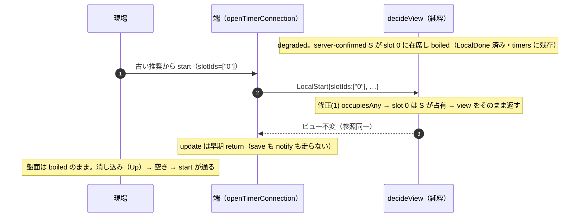
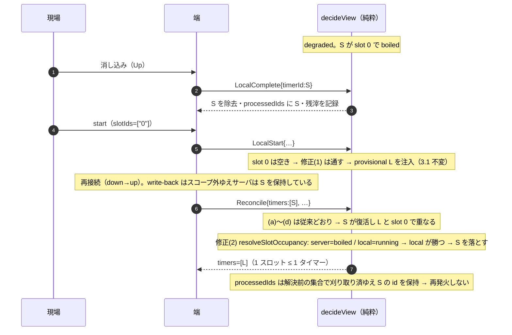

# 技術設計書 — degraded の 1 スロット重ね合わせ（degraded-slot-superimposition）

## この設計が拠って立つもの

- `bugfix.md`（本 spec の要件。Current / Expected / Unchanged Behavior と バグ条件 C(X)）
- `tests/client/degraded-slot-superimposition.exploration.property.test.ts`（**実行済みの探索**。到達可能性と最初の破れ位置を確定させた反例の出所）
- `.kiro/specs/offline-degradation/design.md`（Provisional_Timer・Reconcile・**決定 B**・要件5 の Tick ビュー不変・要件7.2・要件12.5 で write-back をスコープ外と確定）
- `.kiro/specs/snapshot-broadcast/`（`reconcileServerConfirmed` の残滓・刈り取り規律。Property 3〜7）
- steering: `design-philosophy.md`（真善美・計算と作用の分離・導出値を状態に昇格させない）・`naming.md`・`timer-model.md`・`tooling.md`

## Overview

### 目的

破られている不変条件は「**1 スロット ≤ 1 タイマー**」である。degraded の boiled 経路でこれが崩れ、`slotDisplay` が 1 スロットにつき 1 本しか描かない（**走行中（`remainingMs > 0`）を先に絞り、その区分内で最早 `endTime`**）ために片方が隠れ、再接続後に「ローカルのタイマーが復活した」ように見える（`bugfix.md` Current Behavior 1.1〜1.4）。

**1.4 の因果は時間窓に限られる（正確に記す）。** 「隠れていた provisional が表示へ再出現する」が成り立つのは、**その local provisional 自身も boiled になっている**窓の内側だけである。provisional が走行中のあいだは走行中優先ゆえ表示されていたのは provisional の側であり、隠れていたのは server(boiled) である。両者が boiled になると同区分内の最早 `endTime` で server が勝ち、その server がサーバ側で消えたときに provisional が表示へ回る——これが「ローカルのタイマーが復活した」ように見える瞬間である。

本設計は不変条件を**遷移の側**で回復する。表示（`SlotDisplay` の 4 種別）・ワイヤ形式・`ClientView` のフィールド・`ClientEvent` の種別は**一つも増やさない**。変更は `src/client/connection.ts` に閉じる。

修正は 2 層である（生成の側と流入の側）。層の別と「1 層では足りない理由」は「Hypothesized Root Cause」に置く。

## Glossary

- **バグ条件 C(X)（Bug_Condition）**: バグを引き起こす入力を識別する述語。本 spec では `isBugCondition(X)` ＝「ある `slotId` が `origin="server"` の Timer と `origin="local"` の Timer の双方に同時に含まれる `ClientView` 状態」。正本は `bugfix.md`。
- **Property (P)**: C(X) が真である入力に対し、修正後のコードが満たすべき振る舞い。本 spec では「1 スロット ≤ 1 タイマー」が遷移の側で保たれること。
- **Preservation**: C(X) が偽である入力について、修正前（F）と修正後（F'）の振る舞いが一致すること。
- **F / F'**: F は現行（未修正）の client 遷移・表示導出、F' は修正後。
- **重ね合わせ（superimposition）**: 1 スロットに 2 本以上の Timer が同時に在席している状態。`slotDisplay` は 1 本だけを描くため、他方は隠れる。選び方は**走行中を先に絞り、その区分内で最早 `endTime`**（走行中が無いときだけ boiled の最早 `endTime`）。
- **Provisional_Timer**: degraded 中にローカルで注入される `origin === "local"` の Timer。サーバは未確定。
- **server-confirmed**: サーバが確定させた Timer（`origin === "server"`）。永続層（SSOT）が正本。
- **決定 B**: offline-degradation の決定。Reconcile では server-confirmed 集合を全置換し、Provisional_Timer は保持する。
- **占有（any-overlap）**: あるスロットが Timer の `slotIds` に含まれること。判定は集合の等値ではなく交わりの有無で行う（`src/client/assignment.ts` の射影規律と同じ）。
- **running / boiled**: `endTime` と補正後現在時刻の比較からの**導出値**。`remainingMs(...) > 0` なら running、`endTime <= correctedNow` なら boiled（境界は boiled 側）。状態として保持しない。
- **contested**: 両側が running を主張し、統一規則では決着しないスロットの状態。表示種別としては実装しない（申し送り 1）。
- **write-back**: degraded 中のローカル操作をサーバへ確定させる書き戻し。offline-degradation 要件12.5 でスコープ外。
- **消し込み（Complete）**: 茹で上がった麺を現場が釜から上げ、Timer を完了させる操作。釜が空くのはこの時点である。
- **残滓（`lastResults`）**: スロットごとの直前結果。現場向けの手掛かりで、ベストエフォート（TTL 付き・永続しない）。
- **刈り取り（`processedIds` の限定）**: `processedIds` を保持 id 集合へ限定し、有界に保つ手順。ローカル再発火の抑止はこの記録に依る。
- **修正(1) 占有ゲート**: `decideLocalStart` に置く関門。要求スロットのいずれかが占有済みならビュー不変。
- **修正(2) 統一規則**: `reconcileServerConfirmed` の末尾に置く占有の解決。判断 2 の真理値表がその内容である。
- **`occupiesAny`**: 「この釜のどれかが既に占有されているか」の述語（非公開）。
- **`resolveSlotOccupancy`**: 「釜の排他性による占有の解決」（非公開）。修正(2) の実体。

## Bug Details

### バグ条件

バグが顕れるのは、degraded 中に boiled な server-confirmed が在席したまま、同一スロットへ Provisional_Timer が注入されたとき、および write-back 不在ゆえに Reconcile が古い server-confirmed を復活させたときである。状態は `ClientView.timers` 上で判定できる。

**Formal Specification**（正本は `bugfix.md`。ここでは参照のために再掲する）:

```pascal
FUNCTION isBugCondition(X)
  INPUT: X of type ClientView
  OUTPUT: boolean

  // ある slotId が、origin="server" の Timer と origin="local" の Timer の
  // 双方に同時に含まれている（重ね合わせ）
  RETURN EXISTS slotId, s, l WHERE
      s IN X.timers AND s.origin = "server" AND slotId IN s.slotIds
      AND l IN X.timers AND l.origin = "local" AND slotId IN l.slotIds
END FUNCTION
```

### 探索が確定させた事実（推測ではない）

実行済みの探索テストが返した反例により、次が**確定**している。

| 段 | C(X) | 事実 |
| --- | --- | --- |
| snapshot | 偽 | server-confirmed が 1 本在席するだけ |
| `Connectivity(down)` | 偽 | 在席は変わらない |
| `LocalDone` | 偽 | `processedIds` に記録され、**`timers` からは除去されない**（1.1） |
| **`LocalStart`（同一スロット）** | **真** | **ここが最初の破れである** |
| `Reconcile` | 真 | 解消されず維持される（1.3） |

反例: `slotId=0`, server `srv-a` endTime=1000000, local `loc-a` endTime=1001000。`assignedSlotDisplays` は当該スロットに**表示を 1 件だけ**返し、他方を隠す。**勝つのは走行中の local `loc-a`（`endTime` は遅い）であり、`endTime` が早い server `srv-a`（boiled）が隠れる。** 表示規則は「走行中を先に絞り、その区分内で最早 `endTime`」であって「最早 `endTime` が勝つ」ではない（探索テストの観測記録 ④ がこの向きを assert している）。

**最初の破れが `Reconcile` ではなく `LocalStart` にある**という事実が、本設計の形を決めている。`Reconcile` だけを直しても、破れは既に起きている。

## Expected Behavior

### 回復すべき不変条件

「**1 スロット ≤ 1 タイマー**」を**遷移の側**で回復する。生成の側（`LocalStart`）で重ね合わせを作らせず、流入の側（`Reconcile` / snapshot）で流れ込んだ重ね合わせを解決する。表示（`assignedSlotDisplays`）は変えない——在席が 1 本になれば、隠れる相手が存在しない。

### 判断 2: 統一規則 — 争いは「両側が走行を主張したとき」だけ

`reconcileServerConfirmed` は server 集合を全置換したのち、スロット単位の重ね合わせを**ただ 1 つの規則**で解決する。

> **あるスロットが争いになるのは、server 側と local 側の双方が *running* な Timer を主張したときだけである。それ以外はすべて自動的に決着する。**

| server 側 | local 側 | 解決 | 根拠 |
| --- | --- | --- | --- |
| 不在 | running / boiled | local を残す | 既存の決定 B（provisional 保持） |
| running / boiled | 不在 | server を残す | 既存の決定 B（server 全置換） |
| boiled | running | **local が勝つ**（復活した server を落とす） | 走行中は「いま釜を使っている」という強い証拠。boiled は弱い（判断 3） |
| running | boiled | **server が勝つ**（provisional を落とす） | 同じ規則の裏面。SSOT の走行主張が未確定な boiled に勝つ |
| boiled | boiled | **server が勝つ** | 自己治癒する。現場がもう一度消し込めば、今度はサーバへ届く |
| running | running | **両方残す**（残余の contested） | 本 spec のスコープ外。既知の限界を参照 |

規則が 1 つであることが要点である。「復活した server を特別扱いする」「`processedIds` 済みを締め出す」といった**第 2 の判断軸を持ち込まない**。running / boiled は `endTime` からの導出であって状態ではないため、規則の入力は `timers` と補正後現在時刻だけで閉じる。

### 判断 3: 「boiled は占有の証拠として弱い」——これは**仮定**である

規則の 3 行目と 5 行目は、次の名前付き判断に立っている。

> **「boiled は占有の証拠として弱い」**

厳密には偽である。boiled ＝ 茹で上がったが消し込み前 なので、麺は物理的にまだ釜にある。規則が成り立つ根拠は「boiled ＝ 空」ではなく、**反対側の証拠の強さ**である——走行中の Timer は「いま誰かがこの釜で茹でている」ことを示し、boiled は「誰かが上げ忘れている（かもしれない）」ことしか示さない。前者を落とせば走っている麺の秒読みが消え、後者を落としても失われるのは既に鳴り終わった通知の残骸である。

**これは導出ではなく仮定である。** 明示しておかなければ、後の読み手は規則を定理と誤解する。仮定が崩れる場面（例えば「boiled の在席が会計や在庫の根拠になる」等の要求が生まれたとき）には、規則そのものを見直す必要がある。

### Preservation Requirements

#### 触る層と触らない層

| 層 | ファイル | 変更 |
| --- | --- | --- |
| client の純粋遷移 | `src/client/connection.ts` | `decideLocalStart` に占有ゲート・`reconcileServerConfirmed` に統一規則・非公開ヘルパ 2 つ。`clock.ts` の `correctedNow` / `remainingMs` を import する |
| client の表示導出 | `src/client/components/slotDisplay.ts` | **変更しない。** 4 種別（`running` / `boiled` / `idle` / `unreceived`）も、走行中優先・同区分内で最早 `endTime` の導出も不変 |
| client の射影 | `src/client/assignment.ts` | **変更しない。** 占有判定は同じ any-overlap 規律を踏むが、担当射影とは別の関心事（後述） |
| ドメイン契約 | `src/domain/**` | **変更しない**（`bugfix.md` 3.6） |
| サーバ | `src/engine/**` / `src/shell/**` | **変更しない**（3.6）。engine が start 時に釜の占有を検査しない件は本 spec の外（申し送り 2） |
| UI | `src/client/components/**.tsx` | **変更しない**（`SlotCard` / `SlotBoard` / `OrderQueue` はそのまま） |

公開シンボルは 1 つも増減しない。`ClientView` に新フィールドを足さず、`ClientEvent` に種別を足さず、`SlotDisplay` に種別を足さない。ゆえに命名の事前確認を要する対象は無い（`naming.md`）。

#### データモデル

**変更なし。** `ClientView` のフィールド・`ClientTimer`（`TimerFact & { origin }`）・`ClientEvent` の種別・`SlotDisplay` の 4 種別・永続ブロブのスキーマ・ワイヤ形式のいずれも触らない。

`timer-model.md` の規律どおり、新しい関心事は生まれていない——running / boiled は `endTime` からの導出、占有は `slotIds` からの導出である。状態へ昇格させるものが無いので、足すフィールドも無い。

#### Scope

C(X) を生まない入力は、本修正の影響を受けない。

- 空きスロット（server-confirmed も provisional も不在）への `LocalStart`（3.1）
- Provisional_Timer の cancel / complete（3.2）
- 争いを含まない Reconcile（server 全置換・provisional 保持・残滓記録・刈り取り。3.3）
- live（非 degraded）の start / cancel / complete / adjust（3.4）
- 1 スロットに 1 本だけ在席する通常表示の導出（3.5）
- `src/engine` / `src/domain` の挙動（3.6）

## Hypothesized Root Cause

原因は 2 つの層に在る。どちらも単独では症状の全体を説明しない。

### 層 (a) 生成の側 — `decideLocalStart` が釜の占有を検査しない

`decideLocalStart` は要求スロットの在席を見ずに Provisional_Timer を追記する。ゆえに boiled な server-confirmed が残るスロットへ start が届けば、その場で重ね合わせが成立する（探索が確定させた「最初の破れ」）。

**start の入口は 2 つある。** 片方だけを塞げば、不変条件が 2 箇所で定義される。

| 入口 | 実装 | 占有を見るか |
| --- | --- | --- |
| スロットのラジアル | `SlotBoard.startOnSlot` → `SlotCard` は `display.kind === "idle"` のときだけ開始の口を描く | **見る**（idle ＝ 在席なし） |
| 待ち行列の推奨 | `SlotBoard` → `connection.start(suggestion.slotIds, …)` | **見ない**（`queueDisplay.orderQueueEntries` は担当範囲と茹で秒の引き当てだけで絞る） |

degraded 中、`view.recommendations` は down 直前のまま凍結される（サーバだけが確定させる事実で、更新が届かない）。**古い推奨は、いまや boiled で在席が残っているスロットを指し得る。** これが `bugfix.md` 1.2 の到達経路であり、UI ゲートの隙間である。

### 層 (b) 流入の側 — `reconcileServerConfirmed` の全置換 × write-back 不在

`reconcileServerConfirmed` は server 集合を全置換する（決定 B）。write-back はスコープ外ゆえ、degraded 中にローカルで消化した server-confirmed はサーバにまだ在る。再接続の最初の snapshot でそれが**復活**し、保持された Provisional_Timer と同一スロットで重なる。

### なぜ 1 層では足りないか（修正は 2 層である）

| 層 | 場所 | 何をするか | なぜ 1 層では足りないか |
| --- | --- | --- | --- |
| **修正(1) 占有ゲート** | `decideLocalStart` | 要求スロットのいずれかが既存タイマーに占有されていれば、`view` をそのまま返す | 最初の破れを止める。だが **Reconcile による復活**は止められない（server 側は write-back 不在ゆえ古いタイマーを持ち続ける） |
| **修正(2) 統一規則** | `reconcileServerConfirmed` | server 集合の全置換後、スロット単位の重ね合わせを 1 つの規則で解決する | 復活を解決する。だが **LocalStart 時点の重ね合わせ**は次の Reconcile まで残る（Tick はビュー不変・offline-degradation 要件5） |

2 層は別々のバグではなく、同じ不変条件を**生成の側**と**流入の側**の両方で守る一対である。

## Correctness Properties

*プロパティとは、システムの妥当な全実行に渡って真であるべき特性・振る舞いのことである——「システムは何をすべきか」についての形式的な言明であり、人が読む仕様と機械が検証できる正しさの保証との橋渡しになる。*

本 spec の検証対象は純粋関数（`decideView` / `decideLocalStart` / `reconcileServerConfirmed` / `assignedSlotDisplays`）であり、入力空間（スロット集合・起源・running/boiled の境界・多スロットの部分重なり・時刻）が広く、反復コストがほぼゼロである。PBT が適する。

冗長性の検討（Property Reflection）の結果は次のとおり——2.4 と 3.5 は同一の観測点（在席と表示の突き合わせ）ゆえ Property 4 に統合した。2.1 と 2.2 は粒度が違い（単発の拒否 / 遷移列の不可達性）失敗時に指す場所も違うため両方残した。真理値表（Property 3）と「争わない入力では不変」（Property 6）は主張する対象が違う（生存者 / 全フィールド一致）ため両方残した。刈り取りの関心事は独立させた（Property 7）。範囲外 `boilSeconds` の再検証は既存 offline-degradation Property 3 に委ね、ここでは重複させない。

### Property 1: 占有スロットへの LocalStart はビュー不変

*任意の* `ClientView` と *任意の* `LocalStart` イベントについて、要求 `slotIds` のいずれかが `view.timers` のいずれかの Timer の `slotIds` と共通の `slotId` を持つならば（起源・running / boiled を問わず）、`decideView` の結果は入力ビューと**参照同一**である。

**Validates: Requirements 2.1, 2.2**

### Property 2: 空きスロットへの LocalStart は従来どおり単一の provisional を注入し残滓を解除する

*任意の* `ClientView` と *任意の* `LocalStart` イベントについて、要求 `slotIds` が `view.timers` のどの Timer とも `slotId` を共有せず、かつ `boilSeconds` が 1〜1800 の整数ならば、結果ビューは `origin === "local"` の Timer をちょうど 1 件多く含み、その `id` は `newTimerId`・`endTime` は厳密に `correctedNow + boilSeconds * 1000` に等しく、要求 `slotIds` の `lastResults` は消える。

**Validates: Requirements 3.1**

### Property 3: 統一規則の真理値表

**表が決めるのは敗者集合である。** 判断 2 の表はスロットごとの勝敗を与え、そこから**いずれかのスロットで負けた Timer の集合（敗者集合）**が定まる。結果の**生存者は「敗者でない全 Timer」**であって、スロットごとの勝者の寄せ集めではない（判断 4: 多スロット Timer は 1 つの釜で負けたら丸ごと落ちる）。

*任意の* server 集合と provisional 集合について、`reconcileServerConfirmed` の結果は次を満たす。

- 各 `slotId` の勝敗は表のとおりに定まる——server 側のみ在席なら server が勝ち、local 側のみ在席なら local が勝ち、双方在席のとき: server が boiled かつ local が running なら local が勝ち、server が running かつ local が boiled なら server が勝ち、双方 boiled なら server が勝ち、双方 running なら双方が勝つ（敗者なし）。
- 結果の `timers` は、いずれかのスロットで負けた Timer を**すべて**除き、それ以外を**すべて**残したものに等しい。
- **在席者がすべて単一スロットの Timer である `slotId`** については、結果の生存者が表の勝者と一致する。
- 多スロット Timer が絡む `slotId` では、別スロットでの敗北により勝者が生存者に居ないことがある（判断 5 の連鎖。例: slot 1 で S が L に勝ち、slot 2 で同じ S が L2 に負ければ S も落ち、slot 1 は空になる）。そのときスロットは空になるが、不変条件（≤ 1）は保たれる。

running / boiled は `endTime` と `correctedNow(view.offset, at)` の比較のみから導かれ、境界（`endTime === correctedNow`）は boiled 側に属する。

**Validates: Requirements 2.3**

### Property 4: 解決後は隠れが存在しない（在席と表示が一致する）

**前提（書かれた premise であり暗黙にしない）**: 入力は **server 起源同士のスロット重なりを含まない**。規則が解くのは server 側 × local 側の争いだけであり、server 起源 2 本の同一スロット在席は規則の外にあって解決後も残る（限界 4。engine は start 時に釜の占有を検査しないため、snapshot はこの形を運べる——`tests/client/complete.example.test.ts` の `timerAt("A","0")` / `timerAt("B","0")` が実例である）。生成器は既存 `genTimerFacts` と同じく**各集合内のスロットを互いに素**に保ち、重なりを集合間だけに誘発することでこの前提を満たす。

*任意の* `ClientView` と *任意の* 担当ユニット集合について、上の前提を満たす入力ならば、`reconcileServerConfirmed` の結果ビューにおいて、**双方 running の争いを含まない**各 `slotId` の在席 Timer は高々 1 件であり、`assignedSlotDisplays` が当該スロットに返す表示は（在席が 1 件なら）その Timer を指し、（在席が 0 件なら）`idle` または `unreceived` になる。すなわち在席しているのに表示されない Timer が存在しない。

除外は 2 つである（**双方 running** と **server 起源同士の重なり**）。いずれも既知の限界（限界 1 / 限界 4）であり、暗黙にすれば限界が検査から消えて読めなくなる。

**Validates: Requirements 2.4, 3.5**

### Property 5: 記録された degraded 遷移列で C(X) は到達不能

*任意の* 再演パラメータ（`slotId`・時刻・茹で秒・麺種・id・発火遅れ・start 遅れ）について、経路 A（`snapshot` → `Connectivity(down)` → `LocalDone` → `LocalStart`）と経路 B（同前 → `LocalComplete` → `LocalStart` → `Connectivity(up)` → `Reconcile`）の**全段**のビューに対し `isBugCondition(X)` が偽である。

**Validates: Requirements 2.2, 2.4**

### Property 6: 争いが無い入力では reconcile の結果が従来と一致する

*任意の* server 集合と provisional 集合について、両者のスロットが互いに素（どの `slotId` も共有しない）ならば、`reconcileServerConfirmed` の結果は解決を適用しない場合と `timers`（順序を含む）・`lastResults`・`processedIds` のすべてで一致する。

**Validates: Requirements 3.3**

### Property 7: 落とした Timer の id は処理済み記録に残る

*任意の* server 集合と provisional 集合について、解決で落とされた server 起源 Timer の `id` が入力の `processedIds` に含まれていたならば、結果の `processedIds` にも含まれる。すなわち刈り取りは解決前の保持 id 集合で行われ、復活した Timer のローカル再発火抑止が維持される。

**Validates: Requirements 2.3, 3.3**

## Fix Implementation

### 判断 1: 占有ゲートは UI ではなく遷移に置く

start の入口が 2 つあり、待ち行列の推奨が占有を見ないことは根本原因の層 (a) に示した。第 2 の UI ゲートを足せば、「釜が空いているか」の判断が `SlotCard` と `OrderQueue` の 2 箇所に散る。**釜の排他性は表示の関心事ではなく遷移の関心事**ゆえ、ゲートは `decideLocalStart` に 1 つだけ置く。既存の「範囲外の `boilSeconds` はビュー不変」と同じ形（不正な遷移を、修復ではなく**拒否**で扱う）に揃える。

> **拒否が修復より真である理由。** 釜の排他性は接続性に依らない物理的事実である。茹で上がった麺は、消し込むまで釜に**入っている**。「暗黙に complete して入れ替える」（`bugfix.md` Candidate (A)）は、SSOT がまだ保持している事実についてローカルで「完了した」と主張することであり、状態について嘘をつく。

### 判断 4: 多スロット Timer は、1 つの釜で負けたら丸ごと落ちる

1 Timer は複数スロットを駆動しうる（`slotIds: NonEmptyArray`）。重なりの判定は **any-overlap**（`src/client/assignment.ts` の射影規律と同じ。集合の等値ではない）ゆえ、多スロット Timer は**重なるすべてのスロットで争う**。

負けたスロットが 1 つでもあれば、その Timer を丸ごと落とす。これは仮定ではなく導出である——負けたスロットに残せば、そのスロットは依然 2 本に占有され、不変条件が回復しない。加えて多スロットの茹では全ての釜を要するため、一つを失った Timer は走れない。

### 判断 5: 落とす集合は解決前の集合から一度に決める（合流性）

落とす判定は、**置換直後の集合を入力として一度に**計算し、そのあと 1 回だけ絞る。逐次に落としながら再評価しない。

理由は合流性である。「A を落としたので B の相手が消え、B は勝つ」といった順序依存を作らない（`design-philosophy.md`「順序が結果を変えない」）。連鎖の結果として両方が落ち、当該スロットが空になる組み合わせは在り得る（例: slot 1 で S(boiled) が L(boiled) に勝ち、slot 2 で同じ S が L2(running) に負ける）。そのときスロットは空になるが、不変条件（≤ 1）は保たれる。決定は元集合からの純粋な関数なので、評価順に依らず同じ結果になる。

### 判断 6: 刈り取りと残滓は**解決前**の集合で行う

`reconcileServerConfirmed` の既存 4 手順（(a) 全置換 / (b) 差分残滓 / (c) 占有スロットの残滓消去 / (d) `processedIds` の刈り取り）は**そのままの順序と入力で保つ**。解決は最後に 1 回だけ乗る。

これは偶然ではなく必要である。

- **`processedIds` の刈り取りを解決前の保持 id 集合で行う理由。** 落とした server Timer の id が `processedIds` から抜けると、その Timer が次の snapshot で（local 側が消えた後に決定 B で）在席を取り戻したとき、`endTime` が過去ゆえ `dueLocalTimers` が拾い、**鳴り終わった通知がもう一度鳴る**。解決前の集合で刈り取れば、id は server 集合に属する限り残り、抑止が維持される（`bugfix.md` 3.3・offline-degradation 要件11.7）。
- **解決による除去は残滓（`lastResults`）を生まさない理由。** 残滓は「調理が終わった」という現場向けの手掛かりである。解決は調理の終了ではなく**矛盾の解消**であり、そこに麺種を刻めば起きていない事実を主張することになる。勝者が当該スロットを占有するため、(c) の消去で残滓は既に無く、表示上の差も出ない。
- **代償（正直な記録）。** 判断 5 の連鎖でスロットが空になる場合、そのスロットの残滓は (c) で消えたまま、新たな残滓も書かれない。直前結果がベストエフォート（TTL 付き・永続しない）であることを踏まえ、受け入れる。

### 判断 9: `processedIds` の冪等性は厳密でない（判断 6 の代償・**ユーザー承認済み**）

番号は追加順だが、位置は判断 6 の直後に置く——これは判断 6 の直接の代償である。

判断 6（刈り取りは**解決前**の集合で行う）を保つと、`reconcileServerConfirmed` の**厳密な冪等性は `processedIds` について破れる**。これは予測ではなく反例で確定している。

> view: provisional `l-a`（slot `"0"`・boiled）が在席し、`processedIds` に `"l-a"` を含む。`serverTimers`: `s-a`（slot `"0"`・running）。
> **1 回目** — 刈り取りの入力は解決前の集合ゆえ `retainedIds = {s-a, l-a}` となり `"l-a"` は残る。そのあと解決が走り、server running × local boiled で `l-a` が落ちる。結果は `timers=[s-a]` / `processedIds={"l-a"}`。
> **2 回目**（同じ `serverTimers`・同じ `at`）— provisional はもう居ないので `retainedIds = {s-a}`。`"l-a"` は刈り取られ `processedIds={}` となり、1 回目と一致しない。

**構造的なトレードオフ**（実装時に持ち越さず、ここで決める）。

| 選択 | 得るもの | 失うもの |
| --- | --- | --- |
| 判断 6 を保つ（解決**前**に刈り取る） | **snapshot-broadcast Property 5**（純粋差分）——記録が `endTime` に依存せず、クロックドリフトで揺れない | `processedIds` の厳密な冪等性 |
| 解決**後**の生存 provisional で刈り取る | `processedIds` の厳密な冪等性 | **snapshot-broadcast Property 5**——`processedIds` が `endTime`（running / boiled の導出）に依存し始める |

（本 spec の Property 5 とは別物である。以下この判断内の「Property 5」「Property 6」はすべて `snapshot-broadcast` のものを指す。）

**判断: 判断 6 を保ち、冪等性の言明を弱める。**

決定的な理由は、**どちらの選択でも `retainedIds ⊇ newIds` が成り立つ**ことである。すなわち **server 起源の id は決して失われない**。判断 6 の実際の目的（復活時の再発火抑止）は、どちらでも保たれる。失われるのは**解決で落ちた provisional の id だけ**である。その Timer はもう存在せず、ローカル id は `serverTimers` に現れないため戻ってくる経路が無い。忘れて害が無い。対して Property 5（記録がクロックドリフトで揺れない）は失えば代替の無い不変条件であり、こちらの方が価値が高い。判断 6 は保つ。

**新しい言明（これが正本）**:

> `timers` と `lastResults` は厳密に冪等。`processedIds` は解決で落ちた provisional の id を 2 回目で失うが、単調減少で 2 回目以降は不動点。server 起源の id は失われない（刈り取りの入力が解決前の `serverTimers` ゆえ）。

**別 spec の改訂を要する。** この言明は `snapshot-broadcast` の **Property 6「冪等性」（要件 4.5）** と、その property test（`tests/client/reconcile.property.test.ts` の Property 6）を狭義に破る。あちらは `processedIds` の**不変**を主張しているため、`server 起源の id は失われない` ＋ `2 回目以降は不動点` へ言明を改める必要がある。**要件 4.5 の本文をどう扱うかは当該 spec の判断であり、本 spec では改訂が必要である事実の記録と、そのためのタスク（tasks フェーズ D）を置くだけにとどめる。**

**申し送りは解消済み**: `snapshot-broadcast` の Property 6・タスク 5.6・テストに続き、**要件 4.5 の本文も当該 spec 側で改訂された**（`timers` と Residual は厳密に同一、`processedIds` は新 `serverTimers` の id をすべて保持し二度目以降を不動点とする）。理由は同 spec requirements.md 要件 4 の「冪等性ノート」に記録され、出所として判断 6 / 判断 9 を指している。

### 判断 10: 要件 2.3 を読み替える（**部分充足であることを明記する・ユーザー承認済み**）

番号は追加順だが、内容は判断 2 の直接の帰結である。統一規則は `processedIds` を判断軸に採らない（判断 2「第 2 の判断軸を持ち込まない」・却下 B）。ゆえに `bugfix.md` Expected 2.3 の**字面**——「ローカルで既に消化済み（`processedId` 済み）の server-confirmed タイマーが表示上で『復活』して見えない扱いを与える」——は、本設計では満たされない。

**読み替え（これが本設計の主張である）**:

> 要件 2.3 は「表示上いっさい復活を見せない」ではなく、**「重ね合わせ経由の隠れ・不意の再出現を起こさず、ローカル再発火もしない」**として満たす。

**字面どおりに満たすには `processedIds` を判断軸に入れることになる。** それは却下 B（`clearedIds`）と実質的に等しい——SSOT がまだ主張している事実を、クライアント側の記録で抑圧することになる。採らない。

**代償（正直に記す）。** 消化済みの boiled が一度だけ表示へ戻る経路が 2 つ残る。

- 消し込み後にスロットが空のまま再接続すると、復活した server タイマーは真理値表の「server のみ在席」行で残り、boiled としてそのまま**表示される**。
- 真理値表の「双方 boiled → server が勝つ」行でも、消化済みの復活タイマーが表示される（自己治癒経路）。

いずれも現場はもう一度消し込むだけで済む。今度は live なのでサーバへ届き、恒久的に消える（**自己治癒・1 タップ**）。`processedIds` が id を保持し続けるため、再び鳴ることはない（Property 7）。**この読み替えと代償はユーザー承認済みである。** 記録された代償は限界 5 を参照。

Property 3 も Property 7 も「表示上いっさい復活を見せない」は主張していない。それぞれ真理値表どおりの解決（Property 3）と刈り取り順序による再発火抑止の維持（Property 7）を主張する。要件トレーサビリティの 2.3 の行は、この読み替えに合わせて**部分充足**として記す。

### 判断 7: 導出は既存ヘルパを再利用する（同じ概念を二度書かない）

running / boiled の切り分けは `src/client/clock.ts` の `correctedNow` / `remainingMs` を通す。`endTime > correctedNow(offset, at)` を素で書き下さない。判定の意味は既に 2 箇所で定義済みであり（`slotDisplay` の `remainingMs(...) > 0`・`boiledGroup` の `endTime <= correctedNow`）、3 つ目の書き下しを作らない。

`reconcileServerConfirmed` は既に `at` を受け取っている（残滓の記録時刻）。補正後時刻は `correctedNow(view.offset, at)` で導く。**シグネチャは変えない。**

> **snapshot 経路の含意（正直な記録）。** `decideServerMessage` は新しい `offset` を算出した**あと**に `reconcileServerConfirmed(view, …)` を呼ぶため、解決に使われる `offset` は**更新前の値**である。差は 1 往復ぶんのクロックドリフト（通常ミリ秒）で、その幅の内側に `endTime` が居るときだけ running / boiled の判定が揺れる。揺れても次の契機で解決し直される。`offset` を先に更新するには呼び出し順か引数を変えることになり、`reconcileServerConfirmed` が「置換と残滓の規律」だけを担う形が崩れる。**変えない。**
>
> **Reconcile 経路の揺れ幅は 1 往復では抑えられない（同じく正直な記録）。** `Reconcile` イベントは `serverTime` を運ばないため `offset` を更新しない（degraded 中の凍結を維持・offline-degradation 要件5.2）。ゆえに解決が使う `offset` は**断線前に凍結された値**である。本バグの主要シナリオはサーバ再起動を含むため、**断線が長いほど running / boiled の揺れ幅は広がり、「1 往復ぶん」を超えうる**（幅は、断線期間中にローカル時計とサーバ時計の間で蓄積したドリフトそのものである）。**挙動は変えない。** 結論も変わらない——揺れても次の契機で解決し直される。`Reconcile` 以後の snapshot 受信は通常の Server 経路を通って `offset` を最新化するため、次の解決契機ではドリフトの詰まった値が使われる。

### 判断 8: 内部ヘルパの命名と置き場

新設は 2 つ、いずれも `src/client/connection.ts` の**非公開**関数である。公開シンボルを増やさないため、命名の事前確認は要らない（`naming.md`）。

| 名 | 概念境界 |
| --- | --- |
| `occupiesAny(timers, slotIds)` | 「この釜のどれかが既に占有されているか」。any-overlap の述語 1 箇所 |
| `resolveSlotOccupancy(timers, correctedNowMs)` | 「釜の排他性による占有の解決」。判断 2 の規則そのもの |

禁止汎用語（`Manager` / `Handler` / `Service` / `Util` / `Helper` / `Data` / `Info` / `process` / `handle` / `manage`）は用いない。`resolveSlotOccupancy` は「解決」を名に据え、申し送り 1 の `SlotResolved` と語彙が繋がる。将来これを公開する（別モジュールへ出す）なら、その時点で命名確認を要する。

**別モジュールに出さない理由。** `boiledGroup.ts` のように切り出せば公開シンボルが 1 つ増える。真理値表の検証は既に公開されている `reconcileServerConfirmed` を通して行えるため、増やす理由がない。

**`slotDisplay` のスロット別束ね（`timersBySlot`）と統合しない理由。** 形は似ているが概念が違う——あちらは**担当射影を掛けた表示のための束ね**（キーはスロット番号）、こちらは**全量に対する占有の解決**（キーは `slotId` 文字列）である。統合すれば表示の関心事（担当範囲）が遷移へ流れ込む。

### インターフェイスと呼び出し点

```ts
// src/client/connection.ts（いずれも非公開・シグネチャの変更は無し）

/** 要求スロットのいずれかが既存 Timer に占有されているか（any-overlap・起源も running/boiled も問わない）。 */
function occupiesAny(timers: readonly ClientTimer[], slotIds: readonly string[]): boolean;

/**
 * 釜の排他性による占有の解決（判断 2 の規則）。
 * 落とす集合を入力集合から一度に決め、1 回だけ絞る（合流性・判断 5）。
 * 両側が running のスロットは両方残す（残余の contested・既知の限界）。
 */
function resolveSlotOccupancy(
  timers: readonly ClientTimer[],
  correctedNowMs: number,
): readonly ClientTimer[];
```

呼び出し点は 2 つだけである。

- `decideLocalStart` の先頭（`boilSeconds` の範囲検査と同じ位置づけの関門）で `occupiesAny(view.timers, event.slotIds)` が真なら `view` を返す。
- `reconcileServerConfirmed` の `return` 直前で `resolveSlotOccupancy([...confirmed, ...provisional], correctedNow(view.offset, at))` を `timers` に据える。

公開関数（`decideView` / `reconcileServerConfirmed` / `dueLocalTimers` / `assignedSlotDisplays`）のシグネチャは不変。

### データフロー — 経路 A（LocalStart で生まれる重ね合わせ）



### データフロー — 経路 B（消し込み後に Reconcile が復活させる）



**経路 B は修正(1) では止まらない。** ゲートは占有スロットだけを拒むので、正しく消し込んでから start した現場は何も間違えていない。復活は流入の側から来る。ゆえに修正(2) が要る——これは主張ではなく、探索テストに経路 B を足して**反例で示す**（tasks 1.1）。

### 拒否と争いの見せ方（Error Handling）

新しい失敗経路は生まれない。判断すべきは「拒否をどう見せるか」だけである。

| 状況 | 扱い | 理由 |
| --- | --- | --- |
| 占有スロットへの `LocalStart` | ビュー不変（参照同一）。`error` を立てない | 既存の「範囲外 `boilSeconds` はビュー不変」と同一の形。`view.error` はサーバ由来の拒否を運ぶ場所であり、ローカルの遷移拒否を混ぜれば「サーバが何か言った」という嘘になる |
| 両側 running の争い | 両方残す。`error` を立てない | 解決不能を表示で語る手段（`contested` 種別）は本 spec のスコープ外（申し送り 1） |
| 解決で落とした Timer | 静かに落とす。残滓も記録しない | 判断 6 のとおり、除去は調理の終了ではない |

**参照同一で返すことが `update` の早期 return を通す。** `openTimerConnection.update` は `next === view` なら `persistence.save` も `notify` も呼ばない。拒否が永続化と再描画を起こさない性質は、この 1 行に依存している（Property 1 が `toBe` で主張する理由）。

## Testing Strategy

### 二層アプローチ

- **property test** — 上記 Property 1〜7。入力で振る舞いが変わる領域（スロットの重なり・起源・running/boiled の境界・多スロット）を覆う。
- **example test** — 入力で振る舞いが変わらない配線（live 経路がゲートを通らないこと・provisional の cancel / complete が不変であること）。
- **静的検査（smoke）** — `src/engine` / `src/domain` が不変であること（3.6）。

### PBT の規律（`tooling.md` / `tests/client/README.md`）

- ライブラリは **fast-check**（新規依存を足さない）。PBT を自前実装しない。
- 1 プロパティ = 1 テスト。反復は最低 100 回（`numRuns: 100` 以上）。
- タグは既存規約に従う。

```ts
// Feature: degraded-slot-superimposition, Property N: {プロパティ本文}
// **Validates: Requirements x.y**
```

- 純粋層のテストで `Date.now` のスタブ・`vi.useFakeTimers()` を用いない。時刻・生成 id・受信時刻はすべて生成器から引数として渡す。
- 置き場は `tests/client/`（`workers` プロジェクト）。静的検査は `static` プロジェクトへ登録し、`workers` の `exclude` にも足す。

### Exploratory Bug Condition Checking（実施済み）

`tests/client/degraded-slot-superimposition.exploration.property.test.ts` は既に書かれ、既に実行され、反例を返している。その成果が「Bug Details — 探索が確定させた事実」の表であり、**最初の破れが `LocalStart` にある**という確定事実である。残るのは経路 B の再演を足すこと（tasks 1.1）で、これも修正前に赤で入る。

### Fix Checking

修正後、C(X) が真になり得た遷移列で C(X) が偽になることを検査する。

```
FOR ALL X WHERE isBugCondition(X)（旧 F では到達可能だった遷移列） DO
  ASSERT NOT isBugCondition(F'(X))
END FOR
```

主張の実体は Property 1（単発の拒否）と Property 5（遷移列の不可達性）である。粒度が違うため両方を保つ。

### Preservation Checking

争いを含まない入力で、F と F' が一致することを検査する。

```
FOR ALL (server, provisional) WHERE slots(server) ∩ slots(provisional) = ∅ DO
  ASSERT reconcileServerConfirmed_F(server, provisional)
       = reconcileServerConfirmed_F'(server, provisional)
END FOR
```

主張の実体は Property 6（`timers` の順序を含む全フィールド一致）と Property 2（空きスロットへの start）である。刈り取りの順序は Property 7 が別に固定する。PBT を用いるのは、保存が「争わない全入力について」という全称の性質であり、手書きの example では覆いきれないからである。

### 探索テストの扱い — 反転させて回帰テストにする

`tests/client/degraded-slot-superimposition.exploration.property.test.ts` は**いま赤く、赤いことが成功**である（bug condition exploration）。修正後、同じファイルが緑へ転じる。

**ファイルを新しく作らず、同じファイルを転じさせる。** 別に回帰テストを書けば、不変条件の主張が 2 箇所に分かれる。転じたあとは冒頭の docstring を書き換え、「なぜ赤いのが正しいか」から「何を守っているか」へ役割を移す。反例（`slotId=0` / `srv-a` / `loc-a`）は**記録として残す**——消せば、この不変条件が守っている具体的な症状が読めなくなる。

**書き換えは「観測記録の 2 つの `it`」では済まない。** 記録シーケンスの 2 つの `it` も、主張の前に置かれた**前提の assert が反転する**。現行ファイルの 5 つの `it` のうち **4 つが書き換えを要する**。

| `it` | 反転・書き換えの対象 |
| --- | --- |
| ① 記録シーケンス: degraded → ローカル発火 → 同一スロットへ start | **前提が反転する**——`expect(afterLocalStart.timers.map(origin)).toEqual(["server","local"])` は修正後 `["server"]` になる（ゲートが注入を拒む。`toBe(afterLocalDone)` で参照同一を主張してもよい）。他の前提（`afterSnapshot` の在席・`due`・`afterLocalDone` の非除去）はそのまま。最後の `isBugCondition` の主張が赤→緑へ転じる |
| ② 記録シーケンス: 再接続 Reconcile で復活し破れたまま | **前提が反転する**——`provisional は保持される`（local ids `[loc]`）は修正後 `[]` になる。経路 A ではゲートが provisional を作らせないため、そもそも復活と争う相手が居ない。server 側の在席（`[srv]`）は不変。**復活を解決が落とす観測は経路 B（tasks 1.1）へ移す**——provisional 在席の `Reconcile` を合法に組めるのは経路 B だけである |
| ③ Property: 任意パラメータで 1 スロット ≤ 1 タイマー | 主張はそのまま赤→緑。タグを `Bug condition exploration:` から `Property 5:` へ改める |
| ④ 観測記録: `assignedSlotDisplays` は 1 件しか返さず片方を隠す | **全面書き換え**——在席が 2 本→1 本になる。表示は 1 件のままだが、指す先が local(running) から **server(boiled)** へ変わり、`hidden`（隠れた側）の観測は消える。隠れる相手が存在しないことの具体例（Property 4）へ移る |
| ⑤ 観測記録: `Reconcile` 後も `processedIds` は復活した id を保持する | **前提が反転する**——local ids `[loc]` は `[]` になる。`processedIds.has(srv)` と `dueLocalTimers === []` は維持。ただし「**落とした**あとも id が残る」（Property 7 の具体例）を語るには経路 B が要る——経路 A では解決が何も落とさない |

加えて、tasks 1.1 が足す**経路 B の `it` 群も同じ転換を要する**（探索では赤、修正後は緑）。移行作業は「2 つの `it`」より広い。

### 既存テストへの波及 — **非合法になった状態を fixture にしているテストが在る**

本修正は「表現可能な状態」を狭める。`LocalStart` 経由では 1 スロットに 2 本を作れなくなり、`reconcileServerConfirmed` は争いを解決してしまう。**既存テストの一部は、まさにその状態を fixture として組んでいる。**

ソースを読んで特定できたのは次の 2 件である（`pnpm test` は本設計フェーズでは実行していない。全量は修正後の実行で確定させる）。

| テスト | 破れる理由 |
| --- | --- |
| `tests/client/complete.example.test.ts`「live の占有スロットの残滓 — 保持 provisional が占有しても同じ（要件8.7）」 | 同一スロット `"0"` へ `connection.start` を 2 回呼び provisional 2 本を作る。**修正(1) が 2 本目を拒否する**ため `expect(locals).toHaveLength(2)` で落ちる |
| `tests/client/complete.example.test.ts`「live の占有スロットの残滓 — 新 serverTimers が占有すれば記録を見送り既存の残滓も消える（要件8.7）」 | slot `"0"` に running な provisional が居る状態で boiled な server `A` / `B` を snapshot で受ける。**修正(2) が `A` / `B` を落とす**ため `completeSends` が空になる |

**当該 spec（sync-set-batch-complete）の要件 8.7 は書き換えない。** 変えるのは fixture の組み方だけである。合法に同じ主張を組む道は 2 つある。

1. **両側 running の残余を使う** — server 側も local 側も running なら両方残る（真理値表の最終行）。占有の観測はこれで足りる。
2. **再水和（boot）経路で組む** — `persistence.load()` は永続ブロブをそのまま復元し、`LocalStart` を通らない。修正前に書かれたブロブや手で組んだブロブは重ね合わせを運べる（後述の既知の限界と同じ経路）。

いずれも「非合法な値を手で組んだ」のではなく**到達可能な状態**である点が重要である。到達不能な状態を fixture にしたテストは、死んだ振る舞いを守ることになる。

`tests/client/reconcile.property.test.ts`（snapshot-broadcast Property 3〜7）は**集合間のスロット重なりを意図的に生成する**ため、修正(2) の解決経路を毎回踏む。内訳は次のとおりである。以下この節で挙げる Property 番号は、すべて `snapshot-broadcast` のものを指す（本 spec の Property 番号とは別物）。

| snapshot-broadcast の Property | 予測 | 根拠 |
| --- | --- | --- |
| 3（残滓の一様性）・4（残滓のクリア） | **生き残る** | 主張の対象 `lastResults` は解決**前**に確定する。解決は `timers` だけを絞る |
| 5（純粋差分） | **生き残る** | `lastResults` と `processedIds` はいずれも解決前に確定し、`endTime` の摂動に依存しない |
| **6（冪等性）** | **破れる（確定）** | 下記 |
| 7（offset 再確立） | **生き残る** | 主張は `offset` のみで、解決を経ない |

**Property 6 は破れる。これは読解による予測ではなく、反例で確定している**（反例と決定の全文は判断 9）。`processedIds` の刈り取りは解決前の集合を入力とするため、1 回目では落ちる provisional の id が残り、2 回目では provisional が居ないので落ちる。`timers` と `lastResults` は厳密に冪等のまま。

**ユーザー承認済みの決定（判断 9）**: 判断 6 を保ち、冪等性の言明を弱める。

> `timers` と `lastResults` は厳密に冪等。`processedIds` は解決で落ちた provisional の id を 2 回目で失うが、単調減少で 2 回目以降は不動点。server 起源の id は失われない（刈り取りの入力が解決前の `serverTimers` ゆえ）。

**別 spec（`snapshot-broadcast`）の改訂が要る。** 同 spec の **Property 6「冪等性」（要件 4.5）** の言明と、そのテスト（`tests/client/reconcile.property.test.ts` の Property 6）を上の形へ改める必要がある。本 spec では改訂を**要件として記録し、タスク（フェーズ D）を置く**にとどめる——`snapshot-broadcast` の文書とテストの本文をこのフェーズで書き換えはしない。**その後、当該 spec 側で要件 4.5 の本文も改訂され、申し送りは解消した**（判断 9 末尾）。

Property 3 / 4 / 5 / 7 の予測は読解によるものである。**修正後に実行して確認する**（tasks 4.2）。

### Example / 静的検査で押さえる点

- live で占有スロットへ `start` しても WS へ送信される（ゲートが `decideLocalStart` にしか無いこと・3.4）。
- provisional の `cancel` / `complete` が従来どおりローカル除去のみである（3.2・既存 example の緑を維持）。
- `src/engine` / `src/domain` に占有ゲート・解決規則の識別子が現れない（3.6）。

## 既知の限界（実装で埋めようとしない）

### 限界 1: 両側 running の残余は次の契機まで残る

規則が評価されるのは `Reconcile` と snapshot（同一規律を共有する）**だけ**である。`Tick` はビュー不変でなければならない（offline-degradation 要件5）ため、両側 running の争いは次の reconcile かリロードまで残る。

**帰結**: 遅く上がる側の麺は隠れ続け、再接続が起きなければ茹で過ぎに気づけない。

**受け入れる理由**: この経路に入るには、**この端末の断線中に別端末が同じ釜で開始し、かつ再接続の瞬間に両方が走行中**である必要がある。争いの持続時間は、短い方の残り時間で上から抑えられる（どちらかが boiled になれば、次の契機で規則が決着させる）。

### 限界 2: 再水和（boot）直後は解決契機が無い

`persistence.load()` は永続ブロブをそのまま復元する。修正前に書かれたブロブが重ね合わせを含んでいれば、**最初の snapshot が届くまで**その状態が残る（`LocalStart` は通らないのでゲートは効かず、`Tick` は不変ゆえ解決も起きない）。最初の接続で snapshot が届けば `reconcileServerConfirmed` が解決する。オフラインのまま起動した端末では、接続まで残る。

**受け入れる理由**: 起動時に解決を走らせるには「接続していないのに規則を適用する」契機を新設することになる。それは `Tick` 不変の規律に近い場所へ新しい時刻起動を持ち込む判断であり、本 spec の 2 層より広い。境界も曖昧になる（何を以て解決の起点とするか）。

### 限界 3: 占有スロットへの start は「押しても何も起きない」

古い推奨（待ち行列）から占有スロットへ start しようとすると、ビュー不変ゆえ**現場には何も起きないように見える**。正しい手順は「消し込み（Up）→ 空き → start」だが、`OrderQueue` の提案は占有を見ないので提案自体は消えない。

**受け入れる理由**: 表示を変えれば `SlotDisplay` か `QueueSuggestion` の導出に「釜が空いているか」という軸を足すことになり、本 spec の「表示を変えない」境界を越える。**沈黙は静かな破損より良い**——現行は黙って重ね合わせを作り、片方を隠していた。`queueDisplay` 側で占有スロットの提案を抑止するのは自然な次の一歩だが、UI の関心事として別に扱う。

### 限界 4: server 起源同士の重ね合わせは規則の外

規則は「server 側 × local 側」の争いを解く。**server 起源 2 本が同一スロットに在る状態は解かない**。engine は start 時に釜の占有を検査しないため、live でも 1 釜 2 本は成立しうる（申し送り 2）。それは client の表示規律ではなくサーバ側の不変条件の問題である。

### 限界 5: write-back が無い以上、古い server Timer は消えたわけではない

解決で落とした server Timer はサーバにまだ在る。local 側が消えたあと次の snapshot が届けば、決定 B の第 2 行（server のみ在席）により**在席を取り戻す**。ただしこのときの出どころは「隠れていたローカルの影」ではなく **SSOT の主張**であり、（古いが）真である。live で消し込めば今度はサーバへ届いて恒久的に消える（真理値表の「双方 boiled → server が勝つ」が自己治癒と呼ぶのはこの経路である）。`processedIds` が id を保持し続けるため、再び鳴ることはない（Property 7）。

## 却下した代替案（記録）

### 却下 A: `LocalStart` で暗黙に complete する（`bugfix.md` Candidate (A)）

占有している Timer をローカルで除去してから注入する。**SSOT がまだ保持している事実について「完了した」とローカルで主張する**ことになり、状態について嘘をつく。しかも失われるのは通知の残骸ではなく、サーバが在ると言っている在席である。真の欠如。

### 却下 B: `clearedIds`（ローカル消し込み済み id を持ち Reconcile で締め出す）

ローカルで消化した server Timer の id を持ち、Reconcile での復活を締め出す。**ユーザーの命名確認済みだったが、不要になった。**

- SSOT がまだ主張している事実を、クライアント側の記録で恒久的に抑圧する（`processedIds` の「表示制御」とは質が違う——あちらは鳴らすかどうか、こちらは在るかどうか）。
- 永続する状態が 1 つ増える。有界性の管理も要る。
- 「永続層が唯一の正本」に反する。

統一規則は同じ症状を**記録を持たずに**解く。boiled は `endTime` からの導出であり、状態を足さない。

### 却下 C: 書き戻し（write-back）

最も真の根本修正である。degraded 中のローカル操作をサーバへ確定させれば、復活そのものが起こらない。だが**歴史を書き換える**ことになり、次の 4 つが未解決である。

1. 過去日時の start 注入の意味が曖昧（即時発火か、経過した茹で時間の喪失か）。
2. 走行中 Timer の全量置換で `synchronize` の Adjustment を撹乱する。
3. engine は start 時に釜の占有を検査しないため、複数端末からの書き戻しで**サーバが 1 釜 2 本を受理しうる**。
4. `TimerNotFound` を「失敗」ではなく「成功」として再解釈する必要がある。

offline-degradation 要件12.5 で明示的にスコープ外。**先送りする**（放棄ではない）。

### 却下 D: degraded 中は server-confirmed をローカル消し込みさせない

最も真で最も小さい。だが**断線している間ずっと釜を塞ぐ**。現場の速度を奪う（善の欠如）し、offline-degradation 要件7.2（degraded でも server-confirmed をローカル除去し、`processedIds` に記録する）と矛盾する。

### 却下 E: `contested` の `SlotDisplay` 種別と `SlotResolved` イベント

争いを表示で語り、現場に選ばせる。**先送りする（YAGNI）。** 残る到達経路は 1 本（両側 running）だけで、しかも時間で上から抑えられている。設計案は申し送り 1 に残す。

## 要件トレーサビリティ

| 要件 | 対応 | 検証 |
| --- | --- | --- |
| 2.1 | 修正(1) 占有ゲート | Property 1 |
| 2.2 | 修正(1)＋修正(2) | Property 1, 5 |
| 2.3 | **部分充足。** 修正(2) 統一規則・刈り取り順序。判断 10 で「重ね合わせ経由の隠れ・不意の再出現を起こさず、ローカル再発火もしない」へ読み替える（字面の「表示上いっさい復活を見せない」は満たさない・代償は限界 5） | Property 3（真理値表どおりの解決）, Property 7（刈り取り順序による再発火抑止の維持） |
| 2.4 | 修正(2)（隠れが生まれない） | Property 4, 5 |
| 3.1 | ゲートは占有スロットのみを拒む | Property 2 |
| 3.2 | `decideLocalCancel` / `decideLocalComplete` 不変 | example |
| 3.3 | 4 手順の順序と入力を保つ | Property 6, 7・既存 `reconcile.property.test.ts` |
| 3.4 | live 経路はゲートを通らない | example |
| 3.5 | `slotDisplay` 不変 | Property 4 |
| 3.6 | 変更は `src/client` に閉じる | 静的検査 |

## 申し送り（本 spec では作らない）

### 申し送り 1: 両側走行中の contested と、争いを解決する UI

**問題**: 限界 1 の残余。両側 running の争いは規則では決着しない。**両側 running のこの文脈では**現行は最早 endTime が勝ち、他方が隠れる（走行中で区分が同じため、同区分内の最早 `endTime` がそのまま勝敗になる）。

**設計案（スケッチ）**:

- `SlotDisplay` に第 5 の種別 `contested` を足す——`{ kind: "contested", slot, timers: NonEmptyArray<ClientTimer>, … }`。表示は 2 本を並べ、どちらを残すかを現場に選ばせる。
- `ClientEvent` に `SlotResolved`（`{ slotId, keepTimerId }`）を足す。純粋遷移として畳み、負けた側を落とす。負けた側が server 起源なら live で `cancel` / `complete` を送る経路が要る（`origin` による経路分けは既存の形をそのまま使える）。
- 表示規則を「（両側 running では）最早 endTime が勝つ」から「争いは隠さない」へ変える。これは `assignedSlotDisplays` の唯一の分岐に触る判断であり、本 spec の「表示を変えない」境界を越える。

**着手の契機**: 現場から「タイマーが二重に見える／片方が消えた」報告が実際に出たとき。それまでは YAGNI。

### 申し送り 2: engine が start 時に釜の占有を検査しない（別 spec 候補）

**問題**: `src/engine` の start は、要求スロットが既存 Timer に占有されているかを見ない。**live でも 1 釜 2 本が成立しうる**。本 spec の統一規則は server 起源同士の争いを解かない（限界 4）ため、この穴は client 側では閉じられない。

**波及**: 却下 C（write-back）の前提条件でもある。書き戻しを入れるなら、サーバ側の占有検査が先に要る（複数端末が同じ釜へ書き戻せてしまう）。

**別 spec 候補である理由**: `src/engine` / `src/domain` の変更を要し、`bugfix.md` 3.6（engine 不変）と直接ぶつかる。拒否の形（`ClientMessage.start` に対する新しい `error` code か、既存 `InvalidSlotOrNoodle` の拡張か）も engine 側の判断である。

#### 新たに判明した制約: これは「誰も知らなかった穴」ではない

**既知として、競合規則が既に組まれている。** `.kiro/specs/sync-set-batch-complete/requirements.md` の Requirement 8 前文は、engine が「1 スロットを駆動する Timer は同時に 1 本まで」という排他を**課していない**ことを明文で認識している。`validateStart` が非空・茹で時間範囲・容量のみを検査し、既存 Timer との `slotIds` 重複を拒否しないことも同前文が記す。そのうえで同 spec は、同一スロットを複数メンバーが駆動する退化入力に対する競合規則を**要件8.4 として定めている**。

実装も読解のとおりである。`src/engine/start.ts` の `validateStart` は占有を見ない（検査は `boilSeconds` の有限性と範囲、`slotIds` の非空と各要素の非空、`noodleType` の非空のみ。容量検査 `MAX_TIMERS` は `startTimer` 側）。`src/engine/rejection.ts` の `Rejection` は `InvalidBoilSeconds` / `InvalidSlotOrNoodle` / `CapacityExceeded` / `TimerNotFound` の 4 種別である。

**波及（前提が変わる）**: engine に占有検査を足すと、**要件8.4 が守っている退化入力が live 経路では到達不能になる**。到達不能な状態を fixture にしたテストは「死んだ振る舞いを守る」状態になる——本 spec のタスク 4.2 で実際に踏んだ罠と同型である。

**消えうる範囲は限定される。** 要件8.7 は「別の Timer（新しい server-confirmed または**保持された Provisional_Timer**）が占有する」を対象にするため、provisional による占有は engine の検査では消えない。**要件8.7 は生き残る。** 消えうるのは server-confirmed 同士が同一スロットを駆動する入力である。加えて client 側には限界 1（両側 running の残余）と限界 2（再水和ブロブ）が残るため、1 スロット複数在席そのものが到達不能になるわけではない。

**別 spec を立てるなら最初に決めること**: **要件8.4 をどう扱うか**——撤回するのか、engine 検査の外に残る経路のために保つのか。これを先に決めない限り、占有検査の設計は要件8.4 と衝突したまま進む。拒否の形（新しい `Rejection` code か `InvalidSlotOrNoodle` の拡張か）も engine 側の判断として残る。

この判断が済むまで、本 spec は engine を不変に保つ（`bugfix.md` 3.6）。

## 設計フェーズで確定した事項の記録

`bugfix.md` の Current / Expected / Unchanged Behavior 節は**書き換えない**。設計フェーズで確定した判断は本ドキュメントが正本である。`bugfix.md` の「Candidate Fix Directions」に挙がっていた (A) / (B) / (C) との対応だけを記す。

| bugfix.md の候補 | 本設計での扱い |
| --- | --- |
| (A) `LocalStart` 時に占有タイマーを暗黙 complete して注入 | **却下 A**。代わりに修正(1) が拒否する |
| (B) boiled が残るスロットでは complete を経ないと start させない UI ゲート | **遷移のゲートとして採る**（判断 1）。UI ではなく `decideLocalStart` に置く |
| (C) 復活した server Timer の表示上の扱いを明確化 | **修正(2) の統一規則として採る**（判断 2） |
