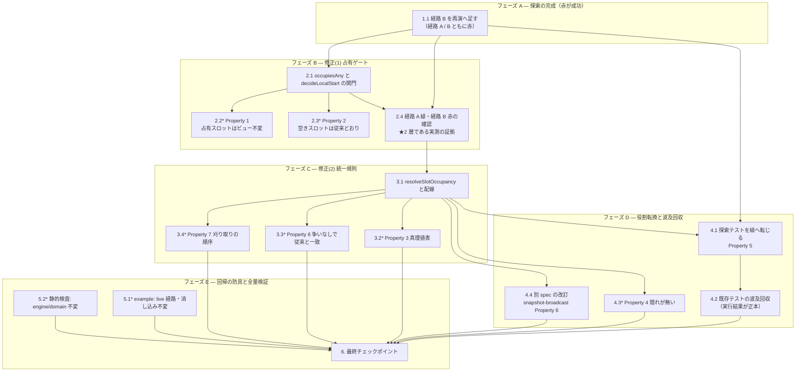

# Implementation Plan: degraded の 1 スロット重ね合わせ（degraded-slot-superimposition）

## Overview

設計（`design.md`）の骨格「client の純粋遷移に 2 層のゲートと規則を足すだけ」にそのまま対応した実装計画である。実装言語は **TypeScript（strict）**、ツールは `tooling.md` に従い **pnpm / Vitest v4（`cloudflareTest` プラグイン）/ fast-check v4 / oxlint / `tsc --noEmit`** を用いる。

**命名確認ゲートは無い。** 公開シンボルを 1 つも増減しないため（`ClientView` のフィールド・`ClientEvent` の種別・`SlotDisplay` の種別・公開関数のシグネチャはすべて不変）、`naming.md` の事前確認の対象が存在しない。新設する 2 つのヘルパ（`occupiesAny` / `resolveSlotOccupancy`）はいずれも `src/client/connection.ts` の**非公開**関数である。実装中に公開シンボルが必要になったら、その時点でユーザー確認する。

### 順序を決めている 3 つの制約

**制約 1 — タスク 1 は赤で入る（それが成功である）。** `tests/client/degraded-slot-superimposition.exploration.property.test.ts` は既に書かれており、**いま失敗する**。bug condition exploration の目的は修正ではなく到達可能性の証明であり、不変条件の主張が現行コードで破れることが成果物である。ここで経路 B を足しておかないと、**修正(2) の必要性が反例ではなく主張に落ちる**。

**制約 2 — 修正(1) だけでは経路 B が閉じない。** ゲートは占有スロットへの start を拒むだけで、`Reconcile` による復活は止められない。ゆえに修正(1) の直後に探索テストを回すと、経路 A は緑・経路 B は赤になる。**この中間状態を通ることが、2 層である理由の証拠になる。**

**制約 3 — 既存テストの波及回収は、修正(2) の後にしかできない。** 何が落ちるかは実行して初めて確定する。読解で 2 件を特定してあるが（`design.md`「既存テストへの波及」）、全量は修正後の `pnpm test` が決める。**先に書き換えない。**

### 段階の切り方

| フェーズ | 内容 | 完了時点の状態 |
| --- | --- | --- |
| A | 探索の完成（経路 A / B） | **両経路が赤。** 修正が 2 層要ることが反例で見える |
| B | 修正(1) 占有ゲート | 経路 A の **C(X) 主張が緑**・経路 B は赤のまま。生成の側が閉じた |
| C | 修正(2) 統一規則 | **両経路の C(X) 主張が緑。** 流入の側も閉じた |
| D | 探索テストの役割転換・波及回収・**別 spec（`snapshot-broadcast` Property 6）の改訂** | スイート全体が緑。不変条件が防具になった |
| E | 回帰の防具と全量検証 | 3.1〜3.6 が固定された |

### 完了条件（中間フェーズの赤の扱い）

`pnpm typecheck` と `pnpm lint`（error 0）は**全タスクで常に通す**。例外はない。`wrangler.jsonc` は触らないため `pnpm cf-typegen` は不要。

`pnpm test` の完了条件は段階で変わる。**フェーズ D 完了までは、探索テストと特定済みの波及分の赤だけを許容する。それ以外の赤は許容しない。**

| 段 | 許容される赤（これだけ） |
| --- | --- |
| フェーズ A（1 / 1.1） | 探索テストの経路 A・経路 B（赤が成功） |
| フェーズ B（2.1〜2.4） | 探索テスト（経路 B の C(X) 主張＋経路 A の前提 assert 反転）＋`complete.example.test.ts`「保持 provisional が占有しても同じ（要件8.7）」（**2.1 で赤化**——同一スロットへの 2 度目の `start` が拒否される・4.2 で回収） |
| フェーズ C（3.1〜3.4） | 上記に加え、`complete.example.test.ts`「新 serverTimers が占有すれば記録を見送り…（要件8.7）」（**3.1 で赤化**——解決が `A` / `B` を落とす・4.2 で回収）＋`reconcile.property.test.ts` の **snapshot-broadcast Property 6「冪等性」**（3.1 で赤化・4.4 で回収）。探索テストは 4.1 まで転換しないため引き続き赤 |
| フェーズ D（4.1〜4.4） | 4.1 で探索テストが緑。残るのは 4.2 / 4.4 で回収する波及分のみ |
| フェーズ E（5 / 6） | 無し（`failed 0`） |

規律は 3 つである。

- **予期しない赤は常にブロッキングである。** 表に無い赤が出たら、それは波及ではなく回帰として扱い、先へ進まない。
- **許容する赤の集合は、各タスクの完了時にファイル名とテスト名で列挙して記録する。** 「たぶん波及」で通さない。列挙できない赤は予期しない赤である。
- **赤は表に列挙された集合の内側にとどまる。** フェーズ B / C では修正が波及を生むため赤は増えうるが、増える先は表の中だけである。フェーズ D で単調に減り、フェーズ E で 0 になる。

**「探索テストの赤」には 2 種類ある。** ① 不変条件（C(X)）の主張が破れる赤——これが探索の成果である。② その主張の前に置かれた**前提の assert が反転する**赤——修正が効いたことの裏返しであり、4.1 の書き換えで解消する（詳細は 4.1 と `design.md`「探索テストの扱い」）。段ごとに読むべきは**ファイルの色ではなく `it` ごとの色と失敗理由**である。②は 4.1 まで許容し、4.1 完了時に消える。

## Tasks

- [x] 1. バグ条件の探索を完成させる（**この段では赤が成功である**）
  - `tests/client/degraded-slot-superimposition.exploration.property.test.ts` は**既に書かれており、既に実行済み**である。記録された反例は `slotId=0` / server `srv-a` endTime=1000000 / local `loc-a` endTime=1001000、最初の破れは **`Reconcile` ではなく `LocalStart`**。
  - **このファイルを消さない・置き換えない。** 到達可能性の証明は本 spec の一次資料である。以後のタスクは同じファイルを緑へ転じさせる（タスク 4.1）。
  - _Requirements: バグ条件 C(X), 1.1, 1.2, 1.3_

  - [x] 1.1 経路 B（`LocalComplete` → 空きスロットへ start → `Reconcile` で復活）を再演へ足す
    - 既存の `reachSuperimposition`（経路 A）の隣に、経路 B の再演を足す。段は `snapshot` → `Connectivity(down)` → `LocalDone` → **`LocalComplete`（現場が正しく消し込む）** → `LocalStart`（**空きスロット**ゆえゲートを通る）→ `Connectivity(up)` → `Reconcile`（write-back 不在ゆえサーバは同じ `serverFact` を保持している）。
    - **経路 B は修正(1) では閉じない**ことを、この段で反例つきで示す。`LocalComplete` 後の段で `isBugCondition` が偽であること（消し込みは正しく効く）と、`Reconcile` 後に真になること（復活が重ね合わせを作る）を別々の `it` に分ける——前者が失敗すると後者が走らず、「復活で破れた」という別の事実を記録できない（既存ファイルの分割方針と同じ）。
    - `LocalComplete` は `processedIds` に記録するため、復活した server Timer はローカル再発火しない。その観測も残す（修正後もこの性質は保たれる・Property 7）。
    - 生成器は既存の `genDegradedRun` を再利用し、経路 B 用の追加パラメータ（消し込みから start までの遅れ）だけを足す。**新しい生成器ファイルを作らない。**
    - **このサブタスクは任意にしない。** 飛ばすと修正(2) の必要性が「設計がそう言っている」だけになり、反例で支えられなくなる。
    - _Requirements: バグ条件 C(X), 1.1, 1.3, 1.4_

- [x] 2. 修正(1) 占有ゲート — 生成の側を閉じる
  - [x] 2.1 `occupiesAny` を置き、`decideLocalStart` の関門にする
    - `src/client/connection.ts` に非公開述語 `occupiesAny(timers, slotIds): boolean` を置く。判定は **any-overlap**（`slotIds` のいずれかが既存 Timer の `slotIds` に含まれる）。**起源も running / boiled も問わない**——釜の排他性は接続性にも起源にも依らない物理的事実である。
    - `decideLocalStart` の先頭で、`boilSeconds` の範囲検査と**同じ形**（不正な遷移はビュー不変）で関門に置く。`view` を**そのまま返す**（スプレッドで作り直さない）——参照同一が `openTimerConnection.update` の早期 return を通し、`persistence.save` と `notify` を走らせない性質に依存している。
    - コメントには「なぜ」だけを書く。占有しているスロットへの注入を**拒否する**理由（暗黙 complete は SSOT がまだ保持する事実について嘘をつく）を 1 箇所に記す。
    - UI は触らない。ゲートを `SlotCard` / `OrderQueue` へ足さない（判断 1）。
    - **この段で `complete.example.test.ts`「保持 provisional が占有しても同じ（要件8.7）」が赤化する**（同一スロット `"0"` への 2 度目の `start` が拒否され `expect(locals).toHaveLength(2)` が落ちる）。予期された波及であり、回収は 4.2 で行う。
    - _Requirements: 2.1, 2.2, 3.1_

  - [x]* 2.2 Property 1 の property test — 占有スロットへの `LocalStart` はビュー不変
    - **Property 1: 占有スロットへの LocalStart はビュー不変**
    - **Validates: Requirements 2.1, 2.2**
    - 重なりを誘発する小さな slot プールを使い、多スロット Timer の**部分重なり**も踏む。主張は `toBe`（参照同一）——`toEqual` では早期 return の性質を捉えられない。
    - 置き場は `tests/client/degraded-slot-superimposition.gate.property.test.ts`（Property 2 と同一ファイル——ゲートの両面を 1 箇所で読む）。タグは `// Feature: degraded-slot-superimposition, Property 1: …`＋`**Validates: Requirements 2.1, 2.2**`。`numRuns: 100` 以上。

  - [x]* 2.3 Property 2 の property test — 空きスロットへの start は従来どおり
    - **Property 2: 空きスロットへの LocalStart は従来どおり単一の provisional を注入し残滓を解除する**
    - **Validates: Requirements 3.1**
    - **ゲートを広く取りすぎる誤りを捕まえるのがこのテストの役割である。** 要求スロットが既存 Timer とどの `slotId` も共有しないビューを生成し、provisional がちょうど 1 件増えること・`endTime === correctedNow + boilSeconds * 1000`・要求 `slotIds` の `lastResults` が消えることを主張する。
    - 範囲外 `boilSeconds` の再検証は既存 offline-degradation Property 3 に委ね、ここでは重複させない。
    - 置き場は `tests/client/degraded-slot-superimposition.gate.property.test.ts`（Property 1 と同一ファイル）。

  - [x] 2.4 経路 A の C(X) 主張が緑・経路 B が赤であることを確認する（中間状態の記録）
    - タスク 1 の探索テストを実行し、**経路 A の `isBugCondition` 主張が緑へ転じ、経路 B の同主張が赤のまま**であることを確認する。
    - **読むのはファイルの色ではなく `it` ごとの失敗理由である。** 経路 A の `it` は依然赤いままになる——`expect(afterLocalStart.timers.map(origin)).toEqual(["server","local"])` という**前提の assert が反転する**ためで、これはゲートが効いた証拠である（書き換えは 4.1）。この赤を「ゲートが効いていない」と読み違えない。
    - これが「2 層である」ことの実測の証拠である。経路 B の C(X) 主張まで緑なら経路 B の再演が誤っており（`Reconcile` の server 集合が空になっている等）、経路 A の C(X) 主張が赤ならゲートが効いていない。
    - 確認結果を本タスクのチェックとして残す。**この時点でスイート全体は緑ではない**（それが正しい）。
    - _Requirements: 2.1, 2.2_

- [x] 3. 修正(2) 統一規則 — 流入の側を閉じる
  - [x] 3.1 `resolveSlotOccupancy` を置き、`reconcileServerConfirmed` の最後に据える
    - `src/client/connection.ts` に非公開関数 `resolveSlotOccupancy(timers, correctedNowMs): readonly ClientTimer[]` を置く。規則は `design.md` 判断 2 の真理値表**ただ 1 つ**——争いになるのは **server 側と local 側の双方が running を主張したときだけ**で、それ以外は自動的に決着する。
    - running / boiled は `src/client/clock.ts` の `remainingMs` / `correctedNow` を通して導く。**比較を素で書き下さない**（同じ概念は既に `slotDisplay` と `boiledGroup` で定義済み・判断 7）。境界（`endTime === correctedNow`）は boiled 側。
    - 重なりは **any-overlap**。多スロット Timer は 1 つの釜で負けたら**丸ごと落とす**（判断 4）。
    - 落とす集合は**置換直後の集合から一度に**決め、そのあと 1 回だけ絞る。逐次に落としながら再評価しない（合流性・判断 5）。
    - `reconcileServerConfirmed` の既存 4 手順（(a) 全置換 /(b) 差分残滓 /(c) 占有スロットの残滓消去 /(d) `processedIds` の刈り取り）は**順序も入力も変えない**。解決は `return` 直前に 1 回だけ乗せ、`timers` に据える。補正後時刻は `correctedNow(view.offset, at)`。**シグネチャは変えない。**
    - コメントに「なぜ刈り取りを解決前の集合で行うか」を記す（落とした id が抜けると、次の snapshot で在席を取り戻したときに鳴り終わった通知がもう一度鳴る）。**その代償——`processedIds` の厳密な冪等性が破れること——も同じコメントに 1 行で残す**（判断 9。`retainedIds ⊇ newIds` ゆえ server 起源の id は失われない）。
    - **この段で `reconcile.property.test.ts` の snapshot-broadcast Property 6「冪等性」が赤化する。** 予期された波及であり、回収は 4.4 で行う（言明の改訂を伴うため 4.2 の fixture 回収とは別扱い）。
    - **「boiled は占有の証拠として弱い」は仮定である**ことを、規則のコメントに明示する。boiled ＝ 茹で上がったが消し込み前 なので麺は物理的にまだ釜にある。規則が成り立つ根拠は反対側の証拠の強さであって「boiled ＝ 空」ではない。
    - _Requirements: 2.3, 2.4, 3.3_

  - [x]* 3.2 Property 3 の property test — 統一規則の真理値表
    - **Property 3: 統一規則の真理値表**
    - **Validates: Requirements 2.3**
    - **表を「各 slotId の生存者」として literal に主張するテストを書かない。** それは判断 4（多スロット Timer は 1 つの釜で負けたら丸ごと落ちる）と判断 5（落とす集合は解決前の集合から一度に決める）と矛盾し、**意図した実装に対して失敗する**。本タスクは多スロット Timer を生成するため、この誤りは確実に踏む。
    - 主張は訂正後の Property 3 の形で書く——**表が決めるのは敗者集合**（いずれかのスロットで負けた Timer の集合）であり、**結果の `timers` は「敗者でない全 Timer」**に等しい。加えて、**在席者がすべて単一スロットの Timer である `slotId`** についてのみ、生存者が表の勝者と一致することを主張する。多スロット Timer が絡む `slotId` では、別スロットでの敗北により勝者が生存者に居ないこと（連鎖でスロットが空になる）を**許す**——不変条件（≤ 1）だけを主張する。
    - 6 行（不在×在席 2 行・boiled/running・running/boiled・boiled/boiled・running/running）を**全行**踏む。生成器はスロットの重なりと running / boiled の組み合わせを誘発するよう組む（`tests/client/reconcile.property.test.ts` の小さな共有プール方式に倣う）。
    - 境界（`endTime === correctedNow`）を必ず踏む。`genCorrectedNow` 相当の境界サンプリングを使う。
    - 多スロット Timer と複数主張者（1 スロットに server 2 本 + local 1 本 等）も生成する。**server 起源同士の争いは規則の外**（限界 4）ゆえ、その領域では「server 側は落とされない」ことだけを主張する。
    - 置き場は `tests/client/degraded-slot-superimposition.resolution.property.test.ts`（Property 6 / 7 と同一ファイル——いずれも `reconcileServerConfirmed` 単体を観測点にする）。

  - [x]* 3.3 Property 6 の property test — 争いが無い入力では従来と一致する
    - **Property 6: 争いが無い入力では reconcile の結果が従来と一致する**
    - **Validates: Requirements 3.3**
    - server 集合と provisional 集合のスロットが**互いに素**になるよう生成し、`timers`（順序を含む）・`lastResults`・`processedIds` のすべてが解決なしの計算結果と一致することを主張する。
    - これが「修正(2) が既存の規律を動かしていない」ことの防具である。
    - 置き場は `tests/client/degraded-slot-superimposition.resolution.property.test.ts`（Property 3 / 7 と同一ファイル）。

  - [x]* 3.4 Property 7 の property test — 落とした Timer の id は処理済み記録に残る
    - **Property 7: 落とした Timer の id は処理済み記録に残る**
    - **Validates: Requirements 2.3, 3.3**
    - 解決で落とされた server 起源 Timer の `id` が入力の `processedIds` に在ったなら結果にも在ることを主張する。刈り取りを解決**後**の集合で行う実装に変えた瞬間に赤くなる位置に置く（順序の規律を検査で固定する）。
    - 置き場は `tests/client/degraded-slot-superimposition.resolution.property.test.ts`（Property 3 / 6 と同一ファイル）。

- [x] 4. 探索テストを緑へ転じ、回帰の防具へ役割を移す
  - [x] 4.1 探索テストの役割を転換する（**Property 5**）
    - **Property 5: 記録された degraded 遷移列で C(X) は到達不能**
    - **Validates: Requirements 2.2, 2.4**
    - 同じファイル（`tests/client/degraded-slot-superimposition.exploration.property.test.ts`）を転じさせる。**別ファイルに回帰テストを新設しない**——不変条件の主張が 2 箇所に分かれる。
    - 冒頭 docstring を「なぜ赤いのが正しいか」から「何を守っているか」へ書き換える。**記録された反例（`slotId=0` / `srv-a` / `loc-a`）は残す**——消せば、この不変条件が守っている具体的な症状が読めなくなる。
    - **書き換えは「観測記録の 2 つの `it`」では済まない。** 記録シーケンスの 2 つの `it` も、不変条件の主張の**前に置かれた前提の assert が反転する**。現行 5 つの `it` のうち **4 つが書き換えを要する**。移行作業はここが最も大きい。
    - ① 記録シーケンス（degraded → ローカル発火 → 同一スロットへ start）: **前提が反転する。** `expect(afterLocalStart.timers.map(origin)).toEqual(["server","local"])` は修正後 `["server"]` になる（ゲートが注入を拒む。`toBe(afterLocalDone)` で参照同一を主張してもよい）。他の前提（`afterSnapshot` の在席・`due`・`afterLocalDone` の非除去）はそのまま。末尾の `isBugCondition` が赤→緑へ転じる。
    - ② 記録シーケンス（再接続 `Reconcile` で復活し破れたまま）: **前提が反転する。** `provisional は保持される`（local ids `[loc-…]`）は修正後 `[]` になる——経路 A ではゲートが provisional を作らせず、復活と争う相手が居ない。server 側の在席（`[srv-…]`）は不変。**「復活した server を解決が落とす」観測は経路 B（タスク 1.1）へ移す**——provisional 在席の `Reconcile` を合法に組めるのは経路 B だけである。
    - ③ Property（任意パラメータで 1 スロット ≤ 1 タイマー）: 主張はそのまま赤→緑。書き換えはタグのみ。
    - ④ 観測記録（`assignedSlotDisplays` は 1 件しか返さず片方を隠す）: **全面書き換え。** 在席が 2 本→1 本になる。表示は 1 件のままだが指す先が local(running) から **server(boiled)** へ変わり、`hidden`（隠れた側）の観測は消える——隠れる相手が存在しない（Property 4 の具体例へ）。
    - ⑤ 観測記録（`Reconcile` 後も `processedIds` は復活した id を保持する）: **前提が反転する。** local ids `[loc-…]` は `[]` になる。`processedIds.has(srv-…)` と `dueLocalTimers === []` は維持。ただし「**落とした**あとも id が残る」（Property 7 の具体例）を語るには経路 B が要る——経路 A では解決が何も落とさない。
    - タスク 1.1 が足した**経路 B の `it` 群も同じ転換を要する**（探索では赤、修正後は緑）。経路 B が Property 7 の具体例（server boiled × local running → server を落とし、id は残る）の置き場になる。
    - タグを `Bug condition exploration:` から `Property 5:` へ改める。
    - **このサブタスクは任意にしない。** 探索テストを赤のまま残せばスイートが緑にならず、修正の成否も読めない。
    - _Requirements: 2.2, 2.4, 1.1, 1.2, 1.3, 1.4_

  - [x] 4.2 既存テストへの波及を回収する（**他 spec の要件本体は書き換えない**）
    - 本修正は「表現可能な状態」を狭める。**既存テストの一部は、非合法になった状態を fixture として組んでいる。** 読解で特定できたのは 3 件（`design.md`「既存テストへの波及」）。**本タスクで扱うのは (i) と (ii)。(iii) は別 spec の言明の改訂を伴うため 4.4 で扱う。**
    - (i) `tests/client/complete.example.test.ts`「live の占有スロットの残滓 — 保持 provisional が占有しても同じ（要件8.7）」— 同一スロット `"0"` へ `connection.start` を 2 回呼ぶ。**修正(1) が 2 本目を拒否する。**
    - (ii) 同ファイル「live の占有スロットの残滓 — 新 serverTimers が占有すれば記録を見送り既存の残滓も消える（要件8.7）」— running な provisional と boiled な server `A` / `B` が slot `"0"` で重なる。**修正(2) が `A` / `B` を落とす。**
    - **sync-set-batch-complete の要件 8.7 は書き換えない。** 変えるのは fixture の組み方だけである。合法に同じ主張を組む道は 2 つ——**両側 running の残余**を使う（真理値表の最終行ゆえ両方残る）か、**再水和（`persistence.load`）経路**で組む（`LocalStart` を通らない）。いずれも到達可能な状態であることが要点で、到達不能な状態を fixture にしたテストは死んだ振る舞いを守ることになる。
    - (iii) `tests/client/reconcile.property.test.ts` の **snapshot-broadcast Property 6「冪等性」は破れる（読解ではなく反例で確定。以下 (iii) の Property 番号は snapshot-broadcast のもので、本 spec の番号とは別物）。** 判断 6（刈り取りは解決前の集合で行う）ゆえ、1 回目は落ちる provisional の id が `processedIds` に残り、2 回目は provisional が居ないので落ちる。**この 1 件は本タスクで扱わず 4.4 で回収する**（別 spec の言明の改訂を伴う）。
    - 同ファイルの Property 3 / 4 / 5 / 7 は生き残る見込みである（主張の対象 `lastResults` / `processedIds` / `offset` はいずれも解決**前**に確定する。根拠は `design.md`「既存テストへの波及」）。**これは予測である。実行して確認する。**
    - `pnpm test` の失敗一覧が正本である。上記 3 件以外に落ちたものがあれば、同じ判断基準（「その状態は到達可能か」）で回収する。**到達可能なら fixture を保ち、期待値を新しい真実へ改める。到達不能なら fixture を合法な形へ組み替える。**
    - _Requirements: 3.1, 3.2, 3.3, 3.4, 3.5_

  - [x]* 4.3 Property 4 の property test — 解決後は隠れが存在しない
    - **Property 4: 解決後は隠れが存在しない（在席と表示が一致する）**
    - **Validates: Requirements 2.4, 3.5**
    - `reconcileServerConfirmed` の結果と `assignedSlotDisplays` を突き合わせる。在席しているのに表示されない Timer が存在しないこと、在席 0 件なら `idle` / `unreceived` になることを主張する。
    - **除外は 2 つある。両方を明示的に扱う**（どちらも既知の限界。暗黙にすると限界が検査から消えて読めなくなる）。
      - **両側 running の残余**（限界 1）——規則が決着させないため 1 スロット 2 本が残る。
      - **server 起源同士のスロット重なり**（限界 4）——規則が解くのは server 側 × local 側だけであり、server 起源 2 本の同一スロット在席は解決後も残る。engine は start 時に釜の占有を検査しないため snapshot はこの形を運べる（`complete.example.test.ts` の `timerAt("A","0")` / `timerAt("B","0")` が実例）。**この除外を落とすとテストは意図した実装に対して失敗する。**
    - 生成器は **`genTimerFacts` と同じく各集合内のスロットを互いに素**に保ち、重なりを集合間だけに誘発する。これを**書かれた前提**として Property のタグ・コメントに残す（暗黙の生成器都合にしない）。
    - **置き場は 3.2 / 3.3 / 3.4 とは別ファイルにする**——`tests/client/degraded-slot-superimposition.display.property.test.ts`。Property 4 の観測点は「遷移の結果 × 表示導出の突き合わせ」であり、`reconcileServerConfirmed` 単体を見る Property 群（3.2 / 3.3 / 3.4）とは違う。**`tests/client/reconcile.property.test.ts` にも置かない**（4.4 がそのファイルを書き換えるため）。この分離が、4.3 を 3.3 と同じ波に置ける根拠である（波の分割理由＝同一ファイルへの同時書き込み回避）。

  - [x] 4.4 別 spec の改訂 — `snapshot-broadcast` Property 6「冪等性」（要件 4.5）の言明とテストを改める
    - **このサブタスクは任意にしない。** 本修正は他 spec の Property を狭義に破る。放置すればスイートは緑にならず、`snapshot-broadcast` の文書は嘘を語り続ける。
    - **破れは確定している**（読解による予測ではない・反例と決定の全文は `design.md` 判断 9）。反例: provisional `l-a`（slot `"0"`・boiled）が在席し `processedIds` に `"l-a"` を含むビューへ、`s-a`（slot `"0"`・running）を運ぶ `serverTimers` を 2 回適用する。1 回目は `retainedIds = {s-a, l-a}` ゆえ `"l-a"` が残り、解決で `l-a` が落ちる。2 回目は provisional が居ないため `retainedIds = {s-a}` となり `"l-a"` が刈られる。
    - **ユーザー承認済みの決定に従う**（判断 9）——判断 6（解決**前**の集合で刈り取る）を保ち、冪等性の言明を弱める。理由: どちらの選択でも `retainedIds ⊇ newIds` ゆえ **server 起源の id は決して失われず**、判断 6 の目的（復活時の再発火抑止）は保たれる。失うのは解決で落ちた provisional の id だけで、その Timer はもう存在せずローカル id は `serverTimers` に現れないため戻る経路が無い。対して **snapshot-broadcast Property 5**（純粋差分——記録がクロックドリフトで揺れない。本 spec の Property 5 とは別物）は代替が無い。
    - 新しい言明（これを両側へ書く）: 「`timers` と `lastResults` は厳密に冪等。`processedIds` は解決で落ちた provisional の id を 2 回目で失うが、単調減少で 2 回目以降は不動点。server 起源の id は失われない（刈り取りの入力が解決前の `serverTimers` ゆえ）。」
    - 改める先は 3 箇所。① `.kiro/specs/snapshot-broadcast/design.md`「Property 6: 冪等性」の本文、② 同 `tasks.md` のタスク 5.6 の Property 記述、③ `tests/client/reconcile.property.test.ts` の Property 6 のテスト（`timers` / `lastResults` の厳密一致はそのまま主張し、`processedIds` は **`newIds` の全要素が保たれること**と **3 回目が 2 回目と一致すること**——単調減少の不動点——へ改める）。
    - **`snapshot-broadcast` の要件 4.5 の本文をどう扱うかは当該 spec の判断である。** 本タスクでは Property の言明とテストを実態へ合わせ、要件本文の改訂が要るかを当該 spec へ申し送る。
    - **申し送りは解消済み**（本タスクの後日）。当該 spec 側で要件 4.5 の本文が改訂され、`timers` と Residual は厳密に同一、`processedIds` は新 `serverTimers` の id をすべて保持し二度目以降を不動点とする形になった。理由は `snapshot-broadcast` requirements.md 要件 4 の「冪等性ノート」に記録されている。
    - _Requirements: 2.3, 3.3_

- [x] 5. 回帰の防具（bugfix.md 3.1〜3.6）
  - [x]* 5.1 example test — live 経路はゲートを通らず、provisional の消し込みは不変
    - live で**占有スロットへ** `start` しても WS へ送信されること（ゲートは `decideLocalStart` にしか無く、live の start はそこを通らない）。既存の偽 Socket / 偽 Connectivity_Watch 据え付け（`tests/client/support/timerConnection.ts`）を使う。
    - provisional の `cancel` / `complete` が従来どおりローカル除去のみで、`origin === "server"` の記録経路を発動させないこと。既存 example の緑を維持するだけでよければ新規テストを足さない（重複を作らない）。
    - 置き場は既存 `tests/client/connection.example.test.ts` へ 1 件追加（live の占有スロットへの `start` が WS へ送信されること）。**provisional の `cancel` / `complete` は既存 example が既に緑で保っているため重複させなかった。**
    - _Requirements: 3.2, 3.4_

  - [x]* 5.2 静的検査 — 変更は `src/client` に閉じている
    - `src/engine` / `src/domain` に占有ゲート・解決規則の識別子（`occupiesAny` / `resolveSlotOccupancy`）が現れないことを、`node:fs` でソースを読む静的検査で 1 回確認する。既存 `tests/offline-degradation.static.test.ts` と同型。置き場は `tests/degraded-slot-superimposition.static.test.ts`。
    - `vitest.config.ts` の `static` プロジェクトの `include` と `workers` の `exclude` の**両方**へ登録する（片方だけでは二重実行または未実行になる）。
    - _Requirements: 3.6_

- [x] 6. 最終チェックポイント — 全量検証
  - `pnpm typecheck` / `pnpm lint`（error 0）/ `pnpm test`（failed 0）を通す。`wrangler.jsonc` を触っていないため `pnpm cf-typegen` は不要。
  - **探索テストが緑であることを確認する。** 赤で入れて修正で緑へ転じたこと自体が、不変条件が実際に破れを捉えている証拠である（変異検出の代わり）。
  - 新規テストファイルが `vitest.config.ts` の適切なプロジェクトへ登録されていることを確認する。
  - 疑問が出たらユーザーに問う。
  - _Requirements: 全般_

## Notes

- `*` 付きのサブタスクは任意で、飛ばしても中核実装は成立する。**ただし 1.1・4.1・4.4 は任意にしていない**——1.1 は修正(2) の必要性を反例で支える一次資料、4.1 は探索テストを赤のまま残さないための必須の転換、4.4 は本修正が破る他 spec（`snapshot-broadcast` Property 6）の言明とテストの回収である。
- 各タスクは前段の上に立ち、宙に浮くコードを残さない。修正(1) → 修正(2) の順序は、**中間状態（経路 A の C(X) 主張が緑・経路 B は赤）を通ることが 2 層である理由の実測になる**ため入れ替えない。
- PBT は fast-check、1 プロパティ = 1 テスト、`numRuns: 100` 以上、タグは `// Feature: degraded-slot-superimposition, Property N: {本文}`＋`**Validates: Requirements x.y**`（`tests/client/README.md` の規約）。純粋層のテストで `Date.now` のスタブ・`vi.useFakeTimers()` を用いない。

### 変更しないもの

- `SlotDisplay` の 4 種別（`running` / `boiled` / `idle` / `unreceived`）と「走行中優先・同区分内で最早 `endTime`」導出（走行中が無いときだけ boiled の最早 `endTime`）
- `ClientView` のフィールド・`ClientEvent` の種別・永続ブロブのスキーマ・ワイヤ形式
- `reconcileServerConfirmed` の公開シグネチャと 4 手順の順序
- `src/engine` / `src/domain`（`bugfix.md` 3.6）
- UI（`SlotCard` / `SlotBoard` / `OrderQueue` / `queueDisplay`）
- `bugfix.md` の Current / Expected / Unchanged Behavior 節、および **sync-set-batch-complete 要件 8.7 の本文**（変えるのは fixture の組み方だけ・4.2）

### 変更するもの（他 spec に及ぶ・**snapshot-broadcast は無傷ではない**）

- **`snapshot-broadcast` Property 6「冪等性」（要件 4.5）の言明とそのテスト**は改訂を要する（タスク 4.4）。本修正は `processedIds` の厳密な冪等性を狭義に破る（`design.md` 判断 9・反例で確定）。**要件 4.5 の本文をどう扱うかは当該 spec の判断**であり、本 spec は Property の言明とテストを実態へ合わせるところまでを担う。**申し送り後、当該 spec 側で要件 4.5 の本文も改訂済みである**（`design.md` 判断 9「申し送りは解消済み」）。
- 同 spec の Property 3 / 4 / 5 / 7 は改訂を要しない見込みである（`design.md`「既存テストへの波及」。予測ゆえ 4.2 で実行確認する）。

### 既知の限界（実装で埋めようとしない・`design.md` が正本）

- **両側 running の残余**は次の reconcile かリロードまで残る（`Tick` はビュー不変・offline-degradation 要件5）。遅く上がる麺は隠れ続ける。到達には別端末の関与が要り、持続時間は短い方の残り時間で上から抑えられる。
- **再水和（boot）直後は解決契機が無い。** 修正前に書かれた永続ブロブの重ね合わせは最初の snapshot まで残る。
- **占有スロットへの start は「押しても何も起きない」。** 正しい手順は「消し込み → 空き → start」。`OrderQueue` の提案は占有を見ないので提案自体は消えない。
- **server 起源同士の重ね合わせは規則の外**（申し送り 2）。
- **write-back が無い以上、落とした server Timer はサーバにまだ在る。** local 側が消えたあと在席を取り戻すが、その出どころは SSOT の主張であって隠れていたローカルの影ではない。live で消し込めば恒久的に消える。

### 申し送り（本 spec のタスクにしない）

1. **両側走行中の contested と、争いを解決する UI。** `SlotDisplay` に第 5 の種別 `contested`（1 スロットの複数 Timer を隠さず並べる）と `ClientEvent` に `SlotResolved`（`{ slotId, keepTimerId }`）を足し、どちらを残すか現場に選ばせる案。表示規則を「（両側 running では）最早 endTime が勝つ」から「争いは隠さない」へ変える判断を含み、本 spec の「表示を変えない」境界を越える。着手の契機は、現場から「タイマーが二重に見える／片方が消えた」報告が実際に出たとき。それまでは YAGNI。設計案は `design.md` 申し送り 1。
2. **engine が start 時に釜の占有を検査しない（別 spec 候補）。** live でも 1 釜 2 本が成立しうる。本 spec の統一規則は server 起源同士の争いを解かないため client 側では閉じられない。却下した書き戻し（write-back）の前提条件でもある——書き戻しを入れるなら、サーバ側の占有検査が先に要る。`src/engine` / `src/domain` の変更を要し `bugfix.md` 3.6 と直接ぶつかるため、別 spec で扱う。
   - **新たに判明した制約——これは「誰も知らなかった穴」ではなく、既知として競合規則が組まれている状態である。** `.kiro/specs/sync-set-batch-complete/requirements.md` の Requirement 8 前文は、engine が「1 スロットを駆動する Timer は同時に 1 本まで」という排他を**課していない**ことを既に明文で認識し、`validateStart` が非空・茹で時間範囲・容量のみを検査して既存 Timer との `slotIds` 重複を拒否しないことを記している。そのうえで、同一スロットを複数メンバーが駆動する退化入力に対する競合規則を**要件8.4 として定めている**。実装も同じで、`src/engine/start.ts` の `validateStart` は占有を見ず、`src/engine/rejection.ts` の `Rejection` は `InvalidBoilSeconds` / `InvalidSlotOrNoodle` / `CapacityExceeded` / `TimerNotFound` の 4 種別である。
   - **ゆえに engine へ占有検査を足すと、要件8.4 が守っている退化入力が live 経路では到達不能になる。** 到達不能な状態を fixture にしたテストは「死んだ振る舞いを守る」状態になる——本 spec のタスク 4.2 で実際に踏んだ罠と同型である。
   - **消えうる範囲は限定される。** 要件8.7 は「別の Timer（新しい server-confirmed または**保持された Provisional_Timer**）が占有する」を対象にするため、provisional による占有は engine の検査では消えない（**要件8.7 は生き残る**）。消えうるのは server-confirmed 同士が同一スロットを駆動する入力である。加えて client 側には限界 1（両側 running の残余）と限界 2（再水和ブロブ）が残るため、1 スロット複数在席そのものが到達不能になるわけではない。
   - **別 spec を立てるなら、要件8.4 をどう扱うか（撤回するのか、engine 検査の外に残る経路のために保つのか）を最初に決める必要がある。** 拒否の形（新しい `Rejection` code か `InvalidSlotOrNoodle` の拡張か）も engine 側の判断として残る。この判断が済むまで、本 spec は engine を不変に保つ（`bugfix.md` 3.6）。詳細は `design.md` 申し送り 2。

## Task Dependency Graph



**並行できる箇所**: 5.1 / 5.2 は実装に依らず先行できる（5.2 は現行でも緑になる性格の検査）。2.2 / 2.3 は 2.1 の後なら順不同、3.2 / 3.3 / 3.4 は 3.1 の後なら順不同。**4.4 は 3.1 の後なら 4.1 / 4.2 と順不同**——触るファイルが `reconcile.property.test.ts` と `snapshot-broadcast` の文書で、4.1 / 4.2 とは重ならない。**4.3 は 3.3 と並行できる**——4.3 の置き場を 3.2 / 3.3 / 3.4 とは別ファイルに定めているため（4.3 の本文に明記）。

**波を分けている理由（同一ファイルへの同時書き込みを避ける）**: 2.2 と 2.3、3.2 / 3.3 / 3.4 はいずれも同じテストファイルへ置きうるため、波を分けて直列化している。5.1 と 4.2 も `complete.example.test.ts` を共に触る可能性があるため同じ波に置かない。**4.3 は 3.3 と同じ波（波 5）に置くが、4.3 の置き場を 3.2 / 3.3 / 3.4 とは別ファイルに定めているため衝突しない**（4.3 の本文に明記。`reconcile.property.test.ts` も除く——4.4 がそこを書き換える）。この一点を除き、同じ波に並ぶタスクはいずれも異なるファイルを触る。

**直列にせざるを得ない箇所**: 1.1 → 2.1 → 2.4 → 3.1 → 4.1 → 4.2。経路 B の反例が無いと修正(2) の必要性が主張に落ち、修正(1) が無いと 2.4 の中間状態が観測できず、修正(2) が無いと探索テストは緑にならず、探索テストが緑にならないと波及の全量が読めない。

**4.2 は 4.1 の後に置く。** 既存テストの失敗一覧は、探索テストが緑へ転じた状態で取らなければ「どの赤が修正待ちで、どの赤が波及か」が混ざる。

```json
{
  "waves": [
    { "id": 0, "tasks": ["1.1", "5.2"] },
    { "id": 1, "tasks": ["2.1", "5.1"] },
    { "id": 2, "tasks": ["2.2", "2.4"] },
    { "id": 3, "tasks": ["2.3", "3.1"] },
    { "id": 4, "tasks": ["3.2", "4.1"] },
    { "id": 5, "tasks": ["3.3", "4.3"] },
    { "id": 6, "tasks": ["3.4", "4.2"] },
    { "id": 7, "tasks": ["4.4"] }
  ]
}
```

## 実施記録

- **経路 B の最小反例は全 delay 0 でも成立した。** 修正(1) では経路 B が閉じないことが、時間的余裕（消し込みから start までの遅れ）に依らず示された。
- **探索テストの再演に、時刻の取り違えという欠陥があった。** 「補正後時刻」と「生のローカル読み」を混同していたため、`offset ≠ 0` のとき限界 1（両側 running の残余）を意図せず踏んでいた。`localReadingOf` で整合させた。時刻の整合は再演が成り立つための前提であり、assert の書き換えとは別の作業である。
- **修正(2) 投入後の波及は予測どおりだった。** `snapshot-broadcast` Property 3 / 4 / 5 / 7 は緑を維持し、Property 6 のみ赤化した。赤化の反例は判断 9 に記録した `l-a` と同一である。読解による予測が実行で確認された。
- **未実施の任意タスクは残タスクである。** Property 1〜4・6・7 の property test、example、静的検査（`2.2` / `2.3` / `3.2` / `3.3` / `3.4` / `4.3` / `5.1` / `5.2`）。
- **`snapshot-broadcast` 要件 4.5 の本文は改訂済みである。** 当該 spec の判断に委ねた申し送りは閉じ、`processedIds` の言明が実態（新 `serverTimers` の id をすべて保持し、二度目以降を不動点とする）へ揃った。`timers` と Residual の厳密な同一性は変えていない。
- **任意タスク 8 件（Property 1〜4・6・7 の property test、example、静的検査）を実施し、全量 172 files / 1076 tests が緑になった。** production 差分はゼロで、追加はテストと `vitest.config.ts` の登録だけである。
- **Property 3 は領域を実測で踏んだ。** 真理値表の 6 行・境界（`endTime === correctedNow`）・多スロット Timer・複数主張者・限界 4 の領域・判断 5 の連鎖でスロットが空になる場面を、主張ではなく実測（実行後の `expect`）で踏んだことを確認している。空振りする生成器を検査で弾く形にした。
- **Property 7 は空虚な主張になっていない。** 「落とされ、かつ入力 `processedIds` に在った server 起源 Timer」を実際に踏んだことを実行後に確認している。
- **Property 4 は限界 1 の除外を解決前の主張から同定する。** 解決後の生存者から逆算すると、判断 4 / 5 で別スロットの敗北により落ちた場合と区別できない。
- **5.1 の fact 2 は既存 example が覆っており重複を作らなかった。** `processedIds` 側で主張する案は採らなかった——`decideLocalComplete` は起源に依らず `markProcessed` するため、「記録経路」を `processedIds` と読むと実装について嘘になる。
