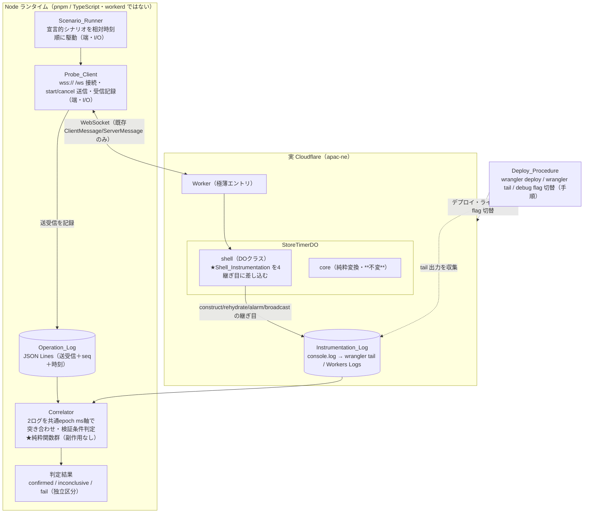
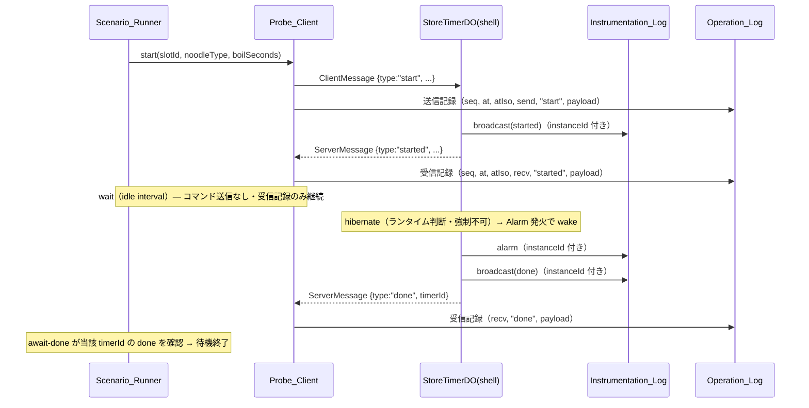
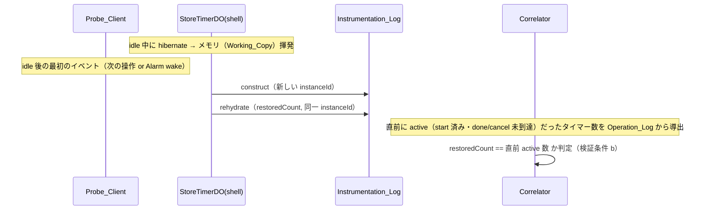

# 技術設計書 — hibernation 観測ハーネス（hibernation-observability）

## この設計が拠って立つもの

本設計は `requirements.md`（全9要件・EARS記法・精密化済み）と、ステアリング三点（`design-philosophy.md` / `naming.md` / `tooling.md`）を前提とする。設計判断はすべてこの二つから演繹される。観測ハーネスは製品機能ではなく「`StoreTimerDO` の hibernation 挙動を観測して確かめるための道具」であるが、道具であっても同じ哲学に従う——むしろ観測ハーネスにこそ、計算と作用の分離を貫くことで「観測結果そのものが正しい」ことを property で保証する。

哲学を本ハーネスの構造へ翻訳した骨格は次の6点である。本設計の全節はこの骨格の展開にすぎない。

1. **計算と作用の分離を観測ハーネスにも適用する** — Correlator のログ突き合わせ（パース・マージ・分類・検証条件判定）は **副作用のない純粋関数** として書く。同じ二つのログを入力すれば常に同じ判定結果を返す。これにより「観測の正しさ」自体が fast-check の property として検証可能になる。I/O（WS 送受信・JSONL ファイル書き込み・`console.log`・`wrangler` 実行・実時間のスケジューリング）はすべて端（CLI ランタイムと shell）へ寄せる。
2. **core/shell 分離を壊さない** — 計装は `StoreTimerDO` の **shell 層（`src/shell/store-timer-do.ts`）のみ**に差し込む。`src/core/` の純粋関数は一文字も変更しない（要件4.5 / 9.5）。観測のための計算（ログ突き合わせ）は core とは別の純粋ディレクトリに置き、製品の core を汚さない。
3. **SSOT 規律を計装でも崩さない** — 計装は「継ぎ目で既に得られている値」を読むだけで、Working_Copy・永続スナップショット・Effect 実行順序（Persist 先頭）を一切変えない（要件4.6）。`console.log` は Persist の前後関係に割り込まない観測点として置く。
4. **「待つなら寝かせる、抱えると漏れる」を計装でも守る** — 計装は `setInterval` も終わらない `setTimeout` も導入しない。`ctx.acceptWebSocket` による hibernate 可能構成を維持する（要件4.7）。観測のために hibernation を妨げる計装は、観測対象そのものを壊すため自己矛盾である。
5. **導出値を状態に昇格させない** — Correlator が出すマージ系列・分類・判定はすべて二つのログからの**導出**であり、状態として持たない。同じ入力から毎回導出する。instanceId は「constructor 実行という事実」を表す観測キーであって、残り秒のような導出値ではない。
6. **既存のワイヤ形式のみを使う** — Probe_Client は `src/shared/messages.ts` の `ClientMessage` / `ServerMessage` の形式のみで送受信し、新しいメッセージ種別やフィールドを足さない（要件9.6）。観測は既存の継ぎ目を覗くだけで、製品のプロトコルを拡張しない。

---

## Overview

### 目的

既存パイロット `yude-men-timer` の `StoreTimerDO` が持つ **WebSocket Hibernation** が、本番（実 Cloudflare）で設計どおり振る舞うことを「観測して確かめる」ための観測ハーネスを定義する。ローカル（miniflare）では hibernate の発生が非決定的であるため、本番へデプロイした `StoreTimerDO` に対し、外部の Node CLI から `wss://` で接続し、宣言的シナリオに沿って `start` / `cancel` を駆動し、**クライアント側の操作ログ**と**サーバ側の計装ログ**を時系列に突き合わせて、次の二点を観測する。

- **検証条件 a**: クライアント無操作（idle）の区間でも、Alarm 発火 → broadcast によって `done` がクライアントへ届く（hibernate 中でもタイマーが発火する）。
- **検証条件 b**: idle 後の最初のイベントで、新しい instanceId（= constructor 再実行）に続く rehydrate の復元件数が、その直前の残存タイマー数と一致する（メモリ揮発から storage 復元が正しく行われる）。

### 観測の決定性に関する前提（正直な限界）

Cloudflare の hibernation 移行タイミングはランタイムの判断であり、外部から強制できない。本ハーネスは hibernation の**発生を保証できず**、観測は「発生した hibernation を捉える」ことに限定される。したがって本設計は次の限界を構造として組み込む。

- hibernation が観測されなかった実行は**失敗ではなく「未観測（inconclusive）」**として扱い、fail の集計に含めない（要件7.1 / 7.6）。
- idle interval は 1〜3600 秒の整数秒の設定可能パラメータとし、実務上 15〜30 秒で安定発生する経験則に基づくが保証ではない（要件7.2）。
- 観測ウィンドウは「idle 経過時点からさらに最大 60 秒」を満了点とし、その時点で hibernation wake の signal（新しい instanceId と `rehydrate` の組）が観測されたかで confirmed / inconclusive を分ける（要件7.4 / 7.5）。

### スコープ外

認証・認可の作り込み（WS エンドポイントは無認証パイロット前提）、マルチテナント、本番運用の恒久的なログ基盤・収集パイプライン。本ハーネスはパイロットの挙動検証用に限る。

> **セキュリティ注記:** 本ハーネスが対象とする WebSocket エンドポイントは無認証で公開される。店舗識別子を知る第三者が `wss://` に接続して `start` / `cancel` を送信し得る。これはパイロット前提（限定ネットワーク・短期検証）で許容し、アクセス制御の追加はスコープ外とする。Deploy_Procedure はこのリスクを明記する（要件8.5）。本番化時には認証層の追加が必須である。

---

## Architecture

### コンポーネント構成

観測ハーネスは「実 Cloudflare 上で動く計装済み DO」と「Node 上で動く観測クライアント＋突き合わせ器」に分かれる。両者を結ぶのは二つのログ（Operation_Log / Instrumentation_Log）だけであり、突き合わせは後段の純粋関数（Correlator）が担う。



> **★印が本 spec で新規に書くもの。** `Shell_Instrumentation`（shell の4継ぎ目への計装）・`Probe_Client`/`Scenario_Runner`（Node CLI の端）・`Correlator`（純粋な突き合わせ器）・`Deploy_Procedure`（手順）。`StoreTimerDO` の **core は不変**であり、shell も既存の Effect 実行順序・SSOT 規律を保ったまま観測点（`console.log`）だけを足す。

### データフロー（idle 区間での Alarm 発火観測＝検証条件 a）



突き合わせ後、Correlator は「idle 区間内で `alarm`（Instrumentation_Log）の epoch ms が当該タイマーの `done`（Operation_Log）の epoch ms 以下」という順序が観測されれば**検証条件 a を合格**として記録する（要件6.2）。

### データフロー（idle 後の rehydrate 復元件数の一致＝検証条件 b）



### 純粋／非純粋の境界（本ハーネスの中心的構造）

| 関心事 | 純粋（計算・テスト可能） | 非純粋（作用・端） |
| --- | --- | --- |
| ログ表現 | log entry の型・直列化・解析（round-trip） | JSONL ファイルへの書き込み（`fs`） |
| シナリオ | シナリオの型・検証・相対時刻順の整列 | 実時間に沿った駆動（`setTimeout` 1 回ずつ・スケジューリング） |
| 接続 | 起動引数の検証（`wss://`・店舗識別子） | WebSocket の接続・送受信・タイムアウト計測 |
| 突き合わせ | パース・共通時刻軸マージ・instanceId 分類・検証条件 a/b 判定・confirmed/inconclusive/fail 決定 | （なし。Correlator は完全に純粋） |
| 計装 | 計装ログ entry の組み立て（継ぎ目の値からの導出） | `console.log` 出力・instanceId 採番（`crypto.randomUUID`） |
| デプロイ | （なし） | `wrangler deploy` / `wrangler tail` / flag 切替 |

> **観測ハーネスにおける「計算と作用の分離」の意味:** 観測の核心は「二つのログが何を意味するか」の判定である。これを純粋関数に閉じ込めれば、判定ロジックを実 Cloudflare もファイルも介さず、生成した大量のログ列に対して property で検証できる。逆に I/O（WS・ファイル・`console.log`・実時間）は判定を含まない薄い殻に留める。これが「角度を変える手続きがない」構造であり、観測結果の正しさを機械検証可能にする唯一の形である。

### 確認した Cloudflare / 観測の事実（既存 design.md から継承）

本ハーネスは既存 `yude-men-timer/design.md` で確認済みの事実に立つ。新たな API 調査は要さない。

- **hibernation の継ぎ目** — hibernate からの復帰時、イベント配送前に **constructor が再実行される**（既存 design.md「WebSocket Hibernation API」）。これが instanceId 採番の継ぎ目であり、rehydrate（`ensureLoaded`）が直後に走る。WS 接続は維持されたまま wake する（接続継続）のが hibernation wake、cold start / 再デプロイは再接続を伴う。
- **rehydrate の継ぎ目** — `ensureLoaded` が `storage.get` → `migrate` → `fromSnapshot` で `TimerState` を復元する（既存 design.md「rehydrate / blockConcurrencyWhile 設計」）。復元した `timers.length` が「復元件数」である。
- **alarm の継ぎ目** — `alarm()` ハンドラが `decide(state, {type:"AlarmFired", now})` を呼び、`fireDueTimers` 経由で `done` を broadcast する（既存 design.md「Alarm 運用設計」）。
- **broadcast の継ぎ目** — `applySideEffect` の `Broadcast` 分岐が `ctx.getWebSockets()` を走査して全 WS へ送信する（既存 `store-timer-do.ts`）。
- **`wrangler tail`** — デプロイ済み Worker の `console.log` 出力をライブ観測できる（要件8.2）。Instrumentation_Log はこの経路で収集する。

---

## Components and Interfaces

> 本節は型シグネチャで責務境界を定める。**ここに現れる公開シンボル名（型名・関数名・継ぎ目種別名・シナリオ操作名・判定区分名・CLI コマンド名）はすべて暫定であり、実装前にユーザー確認を要する**（命名規律）。確認用の候補・概念境界・ドメイン語彙との対応は末尾「公開シンボル命名の確認」節にまとめる。本節の名前はその候補を仮に用いたものである。

### ディレクトリ配置の提案と理由

要件9.5 は「`src/core/` 配下を追加・変更・削除せず、計装の追加を `src/shell/` 配下と CLI 側に限定する」と定める。これを構造として明示するため、次の配置を提案する。

| 置き場所 | 内容 | 純度 | 理由 |
| --- | --- | --- | --- |
| `src/shell/store-timer-do.ts`（既存を編集） | Shell_Instrumentation（4継ぎ目の `console.log` と instanceId 採番） | 非純粋（端） | 計装は shell 層に限定（要件4.5 / 9.5）。既存ファイルへの最小の差し込みに留め、core は触れない。 |
| `src/observe/`（新規・純粋） | Correlator・log codec・scenario モデル＋検証・引数検証 | **純粋**（`cloudflare:workers` も `fs` も WS も触れない） | core と同じく純粋で他基盤へ運べるが、**製品の core ではない**。`src/core/` を汚さないため（要件9.5）、純粋ハーネス論理は core の兄弟ディレクトリに独立させる。`src/` 配下なので Vitest と `tsc` がそのまま解決でき、property テストの対象になる。 |
| `tools/observe/`（新規・端） | Probe_Client / Scenario_Runner の Node 実行体（WS・JSONL ファイル IO・スケジューリング・終了コード）、Correlator を呼ぶ突き合わせ CLI | 非純粋（端） | これらは **Node 上で動く実行体**であり workerd では動かない。デプロイされる Worker バンドル（`src/worker.ts` → `src/shell` / `src/core` / `src/client`）に CLI コードを混ぜないため、`tools/` に隔離する。純粋論理は `src/observe/` から import するだけで、I/O の殻に留める。 |
| `tests/observe/`（新規） | `src/observe/` の property/example テスト、shell 計装の統合テスト | — | 既存 `tests/core`・`tests/client` と同じ規約に従う。 |

> **なぜ純粋論理を `tools/` ではなく `src/observe/` に置くか:** `tools/` の CLI 実行体は Node の `fs` や `ws` ライブラリに依存する端である。一方 Correlator・log codec・scenario 検証は I/O を一切持たない純粋関数で、core と同じく「他基盤へ運べる」性質を持つ。純粋論理を端（`tools/`）に同居させると、テスト時に Node I/O 依存を引き込み、純度の境界が曖昧になる。`src/observe/` に独立させることで「純粋＝テスト可能・移植可能」「`tools/`＝I/O の殻」という境界が構造で見える。`src/observe/` は `src/worker.ts` から import されないため、デプロイ Worker バンドルには含まれない（バンドルを膨らませない）。

### Probe_Client（Node CLI の端・I/O）

`wss://` で `/ws` に接続し、`start` / `cancel` を送信し、受信を記録する観測クライアント。**送受信の I/O とログ書き込みのみを担い、判定は一切しない**（判定は Correlator）。

```ts
// tools/observe/probe.ts — Node ランタイムの端。WS と fs を持つ。
// 純粋な引数検証は src/observe/args.ts に分離する（下記）。

interface ProbeConnection {
  /** 受信メッセージを受信順・本文不改変で逐次コールバックへ渡す（要件1.7）。 */
  readonly onMessage: (handler: (raw: string, receivedAt: EpochMillis) => void) => void;
  /** ClientMessage を送信する。失敗時は理由を返す（要件1.4 / 1.5 / 1.6）。 */
  readonly send: (message: ClientMessage) => Promise<SendOutcome>;
  readonly close: () => Promise<void>;
}

type SendOutcome =
  | { readonly ok: true }
  | { readonly ok: false; readonly reason: string; readonly messageType: ClientMessage["type"] };

/**
 * 接続を確立する。確立試行開始から 10,000ms 以内に確立できない／失敗したら reject（要件1.3）。
 * 接続確立は /ws パスへの WebSocket ハンドシェイク成功を指す（要件1.2）。
 */
function connectProbe(endpoint: string, storeId: string): Promise<ProbeConnection>;

/** 接続タイムアウト（要件1.3）。 */
const CONNECT_TIMEOUT_MS = 10_000;
```

### 起動引数の検証（純粋）

`wss://` スキームと空でない店舗識別子の検証は副作用を持たない純粋関数として分離し、property で検証する（要件1.1）。

```ts
// src/observe/args.ts — 純粋。WS も process も触れない。
type ProbeArgs =
  | { readonly ok: true; readonly endpoint: string; readonly storeId: string }
  | { readonly ok: false; readonly reason: "NotWssScheme" | "EmptyStoreId" };

/** 起動引数を検証する。wss:// でない／店舗識別子が空なら ok:false（要件1.1）。 */
function validateProbeArgs(rawEndpoint: string, rawStoreId: string): ProbeArgs;
```

> 接続試行・送信失敗・タイムアウト・非ゼロ終了（要件1.2 / 1.3 / 1.6）は I/O と `process.exit` を伴う端の責務であり、CLI ランタイムが `validateProbeArgs` の結果と `connectProbe` / `send` の結果を見て Operation_Log へ記録し終了コードを決める。判定ロジックではないため property の対象外（統合／example で確認）。

### Scenario_Runner（端・I/O）と シナリオモデル（純粋）

宣言的シナリオを相対時刻順に駆動する。**シナリオの型・検証・整列は純粋**に分離し、実時間に沿った駆動だけを端に残す。

```ts
// src/observe/scenario.ts — 純粋。型・検証・整列のみ。実時間を持たない。

type ScenarioStep =
  | { readonly at: number; readonly op: "start"; readonly slotId: string;
      readonly noodleType: string; readonly boilSeconds: number }
  | { readonly at: number; readonly op: "cancel"; readonly timerId: string }
  | { readonly at: number; readonly op: "wait"; readonly durationMs: number }
  | { readonly at: number; readonly op: "await-done"; readonly timerId: string; readonly timeoutMs: number };

interface Scenario {
  readonly steps: readonly ScenarioStep[];        // 1..100 ステップ（要件3.1）
  readonly idleIntervalSeconds: number;           // 1..3600 の整数秒（要件7.2）
}

type ScenarioValidation =
  | { readonly ok: true; readonly scenario: Scenario }
  | { readonly ok: false; readonly reason: ScenarioRejectReason };

type ScenarioRejectReason =
  | "StepCountOutOfRange"      // ステップ数が 1..100 外（要件3.1）
  | "RelativeTimeOutOfRange"   // at が 0..3,600,000ms 外（要件3.1）
  | "WaitDurationOutOfRange"   // wait の durationMs が 0..600,000ms 外（要件3.3）
  | "AwaitTimeoutOutOfRange"   // await-done の timeoutMs が 1,000..600,000ms 外（要件3.4）
  | "IdleIntervalOutOfRange";  // idleIntervalSeconds が 1..3600 の整数秒でない（要件7.3）

/** 生のシナリオ入力を検証する。範囲外は ok:false を返し、既存設定を変更しない（要件3.1 / 3.3 / 3.4 / 7.3）。 */
function validateScenario(raw: unknown): ScenarioValidation;

/**
 * ステップを相対時刻 at の昇順へ安定整列する（要件3.1）。
 * at が等しい複数ステップは記述順を保持する（安定ソート）。
 */
function orderedSteps(scenario: Scenario): readonly ScenarioStep[];

/** await-done の待機を終了すべきか（純粋判定・要件3.4 / 3.5）。指定 timerId の done のみ true。 */
function shouldStopAwaiting(received: ServerMessage, targetTimerId: string): boolean;
```

```ts
// tools/observe/runner.ts — 端。実時間に沿って orderedSteps を駆動する。
// 各ステップの相対時刻に達したらその操作を 250ms 以内に開始する（要件3.2）。
// wait 中はコマンドを送らず受信記録のみ継続（要件3.3）。await-done は
// shouldStopAwaiting が true を返すか上限待機時間まで待つ（要件3.4〜3.6）。
// 操作実行時に接続未確立なら接続未確立を記録し非ゼロ終了（要件3.7）。
// 全ステップ完了で接続を閉じ、ログを確定しゼロ終了（要件3.8）。
function runScenario(scenario: Scenario, connection: ProbeConnection, log: OperationLogSink): Promise<number>;
```

> `runScenario` の戻り値は終了コード（0 / 非ゼロ）。実時間・`setTimeout`・`process.exit` を扱う端であり、ここに `setInterval` や終わらない `setTimeout` は使わない（各ステップは一度きりの遅延起動で、シナリオ完了で必ず終わる）。

### Shell_Instrumentation（shell 層への計装・端）

`StoreTimerDO` の shell の4継ぎ目に、instanceId 付き構造化ログを `console.log` で出力する。**core は不変。** 既存の Effect 実行順序・SSOT 規律・hibernate 可能構成を変えない（要件4.5 / 4.6 / 4.7）。

差し込む継ぎ目は既存 `store-timer-do.ts` の以下の4点に限定する（要件4.9）。

| 継ぎ目種別（暫定名） | 差し込み位置（既存コード） | ログに含める値 | 要件 |
| --- | --- | --- | --- |
| `construct` | `constructor`（`super(ctx, env)` 直後、instanceId 採番後） | `seam`・`instanceId`・`at` | 4.1 |
| `rehydrate` | `ensureLoaded` の `this.workingCopy = fromSnapshot(...)` の直後 | `seam`・`instanceId`・`restoredCount`（= `workingCopy.timers.length`）・`at` | 4.2 |
| `alarm` | `alarm()` ハンドラの先頭（`ensureLoaded` 後） | `seam`・`instanceId`・`at` | 4.3 |
| `broadcast` | `applySideEffect` の `case "Broadcast"`（送信ループ前） | `seam`・`instanceId`・`messageType`（= `effect.message.type`）・`at` | 4.4 |

```ts
// src/shell/store-timer-do.ts への最小の差し込み（擬似）。
// instanceId はメモリ上の事実（この in-memory 生存期間を一意に識別する観測キー）。
// 採番は crypto.randomUUID() という shell の作用であり、constructor で一度だけ行う（要件4.8 / 5.1）。
private readonly instanceId: string = crypto.randomUUID();
private readonly instanceBornAt: EpochMillis = Date.now() as EpochMillis;

// debug flag は env 経由。無効時はいずれの継ぎ目からも出力しない（要件4.10）。
private get instrumentationEnabled(): boolean {
  return this.env.OBSERVE_DEBUG === "1"; // 名前は確認対象（後述）
}

// 計装ログ entry の組み立ては純粋関数（src/observe）に委ね、shell は console.log で吐くだけ。
private emitSeam(entry: InstrumentationLogEntry): void {
  if (!this.instrumentationEnabled) return; // 要件4.10
  console.log(JSON.stringify(entry));        // wrangler tail が拾う唯一の作用
}
```

> **計装の規律（なぜこの形か）:**
> - **値はすべて継ぎ目で既に得られている**（要件4.6）。`construct` は採番済み instanceId、`rehydrate` は復元直後の `workingCopy.timers.length`、`broadcast` は `effect.message.type`。計装のために新たに状態を計算・保持しない（Working_Copy・スナップショット・Persist 先頭順序は不変）。
> - **debug flag ゲートは `emitSeam` の一点に集約**する。各継ぎ目は `emitSeam` を呼ぶだけで、無効時は何も出力しない（要件4.10）。これにより「4継ぎ目限定」（要件4.9）が構造で守られる——`emitSeam` を呼ぶ箇所が4つだけであることをコードレビューと静的検査で確認できる。
> - **`setInterval` を持ち込まない**（要件4.7）。計装は同期的な `console.log` のみで、タイマーも待機も持たない。hibernate 可能構成（`ctx.acceptWebSocket`）はそのまま。
> - **core を呼ばない・変えない**（要件4.5）。計装は shell のメソッド内で完結し、`decide` や core の型に一切触れない。

### Correlator（純粋関数群・本ハーネスの計算の核）

二つのログを共通の epoch ms 軸で突き合わせ、検証条件を判定する。**完全に純粋**——同じ入力に常に同じ出力を返し、ファイルも時計も WS も触れない。Operation_Log / Instrumentation_Log のテキスト（JSONL / tail 収集）を入力として受け取る。

```ts
// src/observe/correlate.ts — 純粋。突き合わせと判定のみ。

// --- 共通時刻軸マージ（要件6.1 / 6.6） ---
type MergedSource = "operation" | "instrumentation";
interface MergedRow {
  readonly at: EpochMillis;          // 共通の epoch ms 軸
  readonly source: MergedSource;
  readonly entry: OperationLogEntry | InstrumentationLogEntry;
}

/**
 * 2ログを epoch ms 昇順で安定マージする（要件6.1）。
 * - 同一 epoch ms の行は元の出現順を保持する（安定整列）。
 * - 出力長は ops.length + seams.length に等しく、いずれの行も欠落・重複させない（要件6.6）。
 * - 片方／両方が 0 行でも保存性を満たす。
 * - 同一入力に常に同一系列を返す（決定的）。
 */
function mergeByTime(
  ops: readonly OperationLogEntry[],
  seams: readonly InstrumentationLogEntry[],
): readonly MergedRow[];

// --- instanceId による再 construct の分類（要件5） ---
type ConstructClass =
  | "hibernation-wake"          // 出現区間に再接続イベント 0 件（要件5.2）
  | "cold-start-or-redeploy"    // 出現区間に再接続イベント 1 件以上（要件5.3）
  | "initial-construct"         // 先行 instanceId なし＝観測上の初回（要件5.6・独立カテゴリ）
  | "unclassifiable";           // 対応する Operation_Log 欠落で分類不能（要件5.5）

interface InstanceInterval {
  readonly instanceId: string;
  readonly bornAt: EpochMillis;            // 採番時刻（要件5.1）
  readonly endAt: EpochMillis;             // 次の instanceId 採番時刻、無ければ観測終了時刻（要件5.2）
  readonly classification: ConstructClass;
}

/**
 * 各 instanceId の出現区間を採番時刻の昇順で安定整列して返す（要件5.4）。
 * 採番時刻が同一なら採番順の昇順。各区間を要件5.2/5.3/5.5/5.6 に従い分類する。
 */
function classifyInstances(
  seams: readonly InstrumentationLogEntry[],
  ops: readonly OperationLogEntry[],
  observationEndAt: EpochMillis,
): readonly InstanceInterval[];

// --- 検証条件 a / b（要件6.2〜6.5） ---
interface IdleInterval {
  readonly fromAt: EpochMillis;   // start/cancel いずれも発行しない連続区間（Operation_Log から導出）
  readonly toAt: EpochMillis;
}

type ConditionA =
  | { readonly verdict: "pass"; readonly timerId: string }                       // alarm ms ≤ done ms（要件6.2）
  | { readonly verdict: "fail"; readonly timerId: string; readonly cause: "NoAlarm" | "AlarmAfterDone" }; // 要件6.3

/** idle 区間内で、当該タイマーの done に対し alarm が「done 以下の epoch ms」で先行するかを判定（要件6.2 / 6.3）。 */
function verifyAlarmFiredInIdle(merged: readonly MergedRow[], idle: IdleInterval): readonly ConditionA[];

type ConditionB =
  | { readonly verdict: "pass"; readonly restoredCount: number }                                  // 一致（要件6.4）
  | { readonly verdict: "fail"; readonly expectedActive: number; readonly restoredCount: number }; // 不一致（要件6.5）

/**
 * idle 後の最初のイベントで、新しい instanceId の construct に続く rehydrate の復元件数が、
 * 当該イベント直前に active（start 済み・done/cancel 未到達）だったタイマー数と一致するかを判定（要件6.4 / 6.5）。
 * 直前 active 数は Operation_Log から導出する。
 */
function verifyRehydrateCount(merged: readonly MergedRow[], instances: readonly InstanceInterval[]): readonly ConditionB[];

// --- 実行全体の判定（要件7.4〜7.6） ---
type HarnessVerdict =
  | { readonly kind: "confirmed"; readonly conditionA: readonly ConditionA[]; readonly conditionB: readonly ConditionB[] }
  | { readonly kind: "inconclusive" }   // 観測ウィンドウ内に hibernation wake signal 無し（要件7.4）
  | { readonly kind: "fail"; readonly conditionA: readonly ConditionA[]; readonly conditionB: readonly ConditionB[] };

/**
 * 観測ウィンドウ満了時点で hibernation wake signal（新 instanceId + rehydrate の組）の有無を見て
 * confirmed / inconclusive を分け、検証条件 a/b に fail があれば fail とする（要件7.4 / 7.5 / 7.6）。
 * inconclusive は fail と相互に独立であり、fail の集計に含めない（要件7.6）。
 */
function determineVerdict(
  merged: readonly MergedRow[],
  instances: readonly InstanceInterval[],
  observationWindowEndAt: EpochMillis,
): HarnessVerdict;

/** 観測ウィンドウ満了点 = idle 経過時点 + 最大 60 秒（要件7.4）。 */
const OBSERVATION_TAIL_MS = 60_000;
```

### Deploy_Procedure（手順・端）

実 Cloudflare へデプロイし、ライブログを観測する手順。コードではなく Markdown 手順として `tools/observe/` 配下に置く（README 等）。

- **デプロイと公開確認**（要件8.1）— `pnpm build`（`tsc --noEmit && vite build`）→ `wrangler deploy`。デプロイ成功メッセージと `StoreTimerDO` バインディングの公開（Worker のルートと DO namespace のバインド）を確認する。
- **ライブ観測**（要件8.2）— `wrangler tail`（または Workers Logs ダッシュボード）で `construct` / `rehydrate` / `alarm` / `broadcast` の各イベントログが現れることを確認する。
- **debug flag 有効化**（要件8.3）— 観測開始時に debug flag を本番で有効化する手順（`wrangler secret put` か環境変数の設定 → 反映）。
- **debug flag 無効化と確認**（要件8.4）— 観測完了時に flag を既定（無効）へ戻し、戻した後に Instrumentation_Log が出力されないことを `wrangler tail` で確認する。
- **無認証公開リスクの明記**（要件8.5）— WS エンドポイントが無認証で、第三者が `start` / `cancel` を送信し得ること、これがパイロット前提で許容されアクセス制御の追加はスコープ外であることを明記する。

---

## Data Models

すべての観測対象は二つのログ entry に集約される。両者は「1 行 1 JSON オブジェクト」の構造化ログであり、Correlator が共通の epoch ms 軸で突き合わせる。

### Operation_Log entry（Probe_Client が出力・JSON Lines）

```ts
// src/observe/log.ts — 純粋。型と直列化／解析のみ。

type LogDirection = "send" | "recv";  // 送信 / 受信（要件2.1 / 2.2）

interface OperationLogEntry {
  readonly seq: number;            // 起動時 0 から 1 ずつ単調増加・欠番/重複なし（要件2.3）
  readonly at: number;             // 送受信時刻のエポックミリ秒（0 以上の整数・要件2.1 / 2.2）
  readonly atIso: string;          // 同時刻の UTC ISO 8601・末尾 Z・ミリ秒精度（要件2.1 / 2.2）
  readonly direction: LogDirection;
  readonly messageType: string;    // start/cancel/snapshot/started/cancelled/done/error 等
  readonly payload: unknown;       // メッセージ本文（JSON 値）
}
```

- **JSON Lines 形式**（要件2.4）— 各行を `\n` で区切り、1 行に 1 個の JSON オブジェクトを格納する。各記録行自体には改行を含まない（直列化が `\n` を含む値を出さないことを保証する）。
- **時刻の二重表現**（要件2.1 / 2.2）— `at`（epoch ms・突き合わせの共通軸）と `atIso`（人間可読・UTC・`Z`・ミリ秒）。両者は同一時刻を指す。
- **シーケンス番号**（要件2.3）— 記録ごとに 0 から +1。欠番・重複を含まない。Probe_Client の記録順（送受信が起きた順）に一致する。

```ts
/** entry を 1 行の JSON 文字列へ直列化する（改行を含まない・要件2.4）。 */
function serializeOperationEntry(entry: OperationLogEntry): string;

type ParsedOperationLine =
  | { readonly ok: true; readonly entry: OperationLogEntry }
  | { readonly ok: false; readonly raw: string };  // JSON 不正 or 必須属性欠如（要件2.6）

/** 1 行を解析する。必須属性（seq/at/atIso/direction/messageType/payload）の欠如は ok:false（要件2.6）。 */
function parseOperationLine(line: string): ParsedOperationLine;

interface OperationLogParse {
  readonly entries: readonly OperationLogEntry[];  // 入力の行順を保持（要件2.5）
  readonly failures: readonly string[];            // 解析失敗行（判別可能・要件2.6）
}

/** JSON Lines 全体を解析する。不正行は failures へ分離し、解析済み entry は保持する（要件2.5 / 2.6）。 */
function parseOperationLog(text: string): OperationLogParse;
```

### Instrumentation_Log entry（Shell_Instrumentation が `console.log` で出力）

```ts
// src/observe/log.ts（続き）— 純粋。

type SeamKind = "construct" | "rehydrate" | "alarm" | "broadcast";  // 4継ぎ目限定（要件4.9）

interface InstrumentationLogEntry {
  readonly seam: SeamKind;
  readonly at: number;                  // 出力時刻のエポックミリ秒（共通時刻軸）
  readonly atIso: string;               // UTC ISO 8601・Z・ミリ秒（Operation_Log と同形式）
  readonly instanceId: string;          // この in-memory 生存期間を一意に識別（要件4.x / 5.1）
  readonly restoredCount?: number;      // rehydrate のみ：復元 Timer 件数（0 以上整数・要件4.2）
  readonly messageType?: string;        // broadcast のみ：送信 ServerMessage の種別（要件4.4）
}

/** 継ぎ目の値から計装 entry を組み立てる純粋関数（shell はこれを console.log で吐くだけ）。 */
function buildSeamEntry(input: {
  seam: SeamKind; at: number; instanceId: string; restoredCount?: number; messageType?: string;
}): InstrumentationLogEntry;

/** wrangler tail で収集した行から計装 entry を解析する（round-trip 対象）。 */
function parseInstrumentationLine(line: string): { ok: true; entry: InstrumentationLogEntry } | { ok: false; raw: string };
```

- `restoredCount` は `rehydrate` のときだけ存在し、`messageType` は `broadcast` のときだけ存在する。継ぎ目種別ごとに必要なフィールドだけを持つ（不正な状態を構築可能にしない）。
- すべての値は継ぎ目で既に得られている（要件4.6）。計装は新たな計算・状態を持ち込まない。

### Scenario（宣言的シナリオ）

前掲 `ScenarioStep` / `Scenario`（Components 節）。相対時刻 `at`（0〜3,600,000ms）と操作（`start` / `cancel` / `wait` / `await-done`）の列。ステップ数 1〜100。`idleIntervalSeconds` は 1〜3600 の整数秒。

### 判定結果（confirmed / inconclusive / fail）

前掲 `HarnessVerdict`（Components 節）。三区分は相互に独立し、`inconclusive` は `fail` の集計に含めない（要件7.6）。`confirmed` / `fail` は検証条件 a（`ConditionA[]`）・b（`ConditionB[]`）の内訳を保持する。

---

## Correctness Properties

*プロパティとは、システムのあらゆる正当な実行において成り立つべき特性・振る舞いであり、システムが何をすべきかについての形式的な言明である。プロパティは、人間が読む仕様と、機械が検証できる正しさの保証との橋渡しをする。*

本ハーネスは Property-Based Testing（PBT）が**強く適合**する。理由は明確である——観測の核心である Correlator（パース・共通時刻軸マージ・instanceId 分類・検証条件 a/b 判定・confirmed/inconclusive/fail 決定）と、log codec（直列化／解析）、scenario 検証、引数検証は、いずれも **時計も storage も WS も持たない決定的な純粋関数** である。生成器が吐く大量のログ列・シナリオ・引数に対して、以下の不変条件を**実 Cloudflare もファイルも実時間も介さず**検証できる。

逆に、WS の接続・送受信・タイムアウト、実時間スケジューリング（250ms 窓・await-done の待機）、`console.log` 出力の配線、instanceId 採番、`wrangler` 実行は、入力で振る舞いが変わらない／外部依存／実時間依存の **端** であり、PBT には不適。これらは統合（Integration）・例示（Example）・スモーク（Smoke）で確認する（Testing Strategy 参照）。

> 各プロパティは骨格の帰結である。「計算と作用の分離を観測ハーネスにも適用する」が Correlator の純粋性（P6〜P11）に、「既存ワイヤ形式のみ」と「観測の正しさの機械検証」が log codec の round-trip（P1・P13）に、そのまま写されている。プロパティが自然に列挙できること自体が、純粋／非純粋の境界が正しく引けている徴である。

### 生成器の前提（すべてのプロパティが共有する入力空間）

- **`genOperationEntry`** — `seq`（0 以上整数）・`at`（0 以上整数エポックミリ秒）・`atIso`（`at` と整合する UTC・`Z`・ミリ秒文字列）・`direction`（`send`/`recv` 両方）・`messageType`（既存の `start`/`cancel`/`snapshot`/`started`/`cancelled`/`done`/`error` を広く分布）・`payload`（既存ワイヤ形式に沿う JSON 値。非 ASCII・空文字・ネストを含む）。
- **`genSeamEntry`** — `seam`（`construct`/`rehydrate`/`alarm`/`broadcast`）・`at`・`atIso`・`instanceId`（UUID 形）。`rehydrate` は `restoredCount`（0 以上整数）、`broadcast` は `messageType` を伴う。
- **`genLogLines`** — 有効行と**不正行**（壊れた JSON・必須属性欠如・行内改行混入の試み）を混在させた JSON Lines テキスト。エッジ（要件2.6）を構造的に踏む。
- **`genMerged`** — Operation_Log と Instrumentation_Log の組。**同一 epoch ms の衝突**を意図的に分布させ（安定整列検証）、片方/両方が 0 行の境界を含む（要件6.6）。
- **`genIdleScenario`** — idle 区間と、その中の `alarm`/`done` の epoch ms 関係（`alarm ≤ done`／`alarm > done`／`alarm` 欠如）を三領域で生成（検証条件 a）。
- **`genActiveTrace`** — `start`/`done`/`cancel` の列と、idle 後の `construct`+`rehydrate` の `restoredCount` を、直前 active 数と「一致／不一致」の両方で生成（検証条件 b）。
- **`genInstances`** — instanceId の出現区間列。採番時刻の**重複**、出現区間に対応する Operation_Log の**欠落**、観測上の初回区間を境界として含む（要件5.4/5.5/5.6）。
- **`genScenarioInput`** — ステップ数（0・1・100・101）、相対時刻 `at`（負・0・3,600,000・超過）、`wait`/`await-done` の範囲内外、idle 秒（0・1・3600・3601・非整数）を境界として生成（要件3.1/3.3/3.4/7.3）。
- **`genArgs`** — エンドポイント（`wss://`・`ws://`・`http://`・空・非 URL）と店舗識別子（空・空白のみ・非空）を分布（要件1.1）。

### Property 1: Operation_Log は直列化→解析で全属性を保存する（round-trip・JSON Lines 健全性）

*任意の* `OperationLogEntry` について、`parseOperationLine(serializeOperationEntry(entry))` は元の entry と全属性（`seq`・`at`・`atIso`・`direction`・`messageType`・`payload`）が一致する。さらに `serializeOperationEntry` の出力は改行（`\n`）を含まない 1 行であり、`at` は 0 以上の整数、`atIso` は UTC・末尾 `Z`・ミリ秒精度の ISO 8601 文字列で `at` と同一時刻を表す。複数 entry を `\n` で連結したテキストは `\n` で分割すると各行がちょうど 1 個の entry へ解析できる。

**Validates: Requirements 2.1, 2.2, 2.4, 2.7**

### Property 2: シーケンス番号は 0 から欠番・重複なく単調増加する

*任意の* 長さの記録列について、起動時の初期値 0 から記録ごとに 1 ずつ付番すると、得られる `seq` 列は `0, 1, 2, …, n-1` であり、欠番および重複を含まず、記録順（送受信が起きた順）に一致する。

**Validates: Requirements 2.3**

### Property 3: 解析は行順を保存し、不正行を分離しつつ有効行を保持する

*任意の* 有効行と不正行（JSON 不正・必須属性欠如）が混在する JSON Lines テキストについて、`parseOperationLog` は有効行のみを入力の行順を保持した `entries` として返し、不正行を判別可能な `failures` へ分離する。既に解析済みの有効 entry は不正行の存在によって失われない。

**Validates: Requirements 2.5, 2.6**

### Property 4: シナリオ検証は範囲内のみ受理し、範囲外を拒否して既存設定を変えず、整列は安定である

*任意の* 生のシナリオ入力について、`validateScenario` は、ステップ数が 1〜100・相対時刻 `at` が 0〜3,600,000ms 整数・`wait` の `durationMs` が 0〜600,000ms 整数・`await-done` の `timeoutMs` が 1,000〜600,000ms 整数・`idleIntervalSeconds` が 1〜3600 の整数秒、をすべて満たすときのみ `ok:true` を返し、いずれかが範囲外なら対応する理由で `ok:false` を返して既存の設定値を変更しない。受理されたシナリオについて `orderedSteps` は `at` の昇順への**安定**ソートであり、`at` が等しい複数ステップは記述順を保持する。

**Validates: Requirements 3.1, 3.3, 3.4, 7.3**

### Property 5: await-done の終了判定は「指定 timerId の done」に限る

*任意の* `ServerMessage` と *任意の* 対象 `timerId` について、`shouldStopAwaiting(received, targetTimerId)` は、受信が `done` かつその `timerId` が対象と一致するときに限り `true` を返し、それ以外（種別が `done` でない、または `timerId` が一致しない `done`）はすべて `false` を返す。

**Validates: Requirements 3.4, 3.5**

### Property 6: instanceId 区間の分類は再接続有無・先行有無・op 欠落で一意に定まる

*任意の* instanceId 出現区間列と対応する Operation_Log について、`classifyInstances` は各区間を次のとおり分類する。(a) 先行 instanceId が存在しない最初の区間は `initial-construct`（独立カテゴリ。`hibernation-wake` にも `cold-start-or-redeploy` にも分類しない）。(b) 対応する Operation_Log が欠落し分類に必要な情報が得られない区間は `unclassifiable` と標識し、他区間の分類は継続する。(c) それ以外で、当該区間に Probe_Client の再接続イベントが 0 件なら `hibernation-wake`、1 件以上なら `cold-start-or-redeploy`。

**Validates: Requirements 5.2, 5.3, 5.5, 5.6**

### Property 7: instanceId 区間は採番時刻昇順で安定整列される

*任意の* instanceId 出現区間列について、`classifyInstances` の出力は各区間を採番時刻（`bornAt`）の昇順に並べ、採番時刻が同一の区間は採番順の昇順を保持する（安定整列）。

**Validates: Requirements 5.4**

### Property 8: 共通時刻軸マージは保存的・安定・決定的である

*任意の* Operation_Log（長さ 0 を含む）と Instrumentation_Log（長さ 0 を含む）について、`mergeByTime` の出力系列は、(a) **保存性** — 長さが両入力の行数の合計に等しく、いずれの入力行も欠落・重複させない、(b) **安定整列** — `at`（epoch ms）の昇順であり、同一 `at` の行は両入力それぞれの元の出現順を保持する、(c) **決定性** — 同一入力に対して常に同一の系列を返す、を同時に満たす。片方または両方が 0 行でも (a) の保存性が成り立つ。

**Validates: Requirements 6.1, 6.6**

### Property 9: 検証条件 a — idle 区間内の alarm→done 順序で合否が一意に定まる

*任意の* マージ系列と idle 区間について、`verifyAlarmFiredInIdle` は、idle 区間内で当該タイマーの `done`（Operation_Log）に対し `alarm`（Instrumentation_Log）の epoch ms が `done` 以下で先行するとき、対象タイマーを特定可能な形で `pass` を返す。対応する `alarm` が存在しない場合は `fail`（`cause: "NoAlarm"`）、`alarm` の epoch ms が `done` より後（順序逆転）の場合は `fail`（`cause: "AlarmAfterDone"`）を、両ケースを識別可能な形で返す。

**Validates: Requirements 6.2, 6.3**

### Property 10: 検証条件 b — rehydrate 復元件数と直前 active 数の一致で合否が一意に定まる

*任意の* マージ系列と instanceId 区間について、`verifyRehydrateCount` は、idle 後の最初のイベントで新しい instanceId の `construct` に続く `rehydrate` の復元件数が、当該イベント直前に active（`start` 済みかつ `done`／`cancel` 未到達）だったタイマー数（Operation_Log から導出）と一致するとき `pass` を返し、一致しないとき期待件数（直前 active 数）と観測件数（復元件数）を識別可能な形で `fail` を返す。

**Validates: Requirements 6.4, 6.5**

### Property 11: 実行判定は confirmed / inconclusive / fail を排他に出力し、inconclusive を fail に含めない

*任意の* マージ系列・instanceId 区間・観測ウィンドウ満了点について、`determineVerdict` はちょうど一つの区分を返す。観測ウィンドウ（idle 経過時点 + 最大 60 秒）満了点までに hibernation wake signal（新しい instanceId と `rehydrate` の組）が観測されないならば `inconclusive`、観測されるならば検証条件 a/b に従い `confirmed`（fail が無い）または `fail`（いずれかの条件が fail）を返す。`inconclusive` は決して `fail` に分類されず、三区分は相互に独立である。

**Validates: Requirements 7.4, 7.5, 7.6**

### Property 12: 起動引数の検証は wss スキームと非空店舗識別子に対してのみ成功する

*任意の* エンドポイント文字列と店舗識別子文字列について、`validateProbeArgs` は、エンドポイントが `wss://` スキームであり、かつ店舗識別子が空でないときに限り `ok:true`（`endpoint`・`storeId` を伴う）を返し、エンドポイントが `wss://` でなければ `NotWssScheme`、店舗識別子が空なら `EmptyStoreId` の理由で `ok:false` を返す。

**Validates: Requirements 1.1**

### Property 13: Instrumentation_Log は組み立て→直列化→解析で全属性を保存する（round-trip）

*任意の* 継ぎ目入力（`seam`・`at`・`instanceId`、および `rehydrate` の `restoredCount`・`broadcast` の `messageType`）について、`buildSeamEntry` で組み立てた `InstrumentationLogEntry` を直列化し `parseInstrumentationLine` で解析すると、全属性（`seam`・`at`・`atIso`・`instanceId`・該当する `restoredCount`／`messageType`）が元と一致する。`restoredCount` は `rehydrate` のときのみ、`messageType` は `broadcast` のときのみ存在し、他の継ぎ目では存在しない。

**Validates: Requirements 4.1, 4.2, 4.3, 4.4**

---

## Error Handling

エラー処理は設計哲学「全てのパスを構造で表現する」「握り潰された失敗を残さない」の帰結であり、新たな仕組みを足さない。本ハーネスの失敗は、純粋層の「拒否を戻り値で表す」ものと、端の「I/O 失敗を非ゼロ終了で表す」ものに分かれる。

### 純粋層の拒否（戻り値で表現・例外を投げない）

| 関数 | 拒否／失敗の表現 | 発生条件 | 要件 | 検証 |
| --- | --- | --- | --- | --- |
| `validateProbeArgs` | `ok:false`（`NotWssScheme` / `EmptyStoreId`） | 非 wss スキーム／空店舗識別子 | 1.1 | P12 |
| `validateScenario` | `ok:false`（`*OutOfRange`） | ステップ数・相対時刻・wait・await・idle が範囲外 | 3.1, 3.3, 3.4, 7.3 | P4 |
| `parseOperationLine` | `ok:false`（`raw` を保持） | JSON 不正・必須属性欠如 | 2.6 | P1, P3 |
| `parseOperationLog` | `failures` へ分離・`entries` は保持 | 不正行混在 | 2.5, 2.6 | P3 |
| `verifyAlarmFiredInIdle` | `fail`（`NoAlarm` / `AlarmAfterDone`） | alarm 欠如／順序逆転 | 6.3 | P9 |
| `verifyRehydrateCount` | `fail`（`expectedActive` / `restoredCount`） | 復元件数不一致 | 6.5 | P10 |
| `classifyInstances` | `unclassifiable` 標識・他区間継続 | 対応 Operation_Log 欠落 | 5.5 | P6 |
| `determineVerdict` | `inconclusive`（fail と独立） | wake signal 未観測 | 7.4, 7.6 | P11 |

> **検証失敗（fail）と未観測（inconclusive）を混同しない（要件7.1 / 7.6）。** これは本ハーネスの正直さの核心である。hibernation が観測されなかったことは「ハーネスの失敗」でも「検証条件の不合格」でもなく、独立した区分 `inconclusive` として扱う。`determineVerdict` は wake signal の有無を先に見て `inconclusive` を切り分け、signal がある場合にのみ検証条件 a/b の合否で `confirmed`/`fail` を決める。Property 11 がこの排他性を「任意の入力に対して」保証する。

### 端（I/O）の失敗（非ゼロ終了で表現）

CLI ランタイムの失敗は純粋判定ではなく、Operation_Log への記録と `process.exit(非ゼロ)` で表す。これらは統合／example で確認する（PBT 不可）。

| 失敗 | 振る舞い | 要件 | 検証 |
| --- | --- | --- | --- |
| 引数不正 | 接続試行せず・記録・非ゼロ終了 | 1.1 | Example（端）+ P12（判定） |
| 接続タイムアウト（10,000ms） / 確立失敗 | 理由を記録・非ゼロ終了 | 1.3 | Integration |
| 送信失敗 | 理由と対象種別を記録・非ゼロ終了 | 1.6 | Integration |
| await-done タイムアウト | タイムアウト記録・ログ保持・非ゼロ終了 | 3.6 | Integration |
| 操作時に接続未確立 | 接続未確立を記録・ログ保持・非ゼロ終了 | 3.7 | Integration |

> いずれの端の失敗も**これまでに記録した Operation_Log を保持したまま**終了する（要件3.6 / 3.7）。記録は逐次 JSONL へ追記されるため、途中終了でも観測済みの行は失われない。これは「失敗を握り潰さず回復経路を持つ」（観測者がログを後から Correlator で突き合わせられる）という善の帰結である。

### 計装の失敗を観測対象へ波及させない（要件4.6）

Shell_Instrumentation は `console.log` のみで、失敗しても観測対象（`StoreTimerDO` の状態遷移・Persist・broadcast）に影響しない。`emitSeam` は debug 無効時に即 return し、有効時も同期的に `console.log` するだけで、Working_Copy・永続スナップショット・Effect 実行順序（Persist 先頭）を一切変えない。計装は観測点であって作用点ではない。

---

## Testing Strategy

設計哲学に従い、テスト戦略も「引き算」で導く。本ハーネスは純粋層（`src/observe/`）と端（`tools/observe/`・shell 計装）に分かれ、テストの層もこの境界に一致する。

### 三層のテスト — 何を property で、何を integration/example/smoke で検証するか

- **Property テスト（`src/observe/` の純粋関数）** — 上記 Correctness Properties をそれぞれ**単一の** property-based テストで実装する。Correlator・log codec・scenario 検証・引数検証は決定的純粋関数なので、`Date` モックも faketime も実 WS もファイルも不要。生成器がログ列・シナリオ・引数を吐くだけで、epoch ms 衝突・空ログ・範囲境界・不正行・op 欠落区間といった edge を網羅的に踏む。
- **Integration テスト（shell 計装と CLI の端）** — `StoreTimerDO` の4継ぎ目で計装ログが出力されること（要件4.1〜4.4）、debug 無効で出力されないこと（要件4.10）、instanceId が再 construct ごとに変わり存続期間中不変であること（要件4.8 / 5.1）は、`@cloudflare/vitest-pool-workers` の Workers pool で DO を駆動して確認する。WS 接続・送信・タイムアウト・await-done の待機・接続未確立・正常完走（要件1.2〜1.7 / 3.2 / 3.6 / 3.7 / 3.8）は、モック WS サーバまたは実接続に対して 1〜3 例で確認する。
- **Example テスト（具体シナリオ）** — idle interval の受理（要件7.2）、wait 中の送信抑止・受信記録継続（要件3.3）など、property では捉えにくい具体例を最小限で固める。
- **Smoke テスト／静的検査（構造制約と手順）** — `src/core/` 無変更（要件4.5 / 9.5）、4継ぎ目限定＝`emitSeam` 呼び出しが4点のみ（要件4.9）、`setInterval`/終わらない `setTimeout` 不在と `acceptWebSocket` 維持（要件4.7）、既存ワイヤ形式のみ使用（要件9.6）、CLI 出力が英語のみ（要件9.4）、`tsc --noEmit` / `oxlint` / `vitest --run` の通過（要件9.1〜9.3）。Deploy_Procedure（要件8.1〜8.5）は手順文書＋実デプロイ 1 回の観測。

### PBT の構成（要件9.3）

- Property-Based Testing ライブラリは **fast-check（v4 系）** を採用する（確定スタック）。**PBT を自前実装しない。**
- 各 property テストは**最低 100 回**の反復で実行する。
- 各 property テストには対応する設計プロパティをコメントで明記する。タグ形式: **Feature: hibernation-observability, Property {番号}: {プロパティ本文}**。
- 各 Correctness Property は**単一の** property テストとして実装する（1 プロパティ = 1 テスト）。

### 生成器の設計方針

- **ログ生成器** — 有効 entry と不正行（壊れた JSON・属性欠如・行内改行混入の試み）を混在させ、round-trip（P1 / P13）・解析の頑健性（P3）・マージ保存性（P8）を支える。epoch ms の**衝突**を意図的に分布させ、安定整列（P7 / P8）を踏む。
- **マージ／検証生成器** — idle 区間内の `alarm`/`done` の epoch ms 関係（≤ / > / 欠如）と、rehydrate 復元件数 vs 直前 active 数（一致/不一致）を三領域で生成し、検証条件 a/b（P9 / P10）の全分岐を踏む。空ログ・片側 0 行を境界に含める（P8）。
- **instanceId 区間生成器** — 採番時刻の重複、op 欠落区間、観測上の初回区間を含め、分類（P6）・整列安定性（P7）・判定の排他性（P11）を踏む。
- **シナリオ／引数生成器** — ステップ数・相対時刻・wait/await/idle の範囲境界、エンドポイントのスキーム種別・空店舗識別子を境界生成し、検証プロパティ（P4 / P12）を踏む。

### 純粋層を faketime 無しでテストできること（検証可能性の中心）

Correlator も log codec も scenario 検証も、`at`（epoch ms）や observationWindowEnd を**引数として**受け取るため、テストは任意の時刻値を直接渡すだけでよい。`Date.now()` のスタブ、タイマーの進行、`vi.useFakeTimers()` の類は `src/observe/` のテストに一切現れない。**もし純粋層のテストで実時計のモックが必要になったら、それは時刻が引数でなく暗黙時計に漏れている兆候であり、境界の引き方を疑うべきサイン**である（「角度を変える手続きがない」構造の検証）。実時間が本質的に要るのは端（250ms 窓・await-done の待機・接続タイムアウト）だけであり、そこは統合テストに閉じる。

### shell 計装のテスト（端・統合）

- **4継ぎ目の出力**（要件4.1〜4.4）— Workers pool で DO を構築・rehydrate・alarm 発火・broadcast させ、debug 有効時に各継ぎ目で 1 件ずつ・正しい `seam`/`instanceId`/`restoredCount`/`messageType` を含むログが出ることを確認。entry 構造の保存は P13 が下支えする。
- **debug ゲート**（要件4.10）— debug 無効で同じ駆動を行い、Instrumentation_Log が 0 件であることを確認。
- **instanceId の採番**（要件4.8 / 5.1）— 再 construct（hibernate 復帰相当の再初期化）ごとに instanceId が相異なり、同一存続期間中は不変であることを確認。
- **不変性**（要件4.6）— 計装の有効／無効で Working_Copy・永続スナップショット・Effect 列順序（Persist 先頭）が不変であることを統合テストと静的レビューで確認。

### 静的検査（構造制約）

- **core 無変更**（要件4.5 / 9.5）— `src/core/` 配下に差分が無いことを `git diff` / grep で確認。計装が `src/shell/` と `tools/observe/`・`src/observe/` のみに存在することを確認。
- **4継ぎ目限定**（要件4.9）— `emitSeam`（または確定名）を呼ぶ箇所が `construct`/`rehydrate`/`alarm`/`broadcast` の4点のみであることを静的検査で確認。
- **hibernation 規律**（要件4.7）— shell ソースに秒読み目的の `setInterval` / 終端のない `setTimeout` が無く、`ctx.acceptWebSocket` を使うことを静的検査で確認。
- **既存ワイヤ形式のみ**（要件9.6）— Probe_Client が `src/shared/messages.ts` の `ClientMessage`/`ServerMessage` 型のみを用い、新メッセージ型／フィールドを定義しないことを型と静的検査で確認。
- **CLI 出力は英語のみ**（要件9.4）— ユーザー向け文字列に日本語を含めないことを静的検査／レビューで確認（コードコメントは日本語）。
- **ツール準拠**（要件9.1〜9.3）— `pnpm typecheck`（`tsc --noEmit`）エラー 0、`pnpm lint`（`oxlint`）エラー 0・警告 0、`pnpm test`（`vitest --run`）失敗 0。

### 統合検証（パイロットの主眼を実環境で確認する）

純粋層では「観測の正しさ」を保証するが、hibernation が実際に起きること自体は実環境でしか確認できない。Deploy_Procedure に従い本番で次を観測する。

- **検証条件 a（idle 中の発火）** — idle 区間を挟んだシナリオを実行し、`alarm`→`done` が idle 中に観測されることを Correlator で確認（要件6.2）。
- **検証条件 b（rehydrate 復元）** — idle 後の最初のイベントで `construct`→`rehydrate` が観測され、復元件数が直前 active 数と一致することを Correlator で確認（要件6.4）。
- **hibernation 未観測時** — idle で hibernate が起きなかった実行が `inconclusive` として記録され、`fail` に含まれないことを確認（要件7.1 / 7.4 / 7.6）。
- **ライブ観測**（要件8.2）— `wrangler tail` で4継ぎ目ログがライブに現れること、debug 無効化後に出力が止まることを確認（要件8.4）。

---

## Requirements Traceability

全9要件の各受け入れ基準と、設計要素／検証手段の対応表。**P** はプロパティ番号、**Integration/Example/Smoke** は対応するテスト層を示す。

| 要件 | 受け入れ基準 | 設計要素 | 検証 |
| --- | --- | --- | --- |
| 1 | 1.1 引数検証（wss/非空store id）・非ゼロ終了 | `validateProbeArgs`（純粋）+ CLI 端 | P12 + Example |
| | 1.2 /ws へ接続確立 | `connectProbe` | Integration |
| | 1.3 10,000ms タイムアウト・失敗で非ゼロ終了 | `connectProbe` / `CONNECT_TIMEOUT_MS` | Integration |
| | 1.4 start 送信（既存形式） | `ProbeConnection.send` | Integration |
| | 1.5 cancel 送信（既存形式） | `ProbeConnection.send` | Integration |
| | 1.6 送信失敗・非ゼロ終了 | `SendOutcome` / CLI 端 | Integration |
| | 1.7 受信全件を順序保持・本文不改変で記録 | `onMessage` + log codec | Integration + P1（順序/本文保存） |
| 2 | 2.1 送信記録（epoch ms/ISO/方向/種別/payload・1行JSON） | `OperationLogEntry` / `serializeOperationEntry` | P1 |
| | 2.2 受信記録（同上） | 同上（`direction:recv`） | P1 |
| | 2.3 seq 0 から単調増加・欠番/重複なし | seq 付番 | P2 |
| | 2.4 JSON Lines 形式（行内改行なし） | `serializeOperationEntry` | P1 |
| | 2.5 行順保持で entry 列生成 | `parseOperationLog` | P3 |
| | 2.6 不正行を分離・判別可能・解析済み保持 | `parseOperationLog` / `failures` | P3 |
| | 2.7 全有効 entry の round-trip | log codec | P1 |
| 3 | 3.1 範囲・ステップ数・相対時刻昇順・同時刻記述順 | `validateScenario` / `orderedSteps` | P4 |
| | 3.2 相対時刻到達 250ms 以内に開始 | `runScenario`（端） | Integration |
| | 3.3 wait 中は送信せず受信記録継続 | `runScenario` + 範囲検証 | Integration + P4（範囲） |
| | 3.4 await-done：done受信 or 上限まで待機・記録 | `shouldStopAwaiting` + `runScenario` | P5 + Integration |
| | 3.5 不一致 done は記録し待機継続 | `shouldStopAwaiting` | P5 |
| | 3.6 await-done タイムアウト・ログ保持・非ゼロ終了 | `runScenario`（端） | Integration |
| | 3.7 接続未確立で操作・ログ保持・非ゼロ終了 | `runScenario`（端） | Integration |
| | 3.8 全ステップ完了・WS閉・ログ確定・ゼロ終了 | `runScenario`（端） | Integration |
| 4 | 4.1 construct ログ 1 件（instanceId） | shell 計装 `emitSeam` | Integration + P13（構造） |
| | 4.2 rehydrate ログ 1 件（restoredCount/instanceId） | shell 計装 | Integration + P13 |
| | 4.3 alarm ログ 1 件（instanceId） | shell 計装 | Integration + P13 |
| | 4.4 broadcast ログ 1 件/操作（messageType/instanceId） | shell 計装 | Integration + P13 |
| | 4.5 計装を shell に限定・core 無変更 | 配置（`src/shell` 限定） | Smoke（静的） |
| | 4.6 継ぎ目既得値のみ・Working_Copy/Persist先頭不変 | `emitSeam`（観測点） | Smoke + Integration |
| | 4.7 setInterval 不使用・acceptWebSocket 維持 | shell 計装 | Smoke（静的） |
| | 4.8 instanceId 存続中不変・construct ごと区別可能 | `instanceId` 採番（constructor） | Integration |
| | 4.9 出力を4継ぎ目に限定 | `emitSeam` 呼び出し 4 点 | Smoke（静的） |
| | 4.10 debug 無効で出力なし | `instrumentationEnabled` ゲート | Integration |
| 5 | 5.1 一意 instanceId 採番・採番時刻記録 | `instanceId` / `instanceBornAt` | Integration |
| | 5.2 区間内 再接続 0 → hibernation wake | `classifyInstances` | P6 |
| | 5.3 区間内 再接続 1+ → cold start/再デプロイ | `classifyInstances` | P6 |
| | 5.4 採番時刻昇順・同時刻採番順で安定整列 | `classifyInstances` | P7 |
| | 5.5 op 欠落区間は分類不能・他区間継続 | `classifyInstances` | P6 |
| | 5.6 初回 construct は独立カテゴリ | `classifyInstances` | P6 |
| 6 | 6.1 epoch ms 共通軸で安定統合・同一入力で同一系列 | `mergeByTime` | P8 |
| | 6.2 idle 内 alarm ms ≤ done ms → 条件 a 合格 | `verifyAlarmFiredInIdle` | P9 |
| | 6.3 alarm 欠如/順序逆転 → 識別可能に fail | `verifyAlarmFiredInIdle` | P9 |
| | 6.4 復元件数 = 直前 active 数 → 条件 b 合格 | `verifyRehydrateCount` | P10 |
| | 6.5 復元件数 ≠ 直前 active 数 → 識別可能に fail | `verifyRehydrateCount` | P10 |
| | 6.6 系列長 = 合計・欠落/重複なし・0行でも保存 | `mergeByTime` | P8 |
| 7 | 7.1 hibernation 強制せず・未発生で中断/fail しない | `determineVerdict`（inconclusive） | P11 + Smoke（手段非提供） |
| | 7.2 idle interval 1〜3600 秒整数の設定パラメータ | `Scenario.idleIntervalSeconds` | Example |
| | 7.3 範囲外/非整数は拒否・実行せず・設定不変 | `validateScenario` | P4 |
| | 7.4 ウィンドウ内 wake signal 無し → inconclusive | `determineVerdict` / `OBSERVATION_TAIL_MS` | P11 |
| | 7.5 ウィンドウ内 wake signal 観測 → confirmed | `determineVerdict` | P11 |
| | 7.6 inconclusive/confirmed/fail 独立・inconclusive を fail に含めない | `HarnessVerdict` | P11 |
| 8 | 8.1 wrangler deploy・成功とバインディング公開確認 | Deploy_Procedure | Smoke（実デプロイ） |
| | 8.2 wrangler tail で4イベント確認 | Deploy_Procedure | Integration（ライブ観測） |
| | 8.3 debug flag 有効化手順 | Deploy_Procedure | Smoke |
| | 8.4 debug flag 無効化・無出力確認 | Deploy_Procedure | Smoke + Integration（4.10） |
| | 8.5 無認証公開リスク明記 | Deploy_Procedure / Overview 注記 | Smoke（文書） |
| 9 | 9.1 pnpm・TS strict・tsc --noEmit エラー0 | ツール準拠 | Smoke |
| | 9.2 oxlint エラー0・警告0 | ツール準拠 | Smoke |
| | 9.3 fast-check 含む Vitest 失敗0 | PBT 構成 | Smoke（P1〜P13 が構成） |
| | 9.4 ユーザー向け出力は英語のみ | CLI 文字列 | Smoke（静的） |
| | 9.5 core 無変更・計装を shell/CLI に限定 | 配置 | Smoke（静的） |
| | 9.6 既存ワイヤ形式のみ・新種別/フィールド不導入 | `ClientMessage`/`ServerMessage` 型 | Smoke（型/静的） |

全9要件・全受け入れ基準が、いずれかの設計要素と検証手段に対応している。テスト不可能な性質（実時間タイミング・プラットフォーム挙動・運用手順・無認証リスク）は Integration / Example / Smoke へ明示的に割り当て、観測の論理（突き合わせ・分類・判定・log codec）は Property で網羅した。

---

## 公開シンボル命名の確認（実装前にユーザー確認を要する）

命名規律に従い、次の**公開シンボルはすべて概念境界の表明であり、実装前にユーザー確認を要する**。本設計中の名前はすべて暫定候補である。以下に候補・その名が表明する概念境界・既存ドメイン語彙との対応を示す。`Manager`/`Service`/`Handler`/`Util` 等の汎用語は用いていない。

### System_Name（暫定）から実シンボルへの対応案

| 要件の暫定 System_Name | 概念境界 | 実シンボル候補 | 対応する既存ドメイン語彙 |
| --- | --- | --- | --- |
| Probe_Client | wss:// で接続し start/cancel を送り受信を記録する観測クライアント | `connectProbe` / `ProbeConnection` / `probe`（CLI 名） | hydration を受ける側＝既存 client の観測版。`probe`（探針）を採用候補 |
| Scenario_Runner | 宣言的シナリオを相対時刻順に駆動する実行器 | `runScenario` / `Scenario` / `ScenarioStep` | `decide` が状態を進めるように、シナリオを進める。`run` は動詞で具体 |
| Correlator | 2ログを突き合わせ検証条件を判定する純粋関数群 | `mergeByTime` / `classifyInstances` / `verifyAlarmFiredInIdle` / `verifyRehydrateCount` / `determineVerdict` | `reconcile`（整合）に近い突き合わせ。個別動詞で概念を割る |
| Shell_Instrumentation | shell の4継ぎ目に置く観測点 | `emitSeam` / `SeamKind` / `InstrumentationLogEntry` | `Effect`/`Broadcast` と同列の shell 語彙。`seam`（継ぎ目）を概念名に |
| Operation_Log | Probe の送受信を表す JSONL | `OperationLogEntry` / `serializeOperationEntry` / `parseOperationLog` | `Snapshot` と同様の永続表現。送受信の記録＝operation |
| Instrumentation_Log | 計装が出す継ぎ目ログ | `InstrumentationLogEntry` / `buildSeamEntry` / `parseInstrumentationLine` | 上記 seam と対 |

### 確認を要する公開シンボル一覧

1. **継ぎ目種別の値**（`SeamKind`）— `"construct"` / `"rehydrate"` / `"alarm"` / `"broadcast"`。要件が暫定名として挙げた4語をそのまま採る案。`rehydrate`・`broadcast` は既存ドメイン語彙と一致しており整合的。`construct`・`alarm` は DO のライフサイクル語彙。**この4語を確定値としてよいか確認を要する。**
2. **シナリオ操作の値**（`ScenarioStep["op"]`）— `"start"` / `"cancel"` / `"wait"` / `"await-done"`。`start`/`cancel` は既存 `ClientMessage` の種別と一致。`wait`（idle 誘発）・`await-done`（done 待機）は観測ハーネス固有の語。**`await-done` のハイフン表記・語選択の確認を要する。**
3. **判定区分**（`HarnessVerdict["kind"]`）— `"confirmed"` / `"inconclusive"` / `"fail"`。要件7.6 の三区分の語をそのまま採る。**確定でよいか確認を要する。**
4. **再 construct 分類**（`ConstructClass`）— `"hibernation-wake"` / `"cold-start-or-redeploy"` / `"initial-construct"` / `"unclassifiable"`。要件5 の概念をそのまま語に。**`cold-start-or-redeploy` を一語にまとめる是非・`unclassifiable` の語選択の確認を要する。**
5. **検証条件の失敗理由**（`ConditionA["cause"]`）— `"NoAlarm"` / `"AlarmAfterDone"`。要件6.3 の「alarm 無し」「順序逆転」を識別する語。**確認を要する。**
6. **ログ entry の属性名** — `seq` / `at` / `atIso` / `direction`（`"send"`/`"recv"`）/ `messageType` / `payload` / `instanceId` / `restoredCount` / `seam`。`seq` は既存 core 語彙（登録順）と同綴りだが意味が異なる（記録連番）ため、混同を避ける別名（例: `recordSeq` / `lineNo`）の是非を**確認を要する**。
7. **CLI コマンド名** — `probe`（観測クライアント）/ シナリオ実行と突き合わせの実行体名。**コマンド体系（単一コマンド+サブコマンドか、複数実行体か）の確認を要する。**
8. **debug flag の env キー名** — 暫定 `OBSERVE_DEBUG`（`"1"` で有効）。`wrangler.jsonc` / `Env` 型に現れる公開設定キーであり、**キー名・値の表現（`"1"` か `"true"` か boolean か）の確認を要する。**

これらは概念境界の宣言であるため、実装着手前にユーザーの判断を仰ぐ。ローカル変数（`now` / `due` / ループ変数等）は確認を要しない。

---

## Open Questions / 要実装時確認

設計中に確定できず、実装着手時に確認・実測すべき事項を集約する。

1. **公開シンボル名の確定（要ユーザー確認）** — 上記「公開シンボル命名の確認」節の 1〜8。実装前にユーザーの判断を得る。特に `seam` 種別・判定区分・分類カテゴリ・debug flag の env キーは `Env` 型や `wrangler.jsonc` に現れる公開境界であり、確定が前提。
2. **debug flag の供給方法** — `wrangler secret put` か `vars`（`wrangler.jsonc`）か。本番でのオン/オフ切替の即時性（再デプロイ要否）を実装時に確認する。`wrangler.jsonc` 変更時は `pnpm cf-typegen` で `Env` 型を再生成する（tooling 規律）。
3. **Instrumentation_Log の収集方法** — `wrangler tail` の標準出力をファイルへリダイレクトして Correlator に渡すか、Workers Logs からエクスポートするか。tail の出力フォーマット（プレフィックス除去）を実装時に確認し、`parseInstrumentationLine` の前処理を確定する。
4. **idle interval の実務値** — 15〜30 秒で hibernate が安定発生する経験則に基づくが保証はない。観測ウィンドウ（idle + 最大 60 秒・要件7.4）の妥当性をパイロットで実測し、必要なら idle 値を調整する（inconclusive を減らす方向）。
5. **CLI の WS ライブラリ選定** — Node ランタイムの WebSocket クライアント（`ws` 等）の採用は端の実装詳細。`tools/observe/` に閉じ、純粋層（`src/observe/`）には漏らさない。tooling 規律に従い `pnpm add -D` で追加する。
6. **検証条件 a の二時計跨ぎ比較（秒スケールでは無視できる）** — Operation_Log の `at`（`done`＝クライアント受信時刻）は **CLIENT（Node）の時計**、Instrumentation_Log の `at`（`alarm`＝発火時刻）は **Cloudflare エッジの時計**で刻まれ、両者を同じ epoch ms 軸で跨いで比較する。だが本ハーネスの観測は秒スケール（idle 区間は秒単位、hibernate は約 15〜30 秒、観測ウィンドウは idle + 最大 60 秒）であり、`alarm ≤ done` の `≤` は「発火 → broadcast → 受信」という**因果**を表すもので ms 精度を要求しない。数十〜数百 ms のクロックスキューは判定に影響せず、特別な扱いは不要。検証条件 a の定義は現状のまま据え置く。
