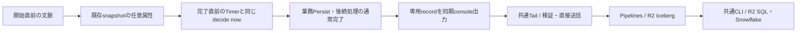

# Design Document — 麺揚げ遅延ログ

2026-09-12改訂。best-effortのconsole収集へ変更。[要件](requirements.md)、[共通設計](../operation-history-log/design.md)を参照。実装・配備は未着手。

## 分担と順序

本specは原時刻・開始文脈・完了相関・専用recordを所有する。TailからのPipelines直接送信、固定物理列、Iceberg、reader、品質とobserveはoperation-history-logへ委ねる。

operation単独の前段ローカル検証後に本specを実装し、本番合流は前段の実環境確認後とする。両recordの収集保証はbest-effort。業務のPersist成功はログ保存完了を意味しない。

## 構成

終端recordは一時的な値で、DOには保存しない。未配送outbox・イベント連番・配送状態・配送Alarm・受理API・台帳は作らない。TimerのAlarm調停やconstructor初期化を配送用に変更する必要もない。共通CLIは店舗DOへ問い合わせない。

## 原時刻とrecord

既存 `completeTimer` は対象Timerを除去し、紐づく品目に `completedAt = now` を記す。除去前のTimerから `adjustedEndTime(timer)` を取り、同じdecide nowとともにrecord候補を作る。

| 属性候補 | 内容 |
| --- | --- |
| recordType / payloadVersion | 既存OperationRecordと衝突しない識別子、形式版 |
| eventId / storeId / timerId | 終端の安定ID、DO自身の店舗identity、対象Timer |
| outcome | completed / cancelled |
| startedAt / dueAt / terminalAt | 開始時刻、操作直前の実効予定時刻、同じdecideのサーバnow |
| noodleType / firmness / slotIds | 終端直前の調理属性。スロット数は杯数ではない |
| startContext | 開始直前の事実、または理由付き不明 |
| completionAction | 検証済みの端末申告相関、欠如／不正の区別。取消は対象外 |

eventIdは `(storeId, timerId, outcome)` の衝突しないcanonical表現を候補にする。Timer IDは再利用しない。壁時計や永続連番からイベントidentityを作らない。記録の全順序・途中欠落の追跡は保証しない。

遅延は `terminalAt - dueAt` から導出し、原時刻と並ぶ別の正本にしない。負・0・正を保持し、長い正の外れ値も切り捨てない。取消に完了遅延を割り当てない。通信待ちを含む完了操作の代理値であり、実際の麺揚げ時刻や盛り付け終了は分離できない。

## 開始文脈の保持

**保持しない。開始の瞬間に1行出す（2026-09-16の変更）。**

旧案は開始文脈を業務snapshotの任意属性へ預け、完了時に終端recordへ引き継いでいた。預け先には key と value 合わせて 2 MB の上限があり、注文が多い店舗では既存の業務状態だけで大半を占める。足したせいで上限を超えれば put が失敗し、**厨房操作そのものが失敗する**。毎回のPersist直前に残余を測って避ける設計だったが、全体がbest-effortで落ちを許している以上、その1点のために厨房を止める形は割に合わない。

開始が確定したら、開始recordを同期consoleへ1回出す。終端では終端recordを出す。読み側が `(storeId, timerId)` で対応させる。業務snapshotの形式・版・Persist回数は一切変わらないので、容量判定も切り戻し検査も要らない。

| 開始record | 内容 |
| --- | --- |
| recordType / payloadVersion | 終端recordと別の識別子、形式版 |
| storeId / timerId / startedAt | 突き合わせの鍵と開始時刻 |
| source | 注文品目からの開始 / アドホック開始 |
| pendingBeforeStart / pendingOtherItems | 開始直前のpendingOrders全体と、対象自身を除いた数 |
| activeTimerCount / occupiedSlotCount | 開始直前の稼働数。杯数とは別 |
| shownPlacement | 永続shownPlan内の当該品目のstartAt・serveAt・mates数。無ければ理由付き不明 |
| appliedWait | 今回はnot-introduced |

計画対象の先頭64件に絞る前のpendingOrdersを使う。snapshot内group文字列を恒久的な調理群IDにしない。顧客情報・担当者identity・認証情報や計画全体のコピーを含めない。

**失うもの。** 開始recordが観測されなかった麺は、終端recordだけが残り文脈不明になる。旧案はそこだけを強くしていた。突き合わせ率を観測して、実データでどれだけ落ちるかを測る（要件9）。

## 一括完了の相関を持たない

**2026-09-16に不採用を決めた。** 端末が1回の押下につき相関IDを採番し、各 `complete` へ添える案だった。採らない理由は、情報の価値と確からしさが逆を向くからである。

- 注文由来の開始では、群の情報が開始recordの `shownPlacement`（提案の同群品目数）に既に在る。申告を足しても増える情報は「提案どおりにまとめたか」だけで、そのために wire の検証済み契約へ任意属性を通す価値が薄い。
- 手動ゆででは群という事実が無い。厨房は上がった順に上げるのであって、申告があっても何の群なのか解釈できない。

実データでの規模は測ってある（2026-09-16・本番の操作履歴31件）。完了の70%が1秒以内に他の完了と並んでいた。**この数字自体が推測である**——時刻が近いことは同一操作の証拠にならない。ゆえに、分析はTimer単位の件数で出し、独立した観測ではないと明示する。近接の件数は診断値として添えてよいが、標本の統合には使わない。

## 出力と失敗境界

`src/lift-delay/` をrecord型・pure導出・canonical codecの候補配置とする。shellは業務入力・直前Timer・文脈・同じnowを一時値として渡す。Persist成功と既存後続作用の通常完了後に、識別可能な専用console行を1回出す。既存OperationRecordの属性集合や出力順を変更しない。

| 事象 | 業務と記録の結果 |
| --- | --- |
| 文脈作成・サイズ評価失敗、今回の業務snapshotに残余なし | 任意キー全体を省略して元の業務snapshotを保存。文脈不明で業務を継続 |
| 相関属性不正 | 完了可能、相関不正としてrecord化 |
| 業務Persist失敗 | 従来どおり操作失敗、終端consoleなし |
| Persist後に後続作用が失敗／実行停止 | 業務は既存規律に従う。ログ欠落を許容 |
| record導出・直列化・console失敗 | 業務結果を変えず、記録を断念 |
| Tail未観測・send失敗・処理落ち | 業務影響なし、記録の自動回収なし |
| 同じ完了の再送がno-op | 新recordを作らず、失われたrecordも再生しない |

console出力は同期の失敗隔離境界に閉じる。DO側のwaitUntil、network、観測用Promise、再試行、配送bindingを追加しない。正常な業務例外を観測用catchへ巻き込まない。遅延の有効化は既存OPERATION_HISTORY_ENABLED／OBSERVE_DEBUGと独立に扱い、運用構成で導入状態を確認する。

Tail以降は [共通設計](../operation-history-log/design.md) の直接送信・固定列・エラー観測・合成プローブを再利用する。保証ラベルはbest-effortであり、業務確定済みという理由でcommitted保証を付けない。

## observeと統計

共通CLIのdataset lift-delayからstatus/export/summarizeする。店舗DOの状態GETや新しいread-only初期化は作らない。保存済み件数・最新時刻、Tail／Pipelinesエラー、監視coverage、専用合成行による経路確認を組み合わせる。

分布と分位点は同じTypeScriptの純粋関数で計算する。初期方式は中央値（偶数なら中央2値の平均）、p90（nearest-rankのceil(0.9*n)番）、最大・件数。区間は負、0、(0,5]秒、(5,15]秒、(15,30]秒、(30,60]秒、(60,120]秒、120秒超。日別timezoneは既定Asia/Tokyo。取消を完了標本から除外し、不明文脈・相関不足・競合は別欄にする。

標本0は分位点null。不正行や上限による部分取得はincomplete。eventId・内容一致で複製を除き、operationのcompletedと二重計数しない。二表を照合して一致しないものは「片側で未観測」であり、相手のrecordを生成して埋めない。両ログが有効な店舗・期間について、共通設計のM/O（観測したoperation completedに対する遅延completedの突合率）とM/L・片側件数を表示する。分母0はnull、無効化・未導入・部分取得は比較不能または暫定とする。invocationごとの両行欠落は検出できず、片側欠落も遅着・検証不正・上限超過等の原因を突合だけでは断定できない。

開始ログのみから現在の未完了数を確定できない。終端未観測は実際の未完了・ログ欠落・取得範囲外を含む。正確な全件欠落率や未配送件数は表示対象外で、0で埋めない。

収集エラー・監視不能の期間は統計採用を保留できる。繁忙時に欠落が偏る可能性を残し、外れ値処理で解消したとしない。manifestへ採用／除外・期間・方式版・原文の取得範囲を残す。追加0〜120秒の決定、App適用、店舗DOへの採用値保存は後続specとする。

## 正しさの性質と検証

- L1: dueAtとterminalAtが直前Timer・同じdecide nowに由来し、符号付き差を再現できる。
- L2: 文脈・相関・consoleの障害が厨房操作の新たな論理的拒否条件にならない。業務Persistの失敗規律は維持する。
- L3: 稼働Timerの文脈は毎回の実サイズに基づく残余内だけ保存し、収まらなければ元の業務snapshotに戻す。再起動と旧writerへの切戻しで業務版・復元規律を保ち、不明を捏造しない。
- L4: 配送状態・追加Alarm・観測用DO起動・networkがなく、欠落を後から再生したと偽らない。
- L5: 複製・二表JOIN・一括相関で標本数を増やさず、0件・不明・部分取得を区別する。

純粋導出とcodecのfixture、shellの失敗注入・snapshot互換・通常Alarmの回帰、共通Tailと両readerへの合成記録を組み合わせる。公開候補名は [命名規律](../../steering/naming.md) の実装前確認対象であり、spec改訂の停止条件ではない。

実装時の負荷証跡には1 invocationあたりの全console行数・総UTF-8 byte、遅延1行のbyte分布、切詰め有無、二表突合率を含める。両ログが有効な完了は通常2行になるので、一括完了・100 Timer・長い文脈を含むfixtureで計測する。生成予定の行数とTail受信行数を分け、Tail側の切詰め後の観測だけで元出力量を過小評価しない。
