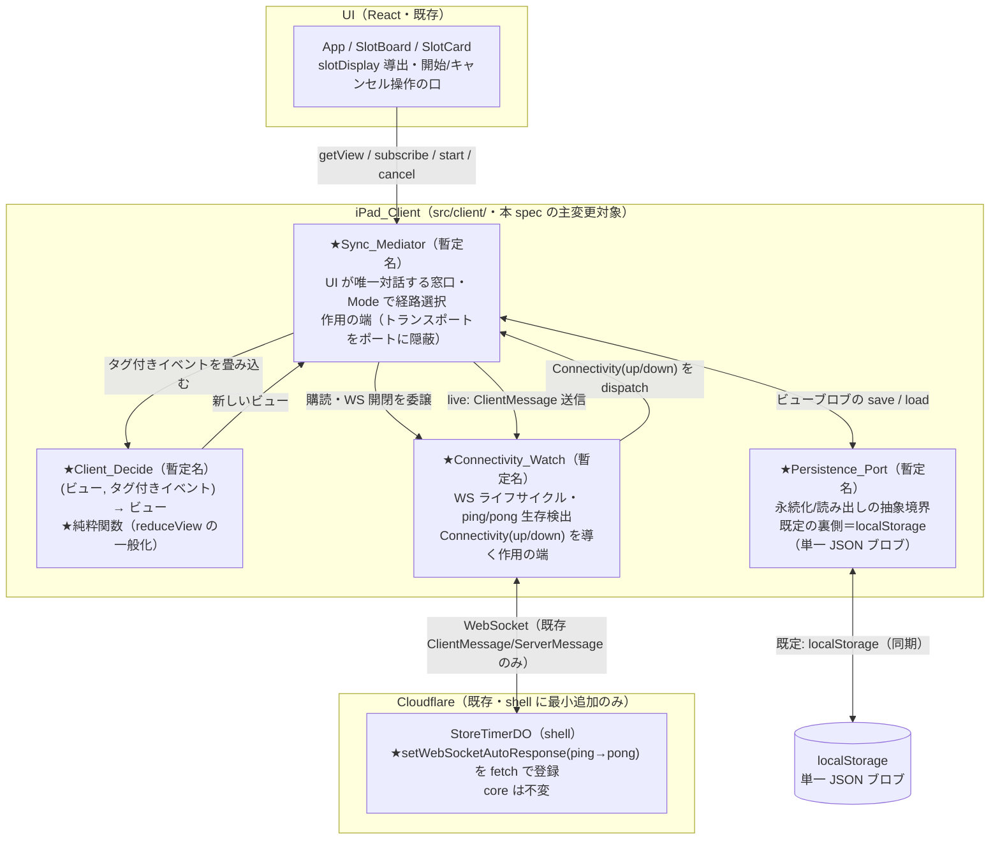
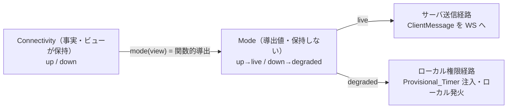
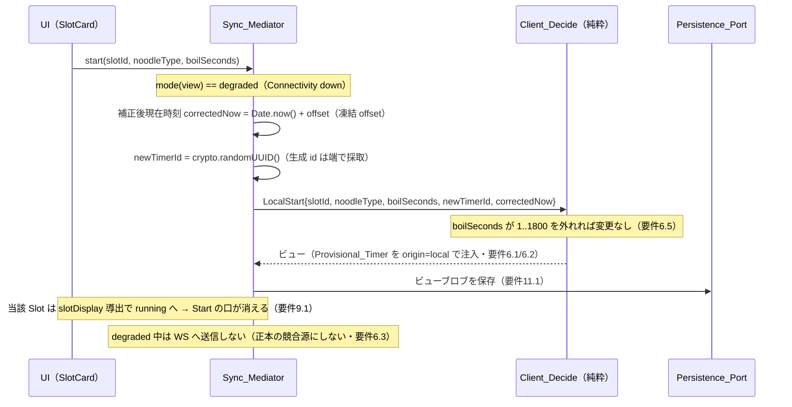
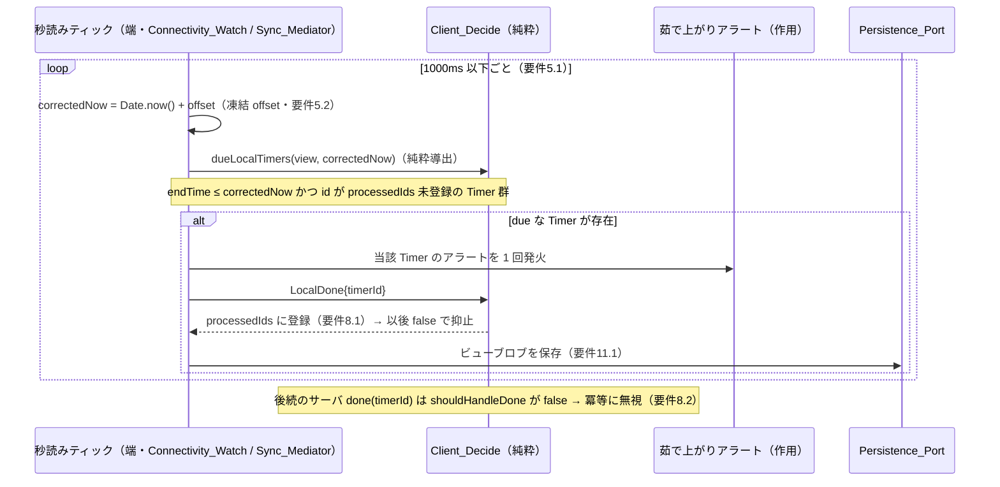
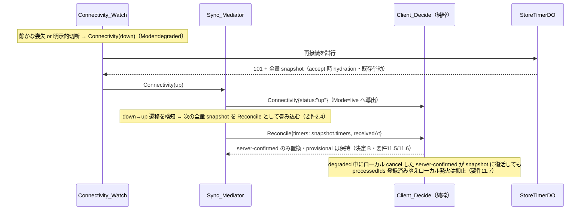

# 技術設計書 — オフライン劣化（offline-degradation）

## この設計が拠って立つもの

本設計は `requirements.md`（全13要件・EARS記法・決定 A / B 確定済み）と、ステアリング三点（`design-philosophy.md` / `naming.md` / `tooling.md`）を前提とする。設計判断はすべてこの二つから演繹される。本 spec は既存パイロット `yude-men-timer` の **iPad_Client（React フロント）** に「回線が落ちたときの優雅な劣化」を加える。狙いは「厨房スタッフへの善」——瞬断や回線喪失で表示が死なず、とりわけ**茹で上がりの取りこぼしを防ぐ**ことにある。

哲学を本機能の構造へ翻訳した骨格は次の7点である。本設計の全節はこの骨格の展開にすぎない。

1. **計算と作用の分離をクライアントへ徹底する** — 状態遷移を単一の純粋関数 `Client_Decide(現在ビュー, タグ付きイベント) → 新しいビュー` に集約する。WebSocket・DOM・時計・乱数・localStorage のいずれにも触れず、時刻・生成 id・受信時刻を**引数として**受け取る（要件4.1〜4.3）。これは既存 `src/client/connection.ts` の純粋畳み込み `reduceView` を、ServerMessage 以外のイベント（LocalCommand / Connectivity / LocalDone / Tick / Reconcile）へ一般化したものである。劣化ロジックの正しさは、この純粋層に対する property で機械検証できる。

2. **導出値を状態に昇格させない** — **Mode（live / degraded）は Connectivity から関数的に導出**し、独立した状態として保持しない（要件3.3）。残り秒も状態として持たず、`endTime`（事実）と補正後現在時刻からの導出に保つ（既存 `clock.ts` の思想を延長・要件5.1）。二つの真実の源を作らない。

3. **SSOT 規律を崩さない** — サーバ（Store_Timer_DO）の全量スナップショットが正本である。degraded 中のローカル操作で生まれる **Provisional_Timer は起源タグ付きの「未確定（unconfirmed）なローカル意図」**であって、正本の競合源にしない（要件12.4）。回線復帰時の Reconcile は server-confirmed のみを置き換え、provisional は保持する（決定 B・要件11.5）。

4. **core 不変・ワイヤ形式不変・shell は最小追加のみ** — `src/engine/` は一文字も変更しない。変更は `src/client/` 配下と、shell（`src/shell/store-timer-do.ts`）への**一点の追加 `setWebSocketAutoResponse`** に限る（要件12.1）。既存 `src/domain/messages.ts` の `ClientMessage` / `ServerMessage` のワイヤ形式のみを使い、新しいメッセージ種別やフィールドを足さない（要件12.2）。

5. **「待つなら寝かせる、抱えると漏れる」を heartbeats でも守る** — 到達性検出の ping/pong は **DO の auto-response 経路に限定**し、`webSocketMessage` ハンドラの起動や hibernate からの wake を伴わせない（要件1.5 / 12.3）。クライアント側に秒読み常駐ループを置く場合も、それが DO を wake させる通常メッセージを送らないことを保つ（要件1.6）。

6. **既存資産の延長・二重定義の根絶** — 残り秒のローカル導出（`clock.ts`）・通知の冪等性（`notification.ts` の `processedIds`）・担当射影（`assignment.ts`）・表示導出（`slotDisplay.ts`）・純粋畳み込み（`connection.ts` の `reduceView`）の思想をそのまま延長し、同じ概念を二度定義しない。ローカル茹で上がりの冪等性は、既存 `shouldHandleDone` / `markProcessed` 機構をそのまま使う。

7. **優雅な劣化＝厨房スタッフへの善** — 失敗は優雅に劣化する。回線が落ちても表示は死なず（endTime のローカル計算）、走行中タイマーはリロードを生き延び（永続化＋再水和）、**茹で上がりは回線状態に関わらずローカルで必ず一度鳴る**（要件8）。回復経路は再接続時の全量 Hydration が回収する。

---

## Overview

### 目的

回線が Store_Timer_DO へ到達できない区間に限り、iPad_Client が自身の担当スロットに対する**一時的なローカル権限（temporary local authority）**として振る舞い、回線復帰後はサーバ全量スナップショットへ追随し直す「劣化運用（degraded operation）」を定義する。土台として **PWA（Service Worker による App Shell キャッシュ＋状態の永続化・再水和）** を導入し、オフライン中のリロード／再起動後も走行中タイマーが復元され、茹で上がりが鳴り続けることを担保する。

### スコープ

「劣化運用」と「最善努力での再参加（best-effort rejoin）」に限る。

### スコープ外（要件で確定済み）

- **再整合／DO への耐久的な書き戻し（write-back / reconciliation）** — オフライン中のローカル操作（start / cancel）を回線復帰時に正本へ確定させる処理は将来フェーズ。本 spec のローカル操作は耐久化されず最善努力にとどまる（要件12.5）。
- **クロスデバイスのダブルブッキング防止** — オフライン中は共有された真実が存在しないため防止不能であり、受容される限界とする。新たなサーバ側ルールを追加しない（要件9.3）。
- **サーバ core（`src/engine/`）の変更** — 一切行わない（要件12.1）。
- 認証認可の作り込み・マルチテナント・IndexedDB・Background Sync。

### 対象デバイスと制約（正直な限界）

対象は iPad Safari / standalone PWA。iOS の制約を前提に設計する。

- **Background Sync 不可** — Service Worker によるバックグラウンド再送は行わない（要件11.4）。
- **`beforeunload` 不可信** — これに依存した保存をしない。永続化はビュー変化のたびに同期的に行う（要件11.1）。
- **リロードを生き延びる真の担保**は、リロード抑止 UI ではなく App_Shell キャッシュ＋永続化＋再水和にある（決定 A・要件10.5）。
- **OS による稀な eviction / 強制終了の裾は受容する**（決定 A）。

---

## Architecture

### クライアント四層構成（作用を端へ隔離し、純粋な核をテスト可能に保つ）

要件4 は「計算と作用の分離に沿った層構成を持ち、UI が単一の窓口とのみ対話する」ことを求める。これを次の四層として構造化する。`★` が本 spec で新規に書く／一般化するもの。



- **Client_Decide（純粋・PoA の核）** — 唯一の状態遷移。タグ付きイベント列をビューへ畳み込む決定的関数。時刻・生成 id・受信時刻は引数。WS / DOM / 時計 / 乱数 / localStorage に一切触れない（要件4.1〜4.3）。
- **Connectivity_Watch（作用の端）** — WebSocket のライフサイクルを所有し、同一 WS 上の auto-response ping/pong と close / error を観測して Connectivity(up/down) を導く。秒読みのための常駐ループはビューを変えない（要件4.6）。
- **Sync_Mediator（作用の端・UI の唯一の窓口）** — UI のインテント（start / cancel / 購読 / ビュー取得）を受け、現在の Mode で経路選択する。トランスポート（WS / DO）を**ポートの背後に隠す**（既存 `Socket` / `SocketOpener` 注入の継ぎ目を再利用）。Connectivity が down→up へ遷移したとき Reconcile を契機づける（要件4.4 / 4.5）。
- **Persistence_Port（作用の端）** — 永続化・読み出しの抽象境界。既定の裏側実装は localStorage。単一 JSON ブロブをページ内同期で読み書きする（要件4.7 / 11）。

> **なぜ Sync_Mediator が「唯一の窓口」か:** UI が Client_Decide・Connectivity_Watch・Persistence_Port を直接束ねると、Mode による経路選択ロジックが UI へ漏れ、劣化運用が差し替え不能になる。窓口を一点に絞ることで、UI は「getView / subscribe / start / cancel」だけを知り、live / degraded の振り分けは Sync_Mediator の内部に閉じる（要件4.4）。これは既存 `TimerConnection` インターフェース（`getView` / `subscribe` / `start` / `cancel` / `close`）の自然な拡張であり、新しい窓口型を発明しない。

### Mode はビューの導出値（状態に昇格させない）



ビューが保持する「事実」は Connectivity（up / down）であり、Mode はその関数 `mode(view) = view.connectivity === "up" ? "live" : "degraded"` として参照のたびに導出する（要件3.1〜3.3）。Mode を独立フィールドに持つと二つの真実の源になり、必ずズレる。

#### 設計上の確定判断（degraded の入り口と再同期機構）

検討の結果、次の二点を確定する。いずれも「導出値を状態に昇格させない」「SSOT 規律を崩さない」骨格の直接の帰結である。

- **(a) 本番に手動「強制 degraded」操作を設けない。** degraded への遷移は Connectivity 検知（要件3 / 14.5）を**唯一の経路**とする。手動のモード切替を本番に置くと、Mode が再び保存状態として復活し、オンライン中に意図的な乖離（voluntary divergence）を生んで SSOT が壊れる——よって**却下**する。degraded に関わる本番のアフォーダンスは、(1) 視認可能なモードインジケータ（要件3.4）と、(2) degraded 時の「再接続 / 再同期（reconnect/resync）」アクション——いずれも**真実へ向かって押す（push toward truth）**もの——に限る。なお dev/test 限定の ping blackhole（要件14・後述）は「手動 degraded」ではない。Mode を書き換えず、本物の silent-loss 検知経路を通して degraded に入る点で、この判断と矛盾しない。
- **(b) 再接続 + 全量スナップショット水和そのものが再同期 / 収束機構である。** 接続（再接続を含む）のたびにサーバは全量スナップショットを届け、クライアントをサーバ真実へ収束させる（既存 hydration 挙動・要件2.2 / 11.5）。したがって別系統の REST / リロードによる「最新状態」取得のヘッジは**不要**である。加えて本 DO 中心設計では REST 経路も**同じ DO** に終端するため、独立した耐障害性を一切もたらさない。定期ポーリングは hibernation を殺すため**却下**する。（`focus` / `visibilitychange` 契機の再水和は、ユーザー復帰時にのみ DO を wake させる軽量ヘッジとして許容しうるが、要件ではなく**選択肢**に留める。）

### データフロー（degraded 中のローカル start＝楽観的 Provisional_Timer）



### データフロー（degraded 中のローカル茹で上がり発火＝安全要）



### データフロー（再接続時の Reconcile＝決定 B：provisional を消さない）



### 確認した Cloudflare の事実（auto-response ＝ shell の唯一の変更点）

- **`state.setWebSocketAutoResponse(new WebSocketRequestResponsePair(request, response))`** — DurableObjectState 上に**所定の ping 要求文字列に対し所定の pong 応答文字列を自動返信する**ペアを登録する。auto-response は**ランタイムが直接応答**するため、`webSocketMessage` ハンドラを起動せず、hibernate からの wake を伴わない（要件1.5・hibernation 互換を保つ・要件12.3）。これは「待つなら寝かせる」規律と完全に整合する——心拍が課金とリソースを浪費しない。
- **登録位置** — 既存 `fetch()` の `this.ctx.acceptWebSocket(server)` の直後（snapshot 送信の前後どちらでもよいが、accept 直後に置く）。これが shell への**唯一の追加**であり、`webSocketMessage` / `webSocketClose` / `alarm` / core には一切触れない。
- **観測ハーネスでの確認余地** — `hibernation-observability` の計装は、ping に対して `webSocketMessage`（broadcast 等の継ぎ目）が**発火しない**ことを観測できる（auto-response は継ぎ目を通らない）。
- **`ctx.getWebSockets()` は auto-response 越しに接続を維持する** — ping/pong は接続を生かし続けるだけで、サーバ状態を一切変えない。

---

## Components and Interfaces

> 本節は型シグネチャで責務境界を定める。**ここに現れる公開シンボル名（純粋遷移関数名・モード名・イベント種別名・Sync_Mediator / Persistence_Port / Connectivity_Watch のシンボル名・ping/pong 文字列・localStorage キー・起源タグの値・Provisional_Timer 型名）はすべて暫定であり、実装前にユーザー確認を要する**（命名規律）。確認用の候補・概念境界・ドメイン語彙との対応は末尾「公開シンボル命名の確認」節にまとめる。`Manager` / `Service` / `Handler` / `Util` 等の汎用語は用いない。

### ディレクトリ配置（core 不変・client 限定・shell 一点）

要件12.1 を構造として明示するため、次の配置とする。

| 置き場所 | 内容 | 純度 | 理由 |
| --- | --- | --- | --- |
| `src/client/connection.ts`（既存を一般化） | `Client_Decide`（`reduceView` の一般化）・`ClientView`・イベント型・`Sync_Mediator`（`openTimerConnection` の拡張） | 純粋（decide）＋端（mediator） | 既存の純粋畳み込みと作用の端の二層構造をそのまま延長する。新ファイルを増やさず、既存の継ぎ目（`Socket` / `SocketOpener`）を再利用する。 |
| `src/client/clock.ts`（既存・不変） | `clockOffset` / `correctedNow` / `remainingMs` | 純粋 | degraded 中の残り導出・補正後現在時刻はこの既存純粋関数をそのまま使う（二重定義しない）。 |
| `src/client/notification.ts`（既存・不変） | `shouldHandleDone` / `markProcessed` | 純粋 | ローカル茹で上がりの冪等性・後続サーバ done の抑止は既存機構をそのまま使う。 |
| `src/client/connectivity.ts`（新規） | `Connectivity_Watch`（WS 生存検出の端）・ping/pong 定数・閾値 | 端（I/O） | 到達性検出という作用を一点に隔離。WS 開閉・タイマー・ミス計数はここに閉じる。 |
| `src/client/persistence.ts`（新規） | `Persistence_Port`・ビューブロブ codec・localStorage 裏側実装 | codec は純粋＋IO は端 | 永続化の抽象境界。ブロブの直列化／解析は純粋（round-trip を property で検証）、localStorage IO は端。 |
| `src/client/components/slotDisplay.ts`（既存を拡張） | `SlotDisplay` の `running` に未確定フラグを追加 | 純粋 | Provisional_Timer を未確定表示で区別する（要件6.4）。既存の表示導出を最小拡張する。 |
| `src/shell/store-timer-do.ts`（既存に一点追加） | `setWebSocketAutoResponse(ping→pong)` の登録 | 端 | shell への唯一の追加（要件12.1）。core を呼ばない・既存 Effect 順序を変えない。 |
| `tests/client/`（追加） | 上記純粋層の property / example、端の統合テスト | — | 既存 `tests/client` 規約に従う。 |

### Client_Decide（純粋・本機能の状態遷移の核）

既存 `reduceView(view, message, receivedAt)` を、ServerMessage 以外のイベントへ一般化する。**唯一の純粋遷移**であり、`(ビュー, タグ付きイベント) → 新しいビュー` の形を保つ（要件4.1）。

```ts
// src/client/connection.ts — 純粋。WS/DOM/時計/乱数/localStorage に触れない。
// 時刻・生成 id・受信時刻はすべて引数で受け取る（要件4.3）。

/** Connectivity — 到達可能性の事実（ビューが保持する）。Mode はこれから導出する。 */
type Connectivity = "up" | "down";

/** Mode — Connectivity からの導出値。状態として保持しない（要件3.3）。 */
type Mode = "live" | "degraded";

/** 起源タグ — server-confirmed と Provisional_Timer（unconfirmed）を区別する。 */
type TimerOrigin = "server" | "local";

/** クライアントが保持する Timer。WireTimer に起源タグを足したもの（ワイヤ形式は不変・要件12.2）。 */
interface ClientTimer {
  readonly id: string;
  readonly slotId: string;
  readonly noodleType: string;
  readonly endTime: number;       // エポックミリ秒（事実）。残り秒は導出（clock.ts）。
  readonly origin: TimerOrigin;   // "local" = Provisional_Timer（未確定）
}

/** 受信ビュー — クライアントが保持する事実の集合（残り秒・Mode のような導出値は持たない）。 */
interface ClientView {
  readonly timers: readonly ClientTimer[];      // server-confirmed ＋ provisional（起源タグ付き）
  readonly offset: number;                       // クロックオフセット。degraded 中は最新値を凍結（要件5.2）
  readonly processedIds: ReadonlySet<string>;    // 茹で上がり/キャンセル処理済み（表示制御用・SSOT のコピーではない）
  readonly connectivity: Connectivity;           // 到達性の事実。Mode の導出元
  readonly sync: SyncPhase;                       // connecting / synced / syncFailed（既存）
  readonly error: { readonly code: string; readonly message: string } | null;
}

/** タグ付きイベント — Client_Decide が網羅的に分岐する 6 系統（要件4.2）。 */
type ClientEvent =
  | { readonly kind: "Server"; readonly message: ServerMessage; readonly receivedAt: number }      // 既存 reduceView 相当
  | { readonly kind: "LocalStart"; readonly slotId: string; readonly noodleType: string;
      readonly boilSeconds: number; readonly newTimerId: string; readonly correctedNow: number }    // 要件6
  | { readonly kind: "LocalCancel"; readonly timerId: string }                                      // 要件7
  | { readonly kind: "Connectivity"; readonly status: Connectivity }                                 // 要件2/3
  | { readonly kind: "LocalDone"; readonly timerId: string }                                         // 要件8
  | { readonly kind: "Tick" }                                                                         // 要件5（ビュー不変）
  | { readonly kind: "Reconcile"; readonly timers: readonly WireTimer[]; readonly receivedAt: number }; // 要件11（決定 B）

/** 唯一の純粋遷移。(ビュー, イベント) → ビュー。同じ入力に同じ出力。 */
function decideView(view: ClientView, event: ClientEvent): ClientView;

/** Mode は導出値。参照のたびに Connectivity から関数的に求める（要件3.1〜3.3）。 */
function mode(view: ClientView): Mode;

/** degraded 中のローカル発火対象を導出する純粋関数（端が毎ティック呼ぶ・要件8.1）。 */
//  endTime ≤ correctedNow かつ id が processedIds 未登録の Timer 群（server / local 双方）。
function dueLocalTimers(view: ClientView, correctedNow: number): readonly ClientTimer[];
```

各イベントの遷移規律（既存 `reduceView` の思想を延長する）:

| イベント | 遷移 | 要件 |
| --- | --- | --- |
| `Server: snapshot` | server-confirmed を全置換しつつ provisional は保持（`reconcileServerConfirmed` を共有）。offset 再確立。processedIds を「snapshot の id ∪ 保持 provisional の id」へ刈り取り | 11.5, 11.6, 11.7 |
| `Server: started` | 当該 server Timer を追加/置換（同一 id は最新へ）。offset 再確立 | （live 経路） |
| `Server: cancelled` | `shouldHandleDone` が true のときのみ当該 Timer 除去＋`markProcessed`。除去済みは冪等に無視 | 8.2 相当 |
| `Server: done` | `shouldHandleDone` が true のときのみ `markProcessed`（茹で上がり表示は processedIds 所属から導出）。処理済みは冪等に無視 | 8.2 |
| `Server: error` | error をセット | — |
| `LocalStart` | boilSeconds が 1..1800 内なら `endTime = correctedNow + boilSeconds*1000` の Provisional_Timer（origin=local）を 1 件注入。範囲外なら変更なし | 6.1, 6.2, 6.5 |
| `LocalCancel` | 対象が origin=local → 除去のみ。origin=server → 除去＋`markProcessed`（ローカル発火抑止） | 7.1, 7.2 |
| `Connectivity` | `connectivity` をセット（Mode 導出が追随）。offset は変えない（凍結を維持） | 2.1, 2.2, 3.1, 3.2 |
| `LocalDone` | `shouldHandleDone` が true のときのみ `markProcessed`（端が音を鳴らした分を記録） | 8.1, 8.2 |
| `Tick` | ビュー不変（参照同一を返す）。再描画で残りを導出し直させるだけ | 5.1 |
| `Reconcile` | `snapshot` と同一の `reconcileServerConfirmed` を適用（server-confirmed のみ置換・provisional 保持） | 11.5, 11.6, 11.7 |

> **なぜローカル茹で上がりの「音」は Client_Decide に無いのか（計算と作用の分離）:** Client_Decide は `(ビュー, イベント) → ビュー` の純粋関数であり、アラート音という作用を持てない。端（Sync_Mediator / Connectivity_Watch の秒読みティック）が `dueLocalTimers` で発火対象を導出し、音を鳴らし、続けて `LocalDone` を dispatch する。Client_Decide は `LocalDone` を `shouldHandleDone` / `markProcessed` で畳み込み、各 timerId を**高々 1 回だけ**処理済みにする。これは既存のサーバ done と同一の冪等機構であり、ローカル発火と後続サーバ done の二重鳴動を構造的に防ぐ（要件8.1 / 8.2）。「音」は `shouldHandleDone` が true を返した分岐の端でのみ起こす。

> **なぜ `snapshot` と `Reconcile` が同一規律を共有するか（重複の根絶）:** 両者の view 変換はともに「server-confirmed を置換し provisional を保持する」一つの規律 `reconcileServerConfirmed` である。初回 hydration（provisional 空）では全置換に縮退し、再接続では provisional 保持として働く——振る舞いに差はなく、**occasion（契機）だけが異なる**。`snapshot` は live / 初回の契機、`Reconcile` は down→up 遷移後の契機。規律を一箇所に定義することで、二つの真実を作らない（決定 B・要件11.5）。

### Sync_Mediator（作用の端・UI の唯一の窓口）

既存 `TimerConnection`（`getView` / `subscribe` / `start` / `cancel` / `close`）を拡張する。UI インテントを Mode で経路選択し、トランスポートをポートの背後に隠す（要件4.4 / 4.5）。

```ts
// src/client/connection.ts — 端。Mode 経路選択・購読・永続化の配線。判定は Client_Decide に委ねる。

interface SyncMediator {
  /** 現在ビューを取得する（残り導出・slotDisplay の元）。 */
  getView(): ClientView;
  /** ビュー更新（受信・接続性変化・ティック）を購読する。戻り値で解除。 */
  subscribe(listener: () => void): () => void;
  /** 開始操作。live: ClientMessage を WS 送信。degraded: LocalStart を Client_Decide へ（要件4.5/6.1）。 */
  start(slotId: string, noodleType: string, boilSeconds: number): void;
  /** キャンセル操作。live: ClientMessage 送信。degraded: LocalCancel を Client_Decide へ（要件4.5/7）。 */
  cancel(timerId: string): void;
  /** 接続・ティック・永続購読を停止する。 */
  close(): void;
}

interface SyncMediatorOptions {
  readonly url: string;
  readonly now?: () => number;                 // 既定 Date.now（補正後現在時刻・受信時刻の採取）
  readonly newId?: () => string;               // 既定 crypto.randomUUID（Provisional_Timer の id 生成）
  readonly openSocket?: SocketOpener;          // 既存の注入継ぎ目を再利用（トランスポートのポート）
  readonly persistence?: PersistencePort;      // 既定 localStorage 裏側（要件4.7）
  readonly connectivity?: ConnectivityWatchFactory; // 既定 WS 生存検出（要件1/2）
  readonly tickMs?: number;                    // 残り再算出・ローカル発火判定の間隔。既定 1000（≤1000・要件5.1）
}

/** Sync_Mediator を生成する。boot 時に Persistence_Port から同期再水和してから接続する（要件11.2）。 */
function openSyncMediator(options: SyncMediatorOptions): SyncMediator;
```

Sync_Mediator が担う端の責務（純粋判定は持たない）:

- **経路選択** — `start` / `cancel` を受けると `mode(view)` を見て、live なら `Socket.send(ClientMessage)`、degraded なら補正後現在時刻と生成 id を採取して `LocalStart` / `LocalCancel` を `decideView` へ畳み込む（要件4.5）。
- **Reconcile の契機づけ** — Connectivity_Watch から `up` を受け、直前が `down` だった（down→up 遷移）なら、次に届く全量 snapshot を `Reconcile` イベントとして畳み込む（要件2.4）。
- **秒読みティック＋ローカル発火** — `tickMs`（≤1000ms）ごとに `dueLocalTimers(view, Date.now()+offset)` を導出し、各対象のアラートを鳴らして `LocalDone` を dispatch する（要件5.1 / 8.1）。ティック自体は `Tick` でビューを変えず再描画を促す。**この常駐ループは DO を wake させる通常メッセージを送らない**（heartbeats は auto-response 経路に限る・要件1.6）。
- **永続化** — ビューが変化するたび（タイマー追加・除去・offset 更新・processedIds 更新）に `Persistence_Port.save(view)` を呼ぶ（要件11.1）。

### Connectivity_Watch（作用の端・到達性検出）

同一 WS 上の auto-response ping/pong と、close / error を観測して Connectivity(up/down) を導く。二段階（明示的切断と静かな喪失）を独立に扱う（要件1 / 2）。

```ts
// src/client/connectivity.ts — 端。WS 生存検出のみ。ビュー決定はしない（要件4.6）。

/** 所定の ping 要求文字列 / pong 応答文字列（暫定値・確認対象）。auto-response と一致させる。 */
const PING_REQUEST = "ping" as const;   // 暫定
const PONG_RESPONSE = "pong" as const;  // 暫定

/** ping 送信間隔の上限（要件1.2）。 */
const PING_INTERVAL_MS = 15_000;
/** pong 待ち受けタイムアウト（要件1.4）。 */
const PONG_TIMEOUT_MS = 10_000;
/** 静かな喪失と確定する連続未応答回数（要件1.4）。 */
const SILENT_LOSS_MISSES = 2;

interface ConnectivityWatch {
  /** Connectivity の確定（up/down）を購読する。 */
  readonly onConnectivity: (handler: (status: Connectivity) => void) => void;
  /** live 経路の ClientMessage を WS へ送る（Sync_Mediator が経路選択して呼ぶ）。 */
  readonly send: (message: ClientMessage) => void;
  /** 受信した ServerMessage を購読する（Sync_Mediator が Client_Decide へ畳み込む）。 */
  readonly onServerMessage: (handler: (message: ServerMessage, receivedAt: number) => void) => void;
  readonly close: () => void;
}

type ConnectivityWatchFactory = (url: string, openSocket: SocketOpener, now: () => number) => ConnectivityWatch;

/** 既定の生存検出。WebSocket を開き、ping/pong と close/error から Connectivity を導く。 */
function watchConnectivity(url: string, openSocket: SocketOpener, now: () => number): ConnectivityWatch;
```

Connectivity 確定規律（二系統を独立に扱い、いずれか一方の成立で down・要件2.3）:

| 契機 | 確定 | 要件 |
| --- | --- | --- |
| WS open ＋ 全量 snapshot 受信 | `up` | 2.2 |
| pong 受信 | `up` | 1.3 |
| ping 送信後 `PONG_TIMEOUT_MS` 以内に pong 無しが `SILENT_LOSS_MISSES` 回連続（静かな喪失） | `down` | 1.4 |
| WS close / error（明示的切断） | `down` | 2.1 |

> **二段階検出の理由（厨房スタッフへの善）:** ソケットが明示的に閉じる（close/error）場合だけでなく、無応答で静かに半死（half-open）になる場合もある。auto-response ping/pong の連続未応答を独立系統として持つことで、後者でも速やかに degraded へ切り替えられ、表示と茹で上がりが死なない（要件2.3）。

### デバッグ用フォルトインジェクション（ping blackhole・dev 限定・要件14）

回線を物理的に切らずに「静かな喪失（half-open）」を再現する dev/test 限定の検証足場。**既存のトランスポート注入継ぎ目（`SocketOpener` / `ConnectivityWatchFactory`）の上に被せる薄いデコレータ**として実装し、**送信される ping フレームのみを破棄（blackhole）する**。通常メッセージの送信・あらゆる受信は一切素通しする（ping-only・要件14.1）。

```ts
// src/client/connectivity.ts（dev/test 限定・本番バンドルから除外）— 端の薄いデコレータ。
// 送信 ping のみ捨てる。通常メッセージ・受信は素通し。Mode は書き換えない（要件14.1/14.5）。
// ※ トグルのトークン / フラグ名は公開シンボルであり命名確認を要する（暫定）。

/** 送信 ping だけを捨てる SocketOpener デコレータ。isEnabled() が true の間だけ blackhole。 */
function withPingBlackhole(inner: SocketOpener, isEnabled: () => boolean): SocketOpener;
//  返す Socket の send は:
//    - message === PING_REQUEST かつ isEnabled() のとき: 何もしない（相手へ届けない）
//    - それ以外: inner の send へ委譲（通常メッセージは素通し）
//  受信（onmessage）・close/error の観測経路は inner のまま一切変えない。
```

振る舞いと規律:

- **本物の検知経路を通って degraded に入る** — ping が相手に届かない → pong が返らない → 要件1.4 の silent-loss（`PONG_TIMEOUT_MS` × `SILENT_LOSS_MISSES`）が**そのまま**発火 → Connectivity を `down` 確定 → degraded。**Mode を直接書き換えない**。モードは依然 Connectivity からの導出値のまま（要件14.2 / 14.5）。
- **ランタイムで可逆** — `isEnabled()` を false に戻すと ping 送信が再開 → pong 受信 → Connectivity `up` 復帰 → down→up 遷移で Reconcile を契機づける（要件14.3 / 2.4）。
- **dev/test 限定** — デバッグフラグ（`OBSERVE_DEBUG` と同じ規律）でゲートし、本番のユーザー向け UI に切替手段を出さない。`import.meta.env.DEV` 分岐で本番バンドルから tree-shaking 除外する（要件14.4）。
- **トグル名は要確認** — `withPingBlackhole` および切替トークン / フラグ名は公開シンボルであり、実装前に命名確認を要する（暫定）。

> **一つのスイッチでライフサイクル全体を動かす（検証の善）。** この足場は degraded → ローカル権限（Provisional_Timer・ローカル発火）→ 再接続 → provisional 保持（決定 B）までの一連を、回線を物理的に触らずに再現できる。さらに `hibernation-observability` の計装ハーネスと併用すれば、blackhole 中の ping が（auto-response 経路ゆえ）DO を wake させないことも同時に裏取りできる（要件1.5 / 12.3）。


### Persistence_Port（作用の端・抽象境界 ＋ 純粋 codec）

状態の永続化と読み出しの抽象境界。既定の裏側は localStorage。ブロブの直列化／解析は純粋関数として分離し、round-trip を property で検証する（要件11）。

```ts
// src/client/persistence.ts — 抽象境界（端）＋ codec（純粋）。

interface PersistencePort {
  /** ビューを単一 JSON ブロブとして保存する（要件11.1）。 */
  readonly save: (view: ClientView) => void;
  /** 保存済みブロブを同期的に読み出してビューへ再水和する。無ければ EMPTY_VIEW（要件11.2）。 */
  readonly load: () => ClientView;
}

/** localStorage の保存キー（暫定値・確認対象）。 */
const STORAGE_KEY = "yudemen.offline.view.v1" as const; // 暫定

/** 永続ブロブの形（version 付き・要件11.1）。Set は配列へ、Connectivity/sync/error は永続しない。 */
interface PersistedView {
  readonly version: 1;
  readonly timers: readonly ClientTimer[];   // server-confirmed ＋ provisional（起源タグ込み）
  readonly offset: number;
  readonly processedIds: readonly string[];
}

/** ビュー → ブロブ文字列（純粋）。処理制御外の導出フィールドは含めない。 */
function serializeView(view: ClientView): string;
/** ブロブ文字列 → ビュー（純粋）。不正・不在は EMPTY_VIEW を返す。connectivity は boot 時 "down" 起点。 */
function parsePersistedView(raw: string | null): ClientView;

/** 既定の localStorage 裏側実装。save は同期書き込み、load はページ内同期読み出し（要件11.2/11.4）。 */
function localStoragePersistence(): PersistencePort;
```

> **なぜ Connectivity / sync / error を永続しないか:** これらは「今この瞬間の接続の事実」であって、リロードを跨いで持ち越す事実ではない。boot 時は接続未確立ゆえ Connectivity を `down`（＝degraded）起点とし、Connectivity_Watch の検出で `up` へ確定させる。永続するのは「これ以上分解できない事実」——timers（起源タグ込み）・offset・processedIds——に絞る（導出値・一過性の状態を永続に昇格させない）。

### Shell への唯一の追加（`setWebSocketAutoResponse`）

既存 `src/shell/store-timer-do.ts` の `fetch()` の `this.ctx.acceptWebSocket(server)` 直後に、auto-response ペアを登録する。**これが shell への唯一の変更**であり、core・既存 Effect 順序・hibernation 互換を一切変えない（要件1.1 / 12.1 / 12.3）。

```ts
// src/shell/store-timer-do.ts の fetch() 内（既存コードへの最小追加・擬似）
const pair = new WebSocketPair();
const client = pair[0];
const server = pair[1];

this.ctx.acceptWebSocket(server);

// ★追加（要件1.1）: 所定の ping 要求に所定の pong を auto-response する。
// ランタイムが直接応答するため webSocketMessage を起動せず、hibernate からの wake を伴わない
// （要件1.5 / 12.3）。心拍は接続を生かすだけで Working_Copy も Effect 順序も一切変えない。
this.ctx.setWebSocketAutoResponse(new WebSocketRequestResponsePair(PING_REQUEST, PONG_RESPONSE));

// 以降は既存のまま: 収容直後に全量 snapshot を当該 WS へ送る（accept 時 hydration・要件2.2 の up 契機）。
const snapshot: ServerMessage = { type: "snapshot", serverTime: Date.now(), timers: /* ... */ [] };
server.send(JSON.stringify(snapshot));
return new Response(null, { status: 101, webSocket: client });
```

> **ping 要求文字列は client / shell で同一の確定値でなければならない。** クライアント（`Connectivity_Watch`）が送る `PING_REQUEST` と、shell が登録する auto-response の request 文字列は一致が前提。両者は同じ公開シンボル（確認対象）を共有する。`hibernation-observability` のハーネスは、ping に対し `webSocketMessage`（broadcast 等）の継ぎ目が**発火しない**ことを観測でき、要件1.5 / 12.3 の「wake させない」を裏取りできる。

---

## Data Models

クライアントが保持する事実は前掲 `ClientView` に集約される。残り秒・Mode のような導出値は含めない。

### Provisional_Timer（起源タグ付きの未確定なローカル意図）

`ClientTimer` のうち `origin === "local"` のものが **Provisional_Timer** である。クライアント生成 id とクライアント算出 endTime（`correctedNow + boilSeconds*1000`）を持ち、server-confirmed Timer（`origin === "server"`）と起源タグで区別される。

- **未確定表示** — `slotDisplay.ts` の `running` 表示に `unconfirmed: boolean`（`origin === "local"` から導出）を加え、視覚的に区別する（要件6.4）。
- **正本の競合源にしない** — degraded 中は WS へ送らず（要件6.3）、Reconcile でも消さず保持する（決定 B・要件11.6）。書き戻しはスコープ外（要件12.5）。

```ts
// src/client/components/slotDisplay.ts への最小拡張（既存 SlotDisplay の running に未確定フラグ）
type SlotDisplay =
  | { readonly kind: "running"; readonly slot: number; readonly timer: WireTimer;
      readonly remainingMs: number; readonly unconfirmed: boolean } // ★unconfirmed 追加（要件6.4）
  | { readonly kind: "boiled"; readonly slot: number }
  | { readonly kind: "idle"; readonly slot: number }
  | { readonly kind: "unreceived"; readonly slot: number };
```

### ダブルブッキングの構造的 UI ゲート（最善努力）

Provisional_Timer が当該 Slot に注入されると、`assignedSlotDisplays` の導出で当該 Slot は `running` になる。既存 `SlotCard` は **`idle` / `boiled` のときだけ Start の口を描画**するため、走行中（`running`）の Slot には Start が現れない。これにより**同一デバイス上の再起動が構造的に防がれる**——新たなサーバルールも新たな状態も足さず、既存の表示ゲートがそのまま効く（要件9.1 / 9.2）。クロスデバイスはオフラインでは防止不能であり受容する（要件9.3）。

### 永続ブロブ（単一 JSON・version 付き）

前掲 `PersistedView`。`timers`（起源タグ込み）・`offset`・`processedIds`（配列）・`version` を単一キー `STORAGE_KEY` に丸ごと保存する。サイズは最大 100 件規模でも数十 KB 未満であり localStorage で十分。`processedIds` は再接続時の snapshot 全置換で刈り取られるため有界に保たれる（既存 `reduceView` の刈り取り規律を延長・要件11.5）。

### クロックオフセットの凍結（degraded 中）

degraded 中は新規 `serverTime` を受け取れないため、接続中に確立した最新 `offset` を**凍結して使い続ける**（要件5.2）。補正後現在時刻 `correctedNow = Date.now() + offset` は既存 `clock.ts` の `correctedNow` をそのまま使い、残り `remainingMs(endTime, offset, now)` は 0 でクランプ済み（要件5.3）。新しい概念を足さない。

---

## Correctness Properties

*プロパティとは、システムのあらゆる正当な実行において成り立つべき特性・振る舞いであり、システムが何をすべきかについての形式的な言明である。プロパティは、人間が読む仕様と、機械が検証できる正しさの保証との橋渡しをする。*

本機能は Property-Based Testing（PBT）が**強く適合**する。理由は明確である——劣化運用の核心である `Client_Decide`（純粋遷移）と、その導出ヘルパ（`mode` / `dueLocalTimers` / 残り導出 / 永続ブロブ codec）は、いずれも **WS も DOM も時計も乱数も localStorage も持たない決定的な純粋関数**だからである。時刻・生成 id・受信時刻はすべて引数で渡るため（要件4.3 / 13.4）、生成器が吐く大量のイベント列・ビュー・時刻に対して、以下の不変条件を**実 WS も実時間も faketime も介さず**検証できる。

逆に、WebSocket の接続・送受信・ping/pong 生存検出・タイムアウト計数（要件1 / 2）、Service Worker / App Shell キャッシュ（要件10）、localStorage の同期 IO（要件11.2 の配線）、実時間ティックと auto-response（要件5.1 の間隔 / 1.5）、Mode による経路選択（要件4.5）は、入力で振る舞いが変わらない／外部依存／実時間依存の**端**であり PBT に不適。これらは Integration / Example / Smoke で確認する（Testing Strategy 参照）。

> 各プロパティは骨格の帰結である。「計算と作用の分離をクライアントへ徹底」が P1〜P9 の純粋性に、「導出値を状態に昇格させない」が P1（Mode 導出）・P6（残りクランプ）に、「SSOT 規律」が P8（Reconcile 保存性）に、「既存資産の延長・二重定義の根絶」が P5（既存通知冪等性の延長）・P9（round-trip）に、そのまま写されている。

### 生成器の前提（すべてのプロパティが共有する入力空間）

- **`genClientTimer`** — `id`（一意）・`slotId`・`noodleType`・`endTime`（過去・現在・未来を広く分布）・`origin`（`"server"` / `"local"` 両方）を持つ `ClientTimer`。同一 `slotId` の衝突、同一 `endTime` の衝突を意図的に含む。
- **`genClientView`** — 0〜100 件の `ClientTimer`（server / local 混在）・`offset`（負・0・正）・`processedIds`（空／一部が timers と一致／一部が無関係）・`connectivity`（up / down 両方）・`sync`・`error` を持つ `ClientView`。空ビュー・provisional のみ・server のみ・両混在を境界に含む。
- **`genCorrectedNow`** — ビュー中の `endTime` 群に対し、すべて過去／すべて未来／一部が補正後現在の前後、の三領域をまたぐ `correctedNow`。`endTime == correctedNow` 境界を必ず含む。
- **`genEvent`** — 6 系統（Server{snapshot/started/cancelled/done/error} / LocalStart / LocalCancel / Connectivity{up/down} / LocalDone / Tick / Reconcile）を分布。`LocalStart` の `boilSeconds` は範囲内（1..1800）と範囲外（0・負・1801 以上・非整数）を両方生成。`LocalCancel` / `LocalDone` の `timerId` は「ビューに存在（server / local）」「存在しない」を両方。
- **`genEventStream`** — 上記イベントの列（`LocalDone` と `Server done` の混在、Connectivity の up/down 往復、`LocalStart`→`LocalCancel` の対を含む）。
- 非 ASCII・空文字・極端に長い文字列、不正形式の永続ブロブ文字列も織り込み、エッジ（要件11.2 の不在/不正・要件6.5 の範囲外）を構造的に踏む。

### Property 1: Mode は Connectivity から全域的・決定的に導出される

*任意の* `ClientView` について、`mode(view)` は `view.connectivity === "up"` のとき必ず `"live"`、`"down"` のとき必ず `"degraded"` を返し（全域的）、同一ビューに対し常に同一の Mode を返す（決定的）。`ClientView` は `mode` を独立フィールドとして持たず、Mode は参照のたびに Connectivity からのみ導出される。

**Validates: Requirements 3.1, 3.2, 3.3**

### Property 2: Client_Decide は決定的かつ純粋（時刻を引数に取り暗黙時計に漏れない）

*任意の* `ClientView` と *任意の* タグ付きイベント（6 系統のいずれか）について、`decideView(view, event)` を二度評価すると結果ビューは完全に等しい。時刻・生成 id・受信時刻はイベントに含まれる引数のみに由来し、`decideView` は `Date.now()` / `crypto.randomUUID()` / WS / DOM / localStorage を一切参照しない。したがって任意のイベント列を畳み込んだ後のビューも、同じ列に対して常に同一である。

**Validates: Requirements 4.1, 4.2, 4.3**

### Property 3: degraded のローカル start は範囲内でちょうど 1 件の Provisional_Timer を注入し、範囲外では不変

*任意の* `ClientView` と *任意の* `LocalStart` イベントについて、`boilSeconds` が 1〜1800 の範囲内ならば、`decideView` の結果ビューは `origin === "local"` の `ClientTimer` をちょうど 1 件多く含み、その Timer の `id` は `newTimerId` に、`endTime` は厳密に `correctedNow + boilSeconds * 1000` に等しく、`slotId` は当該スロットを占有する（以後そのスロットの表示導出は走行中になる）。`boilSeconds` が範囲外（0・負・1801 以上・非整数）ならば、結果ビューは元ビューと等しい（Timer も processedIds も不変）。

**Validates: Requirements 6.1, 6.2, 6.5, 9.1**

### Property 4: degraded のローカル cancel は起源別に正しく作用する

*任意の* `ClientView` と *任意の* `LocalCancel{timerId}` について、対象が `origin === "local"`（Provisional_Timer）ならば、結果ビューは当該 Timer を除去し、`processedIds` は変えない。対象が `origin === "server"`（server-confirmed）ならば、結果ビューは当該 Timer を除去し、かつ当該 `timerId` を `processedIds` に登録する（以後のローカル茹で上がり発火を抑止する）。対象がビューに存在しない `timerId` ならば、結果ビューは元ビューと等しい。いずれの場合も対象以外の Timer は不変である。

**Validates: Requirements 7.1, 7.2**

### Property 5: ローカル茹で上がりは各 timerId につき高々 1 回だけ処理される（後続サーバ done と冪等）

*任意の* `ClientView` と `correctedNow` について、`dueLocalTimers(view, correctedNow)` は `endTime ≤ correctedNow` かつ `id` が `processedIds` 未登録の `ClientTimer`（server / local 双方）だけを返す。さらに、*任意の* `LocalDone` と `Server done` の混在通知列（同一 `timerId` の重複を含む）を空でない／空の `processedIds` から畳み込むと、各 `timerId` に対して処理（`shouldHandleDone` が `true`）は**高々 1 回**だけ起こり、一度処理された後の同一 `timerId`（`LocalDone` でも `Server done` でも）は以後すべて無視される。判定は `timerId` 基準であり、異なる `timerId` は互いの処理可否に影響しない。これらは純粋関数であり `Store_Timer_DO` の正本を一切変更しない。

**Validates: Requirements 8.1, 8.2, 8.3, 8.4**

### Property 6: 残り時間の導出は常に 0 以上にクランプされる

*任意の* `endTime`・`offset`・ローカル現在時刻 `now` について、`remainingMs(endTime, offset, now)` は 0 以上であり、補正後現在時刻（`now + offset`）が `endTime` 以上のとき必ず 0 になる（負の残り時間を出さない）。

**Validates: Requirements 5.1, 5.3**

### Property 7: degraded 系イベントはクロックオフセットを凍結する（変えない）

*任意の* `ClientView` と、`Connectivity` / `Tick` / `LocalStart` / `LocalCancel` / `LocalDone` のいずれかのイベントについて、`decideView` の結果ビューの `offset` は元ビューの `offset` と等しい。すなわち degraded 中に作用するイベントは、接続中に確立した最新 `offset` を変えず、新規 `serverTime` を導出に持ち込まない。`offset` が更新されるのは `serverTime` を伴うサーバ受信（`Server` / `Reconcile`）のときに限る。

**Validates: Requirements 5.2**

### Property 8: Reconcile は server-confirmed のみを置換し、provisional と抑止記録を保存する

*任意の* `ClientView` と *任意の* 全量スナップショット `timers`（`WireTimer[]`）について、`Reconcile`（および同一規律の `Server: snapshot`）を適用した結果ビューは、次を同時に満たす。(a) **provisional 保持** — 元ビューの `origin === "local"` の Timer はすべて結果ビューに同一内容で残る。(b) **server 全置換** — 結果ビューの `origin === "server"` の Timer 集合は、入力スナップショット `timers` とちょうど一致する（元の server-confirmed は残らず、スナップショットのものだけになる）。(c) **抑止の保存** — 元ビューで `processedIds` に登録済みの `timerId` は、それがスナップショットに再出現しても（degraded 中にローカル cancel した server-confirmed の復活）`processedIds` に残り続け、`dueLocalTimers` は当該 Timer を発火対象から除外する。`processedIds` は「スナップショットの id ∪ 保持された provisional の id」へ刈り取られ有界に保たれる。

**Validates: Requirements 11.5, 11.6, 11.7, 12.4**

### Property 9: 永続ブロブは直列化→解析で全フィールドを保存する（round-trip）

*任意の* `ClientView` について、`parsePersistedView(serializeView(view))` は、元ビューの `timers`（各 `id` / `slotId` / `noodleType` / `endTime` / `origin` を含む server / local 双方）・`offset`・`processedIds`（集合の要素）をすべて保存する。`serializeView` の出力は `version = 1` を持つ単一の JSON 文字列であり、空ビュー（timers 空・processedIds 空）に対しても往復で情報が落ちない。不在（`null`）または不正な入力に対して `parsePersistedView` は `EMPTY_VIEW` を返し、再水和後の `connectivity` は `"down"`（＝degraded）起点となる。

**Validates: Requirements 11.1, 11.2, 11.3**

---

## Error Handling

エラー処理は設計哲学「全てのパスを構造で表現する」「握り潰された失敗を残さない」「優雅に劣化する」の帰結であり、新たな仕組みを足さない。本機能の失敗は、純粋層の「拒否・無変更を戻り値（ビュー）で表す」ものと、端の「I/O 失敗を劣化で吸収する」ものに分かれる。

### 純粋層の無変更・抑止（ビューで表現・例外を投げない）

| 入力 | 振る舞い | 発生条件 | 要件 | 検証 |
| --- | --- | --- | --- | --- |
| `LocalStart`（範囲外 boilSeconds） | ビュー不変（注入しない） | boilSeconds が 1〜1800 外 | 6.5 | P3 |
| `LocalCancel`（非存在 timerId） | ビュー不変 | 対象がビューに無い | 7.1, 7.2 | P4 |
| `LocalDone` / `Server done`（処理済み id） | 無視（`shouldHandleDone` が false） | 既に processedIds 登録済み | 8.2 | P5 |
| `Server: cancelled`（除去済み id） | 冪等に無視 | 既に除去・処理済み | 8.2 相当 | P5 |
| `Reconcile`（復活した cancel 済み server） | ローカル発火を抑止（processedIds 保持） | processedIds 登録済み | 11.7 | P8 |
| `parsePersistedView`（不正/不在ブロブ） | `EMPTY_VIEW` を返す | JSON 不正・キー不在 | 11.2 | P9 |

> **「茹で上がりは回線に関わらず必ず一度鳴る」が安全の核心（要件8）。** ローカル発火と後続サーバ done の二重鳴動は、既存の `processedIds` 冪等機構（`shouldHandleDone` / `markProcessed`）で構造的に防ぐ。P5 がこの「高々 1 回」を任意の混在列に対して保証する。`processedIds` は表示制御用ローカル情報であって SSOT のコピーではなく、サーバ正本を一切変更しない（要件8.4）。

### 端（I/O）の失敗を劣化で吸収する

| 失敗 | 振る舞い | 要件 | 検証 |
| --- | --- | --- | --- |
| WS close / error（明示的切断） | Connectivity を `down` 確定 → degraded（表示は死なない・ローカル権限へ） | 2.1, 2.3 | Integration |
| pong 連続未応答（静かな喪失） | Connectivity を `down` 確定 → degraded | 1.4, 2.3 | Integration |
| 再接続失敗の継続 | 既存ビューを保持したまま再接続を試行し、degraded のまま秒読み・ローカル発火を継続 | 2.4, 5.1 | Integration |
| OS による eviction / 強制終了 | 受容（決定 A）。次回起動時に App_Shell キャッシュ＋永続化＋再水和で走行中タイマーを復元 | 10.5, 11.2 | Integration |
| localStorage 書き込み失敗 | 握り潰さず劣化（保存できなくても表示・発火は継続）。次のビュー変化で再試行 | 11.1 | Integration |

> いずれの端の失敗も、表示と茹で上がり発火を止めない。回復は再接続時の全量 Hydration（Reconcile）が回収する。これは「失敗を握り潰さず回復経路を持つ」善の帰結である。書き戻し（reconciliation）はスコープ外であり、オフライン中のローカル操作は最善努力にとどまる（要件12.5）。

---

## Testing Strategy

設計哲学に従い、テスト戦略も「引き算」で導く。本機能は純粋層（`Client_Decide` と導出ヘルパ・永続 codec）と端（Connectivity_Watch・Sync_Mediator の経路選択・localStorage IO・PWA / SW・shell の auto-response）に分かれ、テストの層もこの境界に一致する。

### 三層のテスト — 何を property で、何を integration/example/smoke で検証するか

- **Property テスト（純粋層）** — 上記 Correctness Properties をそれぞれ**単一の** property-based テストで実装する。`Client_Decide` も `mode` も `dueLocalTimers` も `remainingMs` も `serializeView` / `parsePersistedView` も決定的純粋関数なので、`Date` モックも faketime も実 WS も localStorage も不要。生成器がビュー・イベント列・時刻・ブロブを吐くだけで、`endTime == correctedNow` 境界・空ビュー・provisional のみ・範囲外 boilSeconds・処理済み id 重複・cancel 済み server の復活といった edge を網羅的に踏む。
- **Integration テスト（端・配線）** — Connectivity_Watch の二段階検出（pong タイムアウト 2 連続で down・close/error で down・open+snapshot で up：要件1.3 / 1.4 / 2.1 / 2.2）、Sync_Mediator の経路選択（degraded で start が WS 送信されず provisional 注入・live で送信：要件4.5 / 6.3 / 7.3）、down→up での Reconcile 契機づけ（要件2.4）は、モック WS（既存 `SocketOpener` 注入）と faketime で 1〜3 例ずつ確認する。shell の auto-response（要件1.1 / 1.5 / 12.3）は `@cloudflare/vitest-pool-workers` の Workers pool ＋ `hibernation-observability` ハーネスで、ping に対し `webSocketMessage` 継ぎ目が発火せず wake しないことを観測する。**dev 限定の ping blackhole フォルトインジェクション（要件14）** は、`withPingBlackhole` デコレータが送信 ping のみ捨て通常メッセージ・受信を素通しすること、blackhole 有効化で silent-loss 検知（要件1.4）を通じて degraded に入り Mode を直接書き換えないこと（要件14.1 / 14.2 / 14.5）、無効化でランタイム可逆に `up` 復帰し Reconcile を契機づけること（要件14.3）を、モック WS ＋ faketime の 1〜2 例で確認する。本番バンドルからの除外（要件14.4）は静的検査（`import.meta.env.DEV` ゲート・UI 非露出）と、degraded → ローカル権限 → 再接続 → provisional 保持の手動 E2E ライフサイクルを実機で確認する。
- **Example テスト（具体シナリオ）** — Mode 変化の視認可能な提示（要件3.4）、走行中 Slot に Start の口が現れない（要件9.1 / 9.2）、Provisional_Timer の未確定表示（要件6.4）、degraded 中に serverTime 問い合わせが発生しない（要件5.2）、再水和ビューからのローカル発火（要件11.3 の boot 配線）など、property では捉えにくい具体例を最小限で固める。
- **Smoke テスト／静的検査（構造制約と PWA / ツール）** — `src/engine/` 無変更・shell 追加が `setWebSocketAutoResponse` 一点のみ（要件12.1）、既存ワイヤ形式のみ使用（要件12.2）、UI が Socket を直接持たず Sync_Mediator のみ経由（要件4.4）、永続が Persistence_Port 経由で IndexedDB / Background Sync 不使用（要件4.7 / 11.4）、PWA の manifest（`display: standalone`）＋ `overscroll-behavior` ＋ 追加抑止層なし（要件10.3 / 10.4 / 10.5）、App Shell precache 設定（要件10.1）、`tsc --noEmit` / `oxlint` 0/0 / `vitest --run` 失敗 0（要件13.1〜13.3）、property テストに faketime / Date スタブ不在（要件13.4）、vite-plugin-pwa / Workbox 採用・pnpm のみ（要件13.5）、ユーザー向けコンテンツ英語・コメント日本語（要件13.6）。

### PBT の構成（要件13.3 / 13.4）

- Property-Based Testing ライブラリは **fast-check（v4 系）** を採用する（確定スタック）。**PBT を自前実装しない。**
- 各 property テストは**最低 100 回**の反復で実行する。
- 各 property テストには対応する設計プロパティをコメントで明記する。タグ形式: **Feature: offline-degradation, Property {番号}: {プロパティ本文}**。
- 各 Correctness Property は**単一の** property テストとして実装する（1 プロパティ = 1 テスト）。
- **純粋層を faketime 無しでテストする** — `decideView` も `dueLocalTimers` も `remainingMs` も `correctedNow` を引数で受け取る。`Date.now()` スタブ・`vi.useFakeTimers()` は純粋層テストに一切現れない。**もし純粋層テストで実時計のモックが必要になったら、それは時刻が引数でなく暗黙時計に漏れている兆候であり、境界の引き方を疑うべきサイン**である（要件4.3 / 13.4・「角度を変える手続きがない」構造の検証）。

### 生成器の設計方針

- **ビュー／イベント生成器** — server / local 混在の Timer 集合、Connectivity の up/down 往復、`LocalStart`→`LocalCancel` 対、`LocalDone` と `Server done` の混在を生成し、P2〜P8 の全分岐を踏む。`endTime == correctedNow` 境界、範囲外 boilSeconds、処理済み id の重複、cancel 済み server の snapshot 復活を必ずサンプリングする。
- **永続ブロブ生成器** — 有効ビューと不正/不在ブロブ（壊れた JSON・キー欠如）を混在させ、round-trip（P9）と不正時の `EMPTY_VIEW` 復帰を踏む。空ビュー・provisional のみを境界に含める。
- **時刻生成器** — `offset`（負・0・正）と `now` を相対配置し、残りクランプ（P6）と offset 凍結（P7）を踏む。

### 統合検証（実環境・実デバイスで確認する）

純粋層では劣化ロジックの正しさを保証するが、PWA / WS / hibernation の実挙動は実環境でしか確認できない。

- **二段階の Connectivity 検出** — 機内モード等で WS を落とし、明示的切断と静かな喪失の双方から degraded へ切り替わることを iPad 実機で確認（要件1.4 / 2.1 / 2.3）。
- **auto-response が wake させない** — `hibernation-observability` ハーネスで、ping に対し `webSocketMessage` / broadcast の継ぎ目が発火せず hibernate が維持されることを観測（要件1.5 / 12.3）。
- **オフライン起動と再水和** — down 中に standalone PWA をリロード／再起動し、App_Shell キャッシュから起動して走行中タイマーが復元され、期限到来分が再水和直後にローカル発火することを確認（要件10.2 / 11.2 / 11.3）。
- **再接続時の Reconcile（決定 B）** — degraded 中に provisional を作り、回線復帰の瞬間に provisional が消えず未確定表示で残ること、ローカル cancel した server-confirmed が復活してもアラートが抑止されることを確認（要件11.5 / 11.6 / 11.7）。
- **茹で上がりの取りこぼし無し** — degraded 中・リロード跨ぎ・再接続跨ぎのいずれでも、各 timerId につきアラートがちょうど一度鳴ることを確認（要件8・安全要）。

---

## Requirements Traceability

全14要件の各受け入れ基準と、設計要素／検証手段の対応表。**P** はプロパティ番号、**Integration / Example / Smoke** は対応するテスト層を示す。

| 要件 | 受け入れ基準 | 設計要素 | 検証 |
| --- | --- | --- | --- |
| 1 | 1.1 DO が ping→pong を auto-response 設定 | shell `setWebSocketAutoResponse`（一点追加） | Smoke + Integration |
| | 1.2 client が ping を ≤15000ms 間隔で送信 | `Connectivity_Watch` / `PING_INTERVAL_MS` | Integration |
| | 1.3 pong 受信で `up` 確定 | `Connectivity_Watch` | Integration |
| | 1.4 pong 未応答 10000ms×2 連続で `down` | `Connectivity_Watch` / `PONG_TIMEOUT_MS` / `SILENT_LOSS_MISSES` | Integration |
| | 1.5 auto-response が wake / 継ぎ目発火を伴わない | shell auto-response（hibernation 互換） | Integration（計装ハーネス観測） |
| | 1.6 常駐ループが wake させる通常メッセージを送らない | `Sync_Mediator` ティック（heartbeats は auto-response 経路限定） | Smoke（静的）+ Integration |
| 2 | 2.1 close / error で `down`（明示的切断） | `Connectivity_Watch` | Integration |
| | 2.2 WS 確立＋全量 snapshot 受信で `up` | `Connectivity_Watch` + shell hydration | Integration |
| | 2.3 二系統独立・一方の成立で `down` | `Connectivity_Watch`（二系統）+ `mode` 帰結 | Integration + P1 |
| | 2.4 down→up 遷移で Reconcile 契機づけ | `Sync_Mediator` 遷移検知 → `Reconcile` 畳み込み | Integration（契機）+ P8（保存性） |
| 3 | 3.1 up のとき Mode=live 導出 | `mode(view)` | P1 |
| | 3.2 down のとき Mode=degraded 導出 | `mode(view)` | P1 |
| | 3.3 Mode を保持せず関数導出 | `ClientView`（mode フィールド不在）/ `mode` | P1 + Smoke（型） |
| | 3.4 Mode 変化を視認可能に提示 | UI（degraded 表示） | Example |
| 4 | 4.1 単一純粋関数 (view,event)→view | `decideView` | P2 |
| | 4.2 6 系統イベントを網羅分岐 | `ClientEvent`（判別共用体） | P2 + Smoke（型網羅） |
| | 4.3 WS/DOM/時計/乱数/localStorage 非依存・時刻引数 | `decideView` 純粋性 | P2 + Smoke（import 不在） |
| | 4.4 UI は Sync_Mediator のみ経由・トランスポート隠蔽 | `SyncMediator` 窓口 / `SocketOpener` ポート | Smoke（静的） |
| | 4.5 Mode で経路選択（live 送信 / degraded ローカル） | `Sync_Mediator` 経路選択 | Integration |
| | 4.6 Connectivity_Watch は検出のみ | `Connectivity_Watch`（ビュー非保持） | Smoke（静的） |
| | 4.7 永続を Persistence_Port 経由・既定 localStorage | `Persistence_Port` / `localStoragePersistence` | Smoke（静的） |
| 5 | 5.1 残りを endTime-(local+offset) で ≤1000ms ごと再算出 | `remainingMs`（既存）/ `Sync_Mediator` ティック | P6 + Example（間隔） |
| | 5.2 最新 offset を凍結・serverTime 非要求 | `decideView`（offset 不変規律）/ degraded 経路 | P7 + Example（非問い合わせ） |
| | 5.3 残り 0 以下で 00:00 固定・負を出さない | `remainingMs` クランプ | P6 |
| 6 | 6.1 client 生成 id・endTime=correctedNow+boilSeconds*1000 の Provisional 生成 | `decideView` LocalStart | P3 |
| | 6.2 未確定タグ付き注入・Slot 走行中へ | `decideView` LocalStart / `slotDisplay` | P3 + Example |
| | 6.3 degraded で DO 非送信・競合源にしない | `Sync_Mediator`（送信抑止）/ SSOT | Integration + P8 |
| | 6.4 server-confirmed と区別可能な未確定表示 | `SlotDisplay.unconfirmed` | Example |
| | 6.5 boilSeconds 範囲外で生成せず Slot 不変 | `decideView` LocalStart 検証分岐 | P3 |
| 7 | 7.1 Provisional の cancel でビュー除去 | `decideView` LocalCancel（origin=local） | P4 |
| | 7.2 server-confirmed の cancel で除去＋processedIds 登録 | `decideView` LocalCancel（origin=server） | P4 |
| | 7.3 degraded cancel を DO 非送信・耐久変更にしない | `Sync_Mediator`（送信抑止） | Integration |
| 8 | 8.1 endTime≤補正後現在＆未登録で 1 回発火＋processedIds 登録 | `dueLocalTimers` / `LocalDone`（`shouldHandleDone`/`markProcessed`） | P5 |
| | 8.2 ローカル発火後のサーバ done を冪等に無視 | `decideView`（既存通知冪等機構） | P5 |
| | 8.3 DO 非依存・補正後現在のみで判定 | `dueLocalTimers`（correctedNow 引数） | P5 |
| | 8.4 processedIds は表示制御用・正本不変 | `notification`（純粋・サーバ非作用） | Smoke + P5 |
| 9 | 9.1 Provisional 注入で Slot 走行中・start 手段非提示 | `slotDisplay`→`SlotCard`（既存構造ゲート） | Example + P3（占有） |
| | 9.2 同一デバイスのダブルブッキングを既存 UI ゲートで防止 | 既存 `SlotCard`（idle/boiled のみ Start） | Example |
| | 9.3 クロスデバイスは防止せず受容・新サーバルール不導入 | 設計記述（スコープ外） | Smoke（記述） |
| 10 | 10.1 初回オンラインで SW が App_Shell キャッシュ | vite-plugin-pwa / Workbox precache | Smoke（ビルド設定） |
| | 10.2 down 中リロードでキャッシュ起動 | Service_Worker キャッシュ | Integration |
| | 10.3 standalone・リロードボタン非提示・プルリフレッシュ抑止 | PWA manifest / CSS | Smoke |
| | 10.4 プルリフレッシュ抑止を overscroll-behavior で実現 | CSS `overscroll-behavior` | Smoke |
| | 10.5 リロード抑止を standalone+overscroll に限定（決定 A） | 設計記述（追加層なし） | Smoke |
| 11 | 11.1 ビュー変化で単一 JSON ブロブ保存 | `Persistence_Port.save` / `serializeView` | P9 + Integration（契機） |
| | 11.2 boot 時に同期読み出し再水和 | `Persistence_Port.load` / `parsePersistedView` | P9 + Integration（配線） |
| | 11.3 再水和ビューの due を 8.1 に従い発火 | `dueLocalTimers`（boot 適用） | P5 + Integration（配線） |
| | 11.4 既定 localStorage・IndexedDB/Background Sync 非依存 | `localStoragePersistence` | Smoke（静的） |
| | 11.5 Reconcile で server のみ置換・provisional 保持（決定 B） | `decideView` Reconcile / `reconcileServerConfirmed` | P8 |
| | 11.6 Reconcile 後も provisional を未確定保持・消えない | `decideView` Reconcile | P8 + Example |
| | 11.7 復活した cancel 済み server のローカル発火を抑止 | `decideView` Reconcile（processedIds 保持）/ `dueLocalTimers` | P8 |
| 12 | 12.1 core 不変・変更を client と shell 最小追加に限定 | 配置（core 無差分・shell 一点） | Smoke（静的） |
| | 12.2 既存ワイヤ形式のみ・新種別/フィールド不導入 | `ClientMessage`/`ServerMessage`（不変） | Smoke（型/静的） |
| | 12.3 auto-response 後も hibernation 互換・wake させない | shell auto-response | Integration（計装観測） |
| | 12.4 snapshot を正本・Provisional を起源タグ付き未確定意図・競合源にしない | `decideView` Reconcile / SSOT | P8 + Smoke（記述） |
| | 12.5 オフライン操作の DO 書き戻しを行わずスコープ外 | 設計記述（write-back なし） | Smoke（記述） |
| 13 | 13.1 pnpm・TS strict・tsc --noEmit エラー0 | ツール準拠 | Smoke |
| | 13.2 oxlint エラー0・警告0 | ツール準拠 | Smoke |
| | 13.3 fast-check 含む Vitest 失敗0 | PBT 構成 | Smoke（P1〜P9 が構成） |
| | 13.4 純粋層テストは Date.now スタブ無し・時刻引数 | PBT 構成（時刻引数） | Smoke（静的） |
| | 13.5 vite-plugin-pwa / Workbox 採用・新 PM 不導入 | ツール準拠 | Smoke |
| | 13.6 画面コンテンツ英語・コメント日本語 | 言語規律 | Smoke（静的） |
| 14 | 14.1 注入継ぎ目の上の薄いデコレータで送信 ping のみ破棄（ping-only） | `withPingBlackhole`（`SocketOpener` / `ConnectivityWatchFactory` デコレータ） | Integration + Smoke（静的） |
| | 14.2 blackhole で silent-loss 検知（要件1.4）経由 degraded・Mode 非書換 | `withPingBlackhole` + `Connectivity_Watch` + `mode` 導出 | Integration |
| | 14.3 ランタイム可逆・無効化で ping 再開→`up`→Reconcile 契機 | `withPingBlackhole`（`isEnabled` 切替）+ `Sync_Mediator` | Integration |
| | 14.4 dev/test 限定・本番 UI 非露出・本番バンドル除外 | デバッグフラグ（`OBSERVE_DEBUG` 規律）/ `import.meta.env.DEV` tree-shaking | Smoke（静的）+ 手動 E2E |
| | 14.5 Mode を独立状態にせず Connectivity 検知を唯一の決定経路に保つ | `withPingBlackhole`（Mode 非書換）/ `mode` 導出 | Integration + Smoke（記述） |

全14要件・全受け入れ基準が、いずれかの設計要素と検証手段に対応している。テスト不可能な性質（WS 生存検出の実時間タイミング・PWA / SW のプラットフォーム挙動・UI の見た目・auto-response の wake 抑止・ツール準拠・スコープ）は Integration / Example / Smoke へ明示的に割り当て、劣化ロジックの核（Mode 導出・遷移・ローカル発火冪等性・Reconcile 保存性・永続 round-trip）は Property で網羅した。

---

## 公開シンボル命名の確認（実装前にユーザー確認を要する）

命名規律に従い、次の**公開シンボルはすべて概念境界の表明であり、実装前にユーザー確認を要する**。本設計中の名前はすべて暫定候補である。以下に候補・その名が表明する概念境界・既存ドメイン語彙（サーバ側 `decide` / `reconcile` / `Snapshot` / `Effect` / `Persist`）との対応を示す。`Manager` / `Service` / `Handler` / `Util` 等の汎用語は用いていない。

### 候補・概念境界・ドメイン語彙の対応

| 暫定名 | 概念境界 | 既存ドメイン語彙との対応 | 確認の論点 |
| --- | --- | --- | --- |
| `Client_Decide` / `decideView` | クライアント唯一の純粋状態遷移 `(view, event)→view` | サーバ core の `decide` を母語として踏襲。既存 `reduceView`（connection.ts）の一般化 | `decide` を client でも使うか（`decideView` / `reduceView` 据え置き / 別名）。core の `decide` と同綴りの是非 |
| `live` / `degraded`（Mode） | 接続性から導出される運用モードの二値 | 新規。サーバ語彙に対応なし | この二語を確定値としてよいか |
| `Connectivity`（up / down） | 到達可能性の事実の二値 | 新規。`Snapshot` 等と同じく「事実」を表す語 | `up` / `down` の語選択 |
| イベント種別 `Server` / `LocalStart` / `LocalCancel` / `Connectivity` / `LocalDone` / `Tick` / `Reconcile` | `Client_Decide` が網羅分岐するタグ | `Reconcile` はサーバ core の `reconcile`（rehydrate 整合）と同綴りで概念も同型（全量へ追随し直す）。`start`/`cancel` は既存 `ClientMessage` 種別と一致 | `LocalStart`/`LocalCancel` のハイフン無し複合・`LocalDone` の語選択。`Reconcile` を `snapshot` と別イベントに保つか、`snapshot` に畳むか |
| `Sync_Mediator` | UI が唯一対話する窓口・Mode 経路選択・トランスポート隠蔽 | 既存 `TimerConnection`（connection.ts）の拡張 | **「Mediator」はパターン名であり命名規律で忌避対象。** ドメイン語への置換を要確認。候補: `TimerConnection`（既存名の据え置き・最有力）/ `Sync`（同期の窓口）/ `LocalAuthority`（劣化時のローカル権限を表す）。形（パターン名）を先に持ち込まない規律に照らし、既存 `TimerConnection` 据え置きを推奨 |
| `Persistence_Port` | 永続化/読み出しの抽象境界 | サーバ Effect の `Persist` と同根。「Port」はヘキサゴナルのパターン語 | `Persist`（Effect 語彙との一致）/ `ViewStore` / `Persistence` 等。「Port」を残すか落とすか |
| `Connectivity_Watch` / `watchConnectivity` | 到達性検出の作用の端 | 新規。`watch` は動詞で具体 | `watchConnectivity`（動詞）/ `Liveness` / `Heartbeat` 等 |
| `ClientTimer` / `TimerOrigin`（`server` / `local`） | ワイヤ Timer に起源タグを足したクライアント表現 | `WireTimer`（messages.ts）の拡張 | 起源タグの値（`server`/`local` か `confirmed`/`provisional` か `unconfirmed` か） |
| `Provisional_Timer` | degraded 中のローカル生成・未確定 Timer | 新規ドメイン語。「暫定」の意 | `Provisional` の語・`origin==="local"` との対応関係 |
| `PING_REQUEST` / `PONG_RESPONSE` | auto-response の ping 要求 / pong 応答文字列 | 新規。client と shell で同一確定値が前提 | 具体文字列（`"ping"`/`"pong"` か、衝突回避のため一意なトークンか） |
| `STORAGE_KEY` | localStorage の保存キー | 新規 | キー文字列（暫定 `"yudemen.offline.view.v1"`）・version 付与方法 |
| `withPingBlackhole` / blackhole 切替トークン・フラグ名 | dev/test 限定の送信 ping 破棄デコレータ（要件14）と、その有効/無効を切り替える公開トークン | 新規。`OBSERVE_DEBUG`（観測足場のデバッグフラグ規律）と同根 | デコレータ名（`withPingBlackhole` か）・フラグ / トークン名（`OBSERVE_DEBUG` 系の命名に揃えるか）・置き場所（dev 専用モジュール）。本番バンドルから除外される前提 |

### 特に確認を要する論点

1. **`Sync_Mediator` の「Mediator」** — 命名規律はパターン名を先に持ち込むことを禁じる。既存 `TimerConnection`（`getView`/`subscribe`/`start`/`cancel`/`close`）の自然な拡張として捉えれば、新しい窓口型を発明せず**既存名の据え置き**が最も規律に適う。ユーザーの判断を仰ぐ。
2. **`Reconcile` を独立イベントにするか `snapshot` に畳むか** — 両者の view 変換は同一規律 `reconcileServerConfirmed` であり、振る舞いに差はなく契機だけが異なる（重複の根絶）。独立イベントとして残すか、`snapshot` 受信に一本化して「Reconcile はその契機の名」とするか、ユーザー確認を要する。
3. **ping/pong 文字列と localStorage キー** — client（`Connectivity_Watch`）と shell（`setWebSocketAutoResponse`）で ping 文字列が一致することが前提。両者が参照する公開定数の置き場所（`src/transport/` への定数追加か、各層での定義か）も確認対象。なお `src/domain/messages.ts` のワイヤ**型**は変えない（要件12.2）が、ping 文字列定数は型ではないため shared 配置は要件に抵触しない——この配置方針も確認する。

これらは概念境界の宣言であるため、実装着手前にユーザーの判断を仰ぐ。ローカル変数（`now` / `correctedNow` / `due` / ループ変数等）は確認を要しない。

### 確定（タスク 1.1・ユーザー確認済み — 推奨セット一括採用）

以下を**確定**とし、後続の全タスクで一貫して用いる。本設計中の暫定名はすべてこの確定名へ差し替える。

| 概念 | 確定名 |
| --- | --- |
| クライアント純粋遷移 | `decideView`（既存 `reduceView` を一般化・改名して吸収。`Client_Decide` は採らない） |
| Mode 二値 | `live` / `degraded` |
| Connectivity 二値 | `up` / `down` |
| イベント種別 | `Server` / `LocalStart` / `LocalCancel` / `Connectivity` / `LocalDone` / `Tick` / `Reconcile`（判別共用体タグ） |
| `Reconcile` の扱い | **独立イベントとして保持**（`snapshot` には畳まない。view 変換は `reconcileServerConfirmed` を共有） |
| UI の唯一の窓口 | **既存 `TimerConnection` 据え置き＋拡張**（`Sync_Mediator` は採らない。「Mediator」はパターン名のため忌避） |
| 永続ポート | `ViewStore`（`Persistence_Port` は採らない。「Port」を落とす。`save` / `load` を持つ） |
| 接続性検出の端 | 関数 `watchConnectivity` / 型 `ConnectivityWatch` / ファクトリ型 `ConnectivityWatchFactory` |
| クライアント Timer | `ClientTimer` / 起源タグ `TimerOrigin` |
| 起源タグ値 | `server` / `local`（`confirmed` / `provisional` は採らない） |
| 未確定 Timer | 概念語 `Provisional_Timer`、実体は `origin === "local"` |
| ping/pong 文字列 | `PING_REQUEST = "ping"` / `PONG_RESPONSE = "pong"`、**置き場所は `src/transport/`**（client と shell で同一定数を共有。ワイヤ型は不変ゆえ要件12.2 に抵触しない） |
| localStorage キー | `STORAGE_KEY = "yudemen.offline.view.v1"` |
| フォルト注入 | デコレータ `withPingBlackhole`、有効化フラグは `OBSERVE_DEBUG` 規律に揃える（dev/test 限定・本番バンドル除外） |

---

## Open Questions / 要実装時確認

設計中に確定できず、実装着手時に確認・実測すべき事項を集約する。

1. **公開シンボル名の確定（要ユーザー確認）** — 上記「公開シンボル命名の確認」節。特に `Sync_Mediator` のパターン名忌避、`Reconcile` の独立性、ping/pong 文字列・localStorage キーは実装前に確定する。
2. **`setWebSocketAutoResponse` の登録回数と冪等性** — `ctx.setWebSocketAutoResponse` は state 全体に対する設定。接続ごとの `fetch()` で都度呼んでよいか、constructor で一度に絞るべきかを実装時に確認する（auto-response は単一ペアであり上書きは無害と見込むが要確認）。`WebSocketRequestResponsePair` の文字列長上限も確認する。
3. **iOS standalone PWA の localStorage 永続性と eviction の実挙動** — `beforeunload` 不可信・Background Sync 不可は確定。localStorage がアプリ終了・OS eviction をどこまで生き延びるか、再水和で走行中タイマーが復元されるかを iPad 実機で実測する（決定 A の裾の受容範囲を確認）。
4. **ping 間隔と pong タイムアウトの実務値** — `PING_INTERVAL_MS=15000` / `PONG_TIMEOUT_MS=10000` / `SILENT_LOSS_MISSES=2`（要件 1.2 / 1.4）は要件の上限値に沿うが、iPad Safari のバックグラウンド時の timer スロットリング下での実挙動（degraded への切り替わり速度）をパイロットで実測し、必要なら調整する。
5. **vite-plugin-pwa / Workbox の App Shell precache 構成** — SPA フォールバック（既存 `not_found_handling: "single-page-application"`）との整合、precache 対象アセットの範囲、Service Worker 更新戦略（即時 / 次回起動）を実装時に確定する。`pnpm add -D vite-plugin-pwa` で追加（tooling 規律）。
6. **`hibernation-observability` ハーネスでの auto-response 観測** — ping に対し継ぎ目が発火しないことの観測は既存ハーネスの計装で可能と見込むが、auto-response 経由のフレームがハーネスのどのログにも現れないこと（＝観測上「何も起きない」を確かめる形）になる点を、実観測で確認する。
