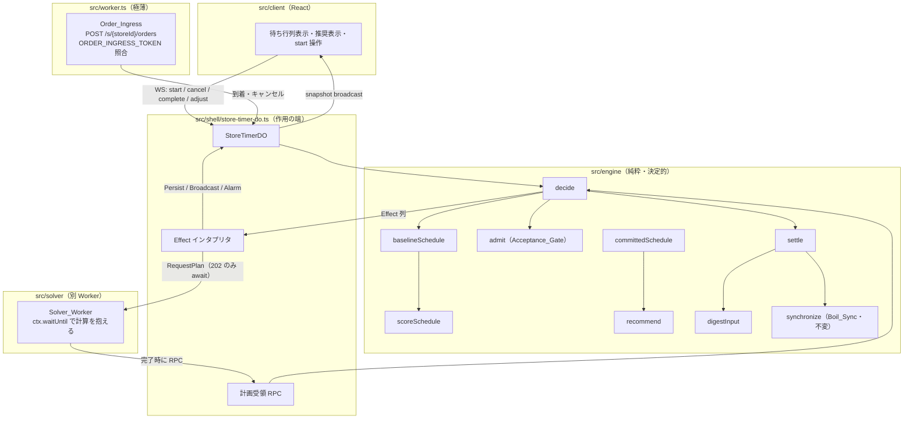
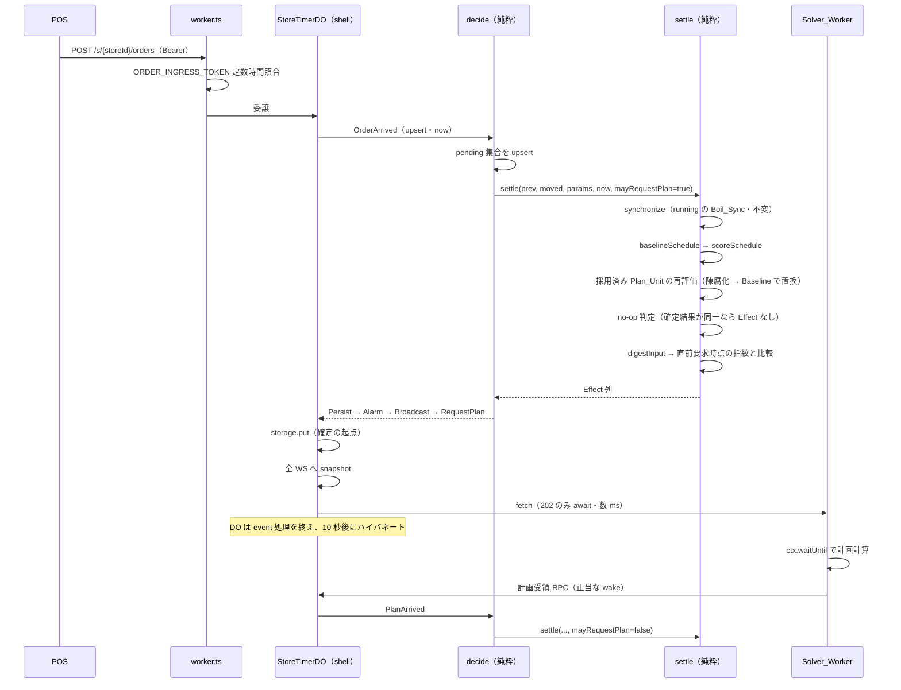

# Design Document

## Overview

未着手オーダー（Pending_Order）の調理順・釜（slot）割当・開始時刻を決め、推奨として提示する機構の設計である。重い最適化は DO の外（Solver_Worker）で解き、DO は自前の高速解を常に持ちながら、届いた外部計画をゲートで検証して採用する。

`decide` の純粋性・Effect 列の `Persist` 先頭・hibernation 規律は一切変えない。本機能が足すのは engine の純粋関数群と、Effect 語彙 1 種（`RequestPlan`）、Event 3 種、永続スキーマ v7 である。

### 設計の中心的判断（要点）

1. **Plan_Unit（確定名 `PlanSlice`）= 1 つの Table_Group への割当。採用は計画順の接頭辞に限る。** すべてのソフト制約項が Table_Group の内部に閉じるため、Table_Group を割らない分割は目的関数を厳密に加法分解する（要件6 の申し送りが課した成立条件）。slot の競合は「前方の確定は後方の変化に影響されない」接頭辞採用で断つ（→ Components / Plan_Unit）。
2. **Baseline_Plan はリスト・スケジューリング。** Table_Group 単位で最早解放 slot 群へ置く決定的な貪欲法。`O(n log n + n·m log m + Σ k²)`（n ≤ 64・m ≤ 24・k は Table_Group の品目数）。副産物として slot 解放表と Table_Group ごとの目的関数部分和を得るため、Acceptance_Gate は追加計算を要さない（要件4.5 / 6.7）。
3. **到着は upsert 意味論ひとつで足りる。** 同一 External_Order_Id の再到着は Order_Arrival_Time を保持して内容を置換する。内容が同一なら no-op。これで冪等（AC 1.3）と変更の正規化＋起点引継（AC 1.8）が**一つの規則**から出る（独立の変更イベントを立てない）。
4. **ワイヤは既存の `snapshot` を拡張する。** 新しい ServerMessage 種別を足さない——「確定した状態変化ごとに送るのは snapshot ただ一つ」という既存の唯一の権威表現を保つ。Pending_Order と推奨は `snapshot` に同乗する。
5. **Pending_Order は `src/domain/` に新しい共有概念として立てる。** client が待ち行列と推奨を表示するため共有される事実であり、かつ `TimerFact` とは別概念（`timer-model.md` の判定 → 共有だが混ぜない）。
6. **Committed_Plan・Cook_Recommendation・現在の Input_Fingerprint・Wait_Time はすべて導出値。** 永続するのは Pending_Order 集合・採用済み Plan_Unit 列・直前要求時点の Input_Fingerprint の 3 つだけ（要件7.1 / 7.2 / 7.3）。
7. **`RequestPlan` は Effect 列の末尾。** `Persist` → `SetAlarm|ClearAlarm` → `Broadcast` → `RequestPlan`。現場への反映（broadcast）を改善の投機（外部要求）より先に立てる。
8. **要求の抑制は `settle` が担う。** 抑制条件は Input_Fingerprint の一致のみ（AC 5.6）。計画受領の遷移は要求を出さない（AC 5.7）ため、`settle` に明示のフラグを渡す。
9. **`Slot_Affinity` は slot の物理距離の「許容距離超過分」で測る。** 二値の隣接判定ではない（Glossary の確定）。距離尺度は**オクタイル距離の整数版**（`10·max + 4·min`）、レイアウトは**ユニット原点＋ユニット内オフセットの座標合成**で持つ。合成ゆえユニット間の離隔が座標ひとつで表現され、距離の真実の源が 1 箇所に保たれる（ユニット間距離の加算項という第二の設定概念を持たない）。目的関数へは許容距離（既定 14 = 斜め隣接）からの超過分だけを計上し、**3 つのソフト制約項すべてを同じ形に揃える**——生の距離では距離 0 が同一 slot のときだけで到達不能な下限が生まれるため（→ Data Models / slot レイアウトと距離尺度）。
10. **`StoreConfig` は全項目を client へ配信する。** Boil_Sync design の「arms・Tolerance_Ratio 非配信」を覆す。店舗ごとに変更可能なパラメータが今後も増えるため、項目ごとに配信対象を選び直す形を採らない（→ Data Models / `StoreConfig`）。

---

## Architecture



依存方向は `engine → domain`、`shell → engine/domain`、`solver → domain`。Solver_Worker は `src/engine` を import しない（ワイヤ契約 `src/domain` だけを共有する）——外部ソルバーの実装が engine の内部形に癒着すると差し替え可能性が失われるため。

> **意図的な重複（設計判断）:** この依存方向ゆえ、Solver_Worker は目的関数と距離尺度を自前で実装する。同じ概念が 2 箇所に書かれるが、これは**意図した重複**である。理由は 2 つ。外部の採点は近似でよい（最終的な採否は engine の `admit` が engine 自身の採点で判定するため、外部が多少ずれた目的関数で探索しても正しさは損なわれない）。そして共有すると外部ソルバーが engine の内部形に縛られ、Rust → WASM への差し替えが engine の型に引きずられる。「重複の根絶」を破る例外として、ここは近似の自由を取る。**engine 側の採点が唯一の権威**であることを不変点として置く。

### イベント処理のシーケンス（オーダー到着）



---

## Components and Interfaces

### Plan_Unit の定義（要件6 の申し送りへの解・確定名 `PlanSlice`）

**Plan_Unit = 1 つの Table_Group に属する計画対象品目群への割当（順序・slot・開始時刻）の断片。**

現行の分解軸は Table_Group だが、確定名 `PlanSlice` は軸を名に焼き付けない（命名節を参照）。以下の議論で「unit」と呼ぶのは `PlanSlice` の 1 個である。

Table_Group を持たない Pending_Order は、自身のみを含む単独 Table_Group として扱う（モデルを全域に保つ）。

#### なぜ Table_Group が最小の不可分単位か

要件6 の申し送りが課した成立条件は「目的関数（ソフト制約項を含む）が Plan_Unit ごとに分解可能であること」。確定した目的関数（Requirement 3 の確定注記）の各項を見る。

| 項 | 定義される範囲 |
| --- | --- |
| `Σ Wait_Time` | 品目単位 → 常に分解可能 |
| `w_table × Σ(同一 Table_Group の提供時刻の最大差の超過分)` | Table_Group 内 |
| `w_order × Σ(同一オーダーの提供時刻の最大差の超過分)` | オーダー内 ⊂ Table_Group 内 |
| `w_affinity × Σ max(0, slotDistance − 14)` | 関連品目＝同一オーダー or 同一 Table_Group → Table_Group 内 |

**ソフト制約項はすべて Table_Group の内部に閉じる。** ゆえに Table_Group を割らない分割であれば、目的関数は Plan_Unit ごとの部分和へ厳密に加法分解される。申し送りが警戒した「時間帯の前方/後方分割は境界を跨ぐ Table_Group を必ず生む」問題は、境界を Table_Group の間にのみ置くことで構造的に消える。

#### slot の競合は接頭辞採用で断つ

Table_Group どうしは slot を取り合うため、目的関数は分解できても feasibility は独立しない。ここは「前方の確定部分は後方の変化に影響されない」時間的半順序で解く（申し送りの第 2 案）。

- 各 Plan_Unit に**計画順**を与える。キーは（当該 unit 内の最早開始時刻, Table_Group の最早 Order_Arrival_Time, Table_Group 識別子）の辞書式。列挙順に依存しない全順序になる（要件4.3 の決定性）。
- **採用は計画順の接頭辞に限る。** 判定に落ちた最初の unit を見つけたら、そこ以降をすべて棄却して Baseline_Plan の対応部分で埋める。
- 接頭辞の feasibility は自己完結する。接頭辞の slot 占有は「接頭辞内の unit ＋ 開始済み Timer の実効 `endTime`」だけで決まり、後方の unit に依存しないため。

これは AC 6.3 の「計画全体の一括採用/一括棄却を行わない」を満たす。全体か無かではなく、生き残る接頭辞の長さだけが変わる。

#### 過剰棄却が実際に緩和される理由

新着 Pending_Order は Order_Arrival_Time が最も遅いため、新しい Table_Group を作る場合は計画順の**後方**に付く。前方の接頭辞は無傷で生き残る。既存 Table_Group への追加（同卓の追加注文）だけが前方の unit を落としうるが、それは当該 unit 以降に限られる。

ピーク時ほど到着が多く、そのほとんどが新規 Table_Group であるため、接頭辞採用は「最も最適化の価値が高い時間帯に一度も採用されない」という最悪形を避ける。

### `digestInput` — Input_Fingerprint の導出

```ts
// src/engine/digest.ts
/**
 * 計画の入力から決定的に指紋を導出する（要件5.3 / 5.6・Glossary Input_Fingerprint）。
 *
 * 入力は計画対象の Pending_Order（Order_Arrival_Time 昇順の先頭 PLAN_TARGET_LIMIT 件）と
 * Running_Timer の必要事実（id・slotIds・実効 endTime）とパラメータ。列挙順に依存しないため
 * 正準順序へ整列してから畳む。現在の指紋は導出値であり状態に昇格させない。
 */
export function digestInput(
  pending: readonly PendingOrder[],
  running: readonly Timer[],
  params: SettleParams,
): InputDigest;
```

整数演算のみで畳む（浮動小数の丸めによる非決定性を排除する。Boil_Sync の整数スケール方針と同じ規律）。

パラメータは `SettleParams` を受ける（`ScheduleParams` ではない）。**麺プリセットも畳む**ためである——茹で時間は
`startAt` と `serveAt` を結ぶ唯一の値ゆえ、プリセットが差し替われば同じ待ち行列から別の計画が出る。畳まなければ
差し替え前後の要求が同一指紋になり、改善の機会を落とす（Glossary の「パラメータから導出される」の履行）。
畳むのは**計画対象が引く麺種の分だけ**で、麺種の符号単位順へ整列する（プリセットの列挙順に依存させない。ただし
同一麺種の重複は引き当てが先頭一致ゆえ相対順序を保つ）。待ち行列に現れない麺種の秒は計画を変えないので畳まない
（計画対象外の 65 件目以降を落とすのと同じ判断）。

`arms` / `toleranceRatio`（`SyncParams`）は**畳まない**。これらが計画へ届く経路は Boil_Sync による running の
実効 `endTime` の変化ただ一つで、その実効 `endTime` は既に畳んである。二重に畳めば「解放表が 1 ミリ秒も動かない
パラメータ変更」で要求が出る。

### `initialRelease` — slot 解放表（貪欲法の初期状態）

貪欲法の初期状態を独立した値として切り出す。**`baselineSchedule` が解放表を引数に取る**ことが、後述する合成の feasibility を構成から保証する鍵になる。

```ts
// src/engine/schedule.ts
/** 各 slot の最早解放時刻。index は slot 番号（既存 slotOf と同一規約）。 */
export type SlotRelease = readonly EpochMillis[];

/**
 * 開始済み Timer の占有から解放表を作る（ハード制約 (c) を所与として織り込む唯一の経路）。
 *
 * 各 slot の最早解放時刻を、その slot を占める Timer の実効 `endTime`（`adjustedEndTime`）で
 * 初期化する。空き slot は now。**boiled は実効 `endTime` の時点で解放済みとして扱う**
 * （湯切りで麺が釜から上がるため釜は空く。Complete は UI 上の確認であって釜の占有ではない）。
 * boiled の実効 endTime は定義上過去なので、この式は当該 slot を「今すぐ空いている」と扱う。
 */
export function initialRelease(running: readonly Timer[], now: EpochMillis, slotCount: number): SlotRelease;

/** 確定した配置列で解放表を進める（合成の尾部再実行に用いる）。 */
export function advanceRelease(release: SlotRelease, placements: readonly Placement[]): SlotRelease;
```

### `baselineSchedule` — 自前解の算出（要件4）

```ts
// src/engine/schedule.ts
/**
 * 計画対象の Pending_Order へ順序・slot・開始時刻を割り当てる決定的な貪欲法（要件4.1〜4.5）。
 *
 * 常に feasible（Requirement 3 のハード制約充足）。Pending_Order 集合が空なら空の計画を返す。
 * 副産物として Plan_Unit ごとの目的関数部分和を返し、Acceptance_Gate が追加計算なしで
 * 検証・比較できるようにする（要件4.5 / 6.7）。
 *
 * 解放表を引数に取るため、「途中まで確定した配置の続きを埋める」用途にそのまま使える
 * （committedSchedule の尾部再実行）。全体の自前解は initialRelease(running, now) を渡した場合。
 */
export function baselineSchedule(
  pending: readonly PendingOrder[],
  release: SlotRelease,
  params: ScheduleParams,
): CookSchedule;
```

#### アルゴリズム

1. **計画対象の抽出（AC 11.2）** — Pending_Order を（Order_Arrival_Time 昇順, External_Order_Id 昇順, 品目 index 昇順）で整列し、先頭 `PLAN_TARGET_LIMIT = 64` 件を計画対象とする。超過分は計画に現れず、Cook_Recommendation の対象にもならない（保持と表示は続く）。**この境界で Table_Group が割れる場合は、計画対象に入った品目のみで PlanSlice を成す**（残りは次の再計算で先頭が減ったときに同じ Table_Group の PlanSlice へ合流する）。境界で割れた group はソフト制約の評価も対象品目の間だけで行う。
2. **Table_Group 単位で配置** — 計画対象を Table_Group へまとめ、Table_Group を（最早 Order_Arrival_Time, 識別子）順に取り出す。各 Table_Group について、
   - グループの品目数 k 本を収容できる slot 群のうち、**k 本すべてが空く最早時刻**が最小になる組を選ぶ。
   - 同一オーダーの品目は許容幅 30 秒、同卓は 60 秒に収まるよう、選んだ slot 群の解放時刻の最大値へ**開始時刻を揃える**（茹で時間が異なる品目は提供時刻が揃うよう開始時刻を逆算する）。揃えられない場合はソフト制約違反として目的関数に計上するのみ（AC 3.5：feasibility の否定事由にしない）。
   - `Slot_Affinity`: 最早時刻が同点の候補が複数あるとき、**グループ内の全ペアの `slotDistance` の和が最小**になる組を選ぶ。さらに同点なら代表 slot の index 昇順で断つ。
   - 配置が決まったら `advanceRelease` で解放表を進め、次の Table_Group へ渡す。
3. **部分和の算出** — Plan_Unit ごとに目的関数の部分和を計算して計画に添える。

#### 計算量

計画対象 n ≤ 64、slot 数 m ≤ 24（`UNIT_COUNT_MAX = 4` × 6）、Table_Group の品目数 k。整列 `O(n log n)`、各品目の slot 選択 `O(m log m)`（解放時刻で整列し先頭 k 本）、Slot_Affinity の距離評価 `O(k²)`（グループ内の全ペア）、部分和 `O(n)`。合計 **`O(n log n + n·m log m + Σ k²)`** で、`Σ k² ≤ n²` ゆえ確定値 n=64・m=24 に対し定数上限に収まる。要件11.1 の多項式時間を満たす。

**決定性**（AC 4.3）: 入力を正準順序へ整列してから走らせ、slot 選択の同点は slot index 昇順で断つ。ゆえに列挙順に依存しない。

### `scoreSchedule` — 目的関数値の算出

```ts
// src/engine/objective.ts
/**
 * 計画の目的関数値を Requirement 3 の確定式で算出する（整数・秒換算）。
 *
 * = Σ Wait_Time + w_table × Σ(同卓の提供時刻最大差の 60 秒 超過分)
 *   + w_order × Σ(同一オーダーの提供時刻最大差の 30 秒 超過分)
 *   + w_affinity × Σ max(0, slotDistance − 14)   // 14 = 斜め隣接。隣り合う釜なら 0
 *
 * 3 項すべてが「許容幅からの超過分」で揃う。到達可能な下限 0 を持つ。
 *
 * Plan_Unit（Table_Group）ごとの部分和も返す。全項が Table_Group 内に閉じるため部分和の総和は
 * 全体値に厳密に一致する（AC 6.2(d) の部分比較の成立条件）。
 */
export function scoreSchedule(schedule: CookSchedule): ScheduleScore;
```

Wait_Time は導出値であり状態に持たない（AC 3.2）。未開始品目は「計画上の開始時刻＋茹で時間」で、Boil_Sync による開始後の調整（±h_i）を織り込まない近似（Requirement 3 の申し送り）。開始済み品目は `adjustedEndTime` を用いる。アドホック麺茹での Timer は `Order_Arrival_Time` を持たないため `Σ Wait_Time` に寄与しない（Requirement 8 の確定注記）が、slot 解放表には現れる。

**`ScheduleScore` は 4 項の内訳を返さない。** 返すのは総和 `total` と PlanSlice ごとの部分和 `bySlice` だけで、`Σ Wait_Time` / 同卓超過 / 同一オーダー超過 / affinity 超過の各項は非 export である（判定に要るのは総和と部分和のみ）。内訳を記録したい場合は公開型 `ScheduleScore` の拡張が要る（→ 波及先への申し送り・`affinityWeight` の校正の前提）。

### `admit` — Acceptance_Gate（要件6）

```ts
// src/engine/admit.ts
/**
 * 外部計画を Plan_Unit ごとに検証し、計画順の接頭辞のうち採用できる範囲を返す（AC 6.2〜6.4）。
 *
 * 判定は 5 つを一体で行う:
 *   (a) 陳腐化A — unit の対象品目が現在も計画対象の Pending_Order に在る
 *   (b) 陳腐化B — unit の Table_Group に計画が知らない新着が加わっていない
 *   (c) feasibility — Requirement 3 のハード制約を満たす
 *   (d) 改善 — 部分和が Committed_Plan の対応する部分和より真に良い（同値は棄却）
 *   (e) 一片の一意性 — 同一 tableKey の二度目を棄却する（一片は採用/棄却の単位ゆえ
 *       一つの Table_Group につき一つ。二度目は (a)(b) を通ってしまうため独立に断つ）
 *
 * 最初に落ちた unit 以降は棄却する（接頭辞採用）。そのうえで合成後の総和で全体判定を行う（後述）。
 * 判定に必要な構造は現行 Committed_Plan から受け取り、外部への照会を行わない（AC 6.7）。
 * in-flight の重複・追い越しは (a)〜(e) と全体判定だけで吸収する（AC 6.4）。
 */
export function admit(
  arrived: CookSchedule,
  committed: CookSchedule,
  pending: readonly PendingOrder[],
  running: readonly Timer[],
  now: EpochMillis,
  params: ScheduleParams,
): readonly AcceptedSlice[];
```

比較基準が `committed`（採用済みと自前解の合成）であることが、後着の劣る計画が採用済みのより良い計画を上書きしないことを保証する（AC 6.2(d)）。

#### 単調改善は全体判定が担保する（unit 単位の (d) だけでは出ない）

目的関数は PlanSlice ごとに加法分解されるが、**feasibility は slot を介して PlanSlice 間で結合したままである**。接頭辞の各 PlanSlice の部分和が改善しても、その接頭辞を前提に再実行した尾部が悪化し、合成後の総和が現行 Committed_Plan より悪くなる経路が残る。AC 6.2(d) が宣言する「確定計画の単調な改善」は unit 単位の判定だけからは導けない。

ゆえに判定を 2 段に分ける。**役割が違う。**

| 段 | 判定 | 役割 |
| --- | --- | --- |
| 1 | (a)〜(e) を PlanSlice ごとに、計画順の接頭辞として | **枝刈り**。陳腐化・制約違反・改善しない slice・同一 `tableKey` の二度目を落とす |
| 2 | 接頭辞を採用した場合の**合成後の総和** vs 現行 Committed_Plan の総和 | **単調性の担保**。悪化するなら全棄却 |

段 2 は `committedSchedule` を候補接頭辞で 1 回走らせ、総和を比べるだけである。**悪化するなら接頭辞を短くせず全棄却する。** 段階的に短くする探索を採らない理由は、棄却が無害（現行 Committed_Plan がそのまま残り、次の状態変化で新しい要求が出る）である一方、接頭辞長ごとに尾部を再実行すると `baselineSchedule` を最大 slice 数回走らせることになり、要件11.1 の計算量上限を押し上げるためである。惜しい棄却が実測で多いと分かった時点で探索を足せばよい（`operation-history-log` の採用/棄却が判断材料になる）。

これで Property 4（単調改善）が構成から成立する。

### `committedSchedule` — 確定計画の合成

```ts
// src/engine/commit.ts
/**
 * 採用済み PlanSlice と自前解を合成して現在の確定計画を導出する（AC 7.5）。
 *
 * 導出値であり状態に昇格させない（正本は採用済み PlanSlice 列と現在の Pending_Order / Timer 集合）。
 */
export function committedSchedule(
  accepted: readonly AcceptedSlice[],
  pending: readonly PendingOrder[],
  running: readonly Timer[],
  now: EpochMillis,
  params: ScheduleParams,
): CookSchedule;
```

#### 尾部は「切り貼り」ではなく再実行する

**採用接頭辞と自前解の尾部を素朴に繋いではならない。** 自前解の後方 PlanSlice は自前解自身の前方配置を前提に解放表を積んでいる。採用接頭辞の配置がそれと違えば、繋いだ計画は同一 slot の時間帯重複（ハード制約 (a) 違反）を起こしうる。「接頭辞の feasibility は自己完結する」は接頭辞**単体**についての主張であり、合成後の計画には及ばない。

ゆえに合成は次の順で行う。

1. 採用済み PlanSlice のうち**陳腐化しないもの**を計画順に取る（陳腐化判定は `admit` と同一の (a)(b)）。`startAt` が既に過ぎている（`startAt < now`）PlanSlice も陳腐化として扱う——人が推奨時刻に開始しなかった事実であり、その前提の上に積んだ後方も意味を失う。イベント間は表示が過去時刻のままで構わない（時刻起動の失効判定を持ち込まない・AC 7.5）
2. その接頭辞の配置で解放表を進める（`initialRelease(running, now)` から `advanceRelease` を順に適用）
3. **残りの計画対象に対して `baselineSchedule` を進んだ解放表で再実行する**
4. 接頭辞と再実行結果を連結する

尾部が接頭辞の占有を初期状態として計算されるため、合成後の計画は**構成から** feasible である。切り貼りではないので、後方の配置は接頭辞に合わせて動く。

計算量は `baselineSchedule` を 1 回追加で走らせるだけ（定数倍）。

### `recommend` — 開始推奨の導出（要件8）

```ts
// src/engine/recommend.ts
/**
 * 確定計画から「次に開始すべき品目・slot・開始タイミング」を導出する（AC 8.1）。
 *
 * 導出値。開始を強制せず、推奨開始時刻の到来で Timer を自動開始しない（AC 8.2）——ゆえに
 * 推奨に対して Alarm を張らない（Alarm は Boil_Sync の発火のみが用いる・不変）。
 */
export function recommend(committed: CookSchedule, now: EpochMillis): readonly CookRecommendation[];
```

### Pending_Order の集合操作

```ts
// src/engine/pending.ts
/**
 * 到着の upsert（AC 1.2 / 1.3 / 1.8）。
 *
 * 同一 External_Order_Id が既に在れば Order_Arrival_Time を保持して内容を置換する。
 * 内容が同一なら集合を変えない（冪等）。異なれば置換（変更の正規化＝キャンセル＋新規到着と同義、
 * ただし待ち時間の起点をリセットしない）。独立の変更イベントを立てない。
 *
 * **開始済みの品目は置換から除外する**（running を渡す理由）。除外しないと、一部品目が既に
 * 開始された注文について POS が全品目を含む内容を再送したとき、開始済み品目が pending へ
 * 復活して二重調理になる。
 */
export function upsertOrder(
  pending: readonly PendingOrder[],
  running: readonly Timer[],
  arrival: OrderArrival,
): readonly PendingOrder[];

/** キャンセル（AC 1.5 / 1.6）。対応する Pending_Order が無ければ集合を変えない（no-op）。 */
export function removeOrder(pending: readonly PendingOrder[], externalOrderId: string): readonly PendingOrder[];

/** 人の開始で Pending_Order を集合から除く（AC 8.4）。 */
export function consumeOrder(pending: readonly PendingOrder[], externalOrderId: string, itemIndex: number): readonly PendingOrder[];
```

#### 開始済み品目の同定には Timer 側の紐づけが要る

`upsertOrder` が開始済み品目を除外するには「この `(externalOrderId, itemIndex)` は開始済みか」を答える必要がある。現行の `Timer` は注文への紐づけを持たないため、`consumeOrder` で pending から除いた時点で対応が失われる。

engine 専用の基底を 1 つ足して合成する（`Sequenced` / `Boilable` / `Adjusted` と同列）。

```ts
// src/engine/timer.ts
/**
 * Ordered — engine だけが持つ「どの注文品目から始まったか」の事実（ワイヤには出ない）。
 *
 * null はアドホック麺茹で（POS を経ない開始・Requirement 8 の確定注記）。
 * 開始済み品目の同定に用いる。client は表示に用いないため domain へは出さない
 * （timer-model.md: 片側専用の関心事は共有契約に混ぜない）。
 */
export interface Ordered {
  readonly orderItem: { readonly externalOrderId: string; readonly itemIndex: number } | null;
}

export interface Timer extends TimerFact<…>, Sequenced, Boilable, Adjusted, Ordered {}
```

`ClientMessage.start` に載る `externalOrderId` / `itemIndex` を `Start` イベント経由で `createTimer` へ渡し、`orderItem` に写す。載っていなければ `null`。

> **限界（受容する）:** 保護されるのは Timer が生きている間（running / boiled）だけである。明示完了（`Complete`）で Timer が除かれた後に同一 `externalOrderId` の modification が届くと、提供済みの品目が pending へ復活しうる。完全に塞ぐには「完了済み品目の台帳」が要り、これは無限に増える状態になる（導出できない事実を無際限に抱える）。注文が全品提供された後の modification は POS 側の異常であり、AC 1.6 が既に「開始済み品目への外部キャンセルは no-op・通知もしない（現場の判断に委ねる）」という立場を採っていることと整合する。台帳を持たない判断をここで明示する。

### `settle` の拡張

現行の `settle`（`src/engine/settle.ts`）は「running の全体再同期 → no-op 検出 → `Persist` 先頭の Effect 列」を担う。ここに 3 つを足す。署名に `mayRequestPlan` を追加する。

```ts
export function settle(
  prev: TimerState,
  moved: TimerState,
  params: SettleParams,          // SyncParams（arms / toleranceRatio）＋ ScheduleParams（重み・許容幅）
  now: EpochMillis,
  mayRequestPlan: boolean,       // 計画受領の遷移は false（AC 5.7）
): Outcome;
```

1. **確定結果の同一性判定を拡張**（AC 7.6 / 要件7.7 の踏襲）— 現行の `isSameConfirmedResult` は Timer の `endTime` / `firmness` / `adjustment` / `boiledAt` を突き合わせている。ここに **Pending_Order 集合**と**採用済み Plan_Unit 列**を加える。加えないと、オーダー到着が `Persist` も `Broadcast` も出さずに握り潰される。
2. **Committed_Plan と推奨を snapshot へ載せる** — `assembleEffects` が `committedSchedule` → `recommend` を通して `snapshot` メッセージへ同乗させる。
3. **`RequestPlan` の生成** — `mayRequestPlan` が真かつ `digestInput` の結果が「直前に `RequestPlan` を生成した時点の Input_Fingerprint」と異なり、かつ**計画対象が非空**のときだけ、Effect 列の末尾に `RequestPlan` を積み、新しい指紋を状態へ書く（AC 5.4 / 5.6 / 5.8）。計画対象の判定は `planTargets` ただ一つから引き、抑制の空判定と要求が運ぶ集合を同じ値にする。対象が空の遷移では新しい指紋を永続しない——次に対象が現れた遷移で指紋はまだ食い違っており、要求はそこで出る。

### `decide` の拡張

```ts
export function decide(state: TimerState, event: Event, params: SettleParams): Outcome {
  switch (event.type) {
    // 既存（すべて mayRequestPlan = true で settle へ）
    case "Start":         return startTimer(state, event, params);
    case "Cancel":        return cancelTimer(state, event.timerId, event.now, params);
    case "Complete":      return completeTimer(state, event.timerId, event.now, params);
    case "Adjust":        return adjustTimer(state, event.timerId, event.firmness, event.boilSeconds, event.now, params);
    case "AlarmFired":    return fireDueTimers(state, event.now, params);
    case "Reconcile":     return reconcile(state, event.now, params);
    // 新規
    case "OrderArrived":  return arriveOrder(state, event, params);
    case "OrderCancelled":return cancelOrder(state, event.externalOrderId, event.now, params);
    case "PlanArrived":   return receivePlan(state, event, params);  // settle に mayRequestPlan = false
  }
}
```

`Start` は既存経路のまま Timer を作り、`event` に `externalOrderId` が載っていれば `consumeOrder` で Pending_Order を除き `orderItem` に写す（AC 8.4）。載っていなければアドホック麺茹でで `orderItem` は `null`（Requirement 8 の確定注記）。既存の拒否事由は変えない（AC 8.3）。

### client（`src/client`）

Boil_Sync は「client 変更不要」だったが、**本機能は client 変更が必須**である。待ち行列と推奨は client でしか現れない事実だからである。

| 箇所 | 変更 |
| --- | --- |
| `snapshot` の受け | `pendingOrders` / `recommendations` を状態へ取り込む。既存の `timers` の扱いは変えない |
| 待ち行列の表示 | Pending_Order を Order_Arrival_Time 昇順で一覧する。計画対象外（65 件目以降）も表示するが推奨は付かない |
| 推奨の表示 | `recommendations` を担当スロット範囲で絞って提示する（既存の `assignment.ts` の担当絞り込みに倣う）。**指示ではなく提案**として見せる |
| 開始操作 | 推奨から開始する経路で `ClientMessage.start` に `externalOrderId` / `itemIndex` を添える。推奨と異なる操作も従来どおり通す（AC 8.3） |
| `config` の受け | 追加項目を受け取る。表示・導出にのみ用い変更要求を送らない。`unitOrigins` / `slotOffsets` は現時点で用途なし（受け取るが使わない） |

**推奨開始時刻の到来で自動開始しない**（AC 8.2）。client は `startAt` を表示するだけで、時刻到来を契機に何も起こさない。過ぎた `startAt` はサーバの次回再評価で陳腐化として置き換わるまで過去時刻のまま表示される（イベント間に新しいタイミング概念を持ち込まない帰結）。

> **boiled と推奨が同一 slot に重なりうる。** `initialRelease` は boiled を解放済みとして扱う（釜は湯切りで空く）ため、明示完了（`Complete`）されていない茹で上がりが表示されている釜へ推奨が付くことがある。物理的には正しい（釜は空いている）。表示の重なりは既存の重畳の関心事であり、`degraded-slot-superimposition` の扱いに倣う——本機能で新しい重畳規則を作らない。

Pending_Order は導出値を持たない生の事実なので、client 側の状態は `snapshot` の写しに留まる（残り時間と同じく、表示のための導出はレンダリング時に行う）。

---

## Data Models

### `PendingOrder`（`src/domain/order.ts`・新規）

`timer-model.md` の判定を通す。「両者で共有される事実か」→ client が待ち行列と推奨を表示するため **共有される事実**。ただし `TimerFact` とは別概念ゆえ混ぜない（god type 化の禁止）。よって `src/domain/` に独立した契約として立てる。

```ts
/** 未着手オーダーの 1 品目。DO の永続層が正本（AC 2.1）。 */
export interface PendingOrder {
  readonly externalOrderId: string;   // POS 側の識別子（upsert の鍵）
  readonly itemIndex: number;         // 同一オーダー内の品目連番
  readonly noodleType: string;
  readonly firmness: Firmness;
  readonly tableId: string | null;    // Table_Group の識別子。null は単独グループ
  readonly arrivalTime: number;       // Order_Arrival_Time（Wait_Time の起点）
}
```

`boilSeconds` は持たない。`StoreConfig.noodlePresets` から `noodleType` × `firmness` で引ける導出値であり、持てば二つの真実になる。

### `CookSchedule` / `PlanSlice` / `Placement`（`src/engine/schedule.ts`）

engine 専用の内部形と、ワイヤへ出す形を分ける。

```ts
/** 1 品目の配置。engine 内部形。 */
export interface Placement {
  readonly externalOrderId: string;
  readonly itemIndex: number;
  readonly slotIds: NonEmptyArray<SlotId>;
  readonly startAt: EpochMillis;      // 推奨開始時刻
  readonly serveAt: EpochMillis;      // startAt + 茹で時間（Wait_Time の終点・導出の中間値）
}

/**
 * Plan_Unit = 計画を独立に採用/棄却できる一片。現行の分解軸は Table_Group。
 *
 * 名に分解軸（卓・時間・干渉閉包）を焼き付けない。要件6 の申し送りが軸の再検討を残しており、
 * 軸が変わっても「計画の独立した一片」という概念境界は変わらないため。
 */
export interface PlanSlice {
  readonly tableKey: string;                        // 現行の分解軸＝Table_Group 識別子（null は単独キーへ写す）
  readonly placements: readonly Placement[];
  readonly score: number;                           // 当該 PlanSlice の目的関数部分和（整数）
}

/** 計画全体。計画順（接頭辞採用の順序）で並ぶ。 */
export interface CookSchedule {
  readonly slices: readonly PlanSlice[];
  readonly score: number;                           // 部分和の総和（厳密に一致する）
}

/** 採用済み PlanSlice（永続する再現不能な事実・AC 7.1）。 */
export interface AcceptedSlice extends PlanSlice {}
```

### `TimerState` の拡張（`src/engine/state.ts`）

```ts
export interface TimerState {
  readonly timers: readonly Timer[];                     // 既存
  readonly nextSeq: number;                               // 既存
  readonly pendingOrders: readonly PendingOrder[];             // 新規（正本）
  readonly acceptedSlices: readonly AcceptedSlice[];           // 新規（採用済み計画の事実）
  readonly requestedDigest: InputDigest | null;                // 新規（直前要求時点の指紋）
}
```

この 3 つが決定性の四つ組（対象集合, パラメータ, 採用済み計画, 直前要求時点の Input_Fingerprint）の状態側を担う（AC 7.3）。Committed_Plan・推奨・現在の指紋・Wait_Time はいずれも状態に置かない（AC 7.2）。

### 永続スキーマ v7 と `StoreSnapshot` への改名（`src/engine/snapshot.ts` / `types.ts` / `migrate.ts`）

現行 v6 は単一キー `"activeTimers"` に `{ version, timers, nextSeq }` を丸ごと put する。v7 で 3 フィールドを足す。

```ts
/** v7: pendingOrders / acceptedSlices / requestedDigest を追加。 */
export const CURRENT_SCHEMA_VERSION = 7 as const;
```

単一キーを維持する。`Persist` が 1 つの Effect であるという不変条件（`Persist` 先頭）を保つためで、キーを分けると確定の起点が 2 つになる。

`migrate` の追加分（v6 → v7）:

| フィールド | 旧データの埋め方 |
| --- | --- |
| `pendingOrders` | `[]`（POS 連携前の稼働店には未着手オーダーが存在しない） |
| `acceptedSlices` | `[]`（採用済み外部計画なし＝Committed_Plan は Baseline のみ） |
| `requestedDigest` | `null`（次の状態変化で必ず 1 回要求が出る。正しい初期挙動） |

#### 型名の改名 — `ActiveTimersSnapshot` → `StoreSnapshot`

v7 の中身は Timer だけではない（Pending_Order・採用済み計画・指紋を覆う）。`ActiveTimersSnapshot` は名が実態と食い違うため改名する。`StoreConfig`・`StoreTimerDO` と `Store` 接頭辞で一貫し、「店舗の全状態」を表明する。

改名が触る箇所は `src/engine/snapshot.ts`（型と `toSnapshot` / `fromSnapshot`）・`src/engine/effect.ts`（`Persist` の `snapshot` フィールドの型）・`src/engine/migrate.ts`・`src/shell/store-timer-do.ts`（`storage.put` / `get` の型注釈）。純粋な型名の置換で、値の形は変わらない。

#### ストレージキー `activeTimers` は据え置く

**キー名は改めない。** 理由は 3 つある。

1. **改名すると移行が二段になる。** 新キーへ書く前に旧キーを読む経路が必要で、その間だけ「正本が 2 つある」状態が生まれる。確定の起点は `storage.put` 成功のみという規律（SSOT）に対して、移行期間の曖昧さを持ち込む代償が大きい。
2. **キー名は永続層の内部詳細で、外に漏れていない。** ワイヤにも client にも現れず、読み書きするのは `store-timer-do.ts` の 1 箇所だけ。名が実態と食い違う代償は型名の改名で既に払い戻される。
3. **スキーマの世代管理は `version` が担っている。** キー名で世代を語らせると、`version` と二重の世代表現になる。

キー名は「最初に置かれた場所の名」として据え置き、意味の正本は型名（`StoreSnapshot`）と `version` に持たせる。`snapshot.ts` の該当箇所に、キー名が歴史的経緯であることを 1 行のコメントで残す。

### ワイヤ表現（`src/domain/messages.ts` の拡張）

新しい ServerMessage 種別を足さず、既存の `snapshot` を拡張する。

```ts
export type ServerMessage =
  | {
      readonly type: "snapshot";
      readonly serverTime: number;
      readonly timers: readonly TimerFact[];
      readonly pendingOrders: readonly PendingOrder[];        // 追加（超過分も含む全量・AC 2.3 / 2.4）
      readonly recommendations: readonly CookRecommendation[]; // 追加（Committed_Plan からの導出値）
    }
  | {
      readonly type: "config";
      readonly serverTime: number;
      readonly unitCount: number;                                  // 既存
      readonly noodlePresets: readonly NoodlePreset[];             // 既存
      readonly arms: number;                                       // 追加（Boil_Sync 由来・方針転換で配信）
      readonly toleranceRatio: number;                             // 追加（同上）
      readonly orderSyncWeight: number;                            // 追加
      readonly tableSyncWeight: number;                            // 追加
      readonly affinityWeight: number;                             // 追加
      readonly orderSyncToleranceSeconds: number;                  // 追加
      readonly tableSyncToleranceSeconds: number;                  // 追加
      readonly affinityToleranceDistance: number;                  // 追加
      readonly unitOrigins: readonly UnitOrigin[];                 // 追加
      readonly slotOffsets: SlotOffsets;                           // 追加
    }
  | { readonly type: "error"; /* … 既存 */ };
```

`config` は `StoreConfig` 全体を運ぶ（方針転換の理由は Data Models / `StoreConfig` の節）。項目が増えるたびに配信対象を選び直さない形にする。

`ClientMessage.start` に省略可能な `externalOrderId` / `itemIndex` を足す（Pending_Order からの開始と、アドホック麺茹での区別）。

```ts
/** 推奨の 1 件。導出値ゆえ永続しない。 */
export interface CookRecommendation {
  readonly externalOrderId: string;
  readonly itemIndex: number;
  readonly slotIds: readonly string[];
  readonly startAt: number;
}
```

### slot レイアウトと距離尺度（`src/domain/store.ts`）

`Slot_Affinity` は二値の隣接判定ではなく、slot の物理配置に基づく距離で評価する（Glossary の確定）。距離尺度の具体をここで定める。

#### 距離尺度 — オクタイル距離の整数版

slot の座標 `(x, y)` に対し、`dx = |x₁ − x₂|`・`dy = |y₁ − y₂|` として

```
slotDistance = 10 × max(dx, dy) + 4 × min(dx, dy)
```

斜め移動のコストを √2 ≈ 1.4 とし、縦横 1 マスを 10 に正規化した形。グリッド上の経路探索で標準的に用いられる尺度である。

**要求されている順序は「縦横隣接 < 斜め隣接 < 2 マス直線」である**（ユーザー確定）。この 1 点で候補がふるい落とせる。

| オフセット | マンハッタン | チェビシェフ | ユークリッド | **オクタイル** | 二乗ユークリッド |
| --- | --- | --- | --- | --- | --- |
| 縦横隣接 (1,0) | 1 | 1 | 1.00 | **10** | 1 |
| 斜め隣接 (1,1) | 2 | 1 | 1.41 | **14** | 2 |
| 2 マス直線 (2,0) | 2 | 2 | 2.00 | **20** | 4 |
| (2,1) | 3 | 2 | 2.24 | **24** | 5 |

- **マンハッタンは採れない。** 斜め隣接（2）と 2 マス直線（2）が同値になり、斜めを遠すぎに見る。
- **チェビシェフも採れない。** 縦横隣接（1）と斜め隣接（1）が同値になり、斜めを近すぎに見る。
- **ユークリッドは順序が正しいが、平方根が無理数を生む。** 目的関数は整数重み付き和として確定しており（Requirement 3 の確定注記）、浮動小数が混ざれば `admit` の改善判定（真に良いか同値か）が丸め誤差に左右され、Property 4・5 が壊れる。Boil_Sync が整数スケールで決定性を担保しているのと同じ規律で退ける。
- **二乗ユークリッドは順序が正しく整数だが、距離が二次で伸びる。** `w_affinity` は `Wait_Time`（秒）の和と足し合わされる線形のペナルティ係数ゆえ、二次の項が混ざると重みの校正が成立しない。
- **オクタイルは順序が正しく、かつ平方根を用いない。** ユークリッドの利点をその欠点なしに得る。

ユークリッドに対する誤差は 8% 以内（(1,0) 0%・(1,1) −1%・(2,1) +7%・(2,2) −1%・(3,1) +8%）。ソフト制約のペナルティ項として十分である。

#### 許容距離 — 目的関数には超過分だけを計上する

生の距離を計上しない。**許容距離 `affinityToleranceDistance`（既定 14 = 斜め隣接）からの超過分**を計上する。

```
affinityPenalty = w_affinity × Σ max(0, slotDistance − affinityToleranceDistance)
```

生の距離では**到達不能な下限**が生まれる。距離 0 は同一 slot のときだけで、関連品目を同時に提供するには別 slot が必須（ハード制約 (a)）ゆえ、どう置いても距離 10 以上が乗る。`k` 品目の Table_Group なら `k(k−1)/2 × 10` が「払わざるをえない固定費」として底上げされ（`k = 4` で 60）、最適化の判断に寄与しない値が主目的（`Σ Wait_Time`）との比較を水増しする。

超過分にすると、他の 2 つのソフト制約項（許容幅 60 秒 / 30 秒の超過分）と**形が揃う**。3 項すべてが到達可能な下限 0 を持つ。

既定 14 の効き:

| 対 | 距離 | ペナルティ（`w_affinity = 1`） |
| --- | --- | --- |
| 縦横隣接 | 10 | 0 |
| 斜め隣接 | 14 | 0 |
| 2 マス直線 | 20 | 6 |
| ユニット内の対角（3 行 × 2 列の端と端） | 24 | 10 |
| 異なるユニットの最近対（既定レイアウト） | 30 | 16 |

3 行 × 2 列のユニットでは、ある釜から見た 8 近傍のうちユニット内に収まるものがすべて 0 になる。「同じ台の隣り合う釜なら十分近い」という現場の事実の表明であり、ユニット内のわずかな配置差で最適化が揺れない。ユニット内の対角（10）と異なるユニット（16 以上）には差が残るため、必要な区別は保たれる。

#### 品目間の距離 — 代表 slot 間で測る

1 品目が複数 slot を占めうる（`slotIds` は非空配列）。品目 i の**代表 slot** を「`slotIds` のうち座標の辞書式最小（`y`, `x`, slot index）」と定め、品目間の距離は代表 slot 間の `slotDistance` とする。

複数 slot 占有は例外的であり、代表点で足りる。最小距離や重心を採ると距離が slot 数に依存して重みの効きがぶれるため、代表点のほうが素直である。

Table_Group の距離項は**グループ内の全ペアの距離和**。`k` 品目で `k(k−1)/2` ペア、`k` は小さい。

#### レイアウトの表現 — 座標合成

座標を slot ごとに列挙しない。**ユニット原点＋ユニット内オフセットの合成**で持つ（Glossary の確定）。

```ts
/** 格子座標。原点にもオフセットにも合成結果にも使う中立の基底。 */
export interface GridPoint {
  readonly x: number;   // 0 以上の整数
  readonly y: number;   // 0 以上の整数
}

/** ユニット（釜の台・6 slot）の原点。 */
export type UnitOrigin = GridPoint;

/** ユニット内 6 slot のオフセット。全ユニットで共通（ユニットは同型の台である）。 */
export type SlotOffsets = readonly [GridPoint, GridPoint, GridPoint, GridPoint, GridPoint, GridPoint];

/** slot の合成座標。導出値であり設定として持たない。 */
// position(i) = unitOrigins[⌊i / SLOTS_PER_UNIT⌋] + slotOffsets[i % SLOTS_PER_UNIT]
```

オフセットは原点ではないため `UnitOrigin` を流用しない。中立の `GridPoint` を両者の基底に置く（名が小さく嘘をつくのを避ける・`naming.md`）。

**slot 番号 `i` と `SlotId` の対応**は既存規約に従う。`SlotId` は 0 始まりの連番文字列で、`src/client/assignment.ts` の `slotOf` が恒等写像として番号へ写す（unit `u` は slot `6u..6u+5`・`SLOTS_PER_UNIT = 6`）。engine 側も同じ写像を用い、写像を二度定義しない。

合成を採る理由が 3 つある。

1. **ユニット間の離隔が座標ひとつで表現される。** 台を離して置けば原点間が離れ、境界を跨いだ対が正しく遠くなる。requirements が警戒した「ユニット内の並びだけを座標化すると、ユニット境界を挟んだ grid 上の隣が実際より近く評価される」問題が構造的に消える。
2. **距離の真実の源が座標ひとつに保たれる。** ユニット間距離を加算項として別に設定すると、距離が座標と加算項の 2 箇所から決まる（requirements が明示的に退けた形）。合成なら `slotDistance` は常に合成座標だけから導出される。
3. **設定量が構造的に小さい。** ユニットは同型なのでオフセットは 1 セットで足る。`unitOrigins`（最大 4 × 2 値）＋ `slotOffsets`（6 × 2 値）＝ 20 値。slot ごとに座標を持つと 24 × 2 = 48 値で、しかも「ユニットは同型」という事実が表現されない。

#### 既定レイアウト

1 ユニット = 3 行 × 2 列、ユニットを横に並べる。

```
slotOffsets: j → (x = j % 2, y = floor(j / 2))      // (0,0) (1,0) / (0,1) (1,1) / (0,2) (1,2)
unitOrigins: u → (4u, 0)                            // ユニット幅 2 ＋ 台の離隔 2
```

既定の離隔 2 は**不変条件を満たすために選んである**。すなわち「**同一ユニット内の任意の対は、異なるユニットの任意の対より近い**」。

- 同一ユニット内の最遠対は対角（`dx=1, dy=2`）で `10·2 + 4·1 = 24`
- 異なるユニットの最近対は原点間の離隔で決まり、離隔 `g` のとき `10·(1 + g)`
- `g = 2` で `30 > 24` となり不変条件が成立する（`g = 1` では `20 < 24` で破れる）

この不変条件は「別の台へ手を伸ばすより、自分の台の端まで動くほうが近い」という現場の事実の表明である。Property 18 で検証する。

未指定・不正な座標は当該要素のみ既定へ畳む（他の妥当な座標は保持する。`toArms` と同じ規律）。`unitOrigins` の要素数が `unitCount` に足りない場合も、足りない分だけ既定 `(4u, 0)` で埋める。

### `StoreConfig` の拡張（`src/domain/store.ts`）

ソフト制約の重み・許容幅・slot レイアウトをサーバ権威設定として持つ（Requirement 3 の確定値を既定とする）。既存の `toArms` / `toToleranceRatio` と同形の検証関数を足し、不正値は**当該パラメータのみ**既定へ畳む。

| キー | 既定 | 妥当域 |
| --- | --- | --- |
| `orderSyncWeight`（w_order） | 3 | 0〜100 の整数 |
| `tableSyncWeight`（w_table） | 2 | 0〜100 の整数 |
| `affinityWeight`（w_affinity） | 1 | 0〜100 の整数 |
| `orderSyncToleranceSeconds` | 30 | 0〜600 の整数 |
| `tableSyncToleranceSeconds` | 60 | 0〜600 の整数 |
| `affinityToleranceDistance` | 14（斜め隣接） | 0〜1000 の整数 |
| `unitOrigins` | `u → (4u, 0)` | 各座標が 0 以上の整数 |
| `slotOffsets` | 3 行 × 2 列（`j → (j % 2, ⌊j / 2⌋)`） | 各座標が 0 以上の整数・要素数 6 |

#### `StoreConfig` は全項目を client へ配信する（方針転換）

**新パラメータと `unitOrigins` / `slotOffsets` を含め、`StoreConfig` の全項目を `config` メッセージで配信する。**

これは Boil_Sync design が採った「arms・Tolerance_Ratio は client へ送らない」を覆す。理由は**店舗ごとに変更可能なパラメータが今後も増えるため**である。arms も実は店舗で変わる値であり、「client が使わないから送らない」という個別判断を積み上げると、パラメータが増えるたびに同じ判断を繰り返し、配信対象が恣意的な部分集合になる。`StoreConfig` は「店舗のサーバ権威設定」という単一の概念なので、その全体を一方向に配信するほうが境界が単純である。

要件違反にはならない。Boil_Sync の要件6.5 は `WHERE クライアント端末が調整パラメータを受信する` という条件節で、受信した場合の扱い（表示・導出にのみ用い、変更不可）を定めているだけで、配信を禁じていない。Boil_Sync design.md の該当 2 箇所には本方針への改訂注記を添えた。

client 側の扱いは変わらない。受信した値を表示・導出にのみ用い、変更要求は送らない（サーバ権威）。`unitOrigins` / `slotOffsets` は画面のスロット配置を物理配置に合わせる用途に将来使えるが、現時点で client は使わなくてよい（配信するが利用は強制しない）。

---

## Solver_Worker

### 配置と構成

Service binding は別 Worker を要するため、リポジトリ内に 2 つ目の Worker を置く。

- `src/solver/index.ts` — Solver_Worker のエントリ
- `wrangler.solver.jsonc` — Solver_Worker の設定。**`limits.cpu_ms` は既定のまま据え置く**
- `wrangler.jsonc`（既存）に `services: [{ binding: "SOLVER", service: "yude-men-solver" }]` を足す

#### 打ち切り予算は自前で 5 秒（`limits.cpu_ms` は上げない）

**Solver_Worker は自前の打ち切り予算 5 秒で計算を止める。**`limits.cpu_ms` を引き上げない。

実効の壁は CPU 時間ではなく、invocation 終了後の `ctx.waitUntil` に掛かる 30 秒の上限である。`limits.cpu_ms` を上げてもこの壁は伸びないため、上げる意味がない。予算を自前で持てば、壁に当たって切られるのではなく**計算側が自分の意思で最良解を返して終える**——外部の非決定性（時間打ち切り）は AC 12.7 で許容されている。

5 秒は 30 秒の壁に対して十分な余裕を残す値である。往路の 202 応答・入力のデシリアライズ・復路の RPC がこの外側に乗る。

`wrangler.jsonc` を変更したら `pnpm cf-typegen` を必ず再生成する（`tooling.md`）。

### 経路

- **往路** — shell が `env.SOLVER.fetch()` を呼び、受理応答（202）のみを await する（AC 5.2 / 12.2）。ボディは `RequestPlan` の内容＋ `storeId`。`storeId` は shell が付ける（engine は `storeId` を知らない）。
- **計算** — Solver_Worker が `ctx.waitUntil` で抱える（AC 12.3）。DO ではないため hibernation 規律に触れない。
- **復路** — Solver_Worker が `env.STORE_TIMER_DO.idFromName(storeId)` で引いた stub の公開 RPC メソッドを呼ぶ。DO はこの wake で `PlanArrived` を `decide` へ流す。

### 制約への適合（AC 12.5 / 12.6）

Workers Paid の実行制約はサイズ 10 MB gzip・起動 1 秒・メモリ 128 MB・スレッドなし。計画エンジンは TypeScript で始める。Rust → WASM を採る場合はモジュールサイズと起動時間を実測し、**起動 1 秒**への適合を確認してから採用を確定する（これが WASM 採用時の主制約）。

External_Solver の非決定性（時間打ち切り・乱数）は許容される（AC 12.7）。ゲートが feasibility と改善を検証するため、外部に決定性を要求しない。

### 失敗時（要件10）

DO 側に in-flight の追跡状態を持たない。Alarm も張らない（AC 10.4）。不到達・タイムアウト・エラー応答・スキーマ不正はすべて「何も起きない」に収束し、Committed_Plan は Baseline_Plan のみで成立し続ける（AC 10.1）。再試行は次の状態変化での要求生成に委ねる（AC 10.2）。

---

## Error Handling

| 失敗 | 扱い | 根拠 |
| --- | --- | --- |
| Order_Ingress の認可失敗 | 401。DO へ到達させない | AC 1.1 |
| 到着ボディが不正 | 400。Pending_Order 集合と Timer 集合をいずれも変更しない | AC 1.4 |
| 存在しない Pending_Order のキャンセル | no-op。開始済み Timer を自動キャンセルしない・通知も出さない | AC 1.6 / Requirement 1 の確定注記 |
| 外部計画が解析不能・スキーマ不正 | 全体棄却。状態を変更しない | AC 10.3 |
| 外部計画の一部 unit が判定に落ちる | 当該 unit 以降を棄却し Baseline で埋める（接頭辞採用） | AC 6.3 |
| すべての unit が棄却 | `Persist` も `Broadcast` も出さない | AC 6.6 |
| `RequestPlan` の送出失敗 | Timer 本体へ伝播させない。DO 内で再試行を抱えない | AC 10.2 |
| `storage.put` 失敗 | broadcast を抑止し直前の確定状態を保持。hydration で回復 | AC 10.5 |
| 計画対象 64 件の超過 | 超過分は保持・表示のみ。推奨対象外。Timer 本体を壊さない | AC 11.2 |

---

## Testing Strategy

`tooling.md` に従い Vitest v4 + `cloudflareTest()`、PBT は fast-check。engine の純粋関数は既定 pool（workerd 不要）、shell / DO / Solver_Worker は Workers pool。

Workers pool の `testTimeout` は 20 秒に置く。DO 統合テストの実測が全量実行時 4.3〜5.2s で、既定の 5 秒をほぼ使い切るためである。

### テスト環境の Service binding

`wrangler.jsonc` に `services`（`SOLVER` → `yude-men-solver`）を書いた時点で、テスト環境にも相手先が要る。workerd は binding の指す service が定義されていないと起動そのものを拒むためである。ゆえに `vitest.config.ts` の `cloudflareTest` の `miniflare.workers` へ `name: "yude-men-solver"` の補助 Worker を置く。補助 Worker に実体（`src/solver/index.ts`）は置けない。補助 Worker は Vite のビルドを経ないため TypeScript のエントリをそのまま渡せず、実体のデプロイは `wrangler.solver.jsonc` の担当である。補助 Worker は 202 だけを返す。これは往路の受理のみを観測可能な振る舞いとする骨格 Solver と一致する。復路（`deliverPlan`）はテストから直接呼ぶ。起動コストの影響は実測 4%（4299ms → 4486ms）で実行間ノイズと同程度であり、補助 Worker の起動は pool のセットアップ側に乗るためテストの時間予算を食わない。

### 静的検査

`RequestPlan` を含む `Effect` union の網羅性は shell の `applySideEffect` の `switch` が型で保証する（未処理の種別は `never` に落ちる）。同様に `Event` の網羅は `decide` が保証する。

### Integration（Workers pool・Property にできないもの）

状態を跨ぐ振る舞いと外部との配線は Property では捕まらないため、統合テストで受け持つ。

| 検証 | 内容 | 対応 AC |
| --- | --- | --- |
| hydration の一致 | 2 端末を接続し、一方が再接続して `snapshot` を再取得すると Pending_Order と推奨が他端末と一致する | AC 2.4 / 8.5 |
| `Persist` 失敗の抑止 | `storage.put` を失敗させると broadcast が出ず、直前の確定状態が保たれる。後続の hydration で回復する | AC 10.5 |
| hibernation 越しの復元 | DO を hibernate させた後にイベントを送ると、Pending_Order と採用済み PlanSlice が永続から復元される | AC 2.5 |
| `RequestPlan` の送出 | shell が Solver_Worker へ 202 のみを await し、計算完了を待たずに event 処理を終える（DO が非活性へ入れる） | AC 5.2 / 12.2 |
| 復路 RPC | Solver_Worker から `deliverPlan` を呼ぶと DO が wake し `PlanArrived` が `decide` へ流れる | AC 6.1 / 12.3 |
| Order_Ingress の認可 | トークン不一致・欠如で 401、DO へ到達しない | AC 1.1 |
| Order_Ingress の拒否 | 必須属性欠落・未知の品目種別・型違反で 400、Pending_Order 集合と Timer 集合が不変 | AC 1.4 |
| 外部不到達の無害性 | Solver_Worker を落としても推奨が出続け、Timer 本体の計時が乱れない | AC 4.4 / 10.1 |
| スキーマ v6 → v7 移行 | v6 の永続値を置いて起動すると `migrate` が 3 フィールドを埋め、既存 Timer の挙動が変わらない | 要件11（既存）/ AC 2.5 |

### Example（代表シナリオ）

Property が覆う一般則に対し、読んで振る舞いが分かる代表例を置く。

- **単独オーダー 1 品目** — 空き釜へ即時開始の推奨が出る
- **同卓 3 品目・同一オーダー 2 品目** — 同時提供の許容幅内に揃い、隣り合う釜へ置かれて affinity ペナルティが 0 になる
- **釜が埋まっている** — 最早解放時刻まで開始時刻が後ろへ倒れる
- **接頭辞の一部が陳腐化** — 外部計画の 2 番目の PlanSlice の対象がキャンセルされ、1 番目のみ採用されて尾部が再実行される
- **全体判定で棄却** — 各 PlanSlice の部分和は改善するが合成後の総和が悪化する計画が、段 2 で全棄却される
- **アドホック麺茹で** — POS を経ない開始が計画対象に入らず、slot 解放表にだけ現れる
- **modification の再送** — 一部開始済みの注文へ全品目を含む modification が届いても、開始済み品目が復活しない
- **計画対象 64 件の超過** — 65 件目以降が保持・表示され推奨に現れない。境界で割れた Table_Group は対象品目のみで PlanSlice を成す

---

## Correctness Properties

Boil_Sync design の記法に揃える。

### Property 1: Baseline_Plan は常に feasible

*For any* Pending_Order 集合・Running_Timer 集合・パラメータについて、`baselineSchedule` の返す計画は Requirement 3 のハード制約 (a)(b)(c) をすべて満たす。

**Validates: Requirements 4.2**

### Property 2: Baseline_Plan は列挙順に依存しない

*For any* 入力について、Pending_Order と Running_Timer の列挙順を任意に置換しても `baselineSchedule` の結果は同一である。

**Validates: Requirements 4.3**

### Property 3: 目的関数は Plan_Unit ごとに厳密に加法分解される

*For any* 計画について、`scoreSchedule` の返す各 unit の部分和の総和は全体値に等しい。Plan_Unit 定義の成立条件そのものを検証する。

**Validates: Requirements 6.2**

### Property 4: 確定計画は単調に改善する

*For any* 外部計画の到着列について、`admit` を経て更新された Committed_Plan の**合成後の総和**は、更新前の総和より真に良いか等しい（悪化しない）。unit 単位の (d) 判定ではなく、`admit` 段 2 の全体判定が担保する。

**Validates: Requirements 6.2**

### Property 5: 同値の外部計画は棄却される

*For any* Committed_Plan と同じ目的関数値を持つ外部計画について、`admit` は空の採用列を返し、`settle` は `Persist` も `Broadcast` も出さない。

**Validates: Requirements 6.2, 6.6**

### Property 6: 陳腐化した unit は Baseline で置き換わる

*For any* 採用済み計画と、その対象を除去する状態変化について、再評価後の Committed_Plan は当該 unit の位置に Baseline_Plan の対応部分を持つ。

**Validates: Requirements 7.5**

### Property 7: 接頭辞採用の feasibility は自己完結する

*For any* 外部計画と採用接頭辞について、接頭辞のみを適用した計画はハード制約を満たす（後方の unit の有無に依存しない）。

**Validates: Requirements 6.2, 6.3**

### Property 8: 到着の upsert は冪等で、起点を保持する

*For any* 到着について、同一 External_Order_Id・同一内容の再到着は集合を変えない。内容が異なる再到着は内容を置換し `arrivalTime` を保持する。

**Validates: Requirements 1.3, 1.8**

### Property 9: 要求の抑制は指紋の一致と厳密に対応する

*For any* 状態変化について、`RequestPlan` が Effect 列に現れることは「`digestInput` の結果が `requestedDigest` と異なる、かつ計画受領の遷移でない、かつ計画対象（`planTargets` の出力）が非空である」ことと同値である。

**Validates: Requirements 5.6, 5.7**

### Property 10: 決定性は四つ組に対して立つ

*For any* 同一の（対象集合, パラメータ, 採用済み計画, `requestedDigest`）と同一イベントについて、`decide` は同一の新状態と同一の Effect 列を返す。

主張は 2 側面を持つ。(1) 同一の四つ組と同一イベントから同一の Outcome が返る。(2) `decide` は与えられた状態・イベント・パラメータを書き換えない。(2) は AC 7.3 の「隠れた入力を作らない」の直接の帰結である——入力を書き換える実装では二度目の呼び出しがもう同じ四つ組を見ないため、(1) の主張が成立する土台そのものが消える。

**Validates: Requirements 7.3**

### Property 11: 計画受領の冪等

*For any* 四つ組について、同一の計画受領（`PlanArrived`）を 2 回適用した結果は 1 回適用した結果と一致する。

主張を計画受領に絞るのは、AC 7.4 が冪等を要求する対象が**再計算**であり、再計算の契機が計画受領だからである。全 9 種のイベントへ広げた読みは実装に対して偽になる——`Start` は同一 `newTimerId` の重複検査を持たない（既存の start 経路の拒否事由をそのまま維持する AC 8.3 の帰結）ため、同じ `Start` を 2 回適用すれば Timer が 2 本になる。

**Validates: Requirements 7.4**

### Property 12: Effect 列の不変条件

*For any* 状態変化について、Effect 列が空でなければ先頭は `Persist` であり、`RequestPlan` は末尾にのみ現れる。

**Validates: Requirements 5.8**

### Property 13: 推奨は Alarm を張らない

*For any* 状態変化について、Effect 列の `SetAlarm` の時刻は running な Timer の実効 `endTime` の最早に一致する（推奨開始時刻は Alarm に影響しない）。

**Validates: Requirements 8.2, 11.4**

### Property 14: Boil_Sync の不変

*For any* Running_Timer 集合について、`synchronize` の入出力は本機能の導入前後で一致する。

**Validates: Requirements 9.2, 9.4**

### Property 15: 計画対象は 64 件で打ち切られる

*For any* Pending_Order 集合について、計画に現れる品目は Order_Arrival_Time 昇順の先頭 64 件に限られ、超過分は集合に保持されたまま推奨に現れない。

**Validates: Requirements 11.2**

### Property 16: 目的関数値は整数で閉じる

*For any* 計画について、`scoreSchedule` の返す全体値と各部分和は整数である（`Number.isInteger`）。平方根を用いないオクタイル距離を採る根拠そのものを検証し、改善判定（Property 4・5）が丸め誤差に左右されないことを支える。

**Validates: Requirements 6.2**

### Property 17: 距離尺度は要求された順序を満たす

*For any* グリッド座標の対について、`slotDistance` は「縦横隣接 < 斜め隣接 < 2 マス直線」を満たし、対称（`d(a,b) = d(b,a)`）かつ同一 slot で 0 である。

**Validates: Requirements 3.4**

### Property 18: 既定レイアウトはユニット境界の離隔を反映する

*For any* `unitCount` について、既定レイアウトの合成座標では「同一ユニット内の任意の slot 対の距離 < 異なるユニットに属する任意の slot 対の距離」が成り立つ。ユニット内の並びだけを座標化した場合に境界を跨いだ対が過小評価される、という requirements の懸念が既定で解消されていることを検証する。

許容距離を差し引いたペナルティでは、許容内の対が 0 に潰れるため不等号は緩む。すなわち「同一ユニット内の任意の対のペナルティ ≤ 異なるユニットの任意の対のペナルティ、かつ後者は真に正」を検証する。

**Validates: Requirements 3.4**

### Property 19: 許容距離内の配置はペナルティ 0

*For any* 関連品目の対について、`slotDistance` が `affinityToleranceDistance` 以下ならば affinity 項への寄与は 0 である。既定（14）では縦横隣接と斜め隣接がともに 0 になる。到達可能な下限 0 を持つこと——生の距離では距離 0 が同一 slot のときだけで到達不能だった——を検証する。

**Validates: Requirements 3.4**

### Property 20: 合成後の計画は feasible である

*For any* 採用接頭辞・Pending_Order 集合・Running_Timer 集合について、`committedSchedule` が返す合成後の計画は Requirement 3 のハード制約 (a)(b)(c) をすべて満たす。とくに**接頭辞の配置と尾部の配置が同一 slot の時間帯を重複させない**（尾部を接頭辞の解放表から再実行することの帰結）。

接頭辞**単体**の feasibility は Property 7 が見る。合成後を受け持つのはこの Property であり、切り貼りによる時間帯重複という最も入りやすい欠陥を直接に塞ぐ。

**Validates: Requirements 3.3, 6.2, 7.5**

### Property 21: 開始済み品目は upsert で復活しない

*For any* Pending_Order 集合・Running_Timer 集合・到着について、`upsertOrder` の結果に「`orderItem` が一致する生きた Timer（running / boiled）を持つ品目」は含まれない。POS が全品目を含む modification を再送しても二重調理にならないことを検証する。

**Validates: Requirements 1.3, 1.8**

---

## 要件トレーサビリティ

| Requirement | 主な担い手 | 検証 |
| --- | --- | --- |
| 1 オーダーの到着とキャンセル | `receiveOrder`（shell）・`upsertOrder` / `removeOrder` | Property 8・21 / Integration（401・400） |
| 2 未着手オーダーの正本と可視化 | `TimerState.pendingOrders`・`StoreSnapshot`・client | Integration（hydration・hibernation 越しの復元） |
| 3 目的関数と制約 | `scoreSchedule`・`slotDistance` | Property 1・3・16・17・18・19・20 |
| 4 自前ヒューリスティック解 | `baselineSchedule`・`initialRelease` | Property 1・2 |
| 5 外部への計画要求 | `settle`・`digestInput`・`RequestPlan` | Property 9・12 / Integration（202 のみ await） |
| 6 受け入れゲート | `admit`（段 1・段 2） | Property 4・5・7・20 / Integration（復路 RPC） |
| 7 採用済み計画の永続と決定性 | `TimerState.acceptedSlices` / `requestedDigest`・`committedSchedule` | Property 6・10・11・20 |
| 8 推奨提示と人の最終決定 | `recommend`・client | Property 13 / Example（推奨と異なる開始） |
| 9 Boil_Sync との共存 | `settle`（`synchronize` を変えない）・`initialRelease` | Property 14 |
| 10 失敗パスの構造化 | shell の Effect インタプリタ・`admit` | Integration（`Persist` 失敗・外部不到達） |
| 11 計算量と実行頻度 | `baselineSchedule`・`PLAN_TARGET_LIMIT` | Property 15 / 計算量の節 |
| 12 外部ソルバーの実行形態 | `src/solver`・`wrangler.solver.jsonc` | Integration（202・復路 RPC） |

---

## 命名（確定・`naming.md` の規律）

本節が仮名と確定名の対応の**正本**である（requirements の概念名注記がここを正本として指している）。requirements の仮名は要件語彙としてそのまま残す。

| requirements の仮名 | 確定名 | 表明する概念境界 / ドメイン語彙との対応 |
| --- | --- | --- |
| `Cook_Plan` / `Plan` | `CookSchedule` | 「順序・slot 割当・開始時刻の割当」。Boil_Sync の `Sync_Target`（時刻ひとつ）と概念が違うことを `Schedule` が示す |
| `Plan_Unit` | `PlanSlice` | 「計画の独立した一片を切り出して採用/棄却する」。`Unit` は既存語（1 ユニット = 6 slot）と衝突するため退けた。分解軸（卓・時間・干渉閉包）を名に焼き付けないため、要件6 の申し送りが軸をどちらに定めても名が嘘にならない |
| 採用済みの Plan_Unit | `AcceptedSlice` | `PlanSlice` を継承。永続する再現不能な事実であることを `Accepted` が示す |
| `Baseline_Plan` | `baselineSchedule`（関数） | 型は `CookSchedule` で共通。自前解であることは関数名で表明し、型を増やさない |
| `Committed_Plan` | `committedSchedule`（関数） | 同上。導出値ゆえ型ではなく関数として立てる |
| `Acceptance_Gate` | `admit`（関数） | 動詞。「受け入れる」。`Gate` は名詞的被せ物に寄るため関数名を動詞にする |
| `Input_Fingerprint` | `InputDigest`（型）/ `digestInput`（関数） | `Digest` はチェックサムの正式な語 |
| `Cook_Recommendation` | `CookRecommendation` | 人への提案であることを `Recommendation` が表明する（指示ではない） |
| `Pending_Order` | `PendingOrder` | ドメイン語のまま |
| `Order_Ingress` | `receiveOrder`（shell の関数） | 機構に名前を付けず、受け口の動詞で表す |
| 計画受領の DO RPC | `deliverPlan` | Solver_Worker が「届ける」側なので `deliver` が呼び出し側の意図に合う |
| Event 3 種 | `OrderArrived` / `OrderCancelled` / `PlanArrived` | 既存 Event（`Start` / `Cancel` / `AlarmFired`）の語形に倣う |
| Effect 1 種 | `RequestPlan` | 先行して確定済み |
| `ActiveTimersSnapshot` | `StoreSnapshot` | v7 で Timer・Pending_Order・採用済み計画・指紋を覆うため。`StoreConfig` / `StoreTimerDO` と `Store` 接頭辞で一貫。ストレージキー `activeTimers` は据え置く（Data Models / 永続スキーマ v7 の節） |
| 計画対象上限の定数 | `PLAN_TARGET_LIMIT = 64` | AC 11.2 の確定値 |
| slot の物理配置 | `UnitOrigin`（型）/ `SlotOffsets`（型）/ `unitOrigins`・`slotOffsets`（設定キー） | 座標合成。slot ごとの座標型（旧 `SlotPosition`）は持たない——ユニットが同型という事実を構造で表すため |
| 距離の算出 | `slotDistance`（関数） | オクタイル距離の整数版。動詞ではなく測る対象を名にする |
| 距離の許容幅 | `affinityToleranceDistance`（設定キー） | `orderSyncToleranceSeconds` / `tableSyncToleranceSeconds` と同形。単位が秒ではなく距離であることを `Distance` が示す |
| 格子座標の基底 | `GridPoint` | 原点・オフセット・合成結果に共通の中立名。`UnitOrigin` を流用するとオフセットに対して名が嘘をつく |
| slot 解放表 | `SlotRelease`（型）/ `initialRelease`・`advanceRelease`（関数） | 「各 slot が次に空く時刻」。貪欲法の初期状態であり、合成の feasibility を構成から保証する引数。構築関数の名は型名と大文字小文字だけの差にしない（読み手が型と値を取り違える）。`initialRelease` / `advanceRelease` で「初期状態と前進」の対として読める |
| 注文への紐づけ | `Ordered`（engine 専用基底）/ `orderItem`（フィールド） | 「どの注文品目から始まったか」。`Sequenced` / `Boilable` / `Adjusted` と同列。`null` はアドホック麺茹で。`origin` は client の `ClientTimer.origin`（`TimerOrigin = "server" \| "local"`）が別概念で既に使う名なので避ける。`orderItem` は値の正体（注文品目への参照）を語る |

---

## 残る確認事項

design フェーズで決めるべき事項は出揃った。実装フェーズでの実測に委ねる点だけを残す。

**`w_affinity` の校正は実測後に見直す。** 許容距離 14 を導入したことで、隣り合う釜への配置はペナルティ 0 になり、以前あった「到達不能な下限が品目数に応じて底上げされる」問題は消えた。残るのは超過分の効きで、`w_affinity = 1` のとき

- 異なるユニットへ散らす（距離 30）= ペナルティ 16 ≒ 待ち時間 16 秒相当
- ユニット内の対角（距離 24）= ペナルティ 10 ≒ 待ち時間 10 秒相当

となる。この交換比率が現場感覚に合うかは、`operation-history-log` の実測（採用された計画の目的関数の内訳）を見てから `StoreConfig` の `affinityWeight` で調整する。妥当域を 0〜100 の整数にしてあるため、スケールを変えずに校正できる。

---

## 波及先への申し送り

本 spec の実装で判明した、他 spec 側の改訂を要する点を記録する（タスク 21.2 / 21.3 の起票）。**本 spec のタスクで他 spec のファイルを編集しない。** 要件変更はあちらの spec でユーザー確認を経る。1 つ目と 2 つ目は上記 `affinityWeight` の校正の前提条件にあたる。

### `hibernation-observability` — 計画受領による wake が分類に無い

**正本の所在。** wake の分類は `hibernation-observability/requirements.md` の Requirement 4 / 5、同 spec の `design.md` の Correlator 節（`ConstructClass` の 4 値 union・`InstanceInterval.classification`・`classifyInstances()`）と Property 6、実装は `src/observe/correlate.ts` の `ConstructClass` と `classifyInterval()` である。分類そのものは Requirement 5（AC 5.2 / 5.3 / 5.5 / 5.6）、継ぎ目は Requirement 4（AC 4.1〜4.4。AC 4.9 が継ぎ目を 4 種に限定）と `SeamKind` が定める。分類に依存する判定は AC 6.4 / 6.5（検証条件 b）と AC 7.4 / 7.5（confirmed / inconclusive の signal）。

**問題。** 現在の 4 分類は `hibernation-wake` / `cold-start-or-redeploy` / `initial-construct` / `unclassifiable`。本 spec の `deliverPlan`（`src/shell/store-timer-do.ts`・`await this.ensureLoaded()` を踏む）はどれにも当てはまらず、2 通りに誤分類される。

- **誤分類 A** — WS に触れないため再接続 0 件のまま AC 5.2 の条件を満たし `hibernation-wake` に化ける。実体は hibernate 復帰ではなく RPC 到達による construct である。
- **誤分類 B** — `classifyInterval()` は「再接続」の代理に**受信 `snapshot` の件数**を使う（あちらの design が「明示的な reconnect イベントが無いため」と理由づけている）。計画採用時は `settle` が `Broadcast(snapshot)` を出すため、接続維持のまま `snapshot` を受信し、同一区間が `cold-start-or-redeploy` に倒れる。**代理の前提が壊れている。**
- **波及 1** — AC 7.4 / 7.5 の signal は「新 instanceId + `rehydrate` の組」。`deliverPlan` はこの組を出すため、hibernate が起きていない実行を confirmed と誤判定する。
- **波及 2** — AC 6.4 / 6.5 は「idle 後の最初のイベント」を境界に取るが、`deliverPlan` は Operation_Log に痕跡を残さない wake ゆえ境界の同定が崩れる。
- AC 9.6（ワイヤ形式）とは抵触しない。DO RPC であり WS メッセージではない。Requirement 1 / 2 / 3 / 8 / 9 は変更不要。

**候補名。** いずれもあちらの公開シンボルであり、`naming.md` に従い**あちらのセッションでユーザー確認を要する**。本 spec で確定させない。

- `ConstructClass` 追加の第一候補 **`plan-delivery-wake`**。既存 `hibernation-wake` と同じ「原因 + wake」の形。代案 `rpc-wake` は機構名で「何を」を語らず、`solver-wake` は Solver 以外の RPC で外れる。
- `SeamKind` 追加の候補 **`plan-delivery`**（痩せた代案 `deliver`）。**継ぎ目の追加は避けられない** — Operation_Log に痕跡がなく、`broadcast` の `messageType` も `snapshot` で通常 hydration と区別できないため、判定材料が他にない。

**改訂すべき箇所。**

| 箇所 | 内容 |
| --- | --- |
| AC 5.2 | 条件を狭める（計画受領による construct を含まないようにする） |
| AC 5.3 | 計画受領の判定を先に置く順序にする |
| AC 5.7（新設） | 計画受領による wake を独立の分類として定める |
| AC 4.9 | 継ぎ目 4 種 → 5 種 |
| Requirement 4 に新 AC | 計画受領の継ぎ目のログ出力。AC 4.6 の「継ぎ目で既に得られている値」の枠内 |
| AC 7.4 / 7.5 | signal の定義から計画受領を除外する |
| AC 6.4 / 6.5 | 検証条件 b の対象から除くか、期待 active 数に織り込む |
| Introduction | 再 construct の原因が 2 種 → 3 種 |
| design | `ConstructClass` / `SeamKind` / `classifyInterval` の記述・Property 6・継ぎ目表・トレーサビリティ |

### `operation-history-log` — 採用/棄却の記録は 6 点で抵触する

**抵触（硬い順）。**

1. **棄却は出力の契機を構造的に持たない（最も硬い）** — 全棄却時 `receivePlan`（`src/engine/plan.ts`）は `{ ok: true, state, effects: [] }` を早期に返し `Persist` が出ない。あちらの AC 2.9 の出力位置が存在せず、かつ全棄却はまさに no-op で **AC 2.11 が 0 件を明示要求**している。AC 2.1・2.9・2.11 の 3 本を同時に開ける必要がある。
2. **`Operation_Kind` の閉集合** — kind 追加は Glossary・AC 3.3〜3.6・3.8・3.14・Property 2（schema の閉包）に連鎖する。
3. **AC 2.16 の属性限定** — 段の番号・落ちた判定・目的関数の内訳・採用一片数はいずれも Timer 事実でも Timer 事実からの導出値でもない。目的関数値は計画からの導出値ゆえ「導出値を含めない」に正面抵触する。
4. **Timer_Id が無い（AC 3.1 / 5.1）** — 計画の採用/棄却は未開始品目の群を指し、Timer_Id を持たない。
5. **品質率が Timer lifecycle 前提（AC 5.6 / 5.9 / 5.11）** — 計画記録は lifecycle を持たず、分母にも相関基準にも入らない。
6. **Requirement 1（非干渉）は維持できる** — 同期 `console.log` 一点・失敗を伝播しない・追加 binding 0 件の枠内で収まる。抵触しない。

**記録したい内容。** 段 1 / 段 2 のどちらで落ちたか、段 1 の (a) 陳腐化A / (b) 陳腐化B / (c) feasibility / (d) 改善、**第 5 の判定＝同一 `tableKey` の二度目**（`admit.ts` の `claimed.has`）、落ちた index と `tableKey`、目的関数の内訳 4 項（`Σ Wait_Time` / 同卓超過 / 同一オーダー超過 / affinity 超過）、`prefix.length` と `arrived.slices.length`、段 2 の `composed.score` vs `committed.score`。

**実装上の観測可能性 — 実装変更なしでは観測できない。**

- `admit` の戻り値は `readonly AcceptedSlice[]` のみで、段 1 全棄却も段 2 棄却も**どちらも空配列**である（段の区別が付かない）。
- (a)(b) は `isStale` / `planTargets`、(d) は `scoreSchedule` / `committedSchedule` が export 済みで再現できるが、**二重定義になる**。
- **(c) は `feasibleRelease` が module private**、同一 `tableKey` の `claimed` もローカル。
- **目的関数の内訳は取れない** — `ScheduleScore = { total, bySlice }` で 4 項の内訳を返さず、内部の各項は非 export。**公開型 `ScheduleScore` の拡張が要る**（＝命名確認も要る）。
- 正しい形（本 spec では実施しない）: `admit` の戻り値を「採用接頭辞 + 棄却理由」の判別共用体へ拡張する。`prune` が既に持つ事実を返すだけで、新しい計算は要らない。

**改訂すべき箇所。** Glossary（`Operation_Kind` / `Operation_Record` / `既知属性`）、Requirement 2（AC 2.1 / 2.9 / 2.11 / 2.12 / 2.16 ＋ 採用・棄却の新 AC 2 種）、Requirement 3（AC 3.1 / 3.3〜3.6 / 3.7 / 3.8 / 3.14）、Requirement 5（AC 5.1 / 5.6 / 5.9 / 5.11）、design 側（Property 1 / 2 / 3・トレーサビリティ表）。Requirement 1 / 4 は変更不要。

**代替案の併記。** あちらの Requirement 2 / 3 は「Timer_Persist が確定させた Timer 状態差分の telemetry」で一貫して閉じており、計画の採用/棄却はその概念に属さない。ゆえに 3 案を併記して起票する。

- (i) 記録を諦める（本 spec の既定。`affinityWeight` は既定値のまま成立する）
- **(ii) 別 spec として独立に起こす（推奨）** — 非干渉規律・Canonical_JSON_Line codec・Tail→Queue→R2→Snowflake 経路を再利用しつつ record 種別を別に立て、`Operation_Kind` の閉集合と Requirement 2 / 3 / 5 を触らない
- (iii) あちらを拡張する — 閉集合が壊れる代償に見合うかはあちらのユーザー判断

### `no-wake.static.test.ts` の緩和 — 要件変更に当たらない

タスク 19.3 で root `wrangler.jsonc` に `services` を足したため、`tests/operation-history/no-wake.static.test.ts` の検査を「種別ごとの禁止」から「service 名が下流を指すか」へ絞り込んだ。**これは要件変更に当たらない。** あちらの O4 の design 文面は「**Tail Worker と Consumer の設定に**…与えない」であり、root の `services` を禁じる条文は存在しない。root に効く 2 本のうち AC 4.10 は下流（Queue / Consumer / R2 / Snowpipe / Snowflake）を名指しし、AC 1.3 は「観測専用の…binding」に限定する。`SOLVER → yude-men-solver` は計画計算の端であり、下流でも観測専用でもない。元の形は要件が名指ししていない `services` を種別ごと禁じる過剰近似で、緩和後は AC 4.10 の名指しに近づき、要件への忠実さは上がっている。

禁じている不変はすべて据え置き — `queues` / `r2_buckets` 禁止、`dataPlatformConfigs` 側の `services` / `durable_objects` / `tail_consumers` 禁止、Tail / Consumer module の逆方向 capability 検査。

**ただし網羅性の穴が 1 つ増えた。** 下流を指す service が `operation-history|tail|consumer|queue|r2` 以外の名だと通る（例 `yude-men-sink`）。元の種別禁止にこの穴はなかった。緩和は「要件への忠実さ」と「網羅性」を交換している。塞ぐなら許可リスト方式が筋だが、他 spec が service を足すたび更新が要る。

申し送りは 2 点。(1) あちらのタスク 9.2 は `[x]` 完了済みだが、完了記録は緩和前の検査を前提にしている。(2) 上記の網羅性の穴（許可リストへ寄せるかの判断）。
