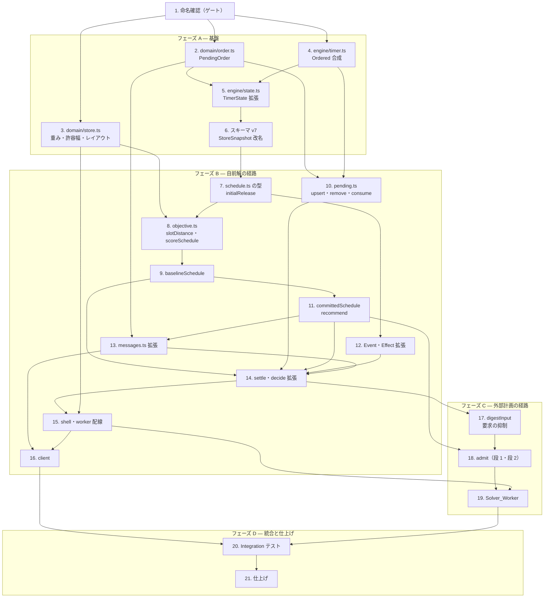

# Implementation Plan: 調理順スケジューリング（online-cook-scheduling）

## Overview

設計（`design.md`）の骨格「DO は自前の高速解を常に持ち、外部計画はゲートで検証して採用する」に厳密に対応した実装計画である。実装言語は **TypeScript（strict）**、ツールは `tooling.md` に従い **pnpm / Vitest v4（`cloudflareTest` プラグイン）/ fast-check v4 / oxlint / `tsc --noEmit`** を用いる。engine/domain の純粋テストは workerd 不要（既定 pool）、shell / DO / Solver_Worker の統合テストは Workers pool で実行する。

### 段階の切り方

**フェーズ B の完了時点で機能が成立する。** POS からオーダーが届き、推奨が出て、人が開始できる——外部ソルバーは一切要らない。フェーズ C は改善の供給源を足すだけである（要件4.4「外部は改善の供給源であって前提ではない」の実装上の帰結）。

| フェーズ | 内容 | 完了時点の状態 |
| --- | --- | --- |
| A | 基盤（命名確認・domain・状態・スキーマ v7） | 型と永続が整う。挙動は不変 |
| B | 自前解の経路 | **機能が成立する**。待ち行列と推奨が動く |
| C | 外部計画の経路 | 改善の受け入れが動く |
| D | 統合テストと仕上げ | Integration・Example が揃う |

依存順は `domain` → `engine`（型 → 採点 → 貪欲法 → 遷移）→ `shell` → `worker` → `client`。各段は前段の上に立ち、宙に浮くコードを残さない。

## Task Dependency Graph



**臨界経路**は `1 → 2/3/4 → 5 → 6 → 7 → 8 → 9 → 11 → 14 → 15 → 16`。フェーズ B の終端（タスク 16）で機能が成立するため、ここが最初の意味あるマイルストーンである。

**並行できる箇所**: タスク 2・3・4 は互いに独立（タスク 1 の後すぐ着手できる）。タスク 10（pending 操作）はタスク 8・9 と独立に進められる。タスク 12・13 もタスク 8・9 と並行できる。

```json
{
  "gate": {
    "task": "1",
    "reason": "未確認シンボルの命名確認（naming.md：公開シンボルは実装前に確認）",
    "blocks": ["2", "3", "4", "5", "6", "7", "8", "9", "10", "11", "12", "13", "14", "15", "16", "17", "18", "19", "20", "21"]
  },
  "waves": [
    { "id": 0, "phase": "基盤の型", "tasks": ["2.1", "3.1", "4.1"] },
    { "id": 1, "phase": "検証関数とサンプル", "tasks": ["2.2", "2.3", "3.2", "3.3", "3.4", "4.2"] },
    { "id": 2, "phase": "状態の拡張", "tasks": ["5.1"] },
    { "id": 3, "phase": "StoreSnapshot 改名と版上げ", "tasks": ["6.1", "6.2"] },
    { "id": 4, "phase": "移行と計画の型", "tasks": ["6.3", "6.4", "7.1"] },
    { "id": 5, "phase": "解放表と距離", "tasks": ["7.2", "8.1"] },
    { "id": 6, "phase": "採点と pending 操作", "tasks": ["7.3", "8.2", "10.1"] },
    { "id": 7, "phase": "貪欲法と語彙拡張", "tasks": ["8.3", "8.4", "8.5", "8.6", "8.7", "9.1", "10.2", "10.3", "10.4", "12.1", "12.2"] },
    { "id": 8, "phase": "合成と推奨", "tasks": ["9.2", "9.3", "9.4", "9.5", "11.1", "11.2", "13.1"] },
    { "id": 9, "phase": "ワイヤ拡張", "tasks": ["11.3", "11.4", "11.5", "13.2", "13.3"] },
    { "id": 10, "phase": "遷移の統合", "tasks": ["14.1", "14.2", "14.3", "14.4"] },
    { "id": 11, "phase": "shell 配線", "tasks": ["14.5", "14.6", "15.1", "15.2", "15.4"] },
    { "id": 12, "phase": "Order_Ingress と client の受け", "tasks": ["15.3", "16.1"] },
    { "id": 13, "phase": "client の表示と操作（フェーズ B 完了＝機能成立）", "tasks": ["16.2", "16.3", "16.4"] },
    { "id": 14, "phase": "指紋と要求の抑制", "tasks": ["17.1", "17.2"] },
    { "id": 15, "phase": "ゲートの 2 段判定", "tasks": ["17.3", "18.1", "18.2"] },
    { "id": 16, "phase": "受領遷移", "tasks": ["18.3"] },
    { "id": 17, "phase": "ゲートの検証と Solver_Worker", "tasks": ["18.4", "18.5", "18.6", "18.7", "18.8", "19.1", "19.2"] },
    { "id": 18, "phase": "wrangler 構成と制約実測", "tasks": ["19.3", "19.4"] },
    { "id": 19, "phase": "統合テスト", "tasks": ["20.1", "20.2", "20.3", "20.4", "20.5", "20.6", "20.7"] },
    { "id": 20, "phase": "仕上げと既存 spec への波及", "tasks": ["21.1", "21.2", "21.3"] }
  ]
}
```

### PBT の方針

設計の 21 プロパティを各 1 サブタスクとして実装する。テスト系サブタスク（`*` 付き）は任意で、スキップしても中核実装は成立する。ただし **Property 20（合成後の feasibility）と Property 21（開始済み品目の非復活）は正しさの穴を直接塞ぐものなので、スキップしないことを推奨する**。

### 命名確認（実装ゲート・`naming.md`）

design.md の命名節に加え、**その後の改訂で導入・変更されたシンボルもタスク 1 で確認済みとなった**。下表が実装で用いる確定シンボルである。うち 2 点は確認の結果、代案へ変更した。

| 概念 | 確定シンボル | 場所 | 状態 |
| --- | --- | --- | --- |
| 格子座標の基底 | `GridPoint` | `domain/store.ts` | 確認済み（タスク 1 で確定） |
| ユニット原点 / ユニット内オフセット | `UnitOrigin` / `SlotOffsets` / `unitOrigins` / `slotOffsets` | `domain/store.ts` | 確認済み（タスク 1 で確定） |
| slot 解放表 | `SlotRelease` / `initialRelease` / `advanceRelease` | `engine/schedule.ts` | 確認済み（タスク 1 で確定・構築関数を型名と大文字小文字だけの差にしないため改称） |
| 注文への紐づけ | `Ordered` / `orderItem` | `engine/timer.ts` | 確認済み（タスク 1 で確定・client の `ClientTimer.origin` との概念衝突を避けるため改称） |
| 距離の許容幅 | `affinityToleranceDistance` | `domain/store.ts` | 確認済み（タスク 1 で確定） |
| 上記以外 | `CookSchedule` / `PlanSlice` / `AcceptedSlice` / `baselineSchedule` / `committedSchedule` / `admit` / `InputDigest` / `digestInput` / `CookRecommendation` / `PendingOrder` / `receiveOrder` / `deliverPlan` / `OrderArrived` / `OrderCancelled` / `PlanArrived` / `RequestPlan` / `StoreSnapshot` / `PLAN_TARGET_LIMIT` / `slotDistance` | 各所 | 確認済み |

各タスクの完了条件は共通で **`pnpm typecheck` / `pnpm lint` / `pnpm test`（`--run`）がすべて通ること**。テストは watch を使わず単発実行する。`wrangler.jsonc` を変更したタスクでは **`pnpm cf-typegen` の再生成**も完了条件に含む。

## Tasks

- [x] 1. 未確認シンボルの命名確認を得る（実装ゲート）
  - Overview の命名確認表の対象 5 行（`GridPoint`・`UnitOrigin`/`SlotOffsets`/`unitOrigins`/`slotOffsets`・`SlotRelease`/`initialRelease`/`advanceRelease`・`Ordered`/`orderItem`・`affinityToleranceDistance`）についてユーザー確認を得る
  - 確認結果：解放表の構築関数と `Ordered` のフィールドの 2 点を代案へ変更し、残りは提案どおり確定した。design.md の命名節に理由を記録した
  - 確認結果を以後のタスクの確定シンボル名として用いる（`naming.md`：公開シンボルは実装前に確認）
  - _Requirements: 3.4, 1.8_

### フェーズ A — 基盤

- [x] 2. `PendingOrder` を共有契約として立てる（`domain/order.ts`・新規）
  - [x] 2.1 `PendingOrder` 型を定義
    - `externalOrderId` / `itemIndex` / `noodleType` / `firmness` / `tableId`（`null` は単独グループ）/ `arrivalTime` を持つ
    - `boilSeconds` は持たない（`StoreConfig.noodlePresets` から `noodleType` × `firmness` で引ける導出値）
    - `TimerFact` に混ぜない（`timer-model.md`：共有される事実だが別概念）
    - _Requirements: 2.2_
  - [x] 2.2 生値 → `PendingOrder` の検証関数を実装
    - 必須属性欠落・未知の品目種別・型違反を `null` へ落とす（受理拒否は呼び出し側が 400 に写す）
    - _Requirements: 1.4_
  - [x]* 2.3 検証関数の example / edge-case test
    - 欠落・未知種別・型違反の各パターンが `null`、正常値が正規化されること
    - _Requirements: 1.4_

- [x] 3. `StoreConfig` に重み・許容幅・レイアウトを追加（`domain/store.ts`）
  - [x] 3.1 `GridPoint` / `UnitOrigin` / `SlotOffsets` と新パラメータのフィールド・定数を定義
    - `GridPoint { x; y }` を中立の基底とし、`UnitOrigin = GridPoint`・`SlotOffsets = readonly [GridPoint × 6]`
    - `StoreConfig` に `orderSyncWeight`（既定 3）/ `tableSyncWeight`（2）/ `affinityWeight`（1）/ `orderSyncToleranceSeconds`（30）/ `tableSyncToleranceSeconds`（60）/ `affinityToleranceDistance`（14）/ `unitOrigins` / `slotOffsets` を追加
    - 既定レイアウトは `slotOffsets: j → (j % 2, ⌊j / 2⌋)`（3 行 × 2 列）・`unitOrigins: u → (4u, 0)`（幅 2 ＋ 離隔 2）
    - _Requirements: 3.4_
  - [x] 3.2 検証関数を `toArms` と同形で実装
    - 各重み・許容幅は型不一致・非整数・非有限・範囲外を**当該パラメータのみ**既定へ畳む
    - `unitOrigins` は要素数が `unitCount` に足りない分を既定 `(4u, 0)` で埋め、不正座標は当該要素のみ既定へ畳む。`slotOffsets` も同様
    - _Requirements: 3.4_
  - [x]* 3.3 検証関数の property test
    - **Property: 各パラメータの検証はパラメータ独立に妥当域へ畳む**（`toArms` と同じ規律）
    - **Validates: Requirements 3.4**
  - [x] 3.4 config サンプルに新キーを追記
    - `config/store-config.sample.json` に新パラメータと既定レイアウトを追加（既存キーは不変）
    - _Requirements: 3.4_

- [x] 4. engine 専用基底 `Ordered` を定義し `Timer` へ合成（`engine/timer.ts`）
  - [x] 4.1 `Ordered { orderItem }` を定義し `Timer` へ合成・`createTimer` を拡張
    - `Sequenced` / `Boilable` / `Adjusted` と同じ場所に定義。`orderItem` は `{ externalOrderId; itemIndex } | null`（`null` はアドホック麺茹で）
    - `createTimer` に `orderItem?`（省略時 `null`）を追加。domain・wire・client には露出しない
    - _Requirements: 1.8, 8.4_
  - [x]* 4.2 `createTimer` の unit test
    - `orderItem` 省略時 `null`・指定時保持を確認
    - _Requirements: 8.4_

- [x] 5. `TimerState` を拡張（`engine/state.ts`）
  - [x] 5.1 3 フィールドを追加し `EMPTY_STATE` を更新
    - `pendingOrders`（正本）/ `acceptedSlices`（採用済み計画の事実）/ `requestedDigest`（直前要求時点の指紋・`null` 可）
    - Committed_Plan・推奨・現在の指紋・Wait_Time は状態に置かない（導出値）
    - _Requirements: 2.1, 7.1, 7.2, 7.3_

- [x] 6. 永続スキーマ v7 と `StoreSnapshot` への改名（`engine/snapshot.ts` / `types.ts` / `migrate.ts`）
  - [x] 6.1 `ActiveTimersSnapshot` を `StoreSnapshot` へ改名
    - 型名と `toSnapshot` / `fromSnapshot` の注釈、`engine/effect.ts` の `Persist.snapshot` の型、`engine/migrate.ts`、`shell/store-timer-do.ts` の型注釈を追随させる
    - **ストレージキー `"activeTimers"` は据え置く**。`snapshot.ts` に歴史的経緯であることを 1 行のコメントで残す
    - _Requirements: 2.5_
  - [x] 6.2 `CURRENT_SCHEMA_VERSION` を 7 へ上げ 3 フィールドを追加
    - `types.ts` の版コメントに「v7: pendingOrders / acceptedSlices / requestedDigest を追加」を足す
    - 単一キーを維持する（`Persist` が 1 つの Effect であるという不変条件を保つ）
    - _Requirements: 2.5_
  - [x] 6.3 `migrate` の v6 → v7 を実装
    - `pendingOrders: []` / `acceptedSlices: []` / `requestedDigest: null` で埋める
    - _Requirements: 2.5_
  - [x]* 6.4 移行の example test
    - v6 の永続値から v7 へ移行し、既存 Timer の `endTime` / `adjustment` / `boiledAt` が不変であることを確認
    - _Requirements: 2.5_

### フェーズ B — 自前解の経路（ここまでで機能が成立する）

- [x] 7. 計画の型と slot 解放表を実装（`engine/schedule.ts`・新規）
  - [x] 7.1 `Placement` / `PlanSlice` / `CookSchedule` / `AcceptedSlice` / `SlotRelease` を定義
    - `PlanSlice` は分解軸を名に焼き付けない（現行の軸は Table_Group で `tableKey` に持つ）
    - `CookSchedule { slices; score }`、`AcceptedSlice extends PlanSlice`
    - _Requirements: 6.3, 7.1_
  - [x] 7.2 `initialRelease` / `advanceRelease` を実装
    - `initialRelease(running, now, slotCount)`：各 slot の最早解放時刻を、その slot を占める Timer の実効 `endTime`（`adjustedEndTime`）で初期化。空き slot は `now`
    - **boiled は実効 `endTime` の時点で解放済みとして扱う**（湯切りで釜は空く。`Complete` は UI 上の確認であって釜の占有ではない）
    - `advanceRelease(release, placements)`：確定した配置列で解放表を進める
    - `SlotId` ↔ slot 番号の写像は既存 `slotOf` の規約に従い、二度定義しない
    - _Requirements: 3.3_
  - [x]* 7.3 `initialRelease` の example test
    - running / boiled / 空き slot の 3 パターンで解放時刻が期待どおりであること。boiled の slot が `now` 以下（解放済み）になること
    - _Requirements: 3.3_

- [x] 8. 距離と目的関数を実装（`engine/objective.ts`・新規）
  - [x] 8.1 `slotDistance`（オクタイル距離の整数版）を実装
    - 合成座標 `position(i) = unitOrigins[⌊i / 6⌋] + slotOffsets[i % 6]` を求め、`10 × max(dx, dy) + 4 × min(dx, dy)`
    - 平方根を用いない（整数で閉じる。改善判定を丸め誤差に晒さない）
    - _Requirements: 3.4_
  - [x] 8.2 `scoreSchedule` を実装
    - `Σ Wait_Time + w_table × Σ(同卓の提供時刻最大差の 60 秒 超過分) + w_order × Σ(同一オーダーの 30 秒 超過分) + w_affinity × Σ max(0, slotDistance − 14)`
    - 品目間の距離は**代表 slot**（`slotIds` のうち座標の辞書式最小）間で測り、Table_Group の距離項はグループ内の全ペアの和
    - `PlanSlice` ごとの部分和も返す（全項が Table_Group 内に閉じるため総和は全体値に厳密一致）
    - アドホック麺茹で（`orderItem === null`）は `Σ Wait_Time` に寄与しない
    - _Requirements: 3.1, 3.2, 3.4_
  - [x]* 8.3 **Property 3: 目的関数は Plan_Unit ごとに厳密に加法分解される**
    - **Validates: Requirements 6.2**
  - [x]* 8.4 **Property 16: 目的関数値は整数で閉じる**
    - **Validates: Requirements 6.2**
  - [x]* 8.5 **Property 17: 距離尺度は要求された順序を満たす**（縦横隣接 < 斜め隣接 < 2 マス直線・対称・自己 0）
    - **Validates: Requirements 3.4**
  - [x]* 8.6 **Property 18: 既定レイアウトはユニット境界の離隔を反映する**（同一ユニット内 ≤ 異なるユニット、後者は真に正）
    - **Validates: Requirements 3.4**
  - [x]* 8.7 **Property 19: 許容距離内の配置はペナルティ 0**（既定 14 で縦横隣接・斜め隣接がともに 0）
    - **Validates: Requirements 3.4**

- [x] 9. `baselineSchedule` を実装（`engine/schedule.ts`）
  - [x] 9.1 決定的な貪欲法を実装
    - 計画対象は（`arrivalTime` 昇順, `externalOrderId` 昇順, `itemIndex` 昇順）で整列し先頭 `PLAN_TARGET_LIMIT = 64` 件
    - **境界で Table_Group が割れる場合は計画対象に入った品目のみで `PlanSlice` を成す**（ソフト制約の評価も対象品目の間だけ）
    - Table_Group 単位に（最早 `arrivalTime`, 識別子）順で配置。k 本すべてが空く最早時刻が最小の slot 群を選び、許容幅内に提供時刻を揃える（揃わない分はソフト制約違反として計上のみ）
    - `Slot_Affinity` は最早時刻が同点のとき全ペア `slotDistance` 和が最小の組を選び、さらに同点なら代表 slot の index 昇順で断つ
    - 配置ごとに `advanceRelease` で解放表を進める。`pending` が空なら空の計画を返す
    - **解放表を引数に取る**（合成の尾部再実行にそのまま使えるようにする）
    - _Requirements: 4.1, 4.2, 4.3, 4.5, 11.1, 11.2_
  - [x]* 9.2 **Property 1: Baseline_Plan は常に feasible**
    - **Validates: Requirements 4.2**
  - [x]* 9.3 **Property 2: Baseline_Plan は列挙順に依存しない**
    - **Validates: Requirements 4.3**
  - [x]* 9.4 **Property 15: 計画対象は 64 件で打ち切られる**
    - **Validates: Requirements 11.2**
  - [x]* 9.5 example test（代表シナリオ）
    - 単独オーダー 1 品目 / 同卓 3 品目・同一オーダー 2 品目（許容幅内に揃い affinity 0）/ 釜が埋まっている（開始時刻が後ろへ倒れる）/ 64 件境界で Table_Group が割れる
    - _Requirements: 3.4, 4.2, 11.2_

- [x] 10. `PendingOrder` の集合操作を実装（`engine/pending.ts`・新規）
  - [x] 10.1 `upsertOrder` / `removeOrder` / `consumeOrder` を実装
    - `upsertOrder(pending, running, arrival)`：同一 `externalOrderId` が在れば `arrivalTime` を保持して内容を置換。内容同一なら集合を変えない（冪等）。**`orderItem` が一致する生きた Timer を持つ品目は置換から除外する**（二重調理の防止）
    - `removeOrder`：対応が無ければ集合を変えない（no-op）。開始済み Timer を自動キャンセルしない
    - `consumeOrder`：人の開始で当該品目を除く
    - _Requirements: 1.3, 1.5, 1.6, 1.8, 8.4_
  - [x]* 10.2 **Property 8: 到着の upsert は冪等で、起点を保持する**
    - **Validates: Requirements 1.3, 1.8**
  - [x]* 10.3 **Property 21: 開始済み品目は upsert で復活しない**（スキップ非推奨）
    - **Validates: Requirements 1.3, 1.8**
  - [x]* 10.4 example test
    - 一部開始済みの注文へ全品目を含む modification が届いても開始済み品目が復活しないこと。存在しない `externalOrderId` のキャンセルが no-op であること
    - _Requirements: 1.6, 1.8_

- [x] 11. `committedSchedule` と `recommend` を実装（`engine/commit.ts` / `engine/recommend.ts`・新規）
  - [x] 11.1 `committedSchedule` を「尾部再実行」で実装
    - 採用済み `PlanSlice` のうち陳腐化しないものを計画順に取る。**`startAt < now` も陳腐化として扱う**（人が推奨時刻に開始しなかった事実。時刻起動の失効判定は設けない）
    - その接頭辞の配置で解放表を進め、**残りの計画対象に `baselineSchedule` を再実行**して連結する
    - 切り貼りをしない（接頭辞と尾部が同一 slot の時間帯を重複させないことを構成から保証する）
    - **陳腐化判定 (a)(b) を独立した述語関数として切り出す。** design は「`committedSchedule` の陳腐化判定は `admit` と同一の (a)(b)」と定めており、タスク 18.1（フェーズ C）がこの述語を**再利用する**。ここで切り出しておかないと同じ概念が 2 箇所に書かれる
    - _Requirements: 7.5_
  - [x] 11.2 `recommend` を実装
    - 確定計画から「次に開始すべき品目・slot・開始タイミング」を導出する。導出値ゆえ永続しない
    - 推奨に対して Alarm を張らない（Alarm は Boil_Sync の発火のみが用いる）
    - _Requirements: 8.1, 8.2_
  - [x]* 11.3 **Property 20: 合成後の計画は feasible である**（スキップ非推奨）
    - **Validates: Requirements 3.3, 6.2, 7.5**
  - [x]* 11.4 **Property 6: 陳腐化した unit は Baseline で置き換わる**
    - **Validates: Requirements 7.5**
  - [x]* 11.5 **Property 13: 推奨は Alarm を張らない**
    - **Validates: Requirements 8.2, 11.4**

- [x] 12. Event と Effect の語彙を拡張（`engine/event.ts` / `engine/effect.ts`）
  - [x] 12.1 `Event` に 3 種を追加し `Start` を拡張
    - `OrderArrived` / `OrderCancelled` / `PlanArrived` を追加。`Start` に `orderItem`（省略可）を追加
    - _Requirements: 1.7, 6.1, 8.4_
  - [x] 12.2 `Effect` に `RequestPlan` を追加
    - `Persist` 先頭の不変条件を壊さない（`RequestPlan` は末尾に置く）
    - _Requirements: 5.1, 5.8_

- [x] 13. ワイヤ表現を拡張（`domain/messages.ts`）
  - [x] 13.1 `snapshot` を拡張
    - `pendingOrders`（超過分も含む全量）と `recommendations` を追加。新しい ServerMessage 種別は足さない
    - `CookRecommendation` 型を定義（導出値ゆえ永続しない）
    - _Requirements: 2.3, 2.4, 8.1, 8.5_
  - [x] 13.2 `config` を `StoreConfig` 全項目へ拡張
    - `arms` / `toleranceRatio` / 新 5 パラメータ / `unitOrigins` / `slotOffsets` を載せる（全配信への方針転換）
    - _Requirements: 3.4_
  - [x] 13.3 `ClientMessage.start` に `externalOrderId` / `itemIndex`（省略可）を追加
    - 省略時はアドホック麺茹で
    - _Requirements: 8.3, 8.4_

- [x] 14. `settle` と `decide` を拡張（`engine/settle.ts` / `engine/decide.ts` / `engine/start.ts`）
  - [x] 14.1 `settle` の確定結果の同一性判定を拡張
    - `isSameConfirmedResult` に **Pending_Order 集合**と**採用済み `PlanSlice` 列**を加える（加えないとオーダー到着が握り潰される）
    - _Requirements: 7.6_
  - [x] 14.2 `assembleEffects` に Committed_Plan と推奨を同乗させる
    - `committedSchedule` → `recommend` を通して `snapshot` へ載せる
    - _Requirements: 2.3, 8.1_
  - [x] 14.3 `settle` に `mayRequestPlan` を追加（フェーズ C の受け皿・この段では常に要求を出さない）
    - 署名だけ通し、`RequestPlan` の生成は**タスク 17.2** で実装する
    - _Requirements: 5.5, 5.7_
  - [x] 14.4 新遷移を実装し `decide` へ配線
    - `arriveOrder`（`upsertOrder` → `settle`）/ `cancelOrder`（`removeOrder` → `settle`）を新規に、`startTimer` に `consumeOrder` と `orderItem` の写しを足す
    - `decide` の `switch` に 3 イベントを追加（網羅は型が保証する）
    - 既存の拒否事由は変えない
    - _Requirements: 1.7, 8.3, 8.4, 9.4_
  - [x]* 14.5 **Property 12: Effect 列の不変条件**（先頭 `Persist`・`RequestPlan` は末尾のみ）
    - **Validates: Requirements 5.8**
  - [x]* 14.6 **Property 14: Boil_Sync の不変**（`synchronize` の入出力が導入前後で一致）
    - **Validates: Requirements 9.2, 9.4**

- [x] 15. shell と Worker を配線（`shell/store-timer-do.ts` / `worker.ts`）
  - [x] 15.1 設定ロードを新パラメータへ拡張し、snapshot の組み立てを 1 箇所へ寄せる
    - `ensureConfigLoaded` / `applyStoreConfig` が新 7 項目を確立し、`decide` 呼び出し時に渡す
    - `config` 配信に全項目を載せる
    - **hydration 側 snapshot の仮置き（`pendingOrders: []` / `recommendations: []`）を実値化し、broadcast と同一の射影関数へ組み立てを集約する**（15.2 で Order_Ingress が入ると仮置きのままでは hydration と broadcast が食い違い AC 2.4 が破れる。15.2 着手前の前提）
    - _Requirements: 2.4, 3.4_
  - [x] 15.2 `receiveOrder`（Order_Ingress の受け口）を実装
    - 到着・キャンセルを `OrderArrived` / `OrderCancelled` へ写す。永続確定後にのみ受理を応答し broadcast する
    - 不正ボディは 400 で集合を変えない
    - _Requirements: 1.2, 1.4, 1.5_
  - [x] 15.3 `worker.ts` に Order_Ingress 経路と認可を追加
    - `POST /s/{storeId}/orders`（到着・キャンセル）。`ORDER_INGRESS_TOKEN` の Bearer 定数時間照合。不一致・欠如は 401 で DO へ到達させない
    - `ADMIN_TOKEN` とは別の secret（POS へ運用系の書き込み口を開かない）
    - **`ORDER_INGRESS_TOKEN` は秘密ゆえ `wrangler.jsonc` の `vars` に値を置かない。** 既存 `ADMIN_TOKEN` の扱いに倣い、本番は `wrangler secret put ORDER_INGRESS_TOKEN`、ローカル dev は `.dev.vars` に置く。`wrangler.jsonc` へはコメントで投入手段を記すだけに留める
    - `Env` 型へ反映するため `pnpm cf-typegen` を再生成する
    - _Requirements: 1.1_
  - [x] 15.4 `parseClientMessage` の `start` を拡張（欠落していた写し）
    - `ClientMessage.start` の `externalOrderId` / `itemIndex` を検証して `Start` イベントの注文品目の組（`origin`）へ写す。欠落・不正時は組を作らずアドホック麺茹でとして扱う
    - これが無いと推奨からの開始が `consumeOrder` を踏まない（engine は受け取れるが shell が組を作らない）
    - _Requirements: 8.4_

- [x] 16. client を実装（`src/client`）
  - [x] 16.1 `snapshot` の `pendingOrders` / `recommendations` を受ける
    - 既存の `timers` の扱いは変えない。導出はレンダリング時に行い状態を増やさない
    - _Requirements: 2.4_
  - [x] 16.2 待ち行列と推奨を表示
    - Pending_Order を `arrivalTime` 昇順で一覧。計画対象外（65 件目以降）も表示するが推奨は付かない
    - 推奨は担当スロット範囲で絞る（既存 `assignment.ts` の絞り込みに倣う）。**指示ではなく提案**として見せる
    - 推奨開始時刻の到来で自動開始しない。過ぎた `startAt` は次回再評価まで過去時刻のまま表示する
    - boiled と推奨が同一 slot に重なる場合は既存の重畳の扱いに倣う（新しい重畳規則を作らない）
    - _Requirements: 2.4, 8.1, 8.2, 8.5_
  - [x] 16.3 開始操作に `externalOrderId` / `itemIndex` を添える
    - 推奨から開始する経路のみ添える。推奨と異なる操作も従来どおり通す
    - _Requirements: 8.3, 8.4_
  - [x] 16.4 `config` の追加項目を受ける
    - 表示・導出にのみ用い変更要求を送らない。`unitOrigins` / `slotOffsets` は受け取るが現時点で用途なし
    - _Requirements: 3.4_

### フェーズ C — 外部計画の経路

- [x] 17. `digestInput` を実装し要求の抑制を配線（`engine/digest.ts`・新規 / `engine/settle.ts`）
  - [x] 17.1 `digestInput` を実装
    - 計画対象の Pending_Order・Running_Timer の必要事実（id / slotIds / 実効 `endTime`）・パラメータを正準順序へ整列して整数演算で畳む
    - 現在の指紋は導出値であり状態に昇格させない
    - _Requirements: 5.3, 5.6_
  - [x] 17.2 `settle` に `RequestPlan` の生成を実装
    - `mayRequestPlan` が真かつ現在の指紋が `requestedDigest` と異なるときだけ、Effect 列の**末尾**に `RequestPlan` を積み、新しい指紋を状態へ書く
    - 計画受領の遷移は `mayRequestPlan = false`（要求の連鎖を作らない）
    - _Requirements: 5.4, 5.5, 5.6, 5.7, 5.8_
  - [x]* 17.3 **Property 9: 要求の抑制は指紋の一致と厳密に対応する**
    - **Validates: Requirements 5.6, 5.7**

- [x] 18. `admit` を実装（`engine/admit.ts`・新規）
  - [x] 18.1 段 1（PlanSlice ごとの接頭辞判定）を実装
    - (a) 陳腐化A：対象品目が現在も計画対象の Pending_Order に在る
    - (b) 陳腐化B：対象の Table_Group に計画が知らない新着が加わっていない
    - **(a)(b) はタスク 11.1 で切り出した述語関数を再利用する**（新規に書き直さない・同じ概念は一箇所）
    - (c) feasibility：ハード制約を満たす
    - (d) 改善：部分和が Committed_Plan の対応部分和より真に良い（同値は棄却）
    - 最初に落ちた `PlanSlice` 以降を棄却する（接頭辞採用）。外部への照会をしない
    - _Requirements: 6.2, 6.3, 6.4, 6.7_
  - [x] 18.2 段 2（合成後の総和による全体判定）を実装
    - 候補接頭辞で `committedSchedule` を 1 回走らせ、総和が現行 Committed_Plan より真に良いかを判定する
    - **悪化するなら接頭辞を短くせず全棄却する**（棄却は無害。段階的探索は計算量上限を押し上げるため採らない）
    - _Requirements: 6.2_
  - [x] 18.3 `receivePlan` 遷移を実装し `decide` へ配線
    - `PlanArrived` を受けて `admit` → 採用があれば `acceptedSlices` を更新して `settle`（`mayRequestPlan = false`）
    - 全棄却なら状態を変えず `Persist` も `Broadcast` も出さない
    - 解析不能・スキーマ不正は全体棄却
    - _Requirements: 6.1, 6.5, 6.6, 10.3_
  - [x]* 18.4 **Property 4: 確定計画は単調に改善する**（段 2 が担保）
    - **Validates: Requirements 6.2**
  - [x]* 18.5 **Property 5: 同値の外部計画は棄却される**
    - **Validates: Requirements 6.2, 6.6**
  - [x]* 18.6 **Property 7: 接頭辞採用の feasibility は自己完結する**
    - **Validates: Requirements 6.2, 6.3**
  - [x]* 18.7 **Property 10: 決定性は四つ組に対して立つ** / **Property 11: 冪等**
    - **Validates: Requirements 7.3, 7.4**
  - [x]* 18.8 example test
    - 接頭辞の一部が陳腐化して 1 番目のみ採用され尾部が再実行される / 各部分和は改善するが合成後の総和が悪化して全棄却される
    - _Requirements: 6.2, 6.3_

- [x] 19. Solver_Worker の経路を通す（`src/solver/`・新規 / `wrangler.solver.jsonc`・新規）
  - [x] 19.1 Solver_Worker のエントリを実装（骨格）
    - 受理応答（202）を即返し、計算を `ctx.waitUntil` で抱える
    - **自前の打ち切り予算 5 秒**で止める。`limits.cpu_ms` は既定のまま据え置く（実効の壁は `waitUntil` の 30 秒で `cpu_ms` を上げても伸びない）
    - 完了時に `env.STORE_TIMER_DO.idFromName(storeId)` の `deliverPlan` を呼ぶ
    - **この段の計画生成は経路確認用の最小実装**（自前解と同値の計画を返す＝ゲートで棄却される）。最適化アルゴリズム本体は本 spec のスコープ外
    - _Requirements: 12.1, 12.2, 12.3, 12.4, 12.5_
  - [x] 19.2 `deliverPlan` RPC と `RequestPlan` の実行を shell に実装
    - shell は `env.SOLVER.fetch()` の 202 のみを await し、計算完了を待たない。ボディに `storeId` を付ける（engine は `storeId` を知らない）
    - `deliverPlan` は受領を `PlanArrived` として `decide` へ流す
    - 送出失敗を Timer 本体へ伝播させない。DO 内で再試行を抱えない
    - in-flight の追跡状態を持たず、応答監視の Alarm も張らない
    - _Requirements: 5.2, 6.1, 10.2, 10.4, 12.2, 12.3_
  - [x] 19.3 `wrangler` 構成を追加
    - `wrangler.solver.jsonc` を新設。`wrangler.jsonc` に `services: [{ binding: "SOLVER", service: "yude-men-solver" }]` を追加し `pnpm cf-typegen` を再生成
    - Solver_Worker 側に `STORE_TIMER_DO` バインディングを与える（復路 RPC のため）
    - _Requirements: 12.1_
  - [x]* 19.4 Workers の実行制約への適合を確認
    - `wrangler deploy --dry-run --outdir` で圧縮後サイズを実測し 10 MB 以内、起動 1 秒以内を確認する（Rust → WASM を採る場合はこの実測が採用の前提条件）
    - _Requirements: 12.5, 12.6_

### フェーズ D — 統合テストと仕上げ

- [x] 20. Integration テスト（Workers pool）
  - [x]* 20.1 hydration と 2 端末の一致
    - 一方が再接続して `snapshot` を再取得すると Pending_Order と推奨が他端末と一致する
    - _Requirements: 2.4, 8.5_
  - [x]* 20.2 `Persist` 失敗の抑止と回復
    - `storage.put` を失敗させると broadcast が出ず直前の確定状態が保たれる。後続の hydration で回復する
    - _Requirements: 10.5_
  - [x]* 20.3 hibernation 越しの復元
    - hibernate 後のイベントで Pending_Order と採用済み `PlanSlice` が永続から復元される
    - _Requirements: 2.5_
  - [x]* 20.4 Order_Ingress の認可・拒否・確定順序
    - トークン不一致・欠如で 401（DO へ到達しない）。必須属性欠落・未知種別・型違反で 400（両集合が不変）
    - **受理応答と broadcast が `storage.put` 成功後であること**（put を失敗させると受理応答も broadcast も出ない）
    - _Requirements: 1.1, 1.2, 1.4_
  - [x]* 20.5 外部の往復と不到達の無害性
    - shell が 202 のみを await して event 処理を終える。`deliverPlan` で DO が wake し `PlanArrived` が流れる。Solver_Worker を落としても推奨が出続け Timer 本体の計時が乱れない
    - _Requirements: 4.4, 5.2, 10.1, 12.2, 12.3_
  - [x]* 20.6 採用経路の end-to-end
    - **テストから `deliverPlan` を直接呼び、改善する計画を注入する**（骨格 Solver は自前解と同値の計画しか返さないため、実機上で採用経路が一度も通らない穴を埋める）
    - 採用 → `acceptedSlices` 更新 → `Persist` → broadcast → 再接続 hydration で採用結果が残ることを確認する
    - 続く状態変化での再評価で、陳腐化しない `PlanSlice` が維持され尾部が再実行されることも確認する
    - _Requirements: 6.5, 7.1, 7.5, 2.4_
  - [x]* 20.7 スキーマ v6 → v7 移行
    - v6 の永続値を置いて起動すると 3 フィールドが埋まり既存 Timer の挙動が変わらない
    - _Requirements: 2.5_

- [x] 21. 仕上げ
  - [x] 21.1 `pnpm typecheck` / `pnpm lint` / `pnpm test --run` を全通し
    - `Effect` / `Event` union の網羅が型で保証されていること（未処理種別が `never` に落ちる）を確認
    - _Requirements: 5.1, 5.8_
  - [x] 21.2 `hibernation-observability` の改訂 spec を起こす（本 spec では実装しない）
    - 計画受領（`deliverPlan`）による wake を観測対象の分類へ足す必要がある旨を、あちらの spec の改訂として起票する
    - **本 spec のサブタスクとして直接編集しない。** 波及先の要件変更であり、あちらの requirements の改訂とユーザー確認を経る
    - _Requirements: 11.5, 12.3_
  - [x] 21.3 `operation-history-log` の改訂 spec を起こす（本 spec では実装しない）
    - 採用/棄却の記録（段 1・段 2 のどちらで落ちたか、目的関数の内訳）を残したい旨を、あちらの spec の改訂として起票する
    - **これはあちらの要件変更である。** `Operation_Kind` は 5 種の閉集合（`boil-started` / `boiled` / `completed` / `cancelled` / `adjusted`）で、Producer の出力対象は「Timer_Persist が確定させた Timer 状態の差分だけ」に限定され（あちらの AC 2.1）、属性も Store_Id / Timer事実 / Operation_Kind / Event_Time に限定されて導出値を含めない（あちらの AC 2.16）。計画の採用/棄却はこのどれにも収まらず、あちらの Requirement 2・3 に正面から抵触する
    - 記録が得られれば `affinityWeight` の校正と「段 2 で棄却されたときに接頭辞の段階的探索を足すか」の判断材料になる（design の残された実測項目）。**得られなくても本 spec は成立する**（校正は既定値のままでも動く）
    - _Requirements: 6.2_

## Notes

### スコープの境界

**最適化アルゴリズム本体は本 spec のスコープ外である。** タスク 19.1 の Solver_Worker は経路を通す骨格で、計画生成は自前解と同値の値を返す（ゲートで棄却される）。これは意図した段階分けで、要件12 が「本書は DO 側が何を要求し、何を検証し、何を保証するか」に集中すると定めていることの実装上の帰結である。

実際の探索アルゴリズム（メタヒューリスティック・必要なら Rust → WASM）は、フェーズ B の完了後に自前解と厳密最適の差を実測してから、別 spec として起こす判断になる。差が事業的に意味を持たなければ Solver_Worker は骨格のままでよい。

### スキップしないことを推奨するテスト

`*` 付きサブタスクは任意だが、次の 2 つは正しさの穴を直接塞ぐものである。

- **Property 20（タスク 11.3）— 合成後の feasibility。** 採用接頭辞と自前解の尾部を切り貼りすると同一 slot の時間帯が重複しうる。尾部を接頭辞の解放表から再実行する実装が正しいことを、これだけが検証する。
- **Property 21（タスク 10.3）— 開始済み品目の非復活。** POS が全品目を含む modification を再送したときの二重調理を防ぐ。現場で起きる事故が直接ここに対応する。

### 受容した限界（実装時に混乱しないための再掲）

- **完了済み品目は upsert から保護されない。** `Ordered.orderItem` による保護は Timer が生きている間（running / boiled）に限る。明示完了後の modification で提供済み品目が pending へ復活しうる。完全に塞ぐには無限に増える台帳が必要なため持たない（design.md の限界注記）。
- **未開始品目の Wait_Time は近似である。** Boil_Sync による開始後の調整（±h_i）を織り込まない。改善判定は両計画を同じ近似の上で比較するため一貫する。
- **外部ソルバーは非決定的でよい。** 時間打ち切り・乱数により同一入力から異なる計画が届くことを許容する（AC 12.7）。決定性を要求するのは DO 側の計算のみ。

### 既存 spec への波及（タスク 21.2 / 21.3 は起票のみ）

**本 spec のタスクで他 spec を直接編集しない。** タスク 21.2 / 21.3 は波及先の改訂を**起票する**ところまでで、要件変更はあちらの spec でユーザー確認を経る。**起票の本体は `design.md` の「波及先への申し送り」にある**（抵触する AC 番号・シンボル名・改訂箇所・候補名。下記は要約）。

- `hibernation-observability` — 計画受領による wake が観測対象に 1 種増える。あちらの分類の変更
- `operation-history-log` — 採用/棄却の記録は**あちらの要件変更**である（`Operation_Kind` の閉集合・Producer の出力対象が Timer 状態差分に限定・属性が導出値を含まない、の 3 点に抵触）。本 spec はこの記録に依存しない——得られなくても既定値のまま成立する
- `synchronized-boil-adjustment` — 機構は変えない（Property 14 で検証）。`StoreConfig` 全配信への方針転換の改訂注記は design.md の 2 箇所に既に添えた（追加の変更は不要）
