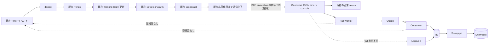
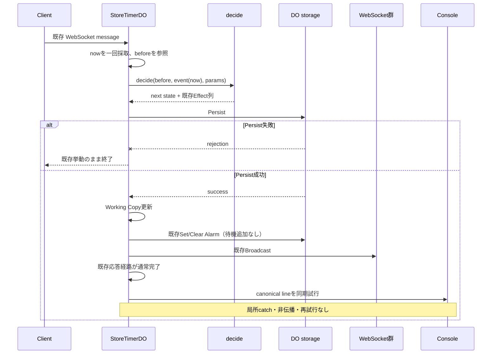
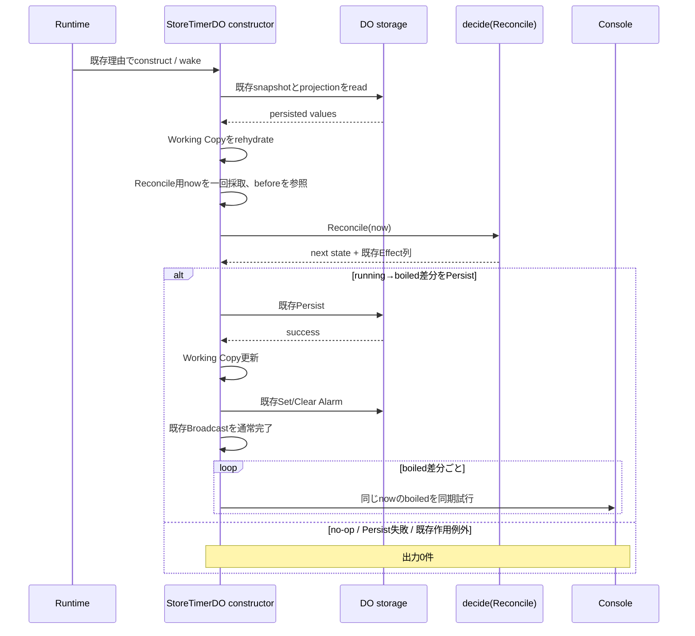
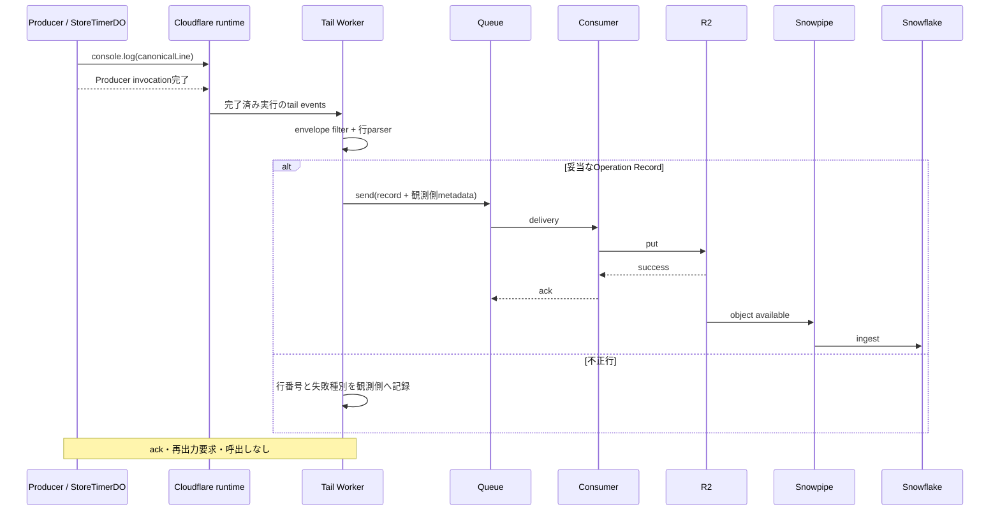
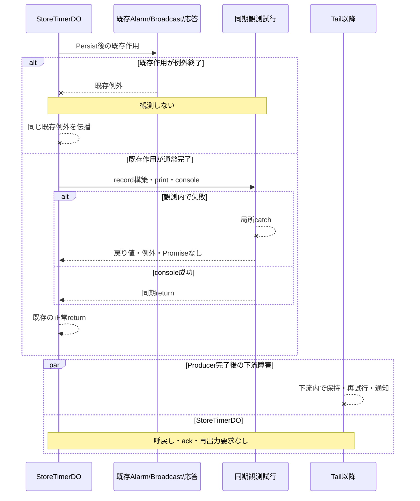

# 技術設計書 — 操作履歴ログ（operation-history-log）

## Overview

本機能は、確定した Timer 操作を best-effort telemetry として観測し、R2 を経由して Snowflake で店舗の生産能力と傾向を推定可能にする。正本は最新の `requirements.md` であり、Operation Record は Timer 状態の正本、復旧元、完全履歴ではない。

最優先事項は Timer 本体への非干渉である。`StoreTimerDO` は、既存 Timer イベントが起動した同じ invocation で、既存の Timer Persist、Working Copy 更新、Alarm、Broadcast、応答が通常完了した後に限り、確定差分から Canonical JSON Line を組み立てて同期 `console.log` を試行する。record 構築、直列化、console の失敗はその場の `try/catch` で捨て、既存の戻り値または例外へ伝播させない。観測の待機、再試行、非同期資源、永続状態は持たない。

第一搬送経路は次の一方向である。

```text
StoreTimerDO console → Tail Worker → Queue → Consumer → R2 → Snowpipe → Snowflake
```

Tail Worker を利用できない環境では、観測できたログだけを `Logpush → R2 → Snowpipe → Snowflake` で搬送する。どちらの経路も Producer または `StoreTimerDO` を呼び戻さない。

### Goals

- 観測 ON/OFF と観測失敗の全てで、TimerState、Timer Persist、Working Copy、既存 Effect とその順序、Alarm、Snapshot、応答、既存例外を不変にする。
- Timer Persist に成功した確定差分だけを、本体の通常完了後に一差分一行で出力試行する。
- 既存理由の rehydrate に伴う Reconcile で running から boiled を Persist した場合だけ、同じ constructor invocation 内で boiled を出力試行する。
- canonical printer、未知属性許容 parser、行単位失敗を純粋ロジックとして定義する。
- 下流で重複、欠落、孤児、競合を評価し、品質閾値を満たす範囲だけを信頼済み分析に使う。
- R2 90日、Snowflake 25 UTC暦月、Observed telemetry の月次 99% / 15分、30分・60分通知、機密業務データのアクセス制御を設計に含める。

### Non-goals

- Timer 状態と telemetry を一体で確定または rollback しない。
- Operation Record を権威履歴、復旧元、連番付き台帳にしない。
- `Record_Seq`、`seq`、`nextSeq`、outbox、配送状態、再送状態を Operation Record または `StoreTimerDO` に持たない。
- `StoreTimerDO` に観測専用 KV、storage key、counter、Alarm、Queue binding、Promise、`waitUntil`、timer、interval、connection を追加しない。
- 観測を Effect に追加せず、既存 Effect の型、集合、順序を変えない。
- 観測目的の construct、wake、rehydrate、storage read、Reconcile、Timer Persist を起こさない。
- 下流から Alarm、scheduled event、Queue callback、RPC、Worker 間 binding、HTTP、DO stub、WebSocket その他の経路で `StoreTimerDO` を呼ばない。
- `src/observe` の debug harness と型、flag、出力関数を共用しない。
- Producer が完全に出力できなかった telemetry の総数を推定しない。完全未観測率は測定不能として扱う。

## Architecture

### 現行実装に沿った挿入位置

現行 `StoreTimerDO` は `decide` が返す Effect を `runEffects` で順に実行する。状態変化がある Effect 列は `Persist → SetAlarm または ClearAlarm → Broadcast` であり、`Persist` の `storage.put` 成功後にだけ `workingCopy` を更新する。この列、`applySideEffect`、既存 Alarm 再試行規律、WebSocket 応答を変更しない。

観測に渡す材料は、各既存入口で読み取った次の値だけである。

- `decide` 直前の確定済み TimerState
- `runEffects` 正常復帰後の確定済み TimerState
- 既存イベント種別
- その `decide` に渡した一回採取済み `now`
- Effect 列に `Persist` が存在し、その実行が成功したという同じ invocation 内の結果
- 検証済み Store Id

観測は `runEffects` の内部 Effect には入れない。呼出し側は、Effect 列に `Persist` があり、`runEffects` が Persist 成功後の既存 Alarm/Broadcast まで通常完了した場合だけ、return の直前に同期出力を試行する。Effect 空の no-op、拒否、Persist 失敗、既存作用の例外では試行しない。

現行 `SetAlarm` / `ClearAlarm` は Promise を待たずに起動する。この既存挙動も変更しない。「Alarm の通常完了」は、現行の同期呼出しが throw せず戻ることを意味し、その Promise の完了待ちを新設する意味ではない。

`toWireTimer` が engine Timer から既存 TimerFact へ実効 `endTime` を射影する唯一の正本である。観測側は `endTime + adjustment` を再実装せず、この既存射影と `boiledAt` の必要値だけを読む。`TimerFact`、engine `Timer`、TimerState、ActiveTimersSnapshot には観測属性を追加しない。

### 全体構成



破線の console 分岐は Timer の成功条件ではない。Producer 内で許可する外向き作用は `console.log(canonicalLine)` だけであり、Tail 以降は別の Worker または外部データ基盤として実行する。

### 通常操作 sequence



Start は追加された Timer の確定後事実から `boil-started`、Adjust は対象 Timer の確定後事実から `adjusted`、Complete と Cancel は除去された Timer の確定前事実からそれぞれ `completed` と `cancelled` を作る。明示操作に伴う再同期で他 Timer の adjustment が変わっても、それを別の明示操作 record へ水増ししない。

### rehydrate / Reconcile sequence



観測は constructor を起動しない。既存理由で constructor が動いた場合だけ、その Reconcile の結果を同じ `blockConcurrencyWhile` 内で観測し得る。Reconcile 用 Event Time は constructor が `decide` へ渡すために一回採取した `now` であり、後続 fetch または WebSocket message の時刻とは共有しない。

### Tail 搬送 sequence



Cloudflare 公式資料の要約:

- [Tail Workers](https://developers.cloudflare.com/workers/observability/logs/tail-workers/) は Producer Worker の実行終了後に自動起動し、その実行の console logs、例外等を受け取る。利用対象は Workers Paid / Enterprise tiers である。
- 同資料は Producer の Wrangler 設定に `tail_consumers` と接続先 Worker 名を置く構成を示す。Tail Worker は別 Worker であり、自身の bindings を利用できるため、Queue 送信は Tail 側に置く。
- [Wrangler configuration](https://developers.cloudflare.com/workers/wrangler/configuration/) が Workers 設定 schema の公式参照先である。実装時はリポジトリ内の導入済み Wrangler schema と公式資料の両方でキーを検証する。
- [Logpush の R2 destination](https://developers.cloudflare.com/logs/logpush/logpush-job/enable-destinations/r2/) は Cloudflare logs を R2 へ直接送る構成を提供する。Tail を利用できない環境の縮退経路に使う。

### 失敗 sequence



## Components and Interfaces

### 1. StoreTimerDO の既存入口

観測対象入口は、状態変化を Persist し得る既存 WebSocket message、既存 Alarm、既存理由の constructor Reconcile である。通常 fetch の接続確立、projection 更新、debug instrumentation は Operation Record の対象にしない。

各入口は `decide` 前の state と一回採取した `now` を保持し、既存処理を最後まで実行する。観測成否を読まず、観測結果で分岐せず、観測を `finally` へ置かない。`finally` は既存例外経路でも観測を実行してしまうため禁止する。

### 2. 確定差分の純粋導出

純粋導出は platform API、storage、console を参照しない。必要な readonly 値だけを一つの平坦な入力で受け、Operation Record 列を返す。TimerState や Working Copy への書込み能力は渡さない。大きな wall/region 階層、汎用 sink、callback 抽象は作らない。

概念入力は次の内容で十分である。

```ts
// 擬似型。公開名は未確定であり、実装前にユーザー確認を要する。
type OperationObservation = {
  readonly storeId: string;
  readonly eventTime: number;
  readonly eventKind: "Start" | "Adjust" | "Complete" | "Cancel" | "AlarmFired" | "Reconcile";
  readonly before: TimerState;
  readonly after: TimerState;
};
```

実装では `before` / `after` を直接渡すか、必要な Timer 値を先に readonly の by-value へ写すかを最小差分で選ぶ。いずれの場合も導出関数は入力を変更せず、`workingCopy` setter、storage、env、`ctx` へ到達できない。

### 3. 同期 console 終端

同期終端は「純粋導出 → canonical printer → 一 record 一 `console.log`」だけを実行する。外側から待たれる Promise を返さず、Queue や R2 を知らない。各 record の一回目の試行で失敗したらその record を捨て、再試行しない。後続 record の試行可否を一件の失敗に連動させないため、record ごとに局所 `try/catch` を置く。

console の引数は Canonical JSON Line 一個だけである。接頭辞、追加 object、複数行のまとめ出力、debug line を混ぜない。

### 4. Tail Worker

Tail Worker は接続対象 Producer の完了済み tail events を受け、次の envelope filter を順に適用する。

1. 想定 Producer script の event である。
2. log level が `log` である。
3. console 引数列が一要素で、その要素が string である。
4. string が一行であり、Operation History Codec で妥当な Operation Record へ解析できる。

全条件を満たす行だけを Queue へ送る。未知の console 出力、`src/observe` の debug JSON、不正行は Queue に送らない。不正候補は tail event 内の位置を1始まり行番号として解析失敗種別と共に観測側へ残す。Tail 側の Queue binding、非同期送信、再試行は Data Platform の能力であり、Producer env には追加しない。

### 5. Queue と Consumer

Consumer は Queue message を R2 に保存し、保存成功後だけ Queue へ ack する。保存前 ack は行わない。Queue の再配送、dead-letter 方針、Consumer の失敗記録は全て Data Platform 内に閉じる。Consumer から Producer へ到達する routing、binding、stub、URL、WebSocket は構成しない。

R2 object は canonical line と観測側 metadata を保持できる。metadata の例は初回観測時刻、到着時刻、producer script、trace 情報、canonical hash である。これらは Operation Record の属性でも Timer 本体 identity でもない。

### 6. Snowpipe と Snowflake

Snowpipe は R2 object を Snowflake に取り込み、raw arrival、重複収束後 record、品質判定を分けて保持する。raw record は欠落、重複、孤児、競合の根拠なので品質判定後も削除しない。分析 view は Store Id と期間ごとに品質閾値を適用し、best-effort 推定であることを常に表示する。

### 公開シンボル候補と確認境界

以下は概念を説明する候補であり、確定名ではない。型、公開関数、設定 flag、Worker 名、binding 名、Queue 名を実装する前に、候補と概念境界をユーザーへ提示して確認を得る。

| 概念境界 | 候補名 | 表す範囲 |
| --- | --- | --- |
| 観測入力 | `OperationObservation` | store、event、before/after、eventTime の readonly 値 |
| record 判別共用体 | `OperationRecord` | kind ごとの閉じた既知属性 |
| 確定差分の導出 | `recordsFromCommittedDiff` | 純粋な before/after → record 列 |
| canonical 一行化 | `printCanonicalOperationLine` | known-only printer |
| 複数行解析 | `parseOperationLines` | 行別 record または失敗 |
| 同期終端 | `tryWriteOperationLines` | 局所 catch を持つ console 一点 |
| Tail event 抽出 | `operationLinesFromTailEvents` | envelope filter 後の文字列列 |

`Manager`、`Handler`、`Service`、`Util`、`process`、`handle` を新しい名前に使わない。候補 module の audience は Producer と Data Platform に限定し、client/server 共有の `TimerFact` へ観測関心を混ぜない。

## Data Models

### Operation Record

JSON の既知属性と固定順は次のとおりである。

| 順序 | 属性 | 制約 | kind |
| ---: | --- | --- | --- |
| 1 | `storeId` | 既存契約を満たす non-empty string | 全て |
| 2 | `timerId` | non-empty string | 全て |
| 3 | `operationKind` | `boil-started` / `boiled` / `completed` / `cancelled` / `adjusted` | 全て |
| 4 | `eventTime` | 0より大きい整数 epoch millisecond | 全て |
| 5 | `slotIds` | 1件以上の non-empty string、順序維持 | 全て |
| 6 | `noodleType` | non-empty string | 全て |
| 7 | `firmness` | 既存 domain 契約を満たす値 | 全て |
| 8 | `startTime` | 0より大きい整数 epoch millisecond | `boil-started` のみ |
| 9 | `endTime` | 0より大きい整数 epoch millisecond | `boil-started` / `boiled` / `adjusted` |
| 10 | `boiledAt` | 0より大きい整数 epoch millisecond | `boiled` のみ |

kind ごとの属性集合は閉じている。

- `boil-started`: 共通属性 + `startTime`, `endTime`
- `boiled`: 共通属性 + `endTime`, `boiledAt`
- `adjusted`: 共通属性 + 変更後 `endTime`
- `completed`, `cancelled`: 共通属性のみ

自然人へ直接対応する属性、`Record_Seq`、`seq`、`nextSeq`、残り時間、duration、progress その他の導出値は含めない。

### 差分から kind への写像

| 確定条件 | record | Timer事実の取得元 | 件数 |
| --- | --- | --- | ---: |
| Start で Timer が追加された | `boil-started` | 確定後 Timer | 追加ごとに1 |
| 任意の既存イベントで `boiledAt: null → value` | `boiled` | 確定後 Timer | 差分ごとに1 |
| Complete で Timer が除去された | `completed` | 確定前 Timer | 対象ごとに1 |
| Cancel で Timer が除去された | `cancelled` | 確定前 Timer | 対象ごとに1 |
| Adjust で対象の firmness または実効 endTime が変わった | `adjusted` | 確定後 Timer | 対象ごとに1 |
| rejection / no-op / Persist不在 / Persist失敗 / 本体例外 | なし | なし | 0 |

boiled の判定は起動元が AlarmFired か Reconcile かで分岐せず、running→boiled の確定差分だけを見る。複数 Timer が一括発火した場合は各 Timer を一行にする。Reconcile が Alarm の張り直しや再同期だけを Persist しても、running→boiled がなければ Reconcile record は0件である。

各 record の Event Time は、その差分を決めた `decide` に渡した `now` と同じ値である。観測側で時計を読み直さない。

### Canonical JSON Line

Printer は入力 object をそのまま `JSON.stringify` せず、kind に許可された既知属性だけを上表の順で新しい object へ写してから一回直列化する。これにより未知属性は出力されず、属性順が一意になる。文字列 escape と整数表記は標準 `JSON.stringify` に従う。

一行は UTF-8 の妥当な JSON object で、BOM、埋め込み改行、先頭末尾または区切り周辺の余分な空白を持たない。複数 record のテキスト表現は LF 一個で区切り、record と各 `slotIds` の相対順を保つ。

### Unknown-tolerant parser と行失敗

Parser は LF で行へ分け、最後まで全行を独立に解析する。JSON object の member 出現回数を保持できる字句・構文解析を行い、通常の `JSON.parse` だけで既知属性重複を見落とさない。未知属性は値を検証対象にせず捨てるが、既知属性は kind 別の必須・許可・型・値制約を検証する。

一行に複数の問題がある場合は、次の優先順位で一件だけ返す。

1. 不正 JSON
2. 既知属性重複
3. 必須属性欠落
4. Operation Kind 不許可属性
5. 既知属性型違反
6. 既知属性値違反

結果は1始まり行番号を持つ判別共用体とし、不正行の後続行も処理する。`parse(print(record))` は全既知値と `slotIds` 順を保存する。canonical line に限り `print(parse(line))` が UTF-8 byte 単位で一致する。未知属性を含む非canonical入力は parse 後に既知属性だけへ正規化されるため、byte 一致の対象ではない。

### Envelope filtering

Tail envelope 自体は Operation Record ではない。script、level、console 引数数と型を先に確認し、その後に文字列一行を parser へ渡す。Cloudflare trace metadata、tail timestamp、canonical hash は別の観測側列へ保存し、printer の known-only 出力へ混ぜない。

### 相関・重複・品質

一次相関候補は `(storeId, timerId, operationKind, eventTime)` で作り、`slotIds`、`noodleType`、`firmness` と kind 別時刻の整合を確認する。判定が曖昧な場合だけ canonical hash または trace metadata を補助に使う。補助値は Operation Record の identity、連番、Timer 永続 identity ではない。

同一と判定できる到達が `n` 件なら、raw arrival は `n` 件を保持し、分析用 record は1件、`duplicateCount = n - 1` とする。次を別々の品質状態として保持する。

- 欠落: 観測済み lifecycle から存在を復元できる期待 record がない。
- 孤児: boil-started または復元可能な開始事実へ相関できない。
- 競合: 同一一次候補に両立しない既知属性がある。
- 重複: 同一と判定できる record が複数到達した。

品質率の定義は requirements 5.9〜5.13 をそのまま Snowflake 計算の正本とする。分母0は数値0ではなく算出不能である。閾値超過または算出不能の店舗・期間は信頼済み分析から除外し、対象率と理由を表示する。

Producer が出力できなかった総数は下流から観測できないため、console log 自体の完全未観測率は測定不能である。lifecycle 内欠落率とは明確に分ける。

### SLO・保持・機密性

- `firstObservedAt`: Tail Worker または Logpush が妥当な record を初めて観測した時刻。
- `firstSnowflakeAt`: 重複除外前後を関連付けた Snowflake 初回到達時刻。
- 月次到達 SLO: `firstObservedAt` の UTC 暦月ごとに、重複除外後の母集団のうち15分以内に初回到達した割合を算出し、母集団1件以上なら99%以上とする。0件月は判定対象外である。
- 通知: Snowflake 未到達の最古 record が30分帯へ入った遷移から5分以内に警告を一回、60分以上へ入った遷移から5分以内に重大通知を一回出す。Store Id、Timer Id、kind、Event Time を含める。
- R2: 保存成功から90日で削除開始、24時間以内に完了する。
- Snowflake: 初回到達月を第1月とする25 UTC暦月終了後に削除開始、24時間以内に完了する。
- Operation Record は個人情報ではない機密業務データに分類する。record、品質指標、分析結果は承認済み分析担当者だけに許可し、拒否はデータと承認状態を変更しない。
- SLO 表示には母集団数、15分以内件数、率または対象外、Timer 操作成功を保証しない旨を併記する。

## No-wake / No-rehydrate Proof Obligations

非干渉は意図ではなく、次の証明義務としてレビューとテストに残す。

### O1: Producer capability の閉包

観測 module が参照できる作用は同期 `console.log` だけである。`cloudflare:workers`、`ctx`、env binding、storage、Alarm、Queue、R2、WebSocket、HTTP client、DO namespace を import または引数で受けない。純粋部分は platform 非依存である。

### O2: 起動原因ゼロ

観測機能は fetch route、WebSocket frame、Alarm、scheduled event、Queue callback、RPC、Worker 間 binding の受口を追加しない。したがって観測 ON が新しい Producer invocation を作る経路は存在しない。

### O3: 永続読書きゼロ

観測 module は storage key を定義せず、既存 state の readonly 値だけを同じ invocation 内で受ける。Operation Record のための storage read、write、list、transaction は0件である。rehydrate は既存イベント処理に必要な現行 `ensureLoaded` だけであり、観測から呼べない。

### O4: 逆方向到達不能

Tail Worker と Consumer の設定に `STORE_TIMER_DO` namespace、Producer URL、Worker 間 binding、DO stub 作成能力を与えない。Data Platform の IAM と network 設定にも Producer 呼出し権限を付けない。Queue ack は Consumer→Queue だけで終わる。

### O5: invocation 終了時の資源ゼロ

同期終端は Promise、`waitUntil`、timer、interval、subscription、connection、Alarm を作らない。局所 `try/catch` 後に保持される closure または mutable state もない。したがって Producer invocation 終了時の観測由来 live resource は0件である。

### O6: Reconcile の因果関係

boiled 出力の必要条件は、既存理由で constructor が起動済みであり、その constructor が採取した `now` で Reconcile を実行し、running→boiled を含む state を Persist し、既存作用が通常完了したことである。出力から constructor、rehydrate、Reconcile へ戻る edge は存在しない。

### O7: 比較 trace

同一の初期永続状態、外部イベント列、各 `decide` の時刻列に対し、観測 OFF、成功、record 構築失敗、printer 失敗、console 失敗を比較する。以下の trace が byte/value 単位で一致しなければならない。

1. `decide` の outcome、次 TimerState、既存 Effect 列
2. Persist 回数、payload、順序、成否
3. Working Copy の更新列と最終値
4. SetAlarm / ClearAlarm の引数と順序
5. Broadcast payload、宛先、順序
6. Snapshot、応答、正常 return
7. 既存例外の型、内容、発生位置
8. construct、wake、rehydrate、storage read、Alarm 予定のうち、観測に因果を持つ追加件数が0

プラットフォームが任意に instance を廃棄する時点は比較対象にしない。ただし観測コードまたは下流経路が廃棄以外の追加起動原因を作っていないことは O1〜O6 で別途検証する。

## Error Handling

| 失敗点 | Producer console | Timer 本体 | 下流 |
| --- | ---: | --- | --- |
| 入力不正 / `decide` rejection | 0 | 現行の破棄または error 応答 | なし |
| no-op / Persist Effect 不在 | 0 | 現行 state と応答 | なし |
| Timer Persist rejection | 0 | Working Copy 不変、現行後続中断 | なし |
| Alarm invocation の Persist 失敗 | 0 | 現行 retryCount による throw / rearm を維持 | なし |
| Persist 後の既存 Alarm 同期 throw | 0 | 同じ例外を伝播 | なし |
| Persist 後の Broadcast stringify / send throw | 0 | 同じ例外を伝播 | なし |
| record 構築失敗 | 当該record 0 | 正常結果を維持 | 欠落許容 |
| printer 失敗 | 当該record 0 | 正常結果を維持 | 欠落許容 |
| console throw | 当該record は失敗、再試行0 | 正常結果を維持 | 欠落許容 |
| Tail envelope / parser 失敗 | Producer 完了済み | 影響なし | Queueへ送らず失敗分類を保持 |
| Queue send 失敗 | Producer 完了済み | 影響なし | Tail / Queue 方針内で処置 |
| R2 put 失敗 | Producer 完了済み | 影響なし | ackせずQueue再配送方針へ |
| Snowpipe / Snowflake 失敗 | Producer 完了済み | 影響なし | staging、通知、再取込を下流内で実施 |
| Tail 利用不可 | 通常どおりbest-effort console | 影響なし | Logpush縮退、未観測のbackfillなし |

観測失敗の診断を Producer の別 console 行へ書くと tail filtering と本体コストを増やすため行わない。必要な診断は Tail 以降で保持する。複数 boiled のうち一行が失敗しても、後続差分は各一回だけ試行し、一度失敗した行を再試行しない。

## Correctness Properties

PBT は platform 作用を含まない純粋部分だけに適用する。`StoreTimerDO`、console、Tail 起動、Queue、R2、Snowpipe、Snowflake、保持、アクセス制御を mock で純粋 property に見せかけず、integration、static、deployment smoke test で検証する。

### Property 1: 確定差分と record の一対一対応

*For all* 有効な before/after TimerState、event kind、正の Event Time について、導出される record は定義済みの対象差分だけに対応する。Start/boiled/Adjust は after facts、Complete/Cancel は before facts を使い、対象差分ごとにちょうど一件、他は0件であり、全件の Event Time は入力値と一致する。

**Validates: Requirements 2.1, 2.2, 2.3, 2.4, 2.5, 2.6, 2.7, 2.8, 2.11, 2.12, 2.13**

### Property 2: Operation Record schema の閉包

*For all* Property 1 が生成した record について、既知属性集合は kind ごとの定義と完全一致し、全値制約を満たし、自然人属性、`Record_Seq`、`seq`、`nextSeq`、追加導出値を含まない。

**Validates: Requirements 2.16, 2.17, 3.1, 3.2, 3.3, 3.4, 3.5, 3.6, 3.7**

### Property 3: Canonical printer の一意性

*For all* 有効な record 列について、printer は存在する既知属性だけを規定順で出力し、標準 JSON の escape と整数表記を使い、BOM・埋め込み改行・余分な空白を持たない。複数行は LF 一個で区切り、record と `slotIds` の順序を保つ。

**Validates: Requirements 3.8, 3.9, 3.10, 3.11**

### Property 4: 未知属性に対する既知意味の不変性

*For all* 有効な JSON record と既知名に衝突しない任意の未知属性について、未知属性を追加した解析結果の既知属性と `slotIds` 順は追加前と一致する。

**Validates: Requirements 3.12**

### Property 5: 行 parser の失敗分類と継続性

*For all* 妥当行、不正 JSON、既知属性重複、必須欠落、不許可属性、型違反、値違反を混ぜた行列について、入力一行につき結果一件を入力順で返し、失敗は1始まり行番号と規定種別を持ち、後続行も失わない。

**Validates: Requirements 3.13, 3.14, 3.15, 3.16, 3.17**

### Property 6: Codec round-trip

*For all* 有効な record について `parse(print(record))` は既知属性値と `slotIds` 順を保存する。*For all* Canonical JSON Line について `print(parse(line))` は入力 UTF-8 bytes と一致する。

**Validates: Requirements 3.18, 3.19**

### Property 7: 相関候補の閉じた構成

*For all* record 集合について、一次候補に同居するのは Store Id、Timer Id、kind、Event Time が全て一致する record だけであり、Timer事実が両立しない候補を整合済みにしない。hash と trace metadata の有無は Operation Record identity を変えない。

**Validates: Requirements 5.1, 5.2, 5.3, 5.4**

### Property 8: 重複収束と品質状態

*For all* raw arrival multiset について、同一 record が `n >= 1` 件なら分析用一件、到達数 `n`、重複数 `n - 1` となる。欠落、孤児、競合、重複は別状態となり、判定前後で raw arrival multiset は変化しない。

**Validates: Requirements 5.5, 5.6, 5.7**

### Property 9: 品質率と信頼判定

*For all* 非負の lifecycle、arrival、candidate 集計と品質閾値について、4品質率は requirements の分子・分母に一致し、分母0は算出不能となる。全対象率が算出可能かつ閾値以下の場合に限り信頼済み分析へ含める。

**Validates: Requirements 5.9, 5.10, 5.11, 5.12, 5.13, 5.15**

### Property 10: UTC月次到達 SLO

*For all* Observed telemetry 到達列について、重複除外後の record は `firstObservedAt` の UTC 暦月へ一度だけ属し、15分以内件数と母集団から月次率を得る。母集団0の月は率を作らず判定対象外となる。

**Validates: Requirements 6.1, 6.2, 6.3, 6.4**

### Property 11: Tail envelope filtering

*For all* tail event envelope 列について、想定 script、`log` level、一引数 string、妥当な一行という全条件を満たす候補だけが、入力順を保って Queue 入力候補になる。

**Validates: Requirements 4.3, 4.4**

### 要件 mapping

| Requirements | 設計上の保証 | 主検証 |
| --- | --- | --- |
| 1.1〜1.4 | 同期 console 一点、局所catch、状態/配送能力なし、成功条件非結合 | O1〜O5、StoreTimerDO integration、static test |
| 1.5〜1.7 | Application trace、純粋遷移、既存型/Effect不変 | O7、golden type test、integration |
| 1.8〜1.11 | 起動原因・逆経路・live resourceゼロ、非決定廃棄の除外 | O2〜O7、runtime counter、deployment graph check |
| 2.1〜2.8 | Persist成功差分とkind写像、Reconcile制約 | Properties 1〜2、constructor integration |
| 2.9〜2.15 | 本体通常完了後、既存例外優先、時刻共有、観測起動ゼロ | sequence test、fault injection、O2・O6・O7 |
| 2.16〜2.17 | 属性限定、Store Id、自然人属性なし | Property 2、schema snapshot |
| 3.1〜3.19 | kind別shape、canonical、unknown tolerance、行失敗、round-trip | Properties 2〜6、失敗優先順位 example |
| 4.1〜4.4 | Tail第一経路、Producer完了後起動、filtering | Property 11、Tail fixture、plan smoke |
| 4.5〜4.8 | R2成功後ack、Snowpipe、Logpush縮退、backfillなし | Queue/R2 integration、deployment smoke |
| 4.9〜4.15 | 一record一console、Producer下流呼出し0、一方向、ack限定 | O1・O4、call trace、config graph test |
| 5.1〜5.7 | 相関、補助metadata、重複、品質状態、raw保持 | Properties 7〜8 |
| 5.8〜5.15 | best-effort表示、品質率、完全未観測率、閾値除外 | Property 9、report examples |
| 6.1〜6.6 | Observed telemetry SLO、30/60分通知 | Property 10、clock-controlled integration |
| 6.7〜6.9 | R2/Snowflake保持 | lifecycle policy smoke、境界test |
| 6.10〜6.13 | 機密分類、承認制御、SLO表示 | access integration、report snapshot |

## Testing Strategy

### 1. Pure property-based tests

Vitest v4 と fast-check v4 を使い、Properties 1〜11を純粋 module に対して各100回以上実行する。独自 generator framework は作らない。主な生成対象は次のとおり。

- 0..複数 Timer、全 operation kind、複数同時 boiled、before/after の追加・除去・変更
- Unicode、quote、backslash、制御文字、複数 `slotIds`、正整数 timestamp 境界
- 未知属性、既知属性重複、不許可属性、型・値違反、妥当/不正の混在複数行
- 重複 arrival の順列、欠落、孤児、競合、分母0、閾値境界
- UTC 月境界、15分ちょうど、その前後
- tail envelope の script、level、引数数、引数型、行妥当性の組合せ

PBT は純粋関数の入力と出力だけを検証する。console、storage、Queue、R2、時計 API、Cloudflare runtime を property generator へ持ち込まない。

### 2. Codec example / edge tests

- 複数の失敗条件を同じ行へ入れ、規定優先順位の最初だけを返す。
- 未知属性の重複は無視し、既知属性の重複だけを拒否する。
- empty line、BOM、CRLF、埋め込み改行、末尾LFの扱いを契約どおり固定する。
- `boil-started` / `boiled` / `adjusted` / `completed` / `cancelled` の golden bytes を固定する。
- printer が input object の未知属性、`seq`、`nextSeq` を出力しない。

### 3. StoreTimerDO integration tests

Workers pool で観測 OFF と ON を同じ初期 snapshot、イベント列、時計列に対して実行し、O7 の全 trace を比較する。

- Start、Adjust、Complete、Cancel、AlarmFired、constructor Reconcile を含める。
- record 構築、printer、console の各 throw を独立注入する。
- rejection、no-op、Persist失敗は console 0件。
- Persist成功後、既存 Set/Clear Alarm、Broadcast、応答作用の後だけ console を試行する。
- 既存 Broadcast の stringify / send throw では console 0件で同じ例外を得る。
- Alarm Persist失敗時の retry/rearm 分岐と例外を観測 OFF と一致させる。
- Reconcile は既存 constructor でだけ実行され、running→boiled の各差分を一行、差分なしを0行とする。
- Reconcile と後続 WebSocket message が別々に採取した `now` を各 record に使う。
- TimerFact、Timer、TimerState、ActiveTimersSnapshot、Effect、Persist payload に観測属性がない。
- 観測後の未完了 Promise、timer、interval、connection、追加 Alarm が0である。

### 4. No-wake architecture tests

- Producer 観測 module の import graph に runtime capability と下流 client がない。
- root Producer 設定に Queue/R2 binding、観測用 DO binding、観測 Alarm がない。
- Tail / Consumer 設定に `STORE_TIMER_DO` と Producer 呼出し先がない。
- Tail または Consumer から Producer へ向かう URL、stub、RPC、WebSocket、scheduled/Alarm callback がない。
- 観測 ON/OFF の runtime counters で、観測に由来する construct、wake、rehydrate、storage read、Alarm 予定が全て0差分である。
- `src/observe` の型、flag、出力関数との import 共有がない。

### 5. Tail / Queue / R2 integration tests

- Producer 完了済み tail fixture から envelope filter を通る canonical line だけを抽出する。
- 不正行は Queue 0件で、1始まり位置と失敗種別を観測側へ残す。
- Queue send failure は Producer trace に現れない。
- R2 put 成功後だけ ack、失敗時は ack 0件で再配送対象となる。
- duplicate delivery でも raw arrival を残し、分析用一件へ収束する。
- Tail/Consumer の全 fixture に Producer 逆呼出しがない。

### 6. Snowflake / 運用 integration tests

- R2 fixture を Snowpipe が取り込み、`firstObservedAt` と `firstSnowflakeAt` を関連付ける。
- 欠落、孤児、競合、重複を別状態で保存し、raw record を保持する。
- 品質閾値超過または算出不能の店舗・期間を信頼済み分析から除外する。
- 完全未観測率を測定不能と表示し、lifecycle 内欠落率と混同しない。
- 15分 SLO、母集団0、30/60分通知、一連続状態一回の時刻境界を検証する。
- R2 90日、Snowflake 25 UTC暦月の期限前後と24時間以内削除を検証する。
- 承認済み分析担当者だけが record、品質指標、分析結果を読める。拒否後もデータと承認状態が不変である。

### 7. Config / deployment smoke tests

- root `wrangler.jsonc` の `tail_consumers` が実在する Tail Worker を指す。
- Tail Worker の Queue producer binding、Consumer の Queue consumer / R2 binding を各設定正本で検証する。
- Queue→Consumer→R2 の疎通後にだけ Producer attachment を有効化する。
- Tail 利用プランと対象環境を事前確認し、不可なら Logpush→R2 の疎通を確認する。
- Logpush縮退で未観測期間の backfill job、Producer再出力、DO再起動が存在しない。
- Snowpipe stage、保持 policy、通知、access role を deployment smoke で確認する。
- root `wrangler.jsonc` 変更時は `pnpm cf-typegen` を実行し、`pnpm typecheck`、`pnpm lint`、`pnpm test`、`pnpm build` を最終確認する。

## Deployment and Configuration Ownership

### 所有境界

| 設定 | 正本 | 所有者 | Producer への能力追加 |
| --- | --- | --- | --- |
| Producer本体、DO、`tail_consumers` attachment | root `wrangler.jsonc` | Timer application | Tail attachmentのみ。Queue/R2なし |
| Tail Worker、Queue producer binding | Data Platform側 Worker設定 | Data Platform | なし |
| Queue consumer、R2 binding、再配送/dead-letter | Data Platform側 Worker設定 | Data Platform | なし |
| Logpush job と R2 destination | Cloudflare account設定 | Data Platform | なし（構成対象環境0件のため現時点で作らない） |
| R2 lifecycle 90日 | R2 bucket policy | Data Platform | なし |
| Snowpipe、Snowflake table/view、25 UTC月保持 | `config/operation-history-snowflake/*.sql`（宣言的正本）＋ Snowflake 側の適用状態 | Data Platform | なし |
| 品質閾値、15分SLO、30/60分通知、access role | Data Platform運用設定 | Data Platform | なし |

root `wrangler.jsonc` は Producer 設定の SSOT であり、実装時に公式 schema で検証した `tail_consumers` attachment を持つ。Tail、Queue、Consumer、R2 の設定を root Producer 設定へ同居させず、Data Platform 側の設定正本へ置く。これにより `StoreTimerDO` の env から Queue/R2/Consumer へ到達できないことを設定構造でも保証する。

設定キー、Worker 名、binding 名、Queue 名はこの設計で確定しない。実装時に導入済み Wrangler の `config-schema.json` と [公式 Wrangler configuration](https://developers.cloudflare.com/workers/wrangler/configuration/) を照合する。root `wrangler.jsonc` を変更したら generated `Env` 型を `pnpm cf-typegen` で更新する。

### Plan prerequisites

第一経路の前提は対象環境が Workers Paid または Enterprise で、Tail Workers を利用可能なことである。デプロイ前に account plan、Tail Worker 作成権限、対象 Producer への attachment 可否を確認する。利用不可なら第一経路を部分的に模倣せず、Logpush縮退を選ぶ。

Logpush縮退は観測できたログだけを R2 へ送る best-effort 経路である。Tail unavailable 期間の欠落を後から埋めず、Producer に Queue、outbox、再送、再出力入口を追加しない。対象 Workers logs dataset と R2 destination の利用可否は環境ごとに Data Platform が確認する。

### 環境別搬送の確定結果（タスク1.2 / 1.3 の承認記録）

- 対象環境はいずれも Tail Workers を利用できる。全環境で第一経路（Producer → structured console log → Tail Worker → Queue → Consumer → R2 → Snowpipe → Snowflake）を用いる。
- Logpush縮退の構成対象環境は0件である。ゆえに Logpush job と R2 destination を Cloudflare account 設定として作らない。要件4.7 / 4.8 の前件「Tail_Worker を利用できない環境である」は成立しない。
- 将来 Tail Workers を利用できない環境が現れた場合は、構成の前にタスク1.3 の確認（対象環境、Workers logs dataset、R2 destination、観測不能期間の欠落許容）をやり直す。縮退を足すときも Producer 設定の SSOT（root `wrangler.jsonc`）へ Queue／R2 binding と再出力入口を置かず、Data Platform 所有の account 設定として分離する。
- Logpush 固有の smoke fixture は作らない。両経路に共通する不変点、すなわち「観測できた canonical line だけが R2 へ到達する」「未観測分を補完しない」「観測できた lifecycle 内欠落は測るが console log 自体の完全未観測率は測定不能として分けて表示する」を、実在する第一経路の上で `tests/operation-history/unobserved-telemetry.integration.test.ts` が検証する（タスク12.3・要件4.7 / 4.8 / 5.8 / 5.14）。
- Tail unavailable と structured console log 未観測のいずれの期間についても、補完機構を持たない。backfill job、Producer への再出力要求、outbox、DO 再起動、観測目的の rehydrate／Reconcile／Persist はいずれも0件であり、欠落は欠落のまま残す（要件1.8 / 1.9 / 2.15 / 4.8 / 4.13 / 4.14）。この0件は `tests/operation-history/no-backfill.static.test.ts` が全 Wrangler 設定、`src` 全体、CI、Producer 側の搬送経路分岐、root 設定の切戻し手順に対して機械検査する（タスク12.2）。

### Snowflake 取込の確定結果（タスク13.1）

Snowflake は外部サービスゆえリポジトリからは適用できない。リポジトリに置くのは Data Platform 所有の宣言的定義（`config/operation-history-snowflake/01-raw-arrival-ingest.sql`・`02-first-arrival-association.sql`）と、ユーザーが実行する手順（`docs/operation-history/snowflake-ingest-procedure.md`）である。object 名は `OPERATION_HISTORY.RAW` の下に `CANONICAL_OPERATION_LINE`（file format）、`OPERATION_RAW_ARRIVALS`（stage）、`OPERATION_RAW_ARRIVAL`（table）、`OPERATION_RAW_ARRIVAL_PIPE`（pipe）、`OPERATION_TELEMETRY_FIRST_ARRIVAL`（view）とする。

- **canonical と観測側 metadata の分離**: 一到達一行の table で、canonical 一行を `CANONICAL_LINE` に文字列のまま持ち、観測側 metadata を別の列に持つ。VARIANT へ parse しないのは属性順の正規化で canonical bytes が失われるためである（要件3.19 / 5.4 / 5.7）。
- **object の user metadata は Snowflake から読めない**。stage object について読めるのは `METADATA$FILENAME` / `FILE_ROW_NUMBER` / `FILE_CONTENT_KEY` / `FILE_LAST_MODIFIED` / `START_SCAN_TIME` だけで、R2 `customMetadata`（S3 の `x-amz-meta-*` も同様）は含まれない。ゆえに `firstObservedAt` / `queueMessageId` / `deliveryAttempt` は object key（文法の正本は `src/data-platform/raw-arrival-consumer.ts`）から読み、`arrivedAt` は `METADATA$FILE_LAST_MODIFIED`（R2 put 時刻）で代え、`canonicalHash` は canonical 一行から再計算する。いずれも補助情報であって identity ではない（要件5.3 / 5.4）。key を作る側と読む側の文法の一致は `tests/operation-history/snowflake-ingest.static.test.ts` が検査する。
- **S3 互換 stage は Snowpipe auto-ingest に対応しない**。pipe は `AUTO_INGEST = FALSE` とし、Snowpipe REST の `insertFiles` で駆動する。`ALTER PIPE ... REFRESH` は7日以内の復旧用途に限る。`insertFiles` を定期的に呼ぶ駆動主体は未実装であり、タスク13.7 / 15.2 へ引き渡す。駆動主体を足すときも Producer 設定（root `wrangler.jsonc`）へ Snowflake credential と binding を置かない（要件4.13 / 4.14）。
- **責務の分離**: タスク13.1 が作るのは raw arrival 層と要件6.1 の関連付け（`firstObservedAt` ↔ `firstSnowflakeAt`）だけである。到達数、重複数、欠落／孤児／競合、品質率、SLO 判定、保持、access 制御はタスク13.2〜13.6 が別の責務として足し、`correlation.ts`・`quality.ts`・`slo.ts` の定義を SQL 側で読み替えない。raw arrival は判定の前後で削除しない。

### Snowflake 品質配線の確定結果（タスク13.2）

相関、重複収束、四品質状態、四品質率、信頼済み分析の範囲を
`config/operation-history-snowflake/03-correlation-and-convergence.sql`・`04-quality-rates-and-trusted-analysis.sql`
の宣言的定義として置き、適用手順は `docs/operation-history/snowflake-quality-procedure.md` に置く。判定は
raw を読むだけの view で行い、`RAW` schema（取込と raw 保持）と `ANALYSIS` schema（判定）を分ける。

- **object 名**: `OPERATION_HISTORY.ANALYSIS` の下に `OPERATION_ARRIVAL`（raw 一到達を canonical 既知属性と
  観測側補助 metadata に開く）、`OPERATION_CONVERGED_RECORD`（収束後 record・`ARRIVAL_COUNT` /
  `DUPLICATE_COUNT` / `IS_ORPHAN`）、`OPERATION_CORRELATION_CANDIDATE`（一次相関候補・`TIMER_FACTS_CONSISTENT`）、
  `OPERATION_EXPECTED_LIFECYCLE_RECORD`（期待 lifecycle 記録・`IS_MISSING`）、`OPERATION_QUALITY_THRESHOLD`
  （運用者が定める四閾値の table）、`OPERATION_QUALITY_COUNT`（八集計）、`OPERATION_QUALITY_RATE`（四品質率）、
  `OPERATION_TRUSTED_ANALYSIS_SCOPE`（included / excluded と除外理由）。
- **定義の一意性**: 率の名前（`lifecycleMissingRate` / `duplicateRate` / `orphanRate` / `conflictRate`）、集計の
  名前（`quality.ts` の `counts` と同名同義）、状態の語（`calculated` / `not-calculable` /
  `denominator-is-zero` / `rate-not-calculable` / `threshold-exceeded` / `included` / `excluded`）を純粋層と
  共有し、SQL 側で別の語や別定義を作らない。一致は `tests/operation-history/snowflake-quality.static.test.ts`
  が機械検査する（要件5.1〜5.7 / 5.9〜5.13 / 5.15）。
- **一次相関 key と収束 key**: 候補 key は Store Id、Timer Id、Operation Kind、Event Time の四つだけ。収束 key は
  それに record 本体の Timer 事実（`slotIds` / `noodleType` / `firmness` と kind 別時刻）を足したものである。
  canonical 表現が既知属性だけを固定順で表すため、この収束 key の一致は canonical bytes の一致と同値になる。
  hash・object key・queue message id・delivery attempt は補助情報であり、どちらの key にも入れない（要件5.3 / 5.4）。
- **期間（period）の粒度**: Operation Record 内の `eventTime`（期待記録は復元された Event Time）の UTC 暦日。
  観測側時刻を期間の根拠にしない（要件5.4）。欠落と孤児の**判定自体**は店舗×timer 単位で観測全体に対して
  行い、期間は集計の割り当てにしか使わない。日境界を跨ぐ lifecycle を人工的に孤児にしないためである。暦月の
  集計は本 view を上位で丸める（期間の定義を二つ作らない）。
- **期待 lifecycle 記録の復元規則**: 観測できた boil-started 一件から boiled 一件（Event Time = `endTime`）の
  存在を復元する。既存の表明（`tests/operation-history/unobserved-telemetry.integration.test.ts` の
  `recoverableLifecycleRecords`）と同じ規則であり、SQL 側で新しい規則を発明しない。completed / cancelled は
  running からも到達し得るため、その存在から他の記録を復元しない。復元元は収束後 record ゆえ、重複到達を
  期待記録へ二重計上しない。復元可能な開始事実は観測できた boil-started に限る（`correlation.ts` の
  `recoverableStarts` 既定が空であり、この経路に他の出所がない）。
- **分母 0**: `NULLIF` で `VALUE` を NULL に保ち、`STATUS = 'not-calculable'`・
  `NOT_CALCULABLE_REASON = 'denominator-is-zero'` を持たせる。数値 0 で埋めない（要件5.13）。
- **閾値**: 実値は運用判断ゆえ SQL 正本に持たず、運用者が手順書に従って四行を入れる。四行が揃わない品質率は
  `threshold-not-configured` として除外側へ倒す。これは五つ目の品質状態ではなく、四閾値が揃うことを要求する
  `quality.ts` の型を SQL で表せないことへの構成上の guard であり、信頼を主張できない場合に fail closed する。
- **raw 保持**: `03` / `04` は view（と閾値 table）だけで、`DELETE` / `TRUNCATE` / `DROP` / `UPDATE` / `MERGE` /
  `INSERT` を持たない。判定の根拠 raw arrival は判定の前後で削除しない（要件5.7）。canonical bytes は
  VARIANT から再直列化せず、そのまま持ち回る。
- **責務境界**: この層は best-effort 表示と完全未観測率（タスク13.3）、到達 SLO と通知（13.4）、保持（13.5）、
  access 制御（13.6）へ踏み込まない。

### Snowflake best-effort 表示の確定結果（タスク13.3）

分析値へ付ける表示と、console log 自体の完全未観測率の測定不能表示を
`config/operation-history-snowflake/05-best-effort-disclosure.sql` の宣言的定義として置き、適用手順は
`docs/operation-history/snowflake-disclosure-procedure.md` に置く。定義の正本は
`src/operation-history/quality.ts` の `analysisDisclosure` と `consoleLogCompleteMissingRate` であり、
SQL は語と表示文をそのまま写す。

- **object 名**: `OPERATION_HISTORY.ANALYSIS` の下に `OPERATION_CONSOLE_LOG_COMPLETE_MISSING_RATE`
  （測定不能表示の一行 view）、`OPERATION_ANALYSIS_DISCLOSURE`（店舗・期間ごとの表示。`BASIS` /
  `ESTIMATION` / `DISPLAY` と、`04` から連れてくる `TRUSTED_ANALYSIS_STATUS` / `EXCLUSIONS`、および
  `CONSOLE_LOG_COMPLETE_MISSING_RATE_*` を持つ）。
- **生産能力指標そのものは定義しない**。何を能力として数えるかは requirements にも本設計にも無いため、この段で
  発明しない。指標を作る側が `OPERATION_ANALYSIS_DISCLOSURE` を Store Id と期間で join し、分析値と表示を
  分離できない形で出す（要件5.8）。ゆえに `05` は集計関数も `GROUP BY` も持たない。
- **測定不能は算出不能ではない**。Producer telemetry の総数を下流から観測できないため、完全未観測率は
  `unmeasurable` / `producer-telemetry-total-unobservable` として持ち、件数・分子・分母・率の列を一切持たない。
  数を置けば観測できなかった分を推定したことになる。分母0の `denominator-is-zero`（要件5.13）と語を共有しない。
- **lifecycle 内欠落率との分離**（要件5.14）: 欠落率は `04` の `OPERATION_QUALITY_RATE` の
  `lifecycleMissingRate` 行が正本で、`05` は再計算しない。表示では `CONSOLE_LOG_COMPLETE_MISSING_RATE_*` の
  接頭辞と `DISTINCT_FROM = 'lifecycleMissingRate'` で二つが混ざらないようにする。
- **期間の定義を増やさない**。`PERIOD` は `03` / `04` の定義（Operation Record 内 `eventTime` の UTC 暦日）を
  連れてくるだけで、`05` は暦日を作り直さない。
- **責務境界**: この層は到達 SLO と通知（13.4）、保持（13.5）、access 制御（13.6）へ踏み込まず、raw arrival を
  読まない・削除しない（要件5.7）。純粋層との一致とこれらの境界は
  `tests/operation-history/snowflake-disclosure.static.test.ts` が機械検査する。

### Snowflake 到達 SLO・通知の確定結果（タスク13.4）

UTC 暦月の到達 SLO と 30／60分通知を `config/operation-history-snowflake/06-arrival-slo-and-notification.sql`
の宣言的定義として置き、適用と起動の手順は `docs/operation-history/snowflake-slo-procedure.md` に置く。定義の
正本は `src/operation-history/slo.ts` の `operationArrivalSloByUtcMonth` と
`snowflakeArrivalNotificationTransition` であり、SQL は判定値（15 / 30 / 60 / 5分、目標率0.99）と語
（`met` / `missed` / `not-applicable`、三つの帯、`warning` / `critical`）と表示文をそのまま写す。

- **object 名**: `OPERATION_HISTORY.ANALYSIS` の下に table function `OPERATION_ARRIVAL_SLO(月)`、view
  `OPERATION_PENDING_ARRIVAL` と `OPERATION_ARRIVAL_LAG_TRANSITION`、table
  `OPERATION_ARRIVAL_NOTIFICATION_STATE`（帯の記憶・一行）と `OPERATION_ARRIVAL_NOTIFICATION_TARGET`
  （通知先・運用設定）、procedure `SEND_ARRIVAL_LAG_NOTIFICATION`、alert `OPERATION_ARRIVAL_LAG_ALERT`。
- **月の集合は入力である**（要件6.2 / 6.4）: 月次 SLO を view ではなく月を引数に取る table function にした。
  どの月を見るかは呼ぶ側が決める（純粋層の `utcMonths` と同じ）。SQL 側に月軸を持たせると、保持期間や観測
  範囲に依存した二つ目の定義が生まれる。母集団0件の月も一行として返り、率は NULL のまま `not-applicable`
  になる（0で埋めない）。重複除外と初回到達の関連付けは13.1 の `OPERATION_TELEMETRY_FIRST_ARRIVAL` を使い、
  収束を作り直さない（要件6.1）。
- **未到達は stage を読むしかない**（要件6.5 / 6.6）: 取込済みの `OPERATION_RAW_ARRIVAL` は
  `SNOWFLAKE_ARRIVED_AT` を必ず持つため、「Snowflake 未到達」は取込済みの表からは原理的に見えない。
  `OPERATION_PENDING_ARRIVAL` は stage（Consumer が put した R2 object）を読み、**canonical bytes 単位の**
  anti-join で未取込分を出す。object key 単位で引くと、重複配送のうち一件が取込済みの record を未到達に
  数える（`slo.ts` の収束は一件でも到達すれば未到達にしない）。通知に必要な Store Id / Timer Id /
  Operation Kind / Event Time は未取込 object の中身にしか無いため、stage の内容を読む。
- **費用と覆う範囲の限界を偽らない**: stage の全 object を読むため実行費用は object 数に比例する。path で
  刈ると最古の未到達 record を見失い、帯が誤って戻って同じ遷移を二度通知するため刈らない。また見えるのは
  R2 まで到達した未取込分だけであり、Queue／Consumer 間の滞留は属性の出所が Snowflake から読めないため
  現れない（その滞留は Consumer の再配送方針と dead-letter が扱う）。観測できない分を推定しない。
- **連続状態につき一回**（要件6.5 / 6.6）: `OPERATION_ARRIVAL_NOTIFICATION_STATE` の一行が `slo.ts` の
  `previousBand` である。alert の条件は「帯が変わったこと」であり、通知を伴う遷移は必ず帯の変化を含む。
  帯が下がる遷移と未到達0件への復帰は帯だけを記録する。通知先が未設定なら帯を進めない（fail closed。
  通知しないまま通知済みにすると、その連続状態の通知が永久に失われる）。
- **5分以内**（要件6.5 / 6.6）: alert の周期は1分である。5分間隔では検出時刻が窓の端に張り付く。実際に窓を
  満たしたかは `OPERATION_ARRIVAL_LAG_TRANSITION.WITHIN_FIVE_MINUTE_WINDOW` で可視化する。alert は作成時
  停止状態であり、`RESUME` と通知先設定はユーザー手順に置く（Snowflake は外部サービスゆえリポジトリから
  適用できない）。
- **責務境界**: この層は保持（13.5）と access 制御（13.6）へ踏み込まず、品質率と信頼判定（13.2）も
  best-effort 表示（13.3）も作り直さない。raw arrival を削除も上書きもせず、書くのは帯の記憶だけである
  （要件5.7）。純粋層との一致とこれらの境界は
  `tests/operation-history/snowflake-slo.static.test.ts` が機械検査する。

### 保持の確定結果（タスク13.5）

R2 の 90 日と Snowflake の 25 UTC 暦月は**別の期限**である。起点も実行主体も違うため、正本を分けて置き、
一方から他方を導かない。適用手順は `docs/operation-history/retention-procedure.md` に置く。

| 対象 | 期限 | 起点 | 削除の実行主体 | 宣言的正本 |
| --- | --- | --- | --- | --- |
| R2 object | 90日（要件6.7） | R2 保存成功時刻（object の upload 時刻） | R2 の object lifecycle | `config/operation-history-r2/raw-arrival-lifecycle.json` |
| Snowflake 記録 | 25 UTC暦月（要件6.8） | 初回 Snowflake 到達月を第1月とする25か月の終了時点 | task `OPERATION_RAW_ARRIVAL_RETENTION_TASK` | `config/operation-history-snowflake/07-retention.sql` |

- **R2 lifecycle は Wrangler 設定ファイルに書けない**。lifecycle は bucket 単位の設定であって Worker の
  binding ではなく、実装時点で導入済みの Wrangler v4（4.105.0）の `config-schema.json` に該当キーは存在
  しない。ゆえに `wrangler r2 bucket lifecycle set --file` が読む JSON をリポジトリの正本として持つ
  （形は Cloudflare の put object lifecycle configuration API の request body と同じ）。Producer 設定の
  SSOT（root `wrangler.jsonc`）にも Consumer 設定にも保持を置かない（要件4.10 / 4.13 / 4.14）。
- **削除を早める条件を一つも置かない**（要件6.9）。R2 側の rule は `Age = 90日` の expire 一つだけで、
  storage class transition もより短い expire も持たない。`set` は既存 rule を全部置き換えるため bucket 既定の
  「incomplete multipart upload を7日で中止」も消えるが、Consumer は一回の `put` だけを使い multipart upload
  を作らないため中止対象は存在しない。存在しないものへの rule を置かない。
- **prefix は key を作る側に従う**。lifecycle の `raw/` は `src/data-platform/raw-arrival-consumer.ts` が必ず
  付ける接頭辞である。深い prefix にすると日付の刻みが変わった key を刈り残す。
- **Snowflake の期限は月単位である**（要件6.8）。第1月の初日 + 25か月の 00:00 UTC が削除の開始点であり、月内
  のどの時刻に到達しても同じ期限になる。日時単位の期限を発明しない。初回到達時刻は13.1 の
  `OPERATION_TELEMETRY_FIRST_ARRIVAL` から取り、収束を作り直さない（要件6.1）。
- **削除の述語は期限だけであり、対象は record 単位である**（要件6.9 / 5.7）。`07` だけが raw arrival の
  `DELETE` を持ち、`03`〜`06` は view と帯の記憶しか持たない。ゆえに期限前の「保持期限を理由とする削除」は
  0件である。期限に達した record は canonical bytes 単位で全到達行を消す（一到達だけ残すと到達数と重複数が
  期限後に別の値を主張し始める）。
- **Time Travel を保持の抜け道にしない**（要件6.8）。`OPERATION_RAW_ARRIVAL` の
  `DATA_RETENTION_TIME_IN_DAYS` を0にする。正の値なら `DELETE` 後も `AT` / `BEFORE` で読めてしまい、24時間
  以内の削除完了と両立しない。誤削除からの復旧手段を失う代わりに、保持期限の主張を偽らない方を採る。
  Fail-safe（永続 table の7日・設定不可）はどの role からも query できない Snowflake 内部の領域であり、消す
  には table を `TRANSIENT` で作り直すしかない。作り直しは既存 raw を捨てるため行わず、この性質を手順書に
  明記する。
- **24時間以内の完了**（要件6.8）。R2 は Cloudflare の documented behavior（expire 条件を満たしてから通常24
  時間以内）をそのまま使う。Snowflake は task の周期を1時間にする。期限自体は常に UTC 暦月の初日 00:00 ゆえ
  月一回でも「期限に達したら開始」は満たせるが、一度の失敗が24時間の完了期限を破らないよう窓の中に再試行の
  機会を残す。
- **責務境界**: この層は access 制御（13.6）へ踏み込まず、品質率・表示・到達 SLO を作り直さない。R2 object が
  90日で消えると `OPERATION_PENDING_ARRIVAL`（13.4）から90日より古い未取込分が見えなくなるが、これは覆う
  範囲の縮小であって未到達の推定でも補完でもない（要件4.8）。上の不変点は
  `tests/operation-history/retention.static.test.ts` が機械検査し、時刻境界の clock-controlled test は
  `tests/operation-history/snowflake-operations.integration.test.ts`（タスク13.7）が担う。

### access 制御の確定結果（タスク13.6）

分類、許可、拒否を `config/operation-history-snowflake/08-access-control.sql` に置く。適用手順は
`docs/operation-history/snowflake-access-procedure.md`。`08` が持つのは次の三つだけである。

| 項目 | 実体 | 要件 |
| --- | --- | --- |
| 分類 | tag `OPERATION_HISTORY.GOVERNANCE.DATA_CLASSIFICATION`（許可値 `confidential-business-non-personal` 一つ） | 6.10 |
| 許可 | role `OPERATION_HISTORY_ANALYST` への database 単位の `SELECT` / `USAGE` | 6.11 |
| 拒否 | Snowflake の既定拒否（`08` に拒否のための文は無い） | 6.12 |

- **分類の語は一つである**（要件6.10）。tag の `ALLOWED_VALUES` を一値にすることが要点で、値を自由文字列に
  すると `confidential` / `internal` / `PII` のような第二・第三の語が後から付き、どれが正本か分からなくなる。
  値は「個人情報ではない」（自然人属性を record が持たない。要件2.16 / 2.17）と「機密業務データである」の
  両方を一語で言う。前者だけなら保護が緩む方向へ、後者だけなら個人情報の手続きを持ち込む方向へ読み違えられる。
  tag は database へ一度だけ付ける。継承で `RAW` と `ANALYSIS` の全 object と後続層の object へ降りるため、
  object ごとに付け直さない（付け忘れた object だけが分類の外へ落ちる）。**object tagging は Enterprise
  Edition 以上を要する**。使えない account では分類の第二の正本（COMMENT や独自 table）を発明せず、手順書 §1
  で停止してユーザーへ確認する（fail closed）。
- **role は一つである**（要件6.11）。要件が承認の単位を「Operation_Record、品質指標、または分析結果への
  アクセス」と一つに定めているため、record 用・指標用・分析結果用に役を分けない。分ければ承認状態が三つに
  なり、どれが承認済みかの答えが割れる。
- **読める範囲を object で列挙しない**（要件6.11）。grant は database 単位の `ALL` と `FUTURE` だけである。
  列挙すると層を足すたびに追記漏れが起き、承認済み分析担当者から見えない object が生まれる。`FUTURE` は
  database 単位だけに置く。schema 単位の future grant を併置すると Snowflake はそちらを優先し、database 側の
  宣言が無視されて覆う範囲が静かに縮む。到達 SLO は table function ゆえ `FUNCTIONS` の `USAGE` も与える。通知を
  送る procedure には与えない。
- **与える権限は `SELECT` と `USAGE` だけである**（要件6.12）。ゆえに承認済みであっても record、品質指標、
  分析結果を変えられない。閾値（`OPERATION_QUALITY_THRESHOLD`）と通知先
  （`OPERATION_ARRIVAL_NOTIFICATION_TARGET`）の投入、task と alert の起動、通知の送信は運用者の権限として
  分けたままにする。
- **拒否のための文を一つも書かない**（要件6.12）。拒否は Snowflake の既定拒否そのものである。`08` は DML を
  持たず、task も alert も procedure も作らないため、アクセス要求を契機に走る文が存在しない。ゆえに拒否で
  Operation Record、品質指標、分析結果、アクセス承認状態のいずれも変わらない。拒否の記録を table へ書き足すと
  拒否が write になるため行わない（監査は Snowflake 側の query history が持つ）。
- **アクセス承認状態をリポジトリに置かない**（要件6.11）。承認状態は role member
  （`GRANT ROLE ... TO USER`）であり、credential と同じ規律で運用者が与える。`08` に実名も member も無い。
  リポジトリが誰を承認済みか知らないことは制御の欠落ではなく、承認状態の正本が Snowflake 側にあることの表明
  である。
- **同じ record の R2 複製にも同じ分類が及ぶ**（要件6.10）。分類は保存先で変わらない。R2 側の読み手は Consumer
  の binding と運用者の API token だけであり、公開経路（`r2.dev` URL・custom domain）を持たないことを手順書 §5
  で確認する。token は credential ゆえリポジトリに置かない。
- **責務境界**: この層は取込、相関、品質率、表示、到達 SLO、保持を作り直さず、view も table も作らない。逆に
  `01`〜`07` は `GRANT` / `REVOKE` / `CREATE ROLE` を持たない（access の正本は `08` 一つ）。上の不変点は
  `tests/operation-history/snowflake-access.static.test.ts` が機械検査し、承認済み／未承認アクセスと拒否後
  不変の integration は `tests/operation-history/snowflake-access.integration.test.ts`（タスク13.7）が担う。

### Snowflake 側 integration の確定結果（タスク13.7）

Snowpipe、Snowflake の SQL、R2 lifecycle はいずれも外部サービスが実行する。ゆえに13.7 は「実行できない層を
跨いだ後に、純粋層と宣言的正本の値でどう見えるか」を検証する。SQL 実行を要する疎通確認は既存の
`docs/operation-history/*.md`（ユーザー実行手順）とタスク15.2 が担い、ここへ持ち込まない。

| 検証 | 実体 | 対象要件 |
| --- | --- | --- |
| R2 fixture の取込、初回時刻の関連付け、重複 raw 保持、四品質状態、四品質率、分母0、信頼除外、best-effort 表示、完全未観測率 | `tests/operation-history/snowflake-pipeline.integration.test.ts` | 4.6、5.4〜5.15、6.1 |
| 15分境界、空月、30／60分通知、R2 90日、Snowflake 25 UTC 暦月、24時間の削除窓 | `tests/operation-history/snowflake-operations.integration.test.ts` | 5.7、6.1〜6.9、6.13 |
| 承認済み／未承認アクセスと拒否後不変 | `tests/operation-history/snowflake-access.integration.test.ts` | 6.10〜6.12 |

- **取込は R2 fixture から始める**。完了済み Producer が実際に書いた canonical 一行を Tail Worker → Queue →
  Consumer → R2（いずれも実物）へ通し、`tests/operation-history/support/snowpipe.ts` が R2 object を一到達一行
  へ写す。object key から観測側 metadata を読む文法はテスト側に書かず `01` の正規表現をそのまま使う（key を
  作る側の正本は `src/data-platform/raw-arrival-consumer.ts`）。三つ目の文法を作らない。
- **判定は純粋層だけが持つ**。support は canonical bytes と観測側 metadata を分離して並べるだけで、相関・品質・
  SLO の判定を持たない（要件5.4）。取込時刻は入力であり、clock が決める（要件6.1）。
- **判定値をテスト側に書かない**。15／30／60／5分は `06`、保持月数と削除完了期限は `07`、R2 の90日は
  `config/operation-history-r2/raw-arrival-lifecycle.json` から読む。値を四箇所（要件・純粋層・SQL・テスト）に
  持つとどれが正本か分からなくなる。
- **access は宣言の突き合わせである**。`01`〜`07` が作る object の目録と `08` の grant を突き合わせ、読む対象が
  すべて覆われること、`PUBLIC` などの未承認主体が一つも読めないこと、拒否の前後で record・品質指標・分析結果・
  許可の集合が変わらないことを見る。実 role member への適用と実際の拒否は
  `docs/operation-history/snowflake-access-procedure.md` のユーザー実行手順が確かめる。
- **実接続を要して未検証の範囲**: Snowpipe REST `insertFiles` の駆動、pipe と COPY の実行、view・table function・
  task・alert の実行、通知の送達、R2 lifecycle と Snowflake task による実削除、Snowflake の access 評価。いずれも
  credential を要するためタスク15.2 / 15.4 のユーザー実行手順に残る。

### Rollout order

1. R2、Queue、Consumer、Snowpipe、Snowflake、保持、access role を下流だけで検証する。
2. Tail Worker と Queue 送信を fixture で検証する。
3. plan が満たされる環境では Producer の `tail_consumers` attachment を有効化する。
4. plan が満たされない環境では Logpush→R2 を有効化する（該当環境0件。将来現れた場合の手順）。
5. 品質率と15分 SLOを観測し、閾値を満たす店舗・期間だけを信頼済み分析へ入れる。

attachment の無効化または Logpush job の停止は Timer 本体 state の migration や rollback を必要としない。Operation Record は best-effort なので、停止期間の backfill は行わない。

## Blockers / Open Questions

実装開始前の確認事項は次の二点だけである。旧設計由来の追加 blocker は置かない。

1. **公開命名確認**: `OperationObservation`、`OperationRecord`、`recordsFromCommittedDiff`、`printCanonicalOperationLine`、`parseOperationLines`、`tryWriteOperationLines`、`operationLinesFromTailEvents`、観測 ON/OFF 設定名、各 Worker/binding/Queue 名の候補を実装前にユーザーへ提示し、概念境界と共に確定する。
2. **Tail 利用プラン確認**（解消済み・タスク1.2 / 1.3）: 対象環境はいずれも Tail Workers を利用できる。Logpush縮退の構成対象環境は0件であり、Logpush job と R2 destination を作らない（「環境別搬送の確定結果」）。
