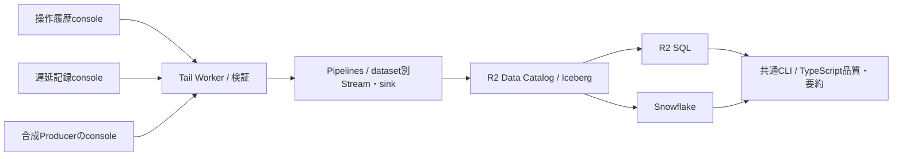

# Design Document — 共通の操作履歴基盤

2026-09-12改訂。両ログをbest-effortのconsole収集に統一する。[現行要件](requirements.md)、[旧設計](legacy-snowpipe-design.md)、[確認資料](review-evidence.md)を参照。実装・配備は未変更。

## 分担と実装順序

operation-history-logは既存OperationRecordと共通Tail・Pipelines・Catalog・reader・observeを所有する。[lift-delay-log](../lift-delay-log/design.md) は完了直前の原時刻・開始文脈・完了操作相関・専用console recordを所有する。共通基盤の前段はoperationだけで完成させ、ローカル検証後に遅延記録を実装する。本番合流はoperation単独の実環境確認後。

両ログとも業務Persist成功後、既存の後続作用が通常完了した経路でconsole出力を試みる。記録の導出・出力・配送が失敗しても厨房操作を失敗させない。操作履歴ON/OFF比較では遅延の構成を固定する。遅延の開始文脈保存は毎回の業務snapshot実内容から残余を評価し、疑わしければ全省略する任意metadataとして別specが定める。業務snapshot版（導入基準13）を上げず、同じ階層の未知キーを旧readerが無視できる形を守る。共通収集は店舗DOへ読み取り・再出力を要求しない。

## 構成

TailにStream bindingを置き、`send(records)`で直接送る。本体WorkerからPipelinesへ呼び出さない。自前のQueue、Consumer、配送台帳、outbox、DLQ、配送Alarm、耐久受理APIは作らない。Pipelinesにバッチ化とIcebergへの書込みを任せる。Tail→Pipelinesは対象環境でsmoke検証する。[送信API](https://developers.cloudflare.com/pipelines/streams/writing-to-streams/)、[Catalog sink](https://developers.cloudflare.com/pipelines/sinks/available-sinks/r2-data-catalog/)

## consoleとTailの契約

既存操作履歴のcanonical行は維持する。遅延は別の形式識別子・payloadVersionを持つcanonical行にし、既存OperationRecord parserへ混ぜない。両方の候補行だけをTailで抽出する。一般のconsole、request headers、認証情報をraw履歴へ取り込まない。

Producerがconsoleへ渡すのは記録のオブジェクトである（2026-09-16に文字列から変更）。Tailが受け取って検査し、通ったものだけをStreamへ送る。保存するcanonical文字列はTailが検査後の記録から出力する。canonicalの出力は決定的なので、Producerが出力しても同じbyte列になり、複製を内容で見分ける性質は変わらない。

文字列で渡してcanonicalへ戻しbyte比較する形をやめたのは、実測でその比較が空振りだと分かったためである。使い捨てのProducerとTailを配備して測った結果、200KBの文字列・5000要素の配列・200段の入れ子はいずれも値が途中で切れずに届いた。切詰めは行を丸ごと落とす形で起き、そのときevent `truncated` がtrueになる（小さい走ではfalse）。落ちた行は取り戻せないが、落ちた事実はtruncation列に残る。得たものは名乗りの確かさで、部分一致（`line.includes('"operationKind"')`）から場の検査（`typeof value.operationKind === "string"`）へ移った。

Tailは両方の姿を受ける。オブジェクトと、改行を含まない1引数の文字列である。**payloadの形を変えるときはTailを先に配備する。** 古いTailは文字列しか受け取れず、オブジェクトを黙って落とす。

検査にはschema検証ライブラリ（Zod）を使う。`src/`全体でこれを禁じる静的検査があるが、禁の理由はPOS素通し（ベンダーが項目を足しただけで受信が止まらないこと）であって、両端を自分で書くtelemetry記録には当たらない。例外は`src/data-platform/record-schema.ts`の1fileに閉じ、Producer側のcodecとingressは禁のまま残す。Producerのimport graphがこのfileへ到達しないことを構造検査で固定する——到達すれば店舗DOのbundleに検証ライブラリが載る。

Tailはdatasetの意味検証と、Streamと同じ定義から生成した物理validatorを実行する。null・必須・値域・時刻単位・UTF-8 byte上限を確認し、不正行は理由を診断する。型生成だけでruntime検証を代用しない。妥当行はdatasetごとに件数・byte上限でbatch化し、Tail invocationのbatch数・実行予算の範囲だけ送る。

初期実装のApp再試行回数は0。Tailの `ctx.waitUntil` に送信Promiseを渡し、完了・失敗を追跡する。例外・timeout・結果不明を記録し、別invocationへ未送信を持ち越さない。timeout後の取消が保証されなければ相手側で取込まれた可能性を残す。send成功はingested確認であり、Iceberg可視とは別である。schema不一致が取込後に落ち得るため、事前検証とPipelines user error metricsを併用する。[sendとschema検証](https://developers.cloudflare.com/pipelines/streams/writing-to-streams/)、[処理エラー指標](https://developers.cloudflare.com/pipelines/observability/metrics/)

Tailは候補行にarrivalIdのUUIDを一度付ける。プラットフォームから再観測されれば新arrivalIdとなる。元実行の安定IDやexactly-once収集は仮定しない。切詰めはtrue／false／unknownと根拠を持ち、Tail APIで確認できない値をfalseで埋めない。Tail自身の診断出力を同じTailの履歴対象にして再帰させない。

送信・検証・上限超過の件数は通常のWorker診断とプラットフォーム指標から観測する。この診断自体の欠落もあり得る。業務イベント別の状態やpayloadを保持する新しい監視DBは作らない。

## 固定列とテーブル世代

候補tableは `history.operation_arrivals_v1`、後段は `history.lift_delay_arrivals_v1`。同じCatalogでdatasetを分け、共通CLIが選択する。公開名は実装前の命名確認対象。

| 固定列候補 | 型・意味 |
| --- | --- |
| dataset / physicalVersion / payloadVersion | string / int32 / int32。保存形式と記録形式を区別 |
| arrivalId / eventId | string / nullable string。観測到達と遅延イベントの識別。operationはeventIdなし |
| storeId / source / guarantee | string。保証は両方best-effort |
| eventTime / observedAt | int64 / nullable int64 epoch ms。元の操作時刻とTail観測時刻を区別。通常Tail行のobservedAtは必須 |
| canonicalPayload | string。原事実を固定順序で表すJSON文字列 |
| sourceMetadata | string。版付きJSONで切詰め・形式識別・旧履歴の不明理由を保持 |
| isSynthetic / probeId | bool / nullable string。専用の合成記録の識別 |

probeは専用Producer scriptのallowlistから判別し、一般のpayload申告だけで合成扱いしない。通常queryは合成行を除外する。旧データで元の観測時刻が不明なら、nullableなobservedAtにnullと理由を保存し、移行実行時刻に代えない。

物理schemaは世代内で固定する。payloadの追加属性は文字列内のpayloadVersionで拡張する。物理列やsink／pipeline設定の変更は新Stream・sink・pipeline・新tableを別名で作り、readerが世代ごとに取得して束ねる。世代一覧は版管理した構成ファイルで十分であり、イベント別台帳を作らない。世代・資源ID・schema digest・書込み期間・移行範囲を記載する。

Streamのschemaは変更不可、HTTP取込設定は一部変更可。sink・pipeline設定の変更には再作成が必要で、新sinkは既存Iceberg表へ接続できない。旧Streamにbufferがある間の即時削除を切替手順に含めない。[Streams](https://developers.cloudflare.com/pipelines/streams/manage-streams/)、[Sinks](https://developers.cloudflare.com/pipelines/sinks/manage-sinks/)、[Pipelines](https://developers.cloudflare.com/pipelines/pipelines/manage-pipelines/)

## 品質計算と取得

原時刻を保持し、遅延の正の外れ値を収集時に除かない。operationの相関は既存の4属性とTimer事実、遅延はeventIdと内容一致で行う。同じIDの異内容はrawに残して競合表示し、分析標本から除外する。同じ完了の二表を合算しない。

品質計算は既存 `src/operation-history/` のcodec・correlation・qualityを再利用する。両readerの行を同じTypeScript関数へ渡し、Snowflake viewは照合用に留める。純粋な共通observeは `src/observe/`、I/Oは `tools/observe/`。重複率の分母は保存された複製の多重度も含むraw到達数で保ち、arrivalId一意数は別表示する。

実トラフィックでは両ログが有効な店舗と操作時刻期間を指定し、重複排除済みoperation completedを集合O、lift-delay completedを集合Lとする。照合キーは `(storeId, timerId, eventTime)` と `(storeId, timerId, terminalAt)`。共通の調理属性・slotIdsも一致するものをMとする。各表で内容競合するキーおよび二表間で共有事実が矛盾するキーは比較集合から除外し、除外件数を別表示する。Lにはcancelledを含めない。

- 遅延行の突合率: `|M| / |O|`。operationだけで見えた件数は `|O| − |M|`。
- 逆方向の突合率: `|M| / |L|`。遅延側だけで見えた件数は `|L| − |M|`。
- 分母0はnull。両側欠落は両集合へ現れず、率の分子にも分母にも入らない。

これは片側で観測できた完了を基準にした一致率である。検証不正・上限超過等による片側の記録欠落を捉える材料になるが、その原因は突合だけでは特定できない。両行が消えたinvocationや全操作数は復元できない。JOIN前に重複を収束させ、片側無効化／未導入は対象外、取得不足は比較不能、遅着・refresh猶予内は暫定と表示する。確認as-of時刻・猶予・両側の可視範囲・導入設定の根拠をmanifestへ残す。同じ純粋な突合関数を両readerの取得行へ適用し、個別イベントの配送状態は永続化しない。

R2 SQLは世代・店舗・イベント期間・取込走査期間を明示し、LIMIT最大10,000の範囲でkeyset取得する。OFFSETは使わない。取込時刻とarrivalIdを候補キーにし、同一キーの複製がページ境界を跨ぐ場合は件数・内容を有界に追加照合する。正確な多重度が得られなければraw exportと品質をincompleteにする。[paging](https://developers.cloudflare.com/r2-sql/troubleshooting/)、[資源制約](https://developers.cloudflare.com/r2-sql/reference/limitations-best-practices/)

任意イベント日でCatalog sinkをpartitionできる前提は置かない。取込列名・partition変換・粒度を実table metadataで確認し、取込範囲も絞る。イベント窓と取込窓を同じに固定せず、遅着と旧履歴移行の範囲を追加する。無制限の遅着を有限走査で全取得したとは言わない。[partitioningの対象](https://developers.cloudflare.com/pipelines/reference/wrangler-commands/)

JSONL＋manifestにreader・世代・期間・schema／query版・取得開始終了・cursor・件数・監視情報とcoverage・除外／保留期間を残す。複数queryのsnapshot同一性を仮定しない。失敗・資源拒否・メモリ上限は有限回で終了し、途中取得と0件を区別する。固定ファイルからの再要約を再現性の境界とする。

## 軽量observeと合成プローブ

| 表示 | 根拠・限界 |
| --- | --- |
| 検証不正・送信失敗・超過 | Tail診断。診断の未取得はunknown |
| 処理エラー | Pipelines指標。業務イベント別の欠落率ではない |
| 店舗別件数・最新時刻・分布 | Icebergで取得できた行。完全収集を意味しない |
| completed突合率・片側件数 | 保存済みのO・L・M。invocationごとの両側欠落は検出不能 |
| Snowflake可視状態 | 同じ合成ID・対象期間の実query。refresh差を別表示 |
| 経路の動作 | 合成Producer→Tail→各有効datasetのStream／sink→両reader |
| 未配送件数・全操作の欠落率・現在の未完了 | この構成では取得不能。0で埋めない |

既存の運用schedulerを候補とし、専用の合成Producerを周期起動する。schedulerは予定実行と結果を通常の運用証跡に残す。Producerは専用店舗ID・probeIdを持つ安全な合成console行を出す。専用Producer側に本体とは別のtail_consumers attachmentで同じTailを指定し、Cronまたは既存schedulerからの定期起動を別に構成する。本体Workerにあるattachmentだけでは合成Producerを収集できない。確認処理は対象IDを有界回数だけqueryし、可視時刻と結果を保存して終了する。プローブの記録は短い運用結果で、業務payloadの保管・再送には使わない。Tailへ直接HTTP送信するだけのテストでconsole経路の確認を代用しない。

初期候補は5分ごとのプローブ、送出予定から15分の確認期限。未確認・schedulerの起動失敗・reader失敗を区別し通知する。query費用と実行時間を測り、周期・閾値・通常の監視結果保持を実装時に固定する。Snowflakeのrefresh周期は期限設定に反映する。15分以内99%という業務全件到達SLOは採用しない。プローブ成功率を測る場合は専用指標と明示する。

statusの参照元は次の表をタスク1.4で環境ごとに埋めて固定する。Tail診断とPipelines指標の保持期間はIcebergのraw無期限保持と別であり、後からIcebergの保存行だけで過去の送信失敗を再構成しない。

| 指標 | 参照元 | 認可・制約（2026-09-15に公式資料で確定） |
| --- | --- | --- |
| Tail検証・send失敗・超過 | Workers Observability の REST：`POST /accounts/{id}/workers/observability/telemetry/query` | token は `Workers Observability Write`。script は `$metadata.service` で絞る。保持は有料 7 日・無料 3 日、1 query 最大 2,000 件、`head_sampling_rate` 既定 1 |
| Pipelines処理エラー | GraphQL Analytics：`pipelinesOperatorAdaptiveGroups`（recordsIn／decodeErrors）、`pipelinesSinkAdaptiveGroups`（recordsWritten）、`pipelinesUserErrorsAdaptiveGroups`（errorType別 count） | token は `Account Analytics Read`。最小粒度は分（エラーのみ）・他は時間。詳細エラーは直近 24 時間。保持期間は公式の散文に無く、`settings` node で確認する |
| プローブの予定・実行・確認結果 | 採用したscheduler／運用監視の結果 | 定期実行設定、結果の読取経路、権限、保持日数、起動失敗の判定 |
| 保存行と二表突合 | R2 SQL／Snowflakeの実query | event／取込窓・世代、as-of・猶予、両ログの有効化範囲 |

**token は 3 種に分かれる。** R2（SQL・Catalog・storage）、Account Analytics、Workers Observability のどれも互いを含まない。status はそれぞれの取得可否を別に表示し、認可が無い指標を 0 件と表示しない。

参照元を読めない・保持期限外・sampling不明なら、その期間のstatusはunknownまたは部分coverage。具体的な取得経路と遡れる期間が未確定のままタスク1.4を完了にしない。

プローブの初期費用見積りは、30日・有効dataset数D・各datasetの1周期あたり確認query数q（再確認・世代別queryを含む）・周期p分で、`N = 30 × 24 × 60 / p × D × q`。R2 SQLは1データqueryあたり最小10 MB、確認時点の単価は$0.0025/GB。各queryの見積走査量を最小10 MB以上として合計する。[公式料金](https://developers.cloudflare.com/r2-sql/platform/pricing/)

| 仮定（D=2、各queryの走査10 MB以下） | 30日query数 | 課金走査量 | 無料枠控除前の走査費用 |
| --- | --- | --- | --- |
| 5分周期、q=1 | 17,280 | 172.8 GB | $0.432 |
| 15分周期、q=1 | 5,760 | 57.6 GB | $0.144 |
| 5分周期、q=3 | 51,840 | 518.4 GB | $1.296 |

上表は最小走査量を使った下限側の例で、全費用ではない。前段D=1なら同じ条件で半分。通常queryと共有する月10 GB無料枠をプローブ専用に割り当てたと仮定しない。実走査が10 MBを超えれば増額し、R2 read・Catalog・Pipelines・Worker／scheduler・監視ログ・Snowflake query／refreshの費用も別途足す。実環境の可視遅れを確認してqと周期を固定する。

収集エラーや監視不能が重なる期間は統計採用を保留できる。店舗を特定できない障害は影響するdataset／時間帯全体を対象とする。成功プローブがあっても繁忙時の欠落がランダムとは限らない。未完了か終端ログ欠落かをログだけで断定せず、外れ値処理で欠測の偏りを解消できると扱わない。

共通CLIはstatus/export/summarizeだけを提供する。店舗DOの管理GET、active断面の取得、constructor初期化分離、再送・復旧CLIは作らない。Appの採用値は未導入と表示する。

## Snowflake・保持・移行

SnowflakeはS3COMPAT external volume（ALLOW_WRITES=FALSE）とICEBERG_REST catalog integrationで同じtableを読む。AUTO_REFRESHは既定FALSE。有効化時はSnowpipe名目のrefresh課金、明示refreshなら実行費用と周期を記録する。secretをCLI引数・fixtureへ出さない。[接続例](https://developers.cloudflare.com/r2-data-catalog/config-examples/snowflake/)、[AUTO_REFRESH](https://docs.snowflake.com/en/sql-reference/sql/create-iceberg-table-rest)、[refresh課金](https://docs.snowflake.com/en/user-guide/tables-iceberg-auto-refresh)

rawは期間削除なし。compaction／snapshot expirationを明示有効化し、現在行の保持を検証する。全snapshotの永久Time Travelや未参照orphan fileの自動清掃は保証しない。Pipelines／Catalog／R2 SQLはbetaで、Snowflake停止からの独立性はCloudflare側の可用性を前提とする。[保守](https://developers.cloudflare.com/r2-data-catalog/table-maintenance/)

旧資源の [先行棚卸し](review-evidence.md) を起点に、Snowflake・別名・別環境の確認を続ける。旧履歴がある場合だけ、一回の移行manifestと有界な読み出し・送信・件数照合手順を作る。常設の旧経路adapterや配送台帳にしない。対象不在はN/A、未確認は未完とする。切替後に旧Queue／Consumer／Snowpipeを停止し、履歴の保存を妨げるTTLだけを対象限定で解除する。新旧重複と欠損を明示し、復帰で履歴を消さない。

## 正しさの性質と検証戦略

- P1: console出力・下流失敗を厨房操作へ伝播させず、ログ用の追加DO wake・Alarm・networkを持たない。
- P2: 元時刻・canonical内容を保持し、再観測の複製と異内容競合を隠さない。
- P3: send成功・Iceberg可視・完全収集を混同しない。監視不能はunknown。
- P4: 物理世代切替と保守で現在のrawを消さない。
- P5: 部分取得・多重度不明を完全exportとしない。同じ固定行なら両readerの品質結果は同じ。
- P6: 合成行と業務行を分離し、プローブの成否や二表突合率を業務全件到達率へ読み替えない。片側欠落と両側欠落の検出限界をfixtureで示す。

純粋validator／品質fixture、workerdのconsole・Tail障害注入、readerのpaging、cloudの合成経路に分けて検証する。旧静的テストは [参照対応表](legacy-reference-map.md) に従い整理し、新構成の直接送信・無追加起動・無TTLを検査する。CP-SATの試験差分は実装・specのコミットに混ぜない。

後段の負荷測定は完了ごとの2行化を含め、invocation単位の全console行数・総byte、遅延1行byteの分布、切詰めを対象にする。出力予定とTail受信後の数を分け、一括完了・繁忙を模した入力で突合率との関係を確認する。
