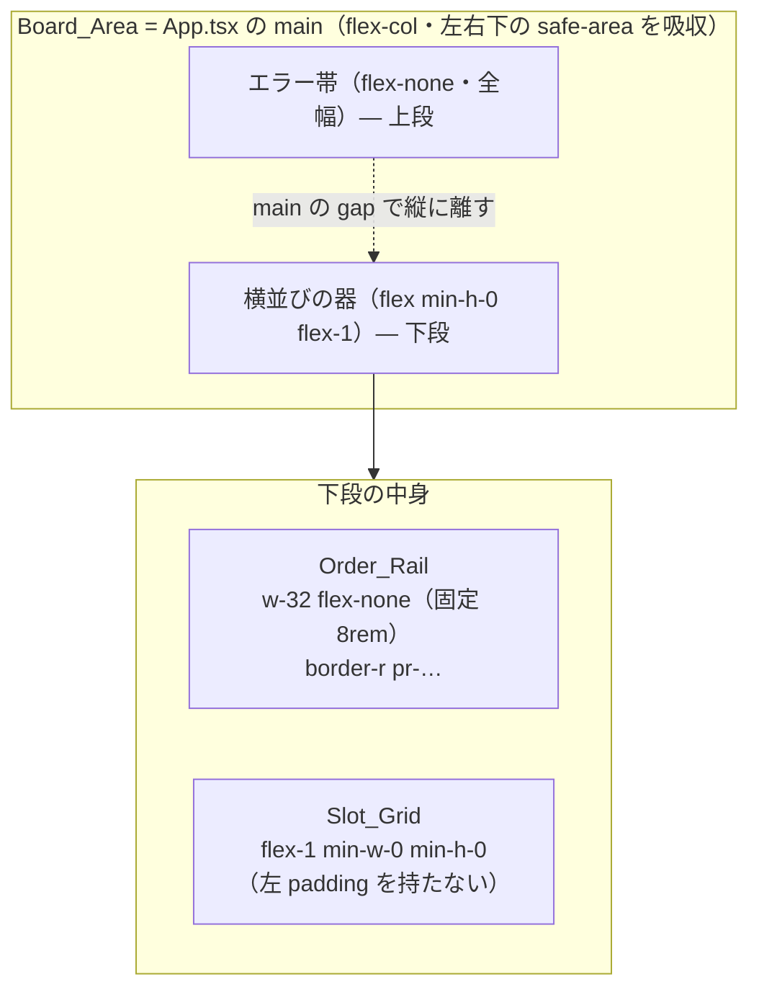

# 技術設計書 — 調理待ちオーダーの左レール化（pending-order-list-left-rail）

## この設計が拠って立つもの

本設計は `requirements.md`（全 7 要件・EARS 記法・確定済み）を正本とし、ステアリング（`design-philosophy.md` / `naming.md` / `tooling.md` / `timer-model.md`）と既存の中核設計（`.kiro/specs/yude-men-timer/design.md`・`.kiro/specs/online-cook-scheduling/design.md`）を前提とする。

本 spec が変えるのは**表示層の配置だけ**である。設計の骨格は一文で言える——**器の向きを変え、行の組み方を縦幅に合わせる。導出は 1 行も足さない。**

1. **新しい導出を作らない。** 並び・待ち時間・提案の絞り込みは既存の純粋導出 `orderQueueEntries`（`src/client/components/queueDisplay.ts`）が済ませている。本 spec はその出力を DOM の形へ写す側だけを組み替える（要件 6.3 / 6.4）。
2. **新しい保持値を作らない。** レールの表示・非表示は `Pending_Order` 集合が空か否かの導出。縦スクロール位置は DOM が持つ事実で、React state へ昇格させない（要件 6.1 / 6.11）。
3. **色・トークンの出所を増やさない。** 麺種色は `SlotBoard` が 1 つだけ作る resolver（`noodleColors`）を釜カードと共有し、それ以外の色・フォントは `@theme` トークン由来のユーティリティのみを引く（要件 3.2 / 7.1）。
4. **差分を `src/client` に閉じる。** `src/domain` / `src/engine` / `src/shell` とワイヤに差分を出さない（要件 6.5）。
5. **引き算で解く。** 幅は比率も分岐も持たない単一の固定値で満たし（後述）、支援技術に渡す名前は可視テキストそのものにする（`aria-label` を**やめる**）。足して整えるのではなく、二重の出所を取り除く。

---

## Overview

### 目的

上部の横帯（`Order_Band`）は固定高の 1 段である。件数が増えると横スクロールへ逃げ、一度に見える件数がそこで頭打ちになる。一覧を左の縦レール（`Order_Rail`）へ移すと、縦方向の余りを可視件数へ変換できる。

これは**取引**である。得るものは待ちオーダーの**可視件数**、払う代償は釜カードの**残り時間の文字寸法**である。

代償が生じる理由はソースにある。`SlotCard.tsx` の `cardBase` は `@container` を持ち釜カード自身を query container にし、`timeBig` は `text-[clamp(2.7rem,35cqi,8.4rem)]` である。`cqi` はコンテナのインライン方向（＝**幅**）の 1% であり、カードの高さを参照しない。ゆえに次の 2 点が事実である。

- 現行の上部横帯は `Slot_Grid` の**高さ**を奪うが、残り時間の文字寸法を 1px も縮めていない。
- 左レールは Board_Area の**幅**を奪うため、残り時間の文字寸法を直接縮める。

残り時間は数歩離れた位置から読むものであり、代償には歯止めが要る。それが AC 2.2（非表示時の 80% 以上）であり、レール幅はこの下限から導出する（後述「幅の規律」）。

### 確定した設計判断（要点）

| # | 判断 | 根拠 |
| --- | --- | --- |
| 1 | 段組みは「上段＝エラー帯（全幅）／下段＝レール + 釜グリッドの横並び」。下段の器は `SlotBoard` 内の `div` に留め、名前を持つ概念にしない | 要件 1.7 / 1.8。器の形であって概念ではない |
| 2 | レール外形幅は単一の固定値 **8rem**（`w-32 flex-none`）。比率もメディアクエリも clamp も持たない。区切りのための padding を釜グリッド側に置かない | AC 2.1 が固定値を要求し、AC 2.2 の 80% 下限が上限 8.2rem を与える（後述「幅の規律」で導出）。区切りの余白を釜グリッド側にも持つと縦向きで 79.2% となり 80% を割る |
| 3 | レールと釜グリッドの間に flex の `gap` を置かない。区切りはレール側の `pr` と `border-r` で作る | `gap` を挟むと釜グリッドが「残り全量」より狭くなり AC 2.7 を外す |
| 4 | `Safe_Area_Inset` の吸収は既存どおり `Board_Area`（`App.tsx` の `main`）の padding 1 箇所に留める | AC 1.4 / 1.6 / 4.7 は「内容が inset の内側に収まる」という結果を述べ、吸収する要素を指定しない。吸収先を増やすと出所が割れ、かつエラー帯（全幅・上段）がノッチ下に潜る（後述の「判断 4」） |
| 5 | レールの表示条件は `SlotBoard` が 1 箇所だけで判定し、`OrderRail` は**非空を型で要求する**（`NonEmptyArray<QueueEntry>`） | 同じ条件を 2 箇所に持たない。0 件のレールを構築不能にする（不正な状態を表現可能にしない） |
| 6 | `Suggested_Start` の `aria-label` を**やめ**、ボタンの可視テキストをそのまま accessible name にする | 現行は可視（`Slot 3 · 12:34`）と AT 名（`start … on slot 3 at …`）が別々に手書きされ、実際に語がずれている。同一であることを「同一のものだから」にする（AC 5.4 / 7.4） |
| 7 | 茹で加減は既存の `FIRMNESS_LABEL`（日本語・調理母語）を引き続き用い、レール専用の茹で加減ラベルを持たない | AC 3.10 が `FIRMNESS_LABEL` をそのまま用いるよう定め、AC 3.9 の英語化は本 spec で新たに書く固定文言に限られる。茹で加減表示の出所を釜カード・茹で加減コーナー操作と 1 つに保つ（後述の「判断 7」） |
| 8 | 本 spec 固有の新しい Correctness Property を立てない。節では既存 property の継承だけを明記する | 本 spec は新しい純粋導出を 1 つも足さず、残るのは配置。配置の不変点は「for all 入力 → P」の形にならない（後述の Correctness Properties / Testing Strategy） |

### スコープ外（design 判断として固定）

- **向きによる出し分け** — 縦向きでも左レール（要件 2.5・確定済み）。`useUnitCount` の担当窓長 k は本 spec と無関係のまま。
- **レールの手動折りたたみ** — 操作を設けない（要件 2.5・確定済み）。
- **提案の意味論** — 推奨開始時刻の到来を契機とする動作は持たない。過ぎた `startAt` はそのまま提示する（要件 5.5・既存挙動のまま）。
- **占有スロットへの提案の抑止** — `queueDisplay` が釜の占有を見ない件は別 spec の申し送り（`degraded-slot-superimposition` 限界 3）。本 spec で触らない。
- **`main` の `aria-label="Slots"`** — 要件が触れていないため変更しない。

---

## Architecture

### 触る層と触らない層

```mermaid
flowchart TB
  subgraph domain["src/domain（共有契約）"]
    D["order / messages / timer<br/><b>変更なし</b><br/>NonEmptyArray / isNonEmpty を client が引くだけ"]
  end
  subgraph server["src/engine · src/shell · src/worker.ts"]
    S["<b>変更なし</b>（要件 6.5）"]
  end
  subgraph client["src/client（React・表示層）"]
    QD["queueDisplay.ts — orderQueueEntries<br/><b>変更なし</b>（引数・戻り値の形も名も不変・要件 6.3 / 6.4）"]
    NC["noodleColor.ts — noodleColors<br/><b>変更なし</b>（麺種色の唯一の出所）"]
    SB["SlotBoard.tsx<br/><b>段組みを 1 段 → 2 段へ</b><br/>下段に レール + 釜グリッド を横並び"]
    OR["<b>OrderRail.tsx</b>（OrderQueue.tsx を改名）<br/>縦レール本体 + OrderRow"]
    APP["App.tsx<br/><b>変更なし</b>（Board_Area の padding / Header_Bar / safe-area）"]
    RM["RadialMenu.tsx<br/><b>変更なし</b>（createPortal + z-60）"]
  end
  QD --> SB
  NC --> SB
  SB --> OR
  D -.->|型のみ| OR
```



**変更する source（2 ファイル）:**

| ファイル | 変更 |
| --- | --- |
| `src/client/components/OrderQueue.tsx` → `OrderRail.tsx` | 改名。`OrderQueue` → `OrderRail`、`OrderQueueRow` → `OrderRow`。横 1 列の帯から縦 1 列のレールへ組み替える |
| `src/client/components/SlotBoard.tsx` | 段組みを 2 段にし、下段でレールと釜グリッドを横並びにする。import 先を `OrderRail` へ |

**新規テスト（2 ファイル）:**

| ファイル | 役割 | vitest プロジェクト |
| --- | --- | --- |
| `tests/client/order-rail.example.test.tsx` | 実描画テスト。DOM へ問える主張（ロール構造・DOM 順・可視文言・accessible name・押下時の引数）を立てる | `render`（`happy-dom` + `@vitejs/plugin-react`）。境界は拡張子 `.tsx` ゆえ設定の追記は要らない |
| `tests/pending-order-list-left-rail.static.test.ts` | ソース静的検査。描画では見えない配置の規律（幅・スクロールの閉じ込め・色の出所・保持値の不在）を見る | `static`（`node`） |

**設定（1 ファイル）:**

| ファイル | 変更 |
| --- | --- |
| `vitest.config.ts` | `static` プロジェクトの `include` と `workers` プロジェクトの `exclude` に静的検査ファイルを**対で**足す（既存の全静的検査と同じ形）。`.tsx` は `render` プロジェクトの `include` が既に拾い、`workers` 側も既に除外済みゆえ追記は不要 |

**変更しないもの:**

| ファイル | 変更しない理由 |
| --- | --- |
| `tests/client/order-queue.example.test.ts` | 並び・待ち時間・提案の絞り込みの規則が変わっていないことの直接の証拠。1 行も書き換えない（要件 6.4） |
| `tests/client/format.property.test.ts` | 待ち時間の表記が移動前と同一であることを支える（要件 3.1） |
| `src/client/App.tsx` | Header_Bar と `Board_Area` の padding（`Safe_Area_Inset` の吸収）に差分を出さない（要件 2.6・判断 4） |
| `src/client/components/queueDisplay.ts` | 引数・戻り値の形と名を保つ（要件 6.3 / 6.4） |
| `src/client/components/noodleColor.ts` | 麺種色の唯一の出所。レール側に別の出所を持たない（要件 3.2） |
| `src/client/components/RadialMenu.tsx` | 前面性は `createPortal` + `z-[60]` のまま（要件 5.7） |
| `src/client/styles.css` | 新しい `@keyframes` も `--animate-*` も足さない（要件 7.5） |

### Board_Area の段組み



`main` は現行のまま縦フレックスで、子の間に `gap-[clamp(0.5rem,1.2vh,0.875rem)]` を持つ。エラー帯は `flex-none` の全幅で上段に立ち、横並びには**重ならない**（要件 1.7）。下段の器は `min-h-0 flex-1` でエラー帯を除いた残り高さの全量を取り、`main` 自身にスクロールを生じさせない（要件 1.8）。

レールと釜グリッドはいずれも下段の flex アイテムであり、既定の `align-items: stretch` で上端・下端が揃う（要件 1.1）。

### 幅の規律 — 80% 下限から固定幅を導出する

要件が課す条件は 2 つである。

- AC 2.1: レール外形幅は Board_Area の外形幅・件数・行の内容のいずれにもよらない**単一の固定値**
- AC 2.2: レール表示時、釜カードの残り時間の文字寸法を、同一の画面寸法・同一の担当窓における非表示時の **80% 以上**

比率（`w-1/4`）も条件付き下限（`min-w-[10rem]`）もメディアクエリも持たない。置くのは **`w-32`（= 8rem）と `flex-none` の 2 クラスだけ**である。以下がその導出である。

#### 幅が文字寸法へ伝わる経路（ソースで確認した値）

| 出所 | クラス | 値（root 16px・V = ビューポート幅 px） |
| --- | --- | --- |
| `App.tsx` の `main` 左右 padding | `pl-/pr-[calc(clamp(0.5rem,1.4vw,1rem)+env(…))]` | Pm = clamp(8, 0.014V, 16) |
| `SlotBoard` 釜グリッドのユニット間 gap | `gap-[clamp(0.75rem,1.8vw,1.375rem)]` | Gu = clamp(12, 0.018V, 22) |
| ユニット内 `grid-cols-2` の gap | `gap-[clamp(0.5rem,1.2vw,0.875rem)]` | Gc = clamp(8, 0.012V, 14) |
| `SlotCard` の `cardBase` 左右 padding | `p-[clamp(0.625rem,1.6vh,1.125rem)_clamp(0.875rem,1.8vw,1.25rem)]` | Pc = clamp(14, 0.018V, 20) |
| `SlotCard` の `timeBig` | `text-[clamp(2.7rem,35cqi,8.4rem)]` | 0.35 × 100cqi を 43.2px〜134.4px で clamp |

`cardBase` は `@container`（= `container-type: inline-size`）を持ち、釜カード自身が query container である。コンテナクエリ長単位はコンテナの**コンテンツボックス**を基準にする（[Using Container Query Units Relative to an Outer Container](https://frontendmasters.com/blog/using-container-query-units-relative-to-an-outer-container/)。ライセンス上の制約に配慮して内容を要約した）。ゆえに `100cqi` は釜カードの外形幅から左右 padding を除いた幅であり、残り時間（分）の文字寸法は次の連鎖で決まる。R をレール外形幅・k を担当窓長とする。

```
W      = V − 2·Pm                            … Board_Area の内容幅
G      = W − R                               … 釜グリッドの内容幅（R = 0 が非表示時）
U      = (G − (k−1)·Gu) / k                  … 1 ユニットの列幅
C      = (U − Gc) / 2                        … 釜カードの外形幅
100cqi = C − 2·Pc                            … 釜カードのコンテンツ幅
digit  = clamp(43.2, 0.35·(C − 2·Pc), 134.4)
```

`box-sizing: border-box`（Tailwind の既定）ゆえ、R はレールの `pr` と `border-r` を**含んだ**外形幅であり、それらは釜グリッドの幅を削らない。削るのは R だけである。AC 2.1 / 2.2 が言う「Safe_Area_Inset の吸収分を含む外形幅」とは、判断 4 のとおり inset を `main` が吸収するため、レール自身の外形幅がそのまま比較対象になる。

#### 導出

gap と padding は R に依存しないため、R はカードのコンテンツ幅の**総和**からそのまま引かれる。行に並ぶ釜カードは 2k 枚で、その総和を Σ と書く。

```
Σ(R) = W − R − (k−1)·Gu − k·Gc − 4k·Pc = Σ(0) − R
```

全カードは等幅ゆえ 1 枚の `100cqi` は Σ / 2k であり、`digit` が clamp の内側にある間、比は Σ の比に等しい。

```
digit(R) / digit(0) = Σ(R) / Σ(0) = 1 − R / Σ(0)          ⟹  AC 2.2 ⟺ R ≤ 0.2 · Σ(0)
```

比の下落は R を Σ(0) で割った値でしかない。Σ(0) は画面が広いほど大きいため、**制約側は Σ(0) が最小になる画面——担当窓 k = 1 の縦向き**である。iPad 全画面の縦向き 2 例を境界条件に置く。

| 境界条件 | Σ(0)（全釜カードのコンテンツ幅の総和） | R の上限（= 0.2·Σ(0)） |
| --- | --- | --- |
| iPad 縦 768pt | 746.5 − 9.2 − 56 = 681.3px | 136.3px = 8.52rem |
| iPad mini 縦 744pt | 723.2 − 8.9 − 56 = 658.2px | 131.6px = 8.23rem |
| （参考）iPad 横 1024pt | 995.3 − 18.4 − 24.6 − 147.5 = 804.9px | 161.0px = 10.06rem |

縦向き 2 例の上限をいずれも下回る最大の Tailwind spacing 値が **`w-32` = 8rem = 128px** である。これを採る（次の刻み 8.25rem は 744pt の上限を超える）。

#### 検算

| 画面 | k | 列数 | レールなし | レール 8rem | 比 | レール 10rem | 比 |
| --- | --- | --- | --- | --- | --- | --- | --- |
| iPad 横 1024pt | 2 | 4 | 70.4px | 59.2px | **84.1%** ✓ | 56.4px | 80.1% |
| iPad 縦 768pt | 1 | 2 | 119.2px | 96.8px | **81.2%** ✓ | 91.2px | 76.5% ✗ |
| iPad mini 縦 744pt | 1 | 2 | 115.2px | 92.8px | **80.6%** ✓ | 87.2px | 75.7% ✗ |

縦向きが制約側であることが数値にも出る（横 84.1% に対し縦 81.2%）。10rem は縦向きで 80% を割る——requirements Introduction の概算（縦 10rem で 76%）と一致する。

絶対値は同概算（縦レールなし約 128px・8rem 約 104px）より小さい。概算が `35cqi` を釜カードの**外形幅**に掛けているのに対し、上の連鎖はコンテンツ幅（外形幅 − 2·Pc）に掛けているためである。比は 1 ポイント以内で一致するため、8rem という結論は変わらない。

#### 釜グリッド側に区切りの余白を置かない

旧設計は釜グリッドにレール表示時のみ `pl-[clamp(0.75rem,1.8vw,1.375rem)]` を与えていた。この padding は R と同じく Σ から引かれる——上限の式は R ≤ 0.2·Σ(0) から **R + Pg ≤ 0.2·Σ(0)** へ変わる。縦向き 768pt では上限が 136.3px であるから、8rem を採ると Pg に残るのは 8.3px しかない。実際に旧値（Pg = 13.8px）を入れると

```
Σ = 746.5 − 128 − 13.8 − 9.2 − 56 = 539.5  →  539.5 / 681.3 = 79.2% ✗
```

となり 80% を割る。80% 下限は区切りの余白を 2 つ持つ幅を残さない。ゆえに区切りは判断 3 のとおり**レール側の `pr` と `border-r` だけ**で作り、釜グリッドは左 padding を持たない。区切り線の右側の視覚的な間は、釜カード自身の左 padding（14〜18px）と角丸が担う。

#### 80% が成り立つ幅の範囲

固定幅 8rem が 80% を保つのは Σ(0) ≥ 5R = 640px の範囲である。狭側では Pm = 0.014V・Gc = 0.012V・Pc = 14 となり Σ(0) = 0.96V − 56 ゆえ、境界は**ビューポート幅およそ 725px** である。iPad の全画面表示は縦 744pt / 768pt 以上でこの範囲に入る。

これを下回る幅（iPad の Split View など）では AC 2.1（固定値）と AC 2.2（80%）が両立しない。本 spec の対象は厨房 iPad の全画面表示であるため AC 2.1 を採り、幅を変えない。狭幅では `timeBig` の clamp 下限（2.7rem）が働き、数字は 43.2px を下回らない。

#### 固定幅から行の内容幅へ

`OrderRow` が使える幅は、固定幅から順に引いて求まる。

| 引くもの | クラス | 値 |
| --- | --- | --- |
| レール外形幅 | `w-32` | 128px |
| レール右 padding | `pr-[clamp(0.5rem,1.2vw,0.875rem)]` | 9.2px（縦 768pt）〜14px（上限） |
| レール右 border | `border-r` | 1px |
| 行の border（左右） | `border` | 2px |
| 行の左右 padding | `px-3` | 24px |

行の内容幅 = 128 − (9.2〜14) − 1 − 2 − 24 = **87〜92px（5.44〜5.75rem）**。`Suggested_Start` は `w-full` でこの幅を占め、`min-h-[2.75rem]` を持つ。ゆえに可触領域は幅・高さともに 2.75rem（44px）を上回り、幅の余裕は約 43px ある（AC 5.1）。

内容幅が狭くなる分、麺種名・卓番の切り詰めは横帯のときより増える。これは AC 3.5 が引き受ける（1 行のまま末尾を省略し、レール幅を広げず横スクロールも生じさせない）。

#### ボタン内部の幅の内訳 — 横並びをやめ、縦に積む

内容幅 87〜92px は `Suggested_Start` の**内側**の組み方を決めてしまう。現行の骨格は横並び（`PlayIcon` 16px + `gap-2` 8px + `px-2` 16px = **40px の固定消費**）で、文字列の欄に残るのは 47〜52px しかない。`Slot 3 · 12:34`（14 字）は 0.75rem では 100px 前後を要し、読める形で収まらない。AC 5.2 が求める「推奨する釜の識別と推奨開始時刻」が立たない。

ゆえに横並びをやめる。採る形は次の 3 つの引き算である。

1. **`PlayIcon` を捨てる**（16px + `gap-2` 8px = 24px を回収）。アイコンは `aria-hidden` で accessible name に寄与せず、操作の性格は `Suggested` の語がすでに担う。幅 73px の欄に 24px（33%）を絵で使う余地はない。ボタンであることは全幅・`border`・`bg-panel` の塊が示す——現行も区別の手段はそこにある。
2. **左右 padding を `px-2`（16px）から `px-1.5`（12px）へ詰める。**
3. **`Suggested` / 釜 / 時刻を 3 行に積む。** 1 行あたりの必要幅が独立に決まり、最長の行だけを見ればよくなる。

ボタンの内容幅は次のとおり。

```
ボタンの内容幅 = 行の内容幅 − border（左右 1px×2） − px-1.5（6px×2）
               = (87〜92) − 2 − 12 = 73〜78px
```

行ごとの必要幅を、`--font-sans`（Manrope）とフォールバック（`system-ui`）のいずれでも上回らない**保守的な字送りの上限**——数字（`tabular-nums`）と大文字 0.62em・小文字 0.56em・空白と `,` と `:` 0.30em——で見積もる。

| 行 | 文字寸法 | 内容 | 字送りの和 | 必要幅 | 73px に対して |
| --- | --- | --- | --- | --- | --- |
| `Suggested` | 0.6875rem（11px） | 小文字混じり・bold | 0.62 + 8×0.56 = 5.10em | 56.1px | 余裕 17px ✓ |
| 釜（単数） | 0.6875rem（11px） | `Slot 3` | 3.22em | 35.4px | 余裕 38px ✓ |
| 釜（3 釜） | 0.6875rem（11px） | `Slots 1, 2, 3` | 6.22em | 68.4px | 余裕 5px ✓（1 行） |
| 釜（6 釜） | 0.6875rem（11px） | `Slots 1, 2, 3, 4, 5, 6` | 9.88em | 108.7px | **2 行へ回り込む** |
| 推奨開始時刻 | 0.75rem（12px） | `12:34` | 2.78em | 33.4px | 余裕 40px ✓ |

**釜の行は切り詰めない——折り返す。** AC 5.2 は「推奨が複数の釜を含むときはその全て」を示すよう定める。`truncate` で末尾を省略すればこれを壊す。ゆえに釜の行に `truncate` を置かず、既定の折り返しに任せる。区切りを `", "`（空白を含む）にするのはそのためで、空白が折り返し機会になる。1 ユニット分の 6 釜（`SLOTS_PER_UNIT` = 6）でも 2 行に回るだけで、番号は 1 つも落ちない。折り返しは件数の上限を前提にしないため、`assignedBySlots` の any-overlap 判定によって 1 ユニットを跨ぐ推奨が届いた場合も同じく行が伸びるだけで済む——`truncate` を置かない選択がここで効く。切り詰めが起きるのは麺種名と卓番だけで、そちらは AC 3.5 が末尾省略を明示的に許している。

**`Suggested` を uppercase にしない。** レール見出しは `uppercase tracking-wide` だが、同じ様式をこの欄には持ち込まない。`SUGGESTED`（大文字 9 字 + `tracking-wide` 0.025em×9）は 63.9px、フォールバックの `system-ui` では 67.8px で、73px に対する余裕が 5〜9px しかない。フォント読み込み前の描画で溢れれば `SUGGES` / `TED` に割れる——語を割るくらいなら様式を譲る。小文字混じりなら余裕は 17px（23%）になる。

**高さ。** `leading-tight`（1.25）で 11 + 11 + 12 = 34px の字寸が 42.5px を占め、`py-1`（上下 4px）を加えて **50.5px**。AC 5.1 の 44px を上回るが、`min-h-[2.75rem]` は下限の表明として残す（釜の行が 1 行のときも高さが崩れないことを 1 つのクラスで固定する）。

**幅の可触寸法。** ボタンは `w-full` で行の内容幅 87〜92px を占め、44px を約 43px 上回る（AC 5.1）。

### 判断 4: Safe_Area_Inset の吸収先を増やさない

AC 1.4 / 1.6 / 4.7 が定めるのは**結果**である——レール非表示時は釜グリッドの内容が、表示時は Order_Row の内容が `safe-area-inset-left` の内側に収まり、下端に達したときは末尾の Order_Row が `safe-area-inset-bottom` の内側に収まる。どの要素が inset を吸収するかは指定されていない。ゆえに吸収の置き場は設計判断であり、本設計はそれを**増やさない**方を採る。

- `main` は現行どおり `pl-[calc(clamp(0.5rem,1.4vw,1rem)+env(safe-area-inset-left))]` と `pb-[calc(…+env(safe-area-inset-bottom))]` を持ち、**inset の吸収は 1 箇所に留まる**。
- 吸収は常に**最左要素の外側**で起きる。レール表示中は左端がレール（AC 1.6 が満たされる）、非表示時は左端が釜グリッド（AC 1.4 が満たされる）。要素を名指しせずとも、器の外側で 1 度吸収すれば両方の結果が同時に立つ。
- 下端も同様に `main` の `pb` が吸収し、レールのスクロール内容の末尾行がその内側に収まる（AC 4.7）。

**移す案を採らない理由**: (a) 吸収の出所が 1 → 2 箇所に増え、レールの有無で吸収先を切り替える条件分岐が生まれる（SSOT が割れる）。(b) `main` の左 padding から inset を外すと、AC 1.7 が全幅の上段に置くよう定める**エラー帯**がノッチ下に潜る——現行からの後退である。

### 判断 7: 茹で加減ラベルの言語

要件は 2 つの AC でこの線を引いている。AC 3.9 が英語を求めるのは「**本 spec で新たに書く**自領域の固定文言」であり、AC 3.10 は茹で加減について既存の `FIRMNESS_LABEL` の語をそのまま用い、レール専用の別ラベルを持たないよう定める。

ゆえに本設計は `FIRMNESS_LABEL`（`src/client/components/firmness.ts`・バリカタ／かため／ふつう／やわめ）をそのまま引く。この語は釜カードと茹で加減コーナー操作が既に共有しており、`tests/offline-degradation.static.test.ts` が**合意済みの調理母語**として明示的に許可している——茹で加減は本 spec が新たに書く文言ではなく、既にある語彙の参照である。

レール専用の英語ラベルを別に持てば、一つの概念に二つの出所ができる（重複の根絶に反する）。`FIRMNESS_LABEL` そのものを英語化すれば釜カードにも波及し、本 spec の境界（表示層の配置）を越える。どちらも採らない。

本 spec が新たに書く固定文言——見出し（`Waiting orders (n)`）・卓番の語（`Table 12`）・提案の語（`Suggested` / `Slot` / `Slots`）——はすべて英語である（AC 3.9）。

### 重畳の規律（要件 5.7 / 6.10）

`RadialMenu` は `createPortal` で `body` 直下に描かれ `fixed inset-0 z-[60]` を持つ。レールは `z-index` を持たず、`fixed` / `transform` / `filter` / `isolation` によるスタッキングコンテキストも作らない。ゆえにラジアルはレールと重なる領域を含めて常に前面に立ち、可触領域を奪われない。釜カードの表示状態の優先規律（running > boiled > idle）にも、レール側から新しい入力を与えない。

---

## Components and Interfaces

### 公開シンボル名の確認の記録

`naming.md` は公開シンボルの命名を実装前のユーザー確認事項とする。本 spec の該当分は確認済みである——`OrderRail` / `OrderRow` の 2 つを採ることと、`Suggested_Start` に相当する独立した公開シンボルを与えず `OrderRow` 内の `button` に留めることの双方について確認を得た（`requirements.md`「確定した判断」5）。ゆえに本設計は未確認の公開シンボルを 1 つも残していない。`QueueEntry` / `QueueSuggestion` / `NoodleColor` / `orderQueueEntries` は既存の公開シンボルであり、名も形も変えない（要件 6.3）。

### `OrderRail`（`src/client/components/OrderRail.tsx`）

**表明する概念境界**: Board_Area の左端に置く、調理待ちオーダーの縦一覧の器。`Order_Band`（横帯）を置き換えて廃する。

```tsx
interface OrderRailProps {
  /** 到着順に導出済みの表示状態。非空を型で要求する（0 件のレールは構築不能・判断 5）。 */
  readonly entries: NonEmptyArray<QueueEntry>;
  /** noodleType → 前景色の resolver（釜カードと同一の割り当てを共有する）。 */
  readonly noodleColor: NoodleColor;
  /** 提案から開始する（提案が揃った行だけがこの口を持つ）。 */
  readonly onStart: (order: PendingOrder, suggestion: QueueSuggestion) => void;
}

export function OrderRail({ entries, noodleColor, onStart }: OrderRailProps): JSX.Element;
```

props の 3 要素は現行 `OrderQueue` と同一で、`entries` の型だけが非空へ締まる。`QueueEntry` / `QueueSuggestion` / `NoodleColor` はいずれも既存型で、形を変えない。

**骨格**（クラスは意図を示す指示であり、最終の並び順は oxfmt が決める）:

```tsx
<section
  aria-label="Waiting orders"
  className={cn(
    "flex w-32 flex-none flex-col gap-[clamp(0.25rem,0.8vh,0.5rem)]",
    "border-r border-line pr-[clamp(0.5rem,1.2vw,0.875rem)]",
  )}
>
  <p className="m-0 flex-none text-xs font-bold tracking-wide text-muted uppercase">
    Waiting orders ({entries.length})
  </p>
  <ul
    className={cn(
      "m-0 flex min-h-0 flex-1 list-none flex-col gap-[clamp(0.25rem,0.8vh,0.5rem)] p-0",
      "overflow-x-hidden overflow-y-auto overscroll-contain",
    )}
  >
    {entries.map((entry) => (
      <OrderRow key={`${entry.order.externalOrderId}-${entry.order.itemIndex}`} … />
    ))}
  </ul>
</section>
```

| 関心事 | 手段 | 要件 |
| --- | --- | --- |
| 領域として支援技術に提示 | `section` + `aria-label="Waiting orders"`（移動前と同一の語） | 7.3 |
| リストとリスト項目 | `ul` / `li`（`list-none` は見た目だけを外し、役割は保つ） | 7.3 |
| 見出しの件数 | `entries.length`（導出値。保持しない） | 3.7 / 3.8 |
| 縦スクロールのみ | `overflow-y-auto overflow-x-hidden`。`overflow-y` を指定すると `overflow-x: visible` は `auto` へ格上げされるため、`overflow-x-hidden` を明示して横スクロールの発生源を塞ぐ | 4.1 / 3.4 |
| スクロールを外へ波及させない | `overscroll-contain`（上端・下端に達しても親へ渡さない）。`html, body` は既に `overflow: hidden` / `overscroll-behavior: none` | 4.2 / 4.6 |
| スクロール位置の保持 | `ul` 要素の identity が再描画で変わらず、行は品目の鍵で keyed。位置は DOM が持つ事実で、React state へ昇格させない。内容が縮んだときはブラウザが到達可能な最大位置へクランプする | 4.5 / 6.1 |
| 遷移効果を持たない | `transition-*` / `animate-*` を 1 つも置かない。新しい `@keyframes` も `--animate-*` も定義しない | 7.5 |

**縦スクロールが要る理由**: 行は `flex-none` で、可視高を超えても縮まない。ゆえに総高が可視高を超えれば `ul` がスクロール可能になり、末尾行の四辺が可視領域に収まる位置まで到達できる（要件 4.1）。

### `OrderRow`（同ファイル・非 export）

**表明する概念境界**: レール内の 1 件分の表示単位。1 件の `Pending_Order` の事実（麺種・茹で加減・卓番・待ち時間）と、提案がある場合の開始操作を収める。

```tsx
<li className={cn(
  "flex flex-none flex-col gap-[0.125rem]",
  "rounded-[0.625rem] border border-line bg-panel2 px-3 py-[0.4375rem]",
)}>
  {/* 1. 麺種 — 麺種色はインライン style（唯一のインラインスタイル） */}
  <span
    className="truncate text-sm leading-tight font-bold"
    style={{ color: noodleColor(order.noodleType) }}
  >
    {order.noodleType}
  </span>

  {/* 2. 茹で加減 → 3. 卓番（左に固定）／4. 待ち時間（右に固定） */}
  <span className="flex items-baseline justify-between gap-1 text-[0.6875rem] leading-tight text-muted">
    <span className="truncate">
      {FIRMNESS_LABEL[order.firmness]}
      {order.tableId !== null && ` · Table ${order.tableId}`}
    </span>
    <span className="flex-none tabular-nums">{formatRemaining(entry.waitingMs)}</span>
  </span>

  {/* 5. 提案があるときだけ、行の下端に全幅の開始操作（次節の button をこの位置に直接置く） */}
  {suggestion !== null && ( … )}
</li>
```

**なぜ 2 行に畳み、待ち時間を右端に固定するのか。** AC 3.1 は 4 つの事実をこの順序で示すよう定め、AC 3.3 は卓番が無い場合も残る 3 つを**同一の順序・同一の行内位置**に置き、行高を変えないよう定める。左寄せの連結文字列（現行の `茹で加減 · Table 12 · 01:23`）では、卓番が消えたときに待ち時間が左へずれる。

`justify-between` で左群（茹で加減 + 卓番）と待ち時間を両端に固定すると、卓番の有無で動くのは左群の内側だけになる。茹で加減は左端、待ち時間は右端に留まり、行高も変わらない。DOM 順は 麺種 → 茹で加減 → 卓番 → 待ち時間 のままである。

**切り詰めの優先順位。** 左群に `truncate`、待ち時間に `flex-none` を与える。幅が足りないとき削られるのは麺種名・卓番の末尾だけで、待ち時間は常に全桁が出る（要件 3.4 / 3.5）。切り詰めはレール幅を広げず、横スクロールも生まない。

**文字寸法**（要件 3.6）:

| 事実 | クラス | 実寸 | 下限 |
| --- | --- | --- | --- |
| 麺種 | `text-sm` | 0.875rem | 0.875rem ✓ |
| 茹で加減・卓番・待ち時間 | `text-[0.6875rem]` | 0.6875rem | 0.6875rem ✓ |

**麺種色**（要件 3.2 / 7.1 / 7.2）: `noodleColor(order.noodleType)` の戻り値をインライン `style={{ color }}` で与える。これがレール実装で唯一のインラインスタイルであり、唯一の色値リテラル外の色の出所である。resolver は `SlotBoard` が `useMemo` で 1 つだけ作り、釜カードと共有する——レール側に別の出所を持たない。

**コントラスト**（要件 7.6）: 背景は `bg-panel2`（`#2a261d`）。`text-muted`（`#9a9382`）とのコントラスト比は約 4.95:1、麺種パレット（`oklch` の明度 0.74〜0.86 の pastel）は約 6.5:1 以上で、いずれも 4.5:1 を上回る。提案ボタンの背景 `bg-panel`（`#211e17`）上の `text-muted` は約 5.5:1。

### `Suggested_Start`（`OrderRow` 内の `button`・独立した名を持たない）

実在する重複がないため、行から切り出さない（先回りの抽象を作らない）。骨格は Architecture「ボタン内部の幅の内訳」の導出どおり、横並びをやめて 3 行に積む。

```tsx
<button
  type="button"
  onClick={() => onStart(order, suggestion)}
  className={cn(
    "mt-[0.25rem] flex min-h-[2.75rem] w-full cursor-pointer flex-col items-start",
    "rounded-[0.5rem] border border-line bg-panel px-1.5 py-1 text-left leading-tight text-ink",
    "hover:border-muted active:scale-95",
  )}
>
  <span className="text-[0.6875rem] font-bold text-muted">Suggested</span>
  <span className="text-[0.6875rem] font-bold tabular-nums">
    {`${suggestion.slotIds.length === 1 ? "Slot" : "Slots"} ${suggestion.slotIds.join(", ")}`}
  </span>
  <span className="text-xs font-bold tabular-nums">{wallClock(suggestion.startAt)}</span>
</button>
```

`PlayIcon` は置かない（`icons` からの import が 1 つ減る）。3 行はいずれも `truncate` を持たない——釜の行は折り返しで全番号を残し、他の 2 行は最狭 73px に常に収まる。

`slotIds` が複数のときの見え方（字送りの上限で見積もった必要幅・欄は 73px）:

| `slotIds` | 釜の行の文字列 | 必要幅 | 見え方 |
| --- | --- | --- | --- |
| `["3"]` | `Slot 3` | 35.4px | 1 行 |
| `["1","2"]` | `Slots 1, 2` | 54.9px | 1 行 |
| `["1","2","3"]` | `Slots 1, 2, 3` | 68.4px | 1 行 |
| `["12","13","14"]` | `Slots 12, 13, 14` | 88.9px | 2 行（`Slots 12, 13,` / `14`） |
| `["1"…"6"]` | `Slots 1, 2, 3, 4, 5, 6` | 108.7px | 2 行 |

回り込んでも落ちる番号は無く、AC 5.2 の「推奨が複数の釜を含むときはその全て」は保たれる。行が伸びるのは提案を持つ行だけで、提案は担当範囲内の限られた件にしか付かない。

| 関心事 | 手段 | 要件 |
| --- | --- | --- |
| 可触領域 2.75rem 以上（幅・高さとも） | `min-h-[2.75rem]` と `w-full`。固定幅 8rem における行の内容幅は 87〜92px（Architecture「固定幅から行の内容幅へ」）で、2.75rem = 44px を約 43px 上回る。3 行の実高は 50.5px | 5.1 |
| 隣接行と重ならない | ボタンは行の border box の内側に収まり、行同士は `ul` の `gap` で離れる。負のマージンを持たない | 5.1 |
| 推奨する釜の全てと推奨開始時刻 | 釜は `slotIds.join(", ")`（単数・複数で `Slot` / `Slots` を選ぶ）を切り詰めずに示し、時刻は `wallClock(startAt)`（端末ローカル壁時計の HH:MM）を独立した行に置く | 5.2 |
| 提案であることを示す語・命令形の不在 | `Suggested`（名詞形）。`Start` / `Go` などの命令形と自動開始を示唆する語を置かない | 5.4 |
| 支援技術に渡す名前 | **`aria-label` を持たない。** ボタンの accessible name は 3 行の可視テキストから計算される（`Suggested Slots 1, 2, 3 12:34`）。可視表示と AT 名が同一の語であることが、同一のものであることによって保証される | 5.4 / 7.4 |
| インラインスタイルを増やさない | ボタンは色を持たない（`text-ink` / `bg-panel` / `border-line`）。麺種色のインライン `style` は行の麺種の `span` 1 箇所のみ | 7.2 |
| 開始の内容が既存経路と同一 | `onStart(order, suggestion)` → `SlotBoard` が `connection.start(suggestion.slotIds, order.noodleType, suggestion.boilSeconds, { externalOrderId, itemIndex })` を送る（現行と同一・変更なし） | 5.3 |
| タップ音 | `SlotBoard` の `onStart` ハンドラ内の `playTouchCue()`（現行と同一・変更なし） | 5.8 |
| 提案がない行 | `entry.suggestion === null` の行はボタンを描かず、事実の表示を到着順の位置に保つ。理由別の表示も理由を覚える保持値も持たない（`orderQueueEntries` が理由を畳んでいる） | 5.9 / 6.9 |

`Suggested` ラベルと釜の行はともに 0.6875rem（`Suggested` は現行の 0.625rem から上げる）、推奨開始時刻の行は `text-xs`（0.75rem）である。AC 3.6 が定める下限は 4 つの事実に対するものでレールの語には及ばないが、レール内に 0.6875rem 未満の文字を残さないことで下限の検査（後述 S10）が 1 本の規則で済む。時刻だけを 1 段上げるのは、欄の余裕が 40px あり（前掲の幅の表）、推奨開始時刻が読み取りの主眼だからである。

`wallClock` は現行 `OrderQueue.tsx` の非 export ヘルパをそのまま移す（絶対時刻 → ローカル壁時計 HH:MM）。過去時刻もそのまま出し、時刻の到来を契機に何もしない（要件 5.5）。

### `SlotBoard` の変更（`src/client/components/SlotBoard.tsx`）

段組みだけを組み替える。ビューの購読・1 秒の拍・現在時刻の読み・`orderQueueEntries` の呼び出し・`noodleColors` の `useMemo`・ラジアルの開閉は**一切変えない**（要件 6.7）。

```tsx
const queue = orderQueueEntries(view, units, now);   // 変更なし
// レールを描くかは 1 箇所でだけ判定する。非空なら型が NonEmptyArray<QueueEntry> へ絞られ、
// そのまま OrderRail の props を満たす（0 件のレールは構築不能）。
const waiting = isNonEmpty(queue) ? queue : null;
…
return (
  <>
    {view.error && <p role="alert" className="flex-none …">{view.error.message}</p>}

    {/* 下段: 左に待ちオーダーのレール、右に釜グリッド。gap は置かず、区切りはレール側の border-r が作る。 */}
    <div className="flex min-h-0 flex-1">
      {waiting !== null && (
        <OrderRail entries={waiting} noodleColor={colorOf} onStart={…} />
      )}
      {/* 左 padding を持たない。レールの pr と border-r が区切りを作り、釜カードの幅を 1px も削らない。 */}
      <div className="grid min-h-0 min-w-0 flex-1 auto-cols-fr grid-flow-col gap-[clamp(0.75rem,1.8vw,1.375rem)]">
        …（ユニットごとの 2 列 × 3 行ブロック。中身は変更なし）
      </div>
    </div>

    <RadialMenu … />   {/* 変更なし */}
  </>
);
```

| 関心事 | 手段 | 要件 |
| --- | --- | --- |
| レールの表示条件は 1 箇所 | `isNonEmpty(queue)`（`src/domain/timer.ts` の既存述語）を 1 回だけ通し、結果を `waiting` に束ねる。`waiting` を見るのはレールを描くか否かのただ 1 箇所 | 1.4 / 1.5 / 2.5 / 6.1 |
| 空のとき釜グリッドが全幅 | レールが描かれず、`flex-1` の釜グリッドが下段の幅を全取りする | 1.4 |
| 釜グリッドの配置規則を保つ | `grid-flow-col auto-cols-fr` と各ユニットの `grid-cols-2 auto-rows-fr` を変えない。`min-w-0` を足し、レール表示時に列が溢れないようにする | 2.3 / 2.4 |
| 一覧はただ 1 箇所 | 上段に横帯を残さない（`OrderQueue` の呼び出しは消える） | 1.3 |
| 幅の変化への追従 | レール幅は固定値 `w-32` で変わらず、Board_Area の幅の変化分はすべて `flex-1` の釜グリッドが吸収する。寸法計算の保持値も測定も持たない | 2.8 |

`OrderRail` を条件付きで描くのは表示の分岐であり、レイアウトの寸法を JS で測ることはしない（`ResizeObserver` も `matchMedia` も足さない）。

---

## Data Models

**新しい型を 1 つも導入しない。** レールが読むのは既存の 2 つの型だけである。

```ts
// src/client/components/queueDisplay.ts — 変更なし（要件 6.3）
export interface QueueEntry {
  readonly order: PendingOrder;          // 麺種・茹で加減・卓番・到着時刻（サーバ由来の写し）
  readonly waitingMs: number;            // 導出値。arrivalTime と補正後現在時刻の差（下限 0）
  readonly suggestion: QueueSuggestion | null;  // 担当範囲内の提案。無ければ null
}

export interface QueueSuggestion {
  readonly slotIds: NonEmptyArray<string>;
  readonly startAt: number;
  readonly boilSeconds: number;
}
```

`orderQueueEntries(view, units, now)` の引数の個数・順序・型と、戻り値の 3 要素の構成は不変である（要件 6.3）。関数名・型名も変えない——既存テストがその名で import しており、1 件も書き換えずに通す必要がある（要件 6.4）。

**状態として持たないもの**（要件 6.1 / 6.6 / 6.11）:

| 値 | どこから来るか |
| --- | --- |
| レールの表示・非表示 | `isNonEmpty(queue)` の導出。`queue` は毎描画 `orderQueueEntries` から得る |
| 行の並び | `orderQueueEntries` が到着順に並べた配列の順序そのもの（要件 1.2 / 4.3 / 4.4 / 7.7） |
| 待ち時間 | `entry.waitingMs`（描画のたびに `arrivalTime` と補正後現在時刻から算出される導出値） |
| 見出しの件数 | `entries.length` |
| 縦スクロール位置 | DOM が持つ。React state にも ref にも写さない |
| レール幅 | CSS の固定値（`w-32` = 8rem）。Board_Area の幅にも件数にも行の内容にも依存せず、JS で測らない |

`ClientView` にフィールドを足さず、`ClientEvent` に種別を足さず、`useState` / `useRef` / `setInterval` / `ResizeObserver` を `OrderRail.tsx` に置かない。1 秒ごとの再算出は `SlotBoard` の既存の拍に相乗りする（要件 6.7）。

サーバ由来の集合が置き換わると `orderQueueEntries` の入力が丸ごと替わり、出力も丸ごと替わる。置換前の集合に由来する行や提案は、保持していないため残らない（要件 6.8）。

---

## Correctness Properties

*Property とは、システムのすべての妥当な実行にわたって成り立つべき特性・振る舞いのことであり、システムが何をすべきかについての形式的な言明である。Property は、人が読む仕様と機械が検証できる正しさの保証を橋渡しする。*

**本 spec 固有の新しい property は無い。** 本 spec は新しい純粋導出を 1 つも足さないためである。並び・待ち時間・提案の絞り込み・待ち時間の表記という「for all 入力 → P が成り立つ」形の言明はすべて既存の `orderQueueEntries`（`src/client/components/queueDisplay.ts`）と `formatRemaining`（`src/client/format.ts`）に属し、`tests/client/order-queue.example.test.ts` と `tests/client/format.property.test.ts` が既に検証している。

ゆえに本 spec が守るべき property は**継承する property** である。これらのテストを 1 件も書き換えずに通すこと自体が、本 spec の property である（要件 6.4）。書き換えが必要になったなら、それは表示層の配置に留まるという境界を越えた証拠になる。

継承する property（既存テストが検証済み・本 spec で不変）は次の 6 つである。

### Property 1: 到着順の全順序が決定的

*For any* 未着手オーダーの集合について、一覧の並びは `arrivalTime` の昇順であり、同時到着は `externalOrderId` と `itemIndex` で決定的に断たれる。同一の入力集合からは常に同一の順序が得られるため、端末間でも再描画間でも並びが揺れない。

**Validates: Requirements 1.2, 4.3, 4.4**（検証: `order-queue.example.test.ts`「到着順に並び、同時到着は識別子と品目連番で決定的に断つ」）

### Property 2: 待ち時間は下限 0 の導出値

*For any* オーダーと任意の現在時刻について、`waitingMs` は `arrivalTime` と補正後現在時刻（`now + offset`）の差であり、決して負にならない。未来の到着（時計ずれ）は 0 へ畳まれる。

**Validates: Requirements 3.1, 6.6**（検証: `order-queue.example.test.ts`「待ち時間は arrivalTime と補正後現在時刻からの導出で、負にはならない」）

### Property 3: 担当範囲外の提案は `null` へ畳まれる

*For any* 推奨の集合と担当ユニットについて、担当スロット範囲外の推奨・空のスロット集合・現在のプリセットに無い麺種は一様に `suggestion: null` となる。理由の別を残さない。それでも当該品目は一覧から落ちず、到着順の位置に並ぶ。

**Validates: Requirements 4.3, 5.9, 6.9**（検証: `order-queue.example.test.ts`「提案は担当スロット範囲だけに付き、範囲外・推奨なしの品目も一覧には並ぶ」「空のスロット集合・現在のプリセットに無い麺種の推奨は提案として成立しない」）

### Property 4: 過ぎた推奨開始時刻はそのまま提示される

*For any* 推奨と任意の現在時刻について、`startAt` が過去であっても値は変わらずそのまま提示され、時刻の到来を契機に何も起こらない（自動開始しない）。

**Validates: Requirements 5.5**（検証: `order-queue.example.test.ts`「過ぎた推奨開始時刻はそのまま提示され、client は何も起こさない」）

### Property 5: 待ち時間の表記は入力に対して常に同形

*For any* 非負ミリ秒について、`formatRemaining` の出力は `MM:SS` 形式（分は 2 桁以上・秒は常に 2 桁で 0〜59）であり、符号を含まず、最小単位 1 秒の切り捨てで `floor(ms / 1000)` を分・秒へ分解した値に一致する。

**Validates: Requirements 3.1**（検証: `format.property.test.ts`・fast-check 200 runs）

### Property 6: サーバ由来の集合は全置換される

*For any* `snapshot` / `Reconcile` の到着について、待ち行列と推奨はサーバが運んだ集合へ丸ごと置き換わる。空を運べば空になる。置換前の集合に由来する行や提案は、client がそれらを保持しないため残らない。

**Validates: Requirements 6.8**（検証: `order-queue.example.test.ts`「snapshot は待ち行列と推奨を全置換し…」「再接続直後の Reconcile でも待ち行列と推奨が反映される」）

### 配置の不変点は property の形にならない

本 spec が実際に変えるのは**配置**である——幅の固定値（`w-32 flex-none`）、スクロールの閉じ込め（`overflow-y-auto overscroll-contain`）、色とトークンの出所（`noodleColor` prop と `@theme` ユーティリティのみ）、インラインスタイルの限定（麺種色 1 つ）、保持値の不在。これらはワークフローが property-based testing の適用外として挙げる UI rendering / layout に当たり、入力空間上の全称命題の形にならない。

ゆえに配置の担保は**実描画テストとソース静的検査**が分担する。DOM へ問える主張（ロール構造・DOM 順・可視文言・accessible name・押下時の引数）は Testing Strategy (1) の実描画テストが、描画では見えない規律（幅の固定値・スクロールの閉じ込め・色とトークンの出所・保持値の不在）は Testing Strategy (2) の静的検査 S1〜S15 が受ける。

---

## Error Handling

本 spec は新しい失敗経路を作らない。既存の畳み込みをそのまま引き継ぐ。

| 状況 | 振る舞い | 要件 |
| --- | --- | --- |
| `Pending_Order` 集合が空 | レールを描かず（幅 0 ではなく**不在**）、釜グリッドが全幅を取る。型により 0 件のレールは構築不能 | 1.4 |
| 提案が担当範囲外／釜集合が空／茹で秒を引けない | `orderQueueEntries` が一様に `suggestion: null` へ畳む。行は到着順の位置に残り、ボタンだけが現れない。理由別の表示を持たない | 5.9 / 6.9 |
| 麺種名・卓番が内容幅に収まらない | 1 行のまま末尾を省略（`truncate`）。レール幅は広がらず、横スクロールも生じない | 3.5 |
| 卓番が `null` | 卓番の表示を省く。茹で加減は左端、待ち時間は右端に留まり、行高も変わらない | 3.3 |
| 行の総高が可視高を超える | レール内の縦スクロールのみで末尾へ到達できる。上端・下端に達しても親へ波及しない | 4.1 / 4.2 / 4.6 |
| 行の増減でスクロール位置が範囲外になる | ブラウザが到達可能な最大位置へクランプする（新しい保持値を持たない） | 4.5 |
| エラー帯の表示 | 全幅の上段に立ち、横並びには重ならない。下段は残り高さを取り直す | 1.7 / 1.8 |
| 麺種が現在のパレット外 | `noodleColors` のフォールバック（ハッシュ優先枠）が色を返す。既存挙動のまま | 3.2 |

---

## Testing Strategy

### 検証手段が 3 つに分かれる理由

前掲の Correctness Properties 節のとおり、本 spec は**新しい純粋導出を 1 つも足さない**。並び・待ち時間・提案の絞り込みという「for all 入力 → P が成り立つ」形の言明はすべて既存の `orderQueueEntries` に属し、`tests/client/order-queue.example.test.ts` が既に検証している。要件 6.4 はこのテストを 1 件も書き換えずに通すことを求めており、本 spec はその不変性を**守る側**にある——これは新しい検証手段ではなく、守る対象である。

残るのは**配置**であり、その担保は 3 つに分かれる。

1. **実描画テスト**（`render` プロジェクト・`happy-dom` + `@testing-library/react`）。実際に描いて DOM へ問える主張——支援技術に見えるロール構造・DOM 順・可視文言・accessible name・押下時に渡る引数——はここでしか立てられない。土台はコミット 3739344「test(client): React 実描画テストの土台を据え、起源を DOM に残す」が既に据えており、`@testing-library/react` と `happy-dom` は devDependencies にある。`.test.tsx` の実ファイルはまだ 1 件も無く、**本 spec が最初の 1 件になる**（同コミットの申し送りが求めていた土台の目的の達成でもある）。
2. **ソース静的検査**（`static` プロジェクト）。描画では見えない規律——幅の固定値・幅を可変にする記法の不在・スクロールの閉じ込め・色とトークンの出所・インラインスタイルの限定・保持値の不在・変更が client に閉じること——を受ける。これらはワークフローが property-based testing の適用外として挙げる UI rendering / layout に当たり、入力空間上の全称命題の形にならない。
3. **型検査**。`entries: NonEmptyArray<QueueEntry>` を `isNonEmpty` の絞り込みなしに渡せないこと（判断 5）は、テストではなく型が保証する。

**レイアウトの寸法はいずれの自動検査でも測れない。** `happy-dom` はレイアウトを計算しないため、要素の実寸は 0 として返る。ゆえに AC 2.2（残り時間の文字寸法を 80% 以上）と AC 5.1 の実寸（44px）は実描画では検証できない。前者は Architecture「幅の規律」の算術（Σ の式と検算表）で導出し、後者は算術（`min-h-[2.75rem]` と `w-full` × 内容幅 87〜92px）と静的検査 S9 で押さえる。最終の確認は後述「手で見る」の実機確認に置く。

### (1) 実描画テスト — `tests/client/order-rail.example.test.tsx`（新規）

`render` プロジェクトが拾う（`include: ["tests/**/*.test.tsx"]`）。境界は拡張子 `.tsx` にあり、設定への追記は要らない。

`OrderRail` を単体で `render` する（`SlotBoard` を丸ごと描くと WS 接続の作り物が要る——本 spec の主張はレールの DOM にあり、そこまで広げる理由がない）。入力の `QueueEntry` はテスト内で直接組む。導出（並び・待ち時間・提案の絞り込み）の検証は既存の純粋層テストが持っているため、ここでは組んだ入力がそのまま DOM へ写ることだけを問う。`onStart` は `vi.fn()` を渡す。

問い方は**支援技術が見るもの**に寄せる（`getByRole` / accessible name）。クラス名を問わない——クラスの主張は (2) の静的検査が持つ。各テストに `**Validates: Requirements x.y**` を併記する（`tests/client/README.md` の規約に倣う。property テストではないため PBT のタグ形式は用いない）。

| # | 実描画で立てる主張 | 問い方 | 要件 |
| --- | --- | --- | --- |
| R1 | 領域のラベルとリスト構造 | `getByRole("region", { name: "Waiting orders" })` の内側に `getByRole("list")` が 1 つ、`getAllByRole("listitem")` が件数分ある | 7.3 |
| R2 | DOM 順が到着順と一致 | 到着順に組んだ `entries` に対し、`getAllByRole("listitem")` の各行のテキストが `entries` の順に対応する（可視順＝支援技術が読む順） | 7.7 |
| R3 | 見出しの件数 | 見出しに件数が出る。件数の異なる `entries` で再描画すると、見出しの数と `listitem` の数がともに変化後の件数に一致する | 3.7 / 3.8 |
| R4 | `Suggested_Start` の accessible name | `getByRole("button")` の accessible name が可視テキストと同一の語で構成され、`Suggested` と釜の識別（`slotIds` の全て）と `HH:MM` を含み、命令形（`Start` / `Go`）と自動開始を示唆する語（`Automatic` / `automatically`）を含まない | 5.4 / 7.4 |
| R5 | 提案なし行にボタンが不在 | `suggestion: null` を含む `entries` で、`queryAllByRole("button")` の件数が提案を持つ行数と一致し、提案なしの行にはボタンが無い。行そのものは到着順の位置に残る | 5.9 / 6.9 |
| R6 | 卓番が無い場合 | `tableId: null` の行に `Table` の文字列が現れず、麺種・茹で加減の語・待ち時間の表記は現れる | 3.3 |
| R7 | 全件描画 | 提案を持つ件と持たない件を混ぜた `entries` に対し、`listitem` の件数が `entries` の件数と等しい | 4.3 |
| R8 | 押下時に `onStart` へ渡る引数 | ボタンを押すと `onStart` が 1 回呼ばれ、第 1 引数が対象の `PendingOrder`（麺種・`externalOrderId` / `itemIndex` を含む）、第 2 引数が `slotIds` の全てと `boilSeconds` を保った `suggestion` である | 5.3 |
| R9 | 茹で加減の語 | 各 `Firmness` について、行に `FIRMNESS_LABEL[firmness]` の語がそのまま現れる（レール専用の別ラベルを持たない） | 3.10 |

R4 は 判断 6（`aria-label` をやめる）の担保でもある。accessible name が可視テキストから計算されるなら、名と表示が別々に手書きされる余地はない。

### (2) ソース静的検査 — `tests/pending-order-list-left-rail.static.test.ts`（新規）

既存 `tests/*.static.test.ts` の規約に倣う。`git diff` は使わず、`node:fs` で実ファイルを読み、「いま存在するソースが制約を満たすか」だけを見る。トークンの有無を見る検査は、コメントと文字列リテラルを除去した実コードに対して行う（日本語コメントに識別子が正当に現れるため）。`vitest.config.ts` の `static` プロジェクトの `include` と `workers` プロジェクトの `exclude` へ、このファイルを対で足す。

**ここに置くのは実描画では見えないものだけである。** ロール構造・可視文言・accessible name・DOM 順は (1) が DOM へ問う。同じ主張をクラス名やソーステキストの形で二重に置かない——ソースの字面を見る検査は、描画の結果を保証しないのに保証したように見えるため、重複は害である。

| # | 検査 | 要件 |
| --- | --- | --- |
| S1 | `src/client/components/OrderRail.tsx` が存在し、`OrderQueue.tsx` が存在しない。`OrderRail` を export する | 1.3 |
| S2 | `OrderRail.tsx` に `w-32` と `flex-none` が現れ、幅を Board_Area に比例させる記法（`w-1/4` 等の分数幅・`w-[…%]`）・`min-w-` / `max-w-`・ブレークポイント変種（`min-[…]:` / `sm:` / `md:` 等）が現れない。あわせて `SlotBoard.tsx` の釜グリッドに左 padding（`pl-`）が現れない | 2.1 / 2.2 / 2.8 |
| S3 | `SlotBoard.tsx` の横並びの器に `gap-` を持つクラスが無い（レールと釜グリッドの間に gap を挟まない） | 2.7 |
| S4 | `OrderRail.tsx` に `overflow-y-auto` / `overflow-x-hidden` / `overscroll-contain` が現れ、`overflow-x-auto` が現れない | 3.4 / 4.1 / 4.2 / 4.6 |
| S5 | `OrderRail.tsx` に色値リテラル（`#` 16 進・`rgb(`・`hsl(`・`oklch(`）が現れない | 7.1 |
| S6 | `OrderRail.tsx` の `style={{ … }}` が 1 箇所のみで、そのプロパティが `color` だけである | 7.2 |
| S7 | `OrderRail.tsx` に `useState` / `useRef` / `useEffect` / `setInterval` / `setTimeout` / `ResizeObserver` / `matchMedia` が現れない | 6.1 / 6.7 / 6.11 |
| S8 | `OrderRail.tsx` に `transition-` / `animate-` / `@keyframes` が現れず、`styles.css` の `@keyframes` と `--animate-*` の集合が変更前と同一である（`boiledPulse` / `badgeBlink` の 2 つ、`--animate-boiled` / `--animate-badge-blink` の 2 つ） | 7.5 |
| S9 | `OrderRail.tsx` に `min-h-[2.75rem]` が現れる | 5.1 |
| S10 | `OrderRail.tsx` に `text-sm`（麺種）と `text-[0.6875rem]` が現れ、`0.6875rem` 未満の `text-[…rem]` が現れない | 3.6 |
| S11 | `OrderRail.tsx` に `z-` を持つクラスが現れず、`fixed` も現れない（ラジアルの前面性を奪わない） | 5.7 |
| S12 | `OrderRail.tsx` が `noodleColor` prop 経由でのみ色を得る（`noodleColors` を直接 import しない） | 3.2 |
| S13 | 変更が client に閉じる: `src/domain` / `src/engine` / `src/shell` / `src/worker.ts` に `OrderRail` / `OrderRow` の識別子が現れない | 6.5 |
| S14 | `queueDisplay.ts` の `orderQueueEntries` が 3 引数（`view` / `units` / `now`）を保ち、`QueueEntry` が 3 フィールド（`order` / `waitingMs` / `suggestion`）を保つ | 6.3 |
| S15 | `OrderRail.tsx` の**文字列リテラルと JSX テキスト**に日本語が現れない（日本語コメントは規約どおり残るため検査対象から外す。合意済みの調理母語は `FIRMNESS_LABEL` 経由で入り、レールには直書きされない） | 3.9 |

検査の走らせ方は 2 通りに分かれる。S5 / S7 / S11 / S12 / S13 のようなトークンの不在を見るものは、コメントと文字列リテラルを除去した実コードに対して行う（本設計を説明する日本語コメントに識別子や色値が正当に現れるため）。S15 のような文言を見るものは、逆に JSX テキストと属性値だけを対象にする。

S8 の `styles.css` 検査は、`@theme` と `@keyframes` の集合を読み取って照合する（新しいトークンを足していないことの検査であり、既存の値には触れない）。

### (3) 既存の純粋層テスト — 変更しない

`tests/client/order-queue.example.test.ts` は 1 行も書き換えず通す（要件 6.4）。これは並び・待ち時間・提案の絞り込みの規則が本 spec で変わっていないことの直接の証拠である。`tests/client/format.property.test.ts`（`formatRemaining`）も同様に不変で、待ち時間の表記が移動前と同一であることを支える（要件 3.1）。

### (4) 型検査とビルド

`pnpm typecheck`（`tsc --noEmit`）が、`OrderRail` の `entries: NonEmptyArray<QueueEntry>` を `isNonEmpty` の絞り込みなしに渡せないことを保証する（判断 5 の型による担保）。`pnpm lint`（oxlint）・`pnpm fmt:check`（oxfmt）・`pnpm build` を通す。

### (5) 手で見る（自動化しないもの）

次は実機・実寸でのみ判断できるため、自動検査に載せず確認事項として残す。上 3 つは寸法の主張であり、`happy-dom` がレイアウトを計算しないことの帰結としてここに来る（前掲「レイアウトの寸法はいずれの自動検査でも測れない」）。

- **残り時間の文字寸法が非表示時の 80% を下回らないこと（AC 2.2）。** レール表示・非表示を切り替えて数字の実寸を見比べる。導出は Architecture「幅の規律」の Σ の式と検算表（横 84.1% / 縦 768pt 81.2% / 744pt 80.6%）にあり、実機はその裏取りである
- iPad 横（1024pt）・縦（768pt）で全釜カードがスクロールなしに収まること（要件 2.3）
- `Suggested_Start` の可触領域が幅・高さともに 44px 以上あり、`Suggested` の語も釜の行も欄で割れないこと（AC 5.1 / 5.2・Architecture「ボタン内部の幅の内訳」の裏取り）。複数釜の提案が出る局面では 3 釜まで 1 行、それ以上は 2 行に回ることを確認する
- 数歩離れた位置から残り時間が読めること（本 spec の動機そのもの）
- ラジアルメニューがレールと重なる領域でも前面に出て押せること（要件 5.7）
- black-translucent 表示でノッチ下に内容が潜らないこと（判断 4）

---

## 要件トレーサビリティ

| 要件 | 主な設計上の受け皿 |
| --- | --- |
| 1.1 / 1.7 / 1.8 | Architecture「Board_Area の段組み」。上段＝エラー帯（`flex-none` 全幅）／下段＝`flex min-h-0 flex-1` の横並び。`align-items: stretch` で上下端が揃う |
| 1.2 | `entries.map` が `orderQueueEntries` の到着順配列の順序をそのまま `li` の並びへ写す |
| 1.3 | `SlotBoard` から `OrderQueue`（横帯）の呼び出しが消え、一覧は `OrderRail` ただ 1 箇所 |
| 1.4 / 1.5 | `isNonEmpty(queue)` による表示分岐。空なら不在、非空なら左端に立ち釜グリッドは残り全量 |
| 1.6 / 4.7 | 判断 4。`main` が inset を 1 箇所で吸収し、器の外側に置く。最左要素がレールであることで AC 1.6 の結果が、`pb` が末尾行の外側に立つことで AC 4.7 の結果が満たされる |
| 2.1 / 2.2 / 2.8 | Architecture「幅の規律」（固定値 `w-32 flex-none` = 8rem。80% 下限からの導出・検算・幅の変化時に釜グリッドが差分を吸収することを含む） |
| 2.3 / 2.4 | 釜グリッドの配置規則は不変。`min-w-0` を足して残り幅の中での等分充填を保つ |
| 2.5 | 表示条件は `isNonEmpty(queue)` のみ。折りたたみ操作を設けない |
| 2.6 | `App.tsx` の `header` に差分を出さない |
| 2.7 | 釜グリッドが `flex-1`、両者の間に `gap` なし・釜グリッドに左 padding なし（判断 3） |
| 3.1 / 3.3 | `OrderRow` の 2 行構成（`justify-between` で茹で加減を左端・待ち時間を右端に固定）。R6 が卓番なしの行を実描画で確認する |
| 3.2 | `noodleColor` prop（`SlotBoard` が釜カードと共有する唯一の resolver） |
| 3.4 / 3.5 | 左群 `truncate` + 待ち時間 `flex-none`、`ul` は `overflow-x-hidden` |
| 3.6 | 文字寸法の表（`text-sm` / `text-[0.6875rem]`） |
| 3.7 / 3.8 | 見出しの `entries.length`（導出値）。R3 が件数の一致と変化後の追随を実描画で確認する |
| 3.9 | 本 spec で新たに書く固定文言はすべて英語（見出し `Waiting orders (n)`・卓番の語 `Table`・提案の語 `Suggested` / `Slot` / `Slots`）。S15 が日本語の直書きの不在を検査する |
| 3.10 | 判断 7（`FIRMNESS_LABEL` の語をそのまま引き、レール専用の茹で加減ラベルを持たない）。R9 が各 `Firmness` について実描画で確認する |
| 4.1 / 4.2 / 4.6 | `ul` の `overflow-y-auto overscroll-contain`、行は `flex-none` |
| 4.3 / 4.4 | `orderQueueEntries` の出力を全件そのまま写す（提案の有無を並びにも表示可否にも使わない）。R7 が混在した入力で件数の一致を実描画で確認する |
| 4.5 | スクロール位置は DOM の事実。`ul` の identity と行の key が保たれる |
| 5.1 | `min-h-[2.75rem]` + `w-full`、行 border box の内側。3 行の実高 50.5px・幅 87〜92px（Architecture「ボタン内部の幅の内訳」）。S9 がクラスを、実機確認が寸法を見る |
| 5.2 | 3 行構成の 2 行目に釜（`Slot` / `Slots` + `slotIds.join(", ")`・切り詰めず折り返す）、3 行目に `wallClock(startAt)`。6 釜でも番号は落ちない（Architecture「ボタン内部の幅の内訳」） |
| 5.3 / 5.8 | `SlotBoard` の `onStart` ハンドラ（`connection.start` + `playTouchCue`）を変更しない。R8 がレールから `onStart` へ渡る引数を実描画で確認する |
| 5.4 / 7.4 | 判断 6（`aria-label` をやめ、可視テキストを AT 名にする）＋ 名詞形 `Suggested`。R4 が accessible name の語構成と命令形・自動開始の語の不在を実描画で確認する |
| 5.5 | `wallClock` は過去時刻もそのまま出す。時刻を契機とする配線を持たない |
| 5.6 | 釜カード・ラジアル・キャンセル・完了・茹で加減変更に差分を出さない |
| 5.7 / 6.10 | Architecture「重畳の規律」（レールは `z-index` も `fixed` も持たない） |
| 5.9 / 6.9 | `suggestion === null` の行はボタンを描かない。理由を持たない。R5 がボタンの不在と行の残存を実描画で確認する |
| 6.1 / 6.2 / 6.6 / 6.7 / 6.11 | Data Models「状態として持たないもの」 |
| 6.3 / 6.4 | `queueDisplay.ts` に差分なし。既存テストを書き換えない（Correctness Properties「継承する property」1〜6） |
| 6.5 | 変更する source は client の 2 つ（`OrderRail.tsx` / `SlotBoard.tsx`）。ほかは新規テスト 2 つと `vitest.config.ts` の include / exclude の 1 行対のみ（Architecture の 4 つの表）。S13 が `src/domain` / `src/engine` / `src/shell` / `src/worker.ts` への漏れを検査する |
| 6.8 | 保持しないため、置換前の集合に由来する行・提案が残らない |
| 7.1 / 7.2 | `@theme` トークン由来のユーティリティのみ。インラインは麺種色 1 つ。条件付きクラスは `cn` |
| 7.3 | `section` + `aria-label` / `ul` / `li`。R1 が領域のラベルと `list` / `listitem` を実描画で確認する |
| 7.5 | 遷移効果・新規 `@keyframes` / `--animate-*` を持たない |
| 7.6 | コントラスト比の実測（`text-muted` 約 4.95:1、麺種パレット 6.5:1 以上） |
| 7.7 | DOM 順が可視順と同一（`entries.map` の 1 経路のみ）。R2 が DOM 順と到着順の一致を実描画で確認する |

---

## 申し送り

- **占有スロットへの提案**: `queueDisplay` は釜の占有を見ないため、茹で上がりが残る釜への提案が出続ける（`degraded-slot-superimposition` 限界 3）。本 spec の境界外。
- **`main` の `aria-label="Slots"`**: レールを含む領域の名として厳密ではないが、要件が触れていないため変更しない。表示の語彙を整える別の機会に扱う。
- **レール内の並べ替えの視覚的手がかり**: 行の追加・除去に遷移効果を付けない（要件 7.5）。件数変化が視覚的に追いにくい場合の扱いは、現場での運用を見てから判断する。
- **`tests/client/assignment-ui.example.test.ts` の冒頭コメントが古い前提を書いている**: 「React テスティングライブラリ（`@testing-library/react`・jsdom/happy-dom）は本プロジェクトに導入されていない」（同ファイル 3 行目）とあるが、事実ではない。両者は devDependencies にあり、`vitest.config.ts` の `render` プロジェクトも据えられている（コミット 3739344）。同ファイルが選んだ「純粋導出へ帰着させる」検証それ自体は依然妥当だが、その理由づけは無効である。訂正は本 spec の境界外——同ファイルの担当は担当 UI の要件 12.3 / 12.4 であり、本 spec は 1 行も触らない。担当 UI を次に触る機会に、理由を「導出へ帰着させれば足りる」へ書き替える。
