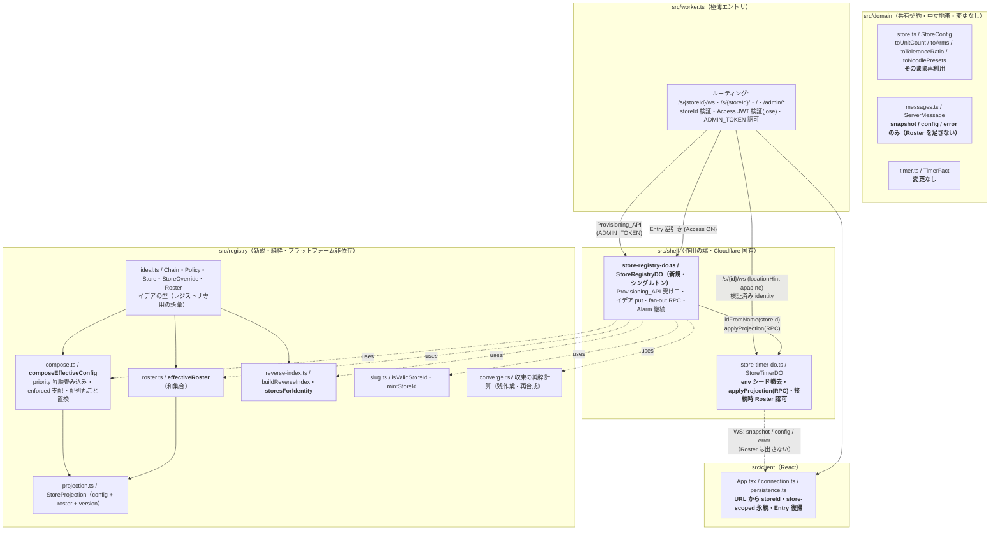
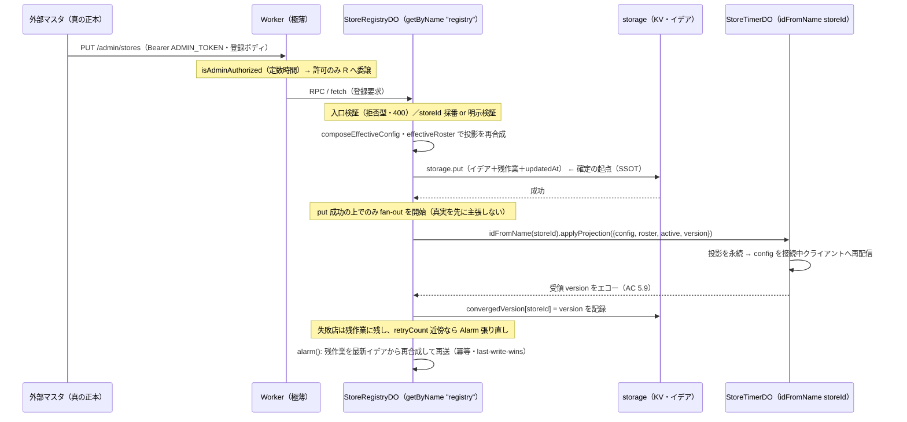
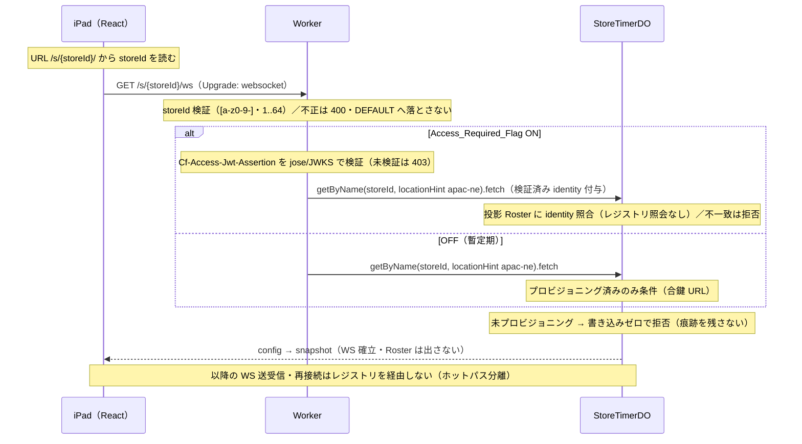
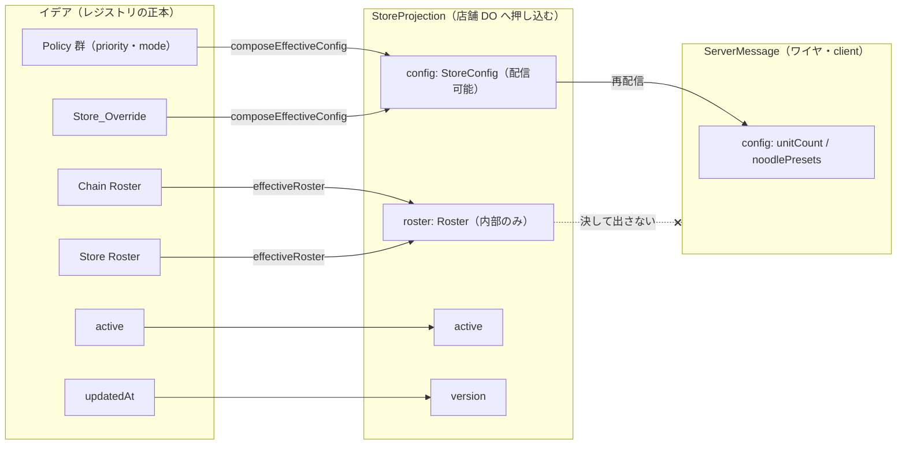

# 技術設計書 — 店舗ごとのプロビジョニング（per-store-provisioning）

## この設計が拠って立つもの

本設計は `requirements.md`（全9要件・EARS 記法・確定済み）を正本とし、ステアリング（`design-philosophy.md` / `timer-model.md` / `naming.md` / `tooling.md`）と既存の中核設計（`.kiro/specs/yude-men-timer/design.md` / `snapshot-broadcast` / `synchronized-boil-adjustment`）を前提とする。設計判断はすべてこの三者から演繹される。

本機能は「単一固定店舗（`DEFAULT_STORE_ID`）＋ env シード」を、**チェーン／店舗の階層を持つマルチテナント**へ拡張する骨格である。中心にあるのは次の 4 つの分離であり、いずれも設計哲学の直接の帰結である。

1. **イデア（望ましい設定の正本）と具現（店舗 DO が動かす投影）の分離。** 階層・統制はイデア空間（新設の `StoreRegistryDO`）に閉じ、具現空間（`StoreTimerDO`・ワイヤ・クライアント）はフラットな完全 `StoreConfig` しか知らない。これは「構造の主権」——階層というベンダー中立の複雑性を一箇所へ封じ込め、既存の純粋な Timer 核（`src/engine`）とワイヤ契約（`src/domain`）を一切触らせない。
2. **計算と作用の分離。** イデアから `StoreConfig` を導く合成（`composeEffectiveConfig`）と実効名簿の導出（`effectiveRoster`）、逆引きインデックスの導出は**純粋関数**として `src/registry/` に閉じる。put・RPC 押し込み・Alarm 再送という作用は `StoreRegistryDO`（shell）が端で実行する。engine と shell の分離を、レジストリ側でも同型に敷く。
3. **同定（addressing）と認可（authorization）の分離。** URL パス `/s/{storeId}/` が宛先を運び、Access が認証（誰か）を担い、店舗 DO の投影 Roster が認可（入ってよいか）を判定する。identity から宛先を導出しない（1 identity : N 店舗で破綻するため）。
4. **導出値を状態に昇格させない。** 逆引きインデックス（identity→店舗）・実効 Roster・Effective_Config はすべてイデアからの**導出値**であり、正本はイデア一本。導出値は名簿・設定の変更で必ず再導出される。

> **スコープ境界（重要）**：本設計は shell（`StoreTimerDO`）・`Worker`・新設レジストリ（`StoreRegistryDO` ＋ `src/registry/`）・クライアントの接続導線のみを扱う。`src/engine`（純粋な状態遷移）と `src/domain` の Timer 契約（`TimerFact` ほか）は**変更しない**。`StoreConfig` 型と検証関数（`toUnitCount` / `toArms` / `toToleranceRatio` / `toNoodlePresets`）は**そのまま再利用**する（要件9.1 / 9.2）。近接同時茹で上がりの同期アルゴリズム（`synchronize`）にも触れない。

---

## Cloudflare 前提（調査済み）

本設計が依拠する Cloudflare の挙動を、確認済みの事実として記録する（実装時に変えない前提）。

1. **DO のアドレッシングとスタブ生成。** `env.STORE_TIMER_DO.getByName(storeId)` は `idFromName(storeId)` → `get(id)` の糖衣であり、スタブを返す。**スタブ生成それ自体は DO をインスタンス化・起床させない**。DO が活性化するのはスタブ上でメソッド（RPC / fetch）を呼んだときだけ。DO 間通信はスタブ上の型付き RPC メソッドで行う。→ レジストリは店舗 DO 参照を `storeId` の永続だけで保持し、押し込みの都度スタブを動的生成する（要件5.7）。未登録 storeId でスタブを作っても DO は生まれない（要件2.6 の「痕跡を残さない」を支える）。（docs: durable-objects/api/namespace #getByName、concepts/durable-object-lifecycle、best-practices/rules-of-durable-objects）
2. **`ctx.id.name`（2026-03-15 以降）。** DO は自身が addressing された名前（`getByName` / `idFromName` のキー）を `ctx.id.name` で内部から読める。`alarm()` 内でも読める。→ `StoreTimerDO` は自身の `storeId` を、`StoreRegistryDO` はシングルトン名 `"registry"` を、**引数受け渡しや永続なしで**読める。`ensureConfigLoaded` の後継はこれを用いて「自分が誰か」を得る（万一この API が利用不可な環境でも、Worker が検証済み storeId を要求に付与する代替で足りる — 設計は揺れない）。（docs: changelog 2026-03-15-durable-object-id-name）
3. **Alarm の at-least-once と再アーム規律。** `alarm()` は at-least-once 実行が保証され、未捕捉例外で指数バックオフ（初回 2 秒・最大 6 回）リトライされる。`AlarmInvocationInfo { retryCount, isRetry }` を受け取る。`setAlarm(timestamp)` は繰り返さない（毎回張り直しが必要）。推奨パターンは「retryCount が上限近傍（>=5）で残作業があるなら、リトライを枯渇させず新しい Alarm を予約する」「作業があるときだけ Alarm を張る」。→ 収束の fan-out を **Alarm をまたぐ継続**として実装する基盤（要件5.4 / 5.8）。既存 `StoreTimerDO` の `ALARM_REARM_THRESHOLD` 規律と同型。（docs: durable-objects/api/base #alarm、best-practices/rules-of-durable-objects scheduling）
4. **Cloudflare Access の JWT 検証（Worker 内）。** Worker は `Cf-Access-Jwt-Assertion` ヘッダを読み、`jose` で検証する（`createRemoteJWKSet(new URL(`${TEAM_DOMAIN}/cdn-cgi/access/certs`))` ＋ `jwtVerify(token, JWKS, { issuer: TEAM_DOMAIN, audience: POLICY_AUD })`）。env 変数 `TEAM_DOMAIN` と `POLICY_AUD` が必要。トークン欠如・無効は 403 で拒否する。`jose` は追加すべき npm 依存（`pnpm add jose`）。→ `Access_Required_Flag` ON 経路（要件8.6）の基盤。JWKS はキャッシュ付き（`createRemoteJWKSet` が内部キャッシュを持つ）。（docs: changelog 2025-10-03-one-click-access-for-workers、cloudflare-one secure-mcp-servers）

---

## Overview

### 何が変わるか（要点）

| 事項 | 変更前 | 変更後 |
| --- | --- | --- |
| 設定の起点 | env シード（`STORE_*`）を DO 初回構築時に検証・永続 | Provisioning_API → `StoreRegistryDO` のイデア put → 投影押し込み |
| 店舗の生成 | `DEFAULT_STORE_ID = "default"` への透過生成 | 明示プロビジョニング（登録）のみ。未登録 storeId は何も生まない |
| 宛先 | `/ws`（単一店舗固定） | `/s/{storeId}/ws`・`/s/{storeId}/`（宛先を URL で運搬） |
| 設定投入 | `Worker → StoreTimerDO` へ `PUT /admin/config` 直接委譲 | `Provisioning_API → StoreRegistryDO → StoreTimerDO.applyProjection`（RPC）の一本 |
| 店舗 DO の受け口 | `applyStoreConfig`（Request 受け・`StoreConfig` 全置換） | `applyProjection`（型付き RPC・`StoreProjection` 受け・version エコー） |
| 接続時認可 | なし（誰でも接続可） | Access ON 時は投影 Roster で判定（レジストリ照会なし） |
| 入口 | 単一画面 | 共通 Entry `/`（Access ON 時に逆引きで行き先解決） |
| クライアント永続 | 単一キー `yudemen.offline.view.v1` | 同キーを **storeId でスコープ**（他店ビューの漏洩を防ぐ） |

### 変えないもの（不変点）

- `src/engine`（純粋な状態遷移）・`src/domain` の Timer 契約（`TimerFact` ほか）（要件9.1 / 9.2）。
- `StoreConfig` 型・検証関数（`toUnitCount` / `toArms` / `toToleranceRatio` / `toNoodlePresets`）（要件9.2）。Effective_Config は `StoreConfig` そのもの。
- SSOT は永続層、確定の起点は `storage.put` 成功のみ。broadcast・RPC 押し込みは put 成功の上にのみ立つ。
- `ServerMessage`（`snapshot` / `config` / `error`）のワイヤ形。**Roster を表現するフィールドを足さない**（構造で漏洩不能にする・要件5.3）。
- ストレージは SQLite バックエンド（`new_sqlite_classes`）＋非同期 KV API のみ。`ctx.storage.sql` は使わない（要件9・tooling）。
- `ADMIN_TOKEN` の定数時間比較（`isAdminAuthorized`）（要件8.1）。

### 中心的判断（各判断は後続節で詳述）

1. **イデアの置き場は KV ではなくシングルトン DO（`StoreRegistryDO`・`getByName("registry")`）**。put → 押し込み → 失敗時 Alarm 再送を一箇所で直列化し、既存の Alarm リトライ規律を再利用する（要件 前文・Cloudflare 前提 3）。
2. **合成は単一の純粋関数 `composeEffectiveConfig`**（priority 昇順畳み込み・enforced 支配・配列丸ごと置換）。名簿の和集合は独立した純粋関数 `effectiveRoster`（要件4 / 3.5）。
3. **投影の型を「配信可能な `StoreConfig`」と「サーバ内部の `Roster`」に分離**して、Roster のワイヤ漏洩を構築不能にする（要件5.3）。
4. **収束は put-first → 直列 fan-out → Alarm 継続**。残作業を永続し、last-write-wins の冪等再送で自然収束する（要件5）。
5. **店舗 DO は投影のみで自立**。復帰ホットパスも接続時認可もレジストリへ越境しない（要件6）。

---

## Architecture

### 触る層と触らない層



**新規に足す箇所:**

- `src/registry/`（新規ディレクトリ・純粋層） — `ideal.ts`（イデアの型）・`compose.ts`（`composeEffectiveConfig`）・`roster.ts`（`effectiveRoster`）・`reverse-index.ts`（`buildReverseIndex` / `storesForIdentity`）・`slug.ts`（`isValidStoreId` / `mintStoreId`）・`projection.ts`（`StoreProjection`）・`converge.ts`（収束の純粋計算）。engine と同型の「プラットフォーム非依存の純粋な決定機構」。
- `src/shell/store-registry-do.ts`（新規） — `StoreRegistryDO`。Provisioning_API の受け口・イデアの put・fan-out RPC・Alarm 継続という**作用**を担う。純粋計算は `src/registry/` へ委譲する。

**変更する箇所:**

- `src/worker.ts` — `/s/{storeId}/` 系ルーティング・storeId 検証・Entry 逆引き・Access JWT 検証（`jose`）・Provisioning_API 委譲。`DEFAULT_STORE_ID` と `/ws`・`/admin/config` 直接委譲を撤去。
- `src/shell/store-timer-do.ts` — env シード分岐と `STORE_*` 依存を撤去、`applyStoreConfig`（Request）を `applyProjection`（RPC）へ、`ensureConfigLoaded` を「要プロビジョニング検出＋投影ロード」へ改める。接続時 Roster 認可・非活性化時の接続閉鎖を足す。
- `src/client/App.tsx` / `connection.ts` / `persistence.ts` — URL から storeId 取得・`/s/{storeId}/ws` 接続・store-scoped 永続・接続拒否時の Entry 復帰・店舗切替 UI。
- `wrangler.jsonc` — `STORE_REGISTRY_DO` バインディング・`new_sqlite_classes` マイグレーション追加、`ACCESS_REQUIRED` / `TEAM_DOMAIN` / `POLICY_AUD` 追加、`STORE_*` シード撤去。

**変更しない箇所:** `src/engine/**`・`src/domain/**`・`src/transport/**`。

### プロビジョニング → 収束のデータフロー



### 接続とホットパス分離



---

## Components and Interfaces

> 型・関数名のうち **公開シンボル**は `naming.md` に従い実装前にユーザー確認を要する（末尾「公開シンボルの確認ゲート」）。本節のシグネチャは確認対象の候補として提示する。

### Component 1: `src/registry/ideal.ts` — イデアの型（レジストリ専用の語彙）

**目的**：チェーン・Policy・店舗・名簿という「望ましい設定の正本」を型で表す。これらは**レジストリだけが使う**（client も engine も見ない）ため、`domain` ではなくレジストリ側に置く（`timer-model.md`「基底の定義の場所は audience に従う」の帰結）。

```typescript
/** storeId — 店舗 DO の名前（idFromName のキー）かつ URL 宛先。グローバル一意のスラッグ。 */
export type StoreId = string;
/** チェーン識別子（イデアのメタデータ。URL・DO 名には出さない）。 */
export type ChainId = string;
/** Policy 識別子。 */
export type PolicyId = string;
/** identity — Access が発行する JWT の正準クレーム（不透明な文字列）。Roster の要素。 */
export type Identity = string;

/** Policy のフィールド mode。enforced = 統制（後の層は上書き不可）／default = 既定供給（上書き可）。 */
export type PolicyMode = "enforced" | "default";

/** mode 付きの値。Policy はフィールドごとに mode と値を持つ（要件3.3）。 */
export interface ModedValue<T> {
  readonly mode: PolicyMode;
  readonly value: T;
}

/**
 * PolicyFields — Policy が主張するフィールドの部分集合（各フィールドは任意）。
 * StoreConfig の各フィールドに対応し、Policy はその一部だけを mode 付きで主張してよい。
 */
export interface PolicyFields {
  readonly unitCount?: ModedValue<number>;
  readonly arms?: ModedValue<number>;
  readonly toleranceRatio?: ModedValue<number>;
  readonly noodlePresets?: ModedValue<NonEmptyArray<NoodlePreset>>; // 配列は丸ごと置換の単位（要件4.4）
}

/** Policy — 名前・priority・フィールドごとの mode/値。地域差・業態差は Policy の割当で表現する（要件3.3）。 */
export interface Policy {
  readonly policyId: PolicyId;
  readonly chainId: ChainId;
  readonly name: string;
  readonly priority: number; // 小さいほど上位（全社統制）。昇順に畳む（要件4.2 / 4.3）
  readonly fields: PolicyFields;
}

/** Store_Override — 店舗の個別値（部分設定）。合成の最終層。統制中も保持し、無視するに留める（要件4.7）。 */
export interface StoreOverride {
  readonly unitCount?: number;
  readonly arms?: number;
  readonly toleranceRatio?: number;
  readonly noodlePresets?: NonEmptyArray<NoodlePreset>;
}

/** Roster — 接続を許可する identity の集合（順序に意味を持たせない・重複は同一視）。ワイヤに出さない。 */
export type Roster = readonly Identity[];

/** Chain — 店舗を束ねる組織単位。個人店も店舗 1 のチェーンとして表す（同型・要件3.2）。 */
export interface Chain {
  readonly chainId: ChainId;
  readonly name: string;
  readonly chainRoster: Roster; // 全店共通の名簿（本部・SV 等）
}

/** Store — 店舗のイデア。所属 chainId・Policy 割当・Store_Override・店舗 Roster・活性状態を持つ（要件3.1 / 3.9）。 */
export interface Store {
  readonly storeId: StoreId;
  readonly chainId: ChainId;
  readonly name: string; // 人間可読の店舗名（Entry の店舗リスト・切替 UI の表示用。storeId はランダムスラッグゆえ表示に使えない）
  readonly policyIds: readonly PolicyId[]; // このチェーンの Policy のうち店舗へ割り当てるもの
  readonly override: StoreOverride;
  readonly storeRoster: Roster;
  readonly active: boolean; // false = deactivated（閉店・要件3.9 / 6.6）
  readonly storeCode?: string; // 外部マスタの店舗コード（イデアのメタデータ。URL には漏らさない・要件2.2）
  readonly createdAt: number; // 登録時刻（不変）。既定店舗（登録順の先頭・要件7.4）の順序基準
  readonly updatedAt: number; // 最終更新時刻（監査・一覧表示用）。収束の突き合わせには revision（Data Models 参照）を用いる
}
```

> **naming ゲート**：`Chain` / `Policy` / `StoreOverride` / `Roster` / `PolicyMode`（`"enforced"` / `"default"`）は公開シンボル。Effective_Config は既存 `StoreConfig` を再利用し新設しない。

### Component 2: `src/registry/compose.ts` — Effective_Config の合成（単一純粋関数）

**目的**：Chain の Policy 群と Store_Override から完全な `StoreConfig` を導く、作用を含まない単一関数（要件4.1）。

```typescript
/**
 * composeEffectiveConfig — Policy 群（priority 昇順に畳む）と Store_Override から完全な StoreConfig を合成する。
 *
 * ・基底は domain の DEFAULT_*（どの層も主張しないフィールドの供給源＝出力完全性を保証・要件4.5）。
 * ・priority 昇順（小さい＝全社統制が先）に畳む。enforced はその層で確定し以後ロック（後の層・Override が無視される・要件4.2）。
 * ・複数層が同一フィールドを enforced 主張する縦の衝突は、先に畳まれる上位（小さい priority）が勝つ（要件4.3）。
 * ・配列フィールド（noodlePresets）は層ごとの丸ごと置換（要素マージなし・要件4.4）。
 * ・Store_Override は最終層で、ロックされていないフィールドにのみ適用される。統制解除時は再びロックが外れ Override が復活する（要件4.7）。
 *
 * 入力の Policy は同一チェーン所属・値域検証済み（入口で拒否型検証済み・要件4.6）を前提とする。純粋・決定的・順序非依存。
 */
export function composeEffectiveConfig(
  policies: readonly Policy[],
  override: StoreOverride,
): StoreConfig;
```

**責務**：
- 出力は必ず `StoreConfig` の全フィールド（`unitCount` / `arms` / `toleranceRatio` / `noodlePresets`）を持ち、既存検証関数の値域に収まる（要件4.5）。
- priority 同着で同一フィールドを主張する曖昧さは**入口検証で排除済み**（要件3.4）ゆえ、合成関数は同着を安定順序（`policyId` 昇順）で決定的に畳むだけでよい。

### Component 3: `src/registry/roster.ts` — 実効名簿の導出

```typescript
/**
 * effectiveRoster — チェーン Roster と店舗 Roster の和集合（重複排除）。priority / enforced の統制意味論は持たない（要件3.5）。
 * deny 手段を持たない（除外は名簿の構成で表現する）。純粋・冪等・順序非依存。
 */
export function effectiveRoster(chainRoster: Roster, storeRoster: Roster): Roster;
```

### Component 4: `src/registry/reverse-index.ts` — identity 逆引き

```typescript
/** identity → 接続可能店舗リストの逆引きインデックス（イデアからの導出値・要件3.6）。 */
export type ReverseIndex = ReadonlyMap<Identity, readonly StoreId[]>;

/**
 * buildReverseIndex — 全 Chain・Store から逆引きインデックスを事前計算する（名簿の書き込み時に再導出）。
 * 各店舗の effectiveRoster を走査し identity→storeId を積む。活性店舗のみを対象とする。
 * 店舗の登録順（createdAt 昇順・不変）で storeId を並べ、既定店舗（先頭）の決定を安定させる（要件7.4。
 * updatedAt を順序基準にすると店舗更新のたびに「先頭」が動くため、不変の createdAt を用いる）。純粋・決定的。
 */
export function buildReverseIndex(chains: readonly Chain[], stores: readonly Store[]): ReverseIndex;

/**
 * storesForIdentity — 逆引きインデックスの単一読み出し（Entry の行き先解決・要件7.2）。
 * 未登録 identity は空配列。全名簿を走査しない（保持済みインデックスの参照のみ）。
 */
export function storesForIdentity(index: ReverseIndex, identity: Identity): readonly StoreId[];
```

### Component 5: `src/registry/slug.ts` — storeId の採番と検証

```typescript
/** 許容文字集合（[a-z0-9-]）かつ長さ 1..64 を満たすか（要件1.2 / 2.3）。 */
export function isValidStoreId(raw: string): boolean;

/**
 * mintStoreId — 推測困難なランダムスラッグを採番する（要件2.2）。乱数は端（shell）が供給する
 * （crypto.getRandomValues を注入）。純粋関数としては「乱数バイト列 → slug」に留め、乱数採取は shell。
 */
export function mintStoreId(randomBytes: Uint8Array): StoreId;
```

### Component 6: `src/registry/projection.ts` — 投影の型（Roster 漏洩を構造で封じる）

**目的**：店舗 DO へ押し込む投影を「配信可能な `StoreConfig`」と「サーバ内部の `Roster`」に**構造分離**する。`domain`（client も見る中立地帯）には置かず、shell 間の RPC 契約としてレジストリ側に置くことで、Roster が `ServerMessage`（ワイヤ）へ到達する経路を型レベルで断つ（要件5.3）。

```typescript
/**
 * StoreProjection — レジストリが店舗 DO へ押し込む投影。config だけが配信可能で、roster はサーバ内部に留まる。
 * この型は src/registry/ と src/shell/store-timer-do.ts のみが import し、client（domain 経由）には到達しない。
 */
export interface StoreProjection {
  readonly config: StoreConfig; // 配信可能（config ServerMessage で再配信される）
  readonly roster: Roster;      // サーバ内部のみ（接続時認可に使うが、ServerMessage には決して載らない）
  readonly active: boolean;     // deactivated なら店舗 DO が新規接続を拒否し既存 WS を閉じる（要件6.6）
  readonly version: number;     // = 合成時点のレジストリ revision（イデアの全書き込みで単調増加・収束の突き合わせ・要件5.9）
}
```

### Component 7: `src/shell/store-registry-do.ts` — `StoreRegistryDO`（新規・作用の端）

**目的**：Provisioning_API の受け口・イデアの put・fan-out RPC 押し込み・Alarm 継続という**作用**を担う。純粋計算（合成・逆引き・収束の残作業計算）は `src/registry/` へ委譲する。シングルトンとして `getByName("registry")` で addressing され、自身の名は `ctx.id.name` で読む（Cloudflare 前提 2）。

```typescript
export class StoreRegistryDO extends DurableObject<Env> {
  // ── Provisioning_API（要件2.1 / 2.10）。認証は Worker 端で済（到達＝許可済み）。RPC メソッド化を想定。──

  /** チェーンの登録／更新。put 成功の上で影響店舗の収束を開始する。 */
  createOrUpdateChain(input: ChainInput): Promise<ProvisionResult>;
  /** Policy の登録／更新。同一 priority・同一フィールドの曖昧割当は 400 で拒否（要件3.4）。 */
  createOrUpdatePolicy(input: PolicyInput): Promise<ProvisionResult>;
  /**
   * 店舗の登録。storeId 明示指定は検証（文字集合・長さ・未使用）通過時のみ受理、違反は 400 で
   * 別 ID 代替なし（要件2.3 / 2.4）。未指定はランダムスラッグを採番して返す（要件2.2）。
   * イデア put 成功の上で当該店舗を materialize（applyProjection 押し込み）する（要件2.5 / 5.1）。
   */
  createStore(input: StoreInput): Promise<CreatedStore>;
  /** 店舗の更新（Policy 割当・Override・Roster・active）。影響店舗の収束を開始する（要件3.7 / 3.9）。 */
  updateStore(storeId: StoreId, patch: StorePatch): Promise<ProvisionResult>;
  /** Roster の更新（チェーン／店舗）。逆引きインデックスを再導出し収束を開始する（要件3.6 / 3.7）。 */
  updateRoster(target: RosterTarget, roster: Roster): Promise<ProvisionResult>;

  // ── 最小の読み出し（要件2.10・ADMIN_TOKEN と同一認可）──
  listChains(): Promise<readonly ChainSummary[]>;
  getStore(storeId: StoreId): Promise<StoreView | undefined>;
  listStores(chainId?: ChainId): Promise<readonly StoreSummary[]>;

  // ── Entry の逆引き（要件7.2・低頻度）──
  storesForIdentity(identity: Identity): Promise<readonly StoreId[]>;

  // ── 収束（Alarm 継続・要件5.4 / 5.8）──
  override alarm(alarmInfo?: AlarmInvocationInfo): Promise<void>;
}
```

**責務**：
- **put-first**：いかなる登録／更新も、まずイデア（＋残作業リスト＋`meta:revision` の増分）を `storage.put` で確定してから fan-out を始める（要件5.1・SSOT 規律）。
- **fan-out**：影響店舗を逆引きし、各 `env.STORE_TIMER_DO.idFromName(storeId)` のスタブへ `applyProjection` を直列 RPC。スタブは押し込みの都度生成し、永続しない（要件5.7・Cloudflare 前提 1）。
- **Alarm 継続**：1 回の実行で全店完了を前提とせず、残作業を永続して次の Alarm で続行。`retryCount` 近傍で新規 Alarm を張り直す（要件5.8・Cloudflare 前提 3）。
- **収束観測**：各店の受領 version（`applyProjection` のエコー）を `convergedVersion[storeId]` として記録し、レジストリ `revision` と突き合わせる（要件5.9 / 5.6）。

**HTTP 面（Provisioning_API のルート）**：Worker は `ADMIN_TOKEN` 認可のみを行い、Request をレジストリへ素通しする。ルート解釈・JSON ボディのパース・拒否型 400 応答はレジストリの `fetch` に閉じる（Worker 極薄の維持）。上記メソッド群はその内部ディスパッチ先であり、型付き RPC として外へ公開するのは `storesForIdentity`（Worker の Entry 用）のみ。

| ルート | 操作 |
| --- | --- |
| `PUT /admin/chains/{chainId}` | createOrUpdateChain（チェーン Roster を含むボディ全置換） |
| `PUT /admin/policies/{policyId}` | createOrUpdatePolicy |
| `POST /admin/stores` | createStore（storeId 未指定は採番・明示指定は検証） |
| `PUT /admin/stores/{storeId}` | updateStore（Policy 割当・Override・storeRoster・active・name） |
| `GET /admin/chains` ／ `GET /admin/stores?chainId=` ／ `GET /admin/stores/{storeId}` | listChains ／ listStores ／ getStore（要件2.10） |

### Component 8: `src/shell/store-timer-do.ts` — `StoreTimerDO` の変更

**目的**：env シード依存を撤去し、投影の受け口を型付き RPC 化し、接続時 Roster 認可・非活性化対応を足す。

```typescript
export class StoreTimerDO extends DurableObject<Env> {
  /**
   * applyProjection — レジストリからの投影押し込みを受ける型付き RPC（現行 applyStoreConfig の後継）。
   * 投影を永続し、StoreConfig の変化を接続中の全クライアントへ config で再配信する（既存 applyStoreConfig の
   * broadcast 経路を継承・要件5.2）。deactivated を受けたら新規接続を拒否し既存 WS を閉じる（要件6.6）。
   * 受領した version をエコーで返す（要件5.9）。受領 version が永続済み version より小さい投影は適用せず、
   * 永続済み version をエコーする（単調ガード — レジストリのリクエスト処理と Alarm 継続の fan-out は
   * await 中に並走しうるため、到着順が逆転しても last-write-wins が店舗 DO 側で完結する）。
   * Roster は永続するが ServerMessage には決して載せない（要件5.3）。
   */
  applyProjection(projection: StoreProjection): Promise<{ readonly version: number }>;

  /**
   * ensureProvisioned（現行 ensureConfigLoaded の後継）— env シード分岐を撤去し「要プロビジョニング検出＋投影ロード」へ。
   * 自身の storeId は ctx.id.name から読む（Cloudflare 前提 2）。投影が永続されていなければ「未プロビジョニング」。
   */
  // private ensureProvisioned(): Promise<ProvisionState>;

  // fetch: 未プロビジョニングなら書き込みゼロで接続拒否（要件2.6）。Access ON 時は Worker が付与した
  //   検証済み identity を投影 Roster に照合し、不一致は拒否（要件6.3）。OFF 時はプロビジョニング済みのみ条件（要件6.4）。
  override fetch(request: Request): Promise<Response>;
}
```

**責務と撤去**：
- **撤去**：`ensureConfigLoaded` の env シード分岐、`STORE_UNIT_COUNT` / `STORE_ARMS` / `STORE_TOLERANCE_RATIO` / `STORE_NOODLE_PRESETS` 依存、`applyStoreConfig`（Request 受けの `PUT /admin/config` 処理）。
- **未プロビジョニング拒否**：投影未永続の DO への WS 接続は、`ensureProvisioned` が未プロビジョニングを検出し、`storage.put` を一切行わずに拒否する（要件2.6・書き込みゼロの DO は消滅し痕跡を残さない）。
- **接続時認可（Access ON）**：Worker が JWT 検証済みの identity をヘッダ等で渡す。DO は永続投影の Roster にローカル照合し、不一致なら接続拒否（レジストリ照会なし・要件6.3）。session 途中の名簿改定は次接続から反映（現接続は維持）、deactivated は現接続も即閉鎖（要件6.6）。
- **自立性**：rehydrate 時にレジストリへ越境読みをしない。最後に受領した投影で稼働継続（要件6.1 / 6.2）。

### Component 9: `src/worker.ts` — ルーティングと認証・認可

**目的**：宛先の運搬・storeId 検証・Access JWT 検証・Provisioning_API 認可・Entry 逆引き・ホットパス分離。

```typescript
export default {
  async fetch(request: Request, env: Env): Promise<Response> {
    // 1. /admin/*（Provisioning_API）: isAdminAuthorized（定数時間）→ 許可のみ StoreRegistryDO("registry") へ委譲（要件8.1〜8.3）
    // 2. /s/{storeId}/ws: storeId 検証（isValidStoreId・不正は 400・DEFAULT へ落とさない・要件1.2）
    //    Access ON なら Cf-Access-Jwt-Assertion を jose/JWKS で検証（未検証は 403・要件8.6）、検証済み identity を DO へ
    //    getByName(storeId) は locationHint 非対応のため idFromName→get({ locationHint: "apac-ne" })（要件1.4）
    // 3. /s/{storeId}/（画面・SPA）: storeId 検証 → ASSETS フォールバック（SPA が storeId を URL から読む）
    // 4. /（Entry）: Access ON なら JWT 検証 → storesForIdentity で行き先解決（1→リダイレクト / 複数→既定店（登録順の先頭）へリダイレクト / 0→接続先なし・要件7.2〜7.5）
    //    店舗リストの受け渡しは GET /entry/stores（JSON: (storeId, name)[]・Access ON・低頻度）— 302 はボディを運べないため、切替 UI は SPA がこれを取得する（要件7.4）
    //               OFF なら Entry の行き先解決を提供しない（合鍵 URL 直叩き・要件7.8）
    // 5. その他: ASSETS フォールバック
  },
} satisfies ExportedHandler<Env>;
```

```typescript
// Access JWT 検証（jose・Cloudflare 前提 4）。ACCESS_REQUIRED が ON のときのみ経路に入る。
import { createRemoteJWKSet, jwtVerify } from "jose";
// JWKS は createRemoteJWKSet の内部キャッシュを跨リクエストで再利用（モジュールスコープに保持）。
async function verifyAccessIdentity(request: Request, env: Env): Promise<Identity | null>;
// isAdminAuthorized / timingSafeEqual は現行のまま再利用（要件8.1）。
```

**責務**：
- **storeId 検証をルーティングの前段に置く**：不正・導出不能は 400 で DO へ到達させない。`DEFAULT_STORE_ID` フォールバックを撤去（要件1.2）。
- **ホットパス分離**：レジストリ照会は Entry・`/entry/stores`（低頻度）に限る。WS 接続・再接続経路（高頻度）ではレジストリを経由しない（要件7.7）。
- **Access バイパス防御**：`ACCESS_REQUIRED` ON では未検証ヘッダを信用せず、必ず JWKS 署名検証を通した identity のみを DO へ渡す（要件8.6）。
- **内部 identity ヘッダの偽装防御**：店舗 DO へ identity を運ぶ内部ヘッダは、転送時に必ず無条件で除去した上で、ON かつ検証成功時にのみ Worker が付与し直す（クライアント由来の同名ヘッダを決して透過しない。OFF 時も除去する）。

### Component 10: `src/client/*` — 接続導線

**目的**：URL から storeId を読み、`/s/{storeId}/ws` へ接続し、永続を storeId でスコープし、接続拒否時に Entry へ戻る。

```typescript
// App.tsx: window.location.pathname から storeId を読む（/s/{storeId}/）。
function storeIdFromPath(pathname: string): StoreId | null;
function timerSocketUrl(storeId: StoreId): string; // `${wsProto}//${host}/s/${storeId}/ws`

// persistence.ts: 保存キーを storeId でスコープする（要件1.5 / 1.6）。
//   現在の storeId にスコープされていない／一致しない永続ビューは空として扱い、前店舗ビューを再水和しない。
export function scopedStorageKey(storeId: StoreId): string; // `yudemen.offline.view.v1:${storeId}`
export function localStorageViewStore(storeId: StoreId): ViewStore; // storeId を必須引数化

// connection.ts: 接続拒否（未プロビジョニング／Roster 不一致／deactivated）を検出したら Entry へ戻る合図を出す。
//   店舗切替（複数店舗担当）は Entry が渡す店舗リストを設定画面で提示する。
```

**責務**：
- **store-scoped 永続（必須）**：`localStorageViewStore` は storeId を必須引数に取り、キーを `yudemen.offline.view.v1:{storeId}` とする。スコープ不一致・未スコープはフェイルセーフに空で初期化（要件1.5 / 1.6）。
- **前回使用店の記憶と直行**：前回の Store_Path を記憶し次回直行してよい。接続拒否時は Entry へ戻って再解決（要件7.6）。
- **店舗切替 UI**：複数店舗担当（SV・本部）向けに、`GET /entry/stores` が返す店舗リスト（storeId と表示名 `name` の組）を設定画面で切り替え可能にする（要件7.4。storeId はランダムスラッグゆえ、表示は必ず `name` を用いる）。
- **ACCESS OFF 期の PWA 起動**：start_url `/` で開いた SPA は、前回使用店の記憶があればクライアント側で店舗パスへ直行する（Entry の行き先解決は OFF 期に存在しないため、これが唯一の復帰経路。記憶が無ければ合鍵 URL の直叩きを案内する表示に落とす・要件7.8 の帰結）。
---

## Data Models

### レジストリの永続モデル（イデア・KV API のみ）

`StoreRegistryDO` は SQLite バックエンド（`new_sqlite_classes`）＋**非同期 KV API のみ**で永続する（`ctx.storage.sql` は使わない・要件9・tooling）。イデアと導出値・収束台帳を別キー群に持つ。

| キー | 値 | 区分 | 備考 |
| --- | --- | --- | --- |
| `chain:{chainId}` | `Chain` | イデア（正本） | チェーン Roster を含む |
| `policy:{policyId}` | `Policy` | イデア（正本） | priority・フィールド mode/値 |
| `store:{storeId}` | `Store` | イデア（正本） | chainId・policyIds・override・storeRoster・active・updatedAt |
| `index:reverse` | `ReverseIndex`（配列化） | **導出値**（再構築可能） | 名簿書き込み時に再導出（要件3.6） |
| `index:code` | `Record<storeCode, storeId>` | **導出値** | 外部コード→storeId の突き合わせ補助 |
| `meta:revision` | `number` | イデア付随（正本） | レジストリ全体の狭義単調 revision。イデアの全書き込みで +1・投影 version と収束台帳の基準（要件5.6） |
| `converge:residual` | `readonly StoreId[]` | 収束の残作業 | 未完了店舗（Alarm 継続の対象・要件5.8） |
| `converge:version:{storeId}` | `number` | 収束台帳 | 受領済み投影の revision（要件5.9） |

- **逆引きは導出値であり正本ではない。** 正本はイデア（`chain:*` / `store:*`）一本。`index:reverse` は名簿変更のたび `buildReverseIndex` で必ず再導出される（導出値を状態に昇格させない・要件3.6）。破損しても全イデアから再構築できる。
- **storeId はチェーン名前空間に埋め込まない。** `store:{storeId}` はグローバル一意キー。チェーン所属は `Store.chainId`（メタデータ）。店舗の移籍は `chainId` の書き換えだけで済み、DO 名・接続 URL に波及しない（要件3.8）。
- **revision は狭義単調増加。** イデアのあらゆる書き込みで `meta:revision` を +1 する（シングルトン DO 内で直列化されるため自明に単調）。投影の version は**合成時点の revision**であり、Chain・Policy・Roster のどの変更でも必ず進む — `Store.updatedAt` を version 基準にすると Policy 変更が version を動かせず収束台帳が壊れるため、revision を基準にする（要件5.6）。`updatedAt` / `createdAt` は監査・一覧表示・登録順の用途に留める。

### 投影（店舗 DO 側の永続）

`StoreTimerDO` は受領した `StoreProjection` を単一キーで永続する。現行の `storeConfig` キーを投影全体（config + roster + active + version）へ拡張する。

| キー | 変更前 | 変更後 |
| --- | --- | --- |
| `storeConfig` | `StoreConfig` | 廃止 |
| `projection` | — | `StoreProjection`（config + roster + active + version） |

- **config は配信可能、roster は内部のみ。** `applyProjection` は投影を put し、`config` フィールドだけを `ServerMessage.config` として再配信する。`roster` は接続時認可に使うが `ServerMessage` には載せない（型に載せる場所が無い・要件5.3）。
- **version は単調ガード。** `applyProjection` は受領 version が永続済み version より小さい投影を適用せず、永続済み version をエコーする（並走 fan-out による到着順逆転への防御・要件5.4）。
- **`activeTimers`（Timer SSOT）は不変。** 本機能は Timer 状態のスキーマを変えない（要件9.1）。投影は Timer SSOT と別キー・別概念（現行 `storeConfig` と同じ独立性）。

### イデア → 投影の射影境界



### 型の帰属（`domain` を汚さない）

`timer-model.md`「基底の定義の場所は audience に従う」に厳密に従う。

- **`domain` に足さない。** `Chain` / `Policy` / `StoreOverride` / `Roster` / `StoreProjection` はレジストリと店舗 DO（server 側）だけが使い、client は見ない。ゆえに `src/registry/` に置き、`domain`（client も見る中立地帯）へは混ぜない。
- **`StoreConfig` は再利用。** Effective_Config は `domain/store.ts` の `StoreConfig` そのもの（新設しない）。合成結果が既存検証関数の値域に収まることを保証する（要件4.5）。
- **`ServerMessage` は不変。** `config` / `snapshot` / `error` の 3 種のまま。Roster を表現するフィールドを足さないことが、漏洩の構造的排除そのものである（要件5.3）。

### env・バインディング（`Env` の変化）

`pnpm cf-typegen`（`wrangler types`）で再生成される `Env` の変化点。

| 変数 / バインディング | 変更 | 用途 |
| --- | --- | --- |
| `STORE_REGISTRY_DO` | 追加（DO バインディング） | レジストリ DO（`getByName("registry")`） |
| `STORE_TIMER_DO` | 不変 | 店舗 DO |
| `ACCESS_REQUIRED` | 追加（vars・`"0"`/`"1"`） | Access 統合の有効化フラグ（要件8.7） |
| `TEAM_DOMAIN` | 追加（vars） | Access チーム URL（JWKS・issuer・要件8.6） |
| `POLICY_AUD` | 追加（vars） | Access アプリの audience（要件8.6） |
| `ADMIN_TOKEN` | 不変（secret） | Provisioning_API の Bearer（要件8.1） |
| `STORE_UNIT_COUNT` / `STORE_ARMS` / `STORE_TOLERANCE_RATIO` / `STORE_NOODLE_PRESETS` | **撤去** | env シード廃止（要件2.7 / 9.3） |

---

## Algorithmic Pseudocode（Key Pure Functions with Formal Specifications）

> 以下はすべて `src/registry/` の純粋関数。作用（put・RPC・Alarm）を含まず、同じ入力に同じ出力を返す。`converge` の残作業計算のみ純粋に切り出し、実際の put/RPC/setAlarm は shell が実行する。

### `composeEffectiveConfig`（priority 昇順畳み込み・enforced 支配）

```pascal
ALGORITHM composeEffectiveConfig(policies, override)
INPUT:  policies（同一チェーンの Policy 群・値域検証済み）, override（Store_Override）
OUTPUT: 完全な StoreConfig

BEGIN
  // 基底層：どの層も主張しないフィールドの供給源（出力完全性を保証）
  acc    ← { unitCount: DEFAULT_UNIT_COUNT, arms: DEFAULT_ARMS,
             toleranceRatio: DEFAULT_TOLERANCE_RATIO, noodlePresets: DEFAULT_NOODLE_PRESETS }
  locked ← EMPTY SET   // enforced で確定済みのフィールド名

  // priority 昇順（小さい＝全社統制が先）。同着は policyId 昇順で安定化（曖昧割当は入口で排除済み）
  ordered ← SORT policies BY (priority ASC, policyId ASC)

  FOR each policy IN ordered DO
    FOR each field IN policy.fields DO           // 主張されたフィールドのみ
      IF field ∈ locked THEN CONTINUE            // 上位 enforced が確定済み → 無視（要件4.3）
      acc[field] ← policy.fields[field].value    // 丸ごと置換（配列も要素マージしない・要件4.4）
      IF policy.fields[field].mode = "enforced" THEN locked ← locked ∪ {field}  // 以後ロック（要件4.2）
    END FOR
  END FOR

  // Store_Override は最終層。ロックされていないフィールドにのみ適用（統制中は無視・解除で復活・要件4.7）
  FOR each field IN override DO
    IF field ∉ locked THEN acc[field] ← override[field]
  END FOR

  RETURN acc
END
```

**Preconditions:**
- `policies` は同一チェーン所属で、各値は既存検証関数の値域内（入口で拒否型検証済み・要件4.6）。
- 同一 priority で同一フィールドを主張する Policy は存在しない（入口検証で排除済み・要件3.4）。

**Postconditions:**
- 返り値は `StoreConfig` の全フィールドを持ち、各値は対応する検証関数の値域内（要件4.5）。
- あるフィールドを enforced 主張する層が存在するとき、返り値のそのフィールドは**最小 priority の enforced 層の値**に等しい（要件4.3）。
- どの層も主張しないフィールドは `DEFAULT_*` に等しい。
- `override` のフィールドは、そのフィールドがどの層でも enforced されていないとき、かつそのときに限り返り値に反映される（要件4.7）。

**Loop Invariants:**
- 外側ループ後：`locked` は「これまでに畳んだ層で enforced 主張されたフィールド」の集合。`acc[field]` は「`field` を最後に主張した非ロック層、またはロック確定時の値」。
- `locked` は単調増加（一度ロックされたフィールドは解除されない＝上位が勝つ・要件4.3）。

### `effectiveRoster`（和集合・独立導出）

```pascal
ALGORITHM effectiveRoster(chainRoster, storeRoster)
OUTPUT: Roster（重複排除した和集合）
BEGIN
  RETURN DISTINCT(chainRoster ++ storeRoster)   // 順序に意味を持たせない。deny なし（要件3.5）
END
```

**Postconditions:** 返り値は `chainRoster ∪ storeRoster`（集合として）。`effectiveRoster(a, effectiveRoster(a, b)) = effectiveRoster(a, b)`（冪等）。順序非依存（集合等価）。

### `buildReverseIndex`（逆引きの導出）

```pascal
ALGORITHM buildReverseIndex(chains, stores)
OUTPUT: ReverseIndex（identity → storeId[]）
BEGIN
  chainRosterOf ← MAP chainId → chain.chainRoster
  index ← EMPTY MAP
  // 店舗の登録順（createdAt 昇順・同着 storeId 昇順）で走査し、既定店舗（先頭）を安定化（要件7.4）
  FOR each store IN SORT(stores WHERE store.active) BY (createdAt ASC, storeId ASC) DO
    roster ← effectiveRoster(chainRosterOf[store.chainId] ?? [], store.storeRoster)
    FOR each identity IN roster DO
      index[identity] ← APPEND(index[identity] ?? [], store.storeId)  // 出現順＝登録順を保つ
    END FOR
  END FOR
  RETURN index
END
```

**Preconditions:** `chains` / `stores` はイデアの現在値。
**Postconditions:**
- 任意の identity `e` について `index[e]` は「`e` が実効 Roster に含まれる活性店舗の storeId 集合」に一致（重複なし・登録順）。
- 非活性店舗は含まれない。全イデアからの純粋関数ゆえ、いつでも再構築でき正本イデアと整合（要件3.6）。

### `converge`（収束の残作業計算・Alarm 継続の純粋核）

作用（put・RPC・setAlarm）は shell が持つ。ここでは「今どの店舗を・どの投影で押すべきか」「残作業をどう更新するか」という**純粋な決定**だけを切り出す。

```pascal
ALGORITHM affectedStores(idealChange, chains, stores, policies)
OUTPUT: 収束対象の storeId 集合
BEGIN
  // 変更種別ごとに影響店舗を逆引き（Chain 変更→そのチェーンの全店、Policy 変更→割当店、店舗変更→当該店）
  CASE idealChange OF
    ChainChanged(cid):  RETURN { s.storeId | s ∈ stores, s.chainId = cid }
    PolicyChanged(pid): RETURN { s.storeId | s ∈ stores, pid ∈ s.policyIds }
    StoreChanged(sid):  RETURN { sid }
    RosterChanged(t):   RETURN storesAffectedByRoster(t, stores)   // チェーン Roster→全店、店舗 Roster→当該店
  END CASE
END

ALGORITHM recomposeProjection(storeId, chains, stores, policies, revision)
OUTPUT: StoreProjection（その時点の最新イデアから再合成・要件5.4）
BEGIN
  store    ← stores[storeId]
  chain    ← chains[store.chainId]
  assigned ← { policies[pid] | pid ∈ store.policyIds }
  config   ← composeEffectiveConfig(assigned, store.override)
  roster   ← effectiveRoster(chain.chainRoster, store.storeRoster)
  RETURN { config, roster, active: store.active, version: revision }   // 合成時点のレジストリ revision（要件5.6 / 5.9）
END

ALGORITHM nextResidual(residual, storeId, pushOk)
OUTPUT: 更新後の残作業リスト
BEGIN
  IF pushOk THEN RETURN residual \ {storeId}   // 成功→除去（convergedVersion は shell が記録）
  ELSE RETURN residual ∪ {storeId}             // 失敗→残す（次 Alarm で再送）
END
```

**shell 側の収束手続き（作用の配置・擬似コード）:**

```pascal
PROCEDURE converge(idealChange)  // StoreRegistryDO
BEGIN
  // 1. put-first（確定の起点・SSOT・要件5.1）
  targets  ← affectedStores(idealChange, ...)
  residual ← LOAD("converge:residual") ∪ targets
  revision ← LOAD("meta:revision") + 1
  storage.put(イデアの変更, "meta:revision" ← revision, "converge:residual" ← residual)   // 失敗すれば以降へ進まない

  // 2. 直列 fan-out（put 成功の上でのみ・要件5.1 / 5.5）
  FOR each storeId IN targets DO
    proj  ← recomposeProjection(storeId, ..., revision)  // 常に最新イデア・現 revision から再合成（last-write-wins・要件5.4）
    stub  ← env.STORE_TIMER_DO.idFromName(storeId)      // 都度生成・永続しない（要件5.7）
    TRY
      { version } ← stub.applyProjection(proj)          // 型付き RPC（Cloudflare 前提 1）
      storage.put("converge:version:" + storeId, version)   // 収束台帳（要件5.9）
      residual ← nextResidual(residual, storeId, true)
    CATCH
      residual ← nextResidual(residual, storeId, false)  // at-least-once・冪等再送に委ねる（要件5.4）
    END TRY
    // DO 実行時間の境界に達しそうなら残りを Alarm へ継続（要件5.8）
    IF 実行時間が上限近傍 THEN BREAK
  END FOR
  storage.put("converge:residual", residual)
  IF residual ≠ ∅ THEN storage.setAlarm(now + 遅延)      // 作業があるときだけ張る（Cloudflare 前提 3）
END

PROCEDURE alarm(alarmInfo)  // 残作業の継続（要件5.8）
BEGIN
  residual ← LOAD("converge:residual")
  IF residual = ∅ THEN RETURN                            // 作業なし→張り直さない
  FOR each storeId IN residual (バッチ) DO
    proj ← recomposeProjection(storeId, ..., LOAD("meta:revision"))  // 最新イデア・現 revision から再合成（冪等・last-write-wins）
    TRY push; residual ← nextResidual(residual, storeId, ok) ...
  END FOR
  storage.put("converge:residual", residual)
  IF residual ≠ ∅ THEN
    IF alarmInfo.retryCount ≥ REARM_THRESHOLD THEN storage.setAlarm(now + 遅延)  // 枯渇前に張り直す（Cloudflare 前提 3）
    ELSE storage.setAlarm(now + 遅延)
  END IF
END
```

**Preconditions（`applyProjection` 受け口・店舗 DO）:** 投影は健全（`config` は検証済み `StoreConfig`）。店舗 DO 側は計算済みの投影しか受けない（要件4.6 の帰結）。
**Postconditions:**
- 押し込み成功後、店舗 DO の永続投影は押された投影に一致し、`config` が接続中クライアントへ再配信される（要件5.2）。返す version は受領投影の version（要件5.9）。
- 同一投影を二度押しても店舗 DO の永続状態は一度押した結果と同一（冪等・要件5.4）。受領 version が永続済み version より小さい押し込みは状態を変えず、永続済み version を返す（単調ガード — 到着順に依存しない）。
- `residual = ∅` が収束完了の判定。`convergedVersion[storeId]` は各店が最後に受領した投影の revision であり、レジストリ `revision` との突き合わせで「どの変更まで届いたか」を観測する（要件5.9）。

### `isValidStoreId` / `mintStoreId`

```pascal
ALGORITHM isValidStoreId(raw)
BEGIN
  RETURN raw MATCHES /^[a-z0-9-]{1,64}$/    // 許容文字集合・長さ 1..64（要件1.2 / 2.3）
END

ALGORITHM mintStoreId(randomBytes)
BEGIN
  // 推測困難なランダムスラッグ（base32 等で [a-z0-9-] へ符号化・十分な長さ）。乱数採取は shell（要件2.2）
  slug ← ENCODE_BASE32(randomBytes)
  ASSERT isValidStoreId(slug)
  RETURN slug
END
```

**Postconditions:** `mintStoreId` の出力は必ず `isValidStoreId` を満たす。登録受理時、既存 storeId と衝突しない（shell が未使用を確認、稀な衝突は再採番）。
---

## Correctness Properties

*プロパティとは、システムのすべての妥当な実行にわたって成り立つべき特性・振る舞いであり、システムが「何をすべきか」を形式的に述べたものである。プロパティは人間可読な仕様と、機械で検証可能な正しさ保証との橋渡しになる。*

本機能の中核（`src/registry/` の合成・導出・検証）は純粋関数であり、入力空間が広く（Policy 群・Roster・イデア構造・任意文字列）普遍的不変量が豊富にあるため、`fast-check`（PBT・v4 系）を主軸に据える。各プロパティは prework の分類と冗長統合に基づき、独立の検証価値を持つものだけを残した。作用（put・RPC・Alarm・JWT 検証）は入力で挙動が変わらないため統合テスト（1〜3 例）で扱い、ここには含めない（Testing Strategy 参照）。

### Property 1: storeId 検証は許容文字集合・長さに一致する

*For any* 文字列 `s` について、`isValidStoreId(s)` が真であることと、`s` が `[a-z0-9-]` のみからなり長さが 1〜64 であることは同値である。真でない `s` は Worker で 400 となり `DEFAULT_STORE_ID` へフォールバックしない。

**Validates: Requirements 1.2, 2.3**

### Property 2: storeId のパス往復

*For any* 妥当な storeId `id` について、`storeIdFromPath("/s/" + id + "/")` は `id` に等しく、そこから構成する WS URL は `/s/{id}/ws` を宛先に持つ。

**Validates: Requirements 1.3**

### Property 3: オフライン永続の storeId スコープ（往復とフェイルセーフ）

*For any* 保存時 storeId `a` と読み出し時 storeId `b` について、`a = b` のときに限り保存したビューが再水和され、`a ≠ b`（および未スコープ）のときは常に空ビュー（`EMPTY_VIEW`）が返る（前店舗ビューを再水和しない）。

**Validates: Requirements 1.5, 1.6**

### Property 4: 採番スラッグは常に妥当

*For any* 乱数バイト列について、`mintStoreId(bytes)` の出力は常に `isValidStoreId` を満たす。

**Validates: Requirements 2.2**

### Property 5: イデアのシリアライズ往復

*For any* 妥当な Chain / Policy / Store（チェーン・店舗 Roster 込み・priority・mode 込み）について、KV へ put して get した値は元の値と構造的に等しい（round-trip）。

**Validates: Requirements 3.1, 3.3**

### Property 6: 曖昧な Policy 割当の検出

*For any* 店舗への Policy 割当集合について、同一 priority かつ同一フィールドを主張する 2 つ以上の Policy が存在するとき、かつそのときに限り、入口検証が当該割当を拒否する（曖昧な統制を表現可能にしない）。

**Validates: Requirements 3.4**

### Property 7: 実効 Roster は和集合であり冪等・順序非依存

*For any* チェーン Roster と店舗 Roster について、`effectiveRoster` の結果は両者の和集合（集合として）に等しく、いずれの要素も除外されない（deny なし）。さらに `effectiveRoster(a, effectiveRoster(a, b))` は `effectiveRoster(a, b)` に等しく（冪等）、入力順序に依らない。

**Validates: Requirements 3.5**

### Property 8: 逆引きインデックスはイデアと整合し再構築可能

*For any* イデア（Chain 群・Store 群）について、`buildReverseIndex` の結果は、全活性店舗の `effectiveRoster` を走査した参照実装と一致する。すなわち任意の identity `e` に対する `storesForIdentity(index, e)` は「`e` が実効 Roster に含まれる活性店舗の storeId 集合（登録順）」にちょうど等しく、非活性店舗を含まない。同一イデアからは常に同一インデックスが再導出される（決定的・正本一致）。

**Validates: Requirements 3.6, 3.2**

### Property 9: 変更の影響店舗を過不足なく逆引きする

*For any* イデアと変更種別（Chain / Policy / Store / Roster の変更）について、`affectedStores` が返す storeId 集合は「その変更に設定・名簿が依存する全店舗」にちょうど一致する（過剰も欠落もない）。

**Validates: Requirements 3.7**

### Property 10: 合成は純粋・完全・値域内

*For any* Policy 群と Store_Override について、`composeEffectiveConfig` は副作用を持たず同入力に同出力を返し（決定的）、出力は `StoreConfig` の全フィールド（`unitCount` / `arms` / `toleranceRatio` / `noodlePresets`）を持ち、各値は対応する既存検証関数（`toUnitCount` / `toArms` / `toToleranceRatio` / `toNoodlePresets`）の値域に収まる。入力 Policy の列挙順に依らず結果は同一である。

**Validates: Requirements 4.1, 4.5**

### Property 11: enforced 支配（最小 priority が勝ち default は最後の層が勝つ）

*For any* Policy 群と Store_Override について、あるフィールドを enforced 主張する層が存在するとき、`composeEffectiveConfig` の出力のそのフィールドは**最小 priority の enforced 層の値**に等しく、後続の層（default 主張・Store_Override 含む）に無視される。enforced 主張が無いフィールドは、それを主張する最大 priority の層（無ければ Store_Override、無ければ `DEFAULT_*`）の値に等しい。

**Validates: Requirements 4.2, 4.3**

### Property 12: 配列フィールドは丸ごと置換される

*For any* 複数層が `noodlePresets` を主張する Policy 群について、`composeEffectiveConfig` の出力 `noodlePresets` は、そのフィールドで勝った単一層の配列と要素まで完全に一致する（層をまたぐ要素マージが起きない）。

**Validates: Requirements 4.4**

### Property 13: 統制解除で Store_Override が復活する

*For any* Store_Override とフィールド `f` について、`f` を enforced 主張する層があるときの合成では出力の `f` は override を無視するが、その enforced 主張を取り除いた（統制解除した）同一イデアの合成では出力の `f` は保持されていた `override.f` を反映する。

**Validates: Requirements 4.7**

### Property 14: 投影の再合成は決定的（last-write-wins の基盤）

*For any* イデアと storeId について、`recomposeProjection` は同一イデアから常に同一の `StoreProjection`（config・roster・active・version）を返す。ゆえに再送は常にその時点の最新イデアからの投影を押し、履歴順序を持たずに last-write-wins で収束する。

**Validates: Requirements 5.4**

### Property 15: 残作業の更新規則

*For any* 残作業集合 `residual` と storeId・押し込み結果 `ok` について、`nextResidual(residual, storeId, ok)` は `ok` が真なら `residual` から当該 storeId を除去し、偽なら当該 storeId を含む集合を返す。この更新の反復適用は、成功した storeId を漏れなく除去し失敗を保持する（at-least-once の収束基盤）。

**Validates: Requirements 5.8**

### Property 16: revision は狭義単調増加し投影 version に一致する

*For any* イデア更新の列について、レジストリ `revision` は狭義単調増加し、各更新後に再合成される投影の `version` はその時点の `revision` に等しい（Chain・Policy・Roster いずれの変更でも必ず進む）。

**Validates: Requirements 5.6**

### Property 17: 接続時認可は実効 Roster の所属判定

*For any* 実効 Roster と identity について、Access ON 時の接続許可は identity が実効 Roster に含まれることと同値である（判定は投影のみで完結し、レジストリへ照会しない）。

**Validates: Requirements 6.3**

### Property 18: Entry の行き先解決

*For any* 逆引き結果の店舗リストについて、`resolveEntryDestination` は要素数 1 のとき当該店舗の Store_Path へのリダイレクトを、複数のとき先頭（登録順）へのリダイレクトと全リストの受け渡しを、0 のとき「接続先なし」を返す（いずれの場合も任意の店舗へフォールバックしない）。

**Validates: Requirements 7.3, 7.4, 7.5**

### Property 19: 前回使用店の記憶の往復

*For any* storeId について、前回使用店として保存し読み出すと同一の storeId が得られる（往復）。保存が無い／不正なときは「記憶なし」を返し Entry での解決に委ねる。

**Validates: Requirements 7.6**

### Property 20: identity 正規化は冪等・決定的

*For any* 生の identity クレーム文字列について、正規化関数は決定的であり、`normalize(normalize(x))` は `normalize(x)` に等しい（冪等）。これにより Roster 照合が正準形の一意性に依拠できる。

**Validates: Requirements 9.5**

### Property 21: 定数時間トークン比較の正当性

*For any* 2 つの文字列 `a`・`b` について、`timingSafeEqual(a, b)` は `a === b` と同値の真偽を返し（長さ差も不一致へ織り込む）、`ADMIN_TOKEN` が空文字のとき `isAdminAuthorized` は任意の `Authorization` に対し常に偽を返す。

**Validates: Requirements 8.1, 8.2**

### Property 22: 投影適用は version 単調（到着順に依存しない）

*For any* 投影押し込みの列（version の順序は任意）について、店舗 DO の最終永続投影は列中で処理された最大 version の投影に等しく、version が永続済み以下の押し込みは状態を変えない（レジストリのリクエスト処理と Alarm 継続が並走して到着順が逆転しても、last-write-wins が店舗 DO 側で成立する）。

**Validates: Requirements 5.4, 5.9**

---

## Error Handling

エラーは戻り値・HTTP ステータス・型で全パスを表現する（部分関数を避け、握り潰さない）。

| シナリオ | 条件 | 応答 | 回復 |
| --- | --- | --- | --- |
| storeId 不正 | `isValidStoreId` 偽・導出不能 | Worker が 400（DO 未到達・`DEFAULT` へ落とさない・要件1.2） | 呼び出し元が正しい storeId で再要求 |
| 明示 storeId 衝突/不正 | 使用済み・文字集合/長さ違反 | レジストリ 400・イデア不変・別 ID 代替なし（要件2.4） | 投入元が別 ID を明示 or 採番に切替 |
| 入口検証違反 | 必須欠落・型不一致・値域外・未知フィールド | レジストリ 400・イデア不変・**黙って既定へ畳まない**（要件4.6） | 投入元が投入を修正 |
| 曖昧 Policy 割当 | 同 priority・同フィールド重複 | レジストリ 400（要件3.4） | priority か割当を修正 |
| Provisioning_API 認可失敗 | Bearer 不一致・`ADMIN_TOKEN` 空 | Worker 401・DO 未到達（要件8.2 / 8.3） | 正しいトークンで再要求 |
| Access JWT 無効/欠如 | ON 時に検証失敗 | Worker 403・identity を DO へ渡さない（要件8.6） | 再認証 |
| 内部 identity ヘッダ偽装 | クライアントが内部ヘッダを自称付与 | Worker が転送時に無条件除去し、検証成功時のみ付与し直す（DO へ透過しない） | — |
| イデア put 失敗 | `storage.put` reject | 後続の fan-out を実行しない・イデア不変（要件5.1） | 呼び出し元へエラー・再投入 |
| 押し込み失敗 | `applyProjection` RPC reject | 当該店を残作業に残し Alarm 再送（at-least-once・冪等・要件5.4） | 次 Alarm が最新イデアから再合成して再送 |
| Alarm リトライ枯渇近傍 | `retryCount >= 5` かつ残作業あり | throw せず新規 Alarm を張り直す（要件5.8・Cloudflare 前提 3） | 新 Alarm が継続 |
| 未プロビジョニング接続 | 投影未永続 | 店舗 DO が書き込みゼロで拒否（要件2.6） | Entry へ戻り再解決（要件7.6） |
| Roster 不一致（Access ON） | identity ∉ 実効 Roster | 店舗 DO が接続拒否（要件6.3） | クライアントが Entry へ戻る |
| 非活性投影 | `active = false` 受領 | 新規接続拒否・既存 WS 閉鎖・状態保持（要件6.6） | 再活性化（イデア更新）で収束回復 |
| レジストリ不達 | 停止・不達 | 店舗 DO は最後の投影で稼働継続（要件6.2） | レジストリ復帰後に収束が追いつく |
| クライアント永続スコープ不一致 | 保存 storeId ≠ 現 storeId | 空ビューでフェイルセーフ初期化（要件1.6） | 現店舗の snapshot で再水和 |

---

## Testing Strategy

### 二層アプローチ

- **Property-Based Test（fast-check・主軸）** — 上記 Correctness Properties（`src/registry/` の純粋関数群）を検証する。合成・導出・検証は入力空間が広く PBT が最も効く。各プロパティは**単一の property test**として実装し、**最低 100 イテレーション**回す。
- **Example / Edge-case Unit Test** — 境界・退化・具体シナリオを補う（PBT で網羅する入力は重複させない）。例: 空 Policy 群・単独チェーン・未知フィールド投入・`ADMIN_TOKEN=""`・OFF フラグ時の分岐。
- **Integration Test（DO・shell・少数例）** — 外部作用・順序・配線（入力で挙動が変わらないもの）を 1〜3 例で検証する。put-first（put 失敗注入で押し込みなし・要件5.1）、`applyProjection` の永続＋config 再配信＋version エコー（要件5.2 / 5.9）、未プロビジョニング拒否の書き込みゼロ（要件2.6）、非活性化の接続閉鎖（要件6.6）、100 店 fan-out の Alarm 継続（要件5.5）、レジストリ不達時の自立稼働（要件6.2）、ホットパス分離（WS 経路でレジストリ RPC ゼロ・要件7.7）。
- **Integration Test（Access・JWT・少数例）** — `jose`/JWKS 検証は外部挙動ゆえ、有効・無効・欠如トークンの 1〜3 例で 403/引き渡しを確認する（要件8.6）。PBT にしない。
- **静的検査（Smoke）** — `src/engine`・`src/domain` の Timer 契約が不変（要件9.1 / 9.2）、`ServerMessage` に Roster フィールドが無い（要件5.3）、`StoreProjection`/DO 状態に chain/policy/priority が無い（要件6.5）、`DEFAULT_STORE_ID`・`STORE_*` シードが不在（要件9.3）、`ctx.storage.sql` 不使用（tooling）、`src/registry/` が `cloudflare:workers`/storage に依存しない純粋性。

### Property Test の設定と対応

各 property test には設計プロパティを参照するタグコメントを付す。

- タグ形式: **Feature: per-store-provisioning, Property {番号}: {プロパティ本文}**
- 最低 100 イテレーション（fast-check の既定回数以上）。
- ライブラリは `fast-check`（v4 系）。PBT は自前実装しない（tooling）。
- ジェネレータの要点:
  - Policy 群: priority（負も含む整数）・フィールドの部分集合・mode（enforced/default）をランダムに振り、**複数層が同一フィールドを enforced/default 主張**する状況を意図的に生む（Property 11 / 12）。値は既存検証関数の値域内で生成。
  - 店舗数を 1..N（個人店＝1 店チェーンを含む）で振り、同型性を担保（Property 8 の店舗数依存不在）。
  - Roster: identity 文字列（非 ASCII・空に近い・重複を含む）で和集合・冪等を突く（Property 7 / 20）。
  - storeId: 大文字・記号・空・65 文字・境界長を含む任意文字列で受理/拒否境界を突く（Property 1）。
  - Property 14 / 15: 押し込み成否列をランダムに与え、決定的再合成と残作業更新を検証（作用はモック）。

### Example / Edge-case（PBT で扱わない具体点）

- 空 Policy 群・空 Override → 合成結果が全フィールド `DEFAULT_*`。
- 未知フィールド／型不一致投入 → 400・イデア不変（黙って畳まない・要件4.6）。
- `ACCESS_REQUIRED="0"` 時に Roster 外 identity でも接続可・`"1"` 時に拒否（要件6.4 / 8.7）。
- `resolveEntryDestination([])` が「接続先なし」（要件7.5）。

---

## 要件トレーサビリティ

| 要件 | 受け入れ基準 | 対応する設計要素 | 検証 |
| --- | --- | --- | --- |
| 1 宛先運搬 | 1.1 | Worker ルーティング（`/s/{id}/ws`・`/s/{id}/`） | Example |
| | 1.2 | `isValidStoreId`・400・DEFAULT 撤去 | Property 1 |
| | 1.3 | `storeIdFromPath`・`timerSocketUrl` | Property 2 |
| | 1.4 | `idFromName`→`get({locationHint:"apac-ne"})` | Smoke |
| | 1.5 / 1.6 | `scopedStorageKey`・store-scoped `ViewStore` | Property 3 |
| 2 プロビジョニング | 2.1 / 2.6 | 明示登録のみ・未プロビジョニング拒否（書き込みゼロ） | Integration |
| | 2.2 | `mintStoreId` | Property 4 |
| | 2.3 | `isValidStoreId`＋未使用チェック | Property 1 / Integration |
| | 2.4 | 拒否型・イデア不変・別 ID 代替なし | Edge-case |
| | 2.5 | put-first → materialize | Integration |
| | 2.7 | env シード分岐撤去 | Edge-case / Smoke |
| | 2.8 | `/admin/config` 直接委譲撤去 | Example |
| | 2.9 / 2.10 | 同一経路・認可付き GET | Smoke / Example |
| 3 イデアモデル | 3.1 / 3.3 | イデア型・KV round-trip | Property 5 |
| | 3.2 | 個人店＝1 店チェーン（同型） | Property 8（店舗数生成） |
| | 3.4 | 曖昧割当の入口検出 | Property 6 |
| | 3.5 | `effectiveRoster`（和集合・deny なし） | Property 7 |
| | 3.6 | `buildReverseIndex`・`storesForIdentity` | Property 8 |
| | 3.7 | `affectedStores` | Property 9 |
| | 3.8 | グローバル一意 storeId キー | Example |
| | 3.9 | `Store.active`・投影 | Integration |
| 4 合成 | 4.1 / 4.5 | `composeEffectiveConfig`（純粋・完全・値域） | Property 10 |
| | 4.2 / 4.3 | priority 昇順畳み込み・enforced 支配 | Property 11 |
| | 4.4 | 配列丸ごと置換 | Property 12 |
| | 4.6 | 入口拒否型検証 | Edge-case |
| | 4.7 | 統制解除で Override 復活 | Property 13 |
| 5 投影と収束 | 5.1 | put-first fan-out | Integration |
| | 5.2 | `applyProjection` 永続＋config 再配信 | Integration |
| | 5.3 | Roster をワイヤに出さない（型構造） | Smoke |
| | 5.4 | `recomposeProjection` 決定性・冪等再送・version 単調ガード | Property 14 / 22 / Integration |
| | 5.5 | 100 店 fan-out・Alarm 継続 | Integration |
| | 5.6 | `updatedAt` 単調増加 | Property 16 |
| | 5.7 | スタブ都度生成・非永続 | Smoke |
| | 5.8 | `nextResidual`・Alarm 継続 | Property 15 / Integration |
| | 5.9 | version エコー・単調ガード・収束台帳 | Property 22 / Integration |
| 6 店舗 DO 自立 | 6.1 / 6.2 | 投影で自立・越境読みなし | Integration |
| | 6.3 | 投影 Roster 認可 | Property 17 |
| | 6.4 | OFF 時プロビジョニング済みのみ | Edge-case |
| | 6.5 | 階層概念を持たない | Smoke |
| | 6.6 | 非活性化で接続閉鎖・状態保持 | Integration |
| 7 Entry | 7.1 | 共通 `/`・PWA start_url 固定 | Smoke |
| | 7.2 | 認証済み Entry で逆引き | Example |
| | 7.3 / 7.4 / 7.5 | `resolveEntryDestination` | Property 18 / Edge-case |
| | 7.6 | 前回店記憶・拒否時 Entry 復帰 | Property 19 |
| | 7.7 | ホットパス分離 | Integration |
| | 7.8 | OFF 時 Entry 解決なし | Edge-case |
| 8 認証・認可 | 8.1 / 8.2 | `timingSafeEqual`・`isAdminAuthorized` | Property 21 |
| | 8.3 | 401・DO 未到達 | Example |
| | 8.4 / 8.5 | 単一トークン・単一 Access アプリ | Smoke |
| | 8.6 | `jose`/JWKS 検証 | Integration |
| | 8.7 | OFF 時検証なし・env 切替 | Edge-case |
| 9 スコープ境界 | 9.1 / 9.2 / 9.3 | engine/domain 不変・撤去 | Smoke |
| | 9.4 / 9.6 / 9.7 | 迂回なし・非活性化・スコープ外 | Smoke |
| | 9.5 | identity 正規化 | Property 20 |

---

## 公開シンボルの確認ゲート（実装前にユーザー確認）

`naming.md` に従い、公開シンボルは概念境界の表明であり実装前に確認する。本設計が要する確認事項（候補の提示にとどめ、確定は保留）:

1. **レジストリ DO クラス**: `StoreRegistryDO`。バインディング名 `STORE_REGISTRY_DO`。シングルトン固定名 `"registry"`（`getByName` / `idFromName` の引数）。
2. **イデアの型**: `Chain` / `Policy` / `StoreOverride` / `Roster` / `PolicyFields` / `ModedValue`。Policy の mode リテラル `"enforced"` / `"default"`（`PolicyMode`）。Store の表示名 `name`（Entry リスト表示用）・登録時刻 `createdAt`（既定店舗の順序基準）。
3. **合成の純粋関数**: `composeEffectiveConfig`（対抗候補 `resolveEffectiveConfig`）。名簿和集合 `effectiveRoster`。
4. **逆引き**: `buildReverseIndex` / `storesForIdentity` / `ReverseIndex`。
5. **収束**: 手続き名 `converge`（対抗候補 `propagate`）。純粋核 `affectedStores` / `recomposeProjection` / `nextResidual`。残作業キー `converge:residual` 等の永続キー名。
6. **投影の型と受け口**: `StoreProjection`。店舗 DO の RPC メソッド `applyProjection`（現行 `applyStoreConfig` の後継。Request 受け → 型付き RPC への変更）。エコー戻り値 `{ version }`。
7. **storeId 採番・検証**: `isValidStoreId` / `mintStoreId` / `StoreId`（型別名）。
8. **Worker ヘルパと公開経路**: `verifyAccessIdentity` / `resolveEntryDestination` / `storeIdFromPath`。店舗リスト供給の公開経路 `GET /entry/stores`（(storeId, name)[] を返す・Access ON）。Provisioning_API のルート形（Component 7 の表: `PUT /admin/chains/{id}` / `PUT /admin/policies/{id}` / `POST /admin/stores` / `PUT /admin/stores/{id}` / `GET /admin/*`）。
9. **env 変数**: `ACCESS_REQUIRED` / `TEAM_DOMAIN` / `POLICY_AUD`。撤去する `STORE_UNIT_COUNT` / `STORE_ARMS` / `STORE_TOLERANCE_RATIO` / `STORE_NOODLE_PRESETS`。
10. **`ensureConfigLoaded` の改名**: seed 分岐が消え「未プロビジョニング検出＋投影ロード」へ意味が変わる。候補 `ensureProvisioned`（対抗 `loadProjection` / `requireProvisioned`）。
11. **クライアント永続 API のシグネチャ変更**: `localStorageViewStore(storeId)`（storeId を必須引数化）・`scopedStorageKey(storeId)`。保存キー接頭辞 `yudemen.offline.view.v1:{storeId}`。
12. **既存語彙の再利用（確認不要・記録のみ）**: `StoreConfig` / `StoreTimerDO` / `STORE_TIMER_DO` / `ADMIN_TOKEN` / `isAdminAuthorized` / `timingSafeEqual` / `ServerMessage`（`config`）はそのまま用いる。

> **[Q7] の申し送り**: iPad の identity 運用（個人アカウント / 店舗端末アカウント）は IdP・労務運用の決定でありスコープ外。Roster は不透明な identity 文字列集合としてどちらでも同一機構で受ける。正準クレーム（`email` / `sub`）の選定と正規化規則（Property 20 の `normalize`）は実装着手時に確定する。設計はブロックされない（要件9.5）。

---

## 段階的ロールアウト（合意済みの 3 段階実装）

requirements は全体モデルを保持し、実装は次の 3 段階で進める（tasks.md はこの段階で構成する）。イデアのスキーマ・`composeEffectiveConfig`・`StoreProjection` の形は Phase 1 の時点で全段階を受け入れられるため、後続 Phase は**追加のみ**でスキーマ移行を要しない。

| Phase | 実装範囲 | 眠っている部分 |
| --- | --- | --- |
| **1. レジストリ + 単純注入** | `StoreRegistryDO`・チェーン/店舗 CRUD・スラッグ採番・`/s/{storeId}/` 経路・合鍵 URL・非活性化・GET・`applyProjection`（version 単調ガード込み）・store-scoped 永続・env シード / `DEFAULT_STORE_ID` 撤去 | Policy 未実装（`policyIds` は常に空 → `composeEffectiveConfig` は既定 + Override に縮退）。Roster は空・`ACCESS_REQUIRED="0"`（JWT 検証・Roster 判定・Entry 解決は休眠） |
| **2. Policy 合成** | Policy CRUD・割当・畳み込みの全意味論（enforced/default・縦衝突・配列丸ごと置換）・曖昧割当の入口検証 | Roster / Access / Entry は引き続き休眠 |
| **3. Roster + Access + Entry** | Roster CRUD・逆引きインデックス・JWT 検証（`jose`）・接続時認可・Entry リダイレクト・`GET /entry/stores`・店舗切替 UI・`ACCESS_REQUIRED="1"` 切替 | — |

- Phase 1 から `StoreProjection` は最終形（config + roster + active + version）で押す（roster は空配列）。店舗 DO の受け口を後から変えない。
- Phase 境界は要件の縦割りに対応する: Phase 1 = 要件 1・2・3（Policy / Roster 項除く）・5・6（6.3 除く）・9、Phase 2 = 要件 3.3〜3.4・4、Phase 3 = 要件 3.5〜3.6・6.3・7・8.6〜8.7。

---

## wrangler.jsonc の変更（Workers 設定の正本）

`wrangler.jsonc` は Workers 設定の単一の正本（tooling）。以下を変更し、**変更後は必ず `pnpm cf-typegen`（`wrangler types`）で `Env` を再生成**する。

```jsonc
{
  // vars: STORE_* シードを撤去し、Access 統合の 3 変数を追加。
  "vars": {
    "OBSERVE_DEBUG": "0",
    "ACCESS_REQUIRED": "0",          // Access 統合フラグ（"1" で JWT 検証＋Roster 判定・要件8.7）
    "TEAM_DOMAIN": "https://<team>.cloudflareaccess.com", // JWKS・issuer（要件8.6）
    "POLICY_AUD": "<access-app-aud>" // Access アプリの audience（要件8.6）
    // STORE_UNIT_COUNT / STORE_ARMS / STORE_TOLERANCE_RATIO / STORE_NOODLE_PRESETS は撤去（要件2.7 / 9.3）
  },
  "durable_objects": {
    "bindings": [
      { "name": "STORE_TIMER_DO", "class_name": "StoreTimerDO" },
      { "name": "STORE_REGISTRY_DO", "class_name": "StoreRegistryDO" } // 新規シングルトン
    ]
  },
  "migrations": [
    { "tag": "v1", "new_sqlite_classes": ["StoreTimerDO"] },
    { "tag": "v2", "new_sqlite_classes": ["StoreRegistryDO"] } // SQLite バックエンド・非同期 KV API のみ
  ]
  // assets（ASSETS・SPA フォールバック）は不変。ADMIN_TOKEN は引き続き secret（vars に置かない）。
}
```

**依存追加**: `pnpm add jose`（Access JWT の JWKS 署名検証・Cloudflare 前提 4）。`pnpm` を用い `npm`/`yarn`/`npx` は使わない（tooling）。

**適用手順の申し送り**: `wrangler.jsonc` 変更 → `pnpm cf-typegen` で `worker-configuration.d.ts` 再生成 → `pnpm add jose` → 実装 → `pnpm typecheck` / `pnpm lint` / `pnpm test`。
