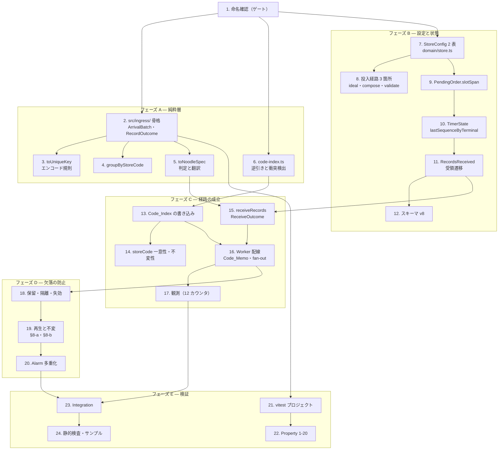

# Implementation Plan: POS オーダー取り込み（pos-order-ingress）

## Overview

設計（`design.md`）の骨格「宛先はボディから解決し、原子性の単位は Record 内の品目群、欠落より重複を選び、POS の語彙は取り込み経路で翻訳し切る」に対応した実装計画である。実装言語は **TypeScript（strict）**、ツールは `tooling.md` に従い **pnpm / Vitest v4（`cloudflareTest` プラグイン）/ fast-check v4 / oxlint / `tsc --noEmit`** を用いる。`src/ingress/` と `src/registry/` の純粋層は workerd 不要（既定 pool）、shell / DO / Worker の統合テストは Workers pool で実行する。

### 段階の切り方

**フェーズ C の完了時点で経路が成立する。** POS がバッチを投げ、宛先が解決され、待ち行列に並ぶ。フェーズ D は「宛先が未登録だった分を落とさない」ための保険であり、これ抜きでも本流は動く（ただし本番投入の前提条件である——登録漏れが即欠落になるため）。

| フェーズ | 内容 | 完了時点の状態 |
| --- | --- | --- |
| A | 命名確認・純粋層（解釈・翻訳・逆引き） | 型と純粋関数が揃う。挙動は不変 |
| B | 設定投入経路（`StoreConfig` の 2 表）と engine（v8・受領遷移） | 対応表が投入でき、状態が受領を表せる |
| C | DO の受け口と Worker の配線 | **経路が成立する**。宛先既知の店舗は動く |
| D | 保留と再生（欠落の防止） | 登録漏れが欠落にならない |
| E | 統合テストと仕上げ | Property・Integration・静的検査が揃う |

依存順は `ingress`（純粋）→ `domain` / `registry`（契約と設定）→ `engine`（状態と遷移）→ `shell`（DO）→ `worker`（配線）。各段は前段の上に立ち、宙に浮くコードを残さない。

**フェーズ D は 2 つの穴を同時に閉じる 1 単位である**（§8-a の不変と §8-b の 2 つの穴）。分割して先に片方だけ入れると、その間に欠落する期間が生まれる。

## Task Dependency Graph



**並行できる箇所**: タスク 2・6・7 は互いに独立（タスク 1 の後すぐ着手できる）。タスク 3・4・5 はタスク 2 の型が決まれば並行できる。タスク 8（投入経路 3 箇所）はタスク 7 の後に 3 つ並行。タスク 13・14 はタスク 6 の後、タスク 15 と並行に進められる。

**直列にせざるを得ない箇所**: タスク 9 → 10 → 11 → 12（`PendingOrder` → `TimerState` → 受領遷移 → スキーマ）は型が順に積み上がる。タスク 18 → 19 → 20（保留 → 再生 → Alarm）も同様で、とくに **19 は 3 つのサブタスクを分割して部分的に入れてはならない**（欠落する期間が生まれる）。

```json
{
  "gate": {
    "task": "1",
    "reason": "公開シンボル 20 項目の命名確認（naming.md：公開シンボルは実装前に確認）。src/ingress/ の新設・domain への POS 語彙の流入・engine へのイベント追加の 3 点は設計判断を含む",
    "blocks": ["2", "3", "4", "5", "6", "7", "8", "9", "10", "11", "12", "13", "14", "15", "16", "17", "18", "19", "20", "21", "22", "23", "24"]
  },
  "waves": [
    { "id": 0, "phase": "純粋層の骨格と契約", "tasks": ["2.1", "2.2", "6", "7"] },
    { "id": 1, "phase": "解釈・翻訳・投入経路", "tasks": ["2.3", "3", "4", "5", "8.1", "8.2", "8.3", "9"] },
    { "id": 2, "phase": "状態の拡張", "tasks": ["10"] },
    { "id": 3, "phase": "受領遷移", "tasks": ["11.1", "11.2"] },
    { "id": 4, "phase": "スキーマ v8 と索引の書き込み", "tasks": ["12", "13"] },
    { "id": 5, "phase": "一意性・不変性と DO の受け口", "tasks": ["14", "15.1", "15.2"] },
    { "id": 6, "phase": "確定と応答", "tasks": ["15.3"] },
    { "id": 7, "phase": "Worker 配線（フェーズ C 完了＝経路成立）", "tasks": ["16.1", "16.2", "16.3", "17"] },
    { "id": 8, "phase": "保留と隔離", "tasks": ["18"] },
    { "id": 9, "phase": "再生と 3 つの不変（分割不可）", "tasks": ["19.1", "19.2", "19.3"] },
    { "id": 10, "phase": "Alarm 多重化", "tasks": ["20"] },
    { "id": 11, "phase": "テスト基盤", "tasks": ["21"] },
    { "id": 12, "phase": "Property 検証", "tasks": ["22.1", "22.2", "22.3"] },
    { "id": 13, "phase": "統合テスト", "tasks": ["23"] },
    { "id": 14, "phase": "静的検査と仕上げ", "tasks": ["24"] }
  ]
}
```

## Tasks

- [x] 1. 公開シンボルの命名確認（ゲート）
  - `design.md`「公開シンボルの確認」の表 20 項目をユーザーへ提示し、確定させる。`naming.md` は公開シンボル（型・公開関数・URL パス・失敗種別・カウンタ名・状態フィールド）の命名を実装前の確認事項と定めるため、**本タスクの完了なしに以降のコードを書かない**。
  - とくに判断を要する 3 点を明示して問う——`src/ingress/` の新設、`firmnessCodes` / `menuItems` が `src/domain/store.ts` に入ること（POS の語彙が domain へ入る）、engine へ `RecordsReceived` を 1 種追加すること（当初の「イベントを足さない」想定が成立しなかった経緯を添える）。
  - あわせて `[Q19]`（上流 `urllib.parse.quote` の `safe` 集合）を確認する。実データの範囲では `encodeURIComponent` と差が出ないため実装は進められるが、タスク 3 の example test を書く前に必要になる。
  - _Requirements: 全般（naming.md の要求）_

- [x] 2. `src/ingress/` の骨格と Arrival_Batch の解釈
  - [x] 2.1 `ArrivalBatch` / `ArrivalRecord` の型と `toArrivalBatch(raw)`
    - `src/ingress/batch.ts` を新規作成する。`payload` を `Record<string, unknown>` のまま持ち、POS ペイロードの構造を型として書かない（Pass_Through の型による表明）。検証するのは 4 つの構造のみ——`path` が非空文字列、`payload` がオブジェクト、`arrivalTimestampMs` が非負整数、`sequenceNumber` が在る。`payload` の中身は一切検証しない。
    - `toArrivalBatch` が `null` を返すのはボディが `records` 配列を成さないときだけとする（それが 400 になる）。個々の Record の分類は 2.2 の型で表す。
    - _Requirements: 1.11, 14.1, 14.2, 14.3, 14.4, 14.6, 14.10, 14.11_
  - [x] 2.2 `RecordOutcome` と `KNOWN_RECORD_PATHS`
    - 1 Record の分類を判別可能な和型で表す（`order` / `status` / `unknown-path` / `poison` / `contract-violation`）。**Transient_Failure を含めない**——一時的失敗は Record の分類ではなく「処理が進められなかった」という別の軸であり、混ぜれば「一時的な Record」という表現不能な概念が型に現れる。
    - `poison` / `status` / `unknown-path` は `sequenceNumber?: string` を運ぶ（診断ログが seq と理由の 2 項目を要するため・AC 9.3）。`contract-violation` は検証前の生値（`raw: unknown`）を運ぶ——型違反の Record は `ArrivalRecord` を構築できない。
    - 既知 `path` の集合を単一の定数に持つ（判別基準を二箇所に書かない）。
    - _Requirements: 7.1, 7.6, 9.3, 8.15_
  - [x] 2.3 Order_Arrival_Time の値域窓の判定
    - 窓は「受理時刻の 2 時間前から受理時刻まで」。`now` を引数で受け取る純粋関数とする（時計を純粋関数の内側に持ち込まない既存の規律）。窓の外は `contract-violation` へ分類する。
    - _Requirements: 8.12, 8.13, 8.14, 8.15_

- [x] 3. `toUniqueKey` — 上流と一致する識別子の導出
  - 4 要素（`store_id` / `terminal_id` / `bill_no` / `datetime`）をパーセントエンコードして `:` で連結する。**上流の `safe` 集合に合わせる**（タスク 1 で確認した値を用いる）。
  - 欠落・null、または文字列化した結果が空文字であれば `null` を返す（実データでは 3 要素が数値で届くため、空文字の判定は文字列化を経た値に対して行う）。
  - `order_id` を構成に含めない（上流が表示用フィールドとして扱い、置換・削除しても一意キーが変わらないことを検証済み）。
  - _Requirements: 6.1, 6.2, 6.3, 6.18, 14.5_

- [x] 4. `groupByStoreCode` — 店舗別の分配
  - Record 列を Store_Code ごとの組へ畳む。**同一 Store_Code 内の到着順を保つ**（上流の順序保証がここで失われれば、下流の単調性冪等が意味を失う）。
  - 同一 Store_Code が複数回現れても解決を 1 回に畳める形で返す（Worker が同じ照会を繰り返さない・AC 4.7）。
  - _Requirements: 5.1, 5.3, 4.7_

- [x] 5. `toNoodleSpec` — 判定と翻訳を同一入力から導く
  - 品目 1 件を解釈し、麺量（Noodle_Size）を持たない品目は `null`（茹でない）を返す。**茹で対象の判定と `slotSpan` の決定を 1 つの関数で返す**——両者が同じ入力から導かれるため、分ければ「麺量が在るか」を二度問うことになり判定基準が二箇所に分かれる。
  - `child_items` の各要素の意味を `plu_no` から判定し、配列内の位置に依らない（軸の指定が欠ける注文で解釈がずれないため）。`item_type` は判定に用いない。
  - 硬さの指定が無い品目は既定（`normal`）へ畳む。これは設定の欠落を畳むのではなく「POS が指定を送っていない」という入力の形に対する既定である。
  - 対応表（`firmnessCodes` / `menuItems`）を引数で受ける純粋関数とする（`StoreConfig` 全体は渡さない）。
  - _Requirements: 6.15, 6.19, 6.20, 6.21, 6.22, 6.23, 6.24, 6.33_

- [x] 6. `src/registry/code-index.ts` — 宛先の逆引きと衝突検出
  - `CodeIndex` / `buildCodeIndex(stores)` / `storeForCode(index, storeCode)` を `reverse-index.ts` と同型に置く（基数だけが違う——コードは一意ゆえ単数）。
  - **非活性店舗も索引に含める**。Store_Code は全店で一意ゆえ逆引きは活性状態に依らず一意であり、閉店の判定は StoreTimerDO の既存ゲートに任せる（索引を活性で絞れば判定が二箇所に分かれる）。
  - `detectDuplicateStoreCodes(stores)` を `detectAmbiguousAssignment` と同型で書く（衝突の列を返す純粋関数）。
  - _Requirements: 2.1, 2.2, 2.4, 2.6, 2.7, 3.6_

- [x] 7. `StoreConfig` へ対応表 2 枚を足す（`src/domain/store.ts`）
  - `firmnessCodes`（硬さの商品コード → `Firmness`）と `menuItems`（親商品コード → `noodleType` とサイズ群）を足す。**硬さの表に茹で秒を持たせない**——秒は既存 `noodlePresets` が `noodleType` × `firmness` で保つ唯一の出所である。
  - `MenuItem.sizes` を `NonEmptyArray<NoodleSize>` とする。麺量を持たない品目は茹でないため、`MenuItem` は必ず 1 つ以上のサイズを持つ——「サイズ 0 個のメニュー」＝茹でるのか茹でないのか判らない状態を構築不能にする。
  - `slotSpan` の値域を 1 以上 6 以下とする（上限は 1 ユニットのスロット数）。0 や負値は「占有しない麺」という表現不能な状態ゆえ拒否する。
  - 既定値（空配列）と検証関数（`toFirmnessCodes` / `toMenuItems`）を既存の `to*` と同型で書く。
  - _Requirements: 6.29, 6.30, 6.31, 6.32, 13.12_

- [x] 8. 設定投入経路の 4 箇所を追随させる
  - [x] 8.1 `StoreOverride` と `PolicyFields`（`src/registry/ideal.ts`）
    - 2 項目を足す。`PolicyFields` 側は `ModedValue<T>` で包む（チェーン統制で配れる形にする——硬さコードとメニューはチェーン共通の可能性が高い）。
    - _Requirements: 13.13_
  - [x] 8.2 合成対象の列挙（`src/registry/compose.ts` の `CONFIG_FIELDS`）
    - `CONFIG_FIELDS` へ 2 項目を足し、出口で検証関数を通す。**ここに載せなければ常に既定（空配列）が供給される**——載せ忘れると「Provisioning_API では受理されるのに投影に現れない」という無言の欠落になる。`satisfies readonly (keyof StoreConfig)[]` が守るのはキー名の妥当性だけで、集合の網羅は守らない。
    - 合成規則は `noodlePresets` に倣い層ごとの丸ごと置換とする（要素マージをしない。マージすれば有効な表がどの層に由来するか読めなくなる）。
    - **タスク 7 が残した暫定を回収する。** `StoreConfig` へ必須 2 項目が入った時点で `compose.ts` の出口が型として破れたため、タスク 7 は既定（空配列）を直接供給する 2 行を暫定で置いた。本タスクでその 2 行を `CONFIG_FIELDS` 経由へ移し、暫定供給を残さない（残せば「合成対象に載っているのに常に既定が勝つ」という無言の欠落になる）。
    - _Requirements: 13.13, 13.14_
  - [x] 8.3 拒否型検証（`src/registry/validate.ts`）
    - `ALLOWED_CONFIG_FIELDS` へ 2 項目を足し、`validateFirmnessCodes` / `validateMenuItems` を書く。`menuItems` は入れ子（`sizes`）を持つため、`validateNoodlePresets` が `boilSeconds` の入れ子を検証する形に倣う。
    - 既存規律のとおり未知フィールド・型不一致・値域外・必須欠落を黙って既定へ畳まず拒否し、拒否理由は短絡せず全件集約する。
    - **横断整合（`menuItems[].noodleType ∈ noodlePresets`）は入口で見ない**——3 層の合成後でしか判定できず、Policy がメニューを配り店舗が `noodlePresets` を上書きする段階的投入が正当である。整合は実行時（タスク 15）で扱う。
    - _Requirements: 13.13, 13.15_
  - [x] 8.4 `config` ServerMessage への 2 項目（`src/domain/messages.ts` と送信側）
    - `config` は `StoreConfig` の項目を列挙する形（ワイヤは未検証の生表現ゆえ型の基数保証が JSON を跨げない）で、既存コメントが「項目が増えたらここへも足す」と定めている。ゆえに 2 項目を足し、送信側（`storeConfig` から `config` を組む箇所）も追随させる。design §6 末尾の判断（項目ごとに配信対象を選び直せば「client がどれを知っているか」が項目数だけ分岐する）に従い、例外を作らない。
    - **client 側の表示・利用は本 spec の範囲外である。** 受信して保持するところまでで、`slotSpan` の描画も対応表の参照も行わない（`src/client/` を変更しないという本 spec の境界を保つ）。
    - _Requirements: 6.29, 13.12_

- [x] 9. `PendingOrder.slotSpan` を足す（`src/domain/order.ts`）
  - 1 属性を追加する。`timer-model.md` の判定を通す——共有される事実であり（client が待ち行列を表示し engine が計画を組む）、`slotIds`（割り当てられた実体）とは要求と割当の関係で別概念ゆえ別の名を持つ。`TimerFact` には及ばない。
  - `toPendingOrders` の検証に 1 属性の検証を加える（別の検証経路を立てない）。
  - _Requirements: 6.25, 13.6, 13.7_

- [x] 10. `TimerState` へ冪等の判定材料を足す（`src/engine/state.ts`）
  - `lastSequenceByTerminal: Readonly<Record<string, string>>` を足す。**別キーに置かない**——`Persist` と別の `put` になれば「判定材料だけ進んで注文が無い」欠落が生じ、その注文は再送でも重複として弾かれて永久に失われる。
  - 比較は桁数を揃えた文字列比較で行う（KDS の sequence number は 56 桁の数値文字列で、桁数が同じなら辞書順が数値順に一致する。桁数が違えば短い方が小さい）。`BigInt` へ写さないのは、比較にしか使わない値を数値へ変換する理由がないため。
  - _Requirements: 10.5, 10.6, 10.7, 10.8_

- [x] 11. 受領遷移 `RecordsReceived` を足す（`src/engine/`）
  - [x] 11.1 `Event` と `ReceivedOrder` の型
    - engine のイベント種別を 1 つ追加する。**既存の到着・キャンセルでは表現できない**——(a) 到着は非空の品目列を要求するため「茹で対象 0 件」を運べない、(b) いずれも端末 ID と `sequence_number` を運ばないため判定材料を進められない、(c) Record ごとに分ければ単一 `Persist` が保てない。
    - `ReceivedOrder.items` を `NonEmptyArray` にしない。空は「キャンセル、または麺を含まない注文」という正常な入力であり、型で禁じてはならない。
    - _Requirements: 6.9, 13.5_
  - [x] 11.2 遷移の本体（`src/engine/receive.ts`）
    - **タスク 11.1 が残した暫定を回収する。** `Event` へ `RecordsReceived` を足した時点で `decide` の switch 網羅が型として破れたため、11.1 は `settle(state, state, params, event.now, true)` を直接返す 1 行を暫定で置いた（集合を変えず `Persist` も出さない＝受領が状態へ反映されない状態）。本タスクでこの分岐を `receiveRecords` へ差し替える。
    - 到着順に畳む。seq が判定材料以下なら読み飛ばし（重複）、新しければ判定材料を進めて——`items` 非空は `upsertOrder` で置換、`items` 空かつ既存ありは `removeOrder` で除去、`items` 空かつ既存なしは集合を変えない。最後に `settle` を 1 回通し、**単一の `Persist`** を返す。
    - **重複判定を engine の内側で行う**（判定材料が engine 状態に属し、状態を見て決めるのが engine の役目である）。shell は翻訳済みの Record 群を渡すだけで、どれが重複かを判断しない。
    - 既存の遷移と割り当ての算術（`placeGroup`）はいずれも変更しない。
    - _Requirements: 5.5, 6.8, 6.10, 6.11, 6.12, 6.13, 10.1, 10.2, 13.5_

- [x] 12. 永続スキーマを v8 へ上げる（`src/engine/migrate.ts`・`snapshot.ts`）
  - **先行タスクが残した暫定 3 箇所を回収する。** タスク 9 が `migrate.ts` の `revivePendingOrder` に `slotSpan: SLOT_SPAN_MIN` を、タスク 10 が `snapshot.ts` の `fromSnapshot` に `lastSequenceByTerminal: {}` を、いずれも「**暫定**」コメント付きで直接供給している（永続値の読み取りが無い＝v8 で書いた値を読み戻せない状態）。あわせて `tests/operation-history/timer-model.static.test.ts` の `keyof StoreSnapshot` の型主張も追随させる。
  - `slotSpan` の欠如を 1 で埋める（v7 以前の待ち行列はすべて 1 スロット占有として解釈するのが当時の実際の挙動に一致する）。`lastSequenceByTerminal` の欠如を空オブジェクトで埋める（v7 以前は本経路が存在せず判定材料を持つ端末が無い。空から始めれば最初の Record が必ず受理され、以降は単調性が効く）。
  - 既存の `revivePendingOrders` の規律（1 件でも形を満たさなければ全体を移行失敗）を維持する。
  - _Requirements: 6.25, 10.5_

- [x] 13. Code_Index の書き込みを配線する（`StoreRegistryDO`）
  - `codeIndexWrite(stores)` を既存の `reverseIndexWrite` と同型で持ち、イデアと同一の put-first の確定に含める（導出値を正本から常に再導出できる状態に保つ）。`createStore` / `updateStore` / `upsertStores` の 3 経路すべてに入れる。
  - `resolveStoreCode(storeCode)` を RPC として公開する（Worker が宛先を引く唯一の経路）。この時点では保留の判定を持たない——タスク 19 で §8-a の不変を足す。
  - _Requirements: 2.1, 2.3, 2.5, 2.8, 2.9_

- [x] 14. Store_Code の一意性と不変性を強制する（`StoreRegistryDO`）
  - `ProvisionFailure` へ `store-code-in-use` / `store-code-immutable` を足し、`failureResponse` で 400 へ写す。
  - **`resolveBulkElement` の黙殺を明示拒否へ改める**。現状は既存 `storeCode` を優先して変更要求を黙って無視しており、呼び出し元の意図を偽っている。
  - `updateStore` に `body.storeCode` の解釈を足す——既存が未設定なら受理（後から POS 連携を始める店舗が実在し、新規作成に強いれば `StoreId` が変わって画面 URL と WS が切れる）、同値なら受理（冪等）、異なれば拒否。
  - 重複検出を `commitIdeal` の直前に post-write の店舗集合へ掛ける（createStore と upsertStores の 2 箇所で同じ 1 つの純粋関数を通し、バッチ内の重複も同じ経路で捕まる）。
  - _Requirements: 3.1, 3.2, 3.3, 3.4, 3.5, 3.7, 3.8, 3.9_

- [x] 15. `receiveRecords` — DO の受け口（`StoreTimerDO`）
  - [x] 15.1 `ReceiveOutcome` と分類
    - 判別可能な和型で返す（`settled` / `unprovisioned` / `deactivated` / `persist-failed`）。**RPC ゆえ HTTP ステータスでは分類を運べない**——呼び出し元（Worker と再生）が種別で挙動を分ける必要がある。
    - **`unprovisioned` と `deactivated` を分ける。** 既存ゲートはどちらも 403 で返すが性質が正反対である——前者は `createStore` 直後の一時的な状態（投影の押し込みは `converge` の Alarm 継続で非同期に進む）、後者は時間が経っても解消しない。前者を「飛ばして数える」にすれば店舗開設の瞬間に届いた注文が消える。
    - _Requirements: 11.17, 11.19_
  - [x] 15.2 翻訳と写像
    - shell 側で `toNoodleSpec` を通し `ReceivedOrder` を組む（翻訳には店舗設定が要り、engine は `StoreConfig` を知らない既存の規律を保つ）。
    - 属性の出所——`externalOrderId` は Unique_Key、`itemIndex` は `order_items` の元の位置（欠番を許す）、`arrivalTime` は `arrival_timestamp_ms`、`tableId` は `payload.table_no` の文字列化（欠落・`0` は `null`）。
    - **既存 `toPendingOrders` の全体拒否を持ち込まない**——本経路では翻訳できない品目が正常に起こる（非麺の品目は実データ 3 件すべてに含まれる）。品目単位で扱い、翻訳できた品目のみを写す。
    - 対応表に無い麺種（`menuItems` にはあるが `noodlePresets` に無い `noodleType`）は取り込みの段で弾いて数える（`boilSeconds` を引けない品目を待ち行列へ入れれば、計画にも表示にも現れない項目が正本に溜まる）。
    - _Requirements: 6.5, 6.16, 6.26, 6.27, 6.28, 6.34, 6.35_
  - [x] 15.3 確定と応答
    - `decide` を 1 回呼び、`runEffects` が返す `persisted` を見て応答を決める。受理の応答と broadcast はいずれも `Persist` の成功の上にのみ立つ。
    - DO 内でしか判らない件数（重複吸収・未知麺種）を `ReceiveOutcome.counts` に載せて返す。
    - _Requirements: 5.5, 5.6, 5.7, 12.15_

- [x] 16. Worker の配線（`src/worker.ts`）
  - [x] 16.1 受け口と認可
    - `POST /pos/records` を既存経路の並びへ足す。認可は既存の `isOrderIngressAuthorized` をそのまま用い、内部 identity ヘッダを無条件で除去する（経路ごとの例外を作らない）。
    - POST 以外は 405、`records` 配列を成さないボディは 400、1000 件超過は 5xx（上流の bisect に分割させる）。認可失敗は 401 で、いずれもデータの保全を狙わない。
    - _Requirements: 1.1, 1.2, 1.3, 1.4, 1.5, 1.6, 1.11, 1.12, 1.13, 9.11_
  - [x] 16.2 Code_Memo と宛先解決
    - モジュールスコープの `Map` に既知の対応のみを載せる。TTL・無効化・世代管理をいずれも持たない（写像が不変であることの帰結）。**未知はキャッシュしない**——不在は不変ではなく、後の店舗登録で既知に転じるうえ、保留が非空の間は意図的に未知を返す（タスク 19）。
    - テスト間で持ち越される点をコメントに残す（モジュールスコープゆえ isolate を共有する。Property 7 の検証は明示的に空へ戻す手段を要する）。
    - _Requirements: 4.1, 4.2, 4.3, 4.4, 4.5, 4.6, 4.7, 2.8_
  - [x] 16.3 fan-out
    - 同一 Store_Code は 1 回の委譲でまとめて渡し（店舗ごとに 1 呼び出し）、到着順のまま処理する。異なる Store_Code へは並列に委譲してよい。
    - いずれかの宛先で `unprovisioned` / `persist-failed` が返れば **Arrival_Batch 全体を 5xx** とする（既に確定した他店舗の分は残り、再送時の重複は冪等が吸収する。Duplicate_Bias の適用）。`deactivated` は飛ばして数える。
    - 残作業＋Alarm 継続を本経路に持ち込まない（未完了は一時的失敗として上流の再送に委ねる）。
    - _Requirements: 5.1, 5.2, 5.3, 5.4, 5.8, 5.9, 1.7, 1.9, 1.10_

- [x] 17. 観測（12 カウンタと診断ログ）
  - `poisonRecord` / `unknownPath`（上流と同名・突き合わせのため）、`statusDiscarded` / `unknownStorePending` / `doDedupeSkipped` / `upstreamContractViolation` / `unauthorized` / `deactivatedStore` / `unknownNoodleType` / `heldExpired` / `heldOverflow` / `replayWindowExpired`（本経路固有）。
  - 破棄の 3 つを 1 つに畳まない（原因が異なる——失効は登録の遅れ、上限超過は不正送信または大量の登録漏れ、窓外は再生の遅れを示す）。
  - **出力を Worker に集める。** DO 内でしか判らない件数は `ReceiveOutcome.counts` から拾い、1 リクエストにつき 1 行のログへまとめる（DO が個別に出せば 1 バッチで最大 1000 行が出て店舗ごとに分散して読めなくなる）。
  - 診断ログは `sequence_number` と理由の 2 項目のみ（ペイロード本体をログへ出さない）。構造化 `console.log` で出し、新しい binding を追加しない。
  - _Requirements: 12.1〜12.15, 9.3, 9.4_

- [x] 18. 保留と隔離の領域（`StoreRegistryDO`）
  - **タスク 16 が残した暫定 2 箇所を回収する。** `src/worker.ts` は現在、窓外・型違反の Record を `upstreamContractViolation` に数えて破棄し、宛先未解決の Record を `unknownStorePending` に数えて破棄している（いずれも「**暫定**」コメント付き・保留領域が無いため書けない）。本タスクで前者を `contract-violation:{storeCode}` へ、後者を `holdUnrouted` へ回す。
  - `unrouted:{storeCode}` と `contract-violation:{storeCode}` を持つ。`HeldRecord` は保持を始めた時刻を添えた形で、中身は検証済みの `ArrivalRecord`（前者）か検証前の生値（後者——型違反の Record は `ArrivalRecord` を構築できない）を取る。
  - **`contract-violation:` は再生されない。** 2 時間で失効し破棄されるだけである（窓の外にある時刻の注文を待ち行列へ入れれば並び順を壊す）。保持の意味は上流のバグを調査する証跡であり、設計としては「隔離」である。
  - `holdUnrouted(storeCode, records)` は `put` 成功で確定してから受理を応答する。`put` が失敗すれば一時的失敗（保留できていないものを受理と主張しない）。
  - 失効は保留の書き込みと再生の時点で判定する（**常設 Alarm を持たない**——hibernation の規律に反し、保留が無い間も DO を起こし続ける）。件数上限は 1 Store_Code あたり 2000 Record（2 時間 × 4 件/分 × 3 端末 ≈ 1440 件を上回る余裕）。
  - _Requirements: 11.1, 11.2, 11.3, 11.4, 11.12, 11.13, 11.14, 11.15, 11.16, 11.23, 8.8, 8.9, 8.10, 8.11_

- [x] 19. 再生と欠落を防ぐ 3 つの不変（`StoreRegistryDO`）
  - **本タスクは分割しない。** §8-a の不変と §8-b の 2 つの穴は互いに依存し、片方だけ入れれば欠落する期間が生まれる。
  - [x] 19.1 保留が非空の間は解決不能とする（§8-a）
    - `resolveStoreCode` は当該 Store_Code の保留が非空なら未知を返す。**欠落を防ぐための不変であり性能の工夫ではない**——再生は Alarm 継続で非同期に進むため、その間に新着（大きい seq）を直接届ければ判定材料が進み、後から再生される保留分（小さい seq）が全件重複として弾かれる。未知は Code_Memo に載らないため（AC 4.4）、新着も保留へ積まれて到着順が保たれる。
    - 空になった時点で解決可能へ転じる。
    - _Requirements: 11.20, 11.21_
  - [x] 19.2 既知コードへの保留は同一リクエスト内で再生する（§8-b 穴 1）
    - `holdUnrouted` は当該 Store_Code が既に Code_Index に既知なら、応答を返す前に再生を完了させる。**これがなければ保留が永久に詰まる**——`resolveStoreCode` の未知応答を受けた Worker が保留を積む間に再生が完走して停止すると、既知コードのキーに積まれた Record を再生する契機が誰にも残らない。上流は同一 `store_id` を直列に送るため、応答前に終えれば次バッチとの順序も守られる。失敗は一時的失敗として応答する。
    - _Requirements: 11.6_
  - [x] 19.3 削除は identity ベースで行う（§8-b 穴 2）
    - 「送り終えた最後の `sequence_number` 以下の Record だけを取り除く」。**件数で削ってはならない**——19.2 の同期再生と Alarm 由来の再生は同時に走りうる（DO は単一スレッドでも await 境界で交互に進む）ため、件数で削れば一方が他方の未送信分を消す。
    - **`sequenceNumber` の比較は `isNewerSequence`（`src/engine/state.ts`・タスク 10 で導入）を通す。** 桁数を揃えた文字列比較の規則が二箇所に分かれれば、繰り上がりの瞬間に片方だけが誤る。`h.sequenceNumber > lastSent` と素の比較で書かないこと。
    - **`unrouted:{storeCode}` は 1 キーに最大 2000 Record を持ち、値は数百 KB になりうる**（タスク 18 の申し送り）。再生の読み書きが同じ値を毎回丸ごと往復する点を確認し、負荷が問題になるなら報告すること（キーの形と上限は design の確定事項ゆえ勝手に変えない）。
    - 補助として再生を同時に 1 本に限る（in-memory フラグ。再生中の保留要求は追記のみ行い、走っている再生が空になるまで繰り返す過程で拾わせる）。これは二重送信を減らすための工夫で、**正しさは identity ベースの削除が支える**——フラグは hibernate を跨げないが、失われても欠落しない。
    - 保留が空になるまで再武装する。再生時に値域窓を再評価し、窓の外に出た Record は再保留せず破棄する（保留 → 再生 → 窓外 → 再保留の循環を作らない）。
    - 再生は通常の取り込みと同一の写像・冪等・順序の規律を通す（再生専用の解釈経路を持たない）。
    - _Requirements: 11.7, 11.8, 11.9, 11.10, 11.22_

- [x] 20. Alarm の多重化（`StoreRegistryDO`）
  - DO の Alarm は 1 本ゆえ、収束の残作業と再生の残作業を同一ハンドラで捌く。`setAlarm` は両者の要求の最小値とする（後から張る側が先の要求を上書きすれば、上書きされた側が次の契機まで止まる）。
  - ハンドラは両方の残作業を確認する（片方だけ見て早期 return すればもう片方が永久に残る）。
  - **再生の失敗で `retryCount` を消費しない**——既存の収束は上限近傍で新規 Alarm を張り直す規律（`ALARM_REARM_THRESHOLD`）を持ち、再生がこのカウントを食えば収束の再試行余裕が奪われる。再生は自身の失敗で throw せず残作業に残す。
  - _Requirements: 11.11_

- [x] 21. vitest のプロジェクト分割
  - node プロジェクト（`name: "ingress"`, `environment: "node"`）を足し、`include` に `tests/ingress/**/*.property.test.ts` と `tests/ingress/**/*.example.test.ts` を指定する。
  - **`workers` プロジェクトの `exclude` に同じ 2 つの glob を足す。** 現行の `workers` は `include: ["tests/**/*.test.ts"]` で全テストを総取りしているため、置き場を作るだけでは workerd 側でも走る。既存の `registry` / `worker` / `observe` がこの形で切り分けられている。
  - 統合テストは `tests/ingress/` に置かず `tests/shell/` に残す（置き場を pool の境界と一致させれば glob が 1 組で済む）。
  - _Requirements: 13.3_

- [x] 22. Property テスト（Property 1〜20）
  - [x] 22.1 純粋層（既定 pool・`tests/ingress/`）
    - Property 1（解釈は全域）・2（素通しは payload に閉じる）・3（Unique_Key は決定的で上流と一致）・4（判定と翻訳は同じ入力から導かれる）・12（移行は既存の挙動を保つ）・16（翻訳結果 0 件の写り方）。
    - Property 3 は上流のエンコード規則との一致を example で固定する（タスク 1 の `[Q19]` の確定値を用いる）。
    - _Requirements: 1.11, 14.1〜14.11, 6.1, 6.2, 6.11, 6.12, 6.21, 6.22, 6.24, 6.25_
  - [x] 22.2 レジストリ純粋層（既定 pool・`tests/registry/`）
    - Property 5（Code_Index は正本から再構築できる）・6（Store_Code は全店で一意）。
    - _Requirements: 2.1, 2.2, 2.7, 3.1, 3.2, 3.5, 3.6_
  - [x] 22.3 shell / DO（Workers pool・`tests/shell/`）
    - Property 7（Code_Memo は結果を変えない）・8（確定は put 成功の上にのみ立つ）・9（冪等は収束する）・10（欠落を作らない）・11（原子性の単位は Record 内の品目群）・13（保留が非空の間は直接配送されない）・14（判定材料と状態は同時に確定する）・15（未プロビジョニングは一時的失敗）・17（窓外は再保留されない）・18（保留は必ず再生の契機を持つ）・19（再生は送り終えた範囲だけを取り除く）・20（1 受領は 1 遷移・1 put）。
    - _Requirements: 4.2〜4.4, 5.5〜5.7, 9.9, 9.10, 10.2, 10.7, 11.1〜11.9, 11.17〜11.22_

- [x] 23. Integration テスト（Workers pool・`tests/shell/` と `tests/worker/`）
  - Store_Code の不変性（変更要求が 400・イデア不変）、fan-out（複数店舗混在が各店へ 1 回ずつ・同一店舗内は到着順）、冪等（同一バッチ再送で `put` も broadcast も起きず確定状態が一致）、失敗分類（Poison を含むバッチが 2xx・`put` 失敗が 5xx）。
  - **欠落の防止**（本 spec の芯）——保留 → 再生の順序（保留が非空の間は直接配送されず、保留分が重複で消えない）、既知コードへの `holdUnrouted` で再生が起動する（詰まらない）、再生 RPC 中の追記が消えない、未プロビジョニング競合（`createStore` 直後の到着が 5xx になり投影到達後の再送で確定する）。
  - 判定材料と状態の原子性（`put` を失敗させたとき両方進んでいない）、N Record が単一 put になる（10 Record で `put` 1 回・broadcast 1 回）、Alarm の多重化（収束と再生が同時に在るとき両方進み、再生の失敗が収束の `retryCount` を消費しない）。
  - 後着で品目が減る／0 件（3 品目 → 1 品目で置換・0 件で除去・初回 0 件で無変更）、値域窓と契約違反（窓外が隔離され再生されず 2 時間で失効）、失効と件数上限、メソッドと件数上限（405・1001 件が 5xx）、対応表に無い麺種（当該品目のみ写らず他は確定）。
  - _Requirements: 全般_

- [x] 24. 静的検査とサンプル・仕上げ
  - Pass_Through の適用層を静的に検査する（`payload` の構造を型として書いた箇所が存在しないこと）。既存の `per-store-provisioning.static.test.ts` と同じ形で node プロジェクトに置く。
  - `config/pos-records-sample/` を追加する（実データに基づく `records` のサンプルと curl の例）。既存 `config/order-ingress-sample/README.md` と同型で、両経路の違い（宛先が URL かボディか）を明記する。
  - `pnpm cf-typegen`（`wrangler.jsonc` を変更した場合）・`pnpm typecheck`・`pnpm lint`・`pnpm test` を通す。
  - `[Q8]` の対応表の値が未提示のままなら、空の表で構造が成立すること（茹で対象が 0 件になるだけ）を integration で確認し、値の投入手順を README に残す。
  - **保留 1 キーのサイズを README に残す。** SQLite バックエンドの上限は「キーと値の合計で 2 MB」（[Durable Objects の Limits](https://developers.cloudflare.com/durable-objects/platform/limits/)）で、実測は 1 件約 711 バイト × 2000 件 = 1.36 MB（余裕は約 3 割）。品目数の多い注文が続けば 1 件 1,048 バイトで 2000 件が上限を破り、`put` 失敗 → `persist-failed` → 5xx となってその店舗の保留が書けなくなる（欠落ではないが詰まる）。**現状維持の判断（ユーザー確認済み）ゆえ件数上限は変えないが、本番投入前に実データでサイズを再確認する手順を残すこと。**
  - _Requirements: 14.6, 13.9_

## Notes

### 実装順の根拠

依存は「純粋 → 契約 → 状態 → 作用 → 配線」の一方向に流れる。純粋層（タスク 2〜6）は他の何にも依存せず、単体で検証できる。設定と状態（7〜12）は契約を固め、DO と Worker（13〜17）がそれを使い、保留と再生（18〜20）が欠落を塞ぐ。

**フェーズ C の完了で経路は成立するが、そこで止めて本番投入してはならない。** 宛先未登録の Record が捨てられる状態であり、店舗登録の順序に依存して注文が消える。フェーズ D は保険ではなく前提条件である。

### 分割してはならない単位

**タスク 19（再生と 3 つの不変）。** §8-a の不変（保留が非空なら未知を返す）だけを先に入れると、既知コードへの保留が詰まる。19.2 だけを入れると再生 2 本が競合して未送信分が消える。3 つは互いを補い合っており、どれか 1 つを欠いた状態は「動くが静かに注文が消える」状態である。

**タスク 11.2（受領遷移の本体）。** 重複判定・置換・除去・判定材料の更新を 1 つの遷移で畳むことが単一 `put` の根拠である。段階的に入れると `Persist` が複数回生じる期間ができる。

### 既存コードへ触る箇所

本機能は新規ファイルだけでは終わらない。既存を変更する箇所を明示する。

| ファイル | 変更の性質 |
| --- | --- |
| `src/domain/store.ts` | `StoreConfig` へ 2 項目・既定値・検証関数 |
| `src/domain/order.ts` | `PendingOrder.slotSpan` と検証 |
| `src/registry/ideal.ts` | `StoreOverride` / `PolicyFields` へ 2 項目 |
| `src/registry/compose.ts` | `CONFIG_FIELDS` へ 2 項目（載せ忘れが無言の欠落になる） |
| `src/registry/validate.ts` | `ALLOWED_CONFIG_FIELDS` と検証関数 2 つ |
| `src/engine/state.ts` | `lastSequenceByTerminal` |
| `src/engine/event.ts` | `RecordsReceived` の追加 |
| `src/engine/decide.ts` | 受領遷移への分岐 |
| `src/engine/migrate.ts` / `snapshot.ts` | v8 への版上げ |
| `src/shell/store-timer-do.ts` | `receiveRecords` の追加 |
| `src/shell/store-registry-do.ts` | Code_Index の書き込み・`resolveStoreCode`・保留と再生・`alarm()` の多重化・`resolveBulkElement` の黙殺の是正 |
| `src/worker.ts` | `POST /pos/records` の配線・Code_Memo |
| `vitest.config.ts` | `ingress` プロジェクトの追加と `workers` の `exclude` |

`src/client/` は変更しない。`slotSpan` と 2 つの対応表は `configMessage` 経由で届くが、client 側の表示は本 spec の範囲外である。

### 残る未決事項の扱い

**`[Q8]`（対応表の値）** は実装を止めない。表が空なら茹で対象が 0 件になるだけで構造は成立する。タスク 24 でその挙動を integration で確認し、値の投入手順を残す。

**`[Q18]`（`sequence_number` 欠落時の Content_Hash 経路）** は落とす判断で書いてある（上流が毒として除外済みゆえ届かない）。旧系からの流入が実際にありうるなら、タスク 2.2 の分類と冪等の設計を見直す必要がある。

**`[Q19]`（上流の `quote` の `safe` 集合）** はタスク 1 で確認する。実データの範囲では差が出ないため実装は進むが、タスク 22.1 の example test を書く前に必要になる。

### 検証の観点

本 spec のテストの重心は「欠落しないこと」に置く。重複は冪等が吸収し、遅延は再送が回収するが、欠落は取り戻せない。Property 8・9・10・13・14・17・18・19・20 と Integration の「欠落の防止」群がその中核であり、これらが通らない状態でのデプロイは行わない。

とくに **Property 19（再生は送り終えた範囲だけを取り除く）** は、2 本の再生が同時に走る状況を意図的に作って検証する必要がある。await 境界での交互実行を再現するため、`pushToStore` の解決を制御できる形でテストを組む。
