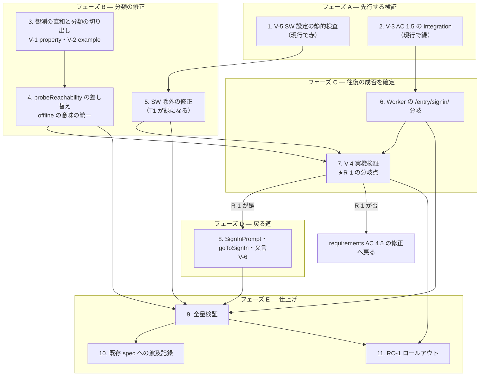

# Implementation Plan: 認証切れが回線喪失として表示される（signin-required-misreported-as-offline）

## Overview

修正は 3 つの薄い変更（分類の証拠チャネル・認証へ戻る道・SW の除外）に分かれる。ツールは `tooling.md` に従う（pnpm / TypeScript strict / Vitest v4 / fast-check / oxlint）。公開シンボルの命名は design 判断 6 で**確定済み**ゆえ、命名ゲートは無い（実装中に新規の公開シンボルが要るなら、その時点でユーザー確認する）。

### 順序を決めている 3 つの制約

**制約 1 — V-4（実機の認証往復）は client の遷移コードより前に置く。** R-1 が否に出れば AC 4.5 を「遷移を起こす」から「認証手段を示す」へ緩める requirements 修正へ戻る。**先に実機で壊れると分かれば、遷移コードを書く前に引き返せる。** ただし往復の検証には `/entry/signin/` の Worker 分岐が要るため、最小の順序は「**Worker の 1 分岐 → 実機検証 → client 側**」になる。

**制約 2 — RO-1 の手順は先に書かない。** 詰まった standalone 端末の復旧手順は V-4 の記録が正本である（design RO-1）。ゆえに最終段で「V-4 の結果で手順 2 を確定し、端末台数ぶんの手動復旧を実施」を置く。**順序でこの規律を守る。**

**制約 3 — V-5 と V-3 は実装に依らず先行できる。** どちらも現行の設定・現行の Worker に対して今すぐ書ける。**V-5 は現行の `/^\/ws$/` で失敗し、修正で緑になる**（変異検出の役割を兼ねる）。V-3 は現行で既に緑のはずで、「既に成り立っている不変を固定する」性格である。

### 段階の切り方

| フェーズ | 内容 | 完了時点の状態 |
| --- | --- | --- |
| A | 先行する検証（V-5・V-3） | 現行の穴が赤で見え、守るべき不変が固定される |
| B | 分類の修正 | **表示が嘘をやめる。** ただし戻る道はまだ無い |
| C | Worker の 1 分岐 → **実機検証（V-4）** | R-1 が確定する。否なら requirements へ戻る |
| D | client の Affordance | 戻る道が通る |
| E | 仕上げとロールアウト（RO-1） | 詰まっている端末が復旧する |

**フェーズ B の完了時点は「正直だが不完全」な状態である。** `signInRequired` が正しく出るようになるが、押せる操作点がまだ無い。嘘（`Offline` と表示）よりは良いが、現場は理由を知って手が無い。ここで止めずに C・D へ進む。

## Task Dependency Graph



**並行できる箇所**: タスク 1・2・3 は互いに独立で同時に着手できる。タスク 5 はタスク 1 の後（赤→緑を見るため）。タスク 10 と 11 は互いに独立。

**直列にせざるを得ない箇所**: 6 → 7 → 8（Worker の分岐が無いと実機検証ができず、実機検証の結果が出ないと client の形が決まらない）。7 → 11（復旧手順が V-4 の記録に依存する）。

**タスク 7 は 4・5・6 のデプロイを前提とする。** 分類の修正（4）と SW 除外の修正（5）が実機へ届いていないと、`/entry/signin/` への遷移が**旧 SW のキャッシュに飲まれて往復が始まらない**——それ自体が本 spec のバグである。ゆえに 4・5 からも辺を引いている。

```json
{
  "waves": [
    { "id": 0, "phase": "先行する検証と分類の純粋部", "tasks": ["1", "2", "3"] },
    { "id": 1, "phase": "作用の端と SW 除外", "tasks": ["4", "5"] },
    { "id": 2, "phase": "Worker の通し口", "tasks": ["6"] },
    { "id": 3, "phase": "実機検証（R-1 の分岐点）", "tasks": ["7"] },
    { "id": 4, "phase": "戻る道", "tasks": ["8"] },
    { "id": 5, "phase": "全量検証", "tasks": ["9"] },
    { "id": 6, "phase": "波及記録とロールアウト", "tasks": ["10", "11"] }
  ]
}
```

## Tasks

- [x] 1. V-5: Service_Worker の設定を静的検査で固定する
  - `tests/` に `vite.config.ts` の VitePWA 設定を読む静的検査を足す。既存の `tests/entry-routing.static.test.ts` と同型（`node:fs` で設定を読み、`static` プロジェクトで実行）。`vitest.config.ts` の `static` の `include` と `workers` の `exclude` の**両方**へ登録する。
  - 主張は 2 つ。**フォールバック除外が意図のある経路のみを列挙すること**（`/cdn-cgi/`・`/entry/`・`/pos/`・`/admin/`）と `ws` の項を持たないこと。そして **`/entry/` に一致する `runtimeCaching` 規則が存在しないこと**。
  - **本タスクの完了時点でこのテストは失敗する。** 現行の `navigateFallbackDenylist` は `[/^\/ws$/]` であり、意図のある経路を 1 つも除外していない。**赤で入れることが目的である**——タスク 5 の修正で緑に転じることが、検査が実際に穴を捉えている証拠になる（変異検出の代わり）。
  - `runtimeCaching` の主張は現行で緑（規則が存在しない）。将来 API 向けに `NetworkFirst` を足した瞬間に赤へ転じ、AC 5.4 の再発を止める。
  - _Requirements: 5.1, 5.2, 5.3, 5.4_

- [x] 2. V-3: `GET /entry/stores` が 3xx を返さない不変を integration で固定する
  - `cloudflareTest()` の Workers pool で `GET /entry/stores` を 4 通り叩き、**いずれも 3xx でない**ことを主張する——`ACCESS_REQUIRED="0"` かつ JWT なし / `"1"` かつ JWT なし / `"1"` かつ妥当な JWT / `"1"` かつ不正な JWT。
  - **主張は「3xx でないこと」に絞る。** 特定の status（404 / 403 / 200）の再検証は既存テストの仕事であり、ここが守るのは AC 1.3 が依存する不変だけである。範囲を広げると、既存の意味論を変えたときに本テストも巻き込んで落ちる。
  - **本タスクの完了時点でこのテストは緑である。** 既に成り立っている不変を明示の防具へ格上げする性格で、挙動は変えない。将来 `/entry/` 配下に Worker のリダイレクトが足されたとき、それが黙って `signInRequired` へ化けるのを止める。
  - 静的検査（`src/worker.ts` の分岐を読む）を採らない理由は design 判断 4 のとおり——リファクタで壊れ、しかも挙動を見ない。
  - _Requirements: 1.5_

- [x] 3. 観測の直和と分類の純粋関数を切り出す
  - `ProbeObservation`（`redirected` / `responded` / `failed`）と `ObservedBody`（`parsed` の真偽で読み取り結果を値として持つ）を定義し、`classifyReachability(observation, storeId): UnreachableReason` を純粋関数として置く。名は design 判断 6 で確定済み。
  - 分類表は要件 1・2・3 のとおり——`redirected` → `signInRequired` / 403 → `signInRequired` / 200 かつ storeId 在 → `offline` / 200 かつ storeId 不在 → `noAccess` / それ以外と `failed` → `offline`。
  - **`{ parsed: false }` を空配列と同一視しない。** 読めなかったこと（要件 3.3 → `offline`）と、読めて不在だったこと（要件 2.4 → `noAccess`）は別の事実である。
  - **`offline` の意味（要件 3.1「到達できない・理由は特定できない」）をこの関数の docstring 1 箇所に書く。** 回線喪失を断定しない。
  - V-1: 直和の 3 枝 × status の値域 × storeId の在不在で property を組む。`redirected` が常に `signInRequired` であること、`{ parsed: false }` が `noAccess` へ落ちないことを含める。既定 pool（node・`tests/client/` 配下の既存の置き方に倣う）。
  - _Requirements: 1.1, 1.3, 2.1, 2.2, 2.3, 2.4, 3.1, 3.3, 3.4_

- [x] 4. `probeReachability` を作用の端として差し替える
  - fetch の結果を `ProbeObservation` へ写す作用の端にし、分類はタスク 3 の純粋関数へ委ねる。`fetch("/entry/stores", { redirect: "manual", cache: "no-store", headers: { Accept: "application/json" } })`。
  - **観測の構築規則を 3 つ守る**（design 判断 1）。`status` は常に保持する。**本文の読み取りは `status === 200` のときだけ試み、403 に parse を掛けない**（現行の分岐順を保つ）。`failed` は fetch 自体の throw のみ——本文の読み取り失敗を `failed` へ畳まない。
  - **これを外すと 403 が `offline` へ退行する。** 全応答に `response.json()` を試みて失敗を `failed` に畳む形が、切り出しで最も起きやすい誤りである。
  - 判定は `response.type === "opaqueredirect"` で行う。**`status === 0` で代用しない**（`no-cors` の opaque 応答も 0 になり、別物を取り違える）。
  - `cache: "no-store"` は SW の戦略とは別の層（ブラウザの HTTP キャッシュ）を塞ぐ。**塞ぐ層は 2 つある。**
  - `src/client/connection.ts` の `UnreachableReason` の型宣言に付いている `offline` の説明を、タスク 3 の docstring を参照する形へ改める（同一概念を二箇所で定義しない・要件 3.2）。
  - V-2: fetch を注入する example。`opaqueredirect` / 403 / 200 / throw が正しい観測へ写ること。**`403` ＋ 非 JSON 本文 → `signInRequired`**（構築規則の固定）。`redirect: "manual"` と `cache: "no-store"` が渡ること。**叩く URL が `/entry/stores` に固定されていること**（URL は作用の端の性質であり、純粋関数は URL を知らない）。
  - _Requirements: 1.1, 1.2, 1.3, 1.4, 2.1, 3.2, 5.4_

- [x] 5. Service_Worker のフォールバック除外を意図のある経路へ改める
  - `vite.config.ts` の `navigateFallbackDenylist` を `/cdn-cgi/`・`/entry/`・`/pos/`・`/admin/` の 4 経路へ改める。**`ws` の項は削る**——WebSocket の upgrade はナビゲーション要求ではないため除外対象にならない。**正規表現を `/s/{storeId}/ws` へ直すのではなく項ごと削る**（直せば「除外が必要である」という誤解を温存する）。
  - `navigateFallback: "/index.html"` と `registerType: "autoUpdate"` / `skipWaiting` / `clientsClaim` は**変えない**。ナビゲーションのキャッシュ優先は縮退運用の土台である（要件 6.1・決定 A）。
  - **タスク 1 のテストがここで緑に転じる。** 転じなければ、検査が設定を読めていないか主張が誤っている。
  - _Requirements: 5.1, 5.2, 5.3, 6.1_

- [x] 6. Worker に `/entry/signin/{storeId}` の 1 分岐を足す
  - `SIGNIN_ENTRY_PATH` = `/entry/signin/`。`storeId` の形式検証を**既存の `/s/{storeId}/` 分岐と同じ関門**で行い、通れば `/s/{storeId}/` へ 302 する。
  - **Roster 判定をここに置かない。** 接続可否は店舗 DO の投影 Roster が担う既存の一本道であり、ここに足せば判定が二箇所に分かれる。このパスは通し口である。
  - **`ACCESS_REQUIRED` を見ない。** OFF でも同じく 302 するだけで無害であり、フラグで分岐させる理由がない。
  - `run_worker_first` への追加は**不要**（`/entry/signin/...` に一致する実在アセットが無く、既定でアセット層を抜けて Worker に届く）。Access 側の構成変更も**不要**（実測で `timer-dev` はホスト全体保護のため新パスは自動的に保護下に入る）。
  - V-3 のテストへ追記: `/entry/signin/{storeId}` が `/s/{storeId}/` へ 302 すること、不正な `storeId` を拒むこと。**AC 1.5 の不変（`/entry/stores` は 3xx を返さない）と衝突しないこと**を、両パスを同じテストで並べて示す。
  - _Requirements: 4.5, 4.6_

- [~] 7. V-4: 実機で認証往復を検証する（**R-1 の分岐点・実装完了の判定に含む**）
  - **自動化できない受入条件である。** 本番の Access 構成と実機を要するため、手順と結果を記録する形で受入とする。**任意テストにしない。** ここを飛ばすと AC 4.5 / 4.6 の成立が未確認のまま残る。
  - 条件は 3 つすべてを満たすこと——**インストール済み PWA（ホーム画面から standalone 起動）**・**実 iPad**・**実 Access 構成**（`timer-dev.yamaokaya.org`）。**Safari タブでの動作から standalone の動作を推定してはならない**（design R-1）。
  - **前提 1: タスク 4・5・6 が `timer-dev` にデプロイ済みで、検証用 iPad の standalone PWA で新 SW が有効になっていること。** 旧 SW（`/entry/` を除外していない）のままでは `/entry/signin/` への遷移がキャッシュ済み App_Shell に飲まれ、**往復が始まらない**——それ自体が本 spec のバグである。CI 経由でデプロイし、端末側で新 SW が効いていることを確認してから始める。
  - **前提 2: 検証用端末が既に詰まっていれば、まず一度手動で復旧する。** R-2 のとおり、詰まった端末は新 SW を受け取れない。**この復旧作業そのものが記録 (b) の下書きになる**——ここで得た手順をそのまま (b) に書く。
  - **未認証状態の再現手段。** Access セッションが有効なまま `/entry/signin/` へ遷移しても Worker の 302 しか試せず、R-1 の核心（standalone でのログイン往復・Cookie の残り方）を踏めない。**Zero Trust ダッシュボードで当該ユーザーの Access セッションを失効（Revoke）させ、端末を強制的に 302 へ落とす。** これを毎回の試行の起点とする。
  - **遷移の起こし方（standalone ではアドレスバーが無い）。** 「URL を直接開く」は standalone PWA では**できない**。Safari で開けば Safari のコンテキストになり R-1 の禁止事項に触れる。`SignInPrompt` を書かずに standalone 内で遷移を起こす唯一の手は、**Mac の Safari Web Inspector で standalone PWA にリモートアタッチし、コンソールで `location.assign("/entry/signin/{storeId}")` を実行する**こと。`CF_Authorization` の残存確認も同じ Inspector の Storage で見る。
  - **記録の置き場: `docs/access-enablement/standalone-pwa-signin-verification.md`（新規）。** 既存の運用記録（`identity-roster-registration.md` 等）と同じディレクトリに置く。タスク 11 はこのパスを参照する。**「承認済みなのに記録がどこにも無い」を作らない。**
  - **成果物 (a) — 往復の成否と、否のときの停止段。** 連鎖の各段でどこまで進んだかを記録する。① `/entry/signin/` への遷移がネットワークへ出たか（SW に飲まれなかったか）→ ② Access の 302 が返ったか → ③ ログイン画面が standalone のオーバーレイで開いたか → ④ EntraID の認証が通ったか → ⑤ `redirect_url` でアプリのオリジンへ戻ったか → ⑥ `CF_Authorization` がアプリのコンテキストに残ったか → ⑦ Worker の 302 で `/s/{storeId}/` へ進んだか → ⑧ SW が殻を返して起動したか → ⑨ WS が繋がり snapshot を再取得したか。**どの段で止まったかが分かれば「Cookie が残らない」「オーバーレイから復帰しない」「SW が殻を返した」の切り分けが一発でつく。**
  - **成果物 (b) — 詰まった standalone 端末の復旧手順。** 「Safari でサインイン」で直るか、アプリの削除と再インストールが要るか。iPadOS のホーム画面 Web アプリは Safari と Cookie ストレージを共有しない（してこなかった）ため前者は効かない見込みだが、**実測で確定させる**。これがタスク 11 の正本になる。
  - **分岐。** R-1 が是ならタスク 8 へ進む。**否なら requirements の AC 4.5 を「遷移を起こす」から「認証手段を現場へ示す」へ緩める修正に戻る**——`SignInPrompt` の実体が運用手順の提示に変わり、`/entry/signin/` 自体が不要になる可能性がある。**その判断はここで下す。遷移コードを書いてから引き返さない。**
  - _Requirements: 4.5, 4.6_

- [~] 8. `SignInPrompt` と遷移の端を置き、`signInRequired` の文言を操作可能に見せる
  - `src/client/components/SignInPrompt.tsx` を新規に置く。`view.unreachableReason === "signInRequired"` のときだけ描画し、それ以外は `null`（要件 4.1・4.4）。**遷移という作用を持たず `onSignIn` を受けて呼ぶだけ**にする。
  - 遷移の実体（`goToSignIn` → `window.location.assign`）は `src/client/App.tsx` の端に置く。**計算と作用の分離**を崩さない。`ConnectionStatus` の隣（`App.tsx` の上部バー）に兄弟として描画する。
  - **`ConnectionStatus` を純粋なまま保つ。** あれは `view` から導出するだけの表示（`role="status"`）であり、操作点を持たせると `connectionStatus()` の導出に「押せるか」という別軸が混ざる。変更は文言 1 箇所のみ。
  - 文言（design 判断 5）: `signInRequired` を押せることが分かる形へ（`Sign-in required — tap to sign in` 等）。**`offline` と `noAccess` の文言は据え置く**——offline-degradation 要件15.9 が既存文言の据え置きを定めており、別 spec の判断で動かさない。UI コンテンツは英語。
  - 秒読み・発火・ローカル権限を妨げない（要件 4.3）。**押した後は遷移でページが無くなるため、往復の間は表示も合図も止まる**——受け入れた代償（design 決定 C）であり、実装で埋めようとしない。
  - V-6: `signInRequired` のときだけ描画され、それ以外は `null` であること。`onSignIn` を呼ぶだけで遷移を起こさないこと（Workers pool・既存の client テストの置き方に倣う）。
  - _Requirements: 4.1, 4.2, 4.3, 4.4_

- [~] 9. 全量検証
  - `pnpm typecheck`・`pnpm lint`（error 0）・`pnpm test`（failed 0）を通す。`wrangler.jsonc` を変更していないなら `pnpm cf-typegen` は不要。
  - **タスク 1 のテストが緑であることを確認する**（赤で入れて修正で緑になったこと自体が、検査の有効性の証拠）。
  - 新規テストファイルが `vitest.config.ts` の適切なプロジェクトへ登録され、`workers` の `exclude` にも入っていることを確認する（静的検査のみ）。
  - _Requirements: 全般_

- [~] 10. 既存 spec への波及を記録する（**注記と起票のみ・他 spec の要件本体は書き換えない**）
  - 要件 7.1 / 7.2 は「本 spec が記録する」で本 spec 内に閉じている。ゆえに **offline-degradation 要件15.3 の側には何の印も付かず**、あちらを読んだ人は「403 → `signInRequired`」が全容だと信じる。**二つの真実**になる。
  - (i) `offline-degradation/requirements.md` 要件15.3 へ改訂注記を 1 行——「**Access_Application の背後では 302 が実物。本 spec 要件 1・2 が当該基準を置き換える**」と本 spec への参照。**受入基準の本文は書き換えず、注記として添える**（当時の判断の記録を消さない）。
  - (ii) 同 要件15.9（`offline` の表示文言の据え置き）の**再検討を起票**する。本 spec は据え置きを尊重したが（design 判断 5）、層 3 の論法（断定をやめる）が文言にも当てはまるという指摘は残っている。判断は当該 spec の持ち物。
  - (iii) `cloudflare-access-enablement` へ申し送りを添える——**当該 spec の要件群は PWA / Service_Worker への言及を 1 つも持たない**。加えて、将来 Access の保護をホスト全体からパス指定へ移すなら `/entry/signin/` を `docs/access-enablement/access-application-config-checklist.md` の保護対象へ加える必要がある（同 §1-3 に `/pos/records` の bypass が未記載である件も併せて申し送る）。
  - **いずれも注記と起票にとどめる。** 他 spec の要件を本 spec の判断で書き換えれば、どちらが正本か読めなくなる。
  - _Requirements: 7.1, 7.2_

- [~] 11. RO-1: ロールアウト（**V-4 の記録に依存する**）
  - **修正は自分自身を配れない**（design R-2）。Access セッションが切れた端末では `sw.js` の再取得が 302 でログイン HTML を受け、更新に失敗する。詰まった端末は誰かが一度サインインするまで新しい SW も新しい client も受け取れない。
  - 順序: (1) 修正をデプロイする（CI 経由・`main` へマージ）。(2) **`docs/access-enablement/standalone-pwa-signin-verification.md` の記録 (b) で確定した手順により**、詰まっている端末を 1 台ずつ復旧する。(3) サインインが通れば `autoUpdate` + `skipWaiting` + `clientsClaim` により新 SW が即時有効化される。
  - **手順 2 を先に書かない。** design RO-1 の判断（先に手順を書けばロールアウト時に嘘になる）をここで守る。**タスク 7 が未完了のまま本タスクに着手しない。**
  - 端末台数ぶんの手作業になる。本番利用者が居ないうちに済ませるのが最も安い。
  - _Requirements: 全般（R-2 の帰結）_

## Notes

### 中間状態の性質

**フェーズ B（タスク 3〜5）の完了時点は「正直だが不完全」である。** `signInRequired` が正しく表示されるようになり、表示が状態について嘘をつくのをやめる。だが押せる操作点はまだ無いので、現場は理由を知って手が無い状態になる。

嘘（`Offline — running locally` と表示して待たせる）よりは良いが、**ここで止めてはならない**。フェーズ C・D まで進めて初めて現場が復帰できる。

### 変更しないもの

- `navigateFallback` のキャッシュ優先（要件 6.1・決定 A）
- `registerType` / `skipWaiting` / `clientsClaim`（既に `autoUpdate` + 即時有効化で、詰まりの原因は更新戦略ではなく認証）
- `offline` と `noAccess` の表示文言（offline-degradation 要件15.9）
- `UnreachableReason` の値集合（決定 B。4 値目を足さない）
- `src/engine/` / `src/domain/`
- Worker の既存挙動。タスク 2 は検証を足すだけで挙動を変えない

### 既知の限界（実装で埋めようとしない）

- **`workers.dev` 由来の 403 では `SignInPrompt` を押しても復旧しない**（要件 2.5）。押しても再び 403。`workers.dev` の閉鎖（別スコープ）が解消する
- **往復中に茹で上がる麺の合図を失う**（design 決定 C の代償）
- **`POLICY_AUD` 不一致等の構成不備では「押しても戻ってくる」ループになる。** 症状が「サインインしたのに直らない」で本 spec の症状と区別がつかない。切り分けの起点はログイン URL の `kid` とデプロイ済み `POLICY_AUD` の照合
