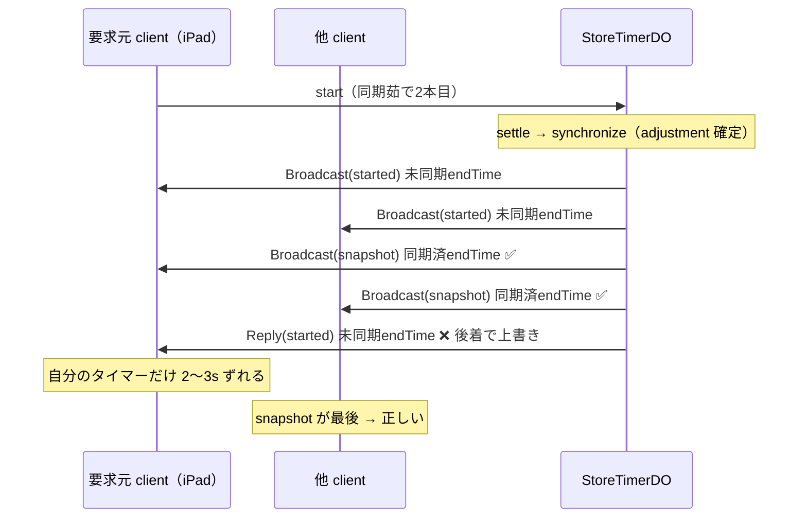
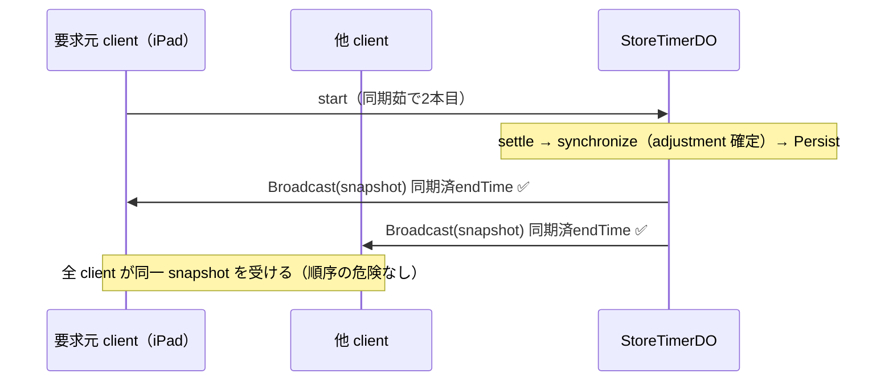

# 技術設計書 — snapshot 単一表現によるブロードキャスト（snapshot-broadcast）

## この設計が拠って立つもの

本設計は、ステアリング（`design-philosophy.md` / `timer-model.md` / `naming.md` / `tooling.md`）と既存の中核設計（`.kiro/specs/yude-men-timer/design.md`）を前提とし、ライブなデバッグ／設計セッションで確定した「server→client メッセージ契約の構造変更」を形にする。設計判断はすべてこの三者から演繹される。

本機能は **新しい概念を足す変更ではなく、二重に持っていた表現を一つへ畳む「引き算」の変更**である。設計哲学の「重複の根絶」「真 — 二つの真実の源を作らない」の直接の帰結として、次に集約する。

1. **確定した状態変化ごとに、全 client へ送るのは `snapshot` ただ一つ。** 意味論メッセージ（`started` / `cancelled` / `completed` / `boiled` / `adjusted`）を broadcast / reply 経路から**完全に撤去**する。`snapshot` を唯一の権威表現（SSOT）に据える。
2. **要求元への個別 `Reply` を廃す。** 要求元も他の client と同一の `snapshot` を受ける。これにより後述の **bug#1（Reply が snapshot より後着して未同期 endTime で上書きする）を構造的に消滅させる**（二表現間の順序という危険そのものを無くす）。
3. **client の reducer を一本の経路へ畳む。** タイマー集合の反映はすべて「server-confirmed の全置換＋直前集合との差分」で表現し、消えた Timer から残滓（`lastResults`）を導く。
4. **残滓は理由を問わず一様。** 明示完了（Complete）でも中断（Cancel）でも、「在ったものが消えた」事実だけで残滓を出す。これが意味論メッセージが存在していた最後の理由を取り除く。
5. **非機能：圧縮しない（YAGNI）。** `snapshot` は素の JSON・非圧縮のまま、離散イベント時のみ broadcast する。サイズは有界（後述）で Cloudflare WebSocket には些少。この判断を根拠つきで記録し、蒸し返さない。
6. **層の主権を崩さない。** engine は純粋（計算と作用の分離）、`domain` は中立の契約ハブ、Cloudflare 固有は shell に隔離する。

> **スコープ境界（重要）**：本設計は **メッセージ／ブロードキャストモデルの変更のみ**を扱う。近接同時茹で上がりの maximin 調整アルゴリズム挙動（「3本以上が収束しない／過剰移動」の別懸念・`synchronized-boil-adjustment`）は **本設計に混ぜない**。それは別個のアルゴリズム変更である。

---

## Overview

### 動機 — 確定済みのバグ（bug#1）が本設計を駆動した

現状の DO は、確定した変化のたびに **意味論メッセージ（per-timer）と全量 `snapshot` の両方**を broadcast している。この二重表現が実バグを生んだ。

`engine/settle.ts` の `assembleEffects` が組む Effect 順序は次のとおり:

```
[ Persist, SetAlarm, ...Broadcast(意味論), Broadcast(snapshot), Reply(意味論) ]
```

- `Broadcast(snapshot)` は **同期済みの実効 endTime**（`toWireTimer` が `adjustment` を畳んだ値）を載せる。
- `Reply(意味論)` は `start.ts` で `synchronize` が走る**前**に `adjustment = 0` で組まれた **未同期 endTime** を運ぶ。しかも要求元にだけ、**snapshot より後**に届く。

結果、要求元 client では「たった今開始したタイマー」が Reply の未同期 endTime で上書きされる。サーバ状態では2本の同期茹でが等しいのに、**操作者自身の iPad では 2〜3 秒ずれて表示**され、他（非要求元）client は正しく見える。engine＋client シミュレーションで再現済み。

根本原因は「同一事実に対する二つの表現（意味論 / snapshot）が、順序を持って別々に届く」という構造そのものである。順序を直すのではなく、**表現を一つにして順序を消す**のが本設計の判断である。

### 何を変えるか（要点）

| 事項 | 変更前 | 変更後 |
| --- | --- | --- |
| 状態変化時の broadcast | 意味論 × N ＋ `snapshot` | `snapshot` ただ 1 通 |
| 要求元への `Reply` | 意味論を個別返信 | 廃止（同一 `snapshot` を受ける） |
| `ServerMessage` 種別 | snapshot/started/cancelled/boiled/completed/adjusted/config/error | **snapshot/config/error のみ** |
| client の反映経路 | 種別ごとの 6 分岐 | `snapshot` の全置換＋差分 一本 |
| 残滓（`lastResults`）の契機 | `completed` のみ | 「消えた Timer」一様（Cancel も Complete も） |
| 接続時 hydration | `snapshot` | 変更なし（そのまま） |
| `snapshot` の圧縮 | なし | なし（YAGNI として明文固定） |

### 変えないもの

- 接続時の hydration は従来どおり `snapshot`（全量）。
- `config`（店舗設定の一方向配信）と `error`（拒否・失敗）はそのまま。
- ワイヤの Timer 表現は `TimerFact` のまま（**新フィールドを足さない**・後述の評価で確認）。
- SSOT は永続層、確定の起点は `storage.put` 成功のみ。broadcast は put 成功の上にのみ立つ。
- client の残り秒はローカル導出（`endTime` からの計算）で状態に昇格させない。

---

## Architecture

### 触る層と触らない層

```mermaid
flowchart TB
  subgraph domain["src/domain（共有契約・中立地帯）"]
    MSG["messages.ts / ServerMessage<br/><b>started/cancelled/boiled/completed/adjusted を撤去</b><br/>snapshot / config / error のみ"]
    TF["timer.ts / TimerFact<br/><b>変更なし（新フィールドを足さない）</b>"]
  end
  subgraph engine["src/engine（純粋・プラットフォーム非依存）"]
    SET["settle.ts / assembleEffects<br/><b>trigger と Reply を撤去</b><br/>[Persist, SetAlarm|ClearAlarm, Broadcast(snapshot)]"]
    TR["start / cancel / complete / fire / adjust<br/><b>意味論 ServerMessage の構築を撤去</b>"]
    EFF["effect.ts / Effect<br/><b>Reply 種別を撤去（要確認）</b>"]
    PRJ["project.ts / toWireTimer<br/>変更なし（唯一の射影）"]
  end
  subgraph shell["src/shell（作用の端・Cloudflare 固有）"]
    DO["store-timer-do.ts<br/>runEffects: replyTo 引き回しを撤去<br/>Broadcast 経路は snapshot のみ流す<br/>error/config の直接 ws.send は不変"]
  end
  subgraph client["src/client（React）"]
    CN["connection.ts<br/>decideServerMessage: snapshot/config/error のみ<br/><b>reconcileServerConfirmed: 全置換＋差分で残滓を導出</b>"]
  end
  DO --> TR --> SET
  SET -.->|Broadcast(snapshot)| EFF
  EFF --> DO
  DO -.->|WS: snapshot / config / error| CN
  MSG -.->|契約| CN
  MSG -.->|契約| DO
```

**変更する箇所（最小・すべて引き算寄り）:**

- `src/domain/messages.ts` — `ServerMessage` から `started` / `cancelled` / `boiled` / `completed` / `adjusted` を撤去。
- `src/engine/settle.ts` — `settle` / `assembleEffects` から `trigger`（意味論列）と `replyTo`（Reply）を撤去。Effect 列は `[Persist, SetAlarm|ClearAlarm, Broadcast(snapshot)]`。
- `src/engine/{start,cancel,complete,fire,adjust}.ts` — 意味論 `ServerMessage` の構築を撤去し、`settle(state, moved, params, now)` を呼ぶだけにする。
- `src/engine/effect.ts` — `Reply` 種別を撤去（未使用化のため・**公開シンボルゆえ要確認**）。
- `src/shell/store-timer-do.ts` — `runEffects` / `applySideEffect` の `replyTo` 引き回しと `Reply` 分岐を撤去（`error`・`config` の直接 `ws.send` は不変）。
- `src/client/connection.ts` — `decideServerMessage` を `snapshot` / `config` / `error` の 3 分岐へ縮退、`reconcileServerConfirmed` に「差分による残滓導出」を統合。

### シーケンス — 変更前（bug#1 の発生）



### シーケンス — 変更後（snapshot 単一表現）



---

## Components and Interfaces

### Component 1: `domain/messages.ts` — 契約の縮退（SSOT の起点）

**目的**：server→client の表現を一つにする。`ServerMessage` の判別共用体から意味論 4 種＋開始通知 1 種を撤去する。

```typescript
/** server → client のメッセージ。すべて serverTime を付与する。 */
export type ServerMessage =
  | { readonly type: "snapshot"; readonly serverTime: number; readonly timers: readonly TimerFact[] } // 唯一の権威表現（hydration も状態変化も同一）
  | { readonly type: "config"; readonly serverTime: number; readonly unitCount: number; readonly noodlePresets: readonly NoodlePreset[] } // 店舗設定の一方向配信
  | { readonly type: "error"; readonly serverTime: number; readonly code: string; readonly message: string }; // 拒否・失敗（要求元へ直接 ws.send）
```

**責務**：
- `snapshot` を「接続時 hydration」と「確定変化ごとの全置換」の両方に共用する（重複の根絶）。
- `TimerFact` の実効 `endTime` は engine の `toWireTimer` が畳み込む（client は `adjustment` を知らない）。

> **naming ゲート（実装前にユーザー確認）**：撤去する `ServerMessage` の `type` は公開契約の変更である。撤去対象＝ `started` / `cancelled` / `boiled` / `completed` / `adjusted`、存置＝ `snapshot` / `config` / `error`。この集合を実装前に確定する（後述「公開シンボルの確認ゲート」）。

### Component 2: `engine/settle.ts` — Effect 列の単純化

**目的**：確定変化時に組む Effect 列を `[Persist, SetAlarm|ClearAlarm, Broadcast(snapshot)]` へ縮退する。`trigger`（意味論列）と `replyTo`（Reply）を撤去する。

```typescript
/**
 * 集合変更後の共通後処理（全体再同期＋no-op 検出＋Effect 列組み立て）。
 * 変化があれば Persist を先頭に、SetAlarm|ClearAlarm（実効最早）・全量 snapshot Broadcast の順で組む。
 * 意味論 Broadcast と Reply は撤去した（snapshot 単一表現・bug#1 の構造的消滅）。
 */
export function settle(
  prev: TimerState,
  moved: TimerState,
  params: SyncParams,
  now: EpochMillis,
): Outcome;

function assembleEffects(nextState: TimerState, now: EpochMillis): readonly Effect[] {
  const snapshot: ServerMessage = {
    type: "snapshot",
    serverTime: now,
    timers: nextState.timers.map(toWireTimer), // 実効 endTime を畳み込む唯一の射影
  };
  return [
    { type: "Persist", snapshot: toSnapshot(nextState) },
    nextAlarmEffect(nextState.timers),
    { type: "Broadcast", message: snapshot },
  ];
}
```

**責務**：
- no-op 検出（確定結果が prev と同一なら Effect 空）は不変。
- Persist 先頭・put 成功の上にのみ Broadcast が立つ SSOT 規律は不変。

### Component 3: `engine/{start,cancel,complete,fire,adjust}.ts` — 意味論構築の撤去

**目的**：各遷移から意味論 `ServerMessage` の構築を消し、`settle` 呼び出しを最小化する。

```typescript
// start.ts（変更後の末尾）— started の構築と toWireTimer import を撤去
export function startTimer(state: TimerState, args: StartEvent, params: SyncParams): Outcome {
  // …検証・容量検査・endTime 算出・Timer 追加（moved の構築）は不変…
  return settle(state, moved, params, args.now); // 意味論も Reply も渡さない
}

// cancel.ts / complete.ts — cancelled / completed の構築を撤去
return settle(state, moved, params, now);

// adjust.ts — adjusted の構築と toWireTimer import を撤去
return settle(state, moved, params, now);

// fire.ts — boiled 列（boiledBroadcasts）の構築を撤去
return settle(state, moved, params, now);
```

**責務**：
- 各遷移は「基底の集合変更（`moved`）」までに徹し、再同期・no-op・Effect 列は `settle` へ委ねる（従来どおり）。
- `start.ts` / `adjust.ts` は `toWireTimer` を直接使わなくなる（射影は `settle` 内 `assembleEffects` に一本化）。

### Component 4: `engine/effect.ts` — `Reply` 種別の撤去（要確認）

**目的**：`Reply` が全経路で未使用化するため、`Effect` から撤去する。

```typescript
export type Effect =
  | { readonly type: "Persist"; readonly snapshot: ActiveTimersSnapshot }
  | { readonly type: "SetAlarm"; readonly at: EpochMillis }
  | { readonly type: "ClearAlarm" }
  | { readonly type: "Broadcast"; readonly message: ServerMessage }; // Reply を撤去
```

> **naming ゲート**：`Effect` の種別は公開シンボル。`Reply` の撤去は要確認。拒否・失敗の要求元通知は従来どおり shell が `error` を直接 `ws.send` するため、`Reply` Effect は本変更後どこからも生成されない（＝安全に撤去可能）。

### Component 5: `shell/store-timer-do.ts` — broadcast 経路の縮退

**目的**：`Reply` の引き回しを撤去し、Broadcast は `snapshot` のみを全 WS へ流す。

```typescript
// runEffects: replyTo 引数を撤去（webSocketMessage / alarm いずれも渡さない）
private async runEffects(effects: readonly Effect[]): Promise<RunResult>;

// applySideEffect: Reply 分岐を撤去。Broadcast は従来どおり全 WS へ全量送信。
// error / config は Timer の SSOT フローに乗らない別系統ゆえ、従来どおり直接 ws.send する（不変）。
```

**責務**：
- `webSocketMessage` の拒否・`adjust` の解決失敗は、従来どおり `error` を要求元へ直接 `ws.send`（`Reply` Effect は使わない）。
- 接続時の `config` → `snapshot` の初期送信は不変。
- 計装（`emitSeam`）の broadcast 継ぎ目は不変（messageType は常に `"snapshot"` になる）。

### Component 6: `client/connection.ts` — reducer の一本化と差分残滓

**目的**：`decideServerMessage` を `snapshot` / `config` / `error` の 3 分岐へ縮退し、タイマー集合の反映を `reconcileServerConfirmed`（全置換＋差分）へ集約する。残滓（`lastResults`）を「消えた Timer」から一様に導く。

```typescript
function decideServerMessage(view: ClientView, message: ServerMessage, receivedAt: number): ClientView {
  const offset = clockOffset(message.serverTime, receivedAt);
  switch (message.type) {
    case "snapshot": {
      // server-confirmed の全置換＋直前集合との差分で残滓を導く共有規律。
      const reconciled = reconcileServerConfirmed(view, message.timers, receivedAt);
      return { ...reconciled, offset, sync: "synced", error: null };
    }
    case "config":
      return { ...view, offset, unitCount: message.unitCount, noodlePresets: message.noodlePresets };
    case "error":
      return { ...view, offset, error: { code: message.code, message: message.message } };
  }
}
```

**責務（`reconcileServerConfirmed` の拡張）**：
- (a) server-confirmed（`origin==="server"`）を `serverTimers` で全置換、provisional（`origin==="local"`）は保持。
- (b) 直前の server-confirmed 集合と `serverTimers` を **差分**し、消えた Timer の `noodleType` を、再占有されていない各 `slotId` の残滓として記録。
- (c) 新 snapshot（＋保持 provisional）が占有する `slotId` の残滓は消す。
- (d) `processedIds` は「serverTimers の id ∪ 保持 provisional の id」へ刈り取り（不変）。boiled/running とアラート dedup は従来どおり `endTime` から導出する。

> **naming ゲート（軽微）**：`reconcileServerConfirmed` は既存公開関数だがシグネチャに `at`（残滓記録時刻）を追加する。関数名・概念境界は不変ゆえ、追加引数のみ確認する。

---

## Data Models

### `ClientView.lastResults`（不変・記録契機だけが変わる）

```typescript
/** 直前の調理結果（client 専用・ベストエフォート）。slotId → { 麺種, 記録時刻 }。 */
readonly lastResults: ReadonlyMap<string, { readonly noodleType: string; readonly at: number }>;
```

- 型・意味は不変。**記録の契機が「completed 受信」から「snapshot 差分で消えた Timer」へ移る**だけ。
- Cancel も Complete も Fire→Complete も、すべて「snapshot から消える」として一様に残滓を生む（decision #3）。

### 新フィールドの要否評価 — **不要（純粋 client 差分を推奨）**

残滓に必要な情報は「消えた Timer の `noodleType` と、その `slotIds`」である。これらは **直前の server-confirmed 集合（`view.timers` の `origin==="server"`）が既に保持**している。したがって client 側の差分だけで残滓を復元でき、`snapshot` ワイヤ（`TimerFact`）に新フィールドは要らない。

- decision #3（一様残滓）により「完了か中断か」を区別する必要がなく、`snapshot` に理由・墓標フィールドを足す動機も消える。
- 設計哲学「抽象は重複が実在してから」「YAGNI」に整合。**推奨：新フィールドなし・純粋差分**。

> **naming ゲート**：この推奨が承認されれば `TimerFact` および `snapshot` の形は完全に不変（公開契約の追加なし）。

---

## Algorithmic Pseudocode（Key Functions with Formal Specifications）

### `reconcileServerConfirmed`（差分による一様残滓）

```typescript
/**
 * server-confirmed のみ全置換し provisional は保持。直前 server-confirmed との差分で消えた Timer の
 * 麺種を残滓として記録し、新 snapshot（＋provisional）が占有するスロットの残滓は消す。
 */
export function reconcileServerConfirmed(
  view: ClientView,
  serverTimers: readonly TimerFact[],
  at: number,
): ClientView;
```

```pascal
ALGORITHM reconcileServerConfirmed(view, serverTimers, at)
INPUT:  view（現在ビュー）, serverTimers（新 snapshot の全量）, at（受信時刻）
OUTPUT: 新しい ClientView

BEGIN
  // 直前の server-confirmed と provisional を分ける
  prevServer  ← view.timers WHERE origin = "server"
  provisional ← view.timers WHERE origin = "local"

  // (a) server-confirmed を全置換（すべて origin="server" 化）
  confirmed ← MAP serverTimers AS { ...t, origin: "server" }

  // 占有スロット = 新 server 集合 ∪ 保持 provisional のスロット
  occupied ← EMPTY SET
  FOR each t IN serverTimers  DO occupied ← occupied ∪ t.slotIds END FOR
  FOR each t IN provisional   DO occupied ← occupied ∪ t.slotIds END FOR

  // (b) 差分：直前 server にいて新 server にいない Timer が「消えた」
  newIds ← { t.id | t IN serverTimers }
  next_lastResults ← COPY(view.lastResults)

  // (c) 占有スロットの残滓は消す（新規/継続タイマーが乗っているスロット）
  FOR each slotId IN occupied DO
    next_lastResults.DELETE(slotId)
  END FOR

  // 消えた Timer の麺種を、再占有されていないスロットへ残滓として記録（一様・理由を問わない）
  FOR each t IN prevServer WHERE t.id NOT IN newIds DO
    FOR each slotId IN t.slotIds WHERE slotId NOT IN occupied DO
      next_lastResults.SET(slotId, { noodleType: t.noodleType, at })
    END FOR
  END FOR

  // (d) processedIds を保持 id 集合へ刈り取り（有界・復活キャンセル抑止の維持）
  retained ← newIds ∪ { t.id | t IN provisional }
  prunedProcessed ← { id ∈ view.processedIds | id ∈ retained }

  RETURN { ...view,
           timers: confirmed ++ provisional,
           lastResults: next_lastResults,
           processedIds: prunedProcessed }
END
```

**Preconditions:**
- `view` は健全（`timers` の各要素は `origin` を持つ）。
- `serverTimers` は権威 snapshot の全量（実効 `endTime` 込み・engine 射影後）。
- `at` は受信時点のローカル時刻（残滓の提示時間窓の起点）。

**Postconditions:**
- 返り値の server-confirmed 集合は `serverTimers` と id 一致（全置換）。
- provisional は保持され、id・件数不変。
- `occupied` の各スロットに `lastResults` エントリは存在しない。
- 「消えて再占有されていない」各スロットに、消えた Timer の `noodleType` が残滓として載る。
- `processedIds ⊆ retained`。

**Loop Invariants:**
- 占有削除ループ後：処理済みスロットは残滓を持たない。
- 差分記録ループ中：記録済み残滓はすべて `occupied` に属さないスロットに限られる（占有を先に削除済みかつ記録条件に `NOT IN occupied` を課すため）。

### `assembleEffects`（snapshot 単一 broadcast）

```pascal
ALGORITHM assembleEffects(nextState, now)
OUTPUT: Effect 列（Persist 先頭）

BEGIN
  snapshot ← { type: "snapshot", serverTime: now, timers: MAP nextState.timers AS toWireTimer }
  RETURN [ { Persist, toSnapshot(nextState) },
           nextAlarmEffect(nextState.timers),   // SetAlarm | ClearAlarm（実効最早）
           { Broadcast, snapshot } ]
END
```

**Preconditions:** `settle` の no-op 検出を通過（確定結果が prev と異なる）。
**Postconditions:** Broadcast は `snapshot` ちょうど 1 通。Reply / 意味論 Broadcast は出さない。列は Persist を先頭に持つ。

---

## Example Usage

```typescript
// server（engine）: start の確定 → Effect 列は snapshot 1 通のみ
const outcome = startTimer(state, startEvent, { arms, toleranceRatio });
// outcome.effects === [Persist, SetAlarm, Broadcast(snapshot)]  ← Reply も started も無い

// shell: put 成功の上にのみ全 WS へ snapshot を送る
await runEffects(outcome.effects); // Broadcast(snapshot) を getWebSockets() 全員へ

// client: 同一 snapshot を全員が受け、要求元も他も同じ集合へ収束（bug#1 消滅）
const next = decideView(view, { kind: "Server", message: snapshotMsg, receivedAt: Date.now() });

// 残滓: Cancel でも Complete でも「消えた Timer」から一様に出る
//   直前 server = [A(slot1, ラーメン)]  →  新 snapshot = []  ⟹ lastResults[slot1] = { ラーメン, at }
//   新 snapshot = [B(slot1, うどん)]     ⟹ lastResults[slot1] は消える（占有）
```

---

## Correctness Properties

`fast-check`（PBT）と example テストで検証する。

### Property 1: 単一表現（SSOT）
確定変化を生む任意の遷移について、`effects` に含まれる `Broadcast` はちょうど 1 個で、その `message.type === "snapshot"`。`Reply` は一切含まれない。

**Validates: Requirements 1.1, 1.4, 7.1**

### Property 2: bug#1 の消滅（収束一致）
任意の start 直後、要求元 client と非要求元 client が同じ broadcast 列を適用すると、両者の server-confirmed 集合は `snapshot.timers` に完全一致する（要求元だけがズレる経路が存在しない）。

**Validates: Requirements 3.1, 3.2, 3.4**

### Property 3: 残滓の一様性
連続する 2 つの server-confirmed snapshot 間で消えた任意の Timer `t`（Cancel / Complete / Fire→Complete いずれの理由でも）について、再占有されない各 `slotId` に `lastResults[slotId].noodleType === t.noodleType`。

**Validates: Requirements 4.2, 5.1**

### Property 4: 残滓のクリア
新 snapshot（＋provisional）が占有する任意の `slotId` に `lastResults` エントリは存在しない。

**Validates: Requirements 4.3, 5.3**

### Property 5: 純粋差分（新フィールド不要）
`reconcileServerConfirmed` の出力は `(直前 server-confirmed, 新 serverTimers, at)` のみの関数であり、`snapshot` ワイヤ形状は `TimerFact` のまま（追加フィールドに依存しない）。

**Validates: Requirements 4.6**

### Property 6: 冪等性
同一 `serverTimers` を二度適用すると、`timers`・`processedIds` は不変、`lastResults` はキー集合不変（`at` の更新のみ）。二度目に新規残滓は生じない。

**Validates: Requirements 4.5**

### Property 7: offset 再確立
`snapshot` / `config` / `error` の受信ごとに `offset = clockOffset(serverTime, receivedAt)` が更新される。

**Validates: Requirements 2.5**

### Property 8: サイズ有界
`|JSON(snapshot)| ≤ MAX_TIMERS × 1タイマー最大バイト`。バイト数はタイマー件数に対し単調増加。

**Validates: Requirements 6.3**

---

## Error Handling

| シナリオ | 条件 | 応答 | 回復 |
| --- | --- | --- | --- |
| 開始拒否 | `InvalidBoilSeconds` / `InvalidSlotOrNoodle` / `CapacityExceeded` | 従来どおり `error` を要求元へ直接 `ws.send`（Effect 列は生まれない） | client は `error` を表示、次 snapshot で解消 |
| adjust 解決失敗 | `TimerNotFound` / `UnknownNoodle` | 従来どおり `error` を直接 `ws.send` | 同上 |
| put 失敗 | `storage.put` reject | 後続 Effect（Alarm/Broadcast）を実行しない・Working_Copy 据え置き | Alarm 経路は再試行、Broadcast 欠落は再接続 hydration が回収 |
| broadcast 送信失敗 | 個別 WS の `send` 失敗 | 握り潰さず継続（従来どおり） | 再接続時の全量 hydration（snapshot）が回収 |

- `error` の要求元通知が `Reply` Effect に依存していないこと（shell の直接 `ws.send`）が、`Reply` 撤去を安全にする前提。

---

## Testing Strategy

**Property-Based Testing（ライブラリ：fast-check・v4 系）**
- `reconcileServerConfirmed` の差分残滓（Property 3/4/6）：ランダムな直前集合・新集合・スロット重なりで検証。
- engine の Effect 列（Property 1）：任意イベント列で `Broadcast` が snapshot 単一・`Reply` 不在を検証。

**Example Testing**
- **bug#1 回帰**：engine＋client シミュレーションで「2 本同期茹での 2 本目 start」を再現し、要求元 client の endTime が snapshot（同期済み）と一致する（変更前は不一致で fail、変更後 pass）。
- 一様残滓：Cancel と Complete がともに残滓を出すこと。

**回帰（撤去の副作用がないこと）**
- 接続時 hydration（snapshot）・`config`・`error` の経路が不変であること。
- degraded（offline）経路：`LocalStart` / `LocalCancel` / `LocalComplete` の挙動確認（下記「整合の申し送り」参照）。

**ツール**：`pnpm test`（`vitest --run`）。engine/domain は workerd 不要、shell/DO は Workers pool。

---

## Non-Functional — 圧縮しない（判断の記録）

**決定：`snapshot` は素の JSON・非圧縮のまま、離散イベント時のみ broadcast する。圧縮は明示的に YAGNI とする。**

根拠（蒸し返さないために記録）:

- **配信契機**：`snapshot` は「確定した状態変化」の離散イベントでのみ送る。ストリームしない。カウントダウンは client 側のローカル導出（`endTime - now`）で、hibernation も従来どおり維持される。
- **サイズ有界**：`TimerFact` のワイヤは概ね 150〜220 バイト/タイマー。

  | 状況 | タイマー件数 | 概算サイズ |
  | --- | --- | --- |
  | 現実的な同時稼働 | 数十本 | 約 3〜9 KB |
  | 最悪 | `MAX_TIMERS = 100` | 約 20 KB |

  いずれも Cloudflare WebSocket には些少。加えて Workers の WebSocket メッセージ上限は **1 MiB から 32 MiB へ引き上げられた（2025-10-31）** ため、素の JSON でも生サイズが硬い障壁になることはない。圧縮の CPU / 実装複雑性に見合う便益がない（決定は不変）。
- **プロトコル層 `permessage-deflate` は Cloudflare 環境では利用不可（前提にしない）**：Workers / Durable Objects の WebSocket では `permessage-deflate` は使えない。公式の WebSocket / Hibernation API ドキュメントは同拡張に一切言及せず、`WebSocketPair` / `acceptWebSocket` にも有効化・ネゴシエーションの API が無い。クライアントが拡張を提示してもハンドシェイク応答から省かれ、ネゴシエートされないことがコミュニティ報告でも確認されている（Cloudflare docs ＋ community、2026-07 調査）。したがって本環境で `permessage-deflate` には依拠できない。「将来の仮想レバー」としてではなく、**利用不可**として記録する。
- **もし圧縮が必要になったら（別 spec 駆動・アプリ層で行う）**：将来の order-list snapshot（本 spec とは**別個の spec**）が要求した場合に限り、圧縮は**アプリケーション層**で行う。Web 標準の `CompressionStream` / `DecompressionStream`（Workers ランタイムの Streams API・ブラウザ双方で利用可能・依存追加なし）でペイロードを gzip し、**バイナリ WebSocket フレーム（`ArrayBuffer`）**として送出、client の Socket 境界でデコードする。これはトランスポートのシリアライズ境界（shell encode / client Socket decode）に閉じ、engine / domain / reducer には一切触れない配線レベルの変更であり、**構造の主権**と整合する。必要が実証されるまで導入しない。

---

## Security Considerations

- 本変更は送信メッセージの**種別を減らす**方向で、新たな受信入力・エンドポイント・権限境界を追加しない。攻撃面はむしろ縮小する。
- `snapshot` は既に接続時 hydration で全量配信しており、状態変化時の全量配信も同じ情報クラス（追加の機微情報を含まない）。
- 認証・認可は本設計の対象外（`config` エンドポイントの認証は Worker 端で処理する既存前提のまま）。

---

## Dependencies

- 追加依存なし。既存スタック（TypeScript strict / Vitest / fast-check / oxlint / Wrangler）のまま。
- 変更は既存モジュール内に閉じる（`domain/messages.ts`・`engine/{settle,start,cancel,complete,fire,adjust,effect}.ts`・`shell/store-timer-do.ts`・`client/connection.ts`）。

---

## 公開シンボルの確認ゲート（実装前にユーザー確認）

`naming.md` に従い、公開シンボルの変更は実装前に確認する。本設計が要する確認事項:

1. **`ServerMessage` から撤去する `type`**：`started` / `cancelled` / `boiled` / `completed` / `adjusted`。
   **存置**：`snapshot` / `config` / `error`。
2. **`Effect` から撤去する種別**：`Reply`（本変更後どこからも生成されない）。
3. **`settle` のシグネチャ変更**：`trigger`（意味論列）と `replyTo`（Reply）引数の撤去。
4. **`reconcileServerConfirmed` のシグネチャ変更**：残滓記録時刻 `at` の追加（関数名・概念境界は不変）。
5. **`snapshot` への新フィールド**：**足さない**ことを推奨（純粋 client 差分で残滓を復元可能）。この推奨の承認可否。

---

## 整合の申し送り（design 判断として記録・実装時に確認）

- **degraded（offline）経路の残滓一様化**：現状 `LocalComplete` は残滓を記録し、`LocalCancel` は記録しない。decision #3（一様残滓）と UX を揃えるなら、`LocalCancel` も除去直前の麺種を残滓へ記録するのが自然。ただしこれは client ローカル挙動であり、messaging 契約の変更とは別レイヤ。**実装時に「degraded でも一様残滓にするか」をユーザーへ確認**する（本 spec の requirements で明文化予定）。
- **`boiled` 音のトリガ**：茹で上がりアラートは既に client のローカル導出（`endTime ≤ correctedNow` かつ未処理）で鳴っており、server の `boiled` メッセージは重複抑止（`processedIds`）用途にすぎなかった。`boiled` 撤去後はローカル導出が唯一の契機となる（decision #2 と整合・挙動は実質不変）。
