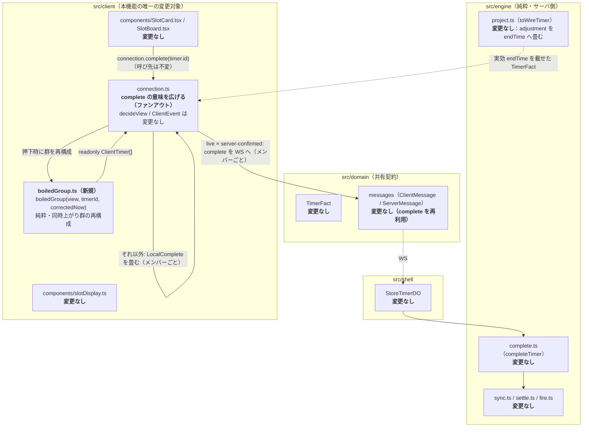
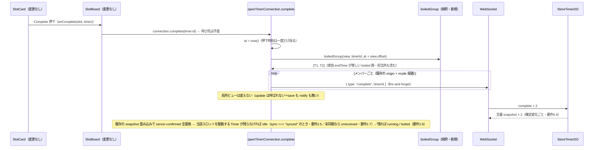
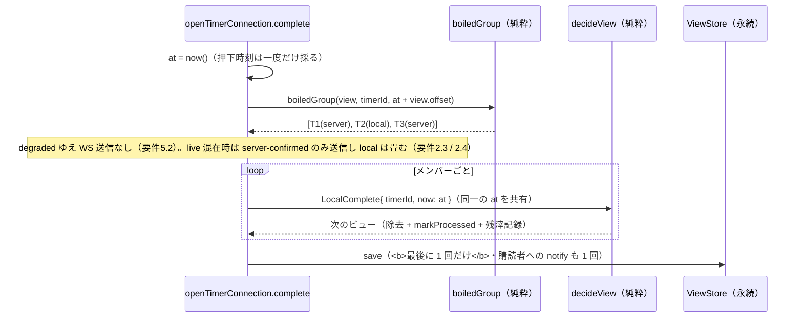

# 技術設計書 — 同時上がり群の一括消し込み（sync-set-batch-complete）

## この設計が拠って立つもの

本設計は `requirements.md`（要件 1〜10・EARS記法・Q1〜Q4 確定済み）を正本とし、ステアリング（`design-philosophy.md` / `naming.md` / `timer-model.md` / `tooling.md`）を前提とする。加えて次の二つの既存設計に依存する。

- `.kiro/specs/synchronized-boil-adjustment/design.md`（Boil_Sync）— 「Correctness Properties」Property 5（同期確定セットのメンバーは実効 endTime が完全一致する）、「射影の単一化（engine/project.ts・新規）」、「`decide` への設定注入と再計算の統合」の《なぜ boiled を再同期しないか》。本機能はここで確定した帰結を消し込みの識別に用いるだけで、同期計算に触れない。
- `.kiro/specs/offline-degradation/design.md`（劣化運用）— 「Provisional_Timer（起源タグ付きの未確定なローカル意図）」、「データフロー（再接続時の Reconcile ＝ 決定 B）」。degraded 経路とローカル権限の規律はここが正本である。

本機能の骨格は次の 5 点に尽きる。以下の全節はこの展開である。

1. **サーバ契約を一文字も変えない。** 新しい `ClientMessage` / `ServerMessage` 種別・engine 公開関数・Effect 種別を足さない。既存 `complete` メッセージのファンアウトだけで実現する（要件10.3）。
2. **新しい `ClientEvent` 種別も足さない。** degraded の一括は既存 `LocalComplete` を群の件数だけ畳む。純粋遷移 `decideView` の分岐は増えない。
3. **同時上がりは新しい状態ではなく導出値である。** Boiled_Group は保持しない。押下のたびに `view.timers` と補正後現在時刻から純粋関数で再構成する。
4. **識別の根拠は Timer が既に持つ事実だけ。** 実効 endTime（`TimerFact.endTime`）の一致のみを使う。Sync_Set membership を追跡・配信しない。
5. **UI は増えない。** 既存の Complete ボタンが呼ぶ先（`complete(timerId)`）が変わらないまま、その意味が広がる。

---

## Overview

### 目的

boiled なスロットの Complete を一度押すと、その Timer と同時に茹で上がった Timer 群（Boiled_Group）をまとめて完了する。厨房スタッフの一度の湯切り動作に、一度のボタン操作を対応させる。

### 設計上の中心的判断（要点）

| # | 判断 | 詳述する節 |
| --- | --- | --- |
| 1 | 同時上がりを**実効 endTime の一致**で再構成する（membership を配信しない） | Architecture「なぜ実効 endTime の一致でグループを再構成できるのか」 |
| 2 | 偶然の一致は偽陽性ではなく**正しい挙動**として受け入れる | Architecture「偶然の一致をどう考えるか」 |
| 3 | boiled 判定は `endTime <= correctedNow` の形に揃える（`dueLocalTimers` と同一述語） | Architecture「boiled 判定の規律」 |
| 4 | 一括対象に**担当射影を掛けない**（操作口だけが担当スロット） | Architecture「担当スコープの非対称」 |
| 5 | 既存 `complete(timerId)` の**意味を広げる**（新メソッドを足さない） | Components「消し込みの入口」 |
| 6 | ファンアウトは既存の origin × mode 経路をメンバーごとに回すだけ。**完了待機を持ち込まない** | Components「ファンアウトの形」 |
| 7 | degraded のファンアウトは `update` を **1 回に畳む** | Components「degraded の一括を 1 回の update に畳む」 |
| 8 | 純粋関数 `boiledGroup` を `src/client/boiledGroup.ts` へ切り出す | Components「boiledGroup の置き場」 |
| 9 | 残滓は**記録の有無**（経路が決める）と**記録する値**（反映順で最後のメンバー）を分け、**経路をまたぐ反映順は規定しない**（実装の非対称に要件を合わせる） | Components「残滓の記録」 |
| 10 | 完了は**スロットを idle にするとは限らない**（同一スロットを別 Timer が駆動しうる／未同期なら `unreceived`） | Components「UI は変更しない」 |
| 11 | ファンアウトが生む重複 complete の拒否 `TimerNotFound` を、**クライアントの error 畳み込みで落とす**（意図は達成済みゆえ表示に値しない）。他の拒否種別は従来どおり提示する | Architecture「ファンアウトが重複 complete を系統的に生む」 |

### スコープ外（design 判断として固定）

- **`synchronize` のアルゴリズム**（Proximity_Cluster 形成・Sync_Set 分割・Sync_Target の maximin 配置・Adjustment 割り当て）— 一切変更しない（要件9.1 / 9.2）。
- **発火（boiled 遷移）の判定基準**（実効 endTime ≤ now + ε）— 変更しない（要件9.3）。
- **Sync_Set membership の client への配信** — 行わない（要件1 確定 / 要件10.1）。
- **原子的な単一 snapshot** — 要求しない（要件6.4）。
- **一括完了の送信結果の待機・再送** — 持たない（要件6.3）。put が失敗したメンバーは正本に残り、次の snapshot 契機で収束する（要件6.5 / 6.8 / 6.6）。

---

## Architecture

### 本機能が触る層と触らない層



**変更する箇所（2 ファイル）:**

- `src/client/boiledGroup.ts`（新規）— 純粋関数 `boiledGroup`。
- `src/client/connection.ts` — `openTimerConnection` が返す `complete` の実装をファンアウトへ広げる。`TimerConnection` のシグネチャは不変。

**変更しない箇所（不変点）:**

`src/domain/**`・`src/engine/**`・`src/shell/**`・`src/client/connection.ts` の `ClientView` / `ClientEvent` / `decideView`（**ただし error 畳み込みの一点を除く**——Architecture「ファンアウトが重複 complete を系統的に生む」の不変点の修正） / `reconcileServerConfirmed` / `dueLocalTimers`・`src/client/components/slotDisplay.ts`・`src/client/components/SlotCard.tsx`・`src/client/components/SlotBoard.tsx`・`src/client/assignment.ts`・`src/client/clock.ts`・`src/client/notification.ts`・`src/client/persistence.ts`。

### なぜ実効 endTime の一致でグループを再構成できるのか

同期確定した Sync_Set のメンバーは、実効 endTime が完全に一致する。これは Boil_Sync の設計が Property 5 として立てた不変量である（`synchronized-boil-adjustment/design.md`「Correctness Properties」Property 5）。

クライアントが受け取る `TimerFact.endTime` は、この実効値そのものである。engine の射影 `toWireTimer` が `adjustment`（engine 専用の事実）を `endTime` へ畳んで載せ、クライアントは調整の存在を知らない（同 design「射影の単一化（engine/project.ts・新規）」）。

この二つを重ねると、次が言える。**同期の帰結のうちクライアントが観測できるものは、実効 endTime の一致ただ一つである。** ゆえに membership を知らなくても、同時上がりは実効 endTime の一致として再構成できる。engine / domain 契約を変えずに済む理由はここにある——使うのは Timer が既に持っている事実だけで、新しい事実を運ぶ必要がない。

> **代替案（membership を配信する）と不採用の理由:** `TimerFact` に Sync_Set の識別子を足す案、または新しい `ServerMessage` で membership を配る案がありうる。どちらも採らない。第一に、共有契約 `TimerFact` は「両者で真に共有される事実」だけを持つ芯であり、同期の内部帰属を混ぜれば god type 化する（`timer-model.md` の判定）。第二に、membership は running 集合が変わるたび全体置換される（同 design「`decide` への設定注入と再計算の統合」）。boiled が保持する membership は「発火時点の過去の帰属」であり、クライアントに凍結した第二の真実を作る。実効 endTime は既にある一つの事実であって、二つ目の真実を作らない。

### 偶然の一致をどう考えるか

Boil_Sync が同期させていない独立の Timer が、偶然同じ実効 endTime を持つことはありうる。このとき本機能はそれらを一つの Boiled_Group として扱う。

これは偽陽性ではない。実効 endTime が等しい Timer は、**現に同時に茹で上がる**。厨房スタッフの動作は「同一 Sync_Set を消す」ではなく「同時に上がったものを一度に湯切りする」である。ゆえに一緒に上げることは現場の直感に反しない。要件1 が「実効 endTime の一致で識別する」と確定させたのは、この意味で識別基準を**現象の側**に置いたということである——Sync_Set は同時上がりを生む機構であって、同時上がりの定義ではない。

判定は等値である。近接するが一致しない endTime は同一群に入らない。許容窓を持ち込まない理由は二つある。第一に、窓幅は新しいパラメータであり、同期の許容窓（Tolerance_Ratio）とは別の第二の調整概念になる。第二に、同期が endTime をそろえるのは「一致させる」ことであり、一致していないものは同期の対象外だった（あるいは同期を見送られた）という事実の表明である。窓で拾えば、その事実を曇らせる。

なお、偶然の一致がどの程度の頻度で起きるかは本設計では論じない（同期は maximin でセット間の間隔を最大化する配置を採るが、それは頻度の主張にはならない）。ここで立てたのは「起きたときそれは正しい」という論である。

### boiled 判定の規律（二つの真実を作らない）

既存コードには boiled / running の境界を語る箇所が二つある（いずれも実装を読んで確認した）。

- `dueLocalTimers`（`connection.ts`）— `timer.endTime <= correctedNow` を due とする。
- `assignedSlotDisplays`（`components/slotDisplay.ts`）— `remainingMs(timer.endTime, view.offset, now) > 0` を running とする。

`remainingMs` は `max(0, endTime - (now + offset))` である（`clock.ts`）。ゆえに `remainingMs > 0` ⇔ `endTime > correctedNow` であり、二つの境界は**同一**である。片方が boiled をずらして持っている、という状態ではない。

`boiledGroup` は前者の形 `endTime <= correctedNow` を採る。理由は二つ。第一に、`boiledGroup` は `correctedNow` を引数で受け取る純粋関数であり、絶対時刻同士の直接比較が最短の表現である。`remainingMs` 経由は「0 にクランプされた導出値が 0 か」を問う遠回りで、同じ真実を一段迂回して言うだけになる。第二に、`dueLocalTimers` と同じ述語を用いれば、**ローカル発火（アラート）の境界と一括対象の境界が構造的に一致する**——同じ endTime に対して「鳴った」と「上げられる」がずれない。

ここからもう一つ導かれる。**boiled は endTime のみの関数である**（`correctedNow` を固定すれば）。ゆえに対象と実効 endTime が等しいメンバーは、対象が boiled であるとき必ず boiled である。したがって述語の適用は「対象が boiled か」の一度で足り、メンバーごとの boiled 検査は同じ真実の二度書きになる。実装は次の形をとる。

1. 対象が存在し、かつ boiled であることを関門で確かめる（さもなくば空を返す）。
2. 実効 endTime が対象と等しい Timer を `view.timers` から集める。

要件1.6 / 3.1（全メンバーが boiled）と要件3.2（running を一括対象にしない）は、この構造から**導かれる**。導出が実際に成り立つことは Correctness Property 2 / 4 / 9 が検査する。

### 担当スコープの非対称（意図的）

`boiledGroup` は `view.timers` 全体から集める。`assignedTimers`（`assignment.ts`）による担当射影を**掛けない**。

- **作用は全量。** Sync_Set は担当ユニット境界（unit = 6 slots）をまたいで形成されうる。同時に茹で上がった以上、担当外のスロットを駆動するメンバーも現に上がっている。それを残せば「もう上がっているのに誰も上げていない釜」が生まれ、麺が伸びる。ゆえに担当外メンバーも消し込む（要件4.1 / 4.2）。
- **起点は担当スロット。** Complete の操作口は従来どおり担当スロットにしか現れない。`assignedSlotDisplays` が担当スロットぶんの表示状態だけを導出し、`SlotCard` は boiled のときだけ Complete を描く（要件4.3）。

この非対称——**操作口は担当スコープ、作用はスコープ非依存**——は意図的である。担当スコープは「誰が押せるか」の規律であって、「同時に上がったものはどれか」の規律ではない。後者は Timer の事実（実効 endTime）が決めることで、押した人の担当範囲に依存させれば、同じ盤面が誰が押したかで違う結果を生む——それは事実についての嘘になる。

SSOT はサーバであり、担当外メンバーの除去も他端末には全量 snapshot として届いて収束する（要件6.1）。

### サーバ権威との一貫性（確定はメンバーごと・snapshot は契機ごと）

一括完了は、Boiled_Group の各 server-confirmed メンバーに対して既存の `complete` メッセージを発行するだけである（要件6.3）。ゆえに**一括を確定させる事象は存在しない**。サーバは `complete` を 1 件ずつ受け、1 件ごとに `decide` を回して Effect 列を組む（`shell/store-timer-do.ts` の WS メッセージ処理で確認）。確定の単位はメンバーごとであり、要件6.1 / 6.2 もメンバー単位でトリガーを立てている。

**確定の起点は、そのメンバーの遷移における `put` 成功ただ一点である（要件6.2）。** engine の `settle` が組む Effect 列は `[Persist, SetAlarm|ClearAlarm, Broadcast(snapshot)]` で、`Persist` が先頭に固定されている（`src/engine/settle.ts` の `assembleEffects` で確認）。`Persist` が運ぶのは `toSnapshot(state)` ——永続層の単一キーへ丸ごと書く「店舗の全状態」である（`src/engine/snapshot.ts`）。shell の `runEffects` は `Persist` を `await` し、**put が失敗したら後続 Effect を実行せずに打ち切る**（`persisted: false` を返し、Working_Copy も put 前のまま据え置く。実装で確認）。

この二つを重ねると、次の分離が要る。

- **メンバーごとの put 成功 ⇒ そのメンバーの除去が確定し、全量 snapshot が全端末へ流れる（要件6.1）。**
- **メンバーごとの put 失敗 ⇒ 何も確定せず、当該遷移の Broadcast は起きない（要件6.5）。** 「未除去のメンバーが直ちに snapshot に現れる」とは言えない。当該メンバーは永続層の正本に残り続けるが、それを載せた snapshot が流れる契機は別に要る。

その契機を要件6.8 が定める——**他の確定変化に伴う全量 snapshot、または再接続時の全量 hydration** である。どちらも全量であり差分ではないため、正本に残ったメンバーはそこに必ず現れる（`toWireSnapshot` は `state.timers` 全件を載せる。broadcast と hydration が同一の射影を通ることも実装で確認した）。一括の n 件のうち 1 件だけ put が失敗した場合は、他の n-1 件の確定変化がそのまま契機になるため、実際には直後の snapshot で拾われる。全件が失敗した場合は次の確定変化か再接続まで待つ。いずれの経路でも当該スロットは boiled のまま表示され、もう一度 Complete を押せば拾える。クライアント側に再送機構を持たない——正本が真実を語り続けることが、そのまま回復経路である。

残る二点は、この形を選んだ帰結として受け入れる。

- **snapshot が複数飛ぶ（要件6.4）。** メンバー n 件の一括では最大 n 回の確定変化が起き、n 回の snapshot が流れる。クライアントは既存の snapshot 畳み込み（server-confirmed 全置換）でそのまま受け、中間状態（一部だけ消えた盤面）を経て最終状態へ至る。原子性は要求しない。
- **収束機構自体の失敗は次の同期契機に委ねる（要件6.6）。** snapshot の配信・受信が失敗すれば、クライアントは一時的に正本と不整合なままとどまる。回収するのは再接続時の全量 hydration である（`offline-degradation/design.md`「データフロー（再接続時の Reconcile ＝ 決定 B）」）。差分再送を持たない既存規律をそのまま用いる。
- **完了待機を持ち込まない。** 現行の `complete` は `watch.send` へ渡すだけで戻り値を持たない（実装で確認した fire-and-forget）。`Promise.all` 的な待機を導入すれば、「送信が完了した／していない」という**新しい状態**が生まれる。その状態は保持すべき事実ではない導出値であり、進行中フラグと失敗経路と再試行規律を呼び込む。しかも原子性を要求しないのだから、待って得るものが無い。ゆえに待たない（要件6.3）。

### ファンアウトが重複 complete を系統的に生む（要件6.11〜6.17）

一括は成功しているのに赤い警告帯が出る。この経路は当初の requirements / design のどちらも扱っていなかった。実装を読んで裏取りした事実を、構造として記録する。

**発端は「live 経路は局所ビューを動かさない」という設計判断である。** server-confirmed メンバーの除去はサーバの全量 snapshot が運ぶため、押下時点では `next === view` で `update` が早期 return する（Components「ファンアウトの形」）。ゆえに snapshot が届くまで、群の全メンバーのスロットは boiled のまま表示され、**Complete ボタンも出たままである**（要件6.11 / 6.12）。

そこで二度目の押下が起きると、`boiledGroup` は同じビューから同じメンバー集合を再構成する——群は導出値であり、送信済みかどうかを覚えていない。結果として**既に送った id へもう一度 `complete` が飛ぶ**。

その先は既存機構がそのまま動く。engine の `completeTimer` は対象不在で `TimerNotFound` を返し、状態を変えない（`src/engine/complete.ts`）。shell は拒否を Effect 列にせず、**要求元の WS だけへ** `{ type: "error", code, message }` を返す（`src/shell/store-timer-do.ts` の `webSocketMessage`）。クライアントの `decideServerMessage` の error 分岐が `view.error` を立て、`SlotBoard.tsx` が `role="alert"` の警告帯に `message` をそのまま描く（「指定された timerId の Timer は存在しない: …」）。解消は次の snapshot（`error: null`）を待つ。いずれも実装で確認した。

**到達経路は 2 つある。** 同一端末で群の別スロットを続けて押す場合と、**同じ Sync_Set を見る二台目の端末が押す場合**である。後者は要件4.1（担当スコープをまたぐファンアウト）の帰結であり、一度の湯切りを二人で分担する現場では、二台がほぼ同時に別スロットを押すと**負けた側が必ず拒否を受ける**。

**単一消し込みではこの形が起きなかった。** 操作口は担当スロットにしか現れないため、押し手は Timer ごとに一人である。二つの boiled スロットを続けて押しても、送るのは別々の有効な id だった。**ファンアウトが重複を系統的にした**——一度の押下が複数の id を送り、そのすべてが次の押下でも再び群に含まれるからである。

一括は成功しているのに赤い警告帯が出る。これは「失敗は優雅に劣化する」「厨房スタッフへの善」に反する（`design-philosophy.md`）。現場に見せているのは、起きていない失敗である。

#### なぜ `TimerNotFound` を表示に値しないと判断するか

**採る形（ユーザー確認済み）: クライアントの error 畳み込みで `TimerNotFound` を落とす。** 変更は `src/client/connection.ts` の `decideServerMessage` の error 分岐 1 箇所で、`code === "TimerNotFound"` なら `view.error` を立てず `offset` の更新だけを行う（要件6.14）。

論拠は一つである。**`TimerNotFound` は「対象が既に無い」という報告であり、利用者の意図はすでに達成されている。** complete も cancel も意図は「この Timer を消す」であって、消えているなら意図は満たされている。達成された意図を赤で報せる理由が無い。

これは error 表示そのものを止める判断ではない。`InvalidSlotOrNoodle` / `CapacityExceeded` / `InvalidBoilSeconds` / `UnknownNoodle` は意図が未達であり、従来どおり提示する（要件6.15）。落とすのは code 一つだけである。

> **不変点の修正（正直な記録）:** Architecture「本機能が触る層と触らない層」の不変点は `connection.ts` の `decideView` を「変更しない箇所」に挙げていた。本節の変更は `decideView` の `Server` 分岐が呼ぶ `decideServerMessage` の error 分岐に及ぶため、その一点で不変点を改める。変更するファイル数は 2 のまま（`boiledGroup.ts` 新規・`connection.ts`）であり、`ClientEvent` / `ClientView` の種別・フィールド・`reconcileServerConfirmed` / `dueLocalTimers` は不変である。

#### 却下した 3 案

- **engine の `completeTimer` を冪等にする**（対象不在でも成功として扱う）— 概念としては正しい。だが engine 契約を変えるため要件9 / 10 の「engine ゼロ変更」を破る。`cancelTimer` / `adjustTimer` は不在で拒否を返し続けるため、同じ `TimerNotFound` を返す三つの遷移のうち一つだけが別の規律を持つ非対称も生む。
- **`ServerMessage.error` に由来の操作を載せる**（complete 由来か adjust 由来かを運ぶ）— 最も正確に狙い撃ちできる。だがワイヤ契約を変えるため要件10.3 に反する。表示の一行を静かにするために共有契約へフィールドを足すのは、代償が大きすぎる。
- **クライアントが送信済み id を覚えて重複を抑止する** — 「送信済みで未反映のメンバー集合」という導出値を状態へ昇格させる。それは進行中フラグと到着待ちと再判定を呼び込み、完了待機を持ち込まない判断（Architecture「サーバ権威との一貫性」）と真っ向から衝突する。

#### adjust は理屈の外に残る（正直な記録）

採る形は code だけで判断するため、**cancel 由来の `TimerNotFound` も提示されなくなる。** cancel の意図も「この Timer を消す」であり同じ論理が通るため、規律の一貫性として受け入れる（要件6.17）。

**adjust 由来の `TimerNotFound` も提示されなくなる。これは理屈の外である。** adjust の意図は「この Timer を調整する」であり、対象が無いなら意図は未達である。未達を黙らせるのは、上の論拠では正当化できない。

原因は code の側にある。**`TimerNotFound` という単一の code に、二つの意味（意図達成 / 意図未達）が同居している。** 正しい分離は code を分けることだが、それは `Rejection` の種別を増やす engine 契約の変更であり、要件9 / 10 の不変点と衝突する。ゆえに**分離は本 spec のスコープ外とし、ここに残る不整合として記録する**。現場への影響は小さい——adjust の対象が消えているのは、その Timer が既に上げられた（または他端末で消された）ときであり、次の snapshot が盤面をそう見せる。だが「小さいから正しい」とは言わない。code の同居が解消されるまで、この一点は理屈の外に立っている。

### engine で発火済みのメンバーの除去は同期結果を変えない（要件6.7）と、その限定の外（要件6.9 / 6.10）

`synchronize` は running のみを対象とする。`settle`（`src/engine/settle.ts`）と `fireDueTimers`（`src/engine/fire.ts`）はいずれも `boiledAt === null` の Timer だけを `synchronize` へ渡し、boiled は発火時点の Adjustment を凍結保持する（実装で確認。根拠は `synchronized-boil-adjustment/design.md`「`decide` への設定注入と再計算の統合」の《なぜ boiled を再同期しないか》）。

ゆえに engine で発火済みのメンバーの除去は running 集合を変えず、残余 running の Adjustment は動かない。要件6.7 はこの範囲——**engine で発火済み（`boiledAt !== null`）のメンバーのみを除去するとき**——に限って中立性を主張しており、設計はその限定をそのまま受ける。限定は要件の側にあり、設計が条件を足すのではない。

限定の外側で何が起きるかも、要件が定めている。クライアント観測の boiled（実効 endTime ≤ 補正後現在時刻）と engine の発火記録（`boiledAt !== null`）は別の記録である。engine は Alarm 発火で `boiledAt` を立てるため、クライアントが boiled と見た直後、engine ではまだ `boiledAt === null` である窓が存在する。その窓で `complete` が確定すれば、engine はその Timer を running 集合から落として残余を再同期し、残余 running の Adjustment は動きうる。**要件6.9 がこれを許容として明示し、要件6.10 がそれが単一 complete と同一の規律であること——ファンアウトが新しい種類の挙動を導入しないこと——を記録する。** 起きるのは「同じことがメンバー数だけ」であり、いずれの結果も全量 snapshot として配信されて収束する。

> 併せて記録する: engine の `completeTimer` は対象が boiled かを検査せず、id 一致のみで除去する（`src/engine/complete.ts` で確認）。ゆえに要件3.2（running を一括完了の対象にしない）の担保は**クライアント側にある**。従来はそれを UI（boiled のときだけ Complete を描く）が担っていた。本機能では接続窓口の関門（`boiledGroup` が対象 running のとき空を返す）としても構造化され、担保が一段強くなる。

### データフロー（live・全メンバーが server-confirmed）



### データフロー（degraded・混在）



---

## Components and Interfaces

> 本節で導入する公開シンボルは `boiledGroup` ただ一つである（ユーザー確認済み）。他はすべて既存シンボルの意味の拡張か、内部実装である。

### 同時上がり群の再構成 `boiledGroup`（src/client/boiledGroup.ts・新規）

```ts
// src/client/boiledGroup.ts（新規・純粋）
import type { ClientTimer, ClientView } from "./connection";

/**
 * 同時上がり群（Boiled_Group）を再構成する純粋関数（要件1）。
 *
 * 対象 Timer が boiled（実効 endTime ≤ 補正後現在時刻）のとき、実効 endTime が対象と等しい Timer を
 * view.timers 全体から集めて返す（対象自身を含む）。対象が不在、または running のときは空を返す
 * ——一括しない（要件1.2）。
 *
 * 担当射影は掛けない。同時に上がった以上、担当ユニット外のスロットを駆動するメンバーも群の一員である
 * （要件4.1 / 4.2）。操作口が担当スロットに限られること（要件4.3）とは別の関心事。
 *
 * correctedNow は端が now() + view.offset で採って渡す。時計にも DOM にも WS にも触れない。
 */
export function boiledGroup(
  view: ClientView,
  timerId: string,
  correctedNow: number,
): readonly ClientTimer[];
```

- **判定形**は `endTime <= correctedNow`（Architecture「boiled 判定の規律」）。boiled の検査は**対象について一度だけ**行い、メンバーは実効 endTime の等値で集める。
- **並び順**は `view.timers` の並びを保つ。新しい順序規律を作らない。これは要件8.5 が degraded / provisional 経路の反映順として指名する並びでもある——同一スロットを複数メンバーが駆動する退化入力で、その経路内ではどの麺種が残滓に残るかが決まる根拠（要件8.4）。live の server-confirmed 経路の反映順は二段（snapshot 間は到着順、同一 snapshot 内は受信時点の保持列から server-confirmed を抽出した並び）であり、押下時の `boiledGroup` の並びでは決まらない（Components「残滓の記録」）。
- **戻り値の型**は既存 `ClientTimer` の readonly 配列。新しい型を導入しない。

### boiledGroup の置き場（src/client/boiledGroup.ts）

`connection.ts` は 927 行である（実測）。ここへ純粋導出を足し続ければ、作用の端（`openTimerConnection`）と純粋な判定が一つのファイルで混ざり続ける。`assignment.ts`（担当射影）・`clock.ts`（時刻導出）・`notification.ts`（通知冪等性）が、いずれも純粋関数を別ファイルへ分ける前例を作っている。同時上がり群の再構成も同格の純粋導出であり、同じ規律で独立ファイルへ置く。

型は `import type { ClientTimer, ClientView } from "./connection"` の**型限定 import** で受ける。`components/slotDisplay.ts` が同じ形で `ClientTimer` / `ClientView` を受け取っている前例があり、型限定ゆえ実行時の循環は生じない。

> **代替案（connection.ts 内に置く）と不採用の理由:** `dueLocalTimers` が `connection.ts` に住んでいる前例はある。だが `dueLocalTimers` は `decideView` と `processedIds` の規律に直接寄り添う導出で、同居に理由がある。`boiledGroup` は `view.timers` と時刻だけを見る独立した判定であり、同居の理由が無い。理由の無い同居は、ファイルの肥大という代償だけを払う。

### 消し込みの入口 — 既存 `complete(timerId)` の意味を広げる

`TimerConnection.complete(timerId)` の意味を「**その Timer と同時上がり群を完了する**」へ広げる。新しいメソッドを足さない（ユーザー確認済み）。

理由は二つある。

第一に、**単一 complete は Boiled_Group の退化ケースであって別概念ではない。** 要件2.2 は「Boiled_Group が 1 件のみのとき従来の単一消し込みと同一の結果を生成する」と定める。同一の結果を生む二つの入口は、同じ概念を二度宣言することになる。

第二に、**二つの入口は判断を呼び出し側へ漏らす。** 呼び出し元は `SlotBoard.tsx` の 1 箇所だけである（`connection.complete(timer.id)`・実装で確認）。もし `complete` と `completeGroup` を並べれば、UI が「どちらを呼ぶべきか」を判断せねばならない。その判断の材料は「同時上がりが在るか」——すなわち `boiledGroup` の結果である。UI に群の有無を先に問わせてから入口を選ばせるのは、窓口を一点に絞った既存構造（`offline-degradation/design.md`「なぜ Sync_Mediator が唯一の窓口か」）を崩す。

`TimerConnection` のシグネチャは変わらない（要件7 / 10）。更新するのは docstring だけである。

### ファンアウトの形

`openTimerConnection` の `complete` を次の形にする。**既存の origin × mode 経路をメンバーごとに回すだけ**であり、新しい経路を作らない。

```ts
// src/client/connection.ts の openTimerConnection 内（既存 complete の実装を広げる・擬似）
complete: (timerId) => {
  // 押下時刻は一度だけ採る。群の再構成（補正後現在時刻）と残滓の記録時刻を同じ瞬間から導く。
  const at = now();
  // 押下時のビューと時刻から群を再構成する（保持しない・要件1）。
  const group = boiledGroup(view, timerId, at + view.offset);
  const live = mode(view) === "live";
  let next = view;
  for (const member of group) {
    // 既存の経路分け（origin × mode）をそのままメンバーへ適用する（要件2.3 / 2.4 / 6.3）。
    if (live && member.origin === "server") {
      watch.send({ type: "complete", timerId: member.id }); // fire-and-forget（待機しない）
      continue;
    }
    next = decideView(next, { kind: "LocalComplete", timerId: member.id, now: at });
  }
  // degraded / provisional 分をまとめて一度だけ確定させる（中間ビューを外に出さない）。
  update(next);
},
```

この形が満たすこと。

- **群が空のとき何も起きない。** 対象が不在、または running なら `group` は空で、送信もローカル畳み込みも起きず、`update(view)` は参照同一で早期 return する（`update` の実装で確認）。要件1.2 / 3.2 がここで構造的に担保される。
- **1 件のときは従来と同一。** 群が 1 件なら、経路も畳み込みも従来の単一 complete と同じ一回きりになる（要件2.2）。
- **live で全メンバーが server-confirmed なら局所ビューは動かない。** `next === view` ゆえ `update` は早期 return し、`persistence.save` も購読者への notify も起きない。従来の live の挙動と同じである。
- **混在も一つの経路で捌ける。** live 中に provisional メンバーが混じれば、そのメンバーだけがローカルで畳まれる（サーバはその id を知らないため送れない——`offline-degradation/design.md`「操作の経路は Mode だけでなく対象 Timer の origin でも分ける（幽霊タイマーの防止）」の規律をそのまま継ぐ）。

### degraded の一括を 1 回の `update` に畳む

`update(next)` は `persistence.save(view)` と購読者への notify を行う（実装で確認）。ループ内で `update` を呼べば、次の二つが起きる。

1. `persistence.save` がメンバー数だけ走る。
2. 中間ビュー（群の一部だけが消えた盤面）が購読者へ notify され、描画されうる。

どちらも避ける。とくに 2 は真の問題である——「一度の湯切りで同時に上げた」という事実に対して、「1 つ消えた盤面」「2 つ消えた盤面」を順に見せることは、起きていない段階を見せることになる。ゆえに `decideView` を連続適用して次のビューを作り切り、**最後に一度だけ** `update` を呼ぶ。

これは純粋な畳み込みを先に済ませ、作用を端へ寄せる形そのものである（`design-philosophy.md`「計算と作用を分離する」）。

### 押下時刻を一度だけ採る

`now()` は `complete` 一回につき**一度だけ**呼び、その値 `at` を二つの用途で共有する。

```ts
const at = now();
const group = boiledGroup(view, timerId, at + view.offset);
```

- **残滓の記録時刻**として全メンバーへ同じ `at` を渡す。一度の動作は一つの時刻である。メンバーごとに `now()` を呼べば、同時に上げたはずのスロットの残滓に異なる時刻が刻まれ、提示時間窓（`SlotBoard` の `LAST_RESULT_TTL_MS`）の切れる瞬間がずれる。ずれる根拠が無いのだから、ずらさない。
- **群の再構成の基準時刻**として `at + view.offset`（補正後現在時刻）を渡す。ここで二度目の `now()` を呼べば、境界に居る Timer が「群を作る判定」と「残滓に刻む時刻」で別の瞬間を見ることになる——同じ押下について二つの現在時刻が生まれる。

### 残滓の記録（要件8）

既存 `decideLocalComplete` が「除去 + `markProcessed` + 残滓記録」を 1 件について行う（実装で確認）。残滓は `recordLastResults` が Timer の `slotIds` すべてへ `{ noodleType, at }` を書く。ゆえに要件8.1（各メンバーの駆動スロットへ残滓）と要件8.2（除去理由を問わない一様な残滓）は、メンバーごとに畳むだけで満たされる。新しい残滓規律を足さない。

**同一スロットを複数メンバーが駆動する退化入力の扱い（要件8.4〜8.9）。** `lastResults` はスロットをキーとする写像であり、1 スロットに 1 件しか保持しない（`recordLastResults` は `next.set(slotId, …)` で上書きする。実装で確認）。engine はスロット排他を課していない——`validateStart` は非空・茹で時間の範囲・容量のみを検査し、既存 Timer との `slotIds` 重複を拒否しない（`src/engine/start.ts` で確認）。ゆえにこの入力は「起こり得ない」とは言えず、規則を定めておく必要がある。

#### 記録の有無と記録する値は別の関心事である

残滓の規律は二つに分かれる。**記録するか否か**は経路が決める（要件8.7 / 8.8）——live の server-confirmed 経路は占有スロットへの記録を見送り既存の残滓も消去し、degraded / provisional 経路は占有を見ずに記録する。**記録する場合にどの麺種を採るか**は反映順が決める（要件8.4）。

この階層を明示するのは、混ぜると矛盾して見えるからである。同一スロットを複数メンバーが駆動し、かつそのスロットを群外 Timer が占有する live 経路では、二つの条件が同時に成立する。そこで要件8.4 を無条件の「この値を採用せよ」と読めば、要件8.7 の「記録するな・消せ」と衝突する。衝突しないのは要件8.4 が値の選択規則にとどまり、記録の有無を主張しないからである。記録が見送られるスロットについて、選択規則は適用先を持たない。

値の選択規則は**完了が保持ビューへ最後に反映されたメンバーの麺種を採る**（上書きの自然な帰結・要件8.4）。設計としてこの規則を選んだのは、既存の上書き挙動をそのまま規則に昇格させるのが最短だからである。別の規則（最も遅い endTime、最も後の `startTime` 等）を採れば、残滓の記録に新しい比較規律が生まれる——1 スロットに 1 件という制約は現実の退化入力に対する妥協であって、そこへ新しい概念を積む理由が無い。

#### 反映順は経路が決める（押下時の保持列の並びでは決まらない）

「最後に反映された」がどのメンバーかは、経路で決まる。残滓を書く箇所は 2 つあり、いずれも本機能は変更しない（実装で確認した事実を以下に記録する）。

| 経路 | 残滓を書く関数 | 反映のきっかけ | 反映順 | 占有スロットの扱い |
| --- | --- | --- | --- | --- |
| degraded / provisional | `recordLastResults`（`decideLocalComplete` / `decideLocalCancel` から） | 押下時のローカル畳み込み（同期的） | 畳み込み順＝`boiledGroup` の返す並び＝押下時の `view.timers` の並び | **見ない。** 占有の有無に依らず `slotIds` 全てへ書く |
| live × server-confirmed | `reconcileServerConfirmed`（(b) 消えた Timer の残滓記録） | サーバの全量 snapshot 受信（非同期・後から届く） | **二段。** snapshot 間は到着順。同一 snapshot 内は `prevServer` の走査順＝受信時点の `view.timers` から `origin === "server"` を filter した並び | **見る。** `occupied`（新 serverTimers ∪ 保持 provisional のスロット）に属するスロットは記録から除外し、さらに (c) で既存の残滓を消去する |

**live 経路の反映順が二段になるのは、1 つの snapshot で複数メンバーの消失が同時に判明しうるからである。** `reconcileServerConfirmed` は差分メッセージを受け取らない。受け取るのは全量 `serverTimers` であり、消失は `prevServer`（直前の保持列から server-confirmed を抽出した列）を走査して「新 id 集合に無いもの」として導く（実装で確認）。ゆえに同一 snapshot 内で複数メンバーが消えるとき、残滓を書く順は `prevServer` の並びで決まる——到着順では決まらない。

このケースは到達可能である。メンバーごとの確定は個別の snapshot を生むが（要件6.4）、中間 snapshot の配信・受信の失敗は要件6.6 が許容している。取り逃せば、次の全量 snapshot が複数の消失をまとめて運ぶ。要件8.5 が反映順を二段で定めるのはこの経路に対応するためであり、実装の走査順をそのまま規律として記録したものである。

**占有スロットの扱いの非対称**（表の右端列）は既存実装の規律であり、本 spec が導入したものではない。`recordLastResults` に占有チェックを足せば既存の単一 complete / cancel の挙動が変わるため、採らない（スコープ外）。**要件を実装の事実に合わせる**——要件8.7 / 8.8 が経路ごとの占有スロットの扱いを、要件8.5 が経路ごとの反映順（live は二段）を、それぞれ実装のとおりに定める。

**ゆえに「保持列で最後のメンバーが勝つ」は live の混在では成り立たない。** 同一スロット・同一実効 endTime の `[T_server, T_local]` がこの順で `view.timers` に並ぶ場合を考える。

1. 押下時、`T_local`（provisional）は即座に `LocalComplete` され、`recordLastResults` が `T_local` の麺種を残滓へ書く（同期）。
2. `T_server` の除去はサーバの snapshot で後から届く。
3. その snapshot を `reconcileServerConfirmed` が畳むとき、`T_server` は「消えた Timer」として扱われ、当該スロットが占有されていなければ `T_server` の麺種で残滓が**上書きされる**。占有されていれば記録は見送られ、(c) により `T_local` が書いた残滓も**消去される**。

どちらの分岐でも、保持列で最後の `T_local` は残らない。ゆえに旧要件8.5（「畳み込み順＝保持列の並び」を全経路の順序規律とする）は守れない。要件を実装に合わせ、経路ごとの決定性のみを主張する形へ直した。

**なぜ経路をまたぐ順を保証しないことが許されるのか。** 保証しようとすれば、クライアントは「live 経路の完了がまだ届いていない」という新しい状態を持たねばならない——送信済みで未反映のメンバー集合、その到着待ち、到着後の再判定である。それは進行中フラグと待機規律を呼び込む導出値の状態昇格であり、完了待機を持ち込まない判断（Architecture「サーバ権威との一貫性」）と真っ向から衝突する。

払う代償が小さいのは残滓の位置づけによる。`lastResults` の docstring は残滓を「client 専用・ベストエフォート」「SSOT ではなく `processedIds` と同じ表示制御用ローカル情報」「永続もしない（リロードで消えてよい）」と位置づけている（実装で確認）。**残滓は事実の正本ではなく、直前に何を茹でていたかの手掛かりである。** 退化入力（同一スロットを複数 Timer が駆動）で、その手掛かりがどちらの麺種になるかは現場の判断を誤らせない——どちらも現にそのスロットで茹でていた麺である。ここで厳密な決定性を要求すれば、ベストエフォートな表示情報のために SSOT 級の機構を建てることになる。要件8.9 がこの位置づけを明文化し、要件8.5 / 8.6 の経路内決定性で足りるとした根拠がここにある。

要件8.3（提示時間窓）は `SlotBoard` の既存処理のまま——**変更なし**。

### UI は変更しない

- `SlotCard.tsx` — **変更なし。** boiled のとき Complete ボタンを 1 つ描き、`onComplete(slot, display.timer)` を呼ぶ（実装で確認）。呼び先の意味が広がるだけで、ボタン・文言・確認ダイアログは増えない（要件7.1 / 7.3）。
- `SlotBoard.tsx` — **変更なし。** `onComplete` が `connection.complete(timer.id)` を呼ぶ形が保たれる（実装で確認）。
- `components/slotDisplay.ts` — **変更なし。** 完了したメンバーが `view.timers` から消えれば、そのメンバーは当該スロットの bucket から抜ける。bucket が空になるのは、当該スロットを駆動する Timer が保持ビューに一本も残らないときであり、そのとき `sync === "synced"` ならば `idle`、それ以外（`connecting` / `syncFailed`）ならば `unreceived` が導出される（実装は `if (view.sync === "synced") return { kind: "idle", slot }` の後に `return { kind: "unreceived", slot }` を置く。実装で確認）。

**空の bucket が `idle` になるのは同期済みのときだけである。** 未同期の分岐は到達可能である——`EMPTY_VIEW.sync` は `"connecting"` であり、`openTimerConnection` は `persistence.load()` で再水和したのちに接続する（実装で確認）。ゆえに hydration 前に degraded でローカル完了すれば、駆動 Timer が残らないスロットは `unreceived`（残り時間未受信）として導出される。要件2.5 は `sync === "synced"` を条件に持ち、要件2.7 が未同期の帰結を受入基準として記録する。どちらも既存の `slotDisplay.ts` の分岐そのものであり、本機能はここに触れない。

**完了は当該スロットを idle にするとは限らない。** engine はスロット排他を課していないため（要件8 の前提と同じ事実）、同一スロットを別の Timer が駆動していることがある。そのとき `assignedSlotDisplays` の bucket は空にならず、残る Timer から表示が導出される——走行中（`remainingMs > 0`）があればそれを優先し、無ければ boiled になる。いずれも複数あれば最早 endTime を採る（実装で確認）。要件2.6 がこの帰結を明示する。

重複スロットを有効入力と認めた以上（要件8 の前提）、「メンバーを消せばスロットは idle」は無条件には言えない。要件2.5 は二重に条件付きの主張——**当該スロットを駆動する Timer が保持ビューに残っておらず、かつ `sync === "synced"` である場合に限る**——として読む。なお同一 Boiled_Group の複数メンバーが同一スロットを駆動する場合は、群の全メンバーが同時に除去されるため、他に駆動 Timer が無ければ bucket は空になる。残るのは群外の Timer（実効 endTime が異なる boiled、または running）である。

一括であることを示す視覚フィードバックは追加しない（要件7 注記 / Q4 確定）。

---

## Data Models

**新しい型・フィールドを一つも導入しない。**

| 型 | 変更 | 根拠 |
| --- | --- | --- |
| `TimerFact`（`domain/timer.ts`） | 変更なし | 要件10.1 |
| `ClientMessage` / `ServerMessage`（`domain/messages.ts`） | 変更なし（既存 `complete` を再利用） | 要件10.3 |
| `ClientTimer` / `ClientView`（`client/connection.ts`） | 変更なし | Boiled_Group は保持しない導出値 |
| `ClientEvent`（`client/connection.ts`） | 変更なし（既存 `LocalComplete` を複数回畳む） | 要件10.3 |
| engine の `Timer` / `Adjusted` / Effect 種別 / `Rejection` | 変更なし | 要件9 / 10.3 |
| 永続スキーマ（engine snapshot・`PersistedView`） | 変更なし | 保持する事実が増えない |

**なぜ新しい `ClientEvent` 種別が不要か（要件10.3 の帰結）。** 一括完了は「n 件の完了」であって「一括という別種の出来事」ではない。`LocalComplete` を n 回畳んだ結果が、そのまま一括完了の帰結である。もし `LocalCompleteGroup{ timerIds }` のような種別を足せば、`decideView` の中に「複数を畳む」ループが生まれ、`LocalComplete` と同じ処理が二箇所に現れる（除去・`markProcessed`・残滓記録）。ファンアウトの一巡を端に置けば、純粋層は 1 件の遷移だけを知っていればよい。増やす必要が無いから増やさない（YAGNI）。

**Boiled_Group を状態にしない理由。** 群は `view.timers` と `correctedNow` から計算できる。保持すれば、Timer 集合の変化（snapshot 受信・キャンセル・新規開始）と群の内容がずれる余地が生まれる——導出値を状態に昇格させれば二つの真実が生まれ、それを揃える同期が要る（`design-philosophy.md`「導出値は状態の関数である」）。押下のたびに再構成すれば、その余地は無い。

---

## Correctness Properties

*プロパティとは、システムのすべての妥当な実行にわたって成り立つべき特性・振る舞いであり、システムが「何をすべきか」を形式的に述べたものである。プロパティは人間可読な仕様と、機械で検証可能な正しさ保証との橋渡しになる。*

本機能の中核 `boiledGroup` は純粋関数であり、入力空間（Timer 集合・endTime の分布・origin の混在・補正後現在時刻・担当スロットの配置）が広い。degraded の一括結果も `decideView` の純粋な畳み込みで表せる。ゆえに Property-Based Testing（fast-check）が効く。

経路分け（live / degraded / 混在）は入力で振る舞いが変わらない配線であり、PBT には向かない。`watch.send` の発行・`update` の回数といった端の観測は example テストが担う（Testing Strategy 参照）。

### 冗長性の検討（Property Reflection）

- Property 2（全メンバーが boiled）は、Property 3（実効 endTime が対象と等しい）と対象の boiled 関門から**構造的に導かれる**。それでも独立のプロパティとして残す——導出が実装で崩れていないことを検査する意味があり、要件1.6 / 3.1 の対応先が明示になる。
- 当初「running を除去しない（要件3.2）」と「非メンバーを変えない」を別に立てたが、後者が前者を含むため**一つに統合**した（Property 9）。running であることも実効 endTime が異なることも、「群に属さない」の二つの現れ方にすぎない。
- Property 4 は「対象が running」と「対象が不在」の両方を一つの言明に畳んだ（どちらも群を形成しないという同じ帰結）。
- **Property 8 は反映順を引数化する形へ改めた。** 当初は `boiledGroup` の並び（＝`view.timers` の並び）を固定の畳み込み順として検査していた。だがその形は `LocalComplete` の畳み込みしか見ておらず、live の混在——同一スロットを駆動するメンバーの一方が provisional（同期的にローカル畳み込み）、他方が server-confirmed（後から届く snapshot で `reconcileServerConfirmed` が処理）——を覆えない。並びで最後のメンバーが残るという主張は、その場合に破れる（Components「残滓の記録」の反例）。反映順を引数化すれば「**最後に反映されたものが残る**」という値の選択規則を順序に依らず検査でき、要件8.4 の形（記録される場合の値を定める規則）と一致する。<br>ただし引数化だけでは live 経路の残滓は検査できない（`reconcileServerConfirmed` は別の関数で、占有スロットの扱いも異なる）。ゆえに**両方を採る**——Property 8 は反映順を引数化しつつ適用範囲を degraded / provisional 経路に明示的に限定し、live の反映順と占有スロットの扱い（要件8.5 の live 節 / 8.6 / 8.7）は example テストと記述へ落とす。範囲を書かずに一般規則を主張すれば、プロパティ自身が実装について嘘をつくことになる。

### Property 1: 群は対象自身を含む

*任意の* `ClientView`・`timerId`・`correctedNow` について、対象 Timer がビューに存在し boiled（`endTime <= correctedNow`）であるならば、`boiledGroup(view, timerId, correctedNow)` は当該 Timer を含む。

**Validates: Requirements 1.4**

### Property 2: 全メンバーが boiled である

*任意の* `ClientView`・`timerId`・`correctedNow` について、`boiledGroup` が返す各メンバーは `endTime <= correctedNow` を満たす。

**Validates: Requirements 1.6, 3.1**

### Property 3: 全メンバーの実効 endTime が対象と等しい

*任意の* `ClientView`・`timerId`・`correctedNow` について、`boiledGroup` が空でないならば、返る各メンバーの `endTime` は対象 Timer の `endTime` と等しい。さらに、ビュー内で対象と `endTime` が等しく boiled な Timer は、すべて返り値に含まれる（漏れが無い）。

**Validates: Requirements 1.1, 1.3**

### Property 4: 対象が running または不在なら群を形成しない

*任意の* `ClientView`・`timerId`・`correctedNow` について、対象 Timer がビューに存在しない、または running（`endTime > correctedNow`）であるならば、`boiledGroup` は空を返す。

**Validates: Requirements 1.2, 3.2**

### Property 5: 群は担当スコープに依存しない

*任意の* `ClientView`・`timerId`・`correctedNow`・*任意の* 担当ユニット集合について、`boiledGroup` の結果は担当ユニット集合に依らず同一であり、対象と実効 endTime が等しい boiled Timer は、その `slotIds` が担当ユニットのどのスロットも駆動しない場合であっても結果に含まれる。

**Validates: Requirements 4.1, 4.2**

### Property 6: 1 件のときは単一消し込みと一致する

*任意の* `ClientView`・`timerId`・`correctedNow` について、`boiledGroup` の結果がちょうど 1 件であるならば、その 1 件は対象 Timer であり、群に対する `LocalComplete` の畳み込み結果は、対象 1 件のみに `LocalComplete` を適用した結果（従来の単一消し込み）と等しい。

**Validates: Requirements 2.2**

### Property 7: degraded の一括は全メンバーを除去し処理済みに記録する

*任意の* `ClientView`・*任意の* 空でない `boiledGroup` の結果について、各メンバーへ順に `LocalComplete` を畳んだ結果のビューは、(a) 全メンバーを `timers` から除去しており、(b) 全メンバーの `id` を `processedIds` に含む。

> 実装の記録: `decideLocalComplete` は origin を問わず `markProcessed` する（`decideLocalCancel` が origin で条件分岐するのとは異なる）。要件5.4 は server-confirmed について記録を要求し、要件5.3 は Provisional_Timer について記録の有無を定めない——ゆえに一様な記録は要件に反しない。provisional の記録は次の snapshot / Reconcile で `reconcileServerConfirmed` の刈り取りにより除かれる（保持 id 集合に属さないため）。本機能はこの既存規律を変えない。

**Validates: Requirements 5.3, 5.4**

### Property 8: 残滓は反映順で最後のメンバーの麺種になる（ローカル畳み込み経路）

*任意の* `ClientView`・*任意の* 空でない `boiledGroup` の結果・*任意の* 記録時刻 `at`・***任意の* 反映順（群の並びの任意の置換）** について、その順に各メンバーへ `LocalComplete{ now: at }` を畳んだ結果の `lastResults` は、全メンバーの全 `slotIds` をキーとして含み、各エントリの `at` は与えた記録時刻に等しく、各スロットの `noodleType` は**当該スロットを駆動するメンバーのうちその反映順で最後に現れるメンバー**の麺種に等しい（占有の有無に依らず記録される）。

同一スロットを複数メンバーが駆動しない入力では、この規則は「当該スロットを駆動するただ一つのメンバーの麺種」に退化する。ゆえにこのプロパティは通常入力と退化入力を一つの言明で覆う。

**適用範囲は degraded / provisional 経路（`LocalComplete` の畳み込み）に限る。** live の server-confirmed 経路の残滓は `reconcileServerConfirmed` が snapshot 受信時に導き、反映順は二段（snapshot 間は到着順、同一 snapshot 内は `prevServer` の走査順）で決まる（要件8.5 / 8.6）ため、この畳み込みでは表せない。占有スロットの扱いの非対称（要件8.7 / 8.8）も経路ごとに異なるため、live 側は example テストと記述が担う（Testing Strategy）。この経路では記録そのものが見送られうるため、値の選択規則（要件8.4）が適用先を持たない場合がある——一般規則として主張しないのはそのためである。

**Validates: Requirements 8.1, 8.2, 8.4, 8.8**

### Property 9: 一括完了は群に属さない Timer を変えない

*任意の* `ClientView`・`timerId`・`correctedNow` について、群への `LocalComplete` 畳み込みの後、`boiledGroup` に含まれない Timer（running であるもの、および実効 endTime が対象と異なる boiled であるもの）はすべて `timers` に同一内容で残る。

**Validates: Requirements 3.2**

---

## Error Handling

本機能は engine を変更しないため、サーバ側の拒否種別（`Rejection`）を増やさない。クライアント側の失敗・退化はすべて戻り値（ビュー）と既存の収束機構で表現し、例外を投げない。

| 入力・状況 | 振る舞い | 要件 | 検証 |
| --- | --- | --- | --- |
| 対象 `timerId` がビューに不在 | 群は空。送信もローカル畳み込みも起きず、ビュー不変 | 1.2 | Property 4 |
| 対象が running | 群は空。一括しない（UI からは到達しないが窓口でも弾く） | 1.2, 3.2 | Property 4 |
| 群のメンバーが Provisional_Timer | サーバへ送らずローカルで除去（幽霊タイマー化を避ける既存規律） | 2.4, 5.1 | Property 7 + Example |
| live であるメンバーの `put` がサーバで失敗 | 当該メンバーの除去は確定せず、当該遷移の Broadcast も起きない（`runEffects` が打ち切る）。Timer は正本に残る | 6.5 | 記述（Integration 相当） |
| 上記のあと次の snapshot 契機が生じる | 他の確定変化の全量 snapshot、または再接続時の全量 hydration に当該メンバーが現れて収束。再度 Complete で拾える | 6.8 | 記述（Integration 相当） |
| snapshot の配信・受信自体が失敗 | 一時的な不整合を許容し、再接続の全量 hydration で収束 | 6.6 | 記述（既存 Reconcile 規律） |
| client boiled / engine 未発火の窓で complete が確定 | 当該メンバーを running から落として残余を再同期。残余の adjustment は動きうる（許容） | 6.9, 6.10 | 記述（要件が許容として定義） |
| 同一スロットを複数メンバーが駆動（退化入力・残滓） | 記録される場合、反映順で最後のメンバーの麺種が残滓に残る（`lastResults` は 1 スロット 1 件）。記録の有無は経路が決める | 8.4 | Property 8（ローカル畳み込み経路）+ Example（live） |
| 1 つの snapshot で複数メンバーの消失が同時に判明（中間 snapshot の取り逃し） | `prevServer` の走査順で残滓を書く（同一 snapshot 内は直前の保持列順） | 8.5, 6.6 | Example（同一 snapshot 内の順） |
| 同一スロットを駆動するメンバーが degraded / provisional 経路と live 経路に分かれる | 各経路内の反映順は決定的。経路をまたぐ反映順は到着順に委ねる（残滓はベストエフォートな表示情報ゆえ許容） | 8.5, 8.6, 8.9 | 記述（Components「残滓の記録」）+ Example |
| live 経路でメンバーを除去したが当該スロットを別の Timer が占有 | 残滓を記録せず、当該スロットの既存の残滓を消去する（`reconcileServerConfirmed` の既存規律）。同一スロットを複数メンバーが駆動していても同じ——値の選択規則（要件8.4）は記録の有無を決めないため適用先を持たない | 8.4, 8.7 | Example（live の占有スロット） |
| degraded 経路でメンバーを除去したが当該スロットを別の Timer が占有 | 占有を見ずに記録する（`recordLastResults` の既存規律・live との非対称は既存） | 8.8 | Property 8 + Example |
| 完了後も当該スロットを別の Timer が駆動している | idle にはならない。残る Timer から running（走行中優先）または boiled を導出する（いずれも最早 endTime） | 2.6 | Example |
| 完了後にスロットの駆動 Timer が残らず、かつ未同期（`connecting` / `syncFailed`） | idle にはならない。`unreceived`（残り時間未受信）を導出する（再水和直後は `sync === "connecting"` ゆえ到達可能） | 2.7 | Example |
| degraded 中の一括 | WS 送信ゼロ。ローカル畳み込みのみ（`update` は 1 回） | 5.1, 5.2 | Example |
| 群が 1 件（退化） | 従来の単一消し込みと同一結果 | 2.2 | Property 6 |
| 群が空で `update(view)` を呼ぶ | 参照同一のため早期 return（save も notify もしない） | — | Example |
| snapshot 未到着のまま同一メンバーへ再度 complete が飛ぶ（同一端末の続け押し／二台目の端末） | サーバは状態を変えず `TimerNotFound` を要求元の接続へ返す | 6.11, 6.12, 6.13, 6.16 | Example（error 畳み込み） |
| クライアントが `TimerNotFound` の error を受ける | `view.error` を立てず `offset` のみ更新。警告帯は出ない（意図は達成済み） | 6.14, 6.17 | Example（`view.error` が `null` のまま） |
| クライアントが `TimerNotFound` 以外の error を受ける | 従来どおり `view.error` を立て、`Slot_Board` が message を提示する | 6.15 | Example（他の拒否種別） |

握り潰す失敗は無い。送信の成否を追わないのは無視ではなく、**正本が真実を語り続けることを回復経路として採る**という判断である（Architecture「サーバ権威との一貫性」）。

---

## Testing Strategy

### 二層アプローチ

- **Property-Based Test（fast-check・主軸）** — 上記 9 プロパティを検証する。`boiledGroup` と `decideView` はいずれも純粋で、時刻・id は引数として渡るため、faketime も `Date` スタブも要らない。
- **Example Test（経路分け・端の観測）** — live / degraded / 混在の振り分け、`watch.send` の発行回数、`persistence.save` の呼び出し回数は入力で振る舞いが変わらないため、少数の具体例で固める。

### Property Test の構成（tooling 規律）

- ライブラリは **fast-check（v4 系）**。PBT を自前実装しない。
- 各プロパティは**単一の** property test として実装し、**最低 100 イテレーション**回す。
- タグ形式: **Feature: sync-set-batch-complete, Property {番号}: {プロパティ本文}**
- 置き場: `tests/client/boiledGroup.property.test.ts`（既存 `tests/client/*.property.test.ts` の規約に従う）。既存ジェネレータ（`tests/client/generators.ts`）を再利用し、二重定義しない。
- ジェネレータの要点:
  - `endTime` は `correctedNow` の前後にまたがらせ、**同値衝突を意図的に多く生む**（群を空でなくするため、少数の `endTime` 候補から選ぶ生成器を混ぜる）。`endTime === correctedNow`（境界＝boiled 側）を必ず含める。
  - `origin` は `server` / `local` を混在させる（Property 7 の (b) と混在経路の前提）。
  - `slotIds` は担当ユニット内・外の両方を含め、複数スロット駆動と**同一スロットを複数メンバーが駆動する退化入力**を含める（Property 5 / 8）。退化入力は Property 8 の規則（反映順で最後のメンバーの麺種）を検査するために意図的に生成する——除外すれば要件8.4 / 8.8 が未検証になる。
  - **反映順は `fc.shuffledSubarray`（群の並びの置換）で生成する**（Property 8）。群の並びを固定した畳み込みだけでは「並びで最後が勝つ」しか検査できず、反映順が別に決まる経路（live）を覆えない。順序を引数化して「最後に反映されたものが勝つ」を検査する。詳細は下の「反映順の生成（既存の前例に倣う）」。
  - 群外の Timer に、群メンバーと**同一スロットを駆動するもの**を混ぜる（要件2.6 / 8.8 の前提）。群を除去してもスロットが空かない盤面が生成される。
  - 対象 `timerId` は「ビュー内の boiled」「ビュー内の running」「不在」の三種を分布させる（Property 4）。
  - `processedIds` は空・一部一致・無関係を混ぜる（Property 7）。

### 反映順の生成（既存の前例に倣う）

**fast-check に `fc.shuffle` は無い。** 導入済みは 4.8.0 であり、型定義にあるのは `fc.shuffledSubarray` である。全要素の置換（permutation）を得るには、元配列を渡した上で `minLength` / `maxLength` を要素数へ固定する（部分配列ではなく全要素を必ず含めるための条件であり、省くと長さが縮んでメンバーの一部が落ちる）。

既存テストに前例が複数ある（`tests/registry/compose.property.test.ts` の `genComposeInput` / `genPresetScenario`、`tests/registry/roster.property.test.ts`、`tests/registry/code-index.property.test.ts` の `genStoresAndShuffled`、`tests/core/schedule.property.test.ts`、`tests/operation-history/parser-failures.property.test.ts`。いずれも実装を読んで確認した）。`compose.property.test.ts` は用法の意図をコメントで残しており、元配列を一度生成してから `.chain` で置換を束ねる形を採っている。Property 8 の反映順も同じ形に倣う。

```ts
// shuffledSubarray に元配列と min=max=length を与えると全要素の置換（permutation）が得られる。
const genGroupWithOrder = genGroup.chain((group) =>
  fc.record({
    group: fc.constant(group),
    shuffled: fc.shuffledSubarray([...group], { minLength: group.length, maxLength: group.length }),
  }),
);
```

`fc.constant(group)` で元の並びも一緒に運ぶのは、Property 8 が「群の全メンバー」と「置換された反映順」の両方を必要とするためである（前例の `policies` / `shuffled`・`layers` / `shuffled` と同形）。

### Example Test（PBT で扱わない具体点）

置き場は既存 `tests/client/complete.example.test.ts` への追記とする（同ファイルが `openTimerConnection` レベルの complete 遷移を既に扱っているため、二つ目のファイルを作らない）。

- **live × 全 server-confirmed** — 同一 endTime の boiled 2 件を hydration で受け、片方を complete → `send` が `complete` を 2 回発行し、`timerId` は 2 件それぞれ。`persistence.save` は呼ばれない（ビュー不変）。
- **degraded** — Connectivity を down にしてから complete → `send` はゼロ。ビューから 2 件消え、`persistence.save` は **1 回**（要件5.1 / 5.2、および `update` を畳む判断の検証）。
- **混在（live）** — server-confirmed と Provisional_Timer が同一 endTime で boiled のとき、server 分は `send`、local 分はローカル除去（要件2.3 / 2.4）。
- **1 件（退化）** — 同一 endTime の他メンバーが無いとき、従来と同じく `complete` を 1 回だけ送る（要件2.2）。
- **対象 running** — running な Timer の id で `complete` を呼んでも `send` ゼロ・ビュー不変（要件1.2 / 3.2）。
- **担当外メンバー** — 担当ユニット外のスロットを駆動する boiled メンバーも消し込まれる（要件4.1 / 4.2）。
- **完了後の idle 導出** — 群を除去した後、当該スロットを駆動する Timer が残らず、かつ `sync === "synced"` であれば `assignedSlotDisplays` が `idle` を導出する（要件2.5）。
- **未同期での完了後は unreceived** — 再水和直後（`sync === "connecting"`）に degraded で一括完了し、当該スロットを駆動する Timer が残らないとき、`assignedSlotDisplays` は `idle` ではなく `unreceived` を導出する（要件2.7）。`persistence.load()` で server-confirmed を再水和してから hydration を受けずに complete する経路で固める。
- **完了後もスロットが占有される** — 群メンバーと同一スロットを駆動する群外 Timer が在るとき、除去後も当該スロットは `idle` にならず running（走行中があれば）または boiled になる（要件2.6）。
- **degraded の畳み込み順** — 端のループは `boiledGroup` の返す並び（＝`view.timers` の並び）で `LocalComplete` を畳む。同一スロットを駆動する 2 メンバーで、並びの後のメンバーの麺種が残滓に残る（要件8.5 の degraded 節）。
- **degraded の占有スロットへの記録** — 群メンバーと同一スロットを駆動する群外 Timer が残っていても、`recordLastResults` は当該スロットへ残滓を記録する（要件8.8）。
- **live の占有スロットの残滓** — 同一スロットを駆動する server-confirmed メンバーの除去が snapshot で届くとき、当該スロットが新 serverTimers または保持 provisional に占有されていれば、残滓は記録されず既存の残滓も消える（要件8.7・既存 `reconcileServerConfirmed` の規律）。値の選択規則（要件8.4）はここでは適用先を持たない。
- **同一 snapshot 内の反映順** — 同一スロットを駆動する server-confirmed 2 件を一括完了し、**中間 snapshot を受けずに**両者が消えた全量 snapshot を 1 通だけ受ける。残滓は `prevServer`（直前の保持列から server-confirmed を抽出した並び）で後に現れるメンバーの麺種になる（要件8.5 の live 節・同一 snapshot 内は直前の保持列順）。到着順では決まらないことを固定する。
- **混在の反映順** — 同一スロット・同一実効 endTime の provisional と server-confirmed を一括完了し、その後に server 分の除去を反映した snapshot を受けると、残滓は後に反映された server 分に従う（占有されていなければ上書き、占有されていれば消去）。**保持列で最後の provisional が残るとは限らない**ことを固定する（要件8.6）。
- **snapshot 未到着での再押下** — live で一括完了したのち snapshot を受けずに同じスロットの Complete をもう一度押すと、同一 id へ再度 `complete` が送られる（局所ビューが動かない帰結・要件6.11 / 6.12）。`send` の発行内容で固める。
- **`TimerNotFound` は提示しない** — `{ type: "error", code: "TimerNotFound", … }` を受けても `view.error` は `null` のままで、`offset` だけが最新化される（要件6.14）。同じ code を cancel / adjust の文脈で受けても同一に扱われることも併せて固める（要件6.17）。
- **他の拒否種別は従来どおり提示する** — `InvalidSlotOrNoodle` / `CapacityExceeded` / `InvalidBoilSeconds` / `UnknownNoodle` を受けたときは `view.error` が当該 code と message で立つ（要件6.15）。この example を欠くと、`TimerNotFound` を落とす変更が error 提示そのものを壊していないことが未検証になる。
- **二台目の端末からの complete** — 同一 Sync_Set の別メンバーを二つの接続から完了させ、後に届いた側が `TimerNotFound` を受けても提示されない（要件6.16）。

> 反映順や群の再構成と違い、これらは **Property に向かない**。入力で振る舞いが変わらない配線であり（`code` の等値で分けるだけ）、100 イテレーション回しても 2〜3 例より多くを見つけない。

### 静的検査（Smoke）

- `src/engine/**` / `src/domain/**` / `src/shell/**` に差分が無いこと（要件9 / 10.1 / 10.3）。
- `ClientEvent` の種別が増えていないこと（要件10.3）。
- `boiledGroup.ts` が `connection.ts` から**型限定 import** のみを行い、時計・WS・DOM・localStorage を import しないこと。
- `pnpm typecheck`（`tsc --noEmit`）エラー 0 / `pnpm lint`（oxlint）0 / `pnpm test`（`vitest --run`）失敗 0。

---

## 要件トレーサビリティ

| 要件 | 受け入れ基準 | 対応する設計要素 | 検証 |
| --- | --- | --- | --- |
| 1 群の識別 | 1.1 / 1.3 | `boiledGroup`（実効 endTime の等値のみで集める） | Property 3 |
| | 1.2 | 対象 boiled の関門（running / 不在は空） | Property 4 + Example |
| | 1.4 | 対象自身を含む | Property 1 |
| | 1.5 | 他に一致が無ければ 1 件（退化） | Property 1, 3, 6 |
| | 1.6 | boiled は endTime の関数ゆえ等値メンバーは全員 boiled | Property 2 |
| 2 live の一括 | 2.1 | ファンアウト（メンバーごとに既存経路） | Example |
| | 2.2 | 1 件の退化＝従来と同一結果 | Property 6 + Example |
| | 2.3 / 2.4 | 既存 origin × mode 経路をメンバーへ適用 | Example（混在） |
| | 2.5 | `slotDisplay` の既存導出（bucket が空かつ `sync === "synced"` で idle・変更なし） | Example |
| | 2.6 | `assignedSlotDisplays` の既存導出（残る Timer から running 優先・最早 endTime・変更なし） | Example |
| | 2.7 | `slotDisplay` の既存導出（bucket が空で未同期なら `unreceived`・再水和直後は `connecting`・変更なし） | Example |
| 3 対象は boiled のみ | 3.1 | 等値メンバーは全員 boiled（導出） | Property 2 |
| | 3.2 | 窓口の関門（群が空）＋群に非属を変えない | Property 4, 9 |
| | 3.3 | `SlotCard` の既存描画（boiled のみ Complete・変更なし） | 既存 Example |
| 4 担当スコープ | 4.1 / 4.2 | 担当射影を掛けない（`view.timers` 全体から集める） | Property 5 + Example |
| | 4.3 | `assignedSlotDisplays` / `SlotCard` の既存構造（変更なし） | Smoke（記述） |
| 5 degraded | 5.1 | メンバーごとに `LocalComplete` を畳む | Property 7 + Example |
| | 5.2 | degraded では `watch.send` を呼ばない | Example |
| | 5.3 / 5.4 | `decideLocalComplete`（除去 + `markProcessed`） | Property 7 |
| | 5.5 | 既存 `reconcileServerConfirmed`（変更なし・決定 B） | 既存 Property（offline-degradation） |
| 6 サーバ権威 | 6.1 | メンバーごとの complete → settle → 全量 snapshot | 記述（既存機構） |
| | 6.2 | `Persist` 先頭の Effect 列・`runEffects` の put 成功判定（engine / shell 不変） | 記述（既存機構） |
| | 6.3 | fire-and-forget のループ（待機を持たない） | Example（send 回数） |
| | 6.4 | 複数 snapshot を受け入れる（原子性を要求しない） | 記述 |
| | 6.5 | put 失敗は確定させず Broadcast も起きない（`runEffects` が打ち切る） | 記述（Error Handling） |
| | 6.6 | 収束機構の失敗は再接続の全量 hydration に委ねる | 記述（Error Handling） |
| | 6.7 | `synchronize` は running のみ対象（engine 発火済みの除去は中立） | 記述（Architecture「engine で発火済みの…」） |
| | 6.8 | 次の snapshot 契機（他の確定変化・再接続 hydration）が全量で拾う | 記述（Error Handling） |
| | 6.9 / 6.10 | 二つの boiled 記録の窓を許容として明示（単一 complete と同一規律） | 記述（同節） |
| | 6.11 / 6.12 | live は局所ビューを動かさない（`next === view` で `update` 早期 return）ゆえ操作口が残る | Example（send 回数・ビュー不変） |
| | 6.13 | engine `completeTimer` の不在拒否・shell は要求元 WS へ error（いずれも変更なし） | 記述（Architecture「ファンアウトが重複…」） |
| | 6.14 / 6.17 | `decideServerMessage` の error 分岐で `code === "TimerNotFound"` を落とす（offset のみ更新） | Example（`view.error` が `null` のまま） |
| | 6.15 | 同分岐は他 code を従来どおり `view.error` へ立てる | Example（他の拒否種別） |
| | 6.16 | 端末ごとに同一の code 判断（由来端末で区別しない） | Example（二接続からの complete） |
| 7 UI | 7.1 / 7.2 / 7.3 | `SlotCard` / `SlotBoard` **変更なし**（呼び先不変） | Smoke（差分なし） |
| 8 残滓 | 8.1 / 8.2 | `recordLastResults`（`slotIds` 全てへ・一様） | Property 8 |
| | 8.3 | `SlotBoard` の既存提示時間窓（変更なし） | Smoke（差分なし） |
| | 8.4 | 記録される場合の値の選択規則＝上書きの帰結＝反映順で最後のメンバー（記録の有無は 8.7 / 8.8 が決める） | Property 8（ローカル畳み込み経路・反映順を引数化）+ Example（live の占有スロット） |
| | 8.5 | 反映順は経路が決める（degraded＝`boiledGroup` の並び / live＝snapshot 間は到着順・同一 snapshot 内は `prevServer` の走査順） | Example（degraded の畳み込み順 / 同一 snapshot 内の反映順）+ 記述（live の到着順） |
| | 8.6 | 経路をまたぐ反映順は到着順に委ねる（各経路内は決定的） | 記述（Components「残滓の記録」）+ Example（混在） |
| | 8.7 | `reconcileServerConfirmed` の (b) 記録除外 / (c) 消去（`occupied` 判定・変更なし） | Example（live の占有スロット） |
| | 8.8 | `recordLastResults` は占有を見ずに記録する（変更なし） | Property 8 + Example |
| | 8.9 | 残滓は client 専用・ベストエフォートな表示制御用ローカル情報（`lastResults` の docstring で確認） | 記述（Components「残滓の記録」） |
| 9 同期不変 | 9.1 / 9.2 / 9.3 | `src/engine/**` 差分なし | Smoke（静的） |
| | 9.4 | Boiled_Group は保持しない導出概念（membership と独立） | 記述（Data Models） |
| 10 契約最小 | 10.1 | `TimerFact` 差分なし | Smoke（静的） |
| | 10.2 | 新規公開シンボルは `boiledGroup` 1 つ（確認済み） | 記述（命名） |
| | 10.3 | 既存 `complete` のファンアウトのみ・`ClientEvent` 不変 | Smoke（静的） |

要件 1〜10 の全受け入れ基準が、いずれかの設計要素と検証手段に対応している。テストに向かない性質（UI の見た目・サーバ側の収束・スコープ境界・経路をまたぐ反映順）は Smoke / 記述へ明示的に割り当て、識別と畳み込みの核（群の再構成・除去・非属の不変）は Property で網羅した。残滓は経路で機構が分かれるため、ローカル畳み込み経路を Property 8 が覆い、live の server-confirmed 経路（既存 `reconcileServerConfirmed` の占有規律）は example が覆う——**一つの Property が両経路を覆うと主張しない**ことで、検証の範囲について嘘をつかない。

---

## 命名（ユーザー確認済み・確定）

`naming.md` は公開シンボルの命名を実装前のユーザー確認事項とする。本機能で導入・意味変更する公開シンボルは次の 2 点で、いずれも確認済みである。

| 概念 | 確定名 | 種別・場所 | 表明する境界 |
| --- | --- | --- | --- |
| 同時上がり群の再構成 | `boiledGroup(view, timerId, correctedNow)` | 公開関数（`src/client/boiledGroup.ts`・新規） | 「ある boiled Timer と実効 endTime が一致する boiled Timer 群を、押下時のビューから再構成する純粋導出」 |
| 消し込みの入口 | 既存 `complete(timerId)`（意味の拡張） | `TimerConnection` のメソッド（シグネチャ不変） | 「その Timer と同時上がり群を完了する」——単一は退化ケース |

新しい型・イベント種別・メッセージ種別・Effect 種別は導入しないため、他に確認を要する公開シンボルは無い（要件10.2 のゲートはここで閉じる）。汎用語（`Manager` / `Handler` / `Service` / `process` 等）は用いていない。`boiledGroup` はドメインの語（boiled・群）だけで構成されている。

---

## 既存設計との整合（純粋関数を一つ足すだけ）

- **engine / domain / shell の骨格は不変。** `decide` / Effect / Snapshot / 射影境界・hibernation 規律に触れない。同期の正しさ（Boil_Sync の全プロパティ）は退行しない。
- **クライアントの二層構造も不変。** 純粋層（`decideView` と導出ヘルパ）に純粋関数 `boiledGroup` が一つ増え、端（`openTimerConnection`）の `complete` が既存経路をメンバーごとに回すようになるだけである。新しい状態も新しい窓口も生まれない。
- **「角度を変える手続き」は現れない。** 群の再構成は Timer が既に持つ事実の比較で済み、変換の儀式を要しない。新しいのは `boiledGroup` ただ一つである。
