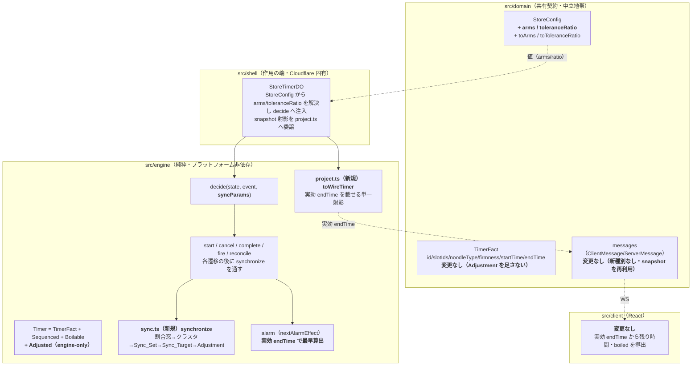
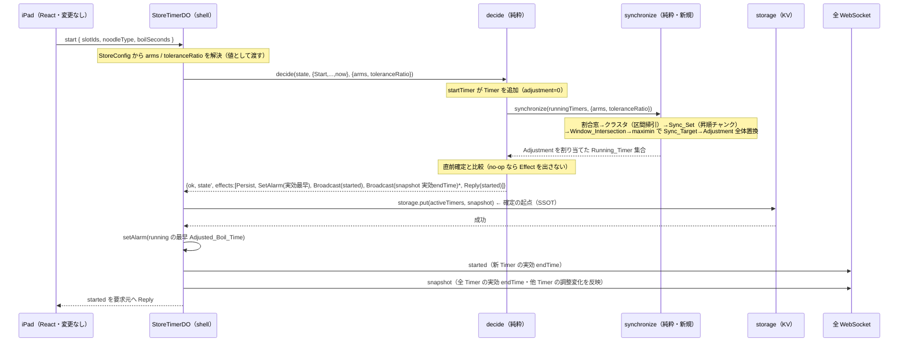
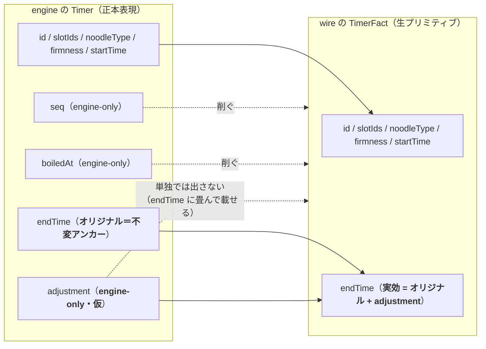

# 技術設計書 — 近接同時茹で上がり調整（synchronized-boil-adjustment / Boil_Sync）

## この設計が拠って立つもの

本設計は `requirements.md`（全8要件・EARS記法・確定済み）を正本とし、ステアリング（`design-philosophy.md` / `timer-model.md` / `naming.md` / `tooling.md`）と既存の中核設計（`.kiro/specs/yude-men-timer/design.md`）を前提とする。設計判断はすべてこの三者から演繹される。

本機能の骨格は、既存設計の申し送り（`timer-model.md`「近接茹で上がりの終了調整」）が予期していたとおり、**engine に新しい純粋変換を一つ足すだけ**に収める。すなわち:

1. **計算と作用の分離を崩さない。** 同期計算（Proximity_Cluster → Sync_Set → Sync_Target → Adjustment）は engine の `decide` 配下の純粋関数として閉じる。`storage.put` / `broadcast` / `setAlarm` は従来どおり shell が Effect として実行する。
2. **engine は純粋なまま。** 同期計算は `cloudflare:workers` にも storage にも設定オブジェクトにも依存しない。調整パラメータ（arms・Tolerance_Ratio）は shell が `StoreConfig` から解決し、値（ただの数値）として engine へ渡す（`boilSeconds` を Adjust に載せるのと同じ規律）。
3. **共有契約 `TimerFact` を god type にしない。** Adjustment は `seq`・`boiledAt` と同種の **engine 専用（engine-only）の関心事**であり、`domain/timer.ts` にも wire にも client にも露出しない。engine の `Timer` へ合成で足すだけにとどめる。
4. **表現境界（射影）は残る。** engine の `Timer → TimerFact` 射影は、`seq`・`boiledAt` を削ぐのと同じ境界で **実効 `endTime`（Adjusted_Boil_Time）** を載せる。client は調整の存在を知らず、受け取った `endTime` から残り時間を今までどおり導出する（**client 変更不要**）。
5. **SSOT は永続層、確定の起点は `put` 成功のみ。** 同期結果は Persist 先頭の Effect 列で確定し、その上に Broadcast / SetAlarm が立つ。no-op のときは Persist も Broadcast もしない。

---

## Overview

### 目的

近接した複数の茹で上がりを、厨房スタッフが一度の動作でまとめて湯切り・盛り付けできるよう、共通の茹で上がり時刻へそろえる。各 Timer は「規定の茹で時間に対する割合」の範囲（許容調整窓）でだけ茹で上がり時刻を前後に調整してよい。窓が重なる Timer 群を検出し、腕の本数（arms）ずつのセットに分け、maximin 最適化で各セットの共通時刻を窓の許す範囲で離して配置する。窓に収まらないセットは同期させず規定時刻のまま残す（品質の絶対優先）。

### 設計上の中心的判断（要点）

本設計は以下の 6 つの判断で構成される。各判断は後続の該当節で詳述する。

1. **帰属（engine-only）** — Adjustment を engine 専用基底 `Adjusted`（仮）として engine の `Timer` に合成する。`domain`・wire・client には出さない（→ Data Models / Components）。
2. **永続と射影** — 永続の正本はオリジナル `endTime`（engine 内部の不変アンカー）。Adjustment は engine 専用フィールドとして**永続する（都度導出しない）**ことを推奨する（理由は Data Models で詳述）。wire には実効 `endTime = オリジナル endTime + Adjustment` を単一の射影関数で載せる。
3. **同期計算（純粋変換 `synchronize`）** — 割合窓・クラスタ形成（区間掃引）・Sync_Set 分割（昇順チャンク）・maximin による Sync_Target 決定を、engine の純粋関数一本に集約する（→ Components）。
4. **設定注入** — arms・Tolerance_Ratio を `StoreConfig` に足し、shell が値として `decide` へ渡す。engine は設定型を知らない（→ Data Models / Components）。
5. **再計算の統合** — start / cancel / boiled（発火）/ reconcile の各遷移の直後に `synchronize` を走らせ、Running_Timer 集合全体の Adjustment を全体置換する。決定的・冪等・順序非依存（→ Components / Correctness Properties）。
6. **broadcast 戦略** — 同期は全体置換ゆえ、変化時は実効 `endTime` を載せた全量 `snapshot` を追加 broadcast する（client は既存の全置換ハンドラで受ける＝**client 変更不要**）（→ Components）。

### スコープ外（design 判断として固定）

- **バッチ membership の最適化** — どの Timer を同一 Sync_Set にまとめるかは、オリジナル `endTime` 昇順チャンク（先頭から arms 本ずつ）で固定する。membership 自体を最適化対象にすることは将来検討とし、本設計では扱わない（要件2 の申し送りどおり）。
- **client への調整パラメータ配信** — arms・Tolerance_Ratio は client へ送らない（client は実効 `endTime` だけで足りる）。理由は Components「client 変更不要の担保」を参照。

---

## Architecture

### 本機能が触る層と触らない層



**変更する箇所（最小）:**

- `src/domain/store.ts` — `StoreConfig` に `arms` / `toleranceRatio` を追加し、検証関数 `toArms` / `toToleranceRatio` を足す。
- `src/engine/timer.ts` — engine 専用基底 `Adjusted`（仮）を定義し `Timer` へ合成、`createTimer` に `adjustment` を追加。
- `src/engine/sync.ts`（新規） — 純粋変換 `synchronize`（同期計算の全体）。
- `src/engine/project.ts`（新規） — `Timer → TimerFact` の単一射影 `toWireTimer`（実効 `endTime` を載せる）。既存 `start.ts` / `adjust.ts` / shell の重複した射影をここへ集約する。
- `src/engine/decide.ts` ほか各遷移 — 遷移後に `synchronize` を通し、no-op 検出のうえ Effect 列を組む。`decide` に第3引数 `syncParams` を追加。
- `src/engine/alarm.ts` / `src/engine/fire.ts` — 最早算出・発火判定を実効 `endTime` 基準へ精緻化。
- `src/engine/snapshot.ts` / `src/engine/migrate.ts` / `src/engine/types.ts` — スキーマ v6（`adjustment` 追加・欠如は 0 で移行）。
- `src/shell/store-timer-do.ts` — `StoreConfig` から arms/toleranceRatio をロード・配信対象外・`decide` へ注入、snapshot 射影を `project.ts` へ委譲。
- `config/store-config.sample.json` — `arms` / `toleranceRatio` を追記。

**変更しない箇所（不変点）:**

- `src/domain/timer.ts`（`TimerFact` の 6 フィールド）、`src/domain/messages.ts`（ワイヤ形式・新メッセージ種別を増やさない）、`src/client/**`（client は実効 `endTime` を今までどおり使うだけ）。

### データフロー（Start を例に・同期計算 → Effect → shell の作用）



### engine Timer → wire TimerFact 射影の境界



射影は `toWireTimer`（`engine/project.ts`・新規）ただ一箇所に集約する。`seq` / `boiledAt` を削ぐ既存の境界に、**`adjustment` を `endTime` へ畳む**規律を一点で足す。現状 3 箇所（`start.ts` / `adjust.ts` / shell の snapshot map）に重複していた射影をこの一関数へ寄せ、「同じ概念は一箇所」を回復する（実効 `endTime` の算出が二度書かれる余地を消す）。

---

## Components and Interfaces

> 本節は「同期計算の純粋変換 `synchronize`」「`decide` への設定注入と再計算の統合」「射影の単一化」「Alarm・発火の実効時刻化」「broadcast 戦略と client 変更不要の担保」を定める。

### 同期計算の純粋変換 `synchronize`（engine/sync.ts・新規）

同期計算の全体を engine の純粋関数一本に閉じ込める。入力は Running_Timer 集合と調整パラメータ（値）、出力は各 Running_Timer に Adjustment を割り当てた集合。副作用なし・決定的・順序非依存。

```ts
// engine/sync.ts（新規・プラットフォーム非依存）
// arms・toleranceRatio は shell が StoreConfig から解決して渡す値。engine は設定型を知らない。
export interface SyncParams {
  readonly arms: number;            // 1..10 の整数（同時に上げられる本数の上限＝1 Sync_Set の最大本数）
  readonly toleranceRatio: number;  // 1..50 の整数パーセント（許容調整割合）
}

/**
 * Running_Timer 集合に対し Adjustment を全体置換で割り当てる純粋変換（要件1〜3・7）。
 * boiled（boiledAt !== null）は入力に含めない（呼び出し側が running のみ渡す）。
 * 同一入力に対し入力の列挙順に依らず一意の結果を返す（決定的タイブレークによる）。
 */
export function synchronize(running: readonly Timer[], params: SyncParams): readonly Timer[];
```

`synchronize` の内部段階（すべて純粋関数・各段は次段の入力を作る）:

1. **半幅の算出（要件1.2 / 4.3 / 4.7）** — 各 Running_Timer i について `h_i = (endTime_i − startTime_i) × (toleranceRatio / 100)`。`endTime_i` はオリジナル（アンカー）。クランプなし。窓 `[endTime_i − h_i, endTime_i + h_i]`。
2. **Proximity_Cluster の形成（要件1.3〜1.6）** — 窓の重なり `|endTime_A − endTime_B| ≤ h_A + h_B` は、閉区間 `[endTime−h, endTime+h]` の重なりと同値。ゆえに**左端 `endTime_i − h_i` 昇順に整列し、走査で「直前までの最大右端 `max(endTime+h)` ≥ 次の左端」が成り立つ限り同一クラスタへ連結する区間マージ**で、推移閉包を正しく（かつ隣接中心のみの連結では取りこぼす連結も含めて）求める。境界一致（差がちょうど `h_A + h_B`）は「一点で接する＝重なり」として包含する（`≤` / `≥` の等号を含める・要件1.5）。O(n log n)。
3. **Sync_Set への分割（要件2.1〜2.5）** — 各クラスタをオリジナル `endTime` 昇順（同着は `seq` 昇順）に整列し、先頭から arms 本ずつチャンク化する。残余は最後のセットに 1〜arms−1 本入る。各 Running_Timer はちょうど 1 セットに属す（重複・欠落なし）。
4. **Window_Intersection と同期可能判定（要件3.1 / 3.2）** — 各 Sync_Set の `I = [Lmax, Rmin] = [max_i(endTime_i − h_i), min_i(endTime_i + h_i)]`。`Lmax ≤ Rmin` なら同期可能、さもなくば同期見送り（要件3.6：全メンバー Adjustment 0）。
5. **Sync_Target の maximin 配置（要件3.3〜3.5 / 3.7）** — 後述の「maximin 解法」で、同一クラスタ内の同期可能なセット群に対し、各 Sync_Target が自セットの `I` 内という制約下で、オリジナル `endTime` 昇順に並べた連続確定セットの Sync_Target 間隔の最小値を最大化する配置を求める。同点は決定的タイブレークで一意化。
6. **Adjustment の割り当て（要件3.7 / 4.3 / 4.5）** — 同期確定セットの各メンバー i に `Adjustment_i = Sync_Target − endTime_i`（`I ⊆ 各メンバーの窓`ゆえ必ず `|Adjustment_i| ≤ h_i`）。同期見送りセット・単独クラスタ（要件1.7）・単独メンバーセットは `Adjustment = 0`（後述のとおり単独セットは自然に 0 に落ちる）。

#### maximin 解法（1 次元・区間制約下の等間隔化）

同一クラスタ内の同期可能セット群を、オリジナル `endTime` 昇順に `S_1..S_m`、その Window_Intersection を `I_k = [L_k, R_k]` とする。求めるのは、`t_k ∈ I_k` かつ `t_1 ≤ t_2 ≤ … ≤ t_m`（時間軸上に段階配置）の下で、`min_k (t_{k+1} − t_k)` を最大化する配置。

- **最大最小間隔 g\* の探索** — 間隔下限 `g` に対する実行可能性を貪欲左詰めで判定する: `t_1 = L_1`、`t_k = max(L_k, t_{k−1} + g)`、いずれかで `t_k > R_k` なら実行不能。`g` について単調（大きいほど不能に向かう）ゆえ、`g ∈ [0, (R_max − L_min)/(m−1)]` を**整数スケール上で二分探索**して最大の実行可能 `g\*` を得る。`m = 1` は間隔が存在せず g\* 探索を行わない（下記タイブレークで一意配置）。計算量 O(n log(range))。
- **決定的タイブレーク（一意化・要件3.5）** — g\* 固定下で実行可能な配置は一般に複数ある。各セットの**自然目標** `m_k = (L_k + R_k)/2`（Window_Intersection の中点）への二乗偏差和 `Σ_k (t_k − m_k)²` を、制約 `t_k ∈ I_k, t_{k+1} − t_k ≥ g\*` の下で最小化する配置を選ぶ。目的が狭義凸・実行可能域が凸ゆえ**最小解は一意**。変数変換 `u_k = t_k − k·g\*` で間隔制約が単調制約 `u_{k+1} ≥ u_k` に化けるため、箱制約付き単調回帰（pool-adjacent-violators 系）で O(n log n)。入力を正準順序（オリジナル `endTime`, `seq`）に整列してから解くので**列挙順に依存しない**。
- **単独セット（m = 1、または全メンバー 1 本のセット）** — 自然目標 `m_1 = (L_1 + R_1)/2` に配置する。Window_Intersection は全メンバーの窓の積ゆえ、この中点は必ず各メンバーの窓内（`|Adjustment| ≤ h_i`）。**単独メンバーのセットでは `I` が当該メンバー自身の窓に等しく、中点 = オリジナル `endTime` となり Adjustment は 0 に落ちる**（要件1.7 が特別扱いなしで自然に満たされる）。

#### 決定性のための整数演算

`h_i = (endTime_i − startTime_i) × toleranceRatio / 100` は、`toleranceRatio` を整数パーセントとするため、**すべての窓量を 100 倍したスケール整数**で扱えば `h_i × 100 = duration_i × toleranceRatio` が整数になり、クラスタ判定・Window_Intersection・maximin をすべて整数演算で行える（浮動小数の順序依存・丸め誤差を排除）。最終の Sync_Target は整数ミリ秒へ決定的に丸め（`I` 内へクランプ）て `Adjustment = Sync_Target − endTime_i`（整数ミリ秒）を得る。これにより実効 `endTime` は常に整数エポックミリ秒に保たれる。

> **設計判断（membership の固定）:** バッチ membership は「オリジナル `endTime` 昇順チャンク」に固定する（要件2 の申し送り）。membership を最適化対象に含める余地は将来検討とし、`synchronize` の段階3を差し替え可能な純粋関数として切り出すことで、後日の拡張を配線レベルに閉じ込める。

### `decide` への設定注入と再計算の統合

`synchronize` は Running_Timer 集合変化のたびに走らせる。集合を変える遷移は start / cancel / complete / fire（発火）/ reconcile。既存の各遷移関数は「基底の集合変更 → Effect 列組み立て」を行うが、ここへ **「集合変更 → `synchronize` で Adjustment 全体置換 → Effect 列」** の一段を差し込む。

**設定の注入（engine を純粋に保つ）:** `decide` の署名に第3引数 `syncParams: SyncParams` を足す。shell が `StoreConfig` から解決した値（`arms` と `toleranceRatio`）を渡す。engine は `StoreConfig` 型を import せず、ただの数値として受け取る（`Adjust` の `boilSeconds`、`Start` の `newTimerId` と同じ「非純粋を端へ寄せる」規律）。

```ts
// engine/decide.ts（署名変更）
export function decide(state: TimerState, event: Event, params: SyncParams): Outcome;
```

各遷移の内部は次の共通形に統一する（重複の根絶）:

```ts
// 擬似コード：遷移後の共通後処理（各遷移が呼ぶ純粋ヘルパ）
function settle(prev: TimerState, moved: TimerState, params: SyncParams, trigger: ServerMessage | null, now, replyTo): Outcome {
  // 1. running のみ再同期し Adjustment を全体置換（boiled は据え置き＝発火時の調整を凍結保持）
  const running = moved.timers.filter((t) => t.boiledAt === null);
  const synced = synchronize(running, params);
  const nextTimers = mergeBoiled(moved.timers, synced); // boiled はそのまま、running は synced で置換
  const nextState = { timers: nextTimers, nextSeq: moved.nextSeq };
  // 2. no-op 検出（要件7.7）：確定結果（timers の集合＋各 adjustment＋boiledAt）が prev と同一なら Effect を出さない
  if (isSameConfirmedResult(prev, nextState)) return { ok: true, state: prev, effects: [] };
  // 3. Persist 先頭の Effect 列（SSOT 規律）。SetAlarm は実効 endTime の最早。
  //    Broadcast は trigger（started/cancelled/... の意味論）＋実効 endTime を載せた全量 snapshot。
  return { ok: true, state: nextState, effects: assembleEffects(nextState, trigger, now, replyTo) };
}
```

- **Start（要件7.1）** — `startTimer` が Timer 追加（adjustment=0）→ `settle`。他 Running_Timer の実効 `endTime` も動きうるため、`started`（新 Timer）に続けて全量 `snapshot` を Broadcast する。
- **Cancel（要件7.2）** — `cancelTimer` が除去 → `settle`。`cancelled` ＋ 変化があれば `snapshot`。
- **Complete** — `completeTimer` が boiled を除去 → `settle`。`completed` ＋ 変化があれば `snapshot`。
- **AlarmFired / Reconcile（発火・要件7.3 / 4.4）** — `fireDueTimers` が **実効 `endTime`（オリジナル + adjustment）≤ now + ε** の running を boiled へ遷移（除外）→ 残り running を `settle` で再同期。`boiled` 通知（新規 boiled 分）＋ 変化があれば `snapshot`。
- **Adjust（茹で加減変更）** — 既存 `adjustTimer` が対象のオリジナル `endTime`（アンカー）を引き直す。これは Running_Timer 集合の窓を変えるため、続けて `settle` で全体再同期する（本機能により `adjust.ts` も `settle` を通すよう統合する）。

> **なぜ boiled を再同期しないか（真の担保）:** boiled は発火済みの事実であり、発火は実効 `endTime` 基準で確定した。boiled の Adjustment を再計算すると「いつ茹で上がったか」という過去の事実が動いてしまう。ゆえに `synchronize` の対象は running のみとし、boiled は発火時点の Adjustment を凍結保持する（この保持のためにも Adjustment の永続が必要＝Data Models で詳述）。

### 射影の単一化（engine/project.ts・新規）

現状 `Timer → TimerFact` の射影は `start.ts`・`adjust.ts`・shell の snapshot map の 3 箇所に重複する。本機能はここに「実効 `endTime` を載せる」規律を足す必要があるため、**単一の射影関数へ集約する**（二度書けば二つの真実になる）。

```ts
// engine/project.ts（新規）
/** engine の Timer を wire の TimerFact へ射影する唯一の関数。
 *  seq / boiledAt / adjustment を削ぎ、endTime に実効値（オリジナル + adjustment）を載せる。 */
export function toWireTimer(timer: Timer): TimerFact {
  return {
    id: timer.id,
    slotIds: timer.slotIds,
    noodleType: timer.noodleType,
    firmness: timer.firmness,
    startTime: timer.startTime,
    endTime: adjustedEndTime(timer), // = (timer.endTime + timer.adjustment)
  };
}

/** 実効茹で上がり時刻（Adjusted_Boil_Time）。オリジナル endTime に Adjustment を載せた事実。 */
export function adjustedEndTime(timer: Timer): EpochMillis {
  return (timer.endTime + timer.adjustment) as EpochMillis;
}
```

`start.ts`・`adjust.ts`・shell の snapshot 射影はこの関数を import して用いる（各所のローカル `toWireTimer` を撤去）。

### Alarm・発火の実効時刻化

- **`alarm.ts`（`earliestEndTime` / `nextAlarmEffect`）** — 最早算出を **実効 `endTime`（`adjustedEndTime`）** で行う。running のうち実効最早を採り、同着は `seq` 昇順（既存の全順序規律を保つ）。Alarm は running の最早 Adjusted_Boil_Time に張る（要件4.4 / 既存「Alarm は走行中の最早にのみ」の規律を実効時刻へ精緻化）。
- **`fire.ts`（`fireDueTimers`）** — due 判定を `adjustedEndTime(t) ≤ now + ε` へ精緻化。ε 一括ドレインの不変条件（残存最早が必ず `now + ε` より未来）は実効 `endTime` 上で保たれる。boiled 遷移後、残り running を `synchronize` で再同期する。

> **注（発火の凍結と再同期の順序）:** 実効 `endTime` で due になった timer を先に boiled へ写し（Adjustment 凍結）、その**後**に残り running を再同期する。これにより、発火した timer の Adjustment は動かさず、残りだけが新しい配置へ寄る（要件7.3）。

### broadcast 戦略と「client 変更不要」の担保

同期は Running_Timer 集合**全体**の実効 `endTime` を動かしうる。従来の per-timer メッセージ（`started` は新 Timer 1 件だけ）では他 Timer の変化を伝えられない。そこで:

- **全量 `snapshot` を追加 broadcast する。** 実効 `endTime` を載せた全 Timer の `snapshot`（既存 `ServerMessage.snapshot`）を、確定結果が変化したとき Persist 成功後に全 WS へ流す。client は既存の `case "snapshot"`（server-confirmed の全置換）でそのまま受ける。**新メッセージ種別を増やさない・client を変更しない。**
- **意味論メッセージは保持する。** `started` / `cancelled` / `completed` / `boiled` / `adjusted` は、client 側の副作用（`completed` の直前結果表示・`started` の直前結果解除・アラート重複抑止）を担うため従来どおり送る。実効 `endTime` の全体反映は後続の `snapshot` が担う（Persist → 意味論 Broadcast → snapshot Broadcast → Reply の順）。
- **client が調整を意識しない根拠。** client は `endTime`（実効値）から `remaining = endTime − now` と boiled（`endTime ≤ now`）を導出する既存経路のみを使う。Adjustment 概念も arms/Tolerance_Ratio も client に存在しない。ゆえに arms・Tolerance_Ratio は `config` メッセージにも載せない（要件6.5 の「client からは変更不可」は、そもそも client へ配信しないことで自明に満たす）。

### StoreConfig の拡張と設定ロード（shell）

- **`StoreConfig` に `arms` / `toleranceRatio` を追加**（`domain/store.ts`）。検証関数 `toArms` / `toToleranceRatio` を足し、不正値は**当該パラメータのみ**既定へ畳む（要件6.4：他の妥当なパラメータは保持）。
- **shell（`store-timer-do.ts`）** — `ensureConfigLoaded` が env シード（`STORE_ARMS` / `STORE_TOLERANCE_RATIO`）または永続値から `arms` / `toleranceRatio` を確立し、`this.arms` / `this.toleranceRatio` に保持する（`unitCount` / `noodlePresets` と同じ系統）。`applyStoreConfig`（PUT /admin/config）も同様に全体置換する。`decide` 呼び出し時に `{ arms: this.arms, toleranceRatio: this.toleranceRatio }` を渡す。**client への `config` 配信対象には含めない。**

---

## Data Models

> 本節は engine 専用基底 `Adjusted` の合成、Adjustment を永続する判断、スキーマ v6 と移行、`StoreConfig` 拡張と検証を定める。`TimerFact`・`ServerMessage`・`ClientMessage` は**変更しない**。

### engine 専用基底 `Adjusted`（仮）と `Timer` への合成

`timer-model.md` の三層構造に従い、Adjustment は「engine だけが使い、wire に出さない事実」ゆえ engine 専用基底として `src/engine/timer.ts` に定義し、`Timer` へ多重継承で合成する（`Sequenced` / `Boilable` と同じ場所・同じ規律）。

```ts
// engine/timer.ts（追加）
/**
 * Adjusted — engine だけが持つ「同期のための符号付き調整」（ワイヤには出ない）。
 * adjustment はオリジナル endTime に対するミリ秒オフセット（初期値 0・負=早める/正=遅らせる）。
 * 実効茹で上がり時刻 Adjusted_Boil_Time = endTime + adjustment は射影（toWireTimer）でのみ現れる。
 * seq / boiledAt と同じく engine 専用ゆえ domain には置かない（共有契約を god type にしない）。
 */
export interface Adjusted {
  readonly adjustment: number; // 符号付きミリ秒オフセット。|adjustment| ≤ h_i を synchronize が保証する。
}

export interface Timer extends TimerFact<TimerId, SlotId, NoodleType, EpochMillis>, Sequenced, Boilable, Adjusted {}
```

`createTimer` に `adjustment?: number`（省略時 0）を足す。start 時は 0 で生まれ、`synchronize` が全体置換で書き換える。

> **オリジナル `endTime` が不変アンカーである根拠:** `Timer.endTime` は常にオリジナル（規定茹で上がり時刻）を保持し、`synchronize` も発火も**これを書き換えない**。窓 `[endTime − h_i, endTime + h_i]` はこの不変アンカーと不変の `startTime` からいつでも一意に再導出でき、Adjustment を適用しても移動・伸縮しない（要件4.7）。実効値は `adjustedEndTime` の導出でのみ現れ、状態には二重に持たない。

### Adjustment を永続する判断（都度導出ではなく永続を推奨）

要件は「Adjustment を永続に持つか都度導出かは design 判断」とする。本設計は **Adjustment を engine 専用フィールドとして永続する**ことを推奨する。理由:

1. **boiled の凍結（決定的理由）** — Adjustment は双方向（負もとる）。負の Adjustment で早く茹で上がった boiled timer は、実効 `endTime`（= オリジナル + 負の Adjustment）が過去でも、オリジナル `endTime` はまだ未来でありうる。都度導出は running 集合からしか Adjustment を再現できず、boiled は running 集合に含まれないため**発火時の Adjustment を復元できない**。永続すれば boiled は発火時の実効 `endTime` を hibernate 復帰後も保持でき、client の boiled 導出（`endTime ≤ now`）が復帰後も一致する。
2. **shell 射影が engine ロジックを持たない（構造の主権）** — hydration の全量 `snapshot` 射影は shell で起きる。永続された Adjustment を読むだけなら shell は `adjustedEndTime` を呼ぶだけで済み、同期アルゴリズムを shell に持ち込まずに済む。都度導出は shell（または射影経路）が `synchronize` を再実行することを強い、計算を端へ漏らす。
3. **no-op 検出が単純（要件7.7）** — 直前確定の Adjustment と再計算結果を直接比較でき、変化なしの Persist/Broadcast 抑止が素直に書ける。

**「導出値を状態に昇格させない」との整合:** Adjustment は running については毎 `decide` で `synchronize` により**全体置換**されるため、running 集合内でドリフトしない（オリジナル `endTime` + `startTime` + params から常に再導出され上書きされる）。boiled については意図的に凍結する（過去の事実）。すなわち Adjustment は「常に再導出され上書きされる派生キャッシュ」であり、真の正本はオリジナル `endTime` / `startTime` / params に一本化されたままである。この一点（派生キャッシュの永続）は、boiled の事実保存と shell の純粋維持という善のために引き受けるトレードオフである。

> **代替案（都度導出）と不採用の理由:** Adjustment を持たず毎回 `synchronize` する案は、スキーマ追加・移行が不要という利点があるが、上記1（boiled の実効 `endTime` を hibernate 越しに復元できない）が致命的で、回避には「発火時にオリジナル `endTime` を実効値へ焼き込む（アンカーを壊す）」等の別の複雑さを呼ぶ。よって永続を採る。

### 永続スキーマ v6 と移行

```ts
// engine/types.ts
export const CURRENT_SCHEMA_VERSION = 6 as const; // v6: Timer に engine-only の adjustment を追加（欠如は 0）
```

- `ActiveTimersSnapshot.timers` の各 Timer に `adjustment` が加わる（`toSnapshot` / `fromSnapshot` はそのまま写す）。
- `migrate`（`engine/migrate.ts`）は `adjustment` 欠如（v5 以前）を **0** で埋める（`reviveAdjustment` 相当・既存の `reviveStartTime` / `reviveFirmness` と同形）。移行後に走る `reconcile` が running を再同期するため、旧データの running は正しい Adjustment へ収束する。boiled は移行時 0（＝実効 = オリジナル）となるが、旧データに調整概念は存在しなかったため後退はない。
- **Timer SSOT のキー（`activeTimers`）・単一キー put/get の形は不変**（`adjustment` フィールドが増える以外は同じ）。SQL は使わない（既存不変点）。

### StoreConfig の拡張と検証

```ts
// domain/store.ts（追加）
export const ARMS_MIN = 1;
export const ARMS_MAX = 10;
export const DEFAULT_ARMS = 2;
export const TOLERANCE_RATIO_MIN = 1;   // 整数パーセント
export const TOLERANCE_RATIO_MAX = 50;  // 整数パーセント
export const DEFAULT_TOLERANCE_RATIO = 10;

export interface StoreConfig {
  readonly unitCount: number;
  readonly noodlePresets: NonEmptyArray<NoodlePreset>;
  readonly arms: number;            // 1..10 の整数（既定 2）
  readonly toleranceRatio: number;  // 1..50 の整数パーセント（既定 10）
}

/** 任意の生値を範囲内の整数 arms へ写す。非整数・範囲外・非有限は既定 2 へ畳む（要件6.3 / 6.4）。 */
export function toArms(raw: unknown): number;
/** 任意の生値を範囲内の整数パーセント toleranceRatio へ写す。不正は既定 10 へ畳む（要件6.3 / 6.4）。 */
export function toToleranceRatio(raw: unknown): number;
```

- 各検証関数は `toUnitCount` と同形（型不一致・非整数・範囲外・非有限をすべて既定へ畳み、範囲内はクランプ）。**当該パラメータのみ**を既定へ畳み、他の妥当な設定値は保持する（要件6.4）。
- `toleranceRatio` は**整数パーセント**で保持し、engine では `toleranceRatio / 100` を割合として用いる（設定は人間可読なパーセント、計算はスケール整数）。

### config サンプルの更新（config/store-config.sample.json）

```json
{
  "unitCount": 3,
  "arms": 2,
  "toleranceRatio": 10,
  "noodlePresets": [ /* 既存のまま */ ]
}
```

`arms` / `toleranceRatio` を追記する。既存キーは不変。欠如時は shell の検証が既定（2 / 10）へ畳むため、旧サンプルでも安全に動く。

---

## Correctness Properties

*プロパティとは、システムのすべての妥当な実行にわたって成り立つべき特性・振る舞いであり、システムが「何をすべきか」を形式的に述べたものである。プロパティは人間可読な仕様と、機械で検証可能な正しさ保証との橋渡しになる。*

本機能の中核（`synchronize`）は純粋な分類・最適化ロジックであり、入力（Timer 集合・パラメータ）に対して普遍的に成り立つ不変量が豊富にある。ゆえに Property-Based Testing（fast-check）を主軸に据える。以下の各プロパティは prework の分類に基づき、冗長を統合したものである（例: 単独クラスタ 0・同期見送り 0・孤立で 0 は Property 6 に集約、窓内・目標一致は Property 2/5 に集約）。

### Property 1: 同期は Running_Timer のみに作用し boiled を凍結する

*For any* running と boiled が混在する Timer 集合について、`synchronize` は `boiledAt !== null` の各 Timer の `adjustment` を入力のまま変えず、`boiledAt === null` の Timer のみを再調整する。

**Validates: Requirements 1.1, 7.3**

### Property 2: Adjustment は許容調整窓内に収まる

*For any* 妥当な Running_Timer 集合と調整パラメータについて、同期後の各 Running_Timer i の `adjustment` は `|adjustment_i| ≤ h_i`（`h_i = (endTime_i − startTime_i) × toleranceRatio / 100`）を満たす。すなわち実効 `endTime` は必ず自身の Tolerance_Window 内にある。

**Validates: Requirements 3.3, 3.7, 4.3**

### Property 3: Proximity_Cluster は窓重なりの連結成分に一致する

*For any* Running_Timer 集合について、同一クラスタに属する任意の 2 Timer は窓の重なり（`|Δend| ≤ h_A + h_B`）の連鎖で到達可能であり、異なるクラスタに属する任意の 2 Timer はその連鎖でつながらない（クラスタ境界を跨ぐ窓の重なりが存在しない）。境界一致（差がちょうど `h_A + h_B`）は重なりとして同一クラスタに含む。

**Validates: Requirements 1.3, 1.4, 1.5, 1.6**

### Property 4: Sync_Set は Running_Timer 集合の分割である

*For any* Running_Timer 集合と `arms` について、生成される Sync_Set 群は各 Running_Timer をちょうど 1 つ含み（被覆かつ排他）、各セットの本数は `arms` 以下であり、各クラスタ内ではオリジナル `endTime` 昇順（同着 `seq` 昇順）の連続チャンクとして区切られる。

**Validates: Requirements 2.1, 2.2, 2.3, 2.4, 2.5**

### Property 5: 同期確定セットのメンバーは実効 endTime が完全一致する

*For any* 同期確定した Sync_Set について、そのすべてのメンバーの実効 `endTime`（Adjusted_Boil_Time）は完全に等しい（相互の差は 0）。

**Validates: Requirements 2.6**

### Property 6: 同期可能性とフォールバック（窓の積が空・孤立は Adjustment 0）

*For any* Sync_Set について、当該セットが同期確定するのは Window_Intersection が空でない（`max_i(endTime_i − h_i) ≤ min_i(endTime_i + h_i)`）とき、かつそのときに限る。同期可能でないセットのすべてのメンバー、および単独クラスタ・単独メンバーのセットは `adjustment = 0`（実効 `endTime` = オリジナル `endTime`）となる。

**Validates: Requirements 1.7, 3.2, 3.6, 7.4**

### Property 7: maximin 最適性（連続確定セット間隔の最小値の最大化）

*For any* 同一クラスタ内の同期可能セット群（小規模 m）について、`synchronize` が選ぶ Sync_Target 配置の「オリジナル `endTime` 昇順に並べた連続確定セットの Sync_Target 間隔の最小値」は、制約（各 Sync_Target が自セットの Window_Intersection 内）を満たすいかなる実行可能配置の同最小値以上である。

**Validates: Requirements 3.4**

### Property 8: 順序非依存（決定的タイブレークによる一意性）

*For any* Running_Timer 集合とその任意の並べ替えについて、`synchronize` の結果（各 Timer の `adjustment`）は入力の列挙順に依らず同一である。

**Validates: Requirements 3.5, 7.5**

### Property 9: 冪等性（再同期は no-op）

*For any* Running_Timer 集合について、`synchronize` を 2 回適用した結果は 1 回適用した結果に等しい（`synchronize(synchronize(S)) = synchronize(S)`）。ゆえに変化のない再計算は Effect を生まない。

**Validates: Requirements 7.5, 7.7**

### Property 10: アンカー不変と実効 endTime の射影

*For any* Running_Timer 集合について、`synchronize` の前後で各 Timer のオリジナル `endTime` と `startTime` は不変であり、そこから導出される Tolerance_Window も不変（Adjustment によって移動・伸縮しない）。さらに任意の Timer について射影の実効 `endTime` は `endTime + adjustment` に等しく、`adjustment = 0` のとき実効 `endTime` はオリジナル `endTime` に等しい。

**Validates: Requirements 4.2, 4.5, 4.7**

### Property 11: 発火は Adjusted_Boil_Time を基準にする

*For any* Running_Timer 集合と現在時刻 `now` について、発火（boiled 遷移）する Running_Timer の集合は、実効 `endTime`（`endTime + adjustment`）が `now + ε` 以下である Running_Timer の集合にちょうど一致する。

**Validates: Requirements 4.4**

### Property 12: 集合変化後の確定結果は現在の running 集合の純粋な関数である

*For any* start / cancel / boiled を含むイベント列について、適用後に確定する Running_Timer の `adjustment` の全体は、そのときの Running_Timer 集合に対する `synchronize` の結果に一致する（履歴に依存せず全体置換される）。

**Validates: Requirements 7.1, 7.2, 7.3**

### Property 13: 調整パラメータ検証はパラメータ独立に妥当域へ畳む

*For any* 生値 `x` について、`toArms(x)` は `[1, 10]` の整数、`toToleranceRatio(x)` は `[1, 50]` の整数を返す。一方のパラメータが不正でも他方の妥当な設定値は保持される（当該パラメータのみを既定へ畳む）。

**Validates: Requirements 6.3, 6.4**

### Property 14: 確定結果が変化するときのみ Persist 先頭の Effect 列を出す

*For any* 集合変化イベントについて、確定結果（Timer 集合・各 `adjustment`・`boiledAt`）が直前と異なるときの Effect 列は `Persist` を先頭に持ち（`Broadcast` / `SetAlarm` はその後）、確定結果が直前と同一のときは Effect 列が空である（put も broadcast もしない）。

**Validates: Requirements 5.2, 7.6, 7.7**

---

## Error Handling

同期機構は engine の純粋変換ゆえ、例外を投げず戻り値で全パスを表現する（既存の `Outcome` / `Rejection` 規律を踏襲）。

- **調整パラメータの不正値（要件6.4）** — shell の `toArms` / `toToleranceRatio` が境界で当該パラメータのみを既定へ畳む。engine には常に妥当域内の値だけが渡る（防御的に、engine 側 `synchronize` でも `arms < 1` を 1 相当として扱う下限ガードを一行だけ置き、二重の安全網とする）。engine は設定型を知らないため、パラメータの意味論的検証（正本）は domain の検証関数に一本化する。
- **同期不能セット（Window_Intersection が空・要件3.6）** — エラーではなく正常なフォールバック。当該セットのメンバーを `adjustment = 0` で残す。品質（窓超過をしない）の絶対優先を、拒否ではなく無調整で表現する。
- **空 running / 単独クラスタ（要件1.7 / 1.8）** — 退化ケース。空なら空を返し、単独は 0 を割り当てる。特別分岐を増やさず、maximin の単独セット処理が中点＝自 endTime に落ちることで自然に成立する。
- **Persist 失敗（要件5.3 / 7.8）** — shell の `runEffects` が Persist 失敗時に後続 Effect（Broadcast / SetAlarm）を実行せず、Working_Copy を put 前へ戻す既存規律をそのまま用いる。前回確定の Adjustment が SSOT に残り、後続の hydration / reconcile が回復する（既存の「派生作用は再構成可能」原則の帰結・新機構を足さない）。
- **一部端末への broadcast 失敗（要件5.6）** — 再接続時の全量 `snapshot`（実効 `endTime` 込み）が回収する。差分再送を持たない。
- **移行失敗との関係** — `adjustment` 欠如は 0 で埋めるため移行は失敗しない（既存 `migrate` の失敗経路 `MigrationFailed` を増やさない）。

engine の `Rejection` は本機能で新種別を増やさない（同期はコマンド拒否を生む処理ではなく、既存遷移の後段に挟まる全体置換であるため）。`Adjust` 経路の既存拒否（`TimerNotFound` / `InvalidBoilSeconds`）はそのまま。

---

## Testing Strategy

### 二層アプローチ

- **Property-Based Test（fast-check・主軸）** — 上記 Correctness Properties を検証する。中核 `synchronize` は純粋関数で入力空間が広い（本数・endTime・startTime・firmness・arms・ratio）ため PBT が最も効く。各プロパティは**単一の property test**として実装し、**最低 100 イテレーション**回す。
- **Example / Edge-case Unit Test** — 境界・退化・具体シナリオを補う。PBT で網羅する入力は unit test で重複させない（unit test を増やしすぎない）。
- **Integration Test（DO・shell・少数例）** — 外部作用（Persist 失敗時の broadcast 抑止、hydration での実効 `endTime` 反映、全端末一致）は入力で挙動が変わらないため 1〜3 例の統合テストで検証する（PBT にしない）。
- **静的検査（Smoke）** — engine が `cloudflare:workers` / storage / 時間ループ / 外部 await を持ち込まないこと（要件4.6 / 8.2 / 8.3）は既存の engine 純粋性検査に追随する。

### Property Test の設定と対応

各 property test には設計プロパティを参照するタグコメントを付す。

- タグ形式: **Feature: synchronized-boil-adjustment, Property {番号}: {プロパティ本文}**
- 最低 100 イテレーション（fast-check の既定回数以上）。
- ジェネレータの要点:
  - `startTime` と `boilDuration`（>0）から `endTime = startTime + boilDuration` を組み、running/boiled を混在させる（Property 1）。
  - `toleranceRatio` を 1..50、`arms` を 1..10 で振る。境界一致（`|Δend| = h_A + h_B`）を意図的に生む生成器を含める（Property 3 の境界・要件1.5）。
  - 非 ASCII / 空に近い noodleType 等は本機能の計算に無関係ゆえ固定してよい（計算は時刻と本数のみに依存）。
  - Property 7（maximin）は小規模クラスタ（`m ≤ 4`）に限定し、離散化した実行可能配置の総当たり（モデルベース）と最小間隔を比較する。
- Property 8（順序非依存）は `fc.shuffle` で入力順を並べ替えて結果同一を確認する。
- Property 12 は start/cancel/boiled のランダムなイベント列を `decide` に流し、確定 running の `adjustment` が `synchronize(現在の running)` と一致することを確認する。

### Example / Edge-case（PBT で扱わない具体点）

- 空 running → `synchronize` が空を返す（要件1.8）。
- `toArms(undefined) === 2`、`toToleranceRatio(undefined) === 10`（要件6.2）、`toArms(0)===2` / `toArms(11)===2` / `toArms(3.5)===2`、`toToleranceRatio(0)===10` / `toToleranceRatio(51)===10`。
- `toWireTimer` の出力が `TimerFact` の 6 フィールドのみを持ち `adjustment` を含まない（要件4.1）。
- `config` メッセージに `arms` / `toleranceRatio` が含まれない（要件5.1 / 6.5）。
- 3 本・arms=2 のクラスタが `[2 本][1 本]` に分割され、2 本セットが窓の積で同期、残余 1 本セットが maximin で離される具体例。

### Integration（DO・少数例）

- Persist 失敗を注入 → broadcast されず、SSOT が失敗前の確定 Adjustment を保持（要件5.3 / 7.8）。
- 2 端末接続 → start で同期 → 双方の hydration/snapshot が同一の実効 `endTime` を持つ（要件5.4 / 5.5）。
- 一方の broadcast を落とす → 再接続の snapshot で実効 `endTime` が一致に回復（要件5.6）。

---

## 要件トレーサビリティ

| 要件 | 受け入れ基準 | 対応する設計要素 | 検証 |
| --- | --- | --- | --- |
| 1 近接検出 | 1.1 | `synchronize` は running のみ対象・boiled 凍結 | Property 1 |
| | 1.2 | 半幅 `h_i` 算出・オリジナル endTime 中心の窓 | Property 2, 10 |
| | 1.3/1.4/1.6 | 区間掃引による連結成分（Proximity_Cluster） | Property 3 |
| | 1.5 | 境界一致を重なりに包含（`≤`/`≥`） | Property 3（境界生成器） |
| | 1.7 | 単独クラスタ → 0（maximin 単独セットが自然に 0） | Property 6 |
| | 1.8 | 空 running → 空 | Example |
| 2 分割 | 2.1〜2.5 | 昇順チャンク分割（partition・各セット ≤ arms） | Property 4 |
| | 2.6 | 確定セットの実効 endTime 完全一致 | Property 5 |
| | 2.7 | `toArms` の既定畳み込み | Property 13 |
| 3 共通時刻 | 3.1/3.2 | Window_Intersection・同期可能判定 | Property 6 |
| | 3.3/3.7 | Adjustment = Target − endTime・窓内 | Property 2, 5 |
| | 3.4 | maximin 二分探索＋貪欲実行可能性 | Property 7 |
| | 3.5 | 二乗偏差最小・整数演算による一意タイブレーク | Property 8 |
| | 3.6 | 窓の積が空 → 全メンバー 0（フォールバック） | Property 6 |
| 4 engine 帰属・射影 | 4.1 | `Adjusted`（engine-only）・射影で削ぐ | Example（型） |
| | 4.2/4.5 | `toWireTimer` が実効 endTime を載せる | Property 10 |
| | 4.3 | `|adjustment_i| ≤ h_i` | Property 2 |
| | 4.4 | 実効時刻基準の boiled 遷移 | Property 11 |
| | 4.6 | 純粋変換・作用は端 | Smoke（純粋性検査） |
| | 4.7 | 不変アンカーから窓を再導出 | Property 10 |
| 5 サーバ計算・反映 | 5.1 | サーバ計算・client へ調整概念を配信しない | Example |
| | 5.2 | Persist 先頭の Effect 列 | Property 14 |
| | 5.3/5.4/5.5/5.6 | shell の Persist 規律・全量 snapshot・hydration | Integration |
| 6 設定 | 6.1/6.2 | `StoreConfig.arms/toleranceRatio`・既定 2/10 | Example |
| | 6.3/6.4 | `toArms`/`toToleranceRatio` の域内・独立畳み込み | Property 13 |
| | 6.5 | client へ非配信ゆえ変更不可 | Example |
| 7 再計算 | 7.1/7.2/7.3 | 各遷移後に `settle`＝全体置換 | Property 12 |
| | 7.4 | 孤立で 0 復帰 | Property 6, 12 |
| | 7.5 | 順序非依存・冪等 | Property 8, 9 |
| | 7.6/7.7 | 変化時のみ Persist→Broadcast・no-op 抑止 | Property 14 |
| | 7.8 | Persist 失敗時の保持・回復 | Integration |
| 8 計算量・頻度 | 8.1 | running 上限（設計前提） | — |
| | 8.2/8.3 | 離散イベント時のみ・1 decide 内完結 | Smoke |
| | 8.4 | 区間掃引 O(n log n)・maximin 二分探索＋単調回帰 | 性能 Smoke（任意） |

---

## 命名確認事項（naming.md：公開シンボルは実装前にユーザー確認）

以下は概念境界を表明する公開シンボルであり、`naming.md` に従い実装前にユーザー確認を要する。要件では仮の概念名だったものに対する実装シンボル名の候補を示す。ドメイン語彙優先・汎用語（Manager/Handler/Service 等）は用いない。

| 概念（要件の仮名） | 候補シンボル名 | 種別・場所 | 表明する境界 |
| --- | --- | --- | --- |
| Adjustment（engine-only 調整） | `Adjusted { adjustment }` | engine 専用基底＋状態フィールド（`engine/timer.ts`） | 「同期のための符号付きオフセット。wire に出ない engine 専用事実」 |
| Boil_Sync（同期計算全体） | `synchronize` | 公開関数（`engine/sync.ts`・新規モジュール） | 「running 集合に Adjustment を全体置換で割り当てる純粋変換」 |
| 調整パラメータ | `SyncParams { arms; toleranceRatio }` | 型（`engine/sync.ts`） | 「engine へ値として渡す調整設定（engine は StoreConfig を知らない）」 |
| Adjusted_Boil_Time | `adjustedEndTime` | 公開関数（`engine/project.ts`・新規） | 「実効茹で上がり時刻 = endTime + adjustment の導出」 |
| Timer→TimerFact 射影 | `toWireTimer` | 公開関数（`engine/project.ts`へ集約） | 「seq/boiledAt/adjustment を削ぎ実効 endTime を載せる単一射影」 |
| arms（腕の本数） | `arms` | `StoreConfig` フィールド・定数 `ARMS_MIN/ARMS_MAX/DEFAULT_ARMS` | 「同時に上げられる本数の上限＝1 Sync_Set の最大本数」 |
| Tolerance_Ratio（許容調整割合） | `toleranceRatio`（整数%） | `StoreConfig` フィールド・定数 `TOLERANCE_RATIO_MIN/MAX/DEFAULT_TOLERANCE_RATIO` | 「茹で時間に対する許容調整割合（サーバ権威）」 |
| 設定検証 | `toArms` / `toToleranceRatio` | 公開関数（`domain/store.ts`） | 「生値を妥当域整数へ畳む唯一の関門」 |
| env シードキー | `STORE_ARMS` / `STORE_TOLERANCE_RATIO` | env 変数名 | 「初回構築時の設定シード」 |
| `decide` の第3引数 | `decide(state, event, params: SyncParams)` | 公開関数の署名変更 | 「調整設定を値として engine へ注入する口」 |

**確認を要する設計判断（併せてユーザー承認を仰ぐ）:**

1. **Adjustment を永続する**（都度導出しない）。スキーマ v6・欠如は 0 で移行。理由は Data Models 参照。
2. **タイブレーク規律**＝ maximin 最適間隔 `g*` 固定下で「各セットの Window_Intersection 中点への二乗偏差和を最小化する一意配置」（整数演算・順序非依存）。より単純な代替（中点クランプ＋前後決定的パス）も可能。どちらを採るか確認。
3. **broadcast 戦略**＝意味論メッセージ（started 等）に加え、確定変化時に実効 endTime を載せた全量 `snapshot` を追加 broadcast（新メッセージ種別を増やさず client 無変更）。
4. **バッチ membership は昇順チャンク固定**（最適化対象化は将来）。
5. **arms/toleranceRatio を client へ配信しない**（実効 endTime のみで足りるため。要件6.5 は非配信で自明に充足）。

---

## 既存中核設計との整合（骨格に純粋変換を一つ足すだけ）

本設計は `yude-men-timer/design.md` の骨格をそのまま保つ:

- **decide / Effect / Snapshot** — 唯一の状態遷移 `decide`、Persist 先頭の Effect 列、単一キー Snapshot は不変。`synchronize` は各遷移の後段に挟まる純粋関数で、Effect の組み立て規律（Persist→SetAlarm→Broadcast→Reply）を変えない。
- **射影境界** — `seq`/`boiledAt` を削ぐ表現境界に「実効 endTime を載せる」を一点で足すだけ（`toWireTimer` へ集約）。
- **hibernation 規律** — 同期は離散イベント（start/cancel/boiled/reconcile）の `decide` 内で完結し、`setInterval`/`waitUntil`/外部 await を持ち込まない。「待つなら寝かせる、抱えると漏れる」を守る。
- **構造の主権** — engine は `StoreConfig` を知らず値だけを受け取る。Cloudflare 固有依存は shell に隔離されたまま。

「角度を変える手続き」は現れない。新しいのは engine 内の純粋変換 `synchronize` と、単一化された射影 `toWireTimer` だけである。
