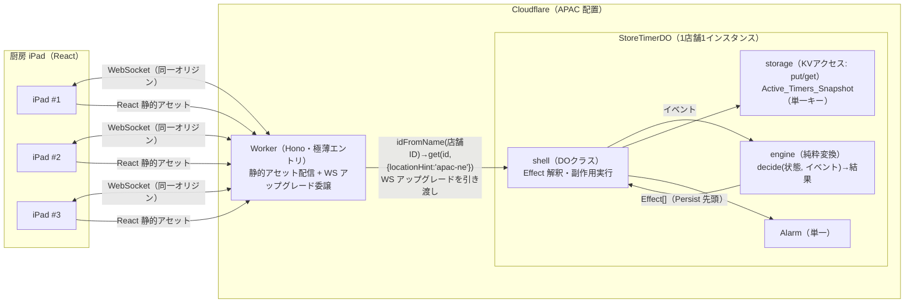
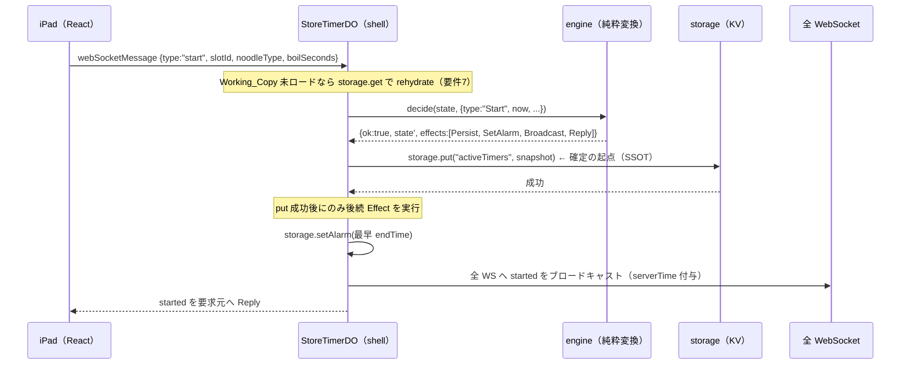
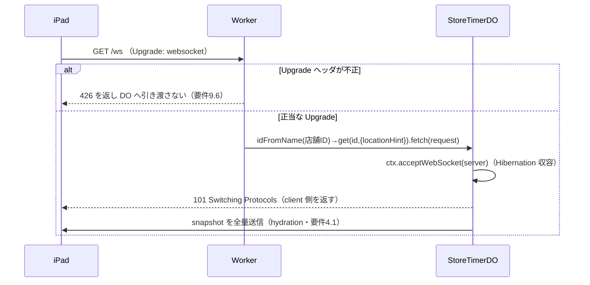

# 技術設計書 — ゆで麺タイマー（yude-men-timer）

## この設計が拠って立つもの

本設計は `requirements.md`（全12要件・EARS記法）と、ステアリング `design-philosophy.md`（真善美は一つの判断 / 計算と作用の分離 / 導出値を状態に昇格させない / SSOTは永続層 / FRPの思想は採るが機械は持ち込まない）を前提とする。設計判断はすべてこの二つから演繹される。

哲学を構造へ翻訳した骨格は次の6点である。本設計の全節はこの骨格の展開にすぎない。

1. **計算と作用の分離（engine / shell）** — DO の業務ロジックを純粋関数 `decide(状態, イベント) → 結果（新しい状態 + 実行すべき作用の記述[]）` に還元する。engine は `put` / `broadcast` / `setAlarm` を一切呼ばない。何が起きるべきかを Effect のデータとして返すだけ。薄い shell（DO クラス）が返された Effect を解釈して副作用を実行する。
2. **導出値を状態に昇格させない** — 残り秒は状態として持たない。状態は `endTime`（絶対時刻＝事実）のみ。`remaining = endTime - now` はクライアントの導出。
3. **不正状態を構築不能にする** — `endTime` を持たない Timer、Slot に属さない Timer は型として構築できない（smart constructor とブランド型）。バリデーションで弾く前に、構築不能にする。
4. **永続層が SSOT、確定の起点は `storage.put` 成功のみ** — broadcast も発火も put 成功の上にのみ立つ。engine が返す Effect 列は常に `Persist` を先頭に置き、shell は Persist 成功後にのみ後続の `Broadcast` / `SetAlarm` を実行する。
5. **ストリームライブラリを engine に持ち込まない** — 純粋変換と導出値はただの関数として書く。RxJS 等は engine に入れない。
6. **構造の主権（PoA / PoR 分離）** — DO 固有の調整機構（Alarm / WS Hibernation / storage）への依存は shell に隔離し、engine は他基盤へ運べる純粋関数に保つ。

---

## Overview

### 目的

ラーメン店厨房向け「ゆで麺タイマー」のパイロット。麺を茹で始めるとタイマーが茹で時間をカウントダウンし、茹で上がり時刻に通知を発火する。本パイロットの主眼は、店舗内の複数 iPad（2〜3台）が同一のタイマー状態をリアルタイムに共有することにある。クライアントのローカル状態だけでは複数デバイス共有が成立しないため、サーバ側（Cloudflare Durable Object）に状態の単一の正本（SSOT）を置く。

### 検証観点

本パイロットが検証する Cloudflare Durable Objects の挙動は次の4点である。

- **WebSocket Hibernation** による省コスト常時接続（アイドル時に課金されない接続保持）
- **Alarm API** による hibernate 中でも確実なタイマー発火
- **再接続時の状態同期（Hydration）** — 切断・再接続で全量スナップショットに追いつく
- **hibernate 復帰時の状態復元（Rehydrate）** — メモリ揮発後に永続層から作業コピーを再構築

### スコープ外

マルチテナント、調理順最適化、分析基盤連携、オフライン耐性の作り込み、認証認可、POS 連携は本 spec のスコープ外。対象は 1 テナント・1 店舗のみ。

> **セキュリティ注記:** 本パイロットは認証・認可をスコープ外とする。WebSocket エンドポイントは無認証で公開される前提である。店舗識別子のみでルーティングするため、識別子を知る第三者が接続しうる。パイロット環境（限定ネットワーク・短期検証）に閉じる運用前提であり、本番化時には認証層の追加が必須であることを明記する。

---

## Architecture

### コンポーネント構成



- **Worker（Hono）** — 極薄のエントリポイント。`GET` の WebSocket アップグレード要求を検証し、店舗識別子で対象 DO を引いて引き渡す。配置を APAC（日本向けは `apac-ne`）に寄せるため、名前引きは `getByName` ではなく `namespace.idFromName(店舗ID)` → `namespace.get(id, { locationHint: "apac-ne" })` の二段で行う（`getByName` は `locationHint` を受け取れないため。後述「確認した Cloudflare API 仕様」）。React 静的アセットも同一 Worker（Workers Static Assets）から同一オリジンで配信し、CORS を回避する。業務ロジックは持たない。
- **StoreTimerDO** — 1店舗1インスタンス。状態の正本を保持し、WebSocket 収容・Alarm 発火・永続化を担う。内部に HTTP ルーターフレームワーク（Hono 等）を持ち込まない。入口は RPC メソッドまたは最小限の `fetch` 分岐のみ。
  - **shell** — DO クラス本体。Hibernation ハンドラ（`fetch` / `webSocketMessage` / `webSocketClose`）と `alarm()` を実装し、engine を呼び、返された Effect を順に実行する作用の端。
  - **engine** — 純粋変換。プラットフォーム API を一切知らない。`cloudflare:workers` にも storage にも依存しない、ただの関数群。
- **iPad_Client（React）** — サーバ状態を映す表示。残り秒読みのみローカル計算する。

### データフロー（タイマー開始の例）



### WebSocket 確立とメッセージ経路



### 確認した Cloudflare API 仕様（出典付き）

記憶ベースで断定せず、以下は公式ドキュメントで確認した事実である。未確認事項は本節末尾と各設計節に「要実装時確認」として明示する。

- **WebSocket Hibernation API**（[Use WebSockets](https://developers.cloudflare.com/durable-objects/best-practices/websockets/) で確認）
  - `this.ctx.acceptWebSocket(server)` で server 側接続を受理すると hibernate 可能になる。`ws.accept()` 方式（`addEventListener`）は hibernate しない。
  - ハンドラはクラスメソッド `webSocketMessage(ws, message)` / `webSocketClose(ws, code, reason, wasClean)` /（任意で）`webSocketError(ws, error)`。
  - `this.ctx.getWebSockets()` が受理済み WebSocket の配列を返す。
  - `ws.serializeAttachment(value)` / `ws.deserializeAttachment()` で接続ごとの状態を hibernate 越しに保持できる。**最大 16,384 バイト**、structured clone 可能な型。接続が閉じると失われる。
  - hibernate からの復帰時、イベント配送前に **constructor が再実行される**。constructor の処理は最小に保つ。
  - import 形は `import { DurableObject } from "cloudflare:workers"`、`constructor(ctx, env)` で `super(ctx, env)`。
- **Alarm API**（[Alarms](https://developers.cloudflare.com/durable-objects/api/alarms/) および [Rules of Durable Objects](https://developers.cloudflare.com/durable-objects/best-practices/rules-of-durable-objects/) で確認）
  - DO は同時に **1つの Alarm** のみ保持。`ctx.storage.setAlarm(scheduledTime: Date | number)` / `getAlarm(): Promise<number | null>` / `deleteAlarm()`。`setAlarm` は millisecond precision。
  - **at-least-once 実行**。`alarm()` ハンドラが未捕捉例外で throw すると指数バックオフ（初回2秒・最大6回）で自動リトライ。リトライは直近の `setAlarm` に対してのみ。
  - **公式が明示する挙動は「まれに複数回発火しうる（alarms may fire more than once）→ハンドラを冪等に保て」**である。「予定時刻より早く発火する（early firing）」という記述は公式ドキュメントに確認できなかった。また**発火遅延の上限を保証する公式記述は無い**（「数ミリ秒後に実行されるのが通常」とされるが上限は非保証）。したがって本設計が前提にすべき真のリスクは早すぎ発火ではなく、**多重発火（at-least-once）と発火遅延**である。
  - `alarm(alarmInfo)` の `alarmInfo` は `{ retryCount, isRetry }`。リトライ枯渇前に処理が残る場合の公式推奨は「throw でリトライに委ねず、`setAlarm(Date.now() + 30s)` 等で新規 Alarm を張り直す」パターン（`retryCount` が上限近傍のとき採る）。
  - `setAlarm()` を **`Date.now()` 以前の時刻**で呼ぶと「即時の非同期実行」としてスケジュールされる（要件2.10/3 の即時再発火に対応）。
- **Storage KV アクセス API**（[Rules of Durable Objects](https://developers.cloudflare.com/durable-objects/best-practices/rules-of-durable-objects/) および [SQLite GA Changelog](https://developers.cloudflare.com/changelog/post/2025-04-07-sqlite-in-durable-objects-ga/) で確認）
  - 公式は新規 DO に **SQLite ストレージバックエンド**（Wrangler の `new_sqlite_classes`）を推奨し、かつ「**SQLite Durable Objects も KV API（同期・非同期）をサポートする**」と明記する。すなわち SQLite バックエンドのまま `ctx.storage.put`/`get`（非同期 KV API）を使え、SQL API（`ctx.storage.sql`）は使わずに済む（後述「永続化設計」のバックエンド確定を参照）。
  - 非同期 KV: `ctx.storage.put(key, value)` / `get(key)` / `delete(key)` / `list(options)`。値は structured clone 可能な型。
  - `put()` は書き込みバッファへ書き、ディスクへは非同期フラッシュ。**書き込み確定を保証したい場合は返り値 Promise を `await` する**（本設計の SSOT 規律で必須）。
  - **Output gate**: 既定では、保留中の storage 書き込みがディスクへ確定するまで DO からの外向きネットワークメッセージ（レスポンス・fetch 等）が保留され、永続化されていないデータの確認をクライアントに見せない（`allowUnconfirmed` で opt-out 可能だが本設計では使わない）。また await を挟まない複数書き込みは **write coalescing** で単一の atomic なトランザクションにまとめられる。
- **`blockConcurrencyWhile`**（[In-memory state](https://developers.cloudflare.com/durable-objects/reference/in-memory-state/) で確認）
  - `ctx.blockConcurrencyWhile(async () => { /* 初期化 */ })` は初期化完了まで後続イベント配送を止める。constructor 内の rehydrate を囲うのに用いる（要件7.3）。
- **配置（APAC 固定）**（[Data location](https://developers.cloudflare.com/durable-objects/reference/data-location/) と [apac-ne/apac-se 追加の Changelog](https://developers.cloudflare.com/changelog/post/2026-06-19-apac-ne-apac-se-location-hints/) で確認）
  - 配置は `locationHint` で示唆する。日本向けは `apac-ne`（Northeast Asia-Pacific＝日本・韓国）が `apac` より適切（2026-06 追加）。`locationHint` は **DO 初回作成時の配置にのみ**影響し、かつベストエフォート（指定どおりの DC に必ず置かれる保証はなく、近傍 DC に配置される）。
  - `locationHint` を渡すには `namespace.get(id, { locationHint })` を用いる。**`getByName(name)` は `locationHint` を受け取れない**ため、配置を指定する本設計では `namespace.idFromName(name)` で ID を得てから `namespace.get(id, { locationHint: "apac-ne" })` で stub を引く（公式の推奨配線。`getByName` は `idFromName` + `get` を束ねる便利 API だが配置指定の口が無い）。
  - `ctx.id.name` で DO 内から自身の名前（店舗ID）を参照できる（2026-03 追加）。`alarm()` ハンドラには呼び出し元のリクエストが無いため、店舗 ID を参照する手段としてこれが有用。

**要実装時確認の項目（断定しない）:**

- **Alarm の発火遅延の実測と多重発火の冪等性確認**: 公式が明示するのは「まれに複数回発火しうる」と「遅延上限は非保証」であり、「早すぎ発火」は文書化されていない。要件2.7 の「30 秒以内」は公式の保証ではない努力目標であり、実際の発火遅延の分布と多重発火時の冪等性をパイロットで実測確認する。本設計の ε は早すぎ発火の吸収ではなく、**多重・境界付近発火に対する冪等な一括処理＋クロック境界の安全網**として機能する（後述「ε 許容窓」）。

---

## Components and Interfaces

> 本節（コンポーネントとインターフェース）は、続く「engine / shell の境界」と「純粋変換関数の一覧」として詳述する。前者が DO 内部の責務分割（shell の Effect インタプリタと engine の純粋変換）とその型シグネチャ・PoA/PoR 分離を、後者が engine を構成する各純粋関数の責務と入出力（Effect）を定める。

## engine / shell の境界

本設計の中核。哲学「計算と作用の分離」「変換は何が起きるべきかを語り、shell がそれを起こす」をそのまま型にする。

### 純粋変換の型シグネチャ

engine は次の単一の形に還元される。状態とイベントを受け取り、新しい状態と「実行すべき作用の記述」を返す。**engine は副作用を一切持たない。**

```ts
// engine/decide.ts — プラットフォーム非依存。cloudflare:workers にも storage にも触れない。

/** 純粋変換の結果。成功なら新状態と Effect 列、失敗なら拒否理由。 */
export type Outcome =
  | { readonly ok: true; readonly state: TimerState; readonly effects: readonly Effect[] }
  | { readonly ok: false; readonly rejection: Rejection };

/** 唯一の状態遷移関数。(現在の状態, イベント) → 結果。 */
export function decide(state: TimerState, event: Event): Outcome;
```

### Effect — 実行すべき作用のデータ記述

engine は副作用を起こさず、「起こすべきこと」をデータで返す。順序が意味を持つ。**engine は常に `Persist` を Effect 列の先頭に置く。**

```ts
// engine/effect.ts
export type Effect =
  | { readonly type: "Persist"; readonly snapshot: ActiveTimersSnapshot } // storage.put（確定の起点）
  | { readonly type: "SetAlarm"; readonly at: EpochMillis }               // storage.setAlarm
  | { readonly type: "ClearAlarm" }                                       // storage.deleteAlarm
  | { readonly type: "Broadcast"; readonly message: ServerMessage }       // 接続中の全 WS へ
  | { readonly type: "Reply"; readonly message: ServerMessage };          // 要求元の WS へ
```

### shell が Effect を実行する順序と SSOT 保証

shell は engine が返した Effect 列を**先頭から順に**実行する。SSOT 規律はこの実行規則に宿る。

```ts
// shell（DOクラス）内の Effect インタプリタ（擬似コード）
async function runEffects(effects: readonly Effect[]): Promise<RunResult> {
  for (const effect of effects) {
    if (effect.type === "Persist") {
      // 確定の起点。await で書き込み完了を保証してから後続へ進む。
      try {
        await this.ctx.storage.put(SNAPSHOT_KEY, effect.snapshot);
      } catch (e) {
        // put 失敗 = 何も確定していない。後続 Effect（Broadcast/SetAlarm）を実行しない。
        // Working_Copy も put 前の状態へ戻す（メモリへの代入は永続化ではない）。
        return { persisted: false };
      }
    } else {
      // Persist より後でのみ到達する。put 成功の上に broadcast / alarm が立つ。
      this.applySideEffect(effect); // SetAlarm/ClearAlarm/Broadcast/Reply
    }
  }
  return { persisted: true };
}
```

この構造が哲学の二つの規律を同時に満たす。

- **「メモリへの代入は永続化ではない」** — shell は engine が返した `state` を、`Persist` が成功して初めて Working_Copy へ確定反映する。put 成功前に新状態を真実として扱わない。
- **「put 成功の前に外部へ真実を主張しない」** — Effect 列で `Persist` が必ず `Broadcast` / `SetAlarm` より前にあり、put 失敗時は後続を実行しないため、永続が確定していない状態を外部（WS クライアント・Alarm）へ漏らさない。

> **なぜ Effect 列で順序を表現するのか（理由コメント相当）:** engine が「Persist 先頭」の不変条件を持つことで、SSOT の規律が engine の純粋なデータ構造に刻まれ、shell は機械的に順に実行するだけでよい。順序判断のロジックが shell に散らばらない（「角度を変える手続きがない」）。

### Persist 成功後の Effect 部分実行・中断に対する回収原則

`runEffects` は Effect 列 `[Persist, SetAlarm, Broadcast, …]` を先頭から順に実行するため、Persist 成功 → SetAlarm 成功 → Broadcast 実行前にプロセスがクラッシュする、という**部分実行**がありうる。このとき永続済み状態（SSOT）は正しく確定しているが、Alarm は張られ Broadcast は飛んでいない、という中途状態がメモリの外に残る。本設計はこの状況に対し回収原則を一つ置く。これは新しい仕組みではなく、設計哲学「永続層が SSOT・確定の起点は `put` 成功のみ」の自然な帰結にすぎない。

**Persist が確定の起点であり、Persist 成功後に発行される副作用 Effect（SetAlarm / Broadcast / ClearAlarm / Reply）は、永続済み状態から再構成可能な「派生作用」にすぎない。** したがって Persist 成功後に Effect 列が部分実行のまま中断・クラッシュしても、永続済み状態（SSOT）は正しく、失われた派生作用は次の二経路が最終的整合として回収する。

- **(a) Broadcast（クライアントへの状態反映）の欠落** → クライアント再接続時の全量 Hydration（要件4）が回収する。落とした `started` / `cancelled` / `done` の通知は、再接続で全量スナップショットを受け取れば表示が正しい状態へ追いつく。送信は差分ではなく全量であるため、欠落した個別通知を再送する必要がない。
- **(b) SetAlarm / ClearAlarm（Alarm の更新）の欠落** → 次回 DO 起動時（任意のエントリポイント）の rehydrate + reconcile（要件7.1 / 7.2 / 7.7）が、永続済み状態の最早 endTime から Alarm を再導出して回収する。Alarm が張られていない／古い場合でも、次のイベントや既存 Alarm の発火で DO が起き、`reconcile` が `nextAlarmEffect` を通して Alarm を正しく張り直す。

> **「Alarm が全く張られず、次のイベントも来なければ永久に発火しないのではないか」という懸念について:** Persist 直後のクラッシュであっても、(i) その Persist より前に張られていた既存 Alarm がいずれ発火して DO を起こす、(ii) あるいは次のクライアント操作（start / cancel / WS 接続）で DO が起きる、のいずれかで `reconcile` が走り、Alarm が永続状態から再導出される。DO が初めて Timer を持った時点で Persist と SetAlarm は同じ Effect 列で実行され、以後は常に直前の Alarm が安全網として残るため、既存 Alarm が一つでもある限り DO が完全に孤立して永久に起きないケースは生じない。

この原則により、`runEffects` に分散トランザクションや二相コミットを持ち込む必要はない（YAGNI）。Persist の atomicity（`put` 成功＝確定）と、派生作用の冪等な再構成可能性（Broadcast は hydration、Alarm は reconcile）だけで最終的整合が閉じる。Alarm の再導出が永続状態から一意に定まることは **Property 3**（`nextAlarmEffect` が残存最早に一致／残存ゼロで `ClearAlarm`）と要件7.2 の `reconcile` 設計が保証し、Broadcast の回収が全量 hydration で閉じることは **Property 9**（snapshot ラウンドトリップ）が下支えする。したがって本原則に対して新たなプロパティを足す必要はない。

### PoA / PoR 分離

- **PoR（記録の権限）** — storage（KV）が状態の正本を持つ。engine は記録媒体を知らない。
- **PoA（処理の権限）** — engine が状態遷移の権限を持つ。Alarm / WS / storage という Cloudflare 固有機構は shell に隔離される。
- engine は `cloudflare:workers` を import しない純粋な TypeScript モジュールであり、別基盤（Node, Deno, テストランナー）へそのまま運べる。ロックインは shell の配線レベルに封じ込められる。

---

## Data Models

> 本節（データモデル）は、続く「状態モデルとデータ型」と「永続化設計（KV 方式・単一キー）」として詳述する。前者が `Timer` / `TimerState` / `ActiveTimersSnapshot` / `Event` / `Rejection` / メッセージプロトコルの型を、後者が永続層での単一キー丸ごと put/get の形を定める。

## 状態モデルとデータ型

哲学「不正状態を構築不能にする」「時間の真実（endTime は事実、残り秒は導出）」を型で表現する。

### ブランド型と smart constructor

プリミティブの取り違えと不正値の混入を型で防ぐ。検証は構築の一点に集約し、構築後は常に正当であることを型が保証する。

```ts
// engine/types.ts
export type SlotId = string & { readonly __brand: "SlotId" };
export type NoodleType = string & { readonly __brand: "NoodleType" };
export type TimerId = string & { readonly __brand: "TimerId" };
export type EpochMillis = number & { readonly __brand: "EpochMillis" };

export const BOIL_SECONDS_MIN = 1;
export const BOIL_SECONDS_MAX = 1800;
export const MAX_TIMERS = 100;
export const EPSILON_MS = 500 as const;
export const CURRENT_SCHEMA_VERSION = 2 as const;
```

### Timer — 不正状態を構築不能にする（事実の芯＋engine 専用の連番）

`endTime` を持たない Timer、`slotId` を持たない Timer は**型として構築できない**。すべてのフィールドが必須・`readonly`。生成は smart constructor 経由のみとし、`new` や無検証のオブジェクトリテラルからは作れないようにする（ブランド型がこれを担保する）。

`Timer` は「タイマーという事実の芯」`TimerFact`（`domain/timer.ts`・後述「Timer 表現の単一芯化」）をブランド型で具体化し、engine 専用の連番の概念 `Sequenced`（`engine/timer.ts`）を多重継承して導出する。基底の定義の場所は audience に従う——共有契約 `TimerFact` は `domain/`、engine 専用 `Sequenced` は `engine/`（steering/timer-model.md）。4つの事実フィールド（id / slotId / noodleType / endTime）は `TimerFact` で一度だけ宣言され、ワイヤ表現（`TimerFact`）と engine 表現（`Timer`）が同じ芯を共有する。

```ts
// domain/timer.ts — 共有契約の芯（両者で真に共有される事実だけ）
export interface TimerFact<Id = string, Slot = string, Noodle = string, Time = number> {
  readonly id: Id; readonly slotIds: readonly Slot[]; readonly noodleType: Noodle; readonly endTime: Time;
}

// engine/timer.ts — 共有の芯を合成し、engine 専用の連番を足す
import type { TimerFact } from "../domain/timer";

/** engine だけが持つ登録順の事実（ワイヤには出ない）。同一 endTime のタイブレーク（要件3.2/2系）。 */
export interface Sequenced { readonly seq: number; }

/** 事実の芯（ブランド化）＋ engine 専用の連番。 */
export interface Timer extends TimerFact<TimerId, SlotId, NoodleType, EpochMillis>, Sequenced {}

/** Timer を構築できる唯一の経路。検証に通った入力からのみ Timer が生まれる。 */
export function createTimer(input: {
  id: TimerId; slotIds: readonly SlotId[]; noodleType: NoodleType; endTime: EpochMillis; seq: number;
}): Timer;
```

> **識別子に関する設計判断:** Timer の同一性を `slotId` ではなく専用の `timerId` に置く。要件3.1 が同時走行 Timer を最大100件、スロットは最大18個程度とするため、同一スロットで複数 Timer が連続走行する状況を素直に表現でき、キャンセルの宛先も曖昧にならない。クライアント表示はスロット単位だが、`TimerFact` が `slotId` を併せ持つため表示の射影は可能。もし製品要件が「1スロット1タイマー厳格」であれば `slotId` を同一性に昇格できるが、その確証がない現時点では情報を落とさない `timerId` を採る（YAGNI を侵さず、かつ不正状態を生まない選択）。

### Timer 表現の単一芯化（TimerFact）

**決定:** ワイヤ表現と engine の `Timer`（正本表現）を、単一の事実形 `TimerFact`（`domain/timer.ts`）から導出する。`TimerFact<Id, Slot, Noodle, Time>` は id / slotId / noodleType / endTime の4フィールドを一度だけ宣言する型パラメータ付きインターフェイスで、ワイヤ表現は `TimerFact` の既定形（生プリミティブ・別名は設けない）、`Timer extends TimerFact<TimerId, SlotId, NoodleType, EpochMillis>, Sequenced`（ブランド型＋engine 専用の連番 `Sequenced`）として具体化する。「Timer は 1 概念・2 表現」という立場（枠組み B）。

**この判断は中立の事実ではなく、価値の選択である。** 二つの表現が「別概念がたまたま4つの名前を共有している」（枠組み A）か「1概念の2表現」（枠組み B）かは、コードからは決まらない。`design-philosophy.md` には逆向きに引く二つの規律が同居する——「真（不正な状態を表現可能にしない）／構造の主権」は未検証のワイヤと検証済みの事実を別型に保つ A を支持し、「重複の根絶（同じ概念はただ一箇所で定義する）」は B を支持する。本設計は**重複の根絶を上位に置いて B を採る**。4つの事実フィールドの宣言を一箇所（`TimerFact`）に集約し、表現差はフィールド型のパラメータ化で表す。

**限界（B は名前の単一化であって射影の消去ではない）:** ブランド型はワイヤに乗らず（JSON 化で剥がれる）、`seq` は engine 専用でワイヤに出さない。したがって engine の `Timer → TimerFact` の射影（`engine/start.ts` の `toWireTimer`・shell の snapshot map）は **`seq` をシリアライズ前に削ぐ目的で引き続き必要**である。B が除去するのは「フィールド名の二重宣言」だけで、信頼境界（未検証↔検証済み）と内部事実（`seq`）の隔離は射影に残る。`Sequenced` を独立インターフェイスに切り出すのは、`seq` が「engine から外へ出ない登録順」であることを名前で明示するための判断である（合成するのは現状 engine の `Timer` のみ）。なお基底の**定義の場所は audience に従う**——共有契約の芯 `TimerFact` は `domain/timer.ts`、engine 専用の `Sequenced` は `engine/timer.ts` に置く（共有契約 `domain` に片側専用を混ぜない＝`steering/timer-model.md`）。

> 既存の offline-degradation design における「決定 B」（Provisional_Timer 保持規律）とは無関係。本決定は Timer 型の表現分離に関するもの。

### スロット複数化（slotIds・スキーマ v2）

**決定:** Timer のスロットを単一 `slotId: Slot` から **`slotIds: readonly Slot[]`（非空配列）** へ変えた。1 Timer は 1 つ以上のスロット（釜）を同時に駆動する。これは timer-model.md が「SlotId 複数化＝事実の基数変化」として予期していた脱皮機能で、共有の芯 `TimerFact` を変えて両側（engine / client / wire / 永続）が同一基数に追従する。

確定した判断（すべてデフォルト）:

- **フィールド名・非空不変条件** — `slotIds: readonly Slot[]`。空配列・空文字要素は `validateStart` が `InvalidSlotOrNoodle` で拒否（不正状態を構築不能に保つ・要件1.5 を拡張）。
- **ワイヤ形式の進化** — `ClientMessage.start` と `TimerFact`（＝`ServerMessage` の Timer 表現）の `slotId` を `slotIds` に変えた。これは意図的なワイヤ形式の進化であり、offline-degradation の要件12.2「ワイヤ形式不変」は当該機能の制約であって本進化を妨げない。
- **永続スキーマ v2** — `CURRENT_SCHEMA_VERSION` を 1→2 に上げた。`migrate` は旧 v1（単一 `slotId` 文字列）を `slotIds: [slotId]` に写して受理する（移行はこの一点に集約・要件11）。クライアント側 localStorage コーデック（`persistence.ts`）も同様に両形を受理し、保存キー据え置きで走行中タイマーを失わない優雅な移行とする。
- **担当絞り込み（any-overlap）** — Timer はその `slotIds` の**いずれか**が担当ユニット範囲に入れば表示対象（`assignedTimers` の `some` 判定）。
- **表示（multi-cell）** — 複数スロットを駆動する Timer は、担当範囲内の**各スロットセル**に running として現れる（`assignedSlotDisplays` が slotIds ごとに束ねる）。任意のセルからのキャンセルは timerId 宛てで Timer 全体に効く（同一性は従来どおり `timerId`）。

> 上記により `started`/`snapshot` の Timer 表現・`startTimer` の検証・`reconcile`/`fireDueTimers`/`cancelTimer`（endTime・timerId ベースで slotIds に非依存）はそのまま成立する。endTime のタイブレーク（`seq`）と容量上限（`MAX_TIMERS`）も不変。

### TimerState — engine が扱う状態（残り秒を持たない）

engine の状態は「これ以上分解できない事実」だけに絞る。**残り秒は存在しない。** 状態は Timer の集合と次に振る連番のみ。

```ts
// engine/state.ts
export interface TimerState {
  readonly timers: readonly Timer[]; // アクティブな全 Timer
  readonly nextSeq: number;          // 次に割り当てる登録順
}

export const EMPTY_STATE: TimerState = { timers: [], nextSeq: 0 };
```

### Active_Timers_Snapshot — 永続層の形（単一キー・version 付き）

永続層には単一キー（`"activeTimers"`）でこのオブジェクトを丸ごと put / get する。スキーマバージョンを含む（要件11）。

```ts
// engine/snapshot.ts
export interface ActiveTimersSnapshot {
  readonly version: typeof CURRENT_SCHEMA_VERSION; // 1
  readonly timers: readonly Timer[];
  readonly nextSeq: number;
}

/** 状態 → スナップショット（純粋）。 */
export function toSnapshot(state: TimerState): ActiveTimersSnapshot;
/** スナップショット → 状態（純粋）。version 検証は migrate が担う。 */
export function fromSnapshot(snapshot: ActiveTimersSnapshot): TimerState;
```

> **`Working_Copy` と `TimerState` の関係:** Working_Copy はメモリ上に保持する `TimerState` そのもの。Glossary の「永続層とは別物・同期は明示的な永続化操作で行う」を、shell が put 成功時にのみ `TimerState` を確定反映する規律として実装する。

### イベント型

engine への入力。コマンド（外部由来）と内部イベント（Alarm 発火・rehydrate 整合）を一つの代数的データ型に集約する。`now` は shell が `Date.now()` で採取して渡す（engine は時計を持たない＝純粋）。

```ts
// engine/event.ts
export type Event =
  | { readonly type: "Start"; readonly slotIds: readonly string[]; readonly noodleType: string;
      readonly boilSeconds: number; readonly newTimerId: TimerId; readonly now: EpochMillis }
  | { readonly type: "Cancel"; readonly timerId: string; readonly now: EpochMillis }
  | { readonly type: "AlarmFired"; readonly now: EpochMillis }
  | { readonly type: "Reconcile"; readonly now: EpochMillis }; // rehydrate 直後の整合（即時発火含む）
```

> `newTimerId` を shell が採取して渡すのは、`crypto.randomUUID()` という副作用（非決定）を engine から閉め出すため。ID 生成という不純を端へ寄せ、engine を完全に決定的に保つ（同じ入力に同じ出力）。

### 拒否理由とエラーコード

「全てのパスを構造で表現する」。requirements が挙げた全分岐を型に織り込み、握り潰された失敗を残さない。

```ts
// engine/rejection.ts
export type Rejection =
  | { readonly code: "InvalidBoilSeconds"; readonly message: string } // 要件1.5
  | { readonly code: "InvalidSlotOrNoodle"; readonly message: string } // 要件1.5
  | { readonly code: "CapacityExceeded"; readonly message: string }    // 要件3.8
  | { readonly code: "TimerNotFound"; readonly message: string };      // 要件6.6
```

shell 側で扱う、engine の外側の失敗（永続・スキーマ）は別に持つ。

```ts
// shell の失敗（プラットフォーム作用の結果）
export type ShellFailure =
  | { readonly code: "PersistFailed" }            // 要件8.5 storage.put 失敗
  | { readonly code: "LoadFailed" }               // 要件7.5 storage.get 失敗
  | { readonly code: "UnsupportedSchemaVersion" } // 要件11.5
  | { readonly code: "MigrationFailed" };         // 要件11.6
```

### メッセージプロトコル（WS 上の形）

サーバは**残り時間を送らず**、`endTime`（事実）と `serverTime`（送信時点のサーバ現在時刻）を送る（要件10.2）。残りの算出はクライアントの導出。

```ts
// 共有: ワイヤ表現は TimerFact（既定の型パラメータ＝生プリミティブ）そのもの。別名は設けない。
import type { TimerFact } from "./timer"; // domain/timer.ts

// client → server
export type ClientMessage =
  | { readonly type: "start"; readonly slotIds: readonly string[]; readonly noodleType: string; readonly boilSeconds: number }
  | { readonly type: "cancel"; readonly timerId: string };

// server → client（すべて serverTime を付与）
export type ServerMessage =
  | { readonly type: "snapshot";  readonly serverTime: number; readonly timers: readonly TimerFact[] } // hydration 全量（要件4.1）
  | { readonly type: "started";   readonly serverTime: number; readonly timer: TimerFact }             // 開始反映（要件1.3）
  | { readonly type: "cancelled"; readonly serverTime: number; readonly timerId: string }              // 要件6.2
  | { readonly type: "done";      readonly serverTime: number; readonly timerId: string }              // 茹で上がり（要件2.5）
  | { readonly type: "error";     readonly serverTime: number; readonly code: string; readonly message: string }; // 各拒否・失敗
```

---

## 純粋変換関数の一覧

engine を構成する関数群。各々が純粋（同じ入力に同じ出力、副作用なし）であり、Effect 列を返す。`decide` はこれらへの単純なディスパッチにすぎない。

| 関数 | 責務 | 主な戻り（Effect） | 対応要件 |
| --- | --- | --- | --- |
| `decide(state, event)` | イベント種別で各変換へディスパッチする唯一の入口 | 各変換の結果 | 全体 |
| `validateStart(input)` | 茹で時間 1〜1800秒・slotId/noodleType の定義を検証し、ブランド型へ昇格 | 成功値 / `Rejection` | 1.5 |
| `startTimer(state, args)` | 容量検査 → `endTime = now + boilSeconds*1000` 算出 → Timer 追加 | `[Persist, SetAlarm, Broadcast(started), Reply(started)]` / `Rejection` | 1.1, 1.2, 3.1, 3.8 |
| `cancelTimer(state, timerId, now)` | 対象 Timer を除去（存在しなければ拒否） | `[Persist, (SetAlarm|ClearAlarm), Broadcast(cancelled), Reply(cancelled)]` / `Rejection` | 6.1, 6.3, 6.4, 6.5, 6.6 |
| `fireDueTimers(state, now)` | `endTime ≤ now + ε` の全 Timer を endTime 昇順（同一は seq 順）で茹で上がり処理 | `[Persist, (SetAlarm|ClearAlarm), Broadcast(done)*]` | 2.3, 2.4, 2.8, 2.9, 3.3, 3.4, 3.6 |
| `reconcile(state, now)` | rehydrate 直後の整合。期限到来分を即時発火し Alarm を張り直す | `fireDueTimers` と同形 | 7.2, 7.6, 7.7 |
| `earliestEndTime(timers)` | 最早 endTime（同一は seq 最小）を算出。空なら `null` | （値のみ） | 2.1, 3.2, 3.5 |
| `nextAlarmEffect(timers)` | 残存 Timer から `SetAlarm(最早 endTime)` か `ClearAlarm` を決める | `SetAlarm` / `ClearAlarm` | 2.1, 2.2, 2.9, 3.2〜3.4, 6.3, 6.4 |
| `migrate(raw)` | 永続データの version を検査し現行へ移行。未対応・失敗は元データ不変でエラー | 成功スナップショット / `ShellFailure` | 11.2〜11.6 |

### ε 許容窓と「即時再発火の無限スルー防止」をどう純粋に表現するか

要件2.3/2.4/2.10/3.3 の核は ε 許容窓である。本設計は次の一手で解く。

`fireDueTimers` は **`endTime ≤ now + ε` を満たす Timer を一度の処理ですべて**茹で上がりとして除去する。残存 Timer の最早 endTime は、定義上必ず `now + ε` より後になる。したがって「次回発火が `now + ε` 以下」という状況（要件2.10/3.3 の境界付近の取りこぼし・再発火連鎖）は**構造的に発生しえない**。Alarm は残存の最早 endTime（厳密に `now + ε` より未来）に張り直すか、残存ゼロなら解除する。

```ts
// engine/fire.ts（擬似）
export function fireDueTimers(state: TimerState, now: EpochMillis): Outcome {
  const dueThreshold = now + EPSILON_MS;
  const due = state.timers
    .filter(t => t.endTime <= dueThreshold)
    .sort(byEndTimeThenSeq);              // 要件3.6 の処理順
  const remaining = state.timers.filter(t => t.endTime > dueThreshold);
  const nextState = { ...state, timers: remaining };
  const effects = [
    { type: "Persist", snapshot: toSnapshot(nextState) },   // 確定の起点（要件8.1）
    nextAlarmEffect(remaining),                              // SetAlarm(最早) or ClearAlarm
    ...due.map(t => ({ type: "Broadcast", message: doneMessage(t, now) })), // 要件2.5
  ];
  return { ok: true, state: nextState, effects };
}
```

> **なぜ「一括ドレイン」か（理由コメント相当）:** Alarm は at-least-once であり、まれに多重発火し、また境界付近の時刻で起動されうる（早すぎ発火は公式には文書化されていないが、多重・境界付近発火は前提とすべき）。発火ごとに1件ずつ処理すると、ε 窓内の複数 Timer に対して再発火が連鎖し、無限スルーの恐れがある。`now + ε` 以下を一括処理すれば、残存最早は必ず `now + ε` より未来となり、連鎖が断たれる。これは要件2.10/3.3 を「特別扱いの分岐」ではなく不変条件の帰結として満たす——まさに「これ以外あり得ない」構造。

---

## 永続化設計（KV 方式・単一キー）

### スナップショット構造と単一キー

- キー: `"activeTimers"`（単一・固定）。
- 値: `ActiveTimersSnapshot`（`version` / `timers` / `nextSeq`）を丸ごと。
- 開始・キャンセル・茹で上がり完了の各イベントで、更新後のスナップショット**全体**を `storage.put("activeTimers", snapshot)` で永続化する（要件8.1/8.3）。
- アクティブ件数が0になるイベントでも、空の `timers` を持つスナップショットを put する（要件8.7）。「タイマーが無い」も明示的な事実として記録する。

### サイズ見積り

最大100 Timer。1 Timer ≒ `id`/`slotId`/`noodleType`/`endTime`/`seq` で概ね 150 バイト未満。スナップショット全体で約 15 KB 未満であり、KV 値サイズ制限（KV バックエンドで 128 KiB）に対し十分小さい。単一キー丸ごと put / get で問題ない。

### put 成功 = 確定の規律

`storage.put` の返り値 Promise を **必ず `await`** し、成功を確認してから後続 Effect（Broadcast / SetAlarm）へ進む。これにより「メモリへの代入を永続化と偽らない」「put 成功前に外部へ真実を主張しない」を保証する（前掲 `runEffects`）。

> **Output Gate との関係（補完的保証）:** Cloudflare の Output Gate は、保留中の storage 書き込みが確定するまで DO からの外向きメッセージ（レスポンス・fetch 等）を platform レベルで保留し、未永続データの確認をクライアントに見せない。これは本設計の SSOT 規律と同じ不変条件をプラットフォーム側から後押しする。ただし本設計は **engine を純粋に保ち、順序を Effect 列に明示する**ことを正とするため、Effect 列の `Persist` 先頭＋shell の明示 `await` を引き続き確定の起点とする。Output Gate は補完的な安全網であって、設計上の明示順序を置き換えるものではない（暗黙の platform 挙動に正しさを依存させない）。
>
> **二重がけと put 確定（fsync）レイテンシの broadcast への影響（実測対象）:** Output Gate は「put 確定までネットワーク送信（WS の broadcast を含む）を保留」する。一方で本設計の明示順序は「Persist を `await` してから Broadcast」である。両者はともに「put 確定後に send」を志向するため、broadcast に対して二重に「put 後に send」がかかる。この二重がけは順序の方向が一致しており整合的で害は無い（どちらも put 確定前に外部へ真実を主張しないという同じ不変条件を強制する）。ただし put 確定はディスクフラッシュ（fsync）を伴うため、その確定レイテンシが broadcast の開始を遅らせる。したがって要件1.3（状態更新を登録完了から 1000 ミリ秒以内にブロードキャスト）および要件6.2（cancelled を 1000 ミリ秒以内にブロードキャスト）の「1000 ミリ秒以内」は、この put 確定（fsync）レイテンシ込みで評価される必要があり、パイロットでの実測確認対象とする（後述 Testing Strategy「統合検証」および Open Questions）。なお、レイテンシ最適化のために SSOT 規律を緩める選択——例えば `allowUnconfirmed` で Output Gate を opt-out する、broadcast を put 確定前に出す——は採らない。それらは「永続が確定する前に外部へ真実を主張しない」という真の規律を損なう（put 成功＝確定の起点という SSOT を崩す）からである。実測の結果、もし 1000ms を恒常的に超えるようであれば、SSOT 規律を緩めるのではなく要件側の閾値（1000ms）の見直しを検討する。設計は一貫して SSOT を優先する立場を維持する。

### ストレージバックエンドの確定

要件8.2 は「タイマー状態の永続化・読み出しを KV 方式（`storage.put` / `storage.get`）のみで行い、SQL ストレージ API を使用しない」と定める。本設計はこの**アクセス方式**（put/get のみ、SQL クエリ・テーブル設計を一切作らない）を厳守する。

Cloudflare 公式は新規 DO に **SQLite ストレージバックエンド**（Wrangler migration の `new_sqlite_classes`）を推奨し、かつ「SQLite Durable Objects も KV API（同期・非同期）をサポートする」と明記する（[Rules of Durable Objects](https://developers.cloudflare.com/durable-objects/best-practices/rules-of-durable-objects/)、[SQLite GA Changelog](https://developers.cloudflare.com/changelog/post/2025-04-07-sqlite-in-durable-objects-ga/)）。すなわち「KV 方式アクセス」と「KV ストレージバックエンド」は別概念であり、SQLite バックエンドのまま非同期 KV API（`ctx.storage.put`/`get`）を使える。

これを踏まえ、本設計はバックエンドを **SQLite バックエンド（`new_sqlite_classes`）＋ 非同期 KV API（`storage.put`/`get`）** に確定する。Cloudflare 推奨かつ将来性があり、要件8.2 のアクセス制約（SQL 不使用）も満たす。

- 本設計の不変点: **SQL API（`ctx.storage.sql`）を使わない。テーブル/クエリを作らない。単一キーの put/get のみ。**
- 内部的には SQLite バックエンドの隠しテーブル（`__cf_kv`）に格納されるが、設計・実装からは非同期 KV API のみが見え、SQL API は一切現れない。

---

## Alarm 運用設計

- **単一 Alarm の張り直し** — DO は同時に1 Alarm のみ。`nextAlarmEffect(残存 Timer)` が常に最早 endTime に `SetAlarm`、残存ゼロで `ClearAlarm` を返す。開始・キャンセル・発火・rehydrate のすべてでこの一関数を通す（最早算出の重複を根絶＝概念は一箇所）。
- **ε 許容窓** — 発火判定は `endTime ≤ now + ε`（ε = 500ms）。ε の役割は早すぎ発火の吸収ではない（早すぎ発火は公式には文書化されていない）。**at-least-once による多重・境界付近発火に対して、境界に位置する Timer を取りこぼさず冪等に一括処理するための許容窓**であり、クロック境界に対する安全網も兼ねる。
- **即時再発火** — 残存最早は一括ドレインにより必ず `now + ε` より未来になるため、`Date.now()` 以前への `setAlarm`（即時実行）に頼る必要は通常生じない。万一 `reconcile` 時に期限到来分があれば、それも一括ドレインで処理する。
- **alarm() の at-least-once とリトライ** — `alarm()` ハンドラ内の処理が未捕捉例外で throw すると自動リトライ（初回2秒・指数バックオフ・最大6回）。本設計では `alarm()` 内で engine を呼び、`Persist` を `await` する。put 失敗時は throw してリトライに委ねる（at-least-once の活用）。多重発火に対しては、処理が「`endTime ≤ now+ε` の Timer を除去する」冪等な形のため、同じ Timer を二重に done 通知しても状態は安定する（除去済みは再度マッチしない）。`alarmInfo.retryCount` が上限近傍で、なお処理すべき work が残る場合は、公式推奨に倣い throw せず `setAlarm(Date.now() + 30s)` 等で新規 Alarm を張り直してリトライ枯渇による取りこぼしを防ぐ。

---

## WebSocket Hibernation 設計

- **収容** — `fetch` ハンドラで `new WebSocketPair()` を作り、`this.ctx.acceptWebSocket(server)` で受理（Hibernation 互換）。`server.accept()`（addEventListener 方式）は使わない（要件9.2/9.5）。
- **同時接続上限を設けない** — DO は 1 インスタンスで数千クライアントの接続を収容できる（公式: [Use WebSockets](https://developers.cloudflare.com/durable-objects/best-practices/websockets/)）。「32 件」のようなプラットフォーム制約は存在しない。本パイロットの iPad は 2〜3 台にとどまるため、接続数上限はプラットフォーム制約としても運用上の必要としても存在しない（YAGNI）。
- **hydration 全量送信** — 受理直後、現在アクティブな全 Timer を `snapshot` メッセージで当該 WS へ全量送信（差分ではない・要件4.1）。`serverTime = Date.now()` を付与。
- **メッセージ処理** — `webSocketMessage(ws, message)` で `ClientMessage` をパースし、engine を呼んで Effect を実行（要件9.3）。不正形式メッセージは破棄し Working_Copy を変更しない（要件9.7）。
- **close 後処理** — `webSocketClose(ws, code, reason, wasClean)` で接続管理対象から除去し一時状態を解放（要件9.4）。接続集合は `this.ctx.getWebSockets()` を正とし、shell に重複した接続リストという隠れ状態を持たない。`web_socket_auto_reply_to_close`（compat date ≥ 2026-04-07）が有効なら Close フレームへの応答はランタイムが自動で行うため、`webSocketClose` 内の `ws.close()` は任意（呼んでも安全だが必須ではない）。
- **broadcast** — `this.ctx.getWebSockets()` を走査して各 WS へ送信。送信失敗は握り潰さず、回復を再接続 hydration に委ねる（要件2.6。これは前掲「Persist 成功後の Effect 部分実行・中断に対する回収原則」の Broadcast 欠落という特殊例にあたる）。
- **setInterval / 終わらない setTimeout を持たない** — 秒読みはサーバで一切行わない。時間管理は Alarm のみ（要件9.5）。これが hibernation を妨げない唯一の形。

> **接続ごとの attachment:** 本パイロットの接続は等価（全 WS が同じ全量 snapshot とブロードキャストを受ける）であり、接続ごとに保持すべき固有状態は無い。よって `serializeAttachment` は用いない（YAGNI）。将来、接続ごとの購読範囲やユーザ識別が必要になった時点で導入する。
>
> **担当分割はサーバの関心事ではない:** iPad ごとのスロット担当（要件12）はクライアント側の表示・操作スコープの関心事であり、StoreTimerDO は担当分割に一切関与しない。サーバは全 Timer の全量スナップショット送信と接続中の全 WS への全量ブロードキャストを維持し、接続ごとの担当状態を持たない（要件12.6）。これは上記「接続は等価・`serializeAttachment` 不使用」の方針とそのまま整合する——担当スコープは純粋にクライアント側の導出（`assignedTimers`）として表現される。

---

## rehydrate / blockConcurrencyWhile 設計

hibernate 復帰後、メモリ（Working_Copy）は揮発し constructor が再実行される。各エントリポイントは本処理の前に Working_Copy のロードを保証する。

- **初期化の単一化** — constructor で `ctx.blockConcurrencyWhile(async () => { await this.ensureLoaded(); })` により、ロード完了まで後続イベント配送を止める（要件7.3）。中途半端な状態を外部へ応答しない。
- **`ensureLoaded()`** — `storage.get("activeTimers")` でスナップショットを読み、`migrate` で version 検査・移行し、`fromSnapshot` で `TimerState` を復元（要件7.1/8.6）。
  - スナップショットが存在しない → 空状態で初期化、Alarm を設定しない（要件4 相当 7.4）。
  - 読み出し失敗 → 再構築を確定せず、永続層を変更せず、初期化失敗を返す（要件7.5）。`blockConcurrencyWhile` 内で throw すれば DO は再初期化される。
- **復元後の整合（`reconcile`）** — ロード後、`reconcile(state, now)` を1回適用する。`endTime ≤ now + ε` の Timer を即時発火（要件7.6）、残存があれば最早へ Alarm 再設定（要件7.2）、残存ゼロなら Alarm 解除（要件7.7）。この整合の結果も `Persist` 先頭の Effect 列として shell が実行する（発火による状態変化は永続化されて初めて確定）。

```ts
// shell（擬似）— 全エントリポイント共通の前段
private async ensureLoaded(): Promise<void> {
  if (this.loaded) return;
  const raw = await this.ctx.storage.get(SNAPSHOT_KEY); // 失敗は呼び出し元へ伝播
  const migrated = migrate(raw);                        // version 検査（要件11）
  if (!migrated.ok) throw new InitError(migrated.failure);
  this.state = fromSnapshot(migrated.snapshot);
  this.loaded = true;
}
```

---

## クライアント（React）側の設計

クライアントはサーバ状態を映す表示であり、残り秒読みのみローカル計算する。engine の思想（導出値を状態に昇格させない）はクライアントでも貫くが、**ストリームの機械はここでなら許される**——クライアントは WS・タップ・アニメーションフレームという本物の多ストリームを持つ端だからである（ステアリングの明示的許可）。ただし本パイロットでは標準の React state + `requestAnimationFrame` か単純な1秒間隔の再描画で足り、ストリームライブラリ導入は YAGNI として見送る。

### クロックオフセット補正

サーバは `endTime` と `serverTime` を送る。クライアントは受信時点のローカル時刻 `localReceipt` との差からオフセットを導出し、最新値として保持する（要件10.3）。

```ts
// クライアント: 純粋な導出（状態として残り秒を持たない）
const offset = serverTime - localReceipt;                 // サーバ基準への補正量
const correctedNow = Date.now() + offset;                 // 補正後の現在時刻
const remainingMs = Math.max(0, endTime - correctedNow);  // 残り（0 未満にしない・要件10.4/5.6）
```

- **残り秒は導出** — 状態として持つのは `endTime`・`serverTime`・受信時の `offset` のみ。残り秒は描画のたびに上式で計算する（要件10.1 の思想をクライアントへ徹底）。
- **切断中の継続** — WS 切断中は新しい `serverTime` を受け取れないため、接続中に確立した**最新の offset を使い続けて**ローカル再算出する（要件5.1/5.2）。表示は止まらない。サーバへは問い合わせない（要件5.3）。
- **表示** — MM:SS、最小単位1秒（要件5.4）。`remainingMs` が0以下なら 00:00 固定で茹で上がり相当表示、負を出さない（要件5.6/10.4）。`endTime` 未受信の釜は「残り時間未受信」表示（要件5.5）。
- **更新間隔** — 1000ms 以下の間隔で再算出（要件10.5/5.1）。`setInterval(…, 1000)` か `requestAnimationFrame` ループ（クライアント側なので hibernation 制約は無関係）。
- **再接続 hydration の適用** — `snapshot` 受信で表示中の Timer 集合を**完全に置き換える**（要件4.2）。含まれない Timer の表示は除去（要件4.5/6.7）。再受信した `endTime`/`serverTime` で offset と残りを再算出し、1000ms 以内に反映（要件4.3/10.6）。
- **同期失敗** — 接続確立から2秒以内に `snapshot` を受信できなければ、同期失敗表示を行い、既存表示を保持したまま再接続を試行する（要件4.6）。

### スロット担当（表示・操作スコープ）

各 iPad は店舗内のスロット（釜）を分担して受け持つ。担当範囲は**ユーザー指定の担当ユニット集合**として設定で保持し、その iPad は担当スロットに属する Timer のみを表示し、担当スロットに対してのみ開始・キャンセル操作 UI を提示する（要件12）。

この担当分割は **engine の思想「導出値を状態に昇格させない」をクライアントへそのまま延長したもの**である。担当範囲（ユニット集合）は「これ以上分解できない事実＝設定」であり、表示集合はそこからの**純粋な導出（フィルタ）**にすぎない。受信した全量スナップショット／ブロードキャストを担当分だけ間引いて保持するのではなく、**保持は全量・表示は導出**とする。サーバ状態のコピーを担当分に削って持つことはしない。

#### スロットとユニットの対応（採番）

- スロット（Slot）は釜と同義で、**0 始まり**で採番される（要件12.5）。
- `TimerFact.slotId` がスロット番号を表す。本パイロットでは **slotId をそのまま 0 始まりのスロット番号として解釈する**（`slotOf(slotId) = Number(slotId)`）。slotId が連番文字列でない運用に将来移行する場合のみ slotId→slot のマッピングを差し込むが、現時点では恒等対応で足りる（YAGNI）。
- ユニット `u` の担当スロットは `6u 〜 6u+5` の連続 6 スロット（要件12.5）。1 ユニット＝6 スロット、2 ユニット＝12 スロット（要件12.1）。

#### 担当判定の純粋関数

担当スコープの判定はすべて副作用のない純粋関数として書き、PBT で検証できる形にする。設定（担当ユニット集合）と受信データ（全量 Timer 集合）を入力に、表示集合を導出する。

```ts
// client/assignment.ts — 純粋導出。WS も DOM も触れない。
const SLOTS_PER_UNIT = 6;

/** 担当ユニット集合 → 担当スロット番号の集合。unit u は slot 6u..6u+5。 */
export function slotsOfUnits(units: readonly number[]): Set<number>;

/** あるスロットが担当範囲に含まれるか。 */
export function isAssigned(slot: number, units: readonly number[]): boolean;

/** 受信した全量 Timer から担当スロットに属するものだけを射影する（表示用導出）。 */
export function assignedTimers(allTimers: readonly TimerFact[], units: readonly number[]): readonly TimerFact[];
```

#### 表示と操作スコープの規律

- **表示の射影** — 受信した全量 snapshot／ブロードキャストに対し `assignedTimers(allTimers, units)` を導出して表示する。担当外スロットの Timer は表示しない（要件12.2）。全量スナップショットの「全置換」（要件4.2）は**受信データ全体に対して**行い、表示はそこからの射影として毎描画導出する。
  - **設計判断（なぜ全量保持・表示導出か）:** 担当範囲の再割り当て（ユーザーが担当ユニットを変更）時に、保持しているのが全量であれば再フェッチや再接続なしに新しい担当へ表示を切り替えられる。受信時に間引いて保持すると、再割り当てのたびにサーバへ全量を要求し直す必要が生じ、状態の真実の源がクライアント設定に依存して二重化する。保持は全量・表示は導出とすることで、設定変更は純粋な再導出に還元される。
- **操作スコープの制限** — 開始・キャンセルの操作 UI は担当スロットに対してのみ描画し、担当外スロットに対する操作手段を画面に出さない（要件12.3）。サーバ（StoreTimerDO）は担当を強制せず全 WS を等価に扱うため、**操作範囲の制限はクライアント UI の責務**である。
- **担当範囲の固定** — 担当ユニット集合はユーザーによる明示的な再指定でのみ更新し、店舗内の WebSocket 接続台数の増減を契機に変化させない（要件12.4）。接続台数は担当に無関係。

#### 担当範囲の整合性は保証しない（被覆・非重複は運用責任）

担当ユニットの割り当ては**現場運用が決める前提**であり、システムは担当範囲の整合性——全スロットの被覆（どのスロットも少なくとも 1 台の iPad が担当する）および担当の非重複（同一スロットを複数の iPad が担当しない）——を**強制しない**。割り当ての整合性は現場運用の責任であり、システムの保証範囲外として扱う（要件12.7）。新たな状態・ライブラリ・サーバロジックはこのために一切導入しない（むしろ導入しないことをここに明記する）。

- **穴・重複が生じてもサーバの状態一貫性は損なわれない** — どの iPad も表示しないスロット（担当の穴）や、複数の iPad が同一スロットを表示する状態（担当の重複）が生じても、`StoreTimerDO` は全 Timer の正本（SSOT）を保持し、接続中の全 WS への全量ブロードキャストを維持する。したがってシステムの状態一貫性は担当の穴・重複に**依存しない**（要件12.8）。これは既存の「保持は全量・表示は導出」「サーバは担当に無関与」（要件12.6）と同じ構造の帰結であり、サーバに新たな分岐や状態を加えずに自然に満たされる。
- **穴・重複はクライアント表示上の事象** — 担当の穴・重複は Timer の正本ではなく、各 iPad の**表示**の上に現れる事象にすぎない。その解消は運用——物理的な担当分担の調整——に委ねる（要件12.9）。システムは被覆・非重複を検出も補正もしない。
- **設計哲学との関係** — これは「YAGNI＋構造の主権」の帰結である。被覆・非重複の強制は、サーバに割り当て調整という新たな調整状態（接続ごとの担当状態＝隠れ状態）を持ち込むことを要し、SSOT を全量に保つ方針（サーバは担当に無関与・全量ブロードキャスト）と矛盾する。担当はクライアント設定の純粋導出（`assignedTimers`）に留め、整合性は運用に委ねるのが、最も単純で正直な構造である。

### 通知の冪等性（重複 done / cancelled の無視）

Alarm は at-least-once であり、`Store_Timer_DO` が「`Persist` 成功 → `done` ブロードキャスト」の後にプロセスが落ち、Alarm がリトライ再発火すると、**同一 `timerId` の `done` が二度クライアントへ届きうる**。サーバ側の状態は `fireDueTimers` の冪等性（Property 5）で守られるが、これは**状態の冪等性であって通知の冪等性ではない**。クライアントが同一 `timerId` の `done` を二度処理すると、二重のアラーム音・通知再提示など UX が破綻する。よって通知の冪等性は**純粋にクライアント側の関心事**であり、サーバには一切変更を加えない。

- **処理済み記録は表示制御用のローカル情報であって SSOT のコピーではない** — クライアントは「処理済み `timerId` 集合（`done` として確定し表示を茹で上がりへ切り替えた、または除去済みの `timerId`）」を表示制御のためにのみ保持する。これは `Store_Timer_DO` が持つ状態の正本（SSOT）を一切変更せず、そのコピーでもない。二重通知を弾くためのクライアントローカルな表示制御情報である（要件2.13）。
- **`done` 受信時の規律** — 表示制御用記録に**未登録**の `timerId` → 当該 Slot の表示を茹で上がりへ切り替え、当該 `timerId` を処理済みとして記録に登録する。アラーム音・通知の提示はこの**一度のみ**（要件2.11）。表示制御用記録に**登録済み**、または既に表示から**除去済み**の `timerId` → **無視**（音の再生・通知再提示・カウントダウン表示の変更を行わない・要件2.12）。
- **`cancelled` も同型** — 既に表示から**除去済み**の `timerId` の `cancelled` は**無視**し、表示状態を重複して変更しない（要件6.8）。`done` と `cancelled` は同一の処理済み記録と判定規律を共有する。
- **判定は `timerId` 基準（Slot 単位ではない）** — 同一 Slot で先行 Timer の完了後に開始した別 Timer は**異なる `timerId`** を持つ。判定を `timerId` 基準で行えば、同一 Slot に対する**正当な新しい通知を誤って握り潰さない**（設計哲学の「真」：誤って正当な通知を無視しない）。Slot 単位で「このスロット（釜）は処理済み」と弾くと、後続 Timer の正当な `done` を取りこぼす——これを構造的に避ける。

#### 純粋関数として表現する

判定と記録更新は副作用のない純粋関数として書き、PBT で検証できる形にする。WS も DOM も音再生も触れない。

```ts
// client/notification.ts — 純粋導出。副作用なし。サーバへ作用しない（SSOT 不変）。

/** この timerId の done/cancelled を処理すべきか。処理済み記録に無ければ true、有れば false。 */
export function shouldHandleDone(timerId: string, processedIds: ReadonlySet<string>): boolean;

/** timerId を処理済みとして記録に加えた新しい集合を返す（元集合は変更しない）。 */
export function markProcessed(processedIds: ReadonlySet<string>, timerId: string): Set<string>;
```

`done`／`cancelled` の処理は「`shouldHandleDone` が `true` のときだけ表示を切り替え、続けて `markProcessed` で記録する」という一つの形に還元される。音・通知という副作用は `shouldHandleDone` が `true` を返した分岐の端でのみ起こす。

#### 表示制御記録の刈り取り（境界・YAGNI）

処理済み集合は無制限に増やさない。再接続時の全量 `snapshot` で表示は全置換される（要件4.2）ため、`snapshot` 受信時に「`snapshot` に含まれない & 既に `done` 済み」の `timerId` は表示制御記録から刈り取ってよい。アクティブでない `timerId` を保持し続ける必要はなく、これ以上のメモリ管理機構は本パイロットでは過剰（YAGNI）。

### メッセージ別のクライアント挙動

| 受信メッセージ | クライアント挙動 | 要件 |
| --- | --- | --- |
| `snapshot` | 表示中 Timer 集合を全置換、offset 再確立、処理済み記録から非アクティブ分を刈り取り | 4.1〜4.5, 10.6 |
| `started` | 当該 Slot のカウントダウン開始（受信 endTime ベース） | 1.4 |
| `cancelled` | 当該 Slot 表示を 1000ms 以内に除去。除去済み `timerId` の重複 `cancelled` は冪等に無視 | 6.7, 6.8 |
| `done` | 未処理 `timerId` のみ茹で上がり表示へ切替＋処理済み登録（音・通知は一度のみ）。処理済み/除去済みは冪等に無視 | 2.5 相当の表示, 2.11, 2.12 |
| `error` | 操作元へエラー表示 | 1.5, 3.8, 6.6 等 |

> いずれの受信メッセージも、表示・操作の対象は担当スロットに属する Timer に限る（担当外スロットの Timer は `assignedTimers` の射影で除外され表示されない・要件12.2）。受信データ自体は全量を保持し、絞り込みは表示時の導出として行う。

---

## Correctness Properties

*プロパティとは、システムのあらゆる正当な実行において成り立つべき特性・振る舞いであり、システムが何をすべきかについての形式的な言明である。プロパティは、人間が読む仕様と、機械が検証できる正しさの保証との橋渡しをする。*

本パイロットは Property-Based Testing（PBT）を前提とする。engine の純粋変換（`decide` / `startTimer` / `cancelTimer` / `fireDueTimers` / `reconcile` / `earliestEndTime` / `nextAlarmEffect` / `migrate`）は時計も storage も持たない決定的関数であるため、`now` を入力として与えるだけで**実時間も faketime も使わずに**、生成器が吐く大量の入力に対して以下の不変条件を検証できる。各プロパティは特定の純粋関数を対象とし、「すべての入力に対して」成り立つ普遍言明として書く。

> 各プロパティは設計哲学の帰結であって、後付けの検査項目ではない。「導出値を状態に昇格させない」が Property 1 に、「SSOT 規律」が Property 2 に、「単一 Alarm の張り直しを一関数へ集約」が Property 3 に、「一括ドレイン」が Property 4・5 に、そのまま写されている。プロパティが自然に列挙できること自体が、engine の構造が正しいことの徴である。

### 生成器の前提（すべてのプロパティが共有する入力空間）

- **`genTimer`** — `id`（一意な `TimerId`）・`slotId`・`noodleType`・`endTime`（0 以上の整数エポックミリ秒、過去・現在・未来を広く分布）・`seq`（登録順）を持つ正当な `Timer`。同一 `endTime` を意図的に衝突させる分布を含む（タイブレーク検証のため）。
- **`genState`** — 0〜100 件の `Timer` を持つ `TimerState`。`nextSeq` は既存 `seq` と整合。空状態・単一・上限 100 件・同一 endTime 多数を境界として含む。
- **`genNow`** — 状態中の `endTime` 群に対し、すべて過去／すべて未来／一部が `now ± ε` 近傍、という三領域をまたぐ `now`。ε 境界（`endTime == now + ε`）を必ず含む。
- **`genEvent`** — `Start` / `Cancel` / `AlarmFired` / `Reconcile`。`Cancel` の `timerId` は「状態に存在する」「存在しない」を両方生成。`Start` の `boilSeconds` は範囲内（1..1800）と範囲外（0・負・1801 以上・非整数）を両方生成し、`slotId`/`noodleType` も定義済み・未定義を両方生成。
- 非 ASCII・空文字・極端に長い文字列、不正形式の WS メッセージ文字列も生成器に織り込み、エッジケース（要件9.7・11.3・11.4・7.4）を構造的に踏む。

### Property 1: 状態は残り秒を持たない（導出値が状態に昇格していない）

*任意の* `TimerState` と *任意の* イベント列について、`decide` を任意回適用した後の状態に含まれる各 `Timer` は、0 以上の整数 `endTime` を持ち、「残り秒（remaining）」を表すフィールドを一切持たない。状態が保持する事実は `timers` と `nextSeq` のみである。

**Validates: Requirements 10.1**

### Property 2: Effect 列は常に Persist を先頭に持つ（SSOT 規律）

*任意の* `TimerState` と *任意の* イベントについて、`decide` が `ok:true` を返すならば、その `effects` の先頭要素は必ず `Persist` であり、`Broadcast` / `SetAlarm` / `ClearAlarm` / `Reply` はいずれも `Persist` より後ろにのみ現れる。アクティブ件数が 0 になるイベントでも `Persist`（空の `timers` を持つ snapshot）が先頭に存在する。

**Validates: Requirements 8.1, 8.7**

### Property 3: Alarm は常に残存最早に一致するか、残存ゼロなら ClearAlarm（単一 Alarm の正しさ）

*任意の* `Timer` 集合について、`nextAlarmEffect(timers)` は、集合が空でなければ最早 `endTime`（同一 `endTime` が複数あるときは `seq` 最小の 1 件の `endTime`）に等しい `at` を持つ単一の `SetAlarm` を返し、集合が空ならば `ClearAlarm` を返す。この不変条件は開始・キャンセル・発火・rehydrate のいずれの経路で得た残存集合に対しても成り立つ。

**Validates: Requirements 2.1, 2.2, 2.4, 2.9, 3.2, 3.3, 3.4, 3.5, 6.3, 6.4, 7.2, 7.7**

### Property 4: 一括ドレイン後、due は消滅し残存最早は必ず now+ε より未来

*任意の* `TimerState` と *任意の* `now` について、`fireDueTimers(state, now)`（および同形の `reconcile(state, now)`）を適用した結果状態では、`endTime ≤ now + ε` を満たす `Timer` が一つも残っておらず、かつ残存 `Timer` が存在する場合その最早 `endTime` は厳密に `now + ε` より未来である。したがって「次回発火が `now + ε` 以下」という境界付近 Timer の取りこぼし・再発火連鎖（無限スルー）は構造的に発生しえない。

**Validates: Requirements 2.3, 2.8, 2.10, 3.3, 7.6**

### Property 5: fireDueTimers は冪等的に安定（at-least-once 多重発火への安定性）

*任意の* `TimerState` と *任意の* `now` について、`fireDueTimers(state, now)` の結果状態に対して**同じ `now` で再び** `fireDueTimers` を適用すると、二度目の due 集合は空であり、結果状態は一度目の結果状態と等しい（`done` ブロードキャストも生じない）。すなわち同一発火の多重実行（Alarm の at-least-once）に対して状態は不変である。

**Validates: Requirements 2.6**

### Property 6: 容量上限を超えて Timer は増えない

*任意の* `TimerState` について `state.timers.length ≤ 100` が常に成り立ち、*任意の* 100 件状態と *任意の* 有効な `Start` イベントについて、`startTimer` は `CapacityExceeded` を返し、状態を変更しない（`timers` も `nextSeq` も呼び出し前と同一）。

**Validates: Requirements 3.1, 3.8**

### Property 7: 茹で時間範囲外・未定義 slot/noodle の開始は拒否され状態不変

*任意の* `TimerState` と、茹で時間が 1〜1800 秒の範囲外であるか `slotId`/`noodleType` が未定義である *任意の* `Start` 入力について、`startTimer` は `InvalidBoilSeconds` または `InvalidSlotOrNoodle` の `Rejection` を返し、状態を変更しない。

**Validates: Requirements 1.5**

### Property 8: 存在しない timerId のキャンセルは拒否され状態不変

*任意の* `TimerState` と、その状態に存在しない *任意の* `timerId` について、`cancelTimer` は `TimerNotFound` の `Rejection` を返し、状態を変更しない。

**Validates: Requirements 6.6**

### Property 9: snapshot ラウンドトリップは状態を保存する

*任意の* `TimerState` について、`fromSnapshot(toSnapshot(state))` は元の `state` と等しい（`timers` の集合と各フィールド、`nextSeq` がすべて保存される）。`toSnapshot` の出力は常に `version = CURRENT_SCHEMA_VERSION`（= 1）を持ち、空状態に対しても往復で情報が落ちない。

**Validates: Requirements 8.3, 8.7, 11.1**

### Property 10: 発火・キャンセル後の Timer 集合は元集合の部分集合

*任意の* `TimerState` と *任意の* `now`／`timerId` について、`fireDueTimers(state, now)` および `cancelTimer(state, timerId, now)` の結果 `timers` は、元の `state.timers` の部分集合である（id で対応づけたとき、残存する各 Timer は元集合に同一内容で存在する）。Timer が勝手に増殖・変質せず、キャンセルされた Timer はその後の発火対象に現れない。

**Validates: Requirements 6.5**

### Property 11: 茹で上がりの処理順は endTime 昇順（同一は seq 順）

*任意の* `TimerState` と *任意の* `now` について、`fireDueTimers(state, now)` が返す `Broadcast(done)` Effect の列は、対応する Timer の `(endTime, seq)` について昇順に整列している。

**Validates: Requirements 3.6**

### Property 12: decide は決定的（純粋性）

*任意の* `TimerState` と *任意の* イベントについて、`decide(state, event)` を二度評価すると、結果の `Outcome`（`ok`・新状態・`effects` 列・`rejection`）は完全に等しい。engine は時計・乱数・I/O を持たず、`now` と `newTimerId` は入力として与えられるため、同じ入力に同じ出力を返す（これがメモリと永続の分離・純粋性を支える前提である）。

**Validates: Requirements 8.4**

### Property 13: migrate は version 不整合時に元データ不変でエラーを返す

*任意の* 永続データについて、その version が現行（1）より大きいならば `migrate` は `UnsupportedSchemaVersion` を返し、移行不能な壊れたデータならば `MigrationFailed` を返す。いずれの失敗時も入力データを一切変更しない（移行を確定しない）。

**Validates: Requirements 11.5, 11.6**

### Property 14: 開始した Timer の endTime は now + boilSeconds*1000 に一致する

*任意の* `TimerState` と、範囲内（1〜1800 秒）の *任意の* 有効な `Start` 入力について、`startTimer` 成功時に追加される Timer の `endTime` は厳密に `now + boilSeconds * 1000` に等しく、結果状態の件数は元より 1 件多い。

**Validates: Requirements 1.1, 1.2**

### Property 15: 担当絞り込みは健全かつ完全（クライアント表示スコープ）

*任意の* `TimerFact` 集合 `allTimers` と *任意の* 担当ユニット集合 `units` について、`assignedTimers(allTimers, units)` は次の三つを同時に満たす。(a) **健全性（部分集合）** — 出力は `allTimers` の部分集合である（Timer を増殖・変質させない）。(b) **担当性** — 出力に含まれる各 Timer のスロット（`slotOf(slotId)`）は必ず担当スロット集合 `slotsOfUnits(units)`（= 各ユニット `u` について `6u..6u+5`）に属する。(c) **完全性（漏れなし）** — `allTimers` のうちスロットが担当スロット集合に属する Timer は、すべて出力に含まれる。あわせて `isAssigned(slot, units)` は `slot ∈ slotsOfUnits(units)` と一致し、`slotsOfUnits([u])` は `{6u, 6u+1, …, 6u+5}` に等しい（0 始まり・連続 6 スロット）。

**Validates: Requirements 12.2, 12.5**

### Property 16: 通知の冪等性 — 各 timerId につき高々 1 回だけ処理（重複 done / cancelled の無視）

*任意の* `done`／`cancelled` 通知列（`timerId` の列。同一 `timerId` の重複や、`done` と `cancelled` の混在を含む）について、空の処理済み記録から始めて各通知を「`shouldHandleDone(timerId, processedIds)` が `true` のときだけ処理し、続けて `markProcessed(processedIds, timerId)` で記録する」規律で畳み込むと、各 `timerId` に対して `shouldHandleDone` は**高々 1 回だけ** `true` を返し、一度処理（`markProcessed`）された後の同一 `timerId` の通知に対しては**以後すべて `false`**（無視）を返す。判定は `timerId` 基準であり、異なる `timerId`（同一 Slot の後続 Timer を含む）は互いの処理可否に影響しない——正当な新しい通知を誤って握り潰さない。`shouldHandleDone`／`markProcessed` は純粋関数であり、サーバ状態（SSOT）を一切変更しない。

**Validates: Requirements 2.11, 2.12, 6.8**

---

## Error Handling

エラー処理は設計哲学「全てのパスを構造で表現する」「握り潰された失敗を残さない」の帰結であり、新たな仕組みを足さず、既に定めた型と Effect 規律から導かれる。失敗は二層に分かれる。

### engine の拒否（純粋変換が返す Rejection）

engine は業務ルール上の拒否を例外ではなく戻り値（`Outcome` の `ok:false`）で表現する。拒否時は**状態を一切変更せず**、Effect も発行しない（Persist すら出さない＝永続層に触れない）。shell は `Reply(error)` として要求元へ拒否理由を返す。

| Rejection | 発生条件 | 要件 | 検証 |
| --- | --- | --- | --- |
| `InvalidBoilSeconds` | 茹で時間が 1〜1800 秒の範囲外 | 1.5 | P7 |
| `InvalidSlotOrNoodle` | slotId / noodleType が未定義 | 1.5 | P7 |
| `CapacityExceeded` | 100 件走行中にさらに開始 | 3.8 | P6 |
| `TimerNotFound` | 非存在 timerId のキャンセル | 6.6 | P8 |

拒否時の状態不変性は Property 6・7・8 が「任意の入力に対して」保証する。

### shell の失敗（プラットフォーム作用の失敗）

storage / Alarm / スキーマに由来する失敗は engine の外側で起き、`ShellFailure` として扱う。SSOT 規律により、**確定の起点は `storage.put` 成功のみ**であるから、失敗の影響範囲は put の成否で明確に切り分けられる。

| ShellFailure | 発生条件 | 振る舞い | 要件 |
| --- | --- | --- | --- |
| `PersistFailed` | `storage.put` 失敗 | 後続 Effect（Broadcast/SetAlarm）を実行せず、Working_Copy を put 前へ戻す。要求元へ失敗通知。部分書き込みを確定しない | 8.5, 3.7 |
| `LoadFailed` | `storage.get` 失敗 | 再構築を確定せず、永続層を変更せず、初期化失敗を返す（`blockConcurrencyWhile` 内 throw で再初期化に委ねる） | 7.5 |
| `UnsupportedSchemaVersion` | version が現行より大きい | 移行せずエラー、元データ不変 | 11.5 |
| `MigrationFailed` | 移行処理が失敗 | 元データ保持、移行失敗を返す | 11.6 |

`PersistFailed` 時に後続を実行しない規律は shell の `runEffects`（前掲）に宿り、Integration テストで検証する。`migrate` の version 不整合・移行失敗時の元データ不変性は Property 13 が保証する。

### 優雅な劣化（厨房スタッフ・運用者への善）

- **ブロードキャスト失敗**（要件2.6・6.2 の通知配送失敗）は握り潰さず、かつ処理は止めない。put が成功していれば状態は確定済みであり、失われた通知は再接続時の全量 hydration（要件4.1）が回収する。Property 5（冪等的安定性）が、再送・多重発火に対する状態の安定を支える。
- **Effect 列の部分実行・クラッシュ**（Persist 成功後、後続 Effect の途中でプロセスが落ちる）に対しても SSOT は正しい。失われた派生作用は、Broadcast 欠落なら再接続時の全量 hydration（要件4）が、Alarm 欠落なら次回起動時の rehydrate + reconcile（要件7.1 / 7.2 / 7.7）が最終的整合として回収する（前掲「Persist 成功後の Effect 部分実行・中断に対する回収原則」）。上記の要件2.6 の broadcast 失敗回収は、この一般原則の「Broadcast 欠落」という特殊例にあたる。
- **Alarm の at-least-once 多重発火**は、`fireDueTimers` の冪等性（Property 5）により二度目以降が状態不変となり、二重 done 通知が**サーバ状態**を壊さない。さらに、リトライ再発火で同一 `timerId` の `done` がクライアントへ重複到達しても、クライアント側の通知冪等性（`shouldHandleDone`/`markProcessed`・Property 16）が二度目以降を無視し、二重のアラーム音・通知再提示という **UX の破綻**も防ぐ。状態の冪等性（サーバ）と通知の冪等性（クライアント）は別の関心事であり、後者は純粋にクライアントの責務として SSOT に触れず解く（要件2.11〜2.13・6.8）。
- **不正形式の WS メッセージ**（要件9.7）はパース段でエラーとし、破棄して Working_Copy を変更しない。

---

## Testing Strategy

設計哲学に従い、テスト戦略もまた「引き算」で導く。新たな抽象やストリーム機械を持ち込まず、engine が純粋関数であるという既存構造の必然的な帰結として、テストの層を分ける。

### 二層のテスト — 何を property で、何を example/integration で検証するか

- **Property テスト（engine の純粋変換）** — 上記 Correctness Properties をそれぞれ**単一の** property-based テストで実装する。engine は `now` を引数で受け取る決定的関数なので、`Date` のモックも faketime も不要。生成器が `now` と状態を吐くだけで、ε 境界・空状態・上限 100 件・同一 endTime 衝突といった edge を網羅的に踏む。
- **Example/単体テスト（具体例とエッジケース）** — property では捉えにくい具体シナリオ（クライアント UI 分岐、Worker のアップグレード拒否、件数 0 件移行など）を最小限の例で固める。property テストが入力網羅を担うため、example の数は絞る。
- **Integration テスト（shell とプラットフォーム配線）** — storage / Alarm / WebSocket という Cloudflare 固有機構に依存する部分は 1〜3 例の統合テストで検証する。これらは「入力で振る舞いが変わらない／外部サービスの挙動／高コスト」であり PBT には不適。

### PBT の構成

- 対象言語（TypeScript）の標準的な property-based testing ライブラリ（fast-check 等）を採用する。**PBT を自前実装しない。**
- 各 property テストは**最低 100 回**の反復で実行する。
- 各テストには対応する設計プロパティをコメントで明記する。タグ形式: **Feature: yude-men-timer, Property {番号}: {プロパティ本文}**。
- 各 Correctness Property は**単一の** property テストとして実装する（1 プロパティ = 1 テスト）。

### 生成器の設計方針

- **`Timer` 生成器** — 不正状態を構築不能にする smart constructor を経由して生成し、生成器自身が型の不変条件（endTime 必須・slotId 必須）を尊重する。「あり得ない Timer」は生成器が作れない。
- **`now` 生成器** — 状態中の endTime 群に対し相対的に `now` を配置し、ε 境界（`endTime == now + ε`、`endTime == now + ε ± 1`）を必ずサンプリングする。Property 4 の「残存最早 > now+ε」と Property 5 の冪等性は、この ε 境界生成にかかっている。
- **イベント列生成器** — `decide` を畳み込み適用する列を生成し、Property 1（状態に残り秒が無い）・Property 6（件数 ≤ 100）・Property 12（決定性）を「任意のイベント列の後でも」成り立つ不変条件として検証する。
- **不正入力生成器** — 範囲外 boilSeconds、未定義 slot/noodle、非存在 timerId、version 不整合データ、不正形式メッセージ文字列を生成し、エラー条件プロパティ（P7・P8・P13）と edge（要件9.7・11.3・11.4）を踏む。

### engine を faketime 無しで純粋にテストできること

これは設計の中心的な検証可能性である。`fireDueTimers(state, now)` も `reconcile(state, now)` も `now` を**引数**として受け取るため、テストは任意の `now` を直接渡すだけでよい。`Date.now()` のスタブ、タイマーの進行、`vi.useFakeTimers()` の類は engine テストに一切現れない。**もし engine テストで時計のモックが必要になったら、それは `now` が状態や暗黙時計に漏れている兆候であり、境界の引き方を疑うべきサイン**である（「角度を変える手続きがない」構造の検証）。

### shell（Effect インタプリタ）のテスト

- **runEffects の SSOT 規律** — `storage.put` の成功・失敗をモックし、(a) put 成功時のみ `Broadcast`/`SetAlarm` が実行される、(b) put 失敗時は後続 Effect が実行されず Working_Copy が put 前へ戻る、を検証（要件8.4・8.5）。
- **Effect 解釈の網羅** — engine が返す各 Effect 種別（Persist/SetAlarm/ClearAlarm/Broadcast/Reply）が対応するプラットフォーム呼び出しへ正しく写ることを、storage/Alarm/WS のテストダブルで確認。
- **rehydrate 配線** — `ensureLoaded` が未ロード時に `storage.get` → `migrate` → `fromSnapshot` を通すこと、読み出し失敗時に状態を確定せずエラーにすること（要件7.1・7.5・8.6）。

### クライアント側の単体テスト（クロックオフセット / 残り算出）

クライアントの残り算出も純粋導出であり、property で検証できる。

- **クロックオフセット導出と残りのクランプ** — *任意の* `endTime`・`serverTime`・`localReceipt`・現在ローカル時刻について、`offset = serverTime - localReceipt`、`remaining = max(0, endTime - (Date.now() + offset))` が常に 0 以上であり、補正後現在時刻が endTime 以上のとき必ず 0 になることを property テストで検証（要件4.3・4.4・5.1・5.6・10.3・10.4）。
- **MM:SS フォーマット** — *任意の* 非負ミリ秒について、`formatRemaining` が MM:SS 形式・最小単位 1 秒で整形し負を出さないことを property テストで検証（要件5.4）。
- **切断中の継続** — offset を固定し、新規 serverTime 無しでローカル時刻のみ進めても残りが再算出され続けること、サーバ通信が発生しないことを example テストで確認（要件5.2・5.3）。
- **snapshot 全置換 / 表示除去** — snapshot 受信で表示集合が完全置換され、含まれない Timer が除去されることを example テストで確認（要件4.2・4.5・6.7）。同期失敗（2 秒未受信）・endTime 未受信表示も example で固める（要件4.6・5.5）。
- **担当絞り込み（表示スコープ）** — Property 15 を単一の property テストで実装する。*任意の* `TimerFact` 集合と *任意の* 担当ユニット集合について、`assignedTimers` が (a) 入力の部分集合、(b) 全要素が担当スロット属、(c) 担当スロット属の入力要素を漏れなく含む（健全性・完全性）ことを検証し、あわせて `slotsOfUnits([u]) == {6u..6u+5}`、`isAssigned(slot, units) == (slot ∈ slotsOfUnits(units))` を同テスト内で確認する（要件12.2・12.5）。これらは純粋関数であり `now` も I/O も不要。
- **担当外操作 UI の非提示** — 担当ユニットを与えたとき、担当スロットにのみ開始・キャンセル操作 UI が描画され、担当外スロットに対する操作手段が画面に現れないことを example テストで確認（要件12.3）。あわせて、WS 接続台数の増減イベントを与えても担当ユニット集合が不変であることを example で固める（要件12.4）。
- **通知の冪等性（重複 done / cancelled の無視）** — Property 16 を単一の property テストで実装する。*任意の* `timerId` 通知列（重複・`done`/`cancelled` 混在を含む）を空の処理済み記録から `shouldHandleDone`/`markProcessed` で畳み込み、各 `timerId` につき処理が高々 1 回（`shouldHandleDone` が高々 1 回 `true`）、登録後の同一 `timerId` は以後すべて `false`、異なる `timerId` は互いに影響しないことを検証する（要件2.11・2.12・6.8）。あわせて、重複 `done` を 2 回投げても表示切替と音・通知の提示が 1 回のみで 2 回目以降が無視されること、除去済み `timerId` への重複 `cancelled` が表示状態を重複変更しないことを example テストで固める。`shouldHandleDone`/`markProcessed` は純粋関数であり `now` も I/O も不要、サーバへ作用しない（SSOT 不変・要件2.13）。

### 統合検証（パイロットの主眼を確認する）

本パイロットが検証する Cloudflare 挙動は、純粋 engine では捉えられない。以下を統合テスト／実環境観測で確認する。

- **2〜3 台同時反映** — 複数 WS クライアントを接続し、1 台の `start`/`cancel` が他の全クライアントへ `started`/`cancelled` として 1000ms 以内に届くことを確認（要件1.3・6.2）。この broadcast レイテンシは put 確定（fsync）レイテンシ込みで実測する（Output Gate と明示 `await` の二重がけにより broadcast は put 確定後に出るため）。put 確定レイテンシを含めても要件1.3／6.2 の 1000ms 以内を満たすかを確認対象とする。
- **hibernate 後の発火** — アイドルで hibernate させた後、Alarm が発火して `done` がブロードキャストされること、発火遅延を実測すること、多重発火時にも `fireDueTimers` の冪等性により状態が壊れないことを確認（要件2.7・2.5・2.6）。
- **切断・再接続復元（Hydration）** — WS を切断・再接続し、接続直後に全量 snapshot を 2 秒以内に受信して表示が追いつくことを確認（要件4.1〜4.3）。
- **複数タイマー並走の単一 Alarm 張り直し** — 複数釜で時刻差のある Timer を並走させ、発火・キャンセルのたびに Alarm が残存最早へ正しく張り直され、残存 0 で解除されることを確認（要件3.2〜3.4・6.3・6.4）。
- **hibernate 復帰時の Rehydrate** — メモリ揮発後の最初のイベントで storage から復元され、期限到来分が即時発火し Alarm が再設定されることを確認（要件7.1・7.2・7.6）。

### setInterval を engine / DO に持ち込まないことの検証

hibernation 規律の根幹であり、構造として検証する。

- **静的検査** — engine および StoreTimerDO のソースに、秒読み目的の `setInterval` および終端のない `setTimeout` ループが存在しないことを静的検査（lint ルールまたはソース grep）で確認する（要件9.5）。
- **acceptWebSocket の使用** — `ctx.acceptWebSocket` で受理し `server.accept()`（addEventListener 方式）を使わないことを確認する（要件9.2）。
- **KV 方式のみ** — shell が `ctx.storage.sql` を使わず `put`/`get` のみを用いることを静的に確認する（要件8.2）。

---

## Requirements Traceability

全 12 要件の各受け入れ基準と、設計要素／検証手段の対応表。**P** はプロパティ番号、**Integration/Example/Smoke** は対応するテスト層を示す。

| 要件 | 受け入れ基準 | 設計要素 | 検証 |
| --- | --- | --- | --- |
| 1 | 1.1 Timer 登録 | `startTimer` | P14 |
| | 1.2 endTime 算出 | `startTimer` | P14 |
| | 1.3 全 WS へ 1000ms 以内反映 | Effect `Broadcast(started)` | P2（構造）+ Integration（タイミング） |
| | 1.4 クライアント endTime 開始 | クライアント残り算出 | Example + クライアント property |
| | 1.5 範囲外・未定義は拒否 | `validateStart` / `Rejection` | P7 |
| 2 | 2.1 開始時 Alarm 最早設定 | `nextAlarmEffect` | P3 |
| | 2.2 より早ければ再設定 | `nextAlarmEffect` | P3 |
| | 2.3 due 全件処理 | `fireDueTimers` | P4 |
| | 2.4 due 0 件なら最早再設定 | `nextAlarmEffect` | P3 |
| | 2.5 done ブロードキャスト | Effect `Broadcast(done)` | P11（構造）+ Integration |
| | 2.6 broadcast 失敗でも保持・hydration 回収 | shell + 冪等ドレイン | P5 + Integration |
| | 2.7 hibernate 中の発火（遅延は努力目標・実測） | Alarm（プラットフォーム） | Integration（遅延・多重発火の実測） |
| | 2.8 処理済み除去 | `fireDueTimers` | P4 |
| | 2.9 残存あれば最早再設定 | `nextAlarmEffect` | P3 |
| | 2.10 即時再発火・無限スルー防止 | 一括ドレイン | P4 |
| | 2.11 未処理 timerId の done → 茹で上がり表示＋処理済み登録 | クライアント通知冪等性 `shouldHandleDone`/`markProcessed` | P16 |
| | 2.12 処理済み/除去済み timerId の done → 無視 | クライアント通知冪等性 `shouldHandleDone` | P16 |
| | 2.13 処理済み記録は表示制御目的のみ・SSOT 不変 | クライアント通知冪等性（純粋関数・サーバ非作用） | Smoke（設計記述・純粋性） + Example |
| 3 | 3.1 最大 100 件 | 容量検査 | P6 |
| | 3.2 最早（同一は登録順）に設定 | `earliestEndTime`/`nextAlarmEffect` | P3 |
| | 3.3 due 除去後 残存最早に再設定 | `fireDueTimers`/`nextAlarmEffect` | P3, P4 |
| | 3.4 残存なしで解除 | `nextAlarmEffect` | P3 |
| | 3.5 最早を JS 処理で算出 | `earliestEndTime` | P3 |
| | 3.6 endTime 昇順（同一は登録順）処理 | `fireDueTimers` | P11 |
| | 3.7 Alarm 操作失敗で保持・エラー | shell `runEffects` | Integration |
| | 3.8 100 件で開始拒否・状態不変 | 容量検査 / `Rejection` | P6 |
| 4 | 4.1 全量 snapshot を 2 秒以内 | shell hydration | Integration |
| | 4.2 全置換 | クライアント | Example |
| | 4.3 残り算出反映 | クライアント残り算出 | クライアント property |
| | 4.4 0 以下は 0 表示・停止 | クライアント残り算出 | クライアント property |
| | 4.5 含まれない Timer 除去 | クライアント | Example |
| | 4.6 2 秒未受信で同期失敗表示・再接続 | クライアント | Example |
| 5 | 5.1 切断中も 1000ms 以内に再算出 | クライアント残り算出 | クライアント property |
| | 5.2 保持 offset を使い続ける | クライアント | Example + クライアント property |
| | 5.3 サーバ問い合わせなし | クライアント | Example |
| | 5.4 MM:SS 最小 1 秒 | `formatRemaining` | クライアント property |
| | 5.5 endTime 未受信表示 | クライアント | Example |
| | 5.6 0 以下は 00:00・負を出さない | クライアント残り算出 | クライアント property |
| 6 | 6.1 存在 Timer 除去・永続更新 | `cancelTimer` | P10, P2 |
| | 6.2 cancelled を 1000ms 以内反映 | Effect `Broadcast(cancelled)` | P2（構造）+ Integration |
| | 6.3 Alarm 対象 残存ありで再設定 | `nextAlarmEffect` | P3 |
| | 6.4 Alarm 対象 残存 0 で解除 | `nextAlarmEffect` | P3 |
| | 6.5 キャンセルした Timer は発火しない | `cancelTimer` | P10 |
| | 6.6 非存在は拒否・状態不変 | `cancelTimer` / `Rejection` | P8 |
| | 6.7 クライアント 1000ms 以内除去 | クライアント | Example |
| | 6.8 除去済み timerId の cancelled → 無視・重複変更しない | クライアント通知冪等性 `shouldHandleDone`/`markProcessed` | P16 |
| 7 | 7.1 未ロードなら snapshot 再構築 | `ensureLoaded` | Integration |
| | 7.2 残存あれば最早に再設定 | `reconcile`/`nextAlarmEffect` | P3 |
| | 7.3 blockConcurrencyWhile で待機 | shell constructor | Integration |
| | 7.4 snapshot 不在で空初期化・Alarm なし | `ensureLoaded`/`reconcile` | Edge（生成器）, P3 |
| | 7.5 読み出し失敗で再構築せずエラー | `ensureLoaded` | Integration |
| | 7.6 期限到来分を即時発火 | `reconcile` | P4 |
| | 7.7 残存 0 で Alarm 解除 | `nextAlarmEffect` | P3 |
| 8 | 8.1 各イベントで snapshot 全体 put | Effect `Persist` 先頭 | P2 |
| | 8.2 KV 方式のみ（SQL 不使用） | shell storage アクセス | Smoke（静的検査） |
| | 8.3 単一キーに丸ごと put/get | `toSnapshot`/`fromSnapshot` | P9 |
| | 8.4 メモリ代入と永続化の分離 | shell `runEffects` / engine 純粋性 | P12 + Integration |
| | 8.5 put 失敗で保持・部分書込み不確定 | shell `runEffects` | Integration |
| | 8.6 復帰後 get で復元 | `ensureLoaded` | Integration |
| | 8.7 件数 0 でも空 snapshot を put | Effect `Persist` 先頭 | P2, P9 |
| 9 | 9.1 Worker が DO へ委譲 | Worker ルーティング | Integration |
| | 9.2 acceptWebSocket で受理 | shell `fetch` | Smoke（静的） + Integration |
| | 9.3 メッセージを 1 秒以内処理 | `webSocketMessage` | Integration |
| | 9.4 close で除去・解放 | `webSocketClose` | Integration |
| | 9.5 setInterval を常駐させず Alarm | shell 全体 | Smoke（静的検査） |
| | 9.6 不正アップグレードを拒否 | Worker ガード | Example |
| | 9.7 不正メッセージ破棄・状態不変 | メッセージパース | P（パーサ・エラー条件）/ Example |
| 10 | 10.1 残り秒でなく絶対 endTime 保持 | `TimerState` 不変条件 | P1 |
| | 10.2 残りを含めず endTime+serverTime 送信 | `ServerMessage`/`TimerFact` | P9 関連 + Example |
| | 10.3 offset 算出・残り算出 | クライアント残り算出 | クライアント property |
| | 10.4 補正後 >= endTime で残り 0 | クライアント残り算出 | クライアント property |
| | 10.5 1000ms 以下間隔で再算出 | クライアント更新ループ | Example |
| | 10.6 再接続で再算出・1000ms 以内反映 | クライアント | Example |
| 11 | 11.1 1 以上整数 version 付与 | `toSnapshot` | P9 |
| | 11.2 version 取得・比較 | `migrate` | P13 + Edge |
| | 11.3 旧版を移行し現行で永続化 | `migrate` | Edge（生成器） |
| | 11.4 version 欠如は旧扱いで移行 | `migrate` | Edge（生成器） |
| | 11.5 新しすぎは移行せずエラー・元データ不変 | `migrate` | P13 |
| | 11.6 移行失敗は元データ保持・エラー | `migrate` | P13 |
| | 11.7 v1 を現行とする | `CURRENT_SCHEMA_VERSION` | Smoke |
| 12 | 12.1 1/2 ユニット担当を保持 | クライアント担当設定 | Example |
| | 12.2 受信集合から担当スロットのみ表示・担当外除外 | `assignedTimers`（純粋導出） | P15 |
| | 12.3 操作 UI を担当スロットにのみ提供 | `isAssigned` / UI レンダリング | Example |
| | 12.4 担当更新は明示再指定のみ・接続台数で不変 | クライアント担当設定 | Example |
| | 12.5 0 始まり採番・unit u は 6u..6u+5 | `slotsOfUnits`/`isAssigned` | P15 |
| | 12.6 サーバは担当に無関与・全量送信/全量ブロードキャスト維持 | shell 全 WS ブロードキャスト（`serializeAttachment` 不使用） | Smoke（設計記述・静的） + Integration |
| | 12.7 被覆・非重複を強制せず割り当て整合性は運用責任 | スロット担当の非保証（設計記述・新規状態/ロジック不導入） | Smoke（設計記述） |
| | 12.8 穴・重複が生じてもサーバは全量正本保持/全量ブロードキャスト維持 | スロット担当の非保証＋shell 全 WS ブロードキャスト維持 | Smoke（設計記述） + Integration |
| | 12.9 穴・重複はクライアント表示上の事象・解消は運用 | スロット担当の非保証（表示導出・運用委譲） | Example |

全 12 要件・全受け入れ基準が、いずれかの設計要素と検証手段に対応している。テスト不可能な性質（タイミング保証・UI の見た目・プラットフォーム挙動）は Integration / Example / Smoke へ明示的に割り当て、engine の論理は Property で網羅した。

---

## Open Questions / 要実装時確認

設計中に確定できず、実装着手時に実環境・公式情報で確認すべき事項を集約する。検証により解決した項目はその旨を記し、残る実測対象を明確にする。

1. **APAC 配置の配線（解決済み）** — `getByName(name)` は `locationHint` を受け取れないため、配置を指定する本設計では `namespace.idFromName(店舗ID)` → `namespace.get(id, { locationHint: "apac-ne" })` を採る（日本集中のため `apac-ne`）。`locationHint` は DO 初回作成時のみ有効・ベストエフォート。`alarm()` 内では `ctx.id.name` で店舗 ID を参照できる。実装着手時の残作業は配線コードの結線確認のみ。
2. **Alarm の発火遅延・多重発火の実測（要焦点移動）** — 「早すぎ発火（early firing）」は公式に文書化されておらず、本設計の前提から外す。確認すべきは (a) 実際の発火遅延の分布（要件2.7 の「30 秒以内」は保証値ではなく努力目標）と、(b) at-least-once による多重発火に対する `fireDueTimers` の冪等性が実環境でも保たれること、の 2 点。ε（500ms）は早すぎ発火の吸収ではなく、多重・境界付近発火に対する冪等な一括処理とクロック境界の安全網として機能する。
3. **ストレージバックエンド（解決済み）** — バックエンドは **SQLite バックエンド（`new_sqlite_classes`）＋ 非同期 KV API（`storage.put`/`get`）** に確定。Cloudflare 推奨であり、SQLite バックエンドでも KV API を使えるため要件8.2 のアクセス制約（SQL 不使用・put/get のみ）を満たす。`ctx.storage.sql` は使わず、テーブル/クエリも作らない。
4. **broadcast レイテンシと put 確定（fsync）レイテンシの実測** — Output Gate（put 確定までネットワーク送信を保留）と本設計の明示 `await`（Persist を await してから Broadcast）の二重がけにより、broadcast は put の fsync 確定後に出る。要件1.3／6.2 の「1000 ミリ秒以内」が put 確定（fsync）レイテンシ込みで満たせるかをパイロットで実測する。実測値が 1000ms を恒常的に超える場合の対応は、SSOT 規律を緩める（`allowUnconfirmed` での opt-out や put 確定前の broadcast）のではなく、要件側の閾値（1000ms）の見直しを検討する。設計は一貫して SSOT を優先する立場を維持する。
